# การทำสกินอินเทอร์เฟซ

*ดูเพิ่ม: [Interface](/wiki/Client/Interface)*

Interface skinning element ถูกใช้ในหลายโหมดเกมหรือหลายส่วนของ user interface ของ client

## Main menu

`menu-background.jpg`

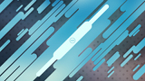

| Versions | Animatable | Beatmap Skinnable | Blend Mode | Origin | Suggested SD Size |
| :-: | :-: | :-: | :-: | :-: | :-: |
| All | ![No][false] | ![No][false] | Normal | Centre | 1366x768 (ดู notes) |

Notes:

- ต้องมี [osu!supporter](/wiki/osu!supporter)
- element นี้ถูกจัดตำแหน่งไว้ตรงกลางและตั้งค่าเป็น cover (เติมเต็มทั้งความกว้างและความสูงโดยคง aspect ratio ไว้ แต่ crop ส่วนที่อยู่นอกหน้าต่างเกม)
- โดยค่าเริ่มต้น osu! มีชุดรูปพื้นหลังที่จะสลับวนไปเรื่อย ๆ
  - ถ้าทำสกิน element นี้ไว้ และผู้ใช้มี tag osu!supporter element นี้จะ override พฤติกรรมดังกล่าว
- element นี้ใช้เป็นเพลย์ฟีลด์ถ้าบีตแมปไม่มีพื้นหลัง
- ตัวเลือก seasonal background อาจมีผลต่อการมองเห็น element นี้
  - ถ้าตั้งเป็น `Always` seasonal background จะ override element นี้
  - ถ้าตั้งเป็น `Sometimes` seasonal background จะ override element นี้ขณะที่เปิดใช้งานอยู่
- ใช้เฉพาะนามสกุล `.jpg` เท่านั้น
  - ถ้าชนิดรูปเป็น `.png` ให้เปลี่ยนนามสกุลเป็น `.jpg`
    - ถ้าพื้นหลังโปร่งใส สีพื้นหลังจะเป็นสีดำ
- ผู้เล่นสามารถลากและวางรูปเพื่อเขียนทับรูปที่สกินทำไว้ได้ **การทำแบบนี้จะแทนที่รูปในโฟลเดอร์สกิน!**

---

`welcome_text.png`

| Versions | Animatable | Beatmap Skinnable | Blend Mode | Origin | Suggested SD Size |
| :-: | :-: | :-: | :-: | :-: | :-: |
| All | ![No][false] | ![No][false] | Normal | Centre | - |

Notes:

- ต้องมี [osu!supporter](/wiki/osu!supporter)
- element นี้ปรากฏตอนเริ่ม client
- element นี้จะกางออกและขยาย จากนั้น fade out

---

`menu-snow.png`

| Versions | Animatable | Beatmap Skinnable | Blend Mode | Origin | Suggested SD Size |
| :-: | :-: | :-: | :-: | :-: | :-: |
| All | ![No][false] | ![No][false] | Additive | Centre | 32x32 |

Notes:

- ถ้าไม่ได้ทำสกินไว้ จะใช้ไอคอนขนาดเล็กของโหมดเกมปัจจุบันแทน
- ต้องเปิดใช้งานใน[ตัวเลือก](/wiki/Client/Options)จึงจะเห็น
  - ตัวเลือกนี้อาจถูกบังคับเปิดใช้งานในช่วงวันหยุด (Christmas)

## ปุ่ม

`button-left.png`

| Versions | Animatable | Beatmap Skinnable | Blend Mode | Origin | Suggested SD Size |
| :-: | :-: | :-: | :-: | :-: | :-: |
| All | ![No][false] | ![No][false] | Multiplicative | Top Right | - |

Notes:

- ใช้ความสูงเดียวกับชิ้นส่วนปุ่มอื่น ๆ
- การ tint สีแตกต่างกันตามสถานะปุ่ม

---

`button-middle.png`

| Versions | Animatable | Beatmap Skinnable | Blend Mode | Origin | Suggested SD Size |
| :-: | :-: | :-: | :-: | :-: | :-: |
| All | ![No][false] | ![No][false] | Multiplicative | Top | - |

Notes:

- element นี้จะถูกยืดให้พอดีกับความกว้างที่ต้องใช้
- ใช้ความสูงเดียวกับชิ้นส่วนปุ่มอื่น ๆ
- การ tint สีแตกต่างกันตามสถานะปุ่ม

---

`button-right.png`

| Versions | Animatable | Beatmap Skinnable | Blend Mode | Origin | Suggested SD Size |
| :-: | :-: | :-: | :-: | :-: | :-: |
| All | ![No][false] | ![No][false] | Multiplicative | Top Left | - |

Notes:

- ใช้ความสูงเดียวกับชิ้นส่วนปุ่มอื่น ๆ
- การ tint สีแตกต่างกันตามสถานะปุ่ม

## Cursor

`cursor.png`

| Versions | Animatable | Beatmap Skinnable | Blend Mode | Origin | Suggested SD Size |
| :-: | :-: | :-: | :-: | :-: | :-: |
| All | ![No][false] | ![Yes][true] | Normal | Centre | - |

Notes:

- โดยค่าเริ่มต้น element นี้จะหมุนและขยาย (เมื่อคลิก)
- command ใน [skin.ini](/wiki/Skinning/skin.ini):
  - ถ้าต้องการปิด cursor expand (เมื่อคลิก) ให้ตั้งค่า `CursorExpand` เป็น `0`
  - ถ้าต้องการปิด cursor rotate ให้ตั้งค่า `CursorRotate` เป็น `0`

---

`cursormiddle.png`

| Versions | Animatable | Beatmap Skinnable | Blend Mode | Origin | Suggested SD Size |
| :-: | :-: | :-: | :-: | :-: | :-: |
| All | ![No][false] | ![Yes][true] | Normal | Centre | - |

Notes:

- element นี้จะไม่หมุนและไม่ขยาย (เมื่อคลิก)
- element นี้อยู่เหนือ `cursor.png`

---

`cursor-smoke.png`

| Versions | Animatable | Beatmap Skinnable | Blend Mode | Origin | Suggested SD Size |
| :-: | :-: | :-: | :-: | :-: | :-: |
| All | ![No][false] | ![Yes][true] | Normal | Centre | - |

Notes:

- element นี้ใช้เมื่อผู้เล่นกดปุ่ม smoke
  - โดยค่าเริ่มต้น ปุ่ม smoke ถูก bind ไว้ที่ `C`

---

`cursortrail.png`

| Versions | Animatable | Beatmap Skinnable | Blend Mode | Origin | Suggested SD Size |
| :-: | :-: | :-: | :-: | :-: | :-: |
| All | ![No][false] | ![Yes][true] | Normal | Centre | - |

Notes:

- element นี้อยู่ใต้ `cursor.png`
- ถ้ามี `cursormiddle.png` จะใช้ trail ที่ยาวกว่า
- โดยค่าเริ่มต้น element นี้จะไม่หมุน
- command ใน [skin.ini](/wiki/Skinning/skin.ini):
  - ถ้าต้องการเปิด cursortrail rotate ให้ตั้งค่า `CursorTrailRotate` เป็น `1`

---

`cursor-ripple.png`

| Versions | Animatable | Beatmap Skinnable | Blend Mode | Origin | Suggested SD Size |
| :-: | :-: | :-: | :-: | :-: | :-: |
| All | ![No][false] | unknown | Additive | Centre | - |

Notes:

- element นี้ใช้เมื่อผู้เล่นกดปุ่ม Left-Click หรือ Right-Click บนคีย์บอร์ดหรือเมาส์
  - โดยค่าเริ่มต้น ปุ่ม Left-Click ถูก bind ไว้ที่ `Z`
  - โดยค่าเริ่มต้น ปุ่ม Right-Click ถูก bind ไว้ที่ `X`

## ไอคอนม็อด

*หน้าหลัก: [Game Modifiers](/wiki/Gameplay/Game_modifier)*

---

`selection-mod-autoplay.png`

| Versions | Animatable | Beatmap Skinnable | Blend Mode | Origin | Suggested SD Size |
| :-: | :-: | :-: | :-: | :-: | :-: |
| All | ![No][false] | ![Yes][true] | Normal | Centre | 64x64 |

---

`selection-mod-cinema.png`

| Versions | Animatable | Beatmap Skinnable | Blend Mode | Origin | Suggested SD Size |
| :-: | :-: | :-: | :-: | :-: | :-: |
| All | ![No][false] | ![Yes][true] | Normal | Centre | 64x64 |

Notes:

- คลิกไอคอนม็อด Auto เพื่อดูไอคอนนี้

---

`selection-mod-doubletime.png`

| Versions | Animatable | Beatmap Skinnable | Blend Mode | Origin | Suggested SD Size |
| :-: | :-: | :-: | :-: | :-: | :-: |
| All | ![No][false] | ![Yes][true] | Normal | Centre | 64x64 |

---

`selection-mod-easy.png`

| Versions | Animatable | Beatmap Skinnable | Blend Mode | Origin | Suggested SD Size |
| :-: | :-: | :-: | :-: | :-: | :-: |
| All | ![No][false] | ![Yes][true] | Normal | Centre | 64x64 |

---

`selection-mod-fadein.png`

| Versions | Animatable | Beatmap Skinnable | Blend Mode | Origin | Suggested SD Size |
| :-: | :-: | :-: | :-: | :-: | :-: |
| All | ![No][false] | ![Yes][true] | Normal | Centre | 64x64 |

Notes:

- element นี้ใช้เฉพาะ [osu!mania](/wiki/Game_mode/osu!mania)

---

`selection-mod-flashlight.png`

| Versions | Animatable | Beatmap Skinnable | Blend Mode | Origin | Suggested SD Size |
| :-: | :-: | :-: | :-: | :-: | :-: |
| All | ![No][false] | ![Yes][true] | Normal | Centre | 64x64 |

---

`selection-mod-halftime.png`

| Versions | Animatable | Beatmap Skinnable | Blend Mode | Origin | Suggested SD Size |
| :-: | :-: | :-: | :-: | :-: | :-: |
| All | ![No][false] | ![Yes][true] | Normal | Centre | 64x64 |

---

`selection-mod-hardrock.png`

| Versions | Animatable | Beatmap Skinnable | Blend Mode | Origin | Suggested SD Size |
| :-: | :-: | :-: | :-: | :-: | :-: |
| All | ![No][false] | ![Yes][true] | Normal | Centre | 64x64 |

---

`selection-mod-hidden.png`

| Versions | Animatable | Beatmap Skinnable | Blend Mode | Origin | Suggested SD Size |
| :-: | :-: | :-: | :-: | :-: | :-: |
| All | ![No][false] | ![Yes][true] | Normal | Centre | 64x64 |

Notes:

- สำหรับ [osu!mania](/wiki/Game_mode/osu!mania) ให้คลิกไอคอนม็อด Fade In เพื่อดูไอคอนนี้

---

`selection-mod-key1.png`

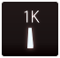

| Versions | Animatable | Beatmap Skinnable | Blend Mode | Origin | Suggested SD Size |
| :-: | :-: | :-: | :-: | :-: | :-: |
| All | ![No][false] | ![Yes][true] | Normal | Centre | 64x64 |

Notes:

- element นี้ใช้เฉพาะ [osu!mania](/wiki/Game_mode/osu!mania)
- สลับดูผ่านม็อด xK เพื่อดูไอคอนนี้

---

`selection-mod-key2.png`

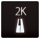

| Versions | Animatable | Beatmap Skinnable | Blend Mode | Origin | Suggested SD Size |
| :-: | :-: | :-: | :-: | :-: | :-: |
| All | ![No][false] | ![Yes][true] | Normal | Centre | 64x64 |

Notes:

- element นี้ใช้เฉพาะ [osu!mania](/wiki/Game_mode/osu!mania)
- สลับดูผ่านม็อด xK เพื่อดูไอคอนนี้

---

`selection-mod-key3.png`

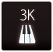

| Versions | Animatable | Beatmap Skinnable | Blend Mode | Origin | Suggested SD Size |
| :-: | :-: | :-: | :-: | :-: | :-: |
| All | ![No][false] | ![Yes][true] | Normal | Centre | 64x64 |

Notes:

- element นี้ใช้เฉพาะ [osu!mania](/wiki/Game_mode/osu!mania)
- สลับดูผ่านม็อด xK เพื่อดูไอคอนนี้

---

`selection-mod-key4.png`

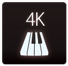

| Versions | Animatable | Beatmap Skinnable | Blend Mode | Origin | Suggested SD Size |
| :-: | :-: | :-: | :-: | :-: | :-: |
| All | ![No][false] | ![Yes][true] | Normal | Centre | 64x64 |

Notes:

- element นี้ใช้เฉพาะ [osu!mania](/wiki/Game_mode/osu!mania)

---

`selection-mod-key5.png`

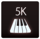

| Versions | Animatable | Beatmap Skinnable | Blend Mode | Origin | Suggested SD Size |
| :-: | :-: | :-: | :-: | :-: | :-: |
| All | ![No][false] | ![Yes][true] | Normal | Centre | 64x64 |

Notes:

- element นี้ใช้เฉพาะ [osu!mania](/wiki/Game_mode/osu!mania)
- สลับดูผ่านม็อด xK เพื่อดูไอคอนนี้

---

`selection-mod-key6.png`

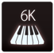

| Versions | Animatable | Beatmap Skinnable | Blend Mode | Origin | Suggested SD Size |
| :-: | :-: | :-: | :-: | :-: | :-: |
| All | ![No][false] | ![Yes][true] | Normal | Centre | 64x64 |

Notes:

- element นี้ใช้เฉพาะ [osu!mania](/wiki/Game_mode/osu!mania)
- สลับดูผ่านม็อด xK เพื่อดูไอคอนนี้

---

`selection-mod-key7.png`

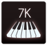

| Versions | Animatable | Beatmap Skinnable | Blend Mode | Origin | Suggested SD Size |
| :-: | :-: | :-: | :-: | :-: | :-: |
| All | ![No][false] | ![Yes][true] | Normal | Centre | 64x64 |

Notes:

- element นี้ใช้เฉพาะ [osu!mania](/wiki/Game_mode/osu!mania)
- สลับดูผ่านม็อด xK เพื่อดูไอคอนนี้

---

`selection-mod-key8.png`

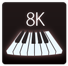

| Versions | Animatable | Beatmap Skinnable | Blend Mode | Origin | Suggested SD Size |
| :-: | :-: | :-: | :-: | :-: | :-: |
| All | ![No][false] | ![Yes][true] | Normal | Centre | 64x64 |

Notes:

- element นี้ใช้เฉพาะ [osu!mania](/wiki/Game_mode/osu!mania)
- สลับดูผ่านม็อด xK เพื่อดูไอคอนนี้

---

`selection-mod-key9.png`

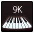

| Versions | Animatable | Beatmap Skinnable | Blend Mode | Origin | Suggested SD Size |
| :-: | :-: | :-: | :-: | :-: | :-: |
| All | ![No][false] | ![Yes][true] | Normal | Centre | 64x64 |

Notes:

- element นี้ใช้เฉพาะ [osu!mania](/wiki/Game_mode/osu!mania)
- สลับดูผ่านม็อด xK เพื่อดูไอคอนนี้

---

`selection-mod-keycoop.png`

| Versions | Animatable | Beatmap Skinnable | Blend Mode | Origin | Suggested SD Size |
| :-: | :-: | :-: | :-: | :-: | :-: |
| All | ![No][false] | ![Yes][true] | Normal | Centre | 64x64 |

Notes:

- element นี้ใช้เฉพาะ [osu!mania](/wiki/Game_mode/osu!mania)

---

`selection-mod-mirror.png`

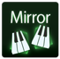

| Versions | Animatable | Beatmap Skinnable | Blend Mode | Origin | Suggested SD Size |
| :-: | :-: | :-: | :-: | :-: | :-: |
| All | ![No][false] | ![Yes][true] | Normal | Centre | 64x64 |

Notes:

- element นี้ใช้เฉพาะ [osu!mania](/wiki/Game_mode/osu!mania)

---

`selection-mod-nightcore.png`

| Versions | Animatable | Beatmap Skinnable | Blend Mode | Origin | Suggested SD Size |
| :-: | :-: | :-: | :-: | :-: | :-: |
| All | ![No][false] | ![Yes][true] | Normal | Centre | 64x64 |

Notes:

- คลิกไอคอนม็อด Double Time เพื่อดูไอคอนนี้

---

`selection-mod-nofail.png`

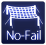

| Versions | Animatable | Beatmap Skinnable | Blend Mode | Origin | Suggested SD Size |
| :-: | :-: | :-: | :-: | :-: | :-: |
| All | ![No][false] | ![Yes][true] | Normal | Centre | 64x64 |

---

`selection-mod-perfect.png`

| Versions | Animatable | Beatmap Skinnable | Blend Mode | Origin | Suggested SD Size |
| :-: | :-: | :-: | :-: | :-: | :-: |
| All | ![No][false] | ![Yes][true] | Normal | Centre | 64x64 |

Notes:

- คลิกไอคอนม็อด Sudden Death เพื่อดูไอคอนนี้

---

`selection-mod-random.png`

| Versions | Animatable | Beatmap Skinnable | Blend Mode | Origin | Suggested SD Size |
| :-: | :-: | :-: | :-: | :-: | :-: |
| All | ![No][false] | ![Yes][true] | Normal | Centre | 64x64 |

Notes:

- element นี้ใช้เฉพาะ [osu!mania](/wiki/Game_mode/osu!mania)

---

`selection-mod-relax.png`

| Versions | Animatable | Beatmap Skinnable | Blend Mode | Origin | Suggested SD Size |
| :-: | :-: | :-: | :-: | :-: | :-: |
| All | ![No][false] | ![Yes][true] | Normal | Centre | 64x64 |

Notes:

- element นี้เป็นม็อดเฉพาะ [osu!](/wiki/Game_mode/osu!), [osu!taiko](/wiki/Game_mode/osu!taiko) และ [osu!catch](/wiki/Game_mode/osu!catch)

---

`selection-mod-relax2.png`

| Versions | Animatable | Beatmap Skinnable | Blend Mode | Origin | Suggested SD Size |
| :-: | :-: | :-: | :-: | :-: | :-: |
| All | ![No][false] | ![Yes][true] | Normal | Centre | 64x64 |

Notes:

- element นี้เป็นม็อดเฉพาะ [osu!](/wiki/Game_mode/osu!)
- ม็อดนี้จะขยับ cursor ให้ผู้เล่นเอง ผู้เล่นต้องกด tap หรือ click เท่านั้น

---

`selection-mod-scorev2.png`

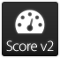

| Versions | Animatable | Beatmap Skinnable | Blend Mode | Origin | Suggested SD Size |
| :-: | :-: | :-: | :-: | :-: | :-: |
| All | ![No][false] | ![Yes][true] | Normal | Centre | 64x64 |

---

`selection-mod-spunout.png`

| Versions | Animatable | Beatmap Skinnable | Blend Mode | Origin | Suggested SD Size |
| :-: | :-: | :-: | :-: | :-: | :-: |
| All | ![No][false] | ![Yes][true] | Normal | Centre | 64x64 |

Notes:

- element นี้เป็นม็อดเฉพาะ [osu!](/wiki/Game_mode/osu!)

---

`selection-mod-suddendeath.png`

| Versions | Animatable | Beatmap Skinnable | Blend Mode | Origin | Suggested SD Size |
| :-: | :-: | :-: | :-: | :-: | :-: |
| All | ![No][false] | ![Yes][true] | Normal | Centre | 64x64 |

---

`selection-mod-target.png`

| Versions | Animatable | Beatmap Skinnable | Blend Mode | Origin | Suggested SD Size |
| :-: | :-: | :-: | :-: | :-: | :-: |
| All | ![No][false] | ![Yes][true] | Normal | Centre | 64x64 |

- ม็อดนี้มีเฉพาะใน stream cuttingedge เท่านั้น
- element นี้เป็นม็อดเฉพาะ [osu!](/wiki/Game_mode/osu!)

---

`selection-mod-freemodallowed.png`

| Versions | Animatable | Beatmap Skinnable | Blend Mode | Origin | Suggested SD Size |
| :-: | :-: | :-: | :-: | :-: | :-: |
| All | ![No][false] | ![Yes][true] | Normal | Centre | 64x64 |

- ม็อดนี้ไม่มีรูปในเกม
- ม็อดนี้ไม่แสดงใน mod selection หรือ leaderboard
- indicator สำหรับ play ที่ใช้ม็อดและชุดม็อดบางแบบ
  - จะไม่แสดงถ้าใช้เฉพาะ `Score V2`, `Auto`, `Double Time`, `Nightcore` หรือ `Half Time` อย่างใดอย่างหนึ่งเดี่ยว ๆ แต่ถ้าใช้ร่วมกับม็อดอื่นจะทำให้ม็อดแสดงขึ้น

---

`selection-mod-touchdevice.png`

| Versions | Animatable | Beatmap Skinnable | Blend Mode | Origin | Suggested SD Size |
| :-: | :-: | :-: | :-: | :-: | :-: |
| All | ![No][false] | ![Yes][true] | Normal | Centre | 64x64 |

- ม็อดนี้ไม่มีรูปในเกม
- ม็อดนี้ไม่แสดงใน mod selection
- indicator สำหรับ play ที่เล่นด้วย touchscreen
  - client ใช้อัลกอริทึมเบื้องหลังเพื่อคำนวณว่า play นั้นเล่นด้วย touchscreen หรือไม่ ถ้ามี cursor warp มากเกินไป ค่านี้อาจถูกใช้กับ play นั้น

## Offset wizard

*หน้าหลัก: [Offset Wizard](/wiki/Guides/How_to_use_the_Offset_Wizard)*

---

`options-offset-tick.png`

| Versions | Animatable | Beatmap Skinnable | Blend Mode | Origin | Suggested SD Size |
| :-: | :-: | :-: | :-: | :-: | :-: |
| All | ![No][false] | ![No][false] | Multiplicative | Centre | - |

Notes:

- การ tint สีแตกต่างกันตามสถานะ tick

## เพลย์ฟีลด์

`play-skip.png`

| Versions | Animatable | Beatmap Skinnable | Blend Mode | Origin | Suggested SD Size |
| :-: | :-: | :-: | :-: | :-: | :-: |
| All | ![Yes][true] | ![Yes][true] | Multiplicative | Bottom Right | - |

Notes:

- ชื่อ animation: `play-skip-{n}.png`

---

`play-unranked.png`

| Versions | Animatable | Beatmap Skinnable | Blend Mode | Origin | Suggested SD Size |
| :-: | :-: | :-: | :-: | :-: | :-: |
| All | ![No][false] | ![Yes][true] | Multiplicative | Centre | - |

Notes:

- element นี้จะแสดงเมื่อใช้ม็อดที่ปิดการส่ง score

---

`play-warningarrow.png`

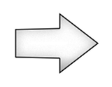

| Versions | Animatable | Beatmap Skinnable | Blend Mode | Origin | Suggested SD Size |
| :-: | :-: | :-: | :-: | :-: | :-: |
| All | ![No][false] | ![No][false] (ดู notes) | Multiplicative | Centre | - |

Notes:

- สถานะ beatmap skinnable คาดว่าน่าจะเป็น bug
- การ tint สีแตกต่างกันตามเวอร์ชัน
  - หน้าจอ pause:
    - ทุกเวอร์ชัน: tint เป็นสีน้ำเงิน
  - ตอนออกจาก break:
    - v1.0: tint เป็นสีขาว
    - v2.0+: tint เป็นสีแดง

---

`arrow-pause.png`

| Versions | Animatable | Beatmap Skinnable | Blend Mode | Origin | Suggested SD Size |
| :-: | :-: | :-: | :-: | :-: | :-: |
| All | ![No][false] | ![No][false] (ดู notes) | Normal | Centre | - |

Notes:

- สถานะ beatmap skinnable คาดว่าน่าจะเป็น bug
- ถ้าทำสกินไว้ element นี้จะ override `play-warningarrow.png`
- element นี้ใช้ในหน้าจอ pause และ fail
- ไม่ถูก tint

---

`arrow-warning.png`

| Versions | Animatable | Beatmap Skinnable | Blend Mode | Origin | Suggested SD Size |
| :-: | :-: | :-: | :-: | :-: | :-: |
| All | ![No][false] | ![No][false] (ดู notes) | Normal | Centre | - |

Notes:

- สถานะ beatmap skinnable คาดว่าน่าจะเป็น bug
- ถ้าทำสกินไว้ element นี้จะ override `play-warningarrow.png`
- ใช้สำหรับคำเตือนตอนท้าย break
- ไม่ถูก tint

---

`masking-border.png`

| Versions | Animatable | Beatmap Skinnable | Blend Mode | Origin | Suggested SD Size |
| :-: | :-: | :-: | :-: | :-: | :-: |
| All | ![No][false] | ![No][false] | Normal | Right | ความสูงสูงสุด: 768px |

Notes:

- ใช้เมื่อเล่น storyboard แบบ 4:3 บนจอกว้าง
- ระหว่าง beatmapping ให้ปิด `Widescreen support` ใน [song setup](/wiki/Client/Beatmap_editor/Song_setup) เพื่อให้ element นี้ปรากฏ
- element นี้จะถูกยืดให้พอดีกับพื้นที่ที่ต้องใช้
- pillar ด้านขวาถูก flip แนวนอน

---

`multi-skipped.png`

| Versions | Animatable | Beatmap Skinnable | Blend Mode | Origin | Suggested SD Size |
| :-: | :-: | :-: | :-: | :-: | :-: |
| All | ![No][false] | ![Yes][true] | Normal | Bottom Right | 60x30 |

Notes:

- element นี้ใช้ในเกม multi โดยจะเห็นข้าง score ของผู้เล่น (ด้านข้าง) เมื่อผู้เล่น vote skip intro ของบีตแมป

---

`section-fail.png`

| Versions | Animatable | Beatmap Skinnable | Blend Mode | Origin | Suggested SD Size |
| :-: | :-: | :-: | :-: | :-: | :-: |
| All | ![No][false] | ![Yes][true] | Normal | Centre | - |

Notes:

- element นี้จะเห็นเมื่อผู้เล่นมี HP ต่ำ ประมาณต่ำกว่า 50% ระหว่าง break ที่ยาวพอ

---

`section-pass.png`

| Versions | Animatable | Beatmap Skinnable | Blend Mode | Origin | Suggested SD Size |
| :-: | :-: | :-: | :-: | :-: | :-: |
| All | ![No][false] | ![Yes][true] | Normal | Centre | - |

Notes:

- element นี้จะเห็นเมื่อผู้เล่นมี HP สูง ประมาณมากกว่า 50% ระหว่าง break ที่ยาวพอ

### Countdown

`count1.png`

| Versions | Animatable | Beatmap Skinnable | Blend Mode | Origin | Suggested SD Size |
| :-: | :-: | :-: | :-: | :-: | :-: |
| 1.0 | ![No][false] | ![Yes][true] | Normal | Centre | - |
| 2.0+ | ![No][false] | ![Yes][true] | Normal | Centre | - |

Notes:

- ควรเขียนว่า "1" หรือ "3"

---

`count2.png`

| Versions | Animatable | Beatmap Skinnable | Blend Mode | Origin | Suggested SD Size |
| :-: | :-: | :-: | :-: | :-: | :-: |
| 1.0 | ![No][false] | ![Yes][true] | Normal | Right | - |
| 2.0+ | ![No][false] | ![Yes][true] | Normal | Centre | - |

Notes:

- ควรเขียนว่า "2"

---

`count3.png`

| Versions | Animatable | Beatmap Skinnable | Blend Mode | Origin | Suggested SD Size |
| :-: | :-: | :-: | :-: | :-: | :-: |
| 1.0 | ![No][false] | ![Yes][true] | Normal | Left | - |
| 2.0+ | ![No][false] | ![Yes][true] | Normal | Centre | - |

Notes:

- ควรเขียนว่า "3" หรือ "1"

---

`go.png`

| Versions | Animatable | Beatmap Skinnable | Blend Mode | Origin | Suggested SD Size |
| :-: | :-: | :-: | :-: | :-: | :-: |
| All | ![No][false] | ![Yes][true] | Normal | Centre | - |

Notes:

- ควรเขียนว่า "Go!"

---

`ready.png`

| Versions | Animatable | Beatmap Skinnable | Blend Mode | Origin | Suggested SD Size |
| :-: | :-: | :-: | :-: | :-: | :-: |
| All | ![No][false] | ![Yes][true] | Normal | Centre | - |

Notes:

- ควรเขียนว่า "Are You Ready?" หรือ "Ready?"

### Hit bursts

*หน้าหลัก: [Skinning/FAQ § ลำดับคะแนนบนหน้าจอ ranking](/wiki/Skinning/FAQ#ranking-screen-hit-score-hierarchy)*

---

`hit0.png`

| Versions | Animatable | Beatmap Skinnable | Blend Mode | Origin | Suggested SD Size |
| :-: | :-: | :-: | :-: | :-: | :-: |
| All | ![Yes][true] (ดู notes) | ![Yes][true] | Normal | Centre | - |

Notes:

- ชื่อ animation: `hit0-{n}.png`
- Animation rate ถูกล็อกไว้ที่ 60 FPS
- ถ้าใช้ animation:
  - animation จะไม่ loop แต่เฟรมสุดท้ายจะค้างไว้จนกว่าจะ fade out
  - ไม่ใช้พฤติกรรมแบบ single frame

---

`hit50.png`

| Versions | Animatable | Beatmap Skinnable | Blend Mode | Origin | Suggested SD Size |
| :-: | :-: | :-: | :-: | :-: | :-: |
| All | ![Yes][true] (ดู notes) | ![Yes][true] | Normal | Centre | - |

Notes:

- ชื่อ animation: `hit50-{n}.png`
- Animation rate ถูกล็อกไว้ที่ 60 FPS
- ถ้าใช้ animation:
  - animation จะไม่ loop แต่เฟรมสุดท้ายจะค้างไว้จนกว่าจะ fade out
  - ไม่ใช้พฤติกรรมแบบ single frame

---

`hit100.png`

| Versions | Animatable | Beatmap Skinnable | Blend Mode | Origin | Suggested SD Size |
| :-: | :-: | :-: | :-: | :-: | :-: |
| All | ![Yes][true] (ดู notes) | ![Yes][true] | Normal | Centre | - |

Notes:

- ชื่อ animation: `hit100-{n}.png`
- Animation rate ถูกล็อกไว้ที่ 60 FPS
- ถ้าใช้ animation:
  - animation จะไม่ loop แต่เฟรมสุดท้ายจะค้างไว้จนกว่าจะ fade out
  - ไม่ใช้พฤติกรรมแบบ single frame

---

`hit100k.png`

| Versions | Animatable | Beatmap Skinnable | Blend Mode | Origin | Suggested SD Size |
| :-: | :-: | :-: | :-: | :-: | :-: |
| All | ![Yes][true] (ดู notes) | ![Yes][true] | Normal | Centre | - |

Notes:

- ชื่อ animation: `hit100k-{n}.png`
- Animation rate ถูกล็อกไว้ที่ 60 FPS
- ถ้าใช้ animation:
  - animation จะไม่ loop แต่เฟรมสุดท้ายจะค้างไว้จนกว่าจะ fade out
  - ไม่ใช้พฤติกรรมแบบ single frame

---

`hit300.png`

| Versions | Animatable | Beatmap Skinnable | Blend Mode | Origin | Suggested SD Size |
| :-: | :-: | :-: | :-: | :-: | :-: |
| All | ![Yes][true] (ดู notes) | ![Yes][true] | Normal | Centre | - |

Notes:

- ชื่อ animation: `hit300-{n}.png`
- Animation rate ถูกล็อกไว้ที่ 60 FPS
- ถ้าใช้ animation:
  - animation จะไม่ loop แต่เฟรมสุดท้ายจะค้างไว้จนกว่าจะ fade out
  - ไม่ใช้พฤติกรรมแบบ single frame

---

`hit300g.png`

| Versions | Animatable | Beatmap Skinnable | Blend Mode | Origin | Suggested SD Size |
| :-: | :-: | :-: | :-: | :-: | :-: |
| All | ![Yes][true] (ดู notes) | ![Yes][true] | Normal | Centre | - |

Notes:

- ชื่อ animation: `hit300g-{n}.png`
- Animation rate ถูกล็อกไว้ที่ 60 FPS
- ถ้าใช้ animation:
  - animation จะไม่ loop แต่เฟรมสุดท้ายจะค้างไว้จนกว่าจะ fade out
  - ไม่ใช้พฤติกรรมแบบ single frame

---

`hit300k.png`

| Versions | Animatable | Beatmap Skinnable | Blend Mode | Origin | Suggested SD Size |
| :-: | :-: | :-: | :-: | :-: | :-: |
| All | ![Yes][true] (ดู notes) | ![Yes][true] | Normal | Centre | - |

Notes:

- ชื่อ animation: `hit300k-{n}.png`
- Animation rate ถูกล็อกไว้ที่ 60 FPS
- ถ้าใช้ animation:
  - animation จะไม่ loop แต่เฟรมสุดท้ายจะค้างไว้จนกว่าจะ fade out
  - ไม่ใช้พฤติกรรมแบบ single frame
- element นี้ไม่แสดงบนหน้าจอ ranking

### Input overlay

`inputoverlay-background.png`

| Versions | Animatable | Beatmap Skinnable | Blend Mode | Origin | Suggested SD Size |
| :-: | :-: | :-: | :-: | :-: | :-: |
| All | ![No][false] | ![Yes][true] | Normal | Top Right | 193x55 |

Notes:

- element นี้ถูกวางที่ความสูง 320px
- เนื่องจากรูปถูกหมุน origin บนตัวรูปเองจึงเป็น Top Left
- element นี้ใช้ใน [osu!](/wiki/Game_mode/osu!) และ [osu!catch](/wiki/Game_mode/osu!catch)
- element นี้จะถูกหมุนตามเข็มนาฬิกา 90 องศา และถูกยืด 1.05 เท่าในเกม
- ต้องเปิดใช้งานใน[ตัวเลือก](/wiki/Client/Options)จึงจะเห็น

---

`inputoverlay-key.png`

| Versions | Animatable | Beatmap Skinnable | Blend Mode | Origin | Suggested SD Size |
| :-: | :-: | :-: | :-: | :-: | :-: |
| All | ![No][false] | ![Yes][true] | Multiplicative | Centre | 43x46 |

Notes:

- element นี้ใช้ใน [osu!](/wiki/Game_mode/osu!) และ [osu!catch](/wiki/Game_mode/osu!catch)
- การจัดตำแหน่งแตกต่างกันตามแต่ละ key:
  - ห่างจากขอบจอ 24px
  - K1/L: ที่ความสูง 350px
  - K2/R: ที่ความสูง 398px
  - M1/D: ที่ความสูง 446px
  - M2: ที่ความสูง 492px
- เปิด/ปิดได้ใน[ตัวเลือก](/wiki/Client/Options)
- หดลงสั้น ๆ เมื่อกด key
- การ tint สีแตกต่างกันตามตำแหน่งและสถานะของปุ่ม:
  - สีขาว ถ้าไม่ได้กด key
  - สีเหลือง ถ้ากด key และอยู่ครึ่งบน
  - สีม่วง ถ้ากด key และอยู่ครึ่งล่าง

### Pause screen

`pause-overlay.png`

| Versions | Animatable | Beatmap Skinnable | Blend Mode | Origin | Suggested SD Size |
| :-: | :-: | :-: | :-: | :-: | :-: |
| All | ![No][false] | ![Yes][true] | Normal | Centre | 1366x768 |

Notes:

- เมื่อเกมถูก pause เพลย์ฟีลด์จะมืดลง และไฟล์นี้จะ overlay ทับด้านบน
- element นี้จะไม่ยืดให้พอดี
- ความสูงเต็มของรูปคือ 768px
- รูปที่เล็กกว่าจะแสดงพร้อมขอบโปร่งใส ส่วนรูปที่ใหญ่กว่าจะแสดงเพียงบางส่วน
- element นี้สามารถเป็นไฟล์ `.jpg` ได้ด้วย (และใช้นามสกุล `.jpg` ได้)
  - osu! ให้ความสำคัญกับ `.png` มากกว่า `.jpg`

---

`fail-background.png`

| Versions | Animatable | Beatmap Skinnable | Blend Mode | Origin | Suggested SD Size |
| :-: | :-: | :-: | :-: | :-: | :-: |
| All | ![No][false] | ![Yes][true] | Normal | Centre | 1366x768 |

Notes:

- เมื่อผู้เล่น fail เพลย์ฟีลด์จะมืดลง และไฟล์นี้จะ overlay ทับด้านบน
- element นี้จะถูกยืดให้พอดี
- element นี้สามารถเป็นไฟล์ `.jpg` ได้ด้วย (และใช้นามสกุล `.jpg` ได้)
  - osu! ให้ความสำคัญกับ `.png` มากกว่า `.jpg`

---

`pause-back.png`

| Versions | Animatable | Beatmap Skinnable | Blend Mode | Origin | Suggested SD Size |
| :-: | :-: | :-: | :-: | :-: | :-: |
| All | ![No][false] | ![Yes][true] | Normal | Centre | - |

Notes:

- element นี้ถูกวางที่ความสูง 576px
- element นี้จะเห็นบนหน้าจอ fail และ pause

---

`pause-continue.png`

| Versions | Animatable | Beatmap Skinnable | Blend Mode | Origin | Suggested SD Size |
| :-: | :-: | :-: | :-: | :-: | :-: |
| All | ![No][false] | ![Yes][true] | Normal | Centre | - |

- element นี้ถูกวางที่ความสูง 224px
- element นี้จะเห็นบนหน้าจอ pause

---

`pause-replay.png`

| Versions | Animatable | Beatmap Skinnable | Blend Mode | Origin | Suggested SD Size |
| :-: | :-: | :-: | :-: | :-: | :-: |
| All | ![No][false] | ![No][false] | Normal | Right | - |

Notes:

- element นี้ปรากฏบนหน้าจอ ranking (หลังเล่นแมปจบหรือดู score)
- element นี้ถูกจัดตำแหน่งไว้ที่ความสูง 672px หรือ 576px ถ้าไม่มี `pause-retry.png`

---

`pause-retry.png`

| Versions | Animatable | Beatmap Skinnable | Blend Mode | Origin | Suggested SD Size |
| :-: | :-: | :-: | :-: | :-: | :-: |
| All | ![No][false] | ![Yes][true] | Normal | (Varies) | - |

Notes:

- การจัดตำแหน่งแตกต่างกันไป:
  - หน้าจอ pause หรือ fail:
    - Centre, วางที่ความสูง 400px
  - หน้าจอ ranking:
    - Right, วางที่ความสูง 576px
- element นี้ปรากฏบนหน้าจอ ranking หลังเล่นแมปจบ และบนหน้าจอ pause กับ fail

### Scorebar

`scorebar-bg.png`

| Versions | Animatable | Beatmap Skinnable | Blend Mode | Origin | Suggested SD Size |
| :-: | :-: | :-: | :-: | :-: | :-: |
| All | ![No][false] | ![Yes][true] | Normal | Top Left | - |

Notes:

- element นี้ไม่มีข้อจำกัดเรื่องขนาด
- เมื่อใช้ใน [osu!mania](/wiki/Game_mode/osu!mania) element นี้จะถูกหมุนทวนเข็มนาฬิกา 90 องศา, scale เป็นขนาด 0.7 เท่า และวางไว้ด้านขวาล่างของ stage

---

`scorebar-colour.png`

| Versions | Animatable | Beatmap Skinnable | Blend Mode | Origin | Suggested SD Size |
| :-: | :-: | :-: | :-: | :-: | :-: |
| All | ![Yes][true] | ![Yes][true] | (Varies) | Top Left | ความสูงสูงสุด: 120px |

Notes:

- ชื่อ animation: `scorebar-colour-{n}.png`.
- Blend mode แตกต่างกันไป:
  - เป็น Multiplicative ถ้าใช้ `scorebar-marker.png`
    - tint เป็นสีดำเมื่อใกล้โซน critical และ tint เป็นสีแดงในโซน critical
  - เป็น Normal ในกรณีอื่น
- การจัดตำแหน่งแตกต่างกันไป:
  - ถ้าใช้ marker จะถูกวางที่ (12,12)
  - ไม่อย่างนั้นจะถูกวางที่ (5,16)
- เมื่อใช้ใน [osu!mania](/wiki/Game_mode/osu!mania) element นี้จะถูกหมุนทวนเข็มนาฬิกา 90 องศา, scale เป็นขนาด 0.7 เท่า และวางไว้ด้านขวาล่างของ stage

---

`scorebar-ki.png`

| Versions | Animatable | Beatmap Skinnable | Blend Mode | Origin | Suggested SD Size |
| :-: | :-: | :-: | :-: | :-: | :-: |
| All | ![No][false] | ![Yes][true] | Normal | Centre | - |

Notes:

- `scorebar-marker.png` มี priority สูงกว่า
- element นี้แทนโซน "passing"
- element นี้ไม่ได้ใช้ใน [osu!mania](/wiki/Game_mode/osu!mania)
- Y-position อยู่ที่ 16; x-position วางไว้ที่ปลายของ `scorebar-colour.png` ที่ถูก crop
- ต้องมี `scorebar-colour.png` เพื่อให้ element นี้ปรากฏ

---

`scorebar-kidanger.png`

| Versions | Animatable | Beatmap Skinnable | Blend Mode | Origin | Suggested SD Size |
| :-: | :-: | :-: | :-: | :-: | :-: |
| All | ![No][false] | ![Yes][true] | Normal | Centre | - |

Notes:

- `scorebar-marker.png` มี priority สูงกว่า
- element นี้แทนโซน "warning"
- element นี้ไม่ได้ใช้ใน [osu!mania](/wiki/Game_mode/osu!mania)
- Y-position อยู่ที่ 16; x-position วางไว้ที่ปลายของ `scorebar-colour.png` ที่ถูก crop
- ต้องมี `scorebar-colour.png` เพื่อให้ element นี้ปรากฏ

---

`scorebar-kidanger2.png`

| Versions | Animatable | Beatmap Skinnable | Blend Mode | Origin | Suggested SD Size |
| :-: | :-: | :-: | :-: | :-: | :-: |
| All | ![No][false] | ![Yes][true] | Normal | Centre | - |

Notes:

- `scorebar-marker.png` มี priority สูงกว่า
- element นี้แทนโซน "critical"
- element นี้ไม่ได้ใช้ใน [osu!mania](/wiki/Game_mode/osu!mania)
- Y-position อยู่ที่ 16; x-position วางไว้ที่ปลายของ `scorebar-colour.png` ที่ถูก crop
- ต้องมี `scorebar-colour.png` เพื่อให้ element นี้ปรากฏ

---

`scorebar-marker.png`

| Versions | Animatable | Beatmap Skinnable | Blend Mode | Origin | Suggested SD Size |
| :-: | :-: | :-: | :-: | :-: | :-: |
| All | ![No][false] | ![Yes][true] | Additive | Centre | - |

Notes:

- ถ้าทำสกินไว้ element นี้จะ override `scorebar-ki.png`, `scorebar-kidanger.png` และ `scorebar-kidanger2.png`
- marker จะ fade out ถ้าผู้เล่นเข้าสู่โซน critical
- element นี้ไม่ได้ใช้ใน [osu!mania](/wiki/Game_mode/osu!mania)
- Y-position อยู่ที่ 16; x-position วางไว้ที่ปลายของ `scorebar-colour.png` ที่ถูก crop.

### ตัวเลข score

`score-0.png`

| Versions | Animatable | Beatmap Skinnable | Blend Mode | Origin | Suggested SD Size |
| :-: | :-: | :-: | :-: | :-: | :-: |
| All | ![No][false] | ![Yes][true] | (Varies) | (Varies) | - |

Notes:

- โดยค่าเริ่มต้น element นี้ยังใช้เป็นตัวเลขคอมโบด้วย
- Blend mode แตกต่างกันไป:
  - ถ้าใช้กับ combo counter:
    - ใน [osu!](/wiki/Game_mode/osu!) และ [osu!catch](/wiki/Game_mode/osu!catch) เป็น Additive สำหรับ afterimage ที่กำลังขยาย
    - ใน osu!catch เพิ่มเติม afterimage จะถูก tint ด้วยสีคอมโบของ fruit
    - ใน osu!mania เป็น Multiplicative

---

`score-1.png`

| Versions | Animatable | Beatmap Skinnable | Blend Mode | Origin | Suggested SD Size |
| :-: | :-: | :-: | :-: | :-: | :-: |
| All | ![No][false] | ![Yes][true] | (Varies) | (Varies) | - |

Notes:

- โดยค่าเริ่มต้น element นี้ยังใช้เป็นตัวเลขคอมโบด้วย
- Blend mode แตกต่างกันไป:
  - ถ้าใช้กับ combo counter:
    - ใน [osu!](/wiki/Game_mode/osu!) และ [osu!catch](/wiki/Game_mode/osu!catch) เป็น Additive สำหรับ afterimage ที่กำลังขยาย
    - ใน osu!catch เพิ่มเติม afterimage จะถูก tint ด้วยสีคอมโบของ fruit
    - ใน osu!mania เป็น Multiplicative

---

`score-2.png`

| Versions | Animatable | Beatmap Skinnable | Blend Mode | Origin | Suggested SD Size |
| :-: | :-: | :-: | :-: | :-: | :-: |
| All | ![No][false] | ![Yes][true] | (Varies) | (Varies) | - |

Notes:

- โดยค่าเริ่มต้น element นี้ยังใช้เป็นตัวเลขคอมโบด้วย
- Blend mode แตกต่างกันไป:
  - ถ้าใช้กับ combo counter:
    - ใน [osu!](/wiki/Game_mode/osu!) และ [osu!catch](/wiki/Game_mode/osu!catch) เป็น Additive สำหรับ afterimage ที่กำลังขยาย
    - ใน osu!catch เพิ่มเติม afterimage จะถูก tint ด้วยสีคอมโบของ fruit
    - ใน osu!mania เป็น Multiplicative

---

`score-3.png`

| Versions | Animatable | Beatmap Skinnable | Blend Mode | Origin | Suggested SD Size |
| :-: | :-: | :-: | :-: | :-: | :-: |
| All | ![No][false] | ![Yes][true] | (Varies) | (Varies) | - |

Notes:

- โดยค่าเริ่มต้น element นี้ยังใช้เป็นตัวเลขคอมโบด้วย
- Blend mode แตกต่างกันไป:
  - ถ้าใช้กับ combo counter:
    - ใน [osu!](/wiki/Game_mode/osu!) และ [osu!catch](/wiki/Game_mode/osu!catch) เป็น Additive สำหรับ afterimage ที่กำลังขยาย
    - ใน osu!catch เพิ่มเติม afterimage จะถูก tint ด้วยสีคอมโบของ fruit
    - ใน osu!mania เป็น Multiplicative

---

`score-4.png`

| Versions | Animatable | Beatmap Skinnable | Blend Mode | Origin | Suggested SD Size |
| :-: | :-: | :-: | :-: | :-: | :-: |
| All | ![No][false] | ![Yes][true] | (Varies) | (Varies) | - |

Notes:

- โดยค่าเริ่มต้น element นี้ยังใช้เป็นตัวเลขคอมโบด้วย
- Blend mode แตกต่างกันไป:
  - ถ้าใช้กับ combo counter:
    - ใน [osu!](/wiki/Game_mode/osu!) และ [osu!catch](/wiki/Game_mode/osu!catch) เป็น Additive สำหรับ afterimage ที่กำลังขยาย
    - ใน osu!catch เพิ่มเติม afterimage จะถูก tint ด้วยสีคอมโบของ fruit
    - ใน osu!mania เป็น Multiplicative

---

`score-5.png`

| Versions | Animatable | Beatmap Skinnable | Blend Mode | Origin | Suggested SD Size |
| :-: | :-: | :-: | :-: | :-: | :-: |
| All | ![No][false] | ![Yes][true] | (Varies) | (Varies) | - |

Notes:

- โดยค่าเริ่มต้น element นี้ยังใช้เป็นตัวเลขคอมโบด้วย
- Blend mode แตกต่างกันไป:
  - ถ้าใช้กับ combo counter:
    - ใน [osu!](/wiki/Game_mode/osu!) และ [osu!catch](/wiki/Game_mode/osu!catch) เป็น Additive สำหรับ afterimage ที่กำลังขยาย
    - ใน osu!catch เพิ่มเติม afterimage จะถูก tint ด้วยสีคอมโบของ fruit
    - ใน osu!mania เป็น Multiplicative

---

`score-6.png`

| Versions | Animatable | Beatmap Skinnable | Blend Mode | Origin | Suggested SD Size |
| :-: | :-: | :-: | :-: | :-: | :-: |
| All | ![No][false] | ![Yes][true] | (Varies) | (Varies) | - |

Notes:

- โดยค่าเริ่มต้น element นี้ยังใช้เป็นตัวเลขคอมโบด้วย
- Blend mode แตกต่างกันไป:
  - ถ้าใช้กับ combo counter:
    - ใน [osu!](/wiki/Game_mode/osu!) และ [osu!catch](/wiki/Game_mode/osu!catch) เป็น Additive สำหรับ afterimage ที่กำลังขยาย
    - ใน osu!catch เพิ่มเติม afterimage จะถูก tint ด้วยสีคอมโบของ fruit
    - ใน osu!mania เป็น Multiplicative

---

`score-7.png`

| Versions | Animatable | Beatmap Skinnable | Blend Mode | Origin | Suggested SD Size |
| :-: | :-: | :-: | :-: | :-: | :-: |
| All | ![No][false] | ![Yes][true] | (Varies) | (Varies) | - |

Notes:

- โดยค่าเริ่มต้น element นี้ยังใช้เป็นตัวเลขคอมโบด้วย
- Blend mode แตกต่างกันไป:
  - ถ้าใช้กับ combo counter:
    - ใน [osu!](/wiki/Game_mode/osu!) และ [osu!catch](/wiki/Game_mode/osu!catch) เป็น Additive สำหรับ afterimage ที่กำลังขยาย
    - ใน osu!catch เพิ่มเติม afterimage จะถูก tint ด้วยสีคอมโบของ fruit
    - ใน osu!mania เป็น Multiplicative

---

`score-8.png`

| Versions | Animatable | Beatmap Skinnable | Blend Mode | Origin | Suggested SD Size |
| :-: | :-: | :-: | :-: | :-: | :-: |
| All | ![No][false] | ![Yes][true] | (Varies) | (Varies) | - |

Notes:

- โดยค่าเริ่มต้น element นี้ยังใช้เป็นตัวเลขคอมโบด้วย
- Blend mode แตกต่างกันไป:
  - ถ้าใช้กับ combo counter:
    - ใน [osu!](/wiki/Game_mode/osu!) และ [osu!catch](/wiki/Game_mode/osu!catch) เป็น Additive สำหรับ afterimage ที่กำลังขยาย
    - ใน osu!catch เพิ่มเติม afterimage จะถูก tint ด้วยสีคอมโบของ fruit
    - ใน osu!mania เป็น Multiplicative

---

`score-9.png`

| Versions | Animatable | Beatmap Skinnable | Blend Mode | Origin | Suggested SD Size |
| :-: | :-: | :-: | :-: | :-: | :-: |
| All | ![No][false] | ![Yes][true] | (Varies) | (Varies) | - |

Notes:

- โดยค่าเริ่มต้น element นี้ยังใช้เป็นตัวเลขคอมโบด้วย
- Blend mode แตกต่างกันไป:
  - ถ้าใช้กับ combo counter:
    - ใน [osu!](/wiki/Game_mode/osu!) และ [osu!catch](/wiki/Game_mode/osu!catch) เป็น Additive สำหรับ afterimage ที่กำลังขยาย
    - ใน osu!catch เพิ่มเติม afterimage จะถูก tint ด้วยสีคอมโบของ fruit
    - ใน osu!mania เป็น Multiplicative

---

`score-comma.png`

| Versions | Animatable | Beatmap Skinnable | Blend Mode | Origin | Suggested SD Size |
| :-: | :-: | :-: | :-: | :-: | :-: |
| All | ![No][false] | ![Yes][true] | Normal | (Varies) | 5x14 |

Notes:

- โดยค่าเริ่มต้น element นี้ยังใช้เป็นตัวเลขคอมโบด้วย
- element นี้ใช้สำหรับ accuracy
- การใช้งานขึ้นอยู่กับภาษาที่เลือกไว้

---

`score-dot.png`

| Versions | Animatable | Beatmap Skinnable | Blend Mode | Origin | Suggested SD Size |
| :-: | :-: | :-: | :-: | :-: | :-: |
| All | ![No][false] | ![Yes][true] | Normal | (Varies) | 5x14 |

Notes:

- โดยค่าเริ่มต้น element นี้ยังใช้เป็นตัวเลขคอมโบด้วย
- element นี้ใช้สำหรับ accuracy
- การใช้งานขึ้นอยู่กับภาษาที่เลือกไว้

---

`score-percent.png`

| Versions | Animatable | Beatmap Skinnable | Blend Mode | Origin | Suggested SD Size |
| :-: | :-: | :-: | :-: | :-: | :-: |
| All | ![No][false] | ![Yes][true] | Normal | (Varies) | 12x14 |

Notes:

- element นี้ใช้สำหรับ accuracy

---

`score-x.png`

| Versions | Animatable | Beatmap Skinnable | Blend Mode | Origin | Suggested SD Size |
| :-: | :-: | :-: | :-: | :-: | :-: |
| All | ![No][false] | ![Yes][true] | (Varies) | (Varies) | 10x14 |

Notes:

- element นี้ใช้สำหรับคอมโบ และใช้เฉพาะใน [osu!](/wiki/Game_mode/osu!)
- Blend mode แตกต่างกันไป:
  - ถ้าใช้กับ combo counter:
    - Additive สำหรับ afterimage ที่กำลังขยาย

---

`score-pp.png`

| Versions | Animatable | Beatmap Skinnable | Blend Mode | Origin | Suggested SD Size |
| :-: | :-: | :-: | :-: | :-: | :-: |
| All | ![No][false] | ![Yes][true] | Normal | (Varies) | - |

Notes:

- เฉพาะ [Lazer](/wiki/Client/Release_stream/Lazer)
- element นี้ใช้สำหรับ [performance points](/wiki/Performance_points)

## เกรด Ranking

`ranking-XH.png`

| Versions | Animatable | Beatmap Skinnable | Blend Mode | Origin | Suggested SD Size |
| :-: | :-: | :-: | :-: | :-: | :-: |
| All | ![No][false] | ![No][false] | Normal | Centre | - |

Notes:

- การจัดตำแหน่งแตกต่างกันไป:
  - ห่างจากขอบจอด้านขวา 192px
  - v1.0: ที่ความสูง 272px
  - v2.0+: ที่ความสูง 320px

---

`ranking-XH-small.png`

| Versions | Animatable | Beatmap Skinnable | Blend Mode | Origin | Suggested SD Size |
| :-: | :-: | :-: | :-: | :-: | :-: |
| All | ![No][false] | ![Yes][true] | Normal | (Varies) | 34x40 |

Notes:

- Origin แตกต่างกันไป:
  - Break: Centre
  - Song Select panel: Left
  - User scores: Centre

---

`ranking-X.png`

| Versions | Animatable | Beatmap Skinnable | Blend Mode | Origin | Suggested SD Size |
| :-: | :-: | :-: | :-: | :-: | :-: |
| All | ![No][false] | ![No][false] | Normal | Centre | - |

Notes:

- การจัดตำแหน่งแตกต่างกันไป:
  - ห่างจากขอบจอด้านขวา 192px
  - v1.0: ที่ความสูง 272px
  - v2.0+: ที่ความสูง 320px

---

`ranking-X-small.png`

| Versions | Animatable | Beatmap Skinnable | Blend Mode | Origin | Suggested SD Size |
| :-: | :-: | :-: | :-: | :-: | :-: |
| All | ![No][false] | ![Yes][true] | Normal | (Varies) | 34x40 |

Notes:

- Origin แตกต่างกันไป:
  - Break: Centre
  - Song Select panel: Left
  - User scores: Centre

---

`ranking-SH.png`

| Versions | Animatable | Beatmap Skinnable | Blend Mode | Origin | Suggested SD Size |
| :-: | :-: | :-: | :-: | :-: | :-: |
| All | ![No][false] | ![No][false] | Normal | Centre | - |

Notes:

- การจัดตำแหน่งแตกต่างกันไป:
  - ห่างจากขอบจอด้านขวา 192px
  - v1.0: ที่ความสูง 272px
  - v2.0+: ที่ความสูง 320px

---

`ranking-SH-small.png`

| Versions | Animatable | Beatmap Skinnable | Blend Mode | Origin | Suggested SD Size |
| :-: | :-: | :-: | :-: | :-: | :-: |
| All | ![No][false] | ![Yes][true] | Normal | (Varies) | 34x40 |

Notes:

- Origin แตกต่างกันไป:
  - Break: Centre
  - Song Select panel: Left
  - User scores: Centre

---

`ranking-S.png`

| Versions | Animatable | Beatmap Skinnable | Blend Mode | Origin | Suggested SD Size |
| :-: | :-: | :-: | :-: | :-: | :-: |
| All | ![No][false] | ![No][false] | Normal | Centre | - |

Notes:

- การจัดตำแหน่งแตกต่างกันไป:
  - ห่างจากขอบจอด้านขวา 192px
  - v1.0: ที่ความสูง 272px
  - v2.0+: ที่ความสูง 320px

---

`ranking-S-small.png`

| Versions | Animatable | Beatmap Skinnable | Blend Mode | Origin | Suggested SD Size |
| :-: | :-: | :-: | :-: | :-: | :-: |
| All | ![No][false] | ![Yes][true] | Normal | (Varies) | 34x40 |

Notes:

- Origin แตกต่างกันไป:
  - Break: Centre
  - Song Select panel: Left
  - User scores: Centre

---

`ranking-A.png`

| Versions | Animatable | Beatmap Skinnable | Blend Mode | Origin | Suggested SD Size |
| :-: | :-: | :-: | :-: | :-: | :-: |
| All | ![No][false] | ![No][false] | Normal | Centre | - |

Notes:

- การจัดตำแหน่งแตกต่างกันไป:
  - ห่างจากขอบจอด้านขวา 192px
  - v1.0: ที่ความสูง 272px
  - v2.0+: ที่ความสูง 320px

---

`ranking-A-small.png`

| Versions | Animatable | Beatmap Skinnable | Blend Mode | Origin | Suggested SD Size |
| :-: | :-: | :-: | :-: | :-: | :-: |
| All | ![No][false] | ![Yes][true] | Normal | (Varies) | 34x40 |

Notes:

- Origin แตกต่างกันไป:
  - Break: Centre
  - Song Select panel: Left
  - User scores: Centre

---

`ranking-B.png`

| Versions | Animatable | Beatmap Skinnable | Blend Mode | Origin | Suggested SD Size |
| :-: | :-: | :-: | :-: | :-: | :-: |
| All | ![No][false] | ![No][false] | Normal | Centre | - |

Notes:

- การจัดตำแหน่งแตกต่างกันไป:
  - ห่างจากขอบจอด้านขวา 192px
  - v1.0: ที่ความสูง 272px
  - v2.0+: ที่ความสูง 320px

---

`ranking-B-small.png`

| Versions | Animatable | Beatmap Skinnable | Blend Mode | Origin | Suggested SD Size |
| :-: | :-: | :-: | :-: | :-: | :-: |
| All | ![No][false] | ![Yes][true] | Normal | (Varies) | 34x40 |

Notes:

- Origin แตกต่างกันไป:
  - Break: Centre
  - Song Select panel: Left
  - User scores: Centre

---

`ranking-C.png`

| Versions | Animatable | Beatmap Skinnable | Blend Mode | Origin | Suggested SD Size |
| :-: | :-: | :-: | :-: | :-: | :-: |
| All | ![No][false] | ![No][false] | Normal | Centre | - |

Notes:

- การจัดตำแหน่งแตกต่างกันไป:
  - ห่างจากขอบจอด้านขวา 192px
  - v1.0: ที่ความสูง 272px
  - v2.0+: ที่ความสูง 320px

---

`ranking-C-small.png`

| Versions | Animatable | Beatmap Skinnable | Blend Mode | Origin | Suggested SD Size |
| :-: | :-: | :-: | :-: | :-: | :-: |
| All | ![No][false] | ![Yes][true] | Normal | (Varies) | 34x40 |

Notes:

- Origin แตกต่างกันไป:
  - Break: Centre
  - Song Select panel: Left
  - User scores: Centre

---

`ranking-D.png`

| Versions | Animatable | Beatmap Skinnable | Blend Mode | Origin | Suggested SD Size |
| :-: | :-: | :-: | :-: | :-: | :-: |
| All | ![No][false] | ![No][false] | Normal | Centre | - |

Notes:

- การจัดตำแหน่งแตกต่างกันไป:
  - ห่างจากขอบจอด้านขวา 192px
  - v1.0: ที่ความสูง 272px
  - v2.0+: ที่ความสูง 320px

---

`ranking-D-small.png`

| Versions | Animatable | Beatmap Skinnable | Blend Mode | Origin | Suggested SD Size |
| :-: | :-: | :-: | :-: | :-: | :-: |
| All | ![No][false] | ![Yes][true] | Normal | (Varies) | 34x40 |

Notes:

- Origin แตกต่างกันไป:
  - Break: Centre
  - Song Select panel: Left
  - User scores: Centre

## หน้าจอ ranking

`ranking-accuracy.png`

| Versions | Animatable | Beatmap Skinnable | Blend Mode | Origin | Suggested SD Size |
| :-: | :-: | :-: | :-: | :-: | :-: |
| All | ![No][false] (ดู notes) | ![No][false] | Normal | Top Left | - |

Notes:

- ทำ animation ได้ แต่จะใช้เฉพาะเฟรมที่ศูนย์เท่านั้น
  - ชื่อ animation: `ranking-accuracy-{n}.png`
- การจัดตำแหน่งแตกต่างกันไป:
  - v1.0: (291,500)
  - v2.0+: (291,480)

---

`ranking-graph.png`

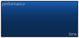

| Versions | Animatable | Beatmap Skinnable | Blend Mode | Origin | Suggested SD Size |
| :-: | :-: | :-: | :-: | :-: | :-: |
| 1.0 | ![No][false] | ![No][false] | Normal | Top Left | ขั้นต่ำ: 308x156 |
| 2.0+ | ![No][false] | ![No][false] | Normal | Top Left | ขั้นต่ำ: 308x148 |

Notes:

- การจัดตำแหน่งแตกต่างกันไป:
  - v1.0: (256,576)
  - v2.0+: (256,608)
- ตัวกล่องมีขนาด 301x141
- 7 pixel แรกด้านบนและด้านซ้ายควรโปร่งใส
  - ใน v1 จะถูกเลื่อนลง 8px

---

`ranking-maxcombo.png`

| Versions | Animatable | Beatmap Skinnable | Blend Mode | Origin | Suggested SD Size |
| :-: | :-: | :-: | :-: | :-: | :-: |
| All | ![No][false] (ดู notes) | ![No][false] | Normal | Top Left | - |

Notes:

- ทำ animation ได้ แต่จะใช้เฉพาะเฟรมที่ศูนย์เท่านั้น
  - ชื่อ animation: `ranking-maxcombo-{n}.png`
- การจัดตำแหน่งแตกต่างกันไป:
  - v1.0: (8,500)
  - v2.0+: (8,480)

---

`ranking-panel.png`

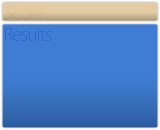

| Versions | Animatable | Beatmap Skinnable | Blend Mode | Origin | Suggested SD Size |
| :-: | :-: | :-: | :-: | :-: | :-: |
| 1.0 | ![No][false] | ![No][false] | Normal | Top Left | ความสูงสูงสุด: 694px |
| 2.0+ | ![No][false] | ![No][false] | Normal | Top Left | ความสูงสูงสุด: 666px |

Notes:

- การจัดตำแหน่งแตกต่างกันไป:
  - v1.0: (0,74)
  - v2.0+: (0,102)

---

`ranking-perfect.png`

| Versions | Animatable | Beatmap Skinnable | Blend Mode | Origin | Suggested SD Size |
| :-: | :-: | :-: | :-: | :-: | :-: |
| All | ![No][false] (ดู notes) | ![No][false] | Normal | Centre | - |

Notes:

- ทำ animation ได้ แต่จะใช้เฉพาะเฟรมที่ศูนย์เท่านั้น
  - ชื่อ animation: `ranking-perfect-{n}.png`
- การจัดตำแหน่งแตกต่างกันไป:
  - v1.0: (320,688)
  - v2.0+: (416,688)

---

`ranking-title.png`

| Versions | Animatable | Beatmap Skinnable | Blend Mode | Origin | Suggested SD Size |
| :-: | :-: | :-: | :-: | :-: | :-: |
| All | ![No][false] | ![No][false] | Normal | Top Right | - |

Notes:

- x-position ห่างจากด้านขวา 32px

---

`ranking-replay.png`

| Versions | Animatable | Beatmap Skinnable | Blend Mode | Origin | Suggested SD Size |
| :-: | :-: | :-: | :-: | :-: | :-: |
| 1.0 | ![No][false] | ![No][false] | Normal | Right | - |

Notes:

- ตำแหน่งแตกต่างกันไป:
  - ที่ความสูง 672px
  - ที่ความสูง 576px ถ้าไม่มี retry

---

`ranking-retry.png`

| Versions | Animatable | Beatmap Skinnable | Blend Mode | Origin | Suggested SD Size |
| :-: | :-: | :-: | :-: | :-: | :-: |
| All | ![No][false] | ![No][false] | Normal | Right | - |

Notes:

- วางที่ความสูง 576px
- ถ้าทำสกินไว้ element นี้จะ override `pause-retry.png`

---

`ranking-winner.png`

| Versions | Animatable | Beatmap Skinnable | Blend Mode | Origin | Suggested SD Size |
| :-: | :-: | :-: | :-: | :-: | :-: |
| All | ![No][false] | ![No][false] | Normal | Top Left | 200x214 |

Notes:

- element นี้ใช้เฉพาะใน [multi](/wiki/Client/Interface/Multiplayer)

## Score entry

`scoreentry-0.png`

| Versions | Animatable | Beatmap Skinnable | Blend Mode | Origin | Suggested SD Size |
| :-: | :-: | :-: | :-: | :-: | :-: |
| All | ![No][false] | ![Yes][true] | Multiplicative | (varies) | 11x14 |

Notes:

- element นี้ใช้กับ leaderboard ในเกมและ input overlay
  - สำหรับ input overlay label เริ่มต้นบนปุ่มไม่สามารถทำสกินได้
- การ tint สีขึ้นอยู่กับการใช้งาน:
  - Score: ขาว
  - Combo: cyan
  - Input overlay: ใช้ค่า `InputOverlayText` จาก [skin.ini](/wiki/Skinning/skin.ini) หรือสีดำถ้าไม่ได้กำหนด
- Origin แตกต่างกันตามการใช้งาน:
  - Score: Top Left
  - Combo: Top Right
  - Rank: Top Right
  - Input overlay: Top

---

`scoreentry-1.png`

| Versions | Animatable | Beatmap Skinnable | Blend Mode | Origin | Suggested SD Size |
| :-: | :-: | :-: | :-: | :-: | :-: |
| All | ![No][false] | ![Yes][true] | Multiplicative | (varies) | 11x14 |

Notes:

- element นี้ใช้กับ leaderboard ในเกมและ input overlay
  - สำหรับ input overlay label เริ่มต้นบนปุ่มไม่สามารถทำสกินได้
- การ tint สีขึ้นอยู่กับการใช้งาน:
  - Score: ขาว
  - Combo: cyan
  - Input overlay: ใช้ค่า `InputOverlayText` จาก [skin.ini](/wiki/Skinning/skin.ini) หรือสีดำถ้าไม่ได้กำหนด
- Origin แตกต่างกันตามการใช้งาน:
  - Score: Top Left
  - Combo: Top Right
  - Rank: Top Right
  - Input overlay: Top

---

`scoreentry-2.png`

| Versions | Animatable | Beatmap Skinnable | Blend Mode | Origin | Suggested SD Size |
| :-: | :-: | :-: | :-: | :-: | :-: |
| All | ![No][false] | ![Yes][true] | Multiplicative | (varies) | 11x14 |

Notes:

- element นี้ใช้กับ leaderboard ในเกมและ input overlay
  - สำหรับ input overlay label เริ่มต้นบนปุ่มไม่สามารถทำสกินได้
- การ tint สีขึ้นอยู่กับการใช้งาน:
  - Score: ขาว
  - Combo: cyan
  - Input overlay: ใช้ค่า `InputOverlayText` จาก [skin.ini](/wiki/Skinning/skin.ini) หรือสีดำถ้าไม่ได้กำหนด
- Origin แตกต่างกันตามการใช้งาน:
  - Score: Top Left
  - Combo: Top Right
  - Rank: Top Right
  - Input overlay: Top

---

`scoreentry-3.png`

| Versions | Animatable | Beatmap Skinnable | Blend Mode | Origin | Suggested SD Size |
| :-: | :-: | :-: | :-: | :-: | :-: |
| All | ![No][false] | ![Yes][true] | Multiplicative | (varies) | 11x14 |

Notes:

- element นี้ใช้กับ leaderboard ในเกมและ input overlay
  - สำหรับ input overlay label เริ่มต้นบนปุ่มไม่สามารถทำสกินได้
- การ tint สีขึ้นอยู่กับการใช้งาน:
  - Score: ขาว
  - Combo: cyan
  - Input overlay: ใช้ค่า `InputOverlayText` จาก [skin.ini](/wiki/Skinning/skin.ini) หรือสีดำถ้าไม่ได้กำหนด
- Origin แตกต่างกันตามการใช้งาน:
  - Score: Top Left
  - Combo: Top Right
  - Rank: Top Right
  - Input overlay: Top

---

`scoreentry-4.png`

| Versions | Animatable | Beatmap Skinnable | Blend Mode | Origin | Suggested SD Size |
| :-: | :-: | :-: | :-: | :-: | :-: |
| All | ![No][false] | ![Yes][true] | Multiplicative | (varies) | 11x14 |

Notes:

- element นี้ใช้กับ leaderboard ในเกมและ input overlay
  - สำหรับ input overlay label เริ่มต้นบนปุ่มไม่สามารถทำสกินได้
- การ tint สีขึ้นอยู่กับการใช้งาน:
  - Score: ขาว
  - Combo: cyan
  - Input overlay: ใช้ค่า `InputOverlayText` จาก [skin.ini](/wiki/Skinning/skin.ini) หรือสีดำถ้าไม่ได้กำหนด
- Origin แตกต่างกันตามการใช้งาน:
  - Score: Top Left
  - Combo: Top Right
  - Rank: Top Right
  - Input overlay: Top

---

`scoreentry-5.png`

| Versions | Animatable | Beatmap Skinnable | Blend Mode | Origin | Suggested SD Size |
| :-: | :-: | :-: | :-: | :-: | :-: |
| All | ![No][false] | ![Yes][true] | Multiplicative | (varies) | 11x14 |

Notes:

- element นี้ใช้กับ leaderboard ในเกมและ input overlay
  - สำหรับ input overlay label เริ่มต้นบนปุ่มไม่สามารถทำสกินได้
- การ tint สีขึ้นอยู่กับการใช้งาน:
  - Score: ขาว
  - Combo: cyan
  - Input overlay: ใช้ค่า `InputOverlayText` จาก [skin.ini](/wiki/Skinning/skin.ini) หรือสีดำถ้าไม่ได้กำหนด
- Origin แตกต่างกันตามการใช้งาน:
  - Score: Top Left
  - Combo: Top Right
  - Rank: Top Right
  - Input overlay: Top

---

`scoreentry-6.png`

| Versions | Animatable | Beatmap Skinnable | Blend Mode | Origin | Suggested SD Size |
| :-: | :-: | :-: | :-: | :-: | :-: |
| All | ![No][false] | ![Yes][true] | Multiplicative | (varies) | 11x14 |

Notes:

- element นี้ใช้กับ leaderboard ในเกมและ input overlay
  - สำหรับ input overlay label เริ่มต้นบนปุ่มไม่สามารถทำสกินได้
- การ tint สีขึ้นอยู่กับการใช้งาน:
  - Score: ขาว
  - Combo: cyan
  - Input overlay: ใช้ค่า `InputOverlayText` จาก [skin.ini](/wiki/Skinning/skin.ini) หรือสีดำถ้าไม่ได้กำหนด
- Origin แตกต่างกันตามการใช้งาน:
  - Score: Top Left
  - Combo: Top Right
  - Rank: Top Right
  - Input overlay: Top

---

`scoreentry-7.png`

| Versions | Animatable | Beatmap Skinnable | Blend Mode | Origin | Suggested SD Size |
| :-: | :-: | :-: | :-: | :-: | :-: |
| All | ![No][false] | ![Yes][true] | Multiplicative | (varies) | 11x14 |

Notes:

- element นี้ใช้กับ leaderboard ในเกมและ input overlay
  - สำหรับ input overlay label เริ่มต้นบนปุ่มไม่สามารถทำสกินได้
- การ tint สีขึ้นอยู่กับการใช้งาน:
  - Score: ขาว
  - Combo: cyan
  - Input overlay: ใช้ค่า `InputOverlayText` จาก [skin.ini](/wiki/Skinning/skin.ini) หรือสีดำถ้าไม่ได้กำหนด
- Origin แตกต่างกันตามการใช้งาน:
  - Score: Top Left
  - Combo: Top Right
  - Rank: Top Right
  - Input overlay: Top

---

`scoreentry-8.png`

| Versions | Animatable | Beatmap Skinnable | Blend Mode | Origin | Suggested SD Size |
| :-: | :-: | :-: | :-: | :-: | :-: |
| All | ![No][false] | ![Yes][true] | Multiplicative | (varies) | 11x14 |

Notes:

- element นี้ใช้กับ leaderboard ในเกมและ input overlay
  - สำหรับ input overlay label เริ่มต้นบนปุ่มไม่สามารถทำสกินได้
- การ tint สีขึ้นอยู่กับการใช้งาน:
  - Score: ขาว
  - Combo: cyan
  - Input overlay: ใช้ค่า `InputOverlayText` จาก [skin.ini](/wiki/Skinning/skin.ini) หรือสีดำถ้าไม่ได้กำหนด
- Origin แตกต่างกันตามการใช้งาน:
  - Score: Top Left
  - Combo: Top Right
  - Rank: Top Right
  - Input overlay: Top

---

`scoreentry-9.png`

| Versions | Animatable | Beatmap Skinnable | Blend Mode | Origin | Suggested SD Size |
| :-: | :-: | :-: | :-: | :-: | :-: |
| All | ![No][false] | ![Yes][true] | Multiplicative | (varies) | 11x14 |

Notes:

- element นี้ใช้กับ leaderboard ในเกมและ input overlay
  - สำหรับ input overlay label เริ่มต้นบนปุ่มไม่สามารถทำสกินได้
- การ tint สีขึ้นอยู่กับการใช้งาน:
  - Score: ขาว
  - Combo: cyan
  - Input overlay: ใช้ค่า `InputOverlayText` จาก [skin.ini](/wiki/Skinning/skin.ini) หรือสีดำถ้าไม่ได้กำหนด
- Origin แตกต่างกันตามการใช้งาน:
  - Score: Top Left
  - Combo: Top Right
  - Rank: Top Right
  - Input overlay: Top

---

`scoreentry-comma.png`

| Versions | Animatable | Beatmap Skinnable | Blend Mode | Origin | Suggested SD Size |
| :-: | :-: | :-: | :-: | :-: | :-: |
| All | ![No][false] | ![Yes][true] | Multiplicative | (varies) | 5x14 |

Notes:

- element นี้ใช้กับ leaderboard ในเกม
- element นี้ใช้เป็นตัวคั่นทศนิยม
  - การใช้งานขึ้นอยู่กับภาษาที่เลือกไว้
- การ tint สีขึ้นอยู่กับการใช้งาน:
  - Score: ขาว
  - Combo: cyan
- Origin แตกต่างกันตามการใช้งาน:
  - Score: Top Left
  - Combo: Top Right

---

`scoreentry-dot.png`

| Versions | Animatable | Beatmap Skinnable | Blend Mode | Origin | Suggested SD Size |
| :-: | :-: | :-: | :-: | :-: | :-: |
| All | ![No][false] | ![Yes][true] | Multiplicative | Top Left | 5x14 |

Notes:

- element นี้ใช้กับ leaderboard ในเกม
- element นี้ใช้เป็นตัวคั่นทศนิยม
  - การใช้งานขึ้นอยู่กับภาษาที่เลือกไว้
- tint เป็นสีขาว

---

`scoreentry-percent.png`

| Versions | Animatable | Beatmap Skinnable | Blend Mode | Origin | Suggested SD Size |
| :-: | :-: | :-: | :-: | :-: | :-: |
| All | ![No][false] | ![Yes][true] | Multiplicative | Top Left | 12x14 |

Notes:

- element นี้ใช้กับ leaderboard ในเกม
- element นี้ใช้ในเกม [Multi](/wiki/Client/Interface/Multiplayer) เมื่อ win condition ถูกตั้งเป็น Accuracy
- tint เป็นสีขาว

---

`scoreentry-x.png`

| Versions | Animatable | Beatmap Skinnable | Blend Mode | Origin | Suggested SD Size |
| :-: | :-: | :-: | :-: | :-: | :-: |
| All | ![No][false] | ![Yes][true] | Multiplicative | Top Right | 10x14 |

Notes:

- element นี้ใช้กับ leaderboard ในเกม
- element นี้ใช้เป็นสัญลักษณ์ตัวคูณ
- tint เป็นสี cyan

## Song selection

`menu-back.png`

| Versions | Animatable | Beatmap Skinnable | Blend Mode | Origin | Suggested SD Size |
| :-: | :-: | :-: | :-: | :-: | :-: |
| All | ![Yes][true] | ![No][false] | Normal | Bottom Left | 200x214 |

Notes:

- ชื่อ animation: `menu-back-{n}.png`.
- ปุ่ม back แบบ native ไม่สามารถทำสกินได้
  - ถ้าทำสกิน element นี้ไว้ มันจะ override ตัวใหม่ทุกที่ ยกเว้นใน[ตัวเลือก](/wiki/Client/Options)

---

`menu-button-background.png`

| Versions | Animatable | Beatmap Skinnable | Blend Mode | Origin | Suggested SD Size |
| :-: | :-: | :-: | :-: | :-: | :-: |
| All | ![No][false] | ![Yes][true] | Multiplicative | Bottom Left | ขั้นต่ำ: 690x85 |

Notes:

- skin version 2.2+ รองรับ thumbnail สำหรับ song selection ได้ (ต้องเปิดใช้งานใน[ตัวเลือก](/wiki/Client/Options))
  - thumbnail จะถูกวางห่างจากขอบซ้ายของรูป 9px
  - ขนาด thumbnail คือ 115x85
- element นี้ถูกใช้ในหลายจุด:
  - scoreboard ใน song selection
  - ปุ่มสำหรับ difficulty ของบีตแมปใน song selection
  - scoreboard ด้านซ้ายระหว่างเล่น
  - ปุ่มที่แสดงบีตแมปที่เลือกไว้ระหว่างรอในห้อง multiplayer
- การ tint สีแตกต่างกันตามสถานะปุ่ม

---

`rank-forum.png`

| Versions | Animatable | Beatmap Skinnable | Blend Mode | Origin | Suggested SD Size |
| :-: | :-: | :-: | :-: | :-: | :-: |
| All | ![No][false] | ![No][false] | Normal | Centre | 25x25 |

Notes:

- pixel ใด ๆ ที่อยู่นอกกรอบ 25x25 จะถูกตัดออก

---

`selection-mode.png`

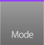

| Versions | Animatable | Beatmap Skinnable | Blend Mode | Origin | Suggested SD Size |
| :-: | :-: | :-: | :-: | :-: | :-: |
| 1.0 | ![No][false] | ![No][false] | Normal | Top Left | 92x87 |
| 2.0+ | ![No][false] | ![No][false] | Normal | Bottom Left | 92x90 |

Notes:

- ใน v1.0 ตำแหน่งจะห่างจากด้านล่าง 87px

---

`selection-mode-over.png`

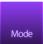

| Versions | Animatable | Beatmap Skinnable | Blend Mode | Origin | Suggested SD Size |
| :-: | :-: | :-: | :-: | :-: | :-: |
| 1.0 | ![No][false] | ![No][false] | Normal | Top Left | 92x87 |
| 2.0+ | ![No][false] | ![No][false] | Normal | Bottom Left | 92x90 |

Notes:

- hover เหนือ `selection-mode.png` เพื่อดู
- ใน v1.0 ตำแหน่งจะห่างจากด้านล่าง 87px

---

`selection-mods.png`

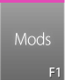

| Versions | Animatable | Beatmap Skinnable | Blend Mode | Origin | Suggested SD Size |
| :-: | :-: | :-: | :-: | :-: | :-: |
| 1.0 | ![No][false] | ![No][false] | Normal | Top Left | 77x87 |
| 2.0+ | ![No][false] | ![No][false] | Normal | Bottom Left | 77x90 |

Notes:

- ใน v1.0 ตำแหน่งจะห่างจากด้านล่าง 87px

---

`selection-mods-over.png`

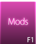

| Versions | Animatable | Beatmap Skinnable | Blend Mode | Origin | Suggested SD Size |
| :-: | :-: | :-: | :-: | :-: | :-: |
| 1.0 | ![No][false] | ![No][false] | Normal | Top Left | 77x87 |
| 2.0+ | ![No][false] | ![No][false] | Normal | Bottom Left | 77x90 |

Notes:

- hover เหนือ `selection-mods.png` เพื่อดู
- ใน v1.0 ตำแหน่งจะห่างจากด้านล่าง 87px

---

`selection-random.png`

| Versions | Animatable | Beatmap Skinnable | Blend Mode | Origin | Suggested SD Size |
| :-: | :-: | :-: | :-: | :-: | :-: |
| 1.0 | ![No][false] | ![No][false] | Normal | Top Left | 77x87 |
| 2.0+ | ![No][false] | ![No][false] | Normal | Bottom Left | 77x90 |

Notes:

- ใน v1.0 ตำแหน่งจะห่างจากด้านล่าง 87px

---

`selection-random-over.png`

| Versions | Animatable | Beatmap Skinnable | Blend Mode | Origin | Suggested SD Size |
| :-: | :-: | :-: | :-: | :-: | :-: |
| 1.0 | ![No][false] | ![No][false] | Normal | Top Left | 77x87 |
| 2.0+ | ![No][false] | ![No][false] | Normal | Bottom Left | 77x90 |

Notes:

- hover เหนือ `selection-random.png` เพื่อดู
- ใน v1.0 ตำแหน่งจะห่างจากด้านล่าง 87px

---

`selection-options.png`

| Versions | Animatable | Beatmap Skinnable | Blend Mode | Origin | Suggested SD Size |
| :-: | :-: | :-: | :-: | :-: | :-: |
| 1.0 | ![No][false] | ![No][false] | Normal | Top Left | 77x87 |
| 2.0+ | ![No][false] | ![No][false] | Normal | Bottom Left | 77x90 |

Notes:

- ใน v1.0 ตำแหน่งจะห่างจากด้านล่าง 87px

---

`selection-options-over.png`

| Versions | Animatable | Beatmap Skinnable | Blend Mode | Origin | Suggested SD Size |
| :-: | :-: | :-: | :-: | :-: | :-: |
| 1.0 | ![No][false] | ![No][false] | Normal | Top Left | 77x87 |
| 2.0+ | ![No][false] | ![No][false] | Normal | Bottom Left | 77x90 |

Notes:

- hover เหนือ `selection-options.png` เพื่อดู
- ใน v1.0 ตำแหน่งจะห่างจากด้านล่าง 87px

---

`selection-tab.png`

| Versions | Animatable | Beatmap Skinnable | Blend Mode | Origin | Suggested SD Size |
| :-: | :-: | :-: | :-: | :-: | :-: |
| All | ![No][false] | ![Yes][true] | Multiplicative | Top Left | 142x24 |

Notes:

- จะแสดง 4 ถึง 5 tab ขึ้นอยู่กับขนาดหน้าต่างของ client

---

`songselect-bottom.png`

| Versions | Animatable | Beatmap Skinnable | Blend Mode | Origin | Suggested SD Size |
| :-: | :-: | :-: | :-: | :-: | :-: |
| All | ![No][false] | ![No][false] | Normal | Bottom Left | - |

Notes:

- ยืดเต็ม 100% ของความกว้างหน้าจอ
- ถ้าทำ element นี้สูงเกินไป mouse click จะกดโดน element ที่อยู่ด้านล่างไม่ได้

---

`songselect-top.png`

| Versions | Animatable | Beatmap Skinnable | Blend Mode | Origin | Suggested SD Size |
| :-: | :-: | :-: | :-: | :-: | :-: |
| All | ![No][false] | ![No][false] | Normal | Top Left | - |

Notes:

- pixel ไม่กี่จุดด้านขวาสุดจะ repeat จากจุดหนึ่ง
  - การแสดงซ้ำจะถูกวาง layer ไว้ใต้ asset แรก
  - จุดเริ่มต้นแตกต่างกันตาม resolution ในเกมของผู้ใช้

---

`star.png`

| Versions | Animatable | Beatmap Skinnable | Blend Mode | Origin | Suggested SD Size |
| :-: | :-: | :-: | :-: | :-: | :-: |
| All | ![No][false] | ![No][false] | Multiplicative | Centre | 50x50 |

Notes:

- element นี้ใช้สำหรับ difficulty star rating (เห็นได้ใน song selection)
  - v2.2+ จะ scale down star ตัวสุดท้ายถ้าจำเป็น
  - v2.1- จะ crop star ตัวสุดท้ายถ้าจำเป็น
- การ tint สีขึ้นอยู่กับสถานะของ `menu-button-background.png`

---

`star2.png`

| Versions | Animatable | Beatmap Skinnable | Blend Mode | Origin | Suggested SD Size |
| :-: | :-: | :-: | :-: | :-: | :-: |
| All | ![No][false] | ![Yes][true] | Additive | Centre | 24x24 |

Notes:

- element นี้ใช้กับ song selection (ดาวที่บินจากขวาไปซ้าย), cursor, kiai time และ comboburst

### Mode select

`mode-osu.png`

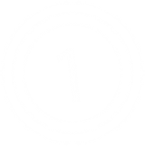

| Versions | Animatable | Beatmap Skinnable | Blend Mode | Origin | Suggested SD Size |
| :-: | :-: | :-: | :-: | :-: | :-: |
| All | ![No][false] | ![No][false] | Additive | Centre | 256x256 |

Notes:

- element นี้จะกะพริบที่กลางหน้าจอ song select ตาม BPM ของเพลง
- เลือก [osu!](/wiki/Game_mode/osu!) เพื่อให้ element นี้มองเห็น

---

`mode-taiko.png`

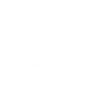

| Versions | Animatable | Beatmap Skinnable | Blend Mode | Origin | Suggested SD Size |
| :-: | :-: | :-: | :-: | :-: | :-: |
| All | ![No][false] | ![No][false] | Additive | Centre | 256x256 |

Notes:

- element นี้จะกะพริบที่กลางหน้าจอ song select ตาม BPM ของเพลง
- เลือก [osu!taiko](/wiki/Game_mode/osu!taiko) เพื่อให้ element นี้มองเห็น

---

`mode-fruits.png`

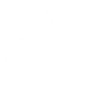

| Versions | Animatable | Beatmap Skinnable | Blend Mode | Origin | Suggested SD Size |
| :-: | :-: | :-: | :-: | :-: | :-: |
| All | ![No][false] | ![No][false] | Additive | Centre | 256x256 |

Notes:

- element นี้จะกะพริบที่กลางหน้าจอ song select ตาม BPM ของเพลง
- เลือก [osu!catch](/wiki/Game_mode/osu!catch) เพื่อให้ element นี้มองเห็น

---

`mode-mania.png`

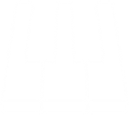

| Versions | Animatable | Beatmap Skinnable | Blend Mode | Origin | Suggested SD Size |
| :-: | :-: | :-: | :-: | :-: | :-: |
| All | ![No][false] | ![No][false] | Additive | Centre | 256x256 |

Notes:

- element นี้จะกะพริบที่กลางหน้าจอ song select ตาม BPM ของเพลง
- เลือก [osu!mania](/wiki/Game_mode/osu!mania) เพื่อให้ element นี้มองเห็น

---

`mode-osu-med.png`

| Versions | Animatable | Beatmap Skinnable | Blend Mode | Origin | Suggested SD Size |
| :-: | :-: | :-: | :-: | :-: | :-: |
| All | ![No][false] | ![No][false] | Normal | Centre | 128x128 |

Notes:

- element นี้ใช้ใน dropdown menu เลือกโหมดเกม
- คลิก `selection-mode.png` เพื่อดู

---

`mode-taiko-med.png`

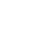

| Versions | Animatable | Beatmap Skinnable | Blend Mode | Origin | Suggested SD Size |
| :-: | :-: | :-: | :-: | :-: | :-: |
| All | ![No][false] | ![No][false] | Normal | Centre | 128x128 |

Notes:

- element นี้ใช้ใน dropdown menu เลือกโหมดเกม
- คลิก `selection-mode.png` เพื่อดู

---

`mode-fruits-med.png`

| Versions | Animatable | Beatmap Skinnable | Blend Mode | Origin | Suggested SD Size |
| :-: | :-: | :-: | :-: | :-: | :-: |
| All | ![No][false] | ![No][false] | Normal | Centre | 128x128 |

Notes:

- element นี้ใช้ใน dropdown menu เลือกโหมดเกม
- คลิก `selection-mode.png` เพื่อดู

---

`mode-mania-med.png`

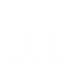

| Versions | Animatable | Beatmap Skinnable | Blend Mode | Origin | Suggested SD Size |
| :-: | :-: | :-: | :-: | :-: | :-: |
| All | ![No][false] | ![No][false] | Normal | Centre | 128x128 |

Notes:

- element นี้ใช้ใน dropdown menu เลือกโหมดเกม
- คลิก `selection-mode.png` เพื่อดู

---

`mode-osu-small.png`

| Versions | Animatable | Beatmap Skinnable | Blend Mode | Origin | Suggested SD Size |
| :-: | :-: | :-: | :-: | :-: | :-: |
| All | ![No][false] | ![No][false] | Additive | Centre | 32x32 |

Notes:

- element นี้อยู่บน `selection-mode.png`
- เลือก [osu!](/wiki/Game_mode/osu!) เพื่อให้ element นี้มองเห็น
- ถ้าไม่ได้ทำสกิน `menu-snow.png` element นี้จะถูกใช้เมื่อถูกเลือก

---

`mode-taiko-small.png`

| Versions | Animatable | Beatmap Skinnable | Blend Mode | Origin | Suggested SD Size |
| :-: | :-: | :-: | :-: | :-: | :-: |
| All | ![No][false] | ![No][false] | Additive | Centre | 32x32 |

Notes:

- element นี้อยู่บน `selection-mode.png`
- เลือก [osu!taiko](/wiki/Game_mode/osu!taiko) เพื่อให้ element นี้มองเห็น
- ถ้าไม่ได้ทำสกิน `menu-snow.png` element นี้จะถูกใช้เมื่อถูกเลือก

---

`mode-fruits-small.png`

| Versions | Animatable | Beatmap Skinnable | Blend Mode | Origin | Suggested SD Size |
| :-: | :-: | :-: | :-: | :-: | :-: |
| All | ![No][false] | ![No][false] | Additive | Centre | 32x32 |

Notes:

- element นี้อยู่บน `selection-mode.png`
- เลือก [osu!catch](/wiki/Game_mode/osu!catch) เพื่อให้ element นี้มองเห็น
- ถ้าไม่ได้ทำสกิน `menu-snow.png` element นี้จะถูกใช้เมื่อถูกเลือก

---

`mode-mania-small.png`

| Versions | Animatable | Beatmap Skinnable | Blend Mode | Origin | Suggested SD Size |
| :-: | :-: | :-: | :-: | :-: | :-: |
| All | ![No][false] | ![No][false] | Additive | Centre | 32x32 |

Notes:

- element นี้อยู่บน `selection-mode.png`
- เลือก [osu!mania](/wiki/Game_mode/osu!mania) เพื่อให้ element นี้มองเห็น
- ถ้าไม่ได้ทำสกิน `menu-snow.png` element นี้จะถูกใช้เมื่อถูกเลือก

[true]: /wiki/shared/true.png
[false]: /wiki/shared/false.png
