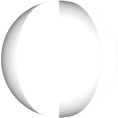
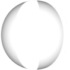
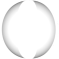
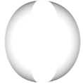
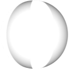
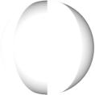
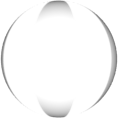
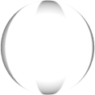
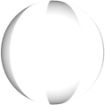

[true]: /wiki/shared/True.png
[false]: /wiki/shared/False.png

# osu!

_Main page: [Skinning](/wiki/Skinning)_

_See also: [Skinning osu! Tutorial](/wiki/Skinning_osu!_Tutorial)_

## Comboburst

| Animatable               | Beatmap Skinnable |
|:------------------------:|:-----------------:|
| ![No][false] (see notes) | ![Yes][true]      |

**Notes:**

- This element is not an animation; instead, one of the frames will be used when a combo milestone is met.
   - use `comboburst-#.png`, replace `#` with an indexed count (start frame count at zero).
- Prior to this skin version `2.3`, osu!standard and osu!catch shared combobursts.
  - For skin versions `2.3` and forward, this is osu!standard's conbobursts.
- This can be disabled in the [options](/wiki/options).
- This should face towards the **right**.

## Default Numbers

This may sound ambiguous and confusing, but these are simply the numbers used for the hit objects in osu!standard.
On this note, you can use the [skin.ini](/wiki/skin.ini) file to define the path for these images using the `HitCirclePrefix` command.

The following table is for all default numbers.

| Animatable   | Beatmap Skinnable |
|:------------:|:-----------------:|
| ![No][false] | ![Yes][true]      |

**Note:**

- all default numbers are downscaled by 0.8x

---

---

---

---

---

---

---

---

---

---

## Hit Circles

| Animatable   | Beatmap Skinnable |
|:------------:|:-----------------:|
| ![No][false] | ![Yes][true]      |

**Notes:**

- This element shrinks over time.
- This is the visual cue that can help a player know when to tap the hit object.

---

| Animatable   | Beatmap Skinnable |
|:------------:|:-----------------:|
| ![No][false] | ![Yes][true]      |

---

| Animatable               | Beatmap Skinnable |
|:------------------------:|:-----------------:|
| ![Yes][true] (see notes) | ![Yes][true]      |

**Notes:**

- Animation name: `hitcircleoverlay-#.png`, replace # with indexed count (start frame count at zero)
- Animation rate: 2FPS (4FPS max).
  - This rate is affected by the game modifiers (half time and double time/nightcore).
- This can either overlay or underlay the combo number, by default this will always overlay.
  - To make this underlay the combo number, set `HitCircleOverlayAboveNumber` to `0`.

---

| Animatable   | Beatmap Skinnable |
|:------------:|:-----------------:|
| ![No][false] | ![Yes][true]      |

**Notes:**

- This is only used in the [editor](/wiki/editor).
- this is the highlight for hit circles and sliders.

---

| Animatable   | Beatmap Skinnable |
|:------------:|:-----------------:|
| ![No][false] | ![Yes][true]      |

**Notes:**

- The arrow should point towards the **right**.
- This stays on the screen for 1.2 seconds (1200ms).

---

| Animatable   | Beatmap Skinnable |
|:------------:|:-----------------:|
| ![No][false] | ![Yes][true]      |

**Notes:**

- This can be disabled in the options.
- Used during kiai time:
  - Coloured afterimage as part of hitburst explosion.
  - Glowing behind hit circles during kiai time.
- This element is also used in osu!taiko and osu!catch.

## Slider

_`sliderstartcircle.png`_ (transparent; not included)

| Animatable   | Beatmap Skinnable |
|:------------:|:-----------------:|
| ![No][false] | ![Yes][true]      |

**Notes:**

- Not for Stable (Fallback) stream.
- Overrides the `hitcircle.png` image for the start of the slider.
- This is the hit circle for the start of the slider.

---

_`sliderstartcircleoverlay.png`_ (transparent; not included)

| Animatable               | Beatmap Skinnable |
|:------------------------:|:-----------------:|
| ![Yes][true] (see notes) | ![Yes][true]      |

**Notes:**

- Animation name: `sliderstartcircleoverlay-#.png`, replace # with indexed count (start frame count at zero)
- Animation rate: 2FPS (4FPS max)
  - This rate is affected by the game modifiers (half time and double time/nightcore).
- Not for Stable (Fallback) stream.
- Overrides the `hitcircle.png` image for the start of the slider.
- `sliderstartcircle.png` is required for this to work.

---

_`sliderendcircle.png`_ (transparent; not included)

| Animatable   | Beatmap Skinnable |
|:------------:|:-----------------:|
| ![No][false] | ![Yes][true]      |

**Notes:**

- Not for Stable (Fallback) stream.
- Overrides the `hitcircle.png` image for the end of the slider.
- This is the hitcircle for the end of the slider.

---

_`sliderendcircleoverlay.png`_ (transparent; not included)

| Animatable               | Beatmap Skinnable |
|:------------------------:|:-----------------:|
| ![Yes][true] (see notes) | ![Yes][true]      |

**Notes:**

- Animation name: `sliderendcircleoverlay-#.png`, replace # with indexed count (start frame count at zero)
- Animation rate: 2FPS (4FPS max)
  - This rate is affected by the game modifiers (half time and double time/nightcore).
- Not for Stable (Fallback) stream.
- Overrides the `hitcircle.png` image for the end of the slider.
- `sliderendcircle.png` is required for this to work.

---

| Animatable   | Beatmap Skinnable |
|:------------:|:-----------------:|
| ![No][false] | ![Yes][true]      |

**Notes:**

- osu! will rotate this element to line up with the slider's path.
- This element will pulse at the bpm.
- The arrow should point towards the **right**.

---

| Animatable   | Beatmap Skinnable |
|:------------:|:-----------------:|
| ![Yes][true] | ![Yes][true]      |

**Notes:**

- Animation name: `sliderfollowcircle-#.png`, replace # with indexed count (start frame count at zero)
- This element expands when collecting a slider tick.

---

_`sliderb.png`_ (included images below)

| Animatable   | Beatmap Skinnable |
|:------------:|:-----------------:|
| ![Yes][true] | ![Yes][true]      |

**Notes:**

- Animation name: `sliderb#.png`, replace # with indexed count (start frame count at zero)
- By default, the sliderball flips upon hitting the reverse arrow.
  - To disable this, set `sliderballflip` to `0`.

---

| Animatable   | Beatmap Skinnable |
|:------------:|:-----------------:|
| ![No][false] | ![Yes][true]      |

**Note:**

- Not skinnable if `sliderb.png` is skinned.

---

| Animatable   | Beatmap Skinnable |
|:------------:|:-----------------:|
| ![No][false] | ![Yes][true]      |

**Notes:**

- Not skinnable if `sliderb.png` is skinned.
- Used during [kiai time](/wiki/kiai time):
  - This is the lighting layer of the default sliderball.

---

_`sliderpoint10.png`_ (transparent; not included)

| Animatable   | Beatmap Skinnable        |
|:------------:|:------------------------:|
| ![No][false] | ![Yes][true] (see notes) |

**Notes:**

- If this element is included in a beatmap skin, the player must be using a skin that uses version 1.0
- Used when the player collects a slider tick.

---

_`sliderpoint30.png`_ (transparent; not included)

| Animatable   | Beatmap Skinnable        |
|:------------:|:------------------------:|
| ![No][false] | ![Yes][true] (see notes) |

**Notes:**

- If this element is included in a beatmap skin, the player must be using a skin that uses version 1.0
- Used when the player starts a slider or when they hit the reverse arrow

---

| Animatable   | Beatmap Skinnable  |
|:------------:|:------------------:|
| ![No][false] | ![Yes][true]       |

- these are the slider ticks
- if these overlap the slider start or end, they will he _hidden_
- this element is also used in osu!taiko

## Spinner

Notice: You cannot mix the old and the new spinner styles!

---

| Animatable   | Beatmap Skinnable  |
|:------------:|:------------------:|
| ![No][false] | ![Yes][true]       |

**Note:**

- **old** spinner set
- If skinned, this will force "old" styled spinners on v2.0+ (this element is used)
- This is tinted grey, by default
   - to change this, use the `SpinnerBackground` command

---

| Animatable   | Beatmap Skinnable  |
|:------------:|:------------------:|
| ![No][false] | ![Yes][true]       |

1. if `spinner-background.png` is skinned, this element is used
2. positioned around 397px vertically

- this is the rotating part of the spinner
- **old** spinner set

---

| Animatable   | Beatmap Skinnable  |
|:------------:|:------------------:|
| ![No][false] | ![Yes][true]       |

1. positioning:
   - 46px away from top
   - 512px to the left from the middle axis
   - (0,46) at 1024x768
   - (171,46) at 1366x768

- **old** spinner set

---

| Animatable   | Beatmap Skinnable        |
|:------------:|:------------------------:|
| ![No][false] | ![Yes][true] (see notes) |

- if included in a beatmap skin, the end user must be using a skin that uses version 1.0
- appears after the spinner fades out
- **old** spinner set

---

| Animatable   | Beatmap Skinnable |
|:------------:|:-----------------:|
| ![No][false] | ![Yes][true]      |

**Notes:**

- rotates the slowest
- second lowest layer
- **new** spinner set

---

| Animatable   | Beatmap Skinnable |
|:------------:|:-----------------:|
| ![No][false] | ![Yes][true]      |

**Notes:**

- blinks when giving bonus points
- lowest layer
- **new** spinner set

---

| Animatable   | Beatmap Skinnable |
|:------------:|:-----------------:|
| ![No][false] | ![Yes][true]      |

**Notes:**

- tintes read over time (this is the time indicator)
- highest layer
- **new** spinner set

---

| Animatable   | Beatmap Skinnable |
|:------------:|:-----------------:|
| ![No][false] | ![Yes][true]      |

**Notes:**

- rotates the fastest
- second highest layer
- **new** spinner set

---

| Animatable   | Beatmap Skinnable |
|:------------:|:-----------------:|
| ![No][false] | ![Yes][true]      |

**Notes:**

- rotates the second fastest (slower than `spinner-middle2.png`)
- middle layer
- **new** spinner set

---

| Animatable   | Beatmap Skinnable |
|:------------:|:-----------------:|
| ![No][false] | ![Yes][true]      |

---

| Animatable   | Beatmap Skinnable |
|:------------:|:-----------------:|
| ![No][false] | ![Yes][true]      |

**Notes:**

- this is the window that displays the current spinning speed
- RPM = Revolutions Per Minute
  - Revolutions = full (circular) spin

---

| Animatable   | Beatmap Skinnable |
|:------------:|:-----------------:|
| ![No][false] | ![Yes][true]      |

**Notes:**

- this notifies the player that the spinner was cleared
- this implies that the player should keep spinning for bonus points

---

| Animatable   | Beatmap Skinnable |
|:------------:|:-----------------:|
| ![No][false] | ![Yes][true]      |

**Notes:**

- this appears at the start of a spinner
- this notifies the player that any spins from this point will be counted

## Particles

Particles are the effects that appear behind the [hit bursts](/wiki/skinning_interface/#hit-bursts).

The following table is for all particles.

| Animatable   | Beatmap Skinnable |
|:------------:|:-----------------:|
| ![No][false] | ![Yes][true]      |

**Notes:**

- If the [hit bursts](/wiki/skinning_interface/#hit-bursts) are skinned, the default elements will not be used.

---

---

**Note:**

- This element is used for `hit100` and `hit100k`.

---

**Note:**

- This element is used for `hit300`, `hit300g`, and `hit300k`.
