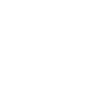
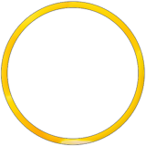
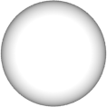
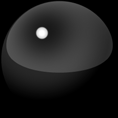
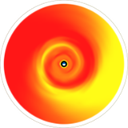
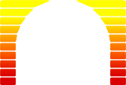
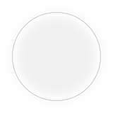
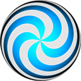
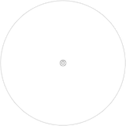

# osu! skinning

## Comboburst

`comboburst.png`

| Versions | Animatable | Beatmap Skinnable | Blend Mode | Origin | Suggested SD Size |
| :-: | :-: | :-: | :-: | :-: | :-: |
| All | ![No][false] (ดู notes) | ![Yes][true] | Normal | Centre | - |

Notes:

- ถ้าต้องการมี comboburst หลายแบบ ให้ใช้: `comboburst-{n}.png`
  - หนึ่งในรูปของ set นี้จะปรากฏเมื่อทำคอมโบถึง milestone
- สำหรับ v2.2- element นี้คือ comboburst ของ osu! และ osu!catch
- สำหรับ v2.3+ element นี้คือ comboburst ของ osu!
- สามารถปิดได้ใน[ตัวเลือก](/wiki/Client/Options)
- ควรหันหน้าไปทางขวา

## Default Numbers

`default-0.png`

| Versions | Animatable | Beatmap Skinnable | Blend Mode | Origin | Suggested SD Size |
| :-: | :-: | :-: | :-: | :-: | :-: |
| All | ![No][false] | ![Yes][true] | Normal | Centre | - |

Notes:

- ใน v1.0 element เหล่านี้จะขยายแล้ว fade out ไปพร้อมกับฮิตเซอร์เคิล
  - ถ้าเปิดใช้งานม็อด [Hidden](/wiki/Gameplay/Game_modifier/Hidden) element นี้จะ fade out อย่างเดียว
- ใน v2.0+ element เหล่านี้จะ fade out
- element นี้ถูก downscale 0.8 เท่า

---

`default-1.png`

| Versions | Animatable | Beatmap Skinnable | Blend Mode | Origin | Suggested SD Size |
| :-: | :-: | :-: | :-: | :-: | :-: |
| All | ![No][false] | ![Yes][true] | Normal | Centre | - |

Notes:

- ใน v1.0 element เหล่านี้จะขยายแล้ว fade out ไปพร้อมกับฮิตเซอร์เคิล
  - ถ้าเปิดใช้งานม็อด [Hidden](/wiki/Gameplay/Game_modifier/Hidden) element นี้จะ fade out อย่างเดียว
- ใน v2.0+ element เหล่านี้จะ fade out
- element นี้ถูก downscale 0.8 เท่า

---

`default-2.png`

| Versions | Animatable | Beatmap Skinnable | Blend Mode | Origin | Suggested SD Size |
| :-: | :-: | :-: | :-: | :-: | :-: |
| All | ![No][false] | ![Yes][true] | Normal | Centre | - |

Notes:

- ใน v1.0 element เหล่านี้จะขยายแล้ว fade out ไปพร้อมกับฮิตเซอร์เคิล
  - ถ้าเปิดใช้งานม็อด [Hidden](/wiki/Gameplay/Game_modifier/Hidden) element นี้จะ fade out อย่างเดียว
- ใน v2.0+ element เหล่านี้จะ fade out
- element นี้ถูก downscale 0.8 เท่า

---

`default-3.png`

| Versions | Animatable | Beatmap Skinnable | Blend Mode | Origin | Suggested SD Size |
| :-: | :-: | :-: | :-: | :-: | :-: |
| All | ![No][false] | ![Yes][true] | Normal | Centre | - |

Notes:

- ใน v1.0 element เหล่านี้จะขยายแล้ว fade out ไปพร้อมกับฮิตเซอร์เคิล
  - ถ้าเปิดใช้งานม็อด [Hidden](/wiki/Gameplay/Game_modifier/Hidden) element นี้จะ fade out อย่างเดียว
- ใน v2.0+ element เหล่านี้จะ fade out
- element นี้ถูก downscale 0.8 เท่า

---

`default-4.png`

| Versions | Animatable | Beatmap Skinnable | Blend Mode | Origin | Suggested SD Size |
| :-: | :-: | :-: | :-: | :-: | :-: |
| All | ![No][false] | ![Yes][true] | Normal | Centre | - |

Notes:

- ใน v1.0 element เหล่านี้จะขยายแล้ว fade out ไปพร้อมกับฮิตเซอร์เคิล
  - ถ้าเปิดใช้งานม็อด [Hidden](/wiki/Gameplay/Game_modifier/Hidden) element นี้จะ fade out อย่างเดียว
- ใน v2.0+ element เหล่านี้จะ fade out
- element นี้ถูก downscale 0.8 เท่า

---

`default-5.png`

| Versions | Animatable | Beatmap Skinnable | Blend Mode | Origin | Suggested SD Size |
| :-: | :-: | :-: | :-: | :-: | :-: |
| All | ![No][false] | ![Yes][true] | Normal | Centre | - |

Notes:

- ใน v1.0 element เหล่านี้จะขยายแล้ว fade out ไปพร้อมกับฮิตเซอร์เคิล
  - ถ้าเปิดใช้งานม็อด [Hidden](/wiki/Gameplay/Game_modifier/Hidden) element นี้จะ fade out อย่างเดียว
- ใน v2.0+ element เหล่านี้จะ fade out
- element นี้ถูก downscale 0.8 เท่า

---

`default-6.png`

| Versions | Animatable | Beatmap Skinnable | Blend Mode | Origin | Suggested SD Size |
| :-: | :-: | :-: | :-: | :-: | :-: |
| All | ![No][false] | ![Yes][true] | Normal | Centre | - |

Notes:

- ใน v1.0 element เหล่านี้จะขยายแล้ว fade out ไปพร้อมกับฮิตเซอร์เคิล
  - ถ้าเปิดใช้งานม็อด [Hidden](/wiki/Gameplay/Game_modifier/Hidden) element นี้จะ fade out อย่างเดียว
- ใน v2.0+ element เหล่านี้จะ fade out
- element นี้ถูก downscale 0.8 เท่า

---

`default-7.png`

| Versions | Animatable | Beatmap Skinnable | Blend Mode | Origin | Suggested SD Size |
| :-: | :-: | :-: | :-: | :-: | :-: |
| All | ![No][false] | ![Yes][true] | Normal | Centre | - |

Notes:

- ใน v1.0 element เหล่านี้จะขยายแล้ว fade out ไปพร้อมกับฮิตเซอร์เคิล
  - ถ้าเปิดใช้งานม็อด [Hidden](/wiki/Gameplay/Game_modifier/Hidden) element นี้จะ fade out อย่างเดียว
- ใน v2.0+ element เหล่านี้จะ fade out
- element นี้ถูก downscale 0.8 เท่า

---

`default-8.png`

| Versions | Animatable | Beatmap Skinnable | Blend Mode | Origin | Suggested SD Size |
| :-: | :-: | :-: | :-: | :-: | :-: |
| All | ![No][false] | ![Yes][true] | Normal | Centre | - |

Notes:

- ใน v1.0 element เหล่านี้จะขยายแล้ว fade out ไปพร้อมกับฮิตเซอร์เคิล
  - ถ้าเปิดใช้งานม็อด [Hidden](/wiki/Gameplay/Game_modifier/Hidden) element นี้จะ fade out อย่างเดียว
- ใน v2.0+ element เหล่านี้จะ fade out
- element นี้ถูก downscale 0.8 เท่า

---

`default-9.png`

| Versions | Animatable | Beatmap Skinnable | Blend Mode | Origin | Suggested SD Size |
| :-: | :-: | :-: | :-: | :-: | :-: |
| All | ![No][false] | ![Yes][true] | Normal | Centre | - |

Notes:

- ใน v1.0 element เหล่านี้จะขยายแล้ว fade out ไปพร้อมกับฮิตเซอร์เคิล
  - ถ้าเปิดใช้งานม็อด [Hidden](/wiki/Gameplay/Game_modifier/Hidden) element นี้จะ fade out อย่างเดียว
- ใน v2.0+ element เหล่านี้จะ fade out
- element นี้ถูก downscale 0.8 เท่า

## Hit circles

`approachcircle.png`

| Versions | Animatable | Beatmap Skinnable | Blend Mode | Origin | Suggested SD Size |
| :-: | :-: | :-: | :-: | :-: | :-: |
| All | ![No][false] | ![Yes][true] | Multiplicative | Centre | 126x126 |

Notes:

- การ tint สีขึ้นอยู่กับสีคอมโบของฮิตเซอร์เคิล
- element นี้จะหดลงเรื่อย ๆ ตามเวลา
  - ถ้าเปิดใช้งานม็อด [Hidden](/wiki/Gameplay/Game_modifier/Hidden) element นี้จะไม่ถูกใช้
    - ถ้าต้องการให้ approach circle ตัวแรกแสดงตอนเปิดม็อด Hidden ผู้เล่นต้องเปิดใช้งานใน[ตัวเลือก](/wiki/Client/Options)
- ควรเป็นวงกลม

---

`hitcircle.png`

| Versions | Animatable | Beatmap Skinnable | Blend Mode | Origin | Suggested SD Size |
| :-: | :-: | :-: | :-: | :-: | :-: |
| All | ![No][false] | ![Yes][true] | Multiplicative | Centre | 118x118 (วงกลม) 128x128 (ทั้งไฟล์) |

Notes:

- element นี้จะ fade in ก่อนถูกกด และขยายเมื่อถูกกดหรือพลาด
  - ถ้าเปิดใช้งานม็อด [Hidden](/wiki/Gameplay/Game_modifier/Hidden) element นี้จะ fade in ก่อนถูกกด แล้ว fade out อย่างเดียว
- การ tint สีขึ้นอยู่กับสีคอมโบของฮิตเซอร์เคิล
- ถ้าไม่ได้ทำสกินไว้ element นี้ยังใช้แทน `sliderstartcircle` และ/หรือ `sliderendcircle` ด้วย
- ควรเป็นวงกลม

---

`hitcircleoverlay.png`

| Versions | Animatable | Beatmap Skinnable | Blend Mode | Origin | Suggested SD Size |
| :-: | :-: | :-: | :-: | :-: | :-: |
| All | ![No][false] (ดู notes) | ![Yes][true] | Normal | Centre | 118x118 (วงกลม) 128x128 (ทั้งไฟล์) |

Notes:

- element นี้จะ fade in ก่อนถูกกด และขยายเมื่อถูกกดหรือพลาด
  - ถ้าเปิดใช้งานม็อด [Hidden](/wiki/Gameplay/Game_modifier/Hidden) element นี้จะ fade in ก่อนถูกกด แล้ว fade out อย่างเดียว
- element นี้สามารถ overlay หรือ underlay ตัวเลขคอมโบได้ โดยค่าเริ่มต้นจะ overlay เสมอ
  - ถ้าต้องการให้ underlay ตัวเลขคอมโบ ให้ตั้งค่า `HitCircleOverlayAboveNumber` เป็น `0`
- ควรเป็นวงกลม
- ในอดีต element นี้เคยทำ animation ได้ ดูรายละเอียดทั้งหมดได้ที่[ประวัติของ skinning](/wiki/Skinning/History)

การมองเห็น overlay บนสไลเดอร์ขึ้นอยู่กับ element ของ slider circle:

- ถ้ามี `sliderstartcircle`/`sliderendcircle` ในสกิน แต่ไม่มี `sliderstartcircleoverlay`/`sliderendcircleoverlay` จะไม่แสดง `hitcircleoverlay` บนจุดเริ่มหรือจุดจบของสไลเดอร์เลย
- ถ้าไม่มี `sliderstartcircle`/`sliderendcircle` จะใช้ `hitcircleoverlay` เป็น overlay sprite สำหรับจุดเริ่มหรือจุดจบของสไลเดอร์

---

`hitcircleselect.png`

| Versions | Animatable | Beatmap Skinnable | Blend Mode | Origin | Suggested SD Size |
| :-: | :-: | :-: | :-: | :-: | :-: |
| All | ![No][false] | ![Yes][true] | Normal | Centre | 118x118 (วงกลม) 128x128 (ทั้งไฟล์) |

Notes:

- element นี้ใช้เฉพาะใน [beatmap editor](/wiki/Client/Beatmap_editor)
- ควรเป็นวงกลม

---

`followpoint.png`

| Versions | Animatable | Beatmap Skinnable | Blend Mode | Origin | Suggested SD Size |
| :-: | :-: | :-: | :-: | :-: | :-: |
| All | ![Yes][true] | ![Yes][true] | Normal | Centre | - |

Notes:

- ชื่อ animation: `followpoint-{n}.png`
- ถ้าใช้รูปร่างคล้ายลูกศร ควรชี้ไปทางขวา
- element นี้จะค้างบนหน้าจอ 1.2 วินาที (1200ms)

---

`lighting.png`

| Versions | Animatable | Beatmap Skinnable | Blend Mode | Origin | Suggested SD Size |
| :-: | :-: | :-: | :-: | :-: | :-: |
| All | ![No][false] | ![Yes][true] | Additive | Centre | 100x100 |

Notes:

- สามารถปิดได้ใน[ตัวเลือก](/wiki/Client/Options)
- การ tint สีขึ้นอยู่กับสีคอมโบของฮิตเซอร์เคิล
- ใช้ระหว่าง kiai time:
  - afterimage สีในฐานะส่วนหนึ่งของ hitburst explosion
  - แสงเรืองด้านหลังฮิตเซอร์เคิลระหว่าง kiai time
- element นี้ยังใช้ใน [osu!taiko](/wiki/Game_mode/osu!taiko) และ [osu!catch](/wiki/Game_mode/osu!catch) ด้วย
- ใน v2.0+ animation แบบขยายจะมีขนาดเล็กลง

## Slider

`sliderstartcircle.png`

| Versions | Animatable | Beatmap Skinnable | Blend Mode | Origin | Suggested SD Size |
| :-: | :-: | :-: | :-: | :-: | :-: |
| All | ![No][false] | ![Yes][true] | Multiplicative | Centre | 118x118 (วงกลม) 128x128 (ทั้งไฟล์) |

Notes:

- ถ้าทำสกินไว้ element นี้จะ override `hitcircle.png` สำหรับจุดเริ่มของสไลเดอร์
- element นี้คือฮิตเซอร์เคิลของจุดเริ่มสไลเดอร์
- element นี้จะ fade in ก่อนถูกกด และขยายเมื่อถูกกดหรือพลาด
  - ถ้าเปิดใช้งานม็อด [Hidden](/wiki/Gameplay/Game_modifier/Hidden) element นี้จะ fade in ก่อนถูกกด แล้ว fade out อย่างเดียว
- ควรเป็นวงกลม

---

`sliderstartcircleoverlay.png`

| Versions | Animatable | Beatmap Skinnable | Blend Mode | Origin | Suggested SD Size |
| :-: | :-: | :-: | :-: | :-: | :-: |
| All | ![No][false] (ดู notes) | ![Yes][true] | Normal | Centre | 118x118 (วงกลม) 128x128 (ทั้งไฟล์) |

Notes:

- element นี้จะ fade in ก่อนถูกกด และขยายเมื่อถูกกดหรือพลาด
  - ถ้าเปิดใช้งานม็อด [Hidden](/wiki/Gameplay/Game_modifier/Hidden) element นี้จะ fade in ก่อนถูกกด แล้ว fade out อย่างเดียว
- element นี้สามารถ overlay หรือ underlay ตัวเลขคอมโบได้ โดยค่าเริ่มต้นจะ overlay เสมอ
  - ถ้าต้องการให้ underlay ตัวเลขคอมโบ ให้ตั้งค่า `HitCircleOverlayAboveNumber` เป็น `0`
- override รูป `hitcircle.png` สำหรับจุดเริ่มของสไลเดอร์
- ต้องมี `sliderstartcircle.png` เพื่อให้ element นี้ทำงาน
- ควรเป็นวงกลม
- ในอดีต element นี้เคยทำ animation ได้ ดูรายละเอียดทั้งหมดได้ที่[ประวัติของ skinning](/wiki/Skinning/History)

---

`sliderendcircle.png`

| Versions | Animatable | Beatmap Skinnable | Blend Mode | Origin | Suggested SD Size |
| :-: | :-: | :-: | :-: | :-: | :-: |
| All | ![No][false] | ![Yes][true] | Multiplicative | Centre | 118x118 (วงกลม) 128x128 (ทั้งไฟล์) |

Notes:

- ถ้าทำสกินไว้ element นี้จะ override `hitcircle.png` สำหรับจุดจบของสไลเดอร์
- element นี้คือฮิตเซอร์เคิลของจุดจบสไลเดอร์
- element นี้จะ fade in ก่อนจบสไลเดอร์ และขยายเมื่อจบสไลเดอร์สำเร็จ
  - ถ้าเปิดใช้งานม็อด [Hidden](/wiki/Gameplay/Game_modifier/Hidden) element นี้จะ fade in ก่อนจบสไลเดอร์ แล้ว fade out อย่างเดียว
- ควรเป็นวงกลม

---

`sliderendcircleoverlay.png`

| Versions | Animatable | Beatmap Skinnable | Blend Mode | Origin | Suggested SD Size |
| :-: | :-: | :-: | :-: | :-: | :-: |
| All | ![No][false] (ดู notes) | ![Yes][true] | Normal | Centre | 118x118 (วงกลม) 128x128 (ทั้งไฟล์) |

Notes:

- element นี้จะ fade in ก่อนจบสไลเดอร์ และขยายเมื่อจบสไลเดอร์สำเร็จ
  - ถ้าเปิดใช้งานม็อด [Hidden](/wiki/Gameplay/Game_modifier/Hidden) element นี้จะ fade in ก่อนจบสไลเดอร์ แล้ว fade out อย่างเดียว
- element นี้สามารถ overlay หรือ underlay ตัวเลขคอมโบได้ โดยค่าเริ่มต้นจะ overlay เสมอ
  - ถ้าต้องการให้ underlay ตัวเลขคอมโบ ให้ตั้งค่า `HitCircleOverlayAboveNumber` เป็น `0`
- override รูป `hitcircleoverlay.png` สำหรับจุดจบของสไลเดอร์
- ต้องมี `sliderendcircle.png` เพื่อให้ element นี้ทำงาน
- ควรเป็นวงกลม
- ในอดีต element นี้เคยทำ animation ได้ ดูรายละเอียดทั้งหมดได้ที่[ประวัติของ skinning](/wiki/Skinning/History)

---

`reversearrow.png`

| Versions | Animatable | Beatmap Skinnable | Blend Mode | Origin | Suggested SD Size |
| :-: | :-: | :-: | :-: | :-: | :-: |
| All | ![No][false] | ![Yes][true] | Normal | Centre | 118x118 (วงกลม) 128x128 (ทั้งไฟล์) |

Notes:

- osu! จะหมุน element นี้ให้ตรงกับ path ของสไลเดอร์
- element นี้จะ pulse ตาม bpm
- ถ้าใช้รูปร่างคล้ายลูกศร ควรชี้ไปทางขวา

---

`sliderfollowcircle.png`

| Versions | Animatable | Beatmap Skinnable | Blend Mode | Origin | Suggested SD Size |
| :-: | :-: | :-: | :-: | :-: | :-: |
| All | ![Yes][true] | ![Yes][true] | Normal | Centre | 256x256 (ดู notes) |

Notes:

- ชื่อ animation: `sliderfollowcircle-{n}.png`
- ขนาดสูงสุด: 308x308 (hitbox)
- element นี้จะขยายสั้น ๆ เมื่อเก็บ slider tick

---

`sliderb.png`

| Versions | Animatable | Beatmap Skinnable | Blend Mode | Origin | Suggested SD Size |
| :-: | :-: | :-: | :-: | :-: | :-: |
| All | ![Yes][true] (ดู notes) | ![Yes][true] | Multiplicative | Centre | 118x118 |

Notes:

- ชื่อ animation: `sliderb{n}.png` (ไม่มีขีดกลาง (`-`))
- การ tint สีขึ้นอยู่กับสีคอมโบของฮิตเซอร์เคิล
- โดยค่าเริ่มต้น sliderball จะ flip เมื่อชน reverse arrow
  - ถ้าต้องการปิด ให้ตั้งค่า `sliderballflip` เป็น `0`

---

`sliderb-nd.png`

| Versions | Animatable | Beatmap Skinnable | Blend Mode | Origin | Suggested SD Size |
| :-: | :-: | :-: | :-: | :-: | :-: |
| All | ![No][false] | ![Yes][true] (ดู notes) | Multiplicative | Centre | 118x118 |

Notes:

- จะถูกมองข้ามถ้ามีการทำสกิน `sliderb.png`
  - ทำสกินผ่านบีตแมปได้ถ้าสกินผู้เล่นไม่ได้ทำสกิน `sliderb.png`
- tint เป็นสีดำ
- element นี้คือ layer พื้นหลังของ slider ball เริ่มต้น

---

`sliderb-spec.png`

| Versions | Animatable | Beatmap Skinnable | Blend Mode | Origin | Suggested SD Size |
| :-: | :-: | :-: | :-: | :-: | :-: |
| All | ![No][false] | ![Yes][true] (ดู notes) | Additive | Centre | 118x118 |

Notes:

- จะถูกมองข้ามถ้ามีการทำสกิน `sliderb.png`
  - ทำสกินผ่านบีตแมปได้ถ้าสกินผู้เล่นไม่ได้ทำสกิน `sliderb.png`
- element นี้คือ layer ด้านบนของลูกบอลที่อยู่กับที่ (ไม่ flip และไม่หมุน)

---

`sliderpoint10.png`

| Versions | Animatable | Beatmap Skinnable | Blend Mode | Origin | Suggested SD Size |
| :-: | :-: | :-: | :-: | :-: | :-: |
| 1.0 | ![No][false] | ![Yes][true] (ดู notes) | Normal | Centre | 50x30 |

Notes:

- ทำสกินผ่านบีตแมปได้ถ้าสกินผู้เล่นใช้ v1.0
- ใช้เมื่อผู้เล่นเก็บ slider tick
- ควรเขียนว่า "10"

---

`sliderpoint30.png`

| Versions | Animatable | Beatmap Skinnable | Blend Mode | Origin | Suggested SD Size |
| :-: | :-: | :-: | :-: | :-: | :-: |
| 1.0 | ![No][false] | ![Yes][true] (ดู notes) | Normal | Centre | 50x30 |

Notes:

- ทำสกินผ่านบีตแมปได้ถ้าสกินผู้เล่นใช้ v1.0
- ใช้เมื่อผู้เล่นเริ่มสไลเดอร์ และ/หรือเมื่อกดโดน reverse arrow
- ควรเขียนว่า "30"

---

`sliderscorepoint.png`

| Versions | Animatable | Beatmap Skinnable | Blend Mode | Origin | Suggested SD Size |
| :-: | :-: | :-: | :-: | :-: | :-: |
| All | ![No][false] | ![Yes][true] | Normal | Centre | 16x16 |

Notes:

- element นี้คือ slider tick
- ถ้า element นี้ซ้อนกับจุดเริ่มหรือจุดจบของสไลเดอร์ จะไม่ถูก render
- element นี้ยังใช้ใน [osu!taiko](/wiki/Game_mode/osu!taiko) ด้วย

## Spinner

*หมายเหตุ: คุณไม่สามารถผสม spinner style แบบเก่าและแบบใหม่เข้าด้วยกันได้!*

---

`spinner-approachcircle.png`

| Versions | Animatable | Beatmap Skinnable | Blend Mode | Origin | Suggested SD Size |
| :-: | :-: | :-: | :-: | :-: | :-: |
| All | ![No][false] | ![Yes][true] | Normal | Centre | 384x384 |

Notes:

- element นี้ถูกจัดตำแหน่งไว้ประมาณ 397px ในแนวตั้ง
- ใช้กับทั้งสอง style
- หดลงเรื่อย ๆ ตามเวลา เหมือน `approachcircle.png`
- จะถูกบังคับใช้เมื่อมีการทำสกิน `spinner-circle.png` หรือ `spinner-top.png`
- element นี้ยังใช้กับ [osu!taiko](/wiki/Game_mode/osu!taiko) ด้วย

---

`spinner-rpm.png`

| Versions | Animatable | Beatmap Skinnable | Blend Mode | Origin | Suggested SD Size |
| :-: | :-: | :-: | :-: | :-: | :-: |
| All | ![No][false] | ![Yes][true] | Normal | TopLeft | 280x56 |

Notes:

- RPM ย่อมาจาก "Revolutions Per Minute"
- element นี้ถูกจัดตำแหน่งห่างจากกลางหน้าจอไปทางซ้าย 139px และอยู่ที่ความสูง 712px
  - (373,712) ที่ 1024x768
  - (544,712) ที่ 1366x768

---

`spinner-clear.png`

| Versions | Animatable | Beatmap Skinnable | Blend Mode | Origin | Suggested SD Size |
| :-: | :-: | :-: | :-: | :-: | :-: |
| All | ![No][false] | ![Yes][true] | Normal | Centre | - |

Notes:

- element นี้ถูกจัดตำแหน่งไว้ประมาณ 230px ในแนวตั้ง
- element นี้จะปรากฏเมื่อผู้เล่นทำ spinner สำเร็จตามเงื่อนไขแล้ว

---

`spinner-spin.png`

| Versions | Animatable | Beatmap Skinnable | Blend Mode | Origin | Suggested SD Size |
| :-: | :-: | :-: | :-: | :-: | :-: |
| All | ![No][false] | ![Yes][true] | Normal | Centre | - |

Notes:

- element นี้ถูกจัดตำแหน่งไว้ประมาณ 582px ในแนวตั้ง
- element นี้จะปรากฏตอนเริ่ม spinner

### Spinner (old)

`spinner-background.png`

| Versions | Animatable | Beatmap Skinnable | Blend Mode | Origin | Suggested SD Size |
| :-: | :-: | :-: | :-: | :-: | :-: |
| All | ![No][false] | ![Yes][true] | Multiplicative | Centre | 1024x702 (ดู notes) |

Notes:

- **osu! จะตรวจหา element นี้** ถ้าพบ จะบังคับใช้ spinner style แบบเก่าใน v2.0+ (element ทั้งหมดในหัวข้อนี้)
- การใช้ขนาด SD ที่แนะนำจะช่วยให้จัดแนวกับ `spinner-metre.png` ได้ดีขึ้น
- โดยค่าเริ่มต้น tint เป็นสีเทา
  - ถ้าต้องการเปลี่ยน ให้ใช้คำสั่ง `SpinnerBackground`

---

`spinner-circle.png`

| Versions | Animatable | Beatmap Skinnable | Blend Mode | Origin | Suggested SD Size |
| :-: | :-: | :-: | :-: | :-: | :-: |
| All | ![No][false] | ![Yes][true] | Normal | Centre | - |

Notes:

- element นี้ถูกจัดตำแหน่งไว้ประมาณ 397px ในแนวตั้ง
- element นี้คือส่วนที่หมุนของ spinner
- element นี้ยังใช้กับ [osu!taiko](/wiki/Game_mode/osu!taiko) ด้วย
  - ถ้าใช้ spinner style แบบใหม่ คุณยังทำสกินตัวนี้สำหรับ osu!taiko ได้

---

`spinner-metre.png`

| Versions | Animatable | Beatmap Skinnable | Blend Mode | Origin | Suggested SD Size |
| :-: | :-: | :-: | :-: | :-: | :-: |
| All | ![No][false] | ![Yes][true] | Normal | TopLeft | 1024x692 |

Notes:

- จัดตำแหน่งห่างจากด้านบน 46px และห่างจากแกนกลางไปทางซ้าย 512px
  - (0,46) ที่ 1024x768 และ (171,46) ที่ 1366x768
- element นี้คือ progression bars
- ส่วนที่สูงที่สุดของ bar จะกะพริบเมื่อได้รับ bonus points
  - ปิดการกะพริบได้โดยตั้งค่า `SpinnerNoBlink` เป็น `1` ใน [skin.ini](/wiki/Skinning/skin.ini)

---

`spinner-osu.png`

| Versions | Animatable | Beatmap Skinnable | Blend Mode | Origin | Suggested SD Size |
| :-: | :-: | :-: | :-: | :-: | :-: |
| 1.0 | ![No][false] | ![Yes][true] (ดู notes) | Normal | Centre | - |

Notes:

- ทำสกินผ่านบีตแมปได้ถ้าสกินผู้เล่นใช้ v1.0
- element นี้จะปรากฏหลังจาก spinner fade out

### Spinner (new)

`spinner-glow.png`

| Versions | Animatable | Beatmap Skinnable | Blend Mode | Origin | Suggested SD Size |
| :-: | :-: | :-: | :-: | :-: | :-: |
| 2.0+ | ![No][false] | ![Yes][true] | Additive | Centre | - |

Notes:

- element นี้ถูกจัดตำแหน่งไว้ประมาณ 397px ในแนวตั้ง
- tint เป็นสี cyan และกะพริบเป็นสีขาวเมื่อได้รับ bonus points
- element นี้จะกะพริบเมื่อได้รับ bonus points
- element นี้คือ layer ล่างสุด

---

`spinner-bottom.png`

| Versions | Animatable | Beatmap Skinnable | Blend Mode | Origin | Suggested SD Size |
| :-: | :-: | :-: | :-: | :-: | :-: |
| 2.0+ | ![No][false] | ![Yes][true] | Normal | Centre | - |

Notes:

- element นี้ถูกจัดตำแหน่งไว้ประมาณ 397px ในแนวตั้ง
- element นี้หมุนช้าที่สุด
- element นี้คือ layer ล่างสุดลำดับที่สอง

---

`spinner-top.png`

| Versions | Animatable | Beatmap Skinnable | Blend Mode | Origin | Suggested SD Size |
| :-: | :-: | :-: | :-: | :-: | :-: |
| 2.0+ | ![No][false] | ![Yes][true] | Normal | Centre | - |

Notes:

- element นี้ถูกจัดตำแหน่งไว้ประมาณ 397px ในแนวตั้ง
- element นี้หมุนเร็วเป็นอันดับสอง (ช้ากว่า `spinner-middle2.png`)
- element นี้คือ layer กลาง

---

`spinner-middle2.png`

| Versions | Animatable | Beatmap Skinnable | Blend Mode | Origin | Suggested SD Size |
| :-: | :-: | :-: | :-: | :-: | :-: |
| 2.0+ | ![No][false] | ![Yes][true] | Normal | Centre | - |

Notes:

- element นี้ถูกจัดตำแหน่งไว้ประมาณ 397px ในแนวตั้ง
- element นี้หมุนเร็วที่สุด
- element นี้คือ layer สูงสุดลำดับที่สอง

---

`spinner-middle.png`

| Versions | Animatable | Beatmap Skinnable | Blend Mode | Origin | Suggested SD Size |
| :-: | :-: | :-: | :-: | :-: | :-: |
| 2.0+ | ![No][false] | ![Yes][true] | Multiplicative | Centre | - |

Notes:

- element นี้ถูกจัดตำแหน่งไว้ประมาณ 397px ในแนวตั้ง
- tint เป็นสีแดงตามเวลา (นี่คือตัวบอกเวลา)
- element นี้คือ layer สูงสุด

## Particles

`particle50.png`

| Versions | Animatable | Beatmap Skinnable | Blend Mode | Origin | Suggested SD Size |
| :-: | :-: | :-: | :-: | :-: | :-: |
| All | ![No][false] | ![Yes][true] | Normal | Centre | 7x7 |

Notes:

- ต้องทำสกิน `hit50.png`

---

`particle100.png`

| Versions | Animatable | Beatmap Skinnable | Blend Mode | Origin | Suggested SD Size |
| :-: | :-: | :-: | :-: | :-: | :-: |
| All | ![No][false] | ![Yes][true] | Normal | Centre | 7x7 |

Notes:

- ต้องทำสกิน `hit100.png`
- element นี้ใช้สำหรับ `hit100.png` และ `hit100k.png`

---

`particle300.png`

| Versions | Animatable | Beatmap Skinnable | Blend Mode | Origin | Suggested SD Size |
| :-: | :-: | :-: | :-: | :-: | :-: |
| All | ![No][false] | ![Yes][true] | Normal | Centre | 7x7 |

Notes:

- ต้องทำสกิน `hit300.png`
- element นี้ใช้สำหรับ `hit300`, `hit300g` และ `hit300k`

## Slider miss indicators (เฉพาะ Lazer)

ในเกมเวอร์ชัน [Lazer](/wiki/Client/Release_stream/Lazer) มีการเพิ่ม indicator ใหม่เมื่อพลาดบางส่วนของสไลเดอร์ skin element แบบ legacy ต่อไปนี้สามารถใช้ทำสกินให้ indicator เหล่านี้ได้ และไม่มีผลใน osu!stable<!-- TODO link somewhere -->

::: Infobox

|  |  |
| :-- | :-- |
| Skin versions | All |
| Animatable | ![Yes][true] |
| Beatmap skinnable | ![Yes][true] |
| Blend mode | Normal |
| Origin | Centre |
| Suggested SD size | 16x16 |

:::

|  | Filename | Description |
| :-: | :-- | :-- |
|  | `sliderendmiss.png` | แสดงเมื่อพลาด [sliderend](/wiki/Gameplay/Hit_object/Slider/Slidertail) |
|  | `slidertickmiss.png` | แสดงเมื่อพลาด [slider tick](/wiki/Gameplay/Hit_object/Slider/Slider_tick) |

[true]: /wiki/shared/true.png
[false]: /wiki/shared/false.png
