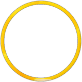
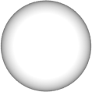
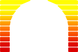
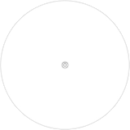

# osu! 自定义皮肤

## 连击提示图

`comboburst.png`

| 版本 | 可以使用动画？ | 可以在谱面中自定义？ | 混合模式 | 定位点 | 推荐标准大小 |
| :-: | :-: | :-: | :-: | :-: | :-: |
| 所有 | ![否][false]（参见提示） | ![是][true] | 普通模式 | 中心 | - |

备注：

- 若要使用多个连击提示图，使用：`comboburst-{n}.png`。
  - 当达成连击里程碑时，会显示其中一个图像。
- 对于 v2.2-，这是 osu! 和 osu!catch 的连击提示图。
- 对于 v2.3+，这是 osu! 的连击提示图。
- 可在[设置](/wiki/Client/Options)中禁用此元素。
- 此元素应该面朝右。

## 默认数字

`default-0.png`

| 版本 | 可以使用动画？ | 可以在谱面中自定义？ | 混合模式 | 定位点 | 推荐标准大小 |
| :-: | :-: | :-: | :-: | :-: | :-: |
| 所有 | ![否][false] | ![是][true] | 普通模式 | 中心 | - |

备注：

- 在 v1.0 皮肤中，此元素会放大，然后与打击圈一同渐隐。
  - 如果启用 [Hidden](/wiki/Gameplay/Game_modifier/Hidden) 模组，此元素只会渐隐。
- 在 v2.0+ 皮肤中，此元素会渐隐。
- 此元素被缩小 0.8x

---

`default-1.png`

| 版本 | 可以使用动画？ | 可以在谱面中自定义？ | 混合模式 | 定位点 | 推荐标准大小 |
| :-: | :-: | :-: | :-: | :-: | :-: |
| 所有 | ![否][false] | ![是][true] | 普通模式 | 中心 | - |

备注：

- 在 v1.0 皮肤中，此元素会放大，然后与打击圈一同渐隐。
  - 如果启用 [Hidden](/wiki/Gameplay/Game_modifier/Hidden) 模组，此元素只会渐隐。
- 在 v2.0+ 皮肤中，此元素会渐隐。
- 此元素被缩小 0.8x

---

`default-2.png`

| 版本 | 可以使用动画？ | 可以在谱面中自定义？ | 混合模式 | 定位点 | 推荐标准大小 |
| :-: | :-: | :-: | :-: | :-: | :-: |
| 所有 | ![否][false] | ![是][true] | 普通模式 | 中心 | - |

备注：

- 在 v1.0 皮肤中，此元素会放大，然后与打击圈一同渐隐。
  - 如果启用 [Hidden](/wiki/Gameplay/Game_modifier/Hidden) 模组，此元素只会渐隐。
- 在 v2.0+ 皮肤中，此元素会渐隐。
- 此元素被缩小 0.8x

---

`default-3.png`

| 版本 | 可以使用动画？ | 可以在谱面中自定义？ | 混合模式 | 定位点 | 推荐标准大小 |
| :-: | :-: | :-: | :-: | :-: | :-: |
| 所有 | ![否][false] | ![是][true] | 普通模式 | 中心 | - |

备注：

- 在 v1.0 皮肤中，此元素会放大，然后与打击圈一同渐隐。
  - 如果启用 [Hidden](/wiki/Gameplay/Game_modifier/Hidden) 模组，此元素只会渐隐。
- 在 v2.0+ 皮肤中，此元素会渐隐。
- 此元素被缩小 0.8x

---

`default-4.png`

| 版本 | 可以使用动画？ | 可以在谱面中自定义？ | 混合模式 | 定位点 | 推荐标准大小 |
| :-: | :-: | :-: | :-: | :-: | :-: |
| 所有 | ![否][false] | ![是][true] | 普通模式 | 中心 | - |

备注：

- 在 v1.0 皮肤中，此元素会放大，然后与打击圈一同渐隐。
  - 如果启用 [Hidden](/wiki/Gameplay/Game_modifier/Hidden) 模组，此元素只会渐隐。
- 在 v2.0+ 皮肤中，此元素会渐隐。
- 此元素被缩小 0.8x

---

`default-5.png`

| 版本 | 可以使用动画？ | 可以在谱面中自定义？ | 混合模式 | 定位点 | 推荐标准大小 |
| :-: | :-: | :-: | :-: | :-: | :-: |
| 所有 | ![否][false] | ![是][true] | 普通模式 | 中心 | - |

备注：

- 在 v1.0 皮肤中，此元素会放大，然后与打击圈一同渐隐。
  - 如果启用 [Hidden](/wiki/Gameplay/Game_modifier/Hidden) 模组，此元素只会渐隐。
- 在 v2.0+ 皮肤中，此元素会渐隐。
- 此元素被缩小 0.8x

---

`default-6.png`

| 版本 | 可以使用动画？ | 可以在谱面中自定义？ | 混合模式 | 定位点 | 推荐标准大小 |
| :-: | :-: | :-: | :-: | :-: | :-: |
| 所有 | ![否][false] | ![是][true] | 普通模式 | 中心 | - |

备注：

- 在 v1.0 皮肤中，此元素会放大，然后与打击圈一同渐隐。
  - 如果启用 [Hidden](/wiki/Gameplay/Game_modifier/Hidden) 模组，此元素只会渐隐。
- 在 v2.0+ 皮肤中，此元素会渐隐。
- 此元素被缩小 0.8x

---

`default-7.png`

| 版本 | 可以使用动画？ | 可以在谱面中自定义？ | 混合模式 | 定位点 | 推荐标准大小 |
| :-: | :-: | :-: | :-: | :-: | :-: |
| 所有 | ![否][false] | ![是][true] | 普通模式 | 中心 | - |

备注：

- 在 v1.0 皮肤中，此元素会放大，然后与打击圈一同渐隐。
  - 如果启用 [Hidden](/wiki/Gameplay/Game_modifier/Hidden) 模组，此元素只会渐隐。
- 在 v2.0+ 皮肤中，此元素会渐隐。
- 此元素被缩小 0.8x

---

`default-8.png`

| 版本 | 可以使用动画？ | 可以在谱面中自定义？ | 混合模式 | 定位点 | 推荐标准大小 |
| :-: | :-: | :-: | :-: | :-: | :-: |
| 所有 | ![否][false] | ![是][true] | 普通模式 | 中心 | - |

备注：

- 在 v1.0 皮肤中，此元素会放大，然后与打击圈一同渐隐。
  - 如果启用 [Hidden](/wiki/Gameplay/Game_modifier/Hidden) 模组，此元素只会渐隐。
- 在 v2.0+ 皮肤中，此元素会渐隐。
- 此元素被缩小 0.8x

---

`default-9.png`

| 版本 | 可以使用动画？ | 可以在谱面中自定义？ | 混合模式 | 定位点 | 推荐标准大小 |
| :-: | :-: | :-: | :-: | :-: | :-: |
| 所有 | ![否][false] | ![是][true] | 普通模式 | 中心 | - |

备注：

- 在 v1.0 皮肤中，此元素会放大，然后与打击圈一同渐隐。
  - 如果启用 [Hidden](/wiki/Gameplay/Game_modifier/Hidden) 模组，此元素只会渐隐。
- 在 v2.0+ 皮肤中，此元素会渐隐。
- 此元素被缩小 0.8x

## 打击圈

`approachcircle.png`

| 版本 | 可以使用动画？ | 可以在谱面中自定义？ | 混合模式 | 定位点 | 推荐标准大小 |
| :-: | :-: | :-: | :-: | :-: | :-: |
| 所有 | ![否][false] | ![是][true] | 相乘模式 | 中心 | 126x126 |

备注：

- 颜色取决于打击圈的串颜色。
- 此元素随时间缩小。
  - 如果启用 [Hidden](/wiki/Gameplay/Game_modifier/Hidden) 模组，则不会使用此元素。
    - 若要在 Hidden 模组启用时显示第一个缩圈，玩家需要在[设置](/wiki/Client/Options)中启用。
- 此元素应该是圆圈。

---

`hitcircle.png`

| 版本 | 可以使用动画？ | 可以在谱面中自定义？ | 混合模式 | 定位点 | 推荐标准大小 |
| :-: | :-: | :-: | :-: | :-: | :-: |
| 所有 | ![否][false] | ![是][true] | 相乘模式 | 中心 | 118x118（圆圈） 128x128（整个文件） |

备注：

- 此元素在被点击前渐显，被点击后或漏掉后放大。
  - 如果启用 [Hidden](/wiki/Gameplay/Game_modifier/Hidden) 模组，此元素会在被点击前渐显，被点击后只会渐隐。
- 颜色取决于打击圈的串颜色。
- 如果没有自定义 `sliderstartcircle` 和/或 `sliderendcircle`，它们也会使用此元素。
- 此元素应该是圆圈。

---

`hitcircleoverlay.png`

| 版本 | 可以使用动画？ | 可以在谱面中自定义？ | 混合模式 | 定位点 | 推荐标准大小 |
| :-: | :-: | :-: | :-: | :-: | :-: |
| 所有 | ![否][false]（参见提示） | ![是][true] | 普通模式 | 中心 | 118x118（圆圈） 128x128（整个文件） |

备注：

- 此元素在被点击前渐显，被点击后或漏掉后放大。
  - 如果启用 [Hidden](/wiki/Gameplay/Game_modifier/Hidden) 模组，此元素会在被点击前渐显，被点击后只会渐隐。
- 此元素可以覆盖在串数上方，也可以置于其下。默认情况下总会置于其上。
  - 若要将此元素置于串数下方，将 `HitCircleOverlayAboveNumber` 设为 `0`。
- 此元素应该是圆圈。
- 此元素过去可使用动画。关于完整细节，请见[自定义皮肤历史](/wiki/Skinning/History)。

覆盖元素在滑条中的可见性取决于滑条圈元素：

- 如果皮肤中存在 `sliderstartcircle`/`sliderendcircle` 但没有 `sliderstartcircleoverlay`/`sliderendcircleoverlay`，就不会在滑条头或滑条尾上显示 `hitcircleoverlay`。
- 如果不存在 `sliderstartcircle`/`sliderendcircle`，`hitcircleoverlay` 就会作为覆盖精灵图用于滑条头或滑条尾。

---

`hitcircleselect.png`

| 版本 | 可以使用动画？ | 可以在谱面中自定义？ | 混合模式 | 定位点 | 推荐标准大小 |
| :-: | :-: | :-: | :-: | :-: | :-: |
| 所有 | ![否][false] | ![是][true] | 普通模式 | 中心 | 118x118（圆圈） 128x128（整个文件） |

备注：

- 仅在[谱面编辑器](/wiki/Client/Beatmap_editor)中使用此元素。
- 此元素应该是圆圈。

---

`followpoint.png`

| 版本 | 可以使用动画？ | 可以在谱面中自定义？ | 混合模式 | 定位点 | 推荐标准大小 |
| :-: | :-: | :-: | :-: | :-: | :-: |
| 所有 | ![是][true] | ![是][true] | 普通模式 | 中心 | - |

备注：

- 动画文件名：`followpoint-{n}.png`
- 如果使用箭头状的图像，箭头应该指向右。
- 此元素停留在屏幕上 1.2 秒（1200 毫秒）。

---

`lighting.png`

| 版本 | 可以使用动画？ | 可以在谱面中自定义？ | 混合模式 | 定位点 | 推荐标准大小 |
| :-: | :-: | :-: | :-: | :-: | :-: |
| 所有 | ![否][false] | ![是][true] | 相加模式 | 中心 | 100x100 |

备注：

- 可在[设置](/wiki/Client/Options)中禁用此元素。
- 颜色取决于打击圈的串颜色。
- 在 Kiai 时间期间使用：
  - 显示有色残影，作为打击爆炸效果的一部分。
  - 在 Kiai 时间期间，打击圈后会发光。
- 此元素也用于 [osu!taiko](/wiki/Game_mode/osu!taiko) 和 [osu!catch](/wiki/Game_mode/osu!catch) 中。
- 在 v2.0+ 皮肤中，放大的动画较小。

## 滑条

`sliderstartcircle.png`

| 版本 | 可以使用动画？ | 可以在谱面中自定义？ | 混合模式 | 定位点 | 推荐标准大小 |
| :-: | :-: | :-: | :-: | :-: | :-: |
| 所有 | ![否][false] | ![是][true] | 相乘模式 | 中心 | 118x118（圆圈） 128x128（整个文件） |

备注：

- 如果自定义此元素，滑条头就会用此元素覆盖 `hitcircle.png`。
- 此元素是滑条头部的打击圈。
- 此元素在被点击前渐显，被点击后或漏掉后放大。
  - 如果启用 [Hidden](/wiki/Gameplay/Game_modifier/Hidden) 模组，此元素会在被点击前渐显，被点击后只会渐隐。
- 此元素应该是圆圈。

---

`sliderstartcircleoverlay.png`

| 版本 | 可以使用动画？ | 可以在谱面中自定义？ | 混合模式 | 定位点 | 推荐标准大小 |
| :-: | :-: | :-: | :-: | :-: | :-: |
| 所有 | ![否][false]（参见提示） | ![是][true] | 普通模式 | 中心 | 118x118（圆圈） 128x128（整个文件） |

备注：

- 此元素在被点击前渐显，被点击后或漏掉后放大。
  - 如果启用 [Hidden](/wiki/Gameplay/Game_modifier/Hidden) 模组，此元素会在被点击前渐显，被点击后只会渐隐。
- 此元素可以覆盖在串数上方，也可以置于其下。默认情况下总会置于其上。
  - 若要将此元素置于串数下方，将 `HitCircleOverlayAboveNumber` 设为 `0`。
- 此元素会覆盖 `hitcircle.png` 用于滑条头部。
- 需要 `sliderstartcircle.png` 来使此元素有效。
- 此元素应该是圆圈。
- 此元素过去可使用动画。关于完整细节，请见[自定义皮肤历史](/wiki/Skinning/History)。

---

`sliderendcircle.png`

| 版本 | 可以使用动画？ | 可以在谱面中自定义？ | 混合模式 | 定位点 | 推荐标准大小 |
| :-: | :-: | :-: | :-: | :-: | :-: |
| 所有 | ![否][false] | ![是][true] | 相乘模式 | 中心 | 118x118（圆圈） 128x128（整个文件） |

备注：

- 如果自定义此元素，则会覆盖 `hitcircle.png` 用于滑条头部。
- 此元素是滑条尾部的打击圈。
- 此元素在滑条完成前渐显，完成后放大。
  - 如果启用 [Hidden](/wiki/Gameplay/Game_modifier/Hidden) 模组，此元素会在完成滑条前渐显，完成后只会渐隐。
- 此元素应该是圆圈。

---

`sliderendcircleoverlay.png`

| 版本 | 可以使用动画？ | 可以在谱面中自定义？ | 混合模式 | 定位点 | 推荐标准大小 |
| :-: | :-: | :-: | :-: | :-: | :-: |
| 所有 | ![否][false]（参见提示） | ![是][true] | 普通模式 | 中心 | 118x118（圆圈） 128x128（整个文件） |

备注：

- 此元素在滑条完成前渐显，完成后放大。
  - 如果启用 [Hidden](/wiki/Gameplay/Game_modifier/Hidden) 模组，此元素会在完成滑条前渐显，完成后只会渐隐。
- 此元素可以覆盖在串数上方，也可以置于其下。默认情况下总会置于其上。
  - 若要将此元素置于串数下方，将 `HitCircleOverlayAboveNumber` 设为 `0`。
- 此元素会覆盖 `hitcircle.png` 用于滑条头部。
- 需要 `sliderendcircle.png` 来使此元素有效。
- 此元素应该是圆圈。
- 此元素过去可使用动画。关于完整细节，请见[自定义皮肤历史](/wiki/Skinning/History)。

---

`reversearrow.png`

| 版本 | 可以使用动画？ | 可以在谱面中自定义？ | 混合模式 | 定位点 | 推荐标准大小 |
| :-: | :-: | :-: | :-: | :-: | :-: |
| 所有 | ![否][false] | ![是][true] | 普通模式 | 中心 | 118x118（圆圈） 128x128（整个文件） |

备注：

- osu! 会旋转此元素，以对准滑条路径。
- 此元素会随 BPM 跳动。
- 如果使用箭头状的图像，箭头应该指向右。

---

`sliderfollowcircle.png`

| 版本 | 可以使用动画？ | 可以在谱面中自定义？ | 混合模式 | 定位点 | 推荐标准大小 |
| :-: | :-: | :-: | :-: | :-: | :-: |
| 所有 | ![是][true] | ![是][true] | 普通模式 | 中心 | 256x256（参见提示） |

备注：

- 动画文件名：`sliderfollowcircle-{n}.png`
- 最大大小：308x308（打击框）
- 当收集滑条点时，此元素略有放大。

---

`sliderb.png`

| 版本 | 可以使用动画？ | 可以在谱面中自定义？ | 混合模式 | 定位点 | 推荐标准大小 |
| :-: | :-: | :-: | :-: | :-: | :-: |
| 所有 | ![是][true]（参见提示） | ![是][true] | 相乘模式 | 中心 | 118x118 |

备注：

- 动画文件名：`sliderb{n}.png`（没有连字符 (`-`)）
- 颜色取决于打击圈的串颜色。
- 默认情况下，当滑条球到达折返箭头处时会翻转。
  - 若要禁用，将 `sliderballflip` 设为 `0`。

---

`sliderb-nd.png`

| 版本 | 可以使用动画？ | 可以在谱面中自定义？ | 混合模式 | 定位点 | 推荐标准大小 |
| :-: | :-: | :-: | :-: | :-: | :-: |
| 所有 | ![否][false] | ![是][true]（参见提示） | 相乘模式 | 中心 | 118x118 |

备注：

- 如果自定义了 `sliderb.png`，则会忽略此元素。
  - 如果玩家没有自定义 `sliderb.png`，则可以在谱面中自定义此元素。
- 颜色为黑色。
- 此元素是默认滑条球的背景层。

---

`sliderb-spec.png`

| 版本 | 可以使用动画？ | 可以在谱面中自定义？ | 混合模式 | 定位点 | 推荐标准大小 |
| :-: | :-: | :-: | :-: | :-: | :-: |
| 所有 | ![否][false] | ![是][true]（参见提示） | 相加模式 | 中心 | 118x118 |

备注：

- 如果自定义了 `sliderb.png`，则会忽略此元素。
  - 如果玩家没有自定义 `sliderb.png`，则可以在谱面中自定义此元素。
- 此元素是默认滑条球的顶层，处于静态位置（不会翻转与旋转）。

---

`sliderpoint10.png`

| 版本 | 可以使用动画？ | 可以在谱面中自定义？ | 混合模式 | 定位点 | 推荐标准大小 |
| :-: | :-: | :-: | :-: | :-: | :-: |
| 1.0 | ![否][false] | ![是][true]（参见提示） | 普通模式 | 中心 | 50x30 |

备注：

- 如果玩家使用 v1.0 皮肤，则可以在谱面中自定义。
- 当玩家收集滑条点时使用此元素。
- 应该显示 “10”。

---

`sliderpoint30.png`

| 版本 | 可以使用动画？ | 可以在谱面中自定义？ | 混合模式 | 定位点 | 推荐标准大小 |
| :-: | :-: | :-: | :-: | :-: | :-: |
| 1.0 | ![否][false] | ![是][true]（参见提示） | 普通模式 | 中心 | 50x30 |

备注：

- 如果玩家使用 v1.0 皮肤，则可以在谱面中自定义。
- 当玩家开始滑条和/或打击折返箭头时使用此元素。
- 应该显示 “30”。

---

`sliderscorepoint.png`

| 版本 | 可以使用动画？ | 可以在谱面中自定义？ | 混合模式 | 定位点 | 推荐标准大小 |
| :-: | :-: | :-: | :-: | :-: | :-: |
| 所有 | ![否][false] | ![是][true] | 普通模式 | 中心 | 16x16 |

备注：

- 此元素是滑条点。
- 如果此元素与滑条头或滑条尾有重叠，则不会渲染此元素。
- 此元素也用在 [osu!taiko](/wiki/Game_mode/osu!taiko) 中。

## 转盘

*注意：你不能将新旧转盘风格混在一起！*

---

`spinner-approachcircle.png`

| 版本 | 可以使用动画？ | 可以在谱面中自定义？ | 混合模式 | 定位点 | 推荐标准大小 |
| :-: | :-: | :-: | :-: | :-: | :-: |
| 所有 | ![否][false] | ![是][true] | 普通模式 | 中心 | 384x384 |

备注：

- 此元素位于高度约 397px 处。
- 两种风格均使用。
- 随时间缩小，像 `approachcircle.png` 一样。
- 当自定义了 `spinner-circle.png` 或 `spinner-top.png` 时，则会强制使用此元素。
- 此元素也用在 [osu!taiko](/wiki/Game_mode/osu!taiko) 中。

---

`spinner-rpm.png`

| 版本 | 可以使用动画？ | 可以在谱面中自定义？ | 混合模式 | 定位点 | 推荐标准大小 |
| :-: | :-: | :-: | :-: | :-: | :-: |
| 所有 | ![否][false] | ![是][true] | 普通模式 | 顶部左侧 | 280x56 |

备注：

- RPM 是“每分钟转数”的缩写
- 此元素位于屏幕中央左侧 139px、高度 712px 处。
  - 1024x768 下位于 (373,712)
  - 1366x768 下位于 (544,712)

---

`spinner-clear.png`

| 版本 | 可以使用动画？ | 可以在谱面中自定义？ | 混合模式 | 定位点 | 推荐标准大小 |
| :-: | :-: | :-: | :-: | :-: | :-: |
| 所有 | ![否][false] | ![是][true] | 普通模式 | 中心 | - |

备注：

- 此元素位于高度约 230px 处。
- 此元素在玩家完成转盘后出现。

---

`spinner-spin.png`

| 版本 | 可以使用动画？ | 可以在谱面中自定义？ | 混合模式 | 定位点 | 推荐标准大小 |
| :-: | :-: | :-: | :-: | :-: | :-: |
| 所有 | ![否][false] | ![是][true] | 普通模式 | 中心 | - |

备注：

- 此元素位于高度约 582px 处。
- 此元素在转盘开始处出现。

### 转盘（旧样式）

`spinner-background.png`

| 版本 | 可以使用动画？ | 可以在谱面中自定义？ | 混合模式 | 定位点 | 推荐标准大小 |
| :-: | :-: | :-: | :-: | :-: | :-: |
| 所有 | ![否][false] | ![是][true] | 相乘模式 | 中心 | 1024x702（参见提示） |

备注：

- **osu! 会监视此元素。**如果找到了此元素，就会在 v2.0+ 皮肤中强制使用旧样式转盘（这一小节所有的元素）。
- 使用推荐标准大小有利于与 `spinner-metre.png` 对齐。
- 默认情况下是灰色。
  - 若要改变颜色，使用 `SpinnerBackground` 参数。

---

`spinner-circle.png`

| 版本 | 可以使用动画？ | 可以在谱面中自定义？ | 混合模式 | 定位点 | 推荐标准大小 |
| :-: | :-: | :-: | :-: | :-: | :-: |
| 所有 | ![否][false] | ![是][true] | 普通模式 | 中心 | - |

备注：

- 此元素位于高度约 397px 处。
- 此元素是转盘的旋转部分。
- 此元素也用于 [osu!taiko](/wiki/Game_mode/osu!taiko) 中。
  - 如果使用的是新转盘样式，你仍然可以为 osu!taiko 自定义此元素。

---

`spinner-metre.png`

| 版本 | 可以使用动画？ | 可以在谱面中自定义？ | 混合模式 | 定位点 | 推荐标准大小 |
| :-: | :-: | :-: | :-: | :-: | :-: |
| 所有 | ![否][false] | ![是][true] | 普通模式 | 顶部左侧 | 1024x692 |

备注：

- 此元素距离顶部 46px，位于中轴线左侧 512px。
  - 1024x768 下位于 (0,46)，1366x768 下位于 (171,46)。
- 此元素是进度条
- 当获得额外分数时，条的最高部分会闪烁。
  - 可以通过在 [skin.ini](/wiki/Skinning/skin.ini) 将 `SpinnerNoBlink` 设为 `1` 来禁用闪烁。

---

`spinner-osu.png`

| 版本 | 可以使用动画？ | 可以在谱面中自定义？ | 混合模式 | 定位点 | 推荐标准大小 |
| :-: | :-: | :-: | :-: | :-: | :-: |
| 1.0 | ![否][false] | ![是][true]（参见提示） | 普通模式 | 中心 | - |

备注：

- 如果玩家使用 v1.0 皮肤，则可以在谱面中自定义。
- 转盘渐隐后会显示此元素。

### 转盘（新样式）

`spinner-glow.png`

| 版本 | 可以使用动画？ | 可以在谱面中自定义？ | 混合模式 | 定位点 | 推荐标准大小 |
| :-: | :-: | :-: | :-: | :-: | :-: |
| 2.0+ | ![否][false] | ![是][true] | 相加模式 | 中心 | - |

备注：

- 此元素位于高度约 397px 处。
- 颜色为青色，当获得加分时会闪烁。
- 获得加分时，此元素会闪烁。
- 此元素位于最底层。

---

`spinner-bottom.png`

| 版本 | 可以使用动画？ | 可以在谱面中自定义？ | 混合模式 | 定位点 | 推荐标准大小 |
| :-: | :-: | :-: | :-: | :-: | :-: |
| 2.0+ | ![否][false] | ![是][true] | 普通模式 | 中心 | - |

备注：

- 此元素位于高度约 397px 处。
- 此元素旋转速度最慢。
- 此元素位于倒数第二层。

---

`spinner-top.png`

| 版本 | 可以使用动画？ | 可以在谱面中自定义？ | 混合模式 | 定位点 | 推荐标准大小 |
| :-: | :-: | :-: | :-: | :-: | :-: |
| 2.0+ | ![否][false] | ![是][true] | 普通模式 | 中心 | - |

备注：

- 此元素位于高度约 397px 处。
- 此元素旋转速度第二快（慢于 `spinner-middle2.png`）。
- 此元素位于中间层。

---

`spinner-middle2.png`

| 版本 | 可以使用动画？ | 可以在谱面中自定义？ | 混合模式 | 定位点 | 推荐标准大小 |
| :-: | :-: | :-: | :-: | :-: | :-: |
| 2.0+ | ![否][false] | ![是][true] | 普通模式 | 中心 | - |

备注：

- 此元素位于高度约 397px 处。
- 此元素旋转速度最快。
- 此元素位于第二层。

---

`spinner-middle.png`

| 版本 | 可以使用动画？ | 可以在谱面中自定义？ | 混合模式 | 定位点 | 推荐标准大小 |
| :-: | :-: | :-: | :-: | :-: | :-: |
| 2.0+ | ![否][false] | ![是][true] | 相乘模式 | 中心 | - |

备注：

- 此元素位于高度约 397px 处。
- 随时间变红（此元素是时间指示器）。
- 此元素位于最顶层。

## 粒子

`particle50.png`

| 版本 | 可以使用动画？ | 可以在谱面中自定义？ | 混合模式 | 定位点 | 推荐标准大小 |
| :-: | :-: | :-: | :-: | :-: | :-: |
| 所有 | ![否][false] | ![是][true] | 普通模式 | 中心 | 7x7 |

备注：

- 必须自定义 `hit50.png`。

---

`particle100.png`

| 版本 | 可以使用动画？ | 可以在谱面中自定义？ | 混合模式 | 定位点 | 推荐标准大小 |
| :-: | :-: | :-: | :-: | :-: | :-: |
| 所有 | ![否][false] | ![是][true] | 普通模式 | 中心 | 7x7 |

备注：

- 必须自定义 `hit100.png`。
- 此元素用于 `hit100.png` 和 `hit100k.png`。

---

`particle300.png`

| 版本 | 可以使用动画？ | 可以在谱面中自定义？ | 混合模式 | 定位点 | 推荐标准大小 |
| :-: | :-: | :-: | :-: | :-: | :-: |
| 所有 | ![否][false] | ![是][true] | 普通模式 | 中心 | 7x7 |

备注：

- 必须自定义 `hit300.png`。
- 此元素用于 `hit300`、`hit300g` 和 `hit300k`。

## 滑条失误提示 （仅Lazer）

在 [Lazer](/wiki/Client/Release_stream/Lazer) 版本的游戏中，新增了漏掉滑条部分时的提示。可以使用下面的传统皮肤元素自定义这些提示。osu!stable 不使用它们<!-- TODO link somewhere -->。

|  |  |
| :-- | :-- |
| 版本 | 所有 |
| 可以使用动画？ | ![是][true] |
| 可以在谱面中自定义？ | ![是][true] |
| 混合模式 | 普通模式 |
| 定位点 | 中心 |
| 推荐标准大小 | 16x16 |

|  | 文件名 | 描述 |
| :-: | :-- | :-- |
|  | `sliderendmiss.png` | 当漏掉[滑条尾部](/wiki/Gameplay/Hit_object/Slider/Slidertail)时显示。 |
|  | `slidertickmiss.png` | 当漏掉[滑条点](/wiki/Gameplay/Hit_object/Slider/Slider_tick)时显示。 |

[true]: /wiki/shared/true.png
[false]: /wiki/shared/false.png
