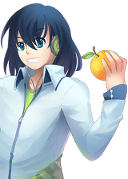
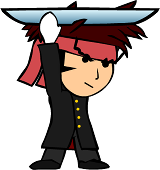
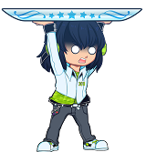
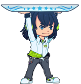
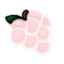

[true]: /wiki/shared/True.png
[false]: /wiki/shared/False.png

# Skinning osu!catch

## Catcher

### comboburst-fruits.png

| Animatable         | Beatmap Skinnable | Skin Version(s) | Origin Point | Optimal Size      | Blend Mode |
|:------------------:|:-----------------:|:---------------:|:------------:|:-----------------:|:----------:|
| ![No][false]&sup1; | ![Yes][true]      | 2.3+            | BottomLeft   | max height: 768px | Normal     |

1. not an animation; instead, one of the frames will be used when a combo milestone is met
   - use `comboburst-fruits-#.png`, replace # with an indexed count (start count at zero)

- can be disabled in the options
- osu!catch specific combobursts
- skin version `2.3` needs to be explictly stated in skin.ini (this is because osu!standard and osu!catch used to share their comboburst prior to this change)
- should face RIGHT

### fruit-ryuuta.png

| Animatable   | Beatmap Skinnable  | Skin Version(s) | Origin Point | Optimal Size           | Blend Mode |
|:------------:|:------------------:|:---------------:|:------------:|:----------------------:|:----------:|
| ![Yes][true] | ![Yes][true]&sup1; | 2.2-            | Top          | max width: 302px&sup2; | Normal     |

1. if included in a beatmap skin, the end user must be using a skin that uses versions 1.0 to 2.2
2. the first 16 pixels at the top should be transparent; width should cover two fruits at circle size 0

- animation name: `fruit-ryuuta-#.png`, replace # with an indexed count (start count at zero)
- legacy support for older skins
- should face RIGHT

### fruit-catcher-fail.png

| Animatable   | Beatmap Skinnable | Skin Version(s) | Origin Point | Optimal Size           | Blend Mode |
|:------------:|:-----------------:|:---------------:|:------------:|:----------------------:|:----------:|
| ![Yes][true] | ![Yes][true]      | 2.3+            | Top          | max width: 302px&sup1; | Normal     |

1. the first 16 pixels at the top should be transparent; width should cover two fruits at circle size 0

- animation name: `fruit-catcher-fail-#.png`, replace # with an indexed count (start count at zero)
- this is the catcher state when a fruit or drop/droplet is missed
  - this overrides `fruit-catcher-kiai.png` if a fruit or drop/droplet is missed during kiai time

### fruit-catcher-idle.png

| Animatable   | Beatmap Skinnable | Skin Version(s) | Origin Point | Optimal Size           | Blend Mode |
|:------------:|:-----------------:|:---------------:|:------------:|:----------------------:|:----------:|
| ![Yes][true] | ![Yes][true]      | 2.3+            | Top          | max width: 302px&sup1; | Normal     |

1. the first 16 pixels at the top should be transparent; width should cover two fruits at circle size 0

- animation name: `fruit-catcher-idle-#.png`, replace # with an indexed count (start count at zero)
- this is the catcher state when doing nothing or catching fruits/drops/droplets/bananas

### fruit-catcher-kiai.png

| Animatable   | Beatmap Skinnable | Skin Version(s) | Origin Point | Optimal Size           | Blend Mode |
|:------------:|:-----------------:|:---------------:|:------------:|:----------------------:|:----------:|
| ![Yes][true] | ![Yes][true]      | 2.3+            | Top          | max width: 302px&sup1; | Normal     |

1. the first 16 pixels at the top should be transparent; width should cover two fruits at circle size 0

- animation name: `fruit-catcher-kiai-#.png`, replace # with an indexed count (start count at zero)
- this is the catcher state during kiai time
  - `fruit-catcher-fail.png` can override this if the player misses a fruit or drop/droplet during kiai time

### lighting.png

| Animatable   | Beatmap Skinnable | Skin Version(s) | Origin Point | Optimal Size | Blend Mode     |
|:------------:|:-----------------:|:---------------:|:------------:|:------------:|:--------------:|
| ![No][false] | ![Yes][true]      | all             | Top          | -            | Additive&sup1; |

1. tinted with combo colours

- pulsates on the catch line where fruits gonna drop at during kiai time
- this element is the same one used for osu!standard and osu!taiko

## Fruits

It is important to not make the fruit images transparent!
This is because the hyperdash outline uses the fruit image to create this outline.
You could, however, make the overlays transparent!

### fruit-apple.png

| Animatable   | Beatmap Skinnable | Skin Version(s) | Origin Point | Optimal Size | Blend Mode           |
|:------------:|:-----------------:|:---------------:|:------------:|:------------:|:--------------------:|
| ![No][false] | ![Yes][true]      | all             | Centre       | 128x128      | Multiplicative&sup1; |

1. tinted with combo colours

- shown third

### fruit-apple-overlay.png

| Animatable   | Beatmap Skinnable | Skin Version(s) | Origin Point | Optimal Size | Blend Mode  |
|:------------:|:-----------------:|:---------------:|:------------:|:------------:|:-----------:|
| ![No][false] | ![Yes][true]      | all             | Centre       | 128x128      | Normal      |

- shown third, overlaying `fruit-apple.png`

### fruit-bananas.png

| Animatable   | Beatmap Skinnable | Skin Version(s) | Origin Point | Optimal Size | Blend Mode           |
|:------------:|:-----------------:|:---------------:|:------------:|:------------:|:--------------------:|
| ![No][false] | ![Yes][true]      | all             | Centre       | 128x128      | Multiplicative&sup1; |

1. tinted yellow, always

- shown during a "spinner"

### fruit-bananas-overlay.png

| Animatable   | Beatmap Skinnable | Skin Version(s) | Origin Point | Optimal Size | Blend Mode  |
|:------------:|:-----------------:|:---------------:|:------------:|:------------:|:-----------:|
| ![No][false] | ![Yes][true]      | all             | Centre       | 128x128      | Normal      |

- shown during a "spinner", overlaying `fruit-apple.png`

### fruit-drop.png

| Animatable   | Beatmap Skinnable | Skin Version(s) | Origin Point | Optimal Size | Blend Mode           |
|:------------:|:-----------------:|:---------------:|:------------:|:------------:|:--------------------:|
| ![No][false] | ![Yes][true]      | all             | Centre       | 128x128      | Multiplicative&sup1; |

1. tinted with combo colours

- shown third

### fruit-drop-overlay.png

_(transparent; not included)_

| Animatable   | Beatmap Skinnable | Skin Version(s) | Origin Point | Optimal Size | Blend Mode  |
|:------------:|:-----------------:|:---------------:|:------------:|:------------:|:-----------:|
| ![No][false] | ![Yes][true]      | all             | Centre       | 128x128      | Normal      |

- not used in ranking screen
- this is the slider and sliderticks for droplets, overlaying `fruit-drop.png`

### fruit-grapes.png

| Animatable   | Beatmap Skinnable | Skin Version(s) | Origin Point | Optimal Size | Blend Mode           |
|:------------:|:-----------------:|:---------------:|:------------:|:------------:|:--------------------:|
| ![No][false] | ![Yes][true]      | all             | Centre       | 128x128      | Multiplicative&sup1; |

1. tinted with combo colours

- shown second

### fruit-grapes-overlay.png

| Animatable   | Beatmap Skinnable | Skin Version(s) | Origin Point | Optimal Size | Blend Mode  |
|:------------:|:-----------------:|:---------------:|:------------:|:------------:|:-----------:|
| ![No][false] | ![Yes][true]      | all             | Centre       | 128x128      | Normal      |

- shown second, overlaying `fruit-grapes.png`

### fruit-orange.png

| Animatable   | Beatmap Skinnable | Skin Version(s) | Origin Point | Optimal Size | Blend Mode           |
|:------------:|:-----------------:|:---------------:|:------------:|:------------:|:--------------------:|
| ![No][false] | ![Yes][true]      | all             | Centre       | 128x128      | Multiplicative&sup1; |

1. tinted with combo colours

- shown last

### fruit-orange-overlay.png

| Animatable   | Beatmap Skinnable | Skin Version(s) | Origin Point | Optimal Size | Blend Mode  |
|:------------:|:-----------------:|:---------------:|:------------:|:------------:|:-----------:|
| ![No][false] | ![Yes][true]      | all             | Centre       | 128x128      | Normal      |

- shown last, overlaying `fruit-orange.png`

### fruit-pear.png

| Animatable   | Beatmap Skinnable | Skin Version(s) | Origin Point | Optimal Size | Blend Mode           |
|:------------:|:-----------------:|:---------------:|:------------:|:------------:|:--------------------:|
| ![No][false] | ![Yes][true]      | all             | Centre       | 128x128      | Multiplicative&sup1; |

1. tinted with combo colours

- shown first

### fruit-pear-overlay.png

| Animatable   | Beatmap Skinnable | Skin Version(s) | Origin Point | Optimal Size | Blend Mode  |
|:------------:|:-----------------:|:---------------:|:------------:|:------------:|:-----------:|
| ![No][false] | ![Yes][true]      | all             | Centre       | 128x128      | Normal      |

- shown first, overlaying `fruit-pear.png`
