# Skinning osu!catch

## Catcher

`fruit-catcher-idle.png`

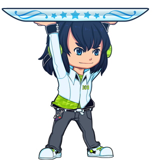

| Versi | Dapat Dianimasikan | Dapat Dibuat Sebagai Skin Beatmap | Mode Blending | Titik Pusat Objek | Ukuran Resolusi SD yang Disarankan |
| :-: | :-: | :-: | :-: | :-: | :-: |
| 2.3+ | ![Ya][true] | ![Ya][true] | Normal | Atas | Lebar minimal: 302px |

Catatan:

- Nama animasi: `fruit-catcher-idle-{n}.png`
- Elemen ini merupakan tampilan catcher ketika catcher sedang tidak berbuat apa-apa atau sedang menangkap objek.
- Elemen ini harus menghadap ke kanan.
- 16 px pertama dari atas harus transparan.
- Lebarnya harus dapat menangkap dua fruit pada Circle Size yang bernilai 0.

---

`fruit-catcher-fail.png`

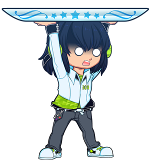

| Versi | Dapat Dianimasikan | Dapat Dibuat Sebagai Skin Beatmap | Mode Blending | Titik Pusat Objek | Ukuran Resolusi SD yang Disarankan |
| :-: | :-: | :-: | :-: | :-: | :-: |
| 2.3+ | ![Ya][true] | ![Ya][true] | Normal | Tengah | - |

Catatan:

- Nama animasi: `fruit-catcher-fail-{n}.png`
- Elemen ini merupakan tampilan catcher ketika miss.
- Elemen ini menggantikan `fruit-catcher-kiai.png` jika sebuah fruit atau drop/droplet terlewatkan saat [kiai time](/wiki/Gameplay/Kiai_time).
- Elemen ini harus menghadap ke kanan.

---

`fruit-catcher-kiai.png`

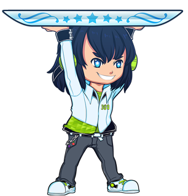

| Versi | Dapat Dianimasikan | Dapat Dibuat Sebagai Skin Beatmap | Mode Blending | Titik Pusat Objek | Ukuran Resolusi SD yang Disarankan |
| :-: | :-: | :-: | :-: | :-: | :-: |
| 2.3+ | ![Ya][true] | ![Ya][true] | Normal | Tengah | - |

Catatan:

- Nama animasi: `fruit-catcher-kiai-{n}.png`
- Elemen ini merupakan tampilan catcher selama kiai time.
- `fruit-catcher-fail.png` menggantikan elemen ini jika sebuah fruit atau drop/droplet terlewatkan saat [kiai time](/wiki/Gameplay/Kiai_time).
- Elemen ini harus menghadap ke kanan.

---

`fruit-ryuuta.png`

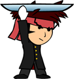

| Versi | Dapat Dianimasikan | Dapat Dibuat Sebagai Skin Beatmap | Mode Blending | Titik Pusat Objek | Ukuran Resolusi SD yang Disarankan |
| :-: | :-: | :-: | :-: | :-: | :-: |
| 2.2- | ![Ya][true] | ![Ya][true] (lihat catatan) | Normal | Tengah | - |

Catatan:

- Elemen ini dapat dibuat sebagai skin beatmap jika pemain menggunakan skin dengan versi 2.2-.
- Nama animasi: `fruit-ryuuta-{n}.png`
- Elemen ini harus menghadap ke kanan.

## Comboburst

`comboburst-fruits.png`

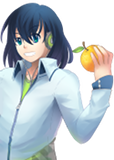

| Versi | Dapat Dianimasikan | Dapat Dibuat Sebagai Skin Beatmap | Mode Blending | Titik Pusat Objek | Ukuran Resolusi SD yang Disarankan |
| :-: | :-: | :-: | :-: | :-: | :-: |
| 2.3+ | ![Tidak][false] (lihat catatan) | ![Ya][true] | Normal | Pojok kiri bawah | Tinggi maksimal:: 768px |

Catatan:

- Untuk memiliki beberapa comboburst, gunakan: `comboburst-fruits-{n}.png`.
  - Salah satu dari gambar dalam grup akan muncul ketika pemain mencapai combo milestone.
- Pada versi 2.2-, elemen `comboburst.png` akan digunakan sebagai gantinya.
- Comboburst ini hanya akan muncul ketika bermain mode osu!catch
- Elemen ini dapat dimatikan melalui menu [options](/wiki/Client/Options).
- Elemen ini harus menghadap ke kanan.

## Fruit

`lighting.png`

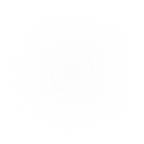

| Versi | Dapat Dianimasikan | Dapat Dibuat Sebagai Skin Beatmap | Mode Blending | Titik Pusat Objek | Ukuran Resolusi SD yang Disarankan |
| :-: | :-: | :-: | :-: | :-: | :-: |
| Semua | ![Tidak][false] | ![Ya][true] | Additive | Tengah | 100x100 |

Catatan:

- Elemen ini berdenyut pada lokasi di mana fruit akan dapat ditangkap selama [kiai time](/wiki/Gameplay/Kiai_time).
- Elemen ini dapat digunakan juga pada mode [osu!](/wiki/Game_mode/osu!) dan [osu!taiko](/wiki/Game_mode/osu!taiko).
- Elemen ini dapat dimatikan melalui menu [options](/wiki/Client/Options).
- Pewarnaan tergantung oleh warna combo fruit.

---

`fruit-pear.png`

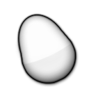

| Versi | Dapat Dianimasikan | Dapat Dibuat Sebagai Skin Beatmap | Mode Blending | Titik Pusat Objek | Ukuran Resolusi SD yang Disarankan |
| :-: | :-: | :-: | :-: | :-: | :-: |
| Semua | ![Tidak][false] | ![Ya][true] | Multiplicative | Tengah | 128x128 |

Catatan:

- Elemen ini muncul pertama.
- Elemen ini digunakan untuk garis luar hyperdash.
- Pewarnaan tergantung oleh warna combo fruit.

---

`fruit-pear-overlay.png`

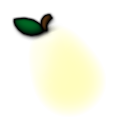

| Versi | Dapat Dianimasikan | Dapat Dibuat Sebagai Skin Beatmap | Mode Blending | Titik Pusat Objek | Ukuran Resolusi SD yang Disarankan |
| :-: | :-: | :-: | :-: | :-: | :-: |
| Semua | ![Tidak][false] | ![Ya][true] | Normal | Tengah | 128x128 |

Catatan:

- Elemen ini muncul pertama; melapisi `fruit-pear.png`.

---

`fruit-grapes.png`

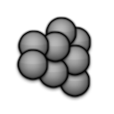

| Versi | Dapat Dianimasikan | Dapat Dibuat Sebagai Skin Beatmap | Mode Blending | Titik Pusat Objek | Ukuran Resolusi SD yang Disarankan |
| :-: | :-: | :-: | :-: | :-: | :-: |
| Semua | ![Tidak][false] | ![Ya][true] | Multiplicative | Tengah | 128x128 |

Catatan:

- Elemen ini muncul kedua.
- Elemen ini digunakan untuk garis luar hyperdash.
- Pewarnaan tergantung oleh warna combo fruit.

---

`fruit-grapes-overlay.png`

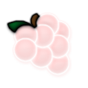

| Versi | Dapat Dianimasikan | Dapat Dibuat Sebagai Skin Beatmap | Mode Blending | Titik Pusat Objek | Ukuran Resolusi SD yang Disarankan |
| :-: | :-: | :-: | :-: | :-: | :-: |
| Semua | ![Tidak][false] | ![Ya][true] | Normal | Tengah | 128x128 |

Catatan:

- Elemen ini muncul kedua; melapisi `fruit-grapes.png`.

---

`fruit-apple.png`

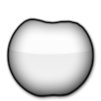

| Versi | Dapat Dianimasikan | Dapat Dibuat Sebagai Skin Beatmap | Mode Blending | Titik Pusat Objek | Ukuran Resolusi SD yang Disarankan |
| :-: | :-: | :-: | :-: | :-: | :-: |
| Semua | ![Tidak][false] | ![Ya][true] | Multiplicative | Tengah | 128x128 |

Catatan:

- Elemen ini muncul ketiga.
- Elemen ini digunakan untuk garis luar hyperdash.
- Pewarnaan tergantung oleh warna combo fruit.

---

`fruit-apple-overlay.png`

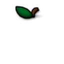

| Versi | Dapat Dianimasikan | Dapat Dibuat Sebagai Skin Beatmap | Mode Blending | Titik Pusat Objek | Ukuran Resolusi SD yang Disarankan |
| :-: | :-: | :-: | :-: | :-: | :-: |
| Semua | ![Tidak][false] | ![Ya][true] | Normal | Tengah | 128x128 |

Catatan:

- Elemen ini muncul ketiga; melapisi `fruit-apple.png`.

---

`fruit-orange.png`

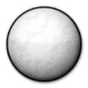

| Versi | Dapat Dianimasikan | Dapat Dibuat Sebagai Skin Beatmap | Mode Blending | Titik Pusat Objek | Ukuran Resolusi SD yang Disarankan |
| :-: | :-: | :-: | :-: | :-: | :-: |
| Semua | ![Tidak][false] (see notes) | ![Ya][true] | Multiplicative | Tengah | 128x128 |

Catatan:

- Dapat dianimasikan tetapi hanya *frame* pertama yang digunakan.
  - Nama animasi: `fruit-orange-{n}.png`
- Elemen ini muncul keempat (terakhir).
- Elemen ini digunakan untuk garis luar hyperdash.
- Pewarnaan tergantung oleh warna combo fruit.
  - Pada halaman ranking:
    - Diwarnai oranye untuk fruit yang ditangkap.
    - Diwarnai abu-abu cerah untuk fruit yang tidak ditangkap.

---

`fruit-orange-overlay.png`

| Versi | Dapat Dianimasikan | Dapat Dibuat Sebagai Skin Beatmap | Mode Blending | Titik Pusat Objek | Ukuran Resolusi SD yang Disarankan |
| :-: | :-: | :-: | :-: | :-: | :-: |
| Semua | ![Tidak][false] (see notes) | ![Ya][true] | Normal | Tengah | 128x128 |

Catatan:

- Dapat dianimasikan tetapi hanya *frame* pertama yang digunakan.
  - Nama animasi: `fruit-orange-overlay-{n}.png`
- Elemen ini muncul keempat (terakhir); melapisi `fruit-orange.png`.

---

`fruit-bananas.png`

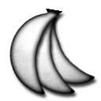

| Versi | Dapat Dianimasikan | Dapat Dibuat Sebagai Skin Beatmap | Mode Blending | Titik Pusat Objek | Ukuran Resolusi SD yang Disarankan |
| :-: | :-: | :-: | :-: | :-: | :-: |
| Semua | ![Tidak][false] | ![Ya][true] | Multiplicative | Tengah | 128x128 |

Catatan:

- Diwarnai kuning.
- Elemen ini digunakan sebagai spinner pada osu!catch.
- Elemen ini digunakan untuk garis luar hyperdash.

---

`fruit-bananas-overlay.png`

| Versi | Dapat Dianimasikan | Dapat Dibuat Sebagai Skin Beatmap | Mode Blending | Titik Pusat Objek | Ukuran Resolusi SD yang Disarankan |
| :-: | :-: | :-: | :-: | :-: | :-: |
| Semua | ![Tidak][false] | ![Ya][true] | Normal | Tengah | 128x128 |

Catatan:

- Elemen ini digunakan sebagai spinner pada osu!catch; melapisi `fruit-bananas.png`.

---

`fruit-drop.png`

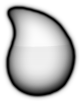

| Versi | Dapat Dianimasikan | Dapat Dibuat Sebagai Skin Beatmap | Mode Blending | Titik Pusat Objek | Ukuran Resolusi SD yang Disarankan |
| :-: | :-: | :-: | :-: | :-: | :-: |
| Semua | ![Tidak][false] (see notes) | ![Ya][true] | Multiplicative | Tengah | 128x128 |

Catatan:

- Dapat dianimasikan tetapi hanya *frame* pertama yang digunakan.
  - Nama animasi: `fruit-drop-{n}.png`
- Elemen ini digunakan sebagai slider pada osu!catch.
- Pewarnaan tergantung oleh warna combo fruit.

---

`fruit-drop-overlay.png`

| Versi | Dapat Dianimasikan | Dapat Dibuat Sebagai Skin Beatmap | Mode Blending | Titik Pusat Objek | Ukuran Resolusi SD yang Disarankan |
| :-: | :-: | :-: | :-: | :-: | :-: |
| Semua | ![Tidak][false] | ![Ya][true] | Normal | Tengah | 128x128 |

Catatan:

- Elemen ini tidak digunakan pada halaman ranking.
- Elemen ini digunakan sebagai slider pada osu!catch; melapisi `fruit-drop.png`

[true]: /wiki/shared/true.png
[false]: /wiki/shared/false.png
