# osu!catch skinning

## Catcher

`fruit-catcher-idle.png`

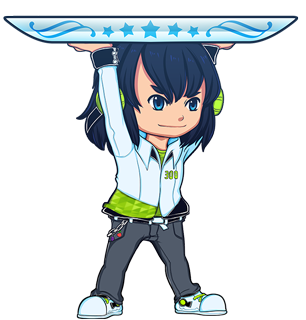

| Versions | Animatable | Beatmap Skinnable | Blend Mode | Origin | Suggested SD Size |
| :-: | :-: | :-: | :-: | :-: | :-: |
| 2.3+ | ![Yes][true] | ![Yes][true] | Normal | Top | ความกว้างขั้นต่ำ: 302px |

Notes:

- ชื่อ animation: `fruit-catcher-idle-{n}.png`
- element นี้คือสถานะของ catcher ตอนอยู่นิ่งหรือกำลังรับ object
- ควรหันหน้าไปทางขวา
- 16 pixel แรกด้านบนควรเป็นแบบโปร่งใส
- ความกว้างควรครอบคลุมผลไม้สองลูกที่ Circle Size 0

---

`fruit-catcher-fail.png`

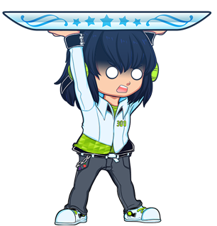

| Versions | Animatable | Beatmap Skinnable | Blend Mode | Origin | Suggested SD Size |
| :-: | :-: | :-: | :-: | :-: | :-: |
| 2.3+ | ![Yes][true] | ![Yes][true] | Normal | Centre | - |

Notes:

- ชื่อ animation: `fruit-catcher-fail-{n}.png`
- element นี้คือสถานะ "missed" ของ catcher
- element นี้จะ override `fruit-catcher-kiai.png` ถ้าพลาด fruit หรือ drop/droplet ระหว่าง [kiai time](/wiki/Gameplay/Kiai_time)
- ควรหันหน้าไปทางขวา

---

`fruit-catcher-kiai.png`

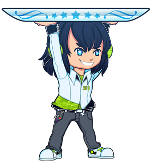

| Versions | Animatable | Beatmap Skinnable | Blend Mode | Origin | Suggested SD Size |
| :-: | :-: | :-: | :-: | :-: | :-: |
| 2.3+ | ![Yes][true] | ![Yes][true] | Normal | Centre | - |

Notes:

- ชื่อ animation: `fruit-catcher-kiai-{n}.png`
- element นี้คือสถานะของ catcher ระหว่าง kiai time
- `fruit-catcher-fail.png` จะ override element นี้ถ้าพลาด fruit หรือ drop/droplet ระหว่าง [kiai time](/wiki/Gameplay/Kiai_time)
- ควรหันหน้าไปทางขวา

---

`fruit-ryuuta.png`

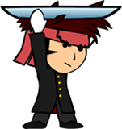

| Versions | Animatable | Beatmap Skinnable | Blend Mode | Origin | Suggested SD Size |
| :-: | :-: | :-: | :-: | :-: | :-: |
| 2.2- | ![Yes][true] | ![Yes][true] (ดู notes) | Normal | Centre | - |

Notes:

- ทำสกินผ่านบีตแมปได้ถ้าสกินผู้เล่นใช้ v2.2-
- ชื่อ animation: `fruit-ryuuta-{n}.png`
- ควรหันหน้าไปทางขวา

## Comboburst

`comboburst-fruits.png`

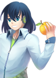

| Versions | Animatable | Beatmap Skinnable | Blend Mode | Origin | Suggested SD Size |
| :-: | :-: | :-: | :-: | :-: | :-: |
| 2.3+ | ![No][false] (ดู notes) | ![Yes][true] | Normal | BottomLeft | ความสูงสูงสุด: 768px |

Notes:

- ถ้าต้องการมี comboburst หลายแบบ ให้ใช้: `comboburst-fruits-{n}.png`
  - หนึ่งในรูปของ set นี้จะปรากฏเมื่อทำคอมโบถึง milestone
- ใน v2.2- จะใช้ `comboburst.png` แทน
- comboburst เฉพาะของ osu!catch
- สามารถปิดได้ใน[ตัวเลือก](/wiki/Client/Options)
- ควรหันหน้าไปทางขวา

## Fruits

`lighting.png`

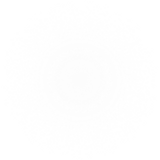

| Versions | Animatable | Beatmap Skinnable | Blend Mode | Origin | Suggested SD Size |
| :-: | :-: | :-: | :-: | :-: | :-: |
| All | ![No][false] | ![Yes][true] | Additive | Centre | 100x100 |

Notes:

- element นี้จะกระพริบที่ catch line ตรงตำแหน่งที่ fruit จะตกลงมาในช่วง [kiai time](/wiki/Gameplay/Kiai_time)
- element นี้ยังใช้ใน [osu!](/wiki/Game_mode/osu!) และ [osu!taiko](/wiki/Game_mode/osu!taiko) ด้วย
- สามารถปิดได้ใน[ตัวเลือก](/wiki/Client/Options)
- การ tint สีขึ้นอยู่กับสีคอมโบของ fruit

---

`fruit-pear.png`

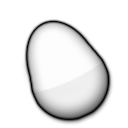

| Versions | Animatable | Beatmap Skinnable | Blend Mode | Origin | Suggested SD Size |
| :-: | :-: | :-: | :-: | :-: | :-: |
| All | ![No][false] | ![Yes][true] | Multiplicative | Centre | 128x128 |

Notes:

- element นี้จะแสดงเป็นลำดับแรก
- element นี้ใช้สำหรับเส้นขอบ hyperdash
- การ tint สีขึ้นอยู่กับสีคอมโบของ fruit

---

`fruit-pear-overlay.png`

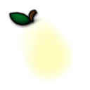

| Versions | Animatable | Beatmap Skinnable | Blend Mode | Origin | Suggested SD Size |
| :-: | :-: | :-: | :-: | :-: | :-: |
| All | ![No][false] | ![Yes][true] | Normal | Centre | 128x128 |

Notes:

- element นี้จะแสดงเป็นลำดับแรก โดย overlay ทับ `fruit-pear.png`

---

`fruit-grapes.png`

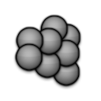

| Versions | Animatable | Beatmap Skinnable | Blend Mode | Origin | Suggested SD Size |
| :-: | :-: | :-: | :-: | :-: | :-: |
| All | ![No][false] | ![Yes][true] | Multiplicative | Centre | 128x128 |

Notes:

- element นี้จะแสดงเป็นลำดับที่สอง
- element นี้ใช้สำหรับเส้นขอบ hyperdash
- การ tint สีขึ้นอยู่กับสีคอมโบของ fruit

---

`fruit-grapes-overlay.png`

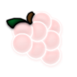

| Versions | Animatable | Beatmap Skinnable | Blend Mode | Origin | Suggested SD Size |
| :-: | :-: | :-: | :-: | :-: | :-: |
| All | ![No][false] | ![Yes][true] | Normal | Centre | 128x128 |

Notes:

- element นี้จะแสดงเป็นลำดับที่สอง โดย overlay ทับ `fruit-grapes.png`

---

`fruit-apple.png`

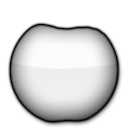

| Versions | Animatable | Beatmap Skinnable | Blend Mode | Origin | Suggested SD Size |
| :-: | :-: | :-: | :-: | :-: | :-: |
| All | ![No][false] | ![Yes][true] | Multiplicative | Centre | 128x128 |

Notes:

- element นี้จะแสดงเป็นลำดับที่สาม
- element นี้ใช้สำหรับเส้นขอบ hyperdash
- การ tint สีขึ้นอยู่กับสีคอมโบของ fruit

---

`fruit-apple-overlay.png`

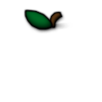

| Versions | Animatable | Beatmap Skinnable | Blend Mode | Origin | Suggested SD Size |
| :-: | :-: | :-: | :-: | :-: | :-: |
| All | ![No][false] | ![Yes][true] | Normal | Centre | 128x128 |

Notes:

- element นี้จะแสดงเป็นลำดับที่สาม โดย overlay ทับ `fruit-apple.png`

---

`fruit-orange.png`

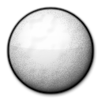

| Versions | Animatable | Beatmap Skinnable | Blend Mode | Origin | Suggested SD Size |
| :-: | :-: | :-: | :-: | :-: | :-: |
| All | ![No][false] (ดู notes) | ![Yes][true] | Multiplicative | Centre | 128x128 |

Notes:

- ทำ animation ได้ แต่จะใช้เฉพาะเฟรมที่ศูนย์เท่านั้น
  - ชื่อ animation: `fruit-orange-{n}.png`
- element นี้จะแสดงเป็นลำดับที่สี่ (ลำดับสุดท้าย)
- element นี้ใช้สำหรับเส้นขอบ hyperdash
- การ tint สีขึ้นอยู่กับสีคอมโบของ fruit
  - บนหน้าจอ ranking:
    - tint เป็นสีส้มสำหรับ fruit ที่เก็บได้
    - tint เป็นสีเทาอ่อนสำหรับ fruit ที่พลาด

---

`fruit-orange-overlay.png`

| Versions | Animatable | Beatmap Skinnable | Blend Mode | Origin | Suggested SD Size |
| :-: | :-: | :-: | :-: | :-: | :-: |
| All | ![No][false] (ดู notes) | ![Yes][true] | Normal | Centre | 128x128 |

Notes:

- ทำ animation ได้ แต่จะใช้เฉพาะเฟรมที่ศูนย์เท่านั้น
  - ชื่อ animation: `fruit-orange-overlay-{n}.png`
- element นี้จะแสดงเป็นลำดับที่สี่ (ลำดับสุดท้าย) โดย overlay ทับ `fruit-orange.png`

---

`fruit-bananas.png`

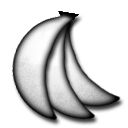

| Versions | Animatable | Beatmap Skinnable | Blend Mode | Origin | Suggested SD Size |
| :-: | :-: | :-: | :-: | :-: | :-: |
| All | ![No][false] | ![Yes][true] | Multiplicative | Centre | 128x128 |

Notes:

- tint เป็นสีเหลือง
- element นี้จะแสดงระหว่าง "spinner"
- element นี้ใช้สำหรับเส้นขอบ hyperdash

---

`fruit-bananas-overlay.png`

| Versions | Animatable | Beatmap Skinnable | Blend Mode | Origin | Suggested SD Size |
| :-: | :-: | :-: | :-: | :-: | :-: |
| All | ![No][false] | ![Yes][true] | Normal | Centre | 128x128 |

Notes:

- element นี้จะแสดงระหว่าง spinner โดย overlay ทับ `fruit-bananas.png`

---

`fruit-drop.png`

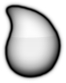

| Versions | Animatable | Beatmap Skinnable | Blend Mode | Origin | Suggested SD Size |
| :-: | :-: | :-: | :-: | :-: | :-: |
| All | ![No][false] (ดู notes) | ![Yes][true] | Multiplicative | Centre | 128x128 |

Notes:

- ทำ animation ได้ แต่จะใช้เฉพาะเฟรมที่ศูนย์เท่านั้น
  - ชื่อ animation: `fruit-drop-{n}.png`
- element นี้จะแสดงระหว่าง "slider"
- การ tint สีขึ้นอยู่กับสีคอมโบของ fruit

---

`fruit-drop-overlay.png`

| Versions | Animatable | Beatmap Skinnable | Blend Mode | Origin | Suggested SD Size |
| :-: | :-: | :-: | :-: | :-: | :-: |
| All | ![No][false] | ![Yes][true] | Normal | Centre | 128x128 |

Notes:

- element นี้ไม่ได้ใช้บนหน้าจอ ranking
- element นี้จะแสดงระหว่าง "slider" โดย overlay ทับ `fruit-drop.png`

[true]: /wiki/shared/true.png
[false]: /wiki/shared/false.png
