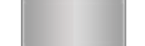
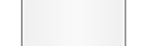
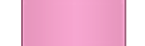
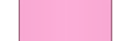
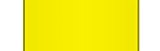

[true]: /wiki/shared/True.png
[false]: /wiki/shared/False.png

# osu!mania

_Main page: [Skinning](/wiki/Skinning)_

_See also: [Skinning osu!mania Tutorial](/wiki/Skinning_osu!mania_Tutorial)_

Since skinning version `2.5`, skinners are now able to fully customize the osu!mania notes and stage using the [skin.ini](/wiki/skin.ini) file.

The following is what _osu!_ will recognize if one chooses to not use the `skin.ini` for further customization.

## Hit Bursts

The following table is for all hit bursts.

| Animatable               | Beatmap Skinnable |
|:------------------------:|:-----------------:|
| ![Yes][true] (see notes) | ![Yes][true]      |

**Notes:**

- If animation was skinned, the zeroth frame will be is used for the ranking screen.
- This element has a fixed looped animation of 60fps.
- If a custom path is used, the ranking screen will use the file in the root directory

---

**Note:**

- Animation name: `mania-hit0-#.png`; replace `#` with an indexed count (start frame count at zero).

---

**Note:**

- Animation name: `mania-hit50-#.png`; replace `#` with an indexed count (start frame count at zero).

---

**Note:**

- Animation name: `mania-hit100-#.png`; replace `#` with an indexed count (start frame count at zero).

---

**Note:**

- Animation name: `mania-hit300-#.png`; replace `#` with an indexed count (start frame count at zero).

---

_`mania-hit300g.png`_ (included images below)

**Note:**

- Animation name: `mania-hit300g-#.png`; replace `#` with an indexed count (start frame count at zero).

## Comboburst

| Animatable               | Beatmap Skinnable |
|:------------------------:|:-----------------:|
| ![Yes][true] (see notes) | ![Yes][true]      |

**Notes:**

- This element is not an animation; instead, one of the frames will be used when a combo milestone is met.
   - use `comboburst-mania-#.png`, replace `#` with an indexed count (start frame count at zero).
- osu!mania specific combobursts
- This can be disabled in the [options](/wiki/options).
- This should face towards the **right**.

## Notes

_Not to be confused with [lengths](#lengths)._

This section is for the single notes.

The following table is for all notes.

| Animatable   | Beatmap Skinnable |
|:------------:|:-----------------:|
| ![Yes][true] | ![No][false]      |

**Notes:**

- These elements are scaled to fit the individual columns.
  - If the columns' widths differ: the smallest one is scaled correctly and the others are squeezed to match its height.
- Notes can be manually be stretched or compressed via the `WidthForNoteHeightScale` command in the [skin.ini](/wiki/skin.ini) file.

---

**Note:**

- Animation name: `mania-note1-#.png`, replace # with an indexed count (start count at zero)

---

**Note:**

- Animation name: `mania-note2-#.png`, replace # with an indexed count (start count at zero)

---

- Animation name: `mania-noteS-#.png`, replace # with an indexed count (start count at zero)

### Lengths

Lengths are also called "hold notes".

#### Head

The following table is for all lengths (head part).

| Animatable   | Beatmap Skinnable |
|:------------:|:-----------------:|
| ![Yes][true] | ![No][false]      |

**Notes:**

- By default, this is also the tail part.
  - When used for the tail part, this element is flipped by default for skin versions `2.5` and up.
    - This behaviour can be disabled by setting `NoteFlipWhenUpsideDownT` to `0`.
- This element is scaled to fit the individual columns.
  - If the columns' widths differ: the smallest one is scaled correctly and the others are squeezed to match its height.
- Notes can be manually stretched or squeezed via the `WidthForNoteHeightScale` command in the [skin.ini](/wiki/skin.ini) file.

---

**Note:**

- Animation name: `mania-note1H-#.png`, replace # with an indexed count (start count at zero)

---

**Note:**

- Animation name: `mania-note2H-#.png`, replace # with an indexed count (start count at zero)

---

**Note:**

- Animation name: `mania-noteSH-#.png`, replace # with an indexed count (start count at zero)

#### Length

The following table is for all lengths (length part).

| Animatable               | Beatmap Skinnable  |
|:------------------------:|:------------------:|
| ![Yes][true] (see notes) | ![No][false]       |

**Notes:**

- The animation starts when the hold note is pressed and stops if released.
- The `NoteBodyStyle` changes the behaviour of these elements.
  - Skin version `2.5` or higher is required.
- Notes can be manually stretched or squeezed via the `WidthForNoteHeightScale` command in the [skin.ini](/wiki/skin.ini) file.

---

_`mania-note1L.png`_ (included images below)

**Notes:**

- Animation name: `mania-note1L-#.png`, replace # with an indexed count (start count at zero).

---

_`mania-note2L.png`_ (included images below)

**Notes:**

- Animation name: `mania-note2L-#.png`, replace # with an indexed count (start count at zero).

---

_`mania-noteSL.png`_ (included images below)

**Notes:**

- Animation name: `mania-note2L-#.png`, replace # with an indexed count (start count at zero).

#### Tail

The following table is for all lengths (tail part).

| Animatable   | Beatmap Skinnable |
|:------------:|:-----------------:|
| ![Yes][true] | ![No][false]      |

- These elements are the tail part of the hold note.
- By default, the head notes are used instead.
- By default, these elements are flipped for skin versions `2.5` and up.
  - This behaviour can be disabled by setting `NoteFlipWhenUpsideDownT` to `0`
- These elements are scaled to fit the individual columns.
  - If the columns' widths differ: the smallest one is scaled correctly and the others are squeezed to match its height.
- Notes can be manually stretched or squeezed via the `WidthForNoteHeightScale` command in the [skin.ini](/wiki/skin.ini) file.

---

_`mania-note1T.png`_ (transparent; not included)

**Note:**

- Animation name: `mania-note1T-#.png`, replace # with an indexed count (start count at zero)

---

_`mania-note2T.png`_ (transparent; not included)

**Note:**

- Animation name: `mania-note2T-#.png`, replace # with an indexed count (start count at zero)

---

_`mania-noteST.png` (transparent; not included)

**Note:**

- Animation name: `mania-noteST-#.png`, replace # with an indexed count (start count at zero)

## Stage

| Animatable   | Beatmap Skinnable |
|:------------:|:-----------------:|
| ![No][false] | ![No][false]      |

**Notes:**

- This element is shown on the left side of the stage(s).
- This is stretched to fit the stage height (allows for smaller images).

---

| Animatable   | Beatmap Skinnable |
|:------------:|:-----------------:|
| ![No][false] | ![No][false]      |

**Notes:**

- This element is shown on the right side of the stage(s).
- This is stretched to fit the stage height (allows for smaller images).

---

_`mania-stage-bottom.png`_ (transparent; not included)

| Animatable   | Beatmap Skinnable |
|:------------:|:-----------------:|
| ![Yes][true] | ![No][false]      |

**Notes:**

- Animation name: `mania-stage-bottom-#.png`, replace # with an indexed count (start count at zero).
- Shown on the bottom (or top, if the stage is upside down) of the stage(s)
- This element will **not** stretched to fit the stage width!
- This is 0.625x smaller than the columns.
- This element should be skinned for a 480px playfield height.

---

| Animatable   | Beatmap Skinnable |
|:------------:|:-----------------:|
| ![Yes][true] | ![No][false]      |

**Notes:**

- Animation name: `mania-stage-light-#.png`, replace # with an indexed count (start count at zero).
- This is the lighting for the columns when the key is pressed.
- This element is placed underneath the notes.

---

| Animatable   | Beatmap Skinnable |
|:------------:|:-----------------:|
| ![No][false] | ![No][false]      |

**Notes:**

- This is the graphical representation of the judgement line (or the hit area).
  - The judgement line is drawn in the middle of the image.

---

_`mania-warningarrow.png`_ (transparent; not included)

| Animatable   | Beatmap Skinnable |
|:------------:|:-----------------:|
| ![No][false] | ![No][false]      |

**Notes:**

- This element should point **downwards**.
- This is always seen before the map starts, if there is enough time.
- This image is automatically flipped horizontally if the stage is upside down.

### Lighting

| Animatable   | Beatmap Skinnable |
|:------------:|:-----------------:|
| ![Yes][true] | ![No][false]      |

**Notes:**

- Animation name: `lightingL-#.png`, replace # with an indexed count (start count at zero).
- This element is the lighting for the hold notes.
- This image is flipped horizontally if the stage is upside down.

---

| Animatable   | Beatmap Skinnable |
|:------------:|:-----------------:|
| ![Yes][true] | ![No][false]      |

**Notes:**

- Animation name: `lightingN-#.png`, replace # with an indexed count (start count at zero).
- This element is the lighting for the single notes (and tail notes).
- This image is flipped horizontally if the stage is upside down.
