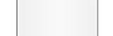
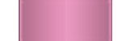
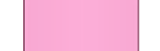
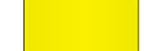

[true]: /wiki/shared/True.png
[false]: /wiki/shared/False.png

# Skinning osu!mania

Since skinning version 2.5, skinners are now able to fully customize the osu!mania notes and stage using the skin.ini file.
For a more robust tutorial, see [Tutorial/osu!mania](./Tutorial/osu!mania).

The following below is what osu! will recognize if one chooses not to use the skin.ini for further customization.

## Hitbursts

### mania-hit0.png

| Animatable         | Beatmap Skinnable | Skin Version(s) | Origin Point | Optimal Size | Blend Mode |
|:------------------:|:-----------------:|:---------------:|:------------:|:------------:|:----------:|
| ![Yes][true]&sup1; | ![Yes][true]      | all             | Centre       | -            | Normal     |

1. if animation is used, the zeroth frame is used for the ranking screen

- fixed looped animation at 60fps
- if a custom path is used, the ranking screen will use the file in the root directory

### mania-hit50.png

| Animatable         | Beatmap Skinnable | Skin Version(s) | Origin Point | Optimal Size | Blend Mode |
|:------------------:|:-----------------:|:---------------:|:------------:|:------------:|:----------:|
| ![Yes][true]&sup1; | ![Yes][true]      | all             | Centre       | -            | Normal     |

1. if animation is used, the zeroth frame is used for the ranking screen

- fixed looped animation at 60fps
- if a custom path is used, the ranking screen will use the file in the root directory

### mania-hit100.png

| Animatable         | Beatmap Skinnable | Skin Version(s) | Origin Point | Optimal Size | Blend Mode |
|:------------------:|:-----------------:|:---------------:|:------------:|:------------:|:----------:|
| ![Yes][true]&sup1; | ![Yes][true]      | all             | Centre       | -            | Normal     |

1. if animation is used, the zeroth frame is used for the ranking screen

- fixed looped animation at 60fps
- if a custom path is used, the ranking screen will use the file in the root directory

### mania-hit300.png

| Animatable         | Beatmap Skinnable | Skin Version(s) | Origin Point | Optimal Size | Blend Mode |
|:------------------:|:-----------------:|:---------------:|:------------:|:------------:|:----------:|
| ![Yes][true]&sup1; | ![Yes][true]      | all             | Centre       | -            | Normal     |

1. if animation is used, the zeroth frame is used for the ranking screen

- fixed looped animation at 60fps
- if a custom path is used, the ranking screen will use the file in the root directory

### mania-hit300g.png

| Animatable         | Beatmap Skinnable | Skin Version(s) | Origin Point | Optimal Size | Blend Mode |
|:------------------:|:-----------------:|:---------------:|:------------:|:------------:|:----------:|
| ![Yes][true]&sup1; | ![Yes][true]      | all             | Centre       | -            | Normal     |

1. if animation is used, the zeroth frame is used for the ranking screen

- fixed looped animation at 60fps
- if a custom path is used, the ranking screen will use the file in the root directory

## Comboburst

### comboburst-mania.png

| Animatable         | Beatmap Skinnable | Skin Version(s) | Origin Point | Optimal Size | Blend Mode |
|:------------------:|:-----------------:|:---------------:|:------------:|:------------:|:----------:|
| ![Yes][true]&sup1; | ![Yes][true]      | all             | Centre       | -            | Normal     |

1. not an animation; instead, one of the frames will be used when a combo milestone is met
   - use `comboburst-mania-#.png`, replace # with an indexed count (start count at zero)

- can be disabled in the options
- osu!mania specific combobursts
- should face RIGHT

## Notes

### mania-note1.png

| Animatable   | Beatmap Skinnable | Skin Version(s) | Origin Point | Optimal Size | Blend Mode |
|:------------:|:-----------------:|:---------------:|:------------:|:------------:|:----------:|
| ![Yes][true] | ![No][false]      | all             | Bottom       | -            | Normal     |

- animation name: `mania-note1-#.png`, replace # with indexed count (start count at zero)
- this element is the single note
- this element is scaled to fit the individual columns
  - if the columns' widths differ: the smallest one is scaled correctly and the others are squeezed to match its height
- notes can be manually stretched or squeezed via the `WidthForNoteHeightScale` command in the skin.ini file

### mania-note2.png

| Animatable   | Beatmap Skinnable | Skin Version(s) | Origin Point | Optimal Size | Blend Mode |
|:------------:|:-----------------:|:---------------:|:------------:|:------------:|:----------:|
| ![Yes][true] | ![No][false]      | all             | Bottom       | -            | Normal     |

- animation name: `mania-note2-#.png`, replace # with indexed count (start count at zero)
- this element is the single note
- this element is scaled to fit the individual columns
  - if the columns' widths differ: the smallest one is scaled correctly and the others are squeezed to match its height
- notes can be manually stretched or squeezed via the `WidthForNoteHeightScale` command in the skin.ini file

### mania-noteS.png

| Animatable   | Beatmap Skinnable | Skin Version(s) | Origin Point | Optimal Size | Blend Mode |
|:------------:|:-----------------:|:---------------:|:------------:|:------------:|:----------:|
| ![Yes][true] | ![No][false]      | all             | Bottom       | -            | Normal     |

- animation name: `mania-noteS-#.png`, replace # with indexed count (start count at zero)
- this element is the single note
- this element is scaled to fit the individual columns
  - if the columns' widths differ: the smallest one is scaled correctly and the others are squeezed to match its height
- notes can be manually stretched or squeezed via the `WidthForNoteHeightScale` command in the skin.ini file

### mania-note1H.png

| Animatable   | Beatmap Skinnable | Skin Version(s) | Origin Point | Optimal Size | Blend Mode |
|:------------:|:-----------------:|:---------------:|:------------:|:------------:|:----------:|
| ![Yes][true] | ![No][false]      | all             | Bottom       | -            | Normal     |

- animation name: `mania-note1H-#.png`, replace # with indexed count (start count at zero)
- this element is the head part of the hold note
  - by default, this is also the tail note
    - when used for the tail part, this element is flipped by default for v2.5+
      - this behavior can be disabled by setting `NoteFlipWhenUpsideDownT` to `0`
- this element is scaled to fit the individual columns
  - if the columns' widths differ: the smallest one is scaled correctly and the others are squeezed to match its height
- notes can be manually stretched or squeezed via the `WidthForNoteHeightScale` command in the skin.ini file

### mania-note2H.png

| Animatable   | Beatmap Skinnable | Skin Version(s) | Origin Point | Optimal Size | Blend Mode |
|:------------:|:-----------------:|:---------------:|:------------:|:------------:|:----------:|
| ![Yes][true] | ![No][false]      | all             | Bottom       | -            | Normal     |

- animation name: `mania-note2H-#.png`, replace # with indexed count (start count at zero)
- this element is the head part of the hold note
  - by default, this is also the tail note
    - when used for the tail part, this element is flipped by default for v2.5+
      - this behavior can be disabled by setting `NoteFlipWhenUpsideDownT` to `0`
- this element is scaled to fit the individual columns
  - if the columns' widths differ: the smallest one is scaled correctly and the others are squeezed to match its height
- notes can be manually stretched or squeezed via the `WidthForNoteHeightScale` command in the skin.ini file

### mania-noteSH.png

| Animatable   | Beatmap Skinnable | Skin Version(s) | Origin Point | Optimal Size | Blend Mode |
|:------------:|:-----------------:|:---------------:|:------------:|:------------:|:----------:|
| ![Yes][true] | ![No][false]      | all             | Bottom       | -            | Normal     |

- animation name: `mania-noteSH-#.png`, replace # with indexed count (start count at zero)
- this element is the head part of the hold note
  - by default, this is also the tail note
    - when used for the tail part, this element is flipped by default for v2.5+
      - this behavior can be disabled by setting `NoteFlipWhenUpsideDownT` to `0`
- this element is scaled to fit the individual columns
  - if the columns' widths differ: the smallest one is scaled correctly and the others are squeezed to match its height
- notes can be manually stretched or squeezed via the `WidthForNoteHeightScale` command in the skin.ini file

### mania-note1L.png

| Animatable         | Beatmap Skinnable  | Skin Version(s) | Origin Point | Optimal Size | Blend Mode |
|:------------------:|:------------------:|:---------------:|:------------:|:------------:|:----------:|
| ![Yes][true]&sup1; | ![No][false]       | all             | varies&sup2; | -            | Normal     |

1. animation starts when the hold note is pressed and stops if released
2. the `NoteBodyStyle` command determines the origin point
   - v2.5+
     - `0` (stretch) = Centre
     - `1` (repeat top) = Top
     - `2` (repeat bottom) = Bottom
   - v2.4-
     - Centre (this is because stretch is forced)

- animation name: `mania-note1L-#.png`, replace # with indexed count (start count at zero)
- this element is the length (or body) part of the hold note
- in v2.4-, this element is stretched to fill the distance between the head and the tail note,
  - in v2.5+, you can use the `NoteBodyStyle` to fix this problem
- notes can be manually stretched or squeezed via the `WidthForNoteHeightScale` command in the skin.ini file

### mania-note2L.png

| Animatable         | Beatmap Skinnable  | Skin Version(s) | Origin Point | Optimal Size | Blend Mode |
|:------------------:|:------------------:|:---------------:|:------------:|:------------:|:----------:|
| ![Yes][true]&sup1; | ![No][false]       | all             | varies&sup2; | -            | Normal     |

1. animation starts when the hold note is pressed and stops if released
2. the `NoteBodyStyle` command determines the origin point
   - v2.5+
     - `0` (stretch) = Centre
     - `1` (repeat top) = Top
     - `2` (repeat bottom) = Bottom
   - v2.4-
     - Centre (this is because stretch is forced)

- animation name: `mania-note2L-#.png`, replace # with indexed count (start count at zero)
- this element is the length (or body) part of the hold note
- in v2.4-, this element is stretched to fill the distance between the head and the tail note,
  - in v2.5+, you can use the `NoteBodyStyle` to fix this problem
- notes can be manually stretched or squeezed via the `WidthForNoteHeightScale` command in the skin.ini file

### mania-noteSL.png

| Animatable         | Beatmap Skinnable  | Skin Version(s) | Origin Point | Optimal Size | Blend Mode |
|:------------------:|:------------------:|:---------------:|:------------:|:------------:|:----------:|
| ![Yes][true]&sup1; | ![No][false]       | all             | varies&sup2; | -            | Normal     |

1. animation starts when the hold note is pressed and stops if released
2. the `NoteBodyStyle` command determines the origin point
   - v2.5+
     - `0` (stretch) = Centre
     - `1` (repeat top) = Top
     - `2` (repeat bottom) = Bottom
   - v2.4-
     - Centre (this is because stretch is forced)

- animation name: `mania-noteSL-#.png`, replace # with indexed count (start count at zero)
- this element is the length (or body) part of the hold note
- in v2.4-, this element is stretched to fill the distance between the head and the tail note,
  - in v2.5+, you can use the `NoteBodyStyle` to fix this problem
- notes can be manually stretched or squeezed via the `WidthForNoteHeightScale` command in the skin.ini file

### mania-note1T.png

_(transparent; not included)_

| Animatable   | Beatmap Skinnable | Skin Version(s) | Origin Point | Optimal Size | Blend Mode |
|:------------:|:-----------------:|:---------------:|:------------:|:------------:|:----------:|
| ![Yes][true] | ![No][false]      | all             | Bottom       | -            | Normal     |

- animation name: `mania-note1T-#.png`, replace # with indexed count (start count at zero)
- this element is the tail part of the hold note
- by default, `mania-note1H.png` is used instead
- by default, this element is flipped for v2.5+
  - this behavior can be disabled by setting `NoteFlipWhenUpsideDownT` to `0`
- this element is scaled to fit the individual columns
  - if the columns' widths differ: the smallest one is scaled correctly and the others are squeezed to match its height
- notes can be manually stretched or squeezed via the `WidthForNoteHeightScale` command in the skin.ini file

### mania-note2T.png

_(transparent; not included)_

| Animatable   | Beatmap Skinnable | Skin Version(s) | Origin Point | Optimal Size | Blend Mode |
|:------------:|:-----------------:|:---------------:|:------------:|:------------:|:----------:|
| ![Yes][true] | ![No][false]      | all             | Bottom       | -            | Normal     |

- animation name: `mania-note2T-#.png`, replace # with indexed count (start count at zero)
- this element is the tail part of the hold note
- by default, `mania-note2H.png` is used instead
- by default, this element is flipped for v2.5+
  - this behavior can be disabled by setting `NoteFlipWhenUpsideDownT` to `0`
- this element is scaled to fit the individual columns
  - if the columns' widths differ: the smallest one is scaled correctly and the others are squeezed to match its height
- notes can be manually stretched or squeezed via the `WidthForNoteHeightScale` command in the skin.ini file

### mania-noteST.png

_(transparent; not included)_

| Animatable   | Beatmap Skinnable | Skin Version(s) | Origin Point | Optimal Size | Blend Mode |
|:------------:|:-----------------:|:---------------:|:------------:|:------------:|:----------:|
| ![Yes][true] | ![No][false]      | all             | Bottom       | -            | Normal     |

- animation name: `mania-noteST-#.png`, replace # with indexed count (start count at zero)
- this element is the tail part of the hold note
- by default, `mania-noteSH.png` is used instead
- by default, this element is flipped for v2.5+
  - this behavior can be disabled by setting `NoteFlipWhenUpsideDownT` to `0`
- this element is scaled to fit the individual columns
  - if the columns' widths differ: the smallest one is scaled correctly and the others are squeezed to match its height
- notes can be manually stretched or squeezed via the `WidthForNoteHeightScale` command in the skin.ini file

## Stage

### mania-stage-left.png

| Animatable   | Beatmap Skinnable | Skin Version(s) | Origin Point | Optimal Size      | Blend Mode |
|:------------:|:-----------------:|:---------------:|:------------:|:-----------------:|:----------:|
| ![No][false] | ![No][false]      | all             | BottomRight  | max height: 768px | Normal     |

- shown on the left side of the stage(s)
- this is stretched to fit the stage height (which allows for smaller images)

### mania-stage-right.png

| Animatable   | Beatmap Skinnable | Skin Version(s) | Origin Point | Optimal Size      | Blend Mode |
|:------------:|:-----------------:|:---------------:|:------------:|:-----------------:|:----------:|
| ![No][false] | ![No][false]      | all             | BottomLeft   | max height: 768px | Normal     |

- shown on the right side of the stage(s)
- this is stretched to fit the stage height (which allows for smaller images)

### mania-stage-bottom.png

_(transparent; not included)_

| Animatable   | Beatmap Skinnable | Skin Version(s) | Origin Point | Optimal Size      | Blend Mode |
|:------------:|:-----------------:|:---------------:|:------------:|:-----------------:|:----------:|
| ![Yes][true] | ![No][false]      | all             | BottomLeft   | max height: 768px | Normal     |

- animation name: `mania-stage-bottom-#.png`, replace # with indexed count (start count at zero())
- shown on the bottom (or top if upside down) of the stage(s)
- this is **not** stretched to fit the stage width
- this is 0.625x smaller than the columns
- this element should be skinned for a 480px playfield height

### mania-stage-light.png

   <td rowspan="2">
    mania-stage-light.png
    

    mania-stage-light-#.png
   </td>
   <td rowspan="2"></td>
   <td></td>
   <td></td>
   <td>all</td>
   <td>Bottom*</td>
   <td>max height: 768px</td>
   <td>Multiplicative**</td>
  </tr>
  <tr>
   <td colspan="6">
    <ul>
     <li>*position can be changed via <code>LightPosition</code> in the skin.ini-file</li>

<li>**tinted white by default but custom tinting per column by using <code>ColourLight</code> command in the skin.ini-file</li>
     <li>lighting for the columns when the key is pressed</li>
     <li>this image is placed underneath the notes</li>
    </ul>
   </td>
  </tr>
  <tr>
   <td rowspan="2">mania-stage-hint.png</td>
   <td rowspan="2"></td>
   <td></td>
   <td></td>
   <td>all</td>
   <td>Centre</td>
   <td>-</td>
   <td>Multiplicative**</td>
  </tr>
  <tr>
   <td colspan="6">
    <ul>
     <li>this is the graphical representation of the judgement line (hit area)</li>
     <li>the judgement line is drawn in the middle of the image</li>
    </ul>
   </td>
  </tr>
  <tr>
   <td rowspan="2">mania-warningarrow.png</td>
   <td rowspan="2"><i>(transparent)</i></td>
   <td></td>
   <td></td>
   <td>all</td>
   <td>Centre</td>
   <td>-</td>
   <td>Normal</td>
  </tr>
  <tr>
   <td colspan="6">
    <ul>
     <li>Should face DOWNWARDS.</li>
     <li>Used at the very beginning of the song, if there is time</li>
     <li>This image is flipped horizontally if the stage is upsidedown</li>
    </ul>
   </td>
  </tr>
  <tr>
   <td rowspan="2">
    lightingL.png
    

    lightingL-#.png
   </td>
   <td rowspan="2"></td>
   <td></td>
   <td></td>
   <td>all</td>
   <td>Centre*</td>
   <td>-</td>
   <td>Additive</td>
  </tr>
  <tr>
   <td colspan="6">
    <ul>
     <li>*positioned where the centre of the judgementline crosses the centre of a lane</li>
     <li>Lighting when the holding a hold note.</li>
     <li>Used at the very beginning of the song, if there is time</li>
     <li>This image is flipped horizontally if the stage is upsidedown</li>
    </ul>
   </td>
  </tr>
  <tr>
   <td rowspan="2">
    lightingN.png
    

    lightingN-#.png
   </td>
   <td rowspan="2"></td>
   <td></td>
   <td></td>
   <td>all</td>
   <td>Centre*</td>
   <td>-</td>
   <td>Additive</td>
  </tr>
  <tr>
   <td colspan="6">
    <ul>
     <li>*positioned where the centre of the judgementline crosses the centre of a lane</li>
     <li>Lighting when the pressing a note or releasing for the tail note.</li>
     <li>Used at the very beginning of the song, if there is time</li>
     <li>This image is flipped horizontally if the stage is upsidedown</li>
    </ul>
   </td>
  </tr>
 </tbody>
</table>
