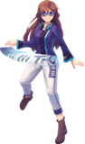
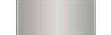
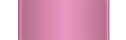
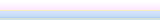
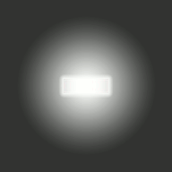

# Skinning du mode osu!mania

Depuis la version 2.5, les skinners peuvent personnaliser entièrement les notes et la scène du mode osu!mania en utilisant le fichier [skin.ini](/wiki/Skinning/skin.ini). Voici ce qu'osu! reconnaîtra si l'on choisit de ne pas utiliser le fichier `skin.ini` pour plus de personnalisation.

## Hit Bursts

*Voir également : [Skinning/FAQ § Hiérarchie de l'écran de classement](/wiki/Skinning/FAQ#hiérarchie-des-résultats-de-l'écran-de-classement)*

---

`mania-hit0.png`

| Versions | Peut être animé | Modifiable sur une beatmap | Blend Mode | Origine | Taille de SD suggérée |
| :-: | :-: | :-: | :-: | :-: | :-: |
| Toutes | ![Oui][true] | ![Oui][true] | Normal | Centre | - |

Notes :

- Nom de l'animation : `mania-hit0-{n}.png`.
- Cet élément joue une animation en boucle fixée à 60 FPS.
- Si un chemin personnalisé est utilisé, l'écran de classement utilisera le fichier dans le dossier racine à la place de l'élément désiré.

---

`mania-hit50.png`

| Versions | Peut être animé | Modifiable sur une beatmap | Blend Mode | Origine | Taille de SD suggérée |
| :-: | :-: | :-: | :-: | :-: | :-: |
| Toutes | ![Oui][true] | ![Oui][true] | Normal | Centre | - |

Notes :

- Nom de l'animation : `mania-hit50-{n}.png`.
- Cet élément joue une animation en boucle fixée à 60 FPS.
- Si un chemin personnalisé est utilisé, l'écran de classement utilisera le fichier dans le dossier racine à la place de l'élément désiré.

---

`mania-hit100.png`

| Versions | Peut être animé | Modifiable sur une beatmap | Blend Mode | Origine | Taille de SD suggérée |
| :-: | :-: | :-: | :-: | :-: | :-: |
| Toutes | ![Oui][true] | ![Oui][true] | Normal | Centre | - |

Notes :

- Nom de l'animation : `mania-hit100-{n}.png`.
- Cet élément joue une animation en boucle fixée à 60 FPS.
- Si un chemin personnalisé est utilisé, l'écran de classement utilisera le fichier dans le dossier racine à la place de l'élément désiré.

---

`mania-hit200.png`

| Versions | Peut être animé | Modifiable sur une beatmap | Blend Mode | Origine | Taille de SD suggérée |
| :-: | :-: | :-: | :-: | :-: | :-: |
| Toutes | ![Oui][true] | ![Oui][true] | Normal | Centre | - |

Notes :

- Nom de l'animation : `mania-hit200-{n}.png`.
- Cet élément joue une animation en boucle fixée à 60 FPS.
- Si un chemin personnalisé est utilisé, l'écran de classement utilisera le fichier dans le dossier racine à la place de l'élément désiré.

---

`mania-hit300.png`

| Versions | Peut être animé | Modifiable sur une beatmap | Blend Mode | Origine | Taille de SD suggérée |
| :-: | :-: | :-: | :-: | :-: | :-: |
| Toutes | ![Oui][true] | ![Oui][true] | Normal | Centre | - |

Notes :

- Nom de l'animation : `mania-hit300-{n}.png`.
- Cet élément joue une animation en boucle fixée à 60 FPS.
- Si un chemin personnalisé est utilisé, l'écran de classement utilisera le fichier dans le dossier racine à la place de l'élément désiré.

---

`mania-hit300g.png`

| Versions | Peut être animé | Modifiable sur une beatmap | Blend Mode | Origine | Taille de SD suggérée |
| :-: | :-: | :-: | :-: | :-: | :-: |
| Toutes | ![Oui][true] | ![Oui][true] | Normal | Centre | - |

Notes :

- Nom de l'animation : `mania-hit300g-{n}.png`.
- Cet élément joue une animation en boucle fixée à 60 FPS.
- Si un chemin personnalisé est utilisé, l'écran de classement utilisera le fichier dans le dossier racine à la place de l'élément désiré.

## Comboburst

`comboburst-mania.png`

| Versions | Peut être animé | Modifiable sur une beatmap | Blend Mode | Origine | Taille de SD suggérée |
| :-: | :-: | :-: | :-: | :-: | :-: |
| Toutes | ![Non][false] (voir les notes) | ![Oui][true] | Normal | Bas gauche | Hauteur max : 768px |

Notes :

- Pour avoir plusieurs combobursts, utilisez : `comboburst-mania-{n}.png`.
  - Une des images du set apparaîtra lorsqu'une étape de combo sera atteinte.
- Ces combobursts sont spécifiques au mode osu!mania
- Ils peuvent être désactivés dans les [options](/wiki/Client/Options).
- Contrairement aux combobursts des modes osu! et osu!catch, il ne faut pas couper les bords de ce set d'images.

## Touches

`mania-key1.png`

| Versions | Peut être animé | Modifiable sur une beatmap | Blend Mode | Origine | Taille de SD suggérée |
| :-: | :-: | :-: | :-: | :-: | :-: |
| Toutes | ![Non][false] | ![Non][false] | Normal | Bas | 50x107 |

Notes :

- Ceci est l'état inactif.
- Cet élément sera étiré ou compressé pour être adapté à la largeur de la colonne.

---

`mania-key1D.png`

| Versions | Peut être animé | Modifiable sur une beatmap | Blend Mode | Origine | Taille de SD suggérée |
| :-: | :-: | :-: | :-: | :-: | :-: |
| Toutes | ![Non][false] | ![Non][false] | Normal | Bas | 50x107 |

Notes :

- Ceci est l'état actif.
- Cet élément sera étiré ou compressé pour être adapté à la largeur de la colonne.

---

`mania-key2.png`

| Versions | Peut être animé | Modifiable sur une beatmap | Blend Mode | Origine | Taille de SD suggérée |
| :-: | :-: | :-: | :-: | :-: | :-: |
| Toutes | ![Non][false] | ![Non][false] | Normal | Bas | 50x107 |

Notes :

- Ceci est l'état inactif.
- Cet élément sera étiré ou compressé pour être adapté à la largeur de la colonne.

---

`mania-key2D.png`

| Versions | Peut être animé | Modifiable sur une beatmap | Blend Mode | Origine | Taille de SD suggérée |
| :-: | :-: | :-: | :-: | :-: | :-: |
| Toutes | ![Non][false] | ![Non][false] | Normal | Bas | 50x107 |

Notes :

- Ceci est l'état actif.
- Cet élément sera étiré ou compressé pour être adapté à la largeur de la colonne.

---

`mania-keyS.png`

| Versions | Peut être animé | Modifiable sur une beatmap | Blend Mode | Origine | Taille de SD suggérée |
| :-: | :-: | :-: | :-: | :-: | :-: |
| Toutes | ![Non][false] | ![Non][false] | Normal | Bas | 50x107 |

Notes :

- Ceci est l'état inactif.
- Cet élément sera étiré ou compressé pour être adapté à la largeur de la colonne.

---

`mania-keySD.png`

| Versions | Peut être animé | Modifiable sur une beatmap | Blend Mode | Origine | Taille de SD suggérée |
| :-: | :-: | :-: | :-: | :-: | :-: |
| Toutes | ![Non][false] | ![Non][false] | Normal | Bas | 50x107 |

Notes :

- Ceci est l'état actif.
- Cet élément sera étiré ou compressé pour être adapté à la largeur de la colonne.

## Notes

`mania-note1.png`

| Versions | Peut être animé | Modifiable sur une beatmap | Blend Mode | Origine | Taille de SD suggérée |
| :-: | :-: | :-: | :-: | :-: | :-: |
| Toutes | ![Oui][true] | ![Non][false] | Normal | Bas | - |

Notes :

- Nom de l'animation : `mania-note1-{n}.png`.
- Ces éléments sont mis à l'échelle pour s'adapter aux différentes colonnes.
  - Si la largeur des colonnes diffèrent : la plus petite est correctement mise à l'échelle et les autres sont compressées pour correspondre à sa hauteur.
- Les notes peuvent être manuellement étirées via la commande `WidthForNoteHeightScale` dans le fichier [skin.ini](/wiki/Skinning/skin.ini).

---

`mania-note2.png`

| Versions | Peut être animé | Modifiable sur une beatmap | Blend Mode | Origine | Taille de SD suggérée |
| :-: | :-: | :-: | :-: | :-: | :-: |
| Toutes | ![Oui][true] | ![Non][false] | Normal | Bas | - |

Notes :

- Nom de l'animation : `mania-note2-{n}.png`.
- Ces éléments sont mis à l'échelle pour s'adapter aux différentes colonnes.
  - Si la largeur des colonnes diffèrent : la plus petite est correctement mise à l'échelle et les autres sont compressées pour correspondre à sa hauteur.
- Les notes peuvent être manuellement étirées via la commande `WidthForNoteHeightScale` dans le fichier [skin.ini](/wiki/Skinning/skin.ini).

---

`mania-noteS.png`

| Versions | Peut être animé | Modifiable sur une beatmap | Blend Mode | Origine | Taille de SD suggérée |
| :-: | :-: | :-: | :-: | :-: | :-: |
| Toutes | ![Oui][true] | ![Non][false] | Normal | Bas | - |

Notes :

- Nom de l'animation : `mania-noteS-{n}.png`.
- Ces éléments sont mis à l'échelle pour s'adapter aux différentes colonnes.
  - Si la largeur des colonnes diffèrent : la plus petite est correctement mise à l'échelle et les autres sont compressées pour correspondre à sa hauteur.
- Les notes peuvent être manuellement étirées via la commande `WidthForNoteHeightScale` dans le fichier [skin.ini](/wiki/Skinning/skin.ini).

### Hold notes

#### Head

`mania-note1H.png`

| Versions | Peut être animé | Modifiable sur une beatmap | Blend Mode | Origine | Taille de SD suggérée |
| :-: | :-: | :-: | :-: | :-: | :-: |
| Toutes | ![Oui][true] | ![Non][false] | Normal | Bas | - |

Notes :

- Nom de l'animation : `mania-note1H-{n}.png`.
- Par défaut, ceci est aussi la fin de la note.
  - Quand il est utilisé comme fin de note, cet élément est retourné par défaut en version 2.5.
    - Ce comportement peut être désactivé en inscrivant `0` en face de la commande `NoteFlipWhenUpsideDownT`.
- Ces éléments sont mis à l'échelle pour s'adapter aux différentes colonnes.
  - Si la largeur des colonnes diffèrent : la plus petite est correctement mise à l'échelle et les autres sont compressées pour correspondre à sa hauteur.
- Les hold notes peuvent être manuellement étirées via la commande `WidthForNoteHeightScale` dans le fichier [skin.ini](/wiki/Skinning/skin.ini).

---

`mania-note2H.png`

| Versions | Peut être animé | Modifiable sur une beatmap | Blend Mode | Origine | Taille de SD suggérée |
| :-: | :-: | :-: | :-: | :-: | :-: |
| Toutes | ![Oui][true] | ![Non][false] | Normal | Bas | - |

Notes :

- Nom de l'animation : `mania-note2H-{n}.png`.
- Par défaut, ceci est aussi la fin de la note.
  - Quand il est utilisé comme fin de note, cet élément est retourné par défaut en version 2.5.
    - Ce comportement peut être désactivé en inscrivant `0` en face de la commande `NoteFlipWhenUpsideDownT`.
- Ces éléments sont mis à l'échelle pour s'adapter aux différentes colonnes.
  - Si la largeur des colonnes diffèrent : la plus petite est correctement mise à l'échelle et les autres sont compressées pour correspondre à sa hauteur.
- Les hold notes peuvent être manuellement étirées via la commande `WidthForNoteHeightScale` dans le fichier [skin.ini](/wiki/Skinning/skin.ini).

---

`mania-noteSH`

| Versions | Peut être animé | Modifiable sur une beatmap | Blend Mode | Origine | Taille de SD suggérée |
| :-: | :-: | :-: | :-: | :-: | :-: |
| Toutes | ![Oui][true] | ![Non][false] | Normal | Bas | - |

Notes :

- Nom de l'animation : `mania-noteSH-{n}.png`.
- Par défaut, ceci est aussi la fin de la note.
  - Quand il est utilisé comme fin de note, cet élément est retourné par défaut en version 2.5.
    - Ce comportement peut être désactivé en inscrivant `0` en face de la commande `NoteFlipWhenUpsideDownT`.
- Ces éléments sont mis à l'échelle pour s'adapter aux différentes colonnes.
  - Si la largeur des colonnes diffèrent : la plus petite est correctement mise à l'échelle et les autres sont compressées pour correspondre à sa hauteur.
- Les hold notes peuvent être manuellement étirées via la commande `WidthForNoteHeightScale` dans le fichier [skin.ini](/wiki/Skinning/skin.ini).

#### Corps

`mania-note1L.png`

| Versions | Peut être animé | Modifiable sur une beatmap | Blend Mode | Origine | Taille de SD suggérée |
| :-: | :-: | :-: | :-: | :-: | :-: |
| Toutes | ![Oui][true] (voir les notes) | ![Non][false] | Normal | Bas | - |

Notes :

- Nom de l'animation : `mania-note1L-{n}.png`.
- L'animation commence à se jouer lorsque la hold note est pressée et s'arrête lorsqu'elle est relâchée.
- Le `NoteBodyStyle` change le comportement de ces éléments.
- Les notes peuvent être manuellement étirées via la commande `WidthForNoteHeightScale` dans le fichier [skin.ini](/wiki/Skinning/skin.ini).

---

`mania-note2L.png`

| Versions | Peut être animé | Modifiable sur une beatmap | Blend Mode | Origine | Taille de SD suggérée |
| :-: | :-: | :-: | :-: | :-: | :-: |
| Toutes | ![Oui][true] (voir les notes) | ![Non][false] | Normal | Bas | - |

Notes :

- Nom de l'animation : `mania-note2L-{n}.png`.
- L'animation commence à se jouer lorsque la hold note est pressée et s'arrête lorsqu'elle est relâchée.
- Le `NoteBodyStyle` change le comportement de ces éléments.
- Les notes peuvent être manuellement étirées via la commande `WidthForNoteHeightScale` dans le fichier [skin.ini](/wiki/Skinning/skin.ini).

---

`mania-noteSL.png`

| Versions | Peut être animé | Modifiable sur une beatmap | Blend Mode | Origine | Taille de SD suggérée |
| :-: | :-: | :-: | :-: | :-: | :-: |
| Toutes | ![Oui][true] (voir les notes) | ![Non][false] | Normal | Bas | - |

Notes :

- Nom de l'animation : `mania-noteSL-{n}.png`.
- L'animation commence à se jouer lorsque la hold note est pressée et s'arrête lorsqu'elle est relâchée.
- Le `NoteBodyStyle` change le comportement de ces éléments.
- Les notes peuvent être manuellement étirées via la commande `WidthForNoteHeightScale` dans le fichier [skin.ini](/wiki/Skinning/skin.ini).

#### Tail

`mania-note1T.png`

| Versions | Peut être animé | Modifiable sur une beatmap | Blend Mode | Origine | Taille de SD suggérée |
| :-: | :-: | :-: | :-: | :-: | :-: |
| Toutes | ![Oui][true] | ![Non][false] | Normal | Bas | - |

Notes :

- Nom de l'animation : `mania-note1T-{n}.png`.
- Ces éléments font partie de la fin de la hold note.
- Par défaut, les head notes sont utilisées à la place.
- Par défaut, ces éléments sont retournés en version de skin `2.5` et plus.
  - Ce comportement peut être désactivé en inscrivant `0` en face de la commande `NoteFlipWhenUpsideDownT`.
- Ces éléments sont mis à l'échelle pour s'adapter aux différentes colonnes.
  - Si la largeur des colonnes diffèrent : la plus petite est correctement mise à l'échelle et les autres sont compressées pour correspondre à sa hauteur.
- Les notes peuvent être manuellement étirées via la commande `WidthForNoteHeightScale` dans le fichier [skin.ini](/wiki/Skinning/skin.ini).

---

`mania-note2T.png`

| Versions | Peut être animé | Modifiable sur une beatmap | Blend Mode | Origine | Taille de SD suggérée |
| :-: | :-: | :-: | :-: | :-: | :-: |
| Toutes | ![Oui][true] | ![Non][false] | Normal | Bas | - |

Notes :

- Nom de l'animation : `mania-note2T-{n}.png`.
- Ces éléments font partie de la fin de la hold note.
- Par défaut, les head notes sont utilisées à la place.
- Par défaut, ces éléments sont retournés en version de skin `2.5` et plus.
  - Ce comportement peut être désactivé en inscrivant `0` en face de la commande `NoteFlipWhenUpsideDownT`.
- Ces éléments sont mis à l'échelle pour s'adapter aux différentes colonnes.
  - Si la largeur des colonnes diffèrent : la plus petite est correctement mise à l'échelle et les autres sont compressées pour correspondre à sa hauteur.
- Les notes peuvent être manuellement étirées via la commande `WidthForNoteHeightScale` dans le fichier [skin.ini](/wiki/Skinning/skin.ini).

---

`mania-noteST.png`

| Versions | Peut être animé | Modifiable sur une beatmap | Blend Mode | Origine | Taille de SD suggérée |
| :-: | :-: | :-: | :-: | :-: | :-: |
| Toutes | ![Oui][true] | ![Non][false] | Normal | Bas | - |

Notes :

- Nom de l'animation : `mania-noteST-{n}.png`.
- Ces éléments font partie de la fin de la hold note.
- Par défaut, les head notes sont utilisées à la place.
- Par défaut, ces éléments sont retournés en version de skin `2.5` et plus.
  - Ce comportement peut être désactivé en inscrivant `0` en face de la commande `NoteFlipWhenUpsideDownT`.
- Ces éléments sont mis à l'échelle pour s'adapter aux différentes colonnes.
  - Si la largeur des colonnes diffèrent : la plus petite est correctement mise à l'échelle et les autres sont compressées pour correspondre à sa hauteur.
- Les notes peuvent être manuellement étirées via la commande `WidthForNoteHeightScale` dans le fichier [skin.ini](/wiki/Skinning/skin.ini).

## Stage

`mania-stage-left.png`

| Versions | Peut être animé | Modifiable sur une beatmap | Blend Mode | Origine | Taille de SD suggérée |
| :-: | :-: | :-: | :-: | :-: | :-: |
| Toutes | ![Non][false] | ![Non][false] | Normal | Bas droite | Hauteur max : 768px |

Notes :

- Cet élément est situé sur le côté gauche du/des stage(s).
- Cet élément est étiré pour correspondre à la hauteur du stage (Il est possible d'utiliser des images plus courtes).

---

`mania-stage-right.png`

| Versions | Peut être animé | Modifiable sur une beatmap | Blend Mode | Origine | Taille de SD suggérée |
| :-: | :-: | :-: | :-: | :-: | :-: |
| Toutes | ![Non][false] | ![Non][false] | Normal | Bas droite | Hauteur max : 768px |

Notes :

- Cet élément est situé sur le côté droit du/des stage(s).
- Cet élément est étiré pour correspondre à la hauteur du stage (Il est possible d'utiliser des images plus courtes).

---

`mania-stage-bottom.png`

| Versions | Peut être animé | Modifiable sur une beatmap | Blend Mode | Origine | Taille de SD suggérée |
| :-: | :-: | :-: | :-: | :-: | :-: |
| Toutes | ![Oui][true] | ![Non][false] | Normal | Bas | - |

Notes :

- Cet élément est 0.625x plus petit que la largeur du stage.
- Nom de l'animation : `mania-stage-bottom-{n}.png`.
- Situé en bas (ou en haut, si le stage est inversé) du/des stage(s).
- Cet élément ne sera pas étiré pour correspondre à la largeur du stage !
- Cet élément doit être conçu pour une hauteur de zone de jeu de 480px.
- Cet élément se superpose par dessus tout le stage, même par dessus les notes.

---

`mania-stage-light.png`

| Versions | Peut être animé | Modifiable sur une beatmap | Blend Mode | Origine | Taille de SD suggérée |
| :-: | :-: | :-: | :-: | :-: | :-: |
| Toutes | ![Oui][true] | ![Non][false] | Multiplicatif | Bas | Hauteur max : 768px |

Notes :

- Nom de l'animation : `mania-stage-light-{n}.png`.
- Cet élément est l'éclairage des colonnes quand la touche est appuyée.
- Cet élément est placé sous les notes.
- Par défaut, il est de couleur blanche.
  - Utilisez la commande `ColourLight` pour le modifier.
- La position est définie par le fichier [skin.ini](/wiki/Skinning/skin.ini)
  - Utilisez la commande `LightPosition` pour la modifier.

---

`mania-stage-hint.png`

| Versions | Peut être animé | Modifiable sur une beatmap | Blend Mode | Origine | Taille de SD suggérée |
| :-: | :-: | :-: | :-: | :-: | :-: |
| Toutes | ![Non][false] | ![Non][false] | Normal | Centre | - |

Notes :

- Cet élément est la représentation graphique de la [judgement](/wiki/Gameplay/Judgement) line.
  - La judgement line est tracée au centre de l'image.
- Cet élément est dessiné sur toute la largeur du stage, et non pas pour des colonnes individuelles.
- Cet élément est étiré pour correspondre à la largeur du stage. (il est possible d'utiliser des images moins large)

---

`mania-warningarrow.png`

| Versions | Peut être animé | Modifiable sur une beatmap | Blend Mode | Origine | Taille de SD suggérée |
| :-: | :-: | :-: | :-: | :-: | :-: |
| Toutes | ![Non][false] | ![Non][false] | Normal | Centre | - |

Notes :

- Cet élément doit pointer vers le bas.
  - Cette image est automatiquement inversé horizontalement si le stage est inversé.
- Cet élément est toujours présent avant le début d'une beatmap, s'il y a suffisamment de temps.

### Lighting

`lightingL.png`

| Versions | Peut être animé | Modifiable sur une beatmap | Blend Mode | Origine | Taille de SD suggérée |
| :-: | :-: | :-: | :-: | :-: | :-: |
| Toutes | ![Oui][true] | ![Non][false] | Additif | Centre | - |

Notes :

- Nom de l'animation : `lightingL-{n}.png`.
- Cet élément est l'éclairage pour les hold notes.
- Cette image est inversée horizontalement si le stage est inversé de haut en bas.
- Cet élément est positionné là où le centre de la judgement line croise le centre d'une colonne.

---

`lightingN.png`

| Versions | Peut être animé | Modifiable sur une beatmap | Blend Mode | Origine | Taille de SD suggérée |
| :-: | :-: | :-: | :-: | :-: | :-: |
| Toutes | ![Oui][true] | ![Non][false] | Additif | Centre | - |

Notes :

- Nom de l'animation : `lightingN-{n}.png`.
- Cet élément est l'éclairage pour les single notes (et les tail notes).
- Cette image est inversée horizontalement si le stage est inversé de haut en bas.
- Cet élément est positionné là où le centre de la judgement line croise le centre d'une colonne.

[true]: /wiki/shared/true.png
[false]: /wiki/shared/false.png
