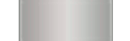
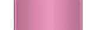
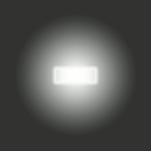

# osu!mania skinning

ตั้งแต่ v2.5+ เป็นต้นมา skinner สามารถปรับแต่ง note และ stage ของ osu!mania ได้เต็มรูปแบบผ่านไฟล์ [skin.ini](/wiki/Skinning/skin.ini) รายการต่อไปนี้คือสิ่งที่ osu! จะรู้จัก ถ้าเลือกไม่ใช้ `skin.ini` สำหรับการปรับแต่งเพิ่มเติม

## Hit Bursts

*ดูเพิ่ม: [Skinning/FAQ § ลำดับคะแนน hit score บนหน้าจอ ranking](/wiki/Skinning/FAQ#ranking-screen-hit-score-hierarchy)*

---

`mania-hit0.png`

| Versions | Animatable | Beatmap Skinnable | Blend Mode | Origin | Suggested SD Size |
| :-: | :-: | :-: | :-: | :-: | :-: |
| All | ![Yes][true] | ![Yes][true] | Normal | Centre | - |

Notes:

- ชื่อ animation: `mania-hit0-{n}.png`
- element นี้มี animation loop แบบคงที่ที่ 60 FPS
- ถ้าใช้ path แบบกำหนดเอง หน้าจอ ranking จะใช้ไฟล์ใน root directory แทน skinning element ที่ระบุ path ไว้

---

`mania-hit50.png`

| Versions | Animatable | Beatmap Skinnable | Blend Mode | Origin | Suggested SD Size |
| :-: | :-: | :-: | :-: | :-: | :-: |
| All | ![Yes][true] | ![Yes][true] | Normal | Centre | - |

Notes:

- ชื่อ animation: `mania-hit50-{n}.png`
- element นี้มี animation loop แบบคงที่ที่ 60 FPS
- ถ้าใช้ path แบบกำหนดเอง หน้าจอ ranking จะใช้ไฟล์ใน root directory แทน skinning element ที่ระบุ path ไว้

---

`mania-hit100.png`

| Versions | Animatable | Beatmap Skinnable | Blend Mode | Origin | Suggested SD Size |
| :-: | :-: | :-: | :-: | :-: | :-: |
| All | ![Yes][true] | ![Yes][true] | Normal | Centre | - |

Notes:

- ชื่อ animation: `mania-hit100-{n}.png`
- element นี้มี animation loop แบบคงที่ที่ 60 FPS
- ถ้าใช้ path แบบกำหนดเอง หน้าจอ ranking จะใช้ไฟล์ใน root directory แทน skinning element ที่ระบุ path ไว้

---

`mania-hit200.png`

| Versions | Animatable | Beatmap Skinnable | Blend Mode | Origin | Suggested SD Size |
| :-: | :-: | :-: | :-: | :-: | :-: |
| All | ![Yes][true] | ![Yes][true] | Normal | Centre | - |

Notes:

- ชื่อ animation: `mania-hit200-{n}.png`
- element นี้มี animation loop แบบคงที่ที่ 60 FPS
- ถ้าใช้ path แบบกำหนดเอง หน้าจอ ranking จะใช้ไฟล์ใน root directory แทน skinning element ที่ระบุ path ไว้

---

`mania-hit300.png`

| Versions | Animatable | Beatmap Skinnable | Blend Mode | Origin | Suggested SD Size |
| :-: | :-: | :-: | :-: | :-: | :-: |
| All | ![Yes][true] | ![Yes][true] | Normal | Centre | - |

Notes:

- ชื่อ animation: `mania-hit300-{n}.png`
- element นี้มี animation loop แบบคงที่ที่ 60 FPS
- ถ้าใช้ path แบบกำหนดเอง หน้าจอ ranking จะใช้ไฟล์ใน root directory แทน skinning element ที่ระบุ path ไว้

---

`mania-hit300g.png`

| Versions | Animatable | Beatmap Skinnable | Blend Mode | Origin | Suggested SD Size |
| :-: | :-: | :-: | :-: | :-: | :-: |
| All | ![Yes][true] | ![Yes][true] | Normal | Centre | - |

Notes:

- ชื่อ animation: `mania-hit300g-{n}.png`
- element นี้มี animation loop แบบคงที่ที่ 60 FPS
- ถ้าใช้ path แบบกำหนดเอง หน้าจอ ranking จะใช้ไฟล์ใน root directory แทน skinning element ที่ระบุ path ไว้

## Comboburst

`comboburst-mania.png`

| Versions | Animatable | Beatmap Skinnable | Blend Mode | Origin | Suggested SD Size |
| :-: | :-: | :-: | :-: | :-: | :-: |
| All | ![No][false] (ดู notes) | ![Yes][true] | Normal | BottomLeft | ความสูงสูงสุด: 768px |

Notes:

- ถ้าต้องการมี comboburst หลายแบบ ให้ใช้: `comboburst-mania-{n}.png`
  - หนึ่งในรูปของ set นี้จะปรากฏเมื่อทำคอมโบถึง milestone
- comboburst เฉพาะของ osu!mania
- สามารถปิดได้ใน[ตัวเลือก](/wiki/Client/Options)
- ต่างจาก comboburst ของ osu! และ osu!catch ขอบทุกด้านของ imageset นี้ไม่ควรถูกตัดออก

## Keys

`mania-key1.png`

| Versions | Animatable | Beatmap Skinnable | Blend Mode | Origin | Suggested SD Size |
| :-: | :-: | :-: | :-: | :-: | :-: |
| All | ![No][false] | ![No][false] | Normal | Bottom | 50x107 |

Notes:

- นี่คือสถานะ idle
- element นี้จะถูกยืดหรือบีบให้พอดีกับความกว้างของ column

---

`mania-key1D.png`

| Versions | Animatable | Beatmap Skinnable | Blend Mode | Origin | Suggested SD Size |
| :-: | :-: | :-: | :-: | :-: | :-: |
| All | ![No][false] | ![No][false] | Normal | Bottom | 50x107 |

Notes:

- นี่คือสถานะ pressed
- element นี้จะถูกยืดหรือบีบให้พอดีกับความกว้างของ column

---

`mania-key2.png`

| Versions | Animatable | Beatmap Skinnable | Blend Mode | Origin | Suggested SD Size |
| :-: | :-: | :-: | :-: | :-: | :-: |
| All | ![No][false] | ![No][false] | Normal | Bottom | 50x107 |

Notes:

- นี่คือสถานะ idle
- element นี้จะถูกยืดหรือบีบให้พอดีกับความกว้างของ column

---

`mania-key2D.png`

| Versions | Animatable | Beatmap Skinnable | Blend Mode | Origin | Suggested SD Size |
| :-: | :-: | :-: | :-: | :-: | :-: |
| All | ![No][false] | ![No][false] | Normal | Bottom | 50x107 |

Notes:

- นี่คือสถานะ pressed
- element นี้จะถูกยืดหรือบีบให้พอดีกับความกว้างของ column

---

`mania-keyS.png`

| Versions | Animatable | Beatmap Skinnable | Blend Mode | Origin | Suggested SD Size |
| :-: | :-: | :-: | :-: | :-: | :-: |
| All | ![No][false] | ![No][false] | Normal | Bottom | 50x107 |

Notes:

- นี่คือสถานะ idle
- element นี้จะถูกยืดหรือบีบให้พอดีกับความกว้างของ column

---

`mania-keySD.png`

| Versions | Animatable | Beatmap Skinnable | Blend Mode | Origin | Suggested SD Size |
| :-: | :-: | :-: | :-: | :-: | :-: |
| All | ![No][false] | ![No][false] | Normal | Bottom | 50x107 |

Notes:

- นี่คือสถานะ pressed
- element นี้จะถูกยืดหรือบีบให้พอดีกับความกว้างของ column

## Notes

`mania-note1.png`

| Versions | Animatable | Beatmap Skinnable | Blend Mode | Origin | Suggested SD Size |
| :-: | :-: | :-: | :-: | :-: | :-: |
| All | ![Yes][true] | ![No][false] | Normal | Bottom | - |

Notes:

- ชื่อ animation: `mania-note1-{n}.png`
- element เหล่านี้จะถูก scale ให้พอดีกับ column แต่ละอัน
  - ถ้าความกว้างของ column ต่างกัน: column ที่เล็กที่สุดจะถูก scale ถูกต้อง ส่วน column อื่นจะถูกบีบให้ความสูงตรงกัน
- สามารถยืดหรือบีบ note เองได้ผ่านคำสั่ง `WidthForNoteHeightScale` ในไฟล์ [skin.ini](/wiki/Skinning/skin.ini)

---

`mania-note2.png`

| Versions | Animatable | Beatmap Skinnable | Blend Mode | Origin | Suggested SD Size |
| :-: | :-: | :-: | :-: | :-: | :-: |
| All | ![Yes][true] | ![No][false] | Normal | Bottom | - |

Notes:

- ชื่อ animation: `mania-note2-{n}.png`
- element เหล่านี้จะถูก scale ให้พอดีกับ column แต่ละอัน
  - ถ้าความกว้างของ column ต่างกัน: column ที่เล็กที่สุดจะถูก scale ถูกต้อง ส่วน column อื่นจะถูกบีบให้ความสูงตรงกัน
- สามารถยืดหรือบีบ note เองได้ผ่านคำสั่ง `WidthForNoteHeightScale` ในไฟล์ [skin.ini](/wiki/Skinning/skin.ini)

---

`mania-noteS.png`

| Versions | Animatable | Beatmap Skinnable | Blend Mode | Origin | Suggested SD Size |
| :-: | :-: | :-: | :-: | :-: | :-: |
| All | ![Yes][true] | ![No][false] | Normal | Bottom | - |

Notes:

- ชื่อ animation: `mania-noteS-{n}.png`
- element เหล่านี้จะถูก scale ให้พอดีกับ column แต่ละอัน
  - ถ้าความกว้างของ column ต่างกัน: column ที่เล็กที่สุดจะถูก scale ถูกต้อง ส่วน column อื่นจะถูกบีบให้ความสูงตรงกัน
- สามารถยืดหรือบีบ note เองได้ผ่านคำสั่ง `WidthForNoteHeightScale` ในไฟล์ [skin.ini](/wiki/Skinning/skin.ini)

### Long notes

#### Head

`mania-note1H.png`

| Versions | Animatable | Beatmap Skinnable | Blend Mode | Origin | Suggested SD Size |
| :-: | :-: | :-: | :-: | :-: | :-: |
| All | ![Yes][true] | ![No][false] | Normal | Bottom | - |

Notes:

- ชื่อ animation: `mania-note1H-{n}.png`
- โดยค่าเริ่มต้น element นี้ยังเป็นส่วน tail ด้วย
  - เมื่อใช้เป็นส่วน tail element นี้จะถูก flip โดยค่าเริ่มต้นสำหรับ v2.5+
    - สามารถปิดพฤติกรรมนี้ได้โดยตั้งค่า `NoteFlipWhenUpsideDownT` เป็น `0`
- element นี้จะถูก scale ให้พอดีกับ column แต่ละอัน
  - ถ้าความกว้างของ column ต่างกัน: column ที่เล็กที่สุดจะถูก scale ถูกต้อง ส่วน column อื่นจะถูกบีบให้ความสูงตรงกัน
- สามารถยืดหรือบีบ long note เองได้ผ่านคำสั่ง `WidthForNoteHeightScale` ในไฟล์ [skin.ini](/wiki/Skinning/skin.ini)

---

`mania-note2H.png`

| Versions | Animatable | Beatmap Skinnable | Blend Mode | Origin | Suggested SD Size |
| :-: | :-: | :-: | :-: | :-: | :-: |
| All | ![Yes][true] | ![No][false] | Normal | Bottom | - |

Notes:

- ชื่อ animation: `mania-note2H-{n}.png`
- โดยค่าเริ่มต้น element นี้ยังเป็นส่วน tail ด้วย
  - เมื่อใช้เป็นส่วน tail element นี้จะถูก flip โดยค่าเริ่มต้นสำหรับ v2.5+
    - สามารถปิดพฤติกรรมนี้ได้โดยตั้งค่า `NoteFlipWhenUpsideDownT` เป็น `0`
- element นี้จะถูก scale ให้พอดีกับ column แต่ละอัน
  - ถ้าความกว้างของ column ต่างกัน: column ที่เล็กที่สุดจะถูก scale ถูกต้อง ส่วน column อื่นจะถูกบีบให้ความสูงตรงกัน
- สามารถยืดหรือบีบ long note เองได้ผ่านคำสั่ง `WidthForNoteHeightScale` ในไฟล์ [skin.ini](/wiki/Skinning/skin.ini)

---

`mania-noteSH`

| Versions | Animatable | Beatmap Skinnable | Blend Mode | Origin | Suggested SD Size |
| :-: | :-: | :-: | :-: | :-: | :-: |
| All | ![Yes][true] | ![No][false] | Normal | Bottom | - |

Notes:

- ชื่อ animation: `mania-noteSH-{n}.png`
- โดยค่าเริ่มต้น element นี้ยังเป็นส่วน tail ด้วย
  - เมื่อใช้เป็นส่วน tail element นี้จะถูก flip โดยค่าเริ่มต้นสำหรับ v2.5+
    - สามารถปิดพฤติกรรมนี้ได้โดยตั้งค่า `NoteFlipWhenUpsideDownT` เป็น `0`
- element นี้จะถูก scale ให้พอดีกับ column แต่ละอัน
  - ถ้าความกว้างของ column ต่างกัน: column ที่เล็กที่สุดจะถูก scale ถูกต้อง ส่วน column อื่นจะถูกบีบให้ความสูงตรงกัน
- สามารถยืดหรือบีบ long note เองได้ผ่านคำสั่ง `WidthForNoteHeightScale` ในไฟล์ [skin.ini](/wiki/Skinning/skin.ini)

#### Body

`mania-note1L.png`

| Versions | Animatable | Beatmap Skinnable | Blend Mode | Origin | Suggested SD Size |
| :-: | :-: | :-: | :-: | :-: | :-: |
| All | ![Yes][true] (ดู notes) | ![No][false] | Normal | Bottom | - |

Notes:

- ชื่อ animation: `mania-note1L-{n}.png`
- animation จะเริ่มเมื่อกด long note และจะหยุดถ้าปล่อย
- `NoteBodyStyle` จะเปลี่ยนพฤติกรรมของ element เหล่านี้
- สามารถยืดหรือบีบ note เองได้ผ่านคำสั่ง `WidthForNoteHeightScale` ในไฟล์ [skin.ini](/wiki/Skinning/skin.ini)

---

`mania-note2L.png`

| Versions | Animatable | Beatmap Skinnable | Blend Mode | Origin | Suggested SD Size |
| :-: | :-: | :-: | :-: | :-: | :-: |
| All | ![Yes][true] (ดู notes) | ![No][false] | Normal | Bottom | - |

Notes:

- ชื่อ animation: `mania-note2L-{n}.png`
- animation จะเริ่มเมื่อกด long note และจะหยุดถ้าปล่อย
- `NoteBodyStyle` จะเปลี่ยนพฤติกรรมของ element เหล่านี้
- สามารถยืดหรือบีบ note เองได้ผ่านคำสั่ง `WidthForNoteHeightScale` ในไฟล์ [skin.ini](/wiki/Skinning/skin.ini)

---

`mania-noteSL.png`

| Versions | Animatable | Beatmap Skinnable | Blend Mode | Origin | Suggested SD Size |
| :-: | :-: | :-: | :-: | :-: | :-: |
| All | ![Yes][true] (ดู notes) | ![No][false] | Normal | Bottom | - |

Notes:

- ชื่อ animation: `mania-noteSL-{n}.png`
- animation จะเริ่มเมื่อกด long note และจะหยุดถ้าปล่อย
- `NoteBodyStyle` จะเปลี่ยนพฤติกรรมของ element เหล่านี้
- สามารถยืดหรือบีบ note เองได้ผ่านคำสั่ง `WidthForNoteHeightScale` ในไฟล์ [skin.ini](/wiki/Skinning/skin.ini)

#### Tail

`mania-note1T.png`

| Versions | Animatable | Beatmap Skinnable | Blend Mode | Origin | Suggested SD Size |
| :-: | :-: | :-: | :-: | :-: | :-: |
| All | ![Yes][true] | ![No][false] | Normal | Bottom | - |

Notes:

- ชื่อ animation: `mania-note1T-{n}.png`
- element เหล่านี้คือส่วน tail ของ hold note
- โดยค่าเริ่มต้น จะใช้ head note แทน
- โดยค่าเริ่มต้น element เหล่านี้จะถูก flip สำหรับสกินเวอร์ชัน `2.5` ขึ้นไป
  - สามารถปิดพฤติกรรมนี้ได้โดยตั้งค่า `NoteFlipWhenUpsideDownT` เป็น `0`
- element เหล่านี้จะถูก scale ให้พอดีกับ column แต่ละอัน
  - ถ้าความกว้างของ column ต่างกัน: column ที่เล็กที่สุดจะถูก scale ถูกต้อง ส่วน column อื่นจะถูกบีบให้ความสูงตรงกัน
- สามารถยืดหรือบีบ note เองได้ผ่านคำสั่ง `WidthForNoteHeightScale` ในไฟล์ [skin.ini](/wiki/Skinning/skin.ini)

---

`mania-note2T.png`

| Versions | Animatable | Beatmap Skinnable | Blend Mode | Origin | Suggested SD Size |
| :-: | :-: | :-: | :-: | :-: | :-: |
| All | ![Yes][true] | ![No][false] | Normal | Bottom | - |

Notes:

- ชื่อ animation: `mania-note2T-{n}.png`
- element เหล่านี้คือส่วน tail ของ hold note
- โดยค่าเริ่มต้น จะใช้ head note แทน
- โดยค่าเริ่มต้น element เหล่านี้จะถูก flip สำหรับสกินเวอร์ชัน `2.5` ขึ้นไป
  - สามารถปิดพฤติกรรมนี้ได้โดยตั้งค่า `NoteFlipWhenUpsideDownT` เป็น `0`
- element เหล่านี้จะถูก scale ให้พอดีกับ column แต่ละอัน
  - ถ้าความกว้างของ column ต่างกัน: column ที่เล็กที่สุดจะถูก scale ถูกต้อง ส่วน column อื่นจะถูกบีบให้ความสูงตรงกัน
- สามารถยืดหรือบีบ note เองได้ผ่านคำสั่ง `WidthForNoteHeightScale` ในไฟล์ [skin.ini](/wiki/Skinning/skin.ini)

---

`mania-noteST.png`

| Versions | Animatable | Beatmap Skinnable | Blend Mode | Origin | Suggested SD Size |
| :-: | :-: | :-: | :-: | :-: | :-: |
| All | ![Yes][true] | ![No][false] | Normal | Bottom | - |

Notes:

- ชื่อ animation: `mania-noteST-{n}.png`
- element เหล่านี้คือส่วน tail ของ hold note
- โดยค่าเริ่มต้น จะใช้ head note แทน
- โดยค่าเริ่มต้น element เหล่านี้จะถูก flip สำหรับสกินเวอร์ชัน `2.5` ขึ้นไป
  - สามารถปิดพฤติกรรมนี้ได้โดยตั้งค่า `NoteFlipWhenUpsideDownT` เป็น `0`
- element เหล่านี้จะถูก scale ให้พอดีกับ column แต่ละอัน
  - ถ้าความกว้างของ column ต่างกัน: column ที่เล็กที่สุดจะถูก scale ถูกต้อง ส่วน column อื่นจะถูกบีบให้ความสูงตรงกัน
- สามารถยืดหรือบีบ note เองได้ผ่านคำสั่ง `WidthForNoteHeightScale` ในไฟล์ [skin.ini](/wiki/Skinning/skin.ini)

---

### Layout key เริ่มต้น

ด้านล่างคือ layout รูป note เริ่มต้นของแต่ละ column ตามจำนวน key

| Keycount | Col 1 | Col 2 | Col 3 | Col 4 | Col 5 | Col 6 | Col 7 | Col 8 | Col 9 |
| :-- | :-- | :-- | :-- | :-- | :-- | :-- | :-- | :-- | :-- |
| 1K | S |  |  |  |  |  |  |  |  |
| 2K | 1 | 1 |  |  |  |  |  |  |  |
| 3K | 1 | S | 1 |  |  |  |  |  |  |
| 4K | 1 | 2 | 2 | 1 |  |  |  |  |  |
| 5K | 1 | 2 | S | 2 | 1 |  |  |  |  |
| 6K | 1 | 2 | 1 | 1 | 2 | 1 |  |  |  |
| 7K | 1 | 2 | 1 | S | 1 | 2 | 1 |  |  |
| 8K | 1 | 2 | 1 | 2 | 2 | 1 | 2 | 1 |  |
| 9K | 1 | 2 | 1 | 2 | S | 2 | 1 | 2 | 1 |

## Stage

`mania-stage-left.png`

| Versions | Animatable | Beatmap Skinnable | Blend Mode | Origin | Suggested SD Size |
| :-: | :-: | :-: | :-: | :-: | :-: |
| All | ![No][false] | ![No][false] | Normal | BottomRight | ความสูงสูงสุด: 768px |

Notes:

- element นี้จะแสดงทางด้านซ้ายของ stage
- element นี้จะถูกยืดให้พอดีกับความสูงของ stage (จึงใช้รูปที่เตี้ยกว่านี้ได้)

---

`mania-stage-right.png`

| Versions | Animatable | Beatmap Skinnable | Blend Mode | Origin | Suggested SD Size |
| :-: | :-: | :-: | :-: | :-: | :-: |
| All | ![No][false] | ![No][false] | Normal | BottomRight | ความสูงสูงสุด: 768px |

Notes:

- element นี้จะแสดงทางด้านขวาของ stage
- element นี้จะถูกยืดให้พอดีกับความสูงของ stage (จึงใช้รูปที่เตี้ยกว่านี้ได้)

---

`mania-stage-bottom.png`

| Versions | Animatable | Beatmap Skinnable | Blend Mode | Origin | Suggested SD Size |
| :-: | :-: | :-: | :-: | :-: | :-: |
| All | ![Yes][true] | ![No][false] | Normal | Bottom | - |

Notes:

- element นี้เล็กกว่าความกว้าง stage 0.625 เท่า
- ชื่อ animation: `mania-stage-bottom-{n}.png`
- แสดงที่ด้านล่าง (หรือด้านบน ถ้า stage กลับหัว) ของ stage
- element นี้จะไม่ถูกยืดให้พอดีกับความกว้าง stage!
- element นี้ควรทำสกินโดยอิงจากความสูงเพลย์ฟีลด์ 480px
- element นี้ overlay ทับทั้ง stage รวมถึง note ด้วย

---

`mania-stage-light.png`

| Versions | Animatable | Beatmap Skinnable | Blend Mode | Origin | Suggested SD Size |
| :-: | :-: | :-: | :-: | :-: | :-: |
| All | ![Yes][true] | ![No][false] | Multiplicative | Bottom | ความสูงสูงสุด: 768px |

Notes:

- ชื่อ animation: `mania-stage-light-{n}.png`
- element นี้คือแสงของ column ตอนกด key
- element นี้ถูกวางไว้ใต้ note
- โดยค่าเริ่มต้น tint เป็นสีขาว
  - ใช้ `ColourLight` เพื่อเปลี่ยนค่านี้
- การจัดตำแหน่งถูกตั้งค่าโดย [skin.ini](/wiki/Skinning/skin.ini)
  - ใช้ `LightPosition`

---

`mania-stage-hint.png`

| Versions | Animatable | Beatmap Skinnable | Blend Mode | Origin | Suggested SD Size |
| :-: | :-: | :-: | :-: | :-: | :-: |
| All | ![No][false] | ![No][false] | Normal | Centre | - |

Notes:

- element นี้คือภาพแทนเส้น [judgement](/wiki/Gameplay/Judgement)
  - judgement line จะถูกวาดไว้ตรงกลางของรูป
- element นี้ถูกวาดสำหรับความกว้างทั้ง stage ไม่ใช่เฉพาะ column แต่ละอัน
- element นี้จะถูกยืดให้พอดีกับความกว้าง stage (จึงใช้รูปที่แคบกว่านี้ได้)

---

`mania-warningarrow.png`

| Versions | Animatable | Beatmap Skinnable | Blend Mode | Origin | Suggested SD Size |
| :-: | :-: | :-: | :-: | :-: | :-: |
| All | ![No][false] | ![No][false] | Normal | Centre | - |

Notes:

- element นี้ควรชี้ลง
  - รูปนี้จะถูก flip แนวนอนโดยอัตโนมัติถ้า stage กลับหัว
- element นี้จะเห็นเสมอก่อนแมปเริ่ม ถ้ามีเวลาเพียงพอ

### Lighting

`lightingL.png`

| Versions | Animatable | Beatmap Skinnable | Blend Mode | Origin | Suggested SD Size |
| :-: | :-: | :-: | :-: | :-: | :-: |
| All | ![Yes][true] | ![No][false] | Additive | Centre | - |

Notes:

- ชื่อ animation: `lightingL-{n}.png`
- element นี้คือแสงสำหรับ long note
- รูปนี้จะถูก flip แนวนอนถ้า stage กลับหัว
- element นี้ถูกจัดตำแหน่งไว้ตรงจุดที่กึ่งกลางของ judgement line ตัดกับกึ่งกลางของ lane

---

`lightingN.png`

| Versions | Animatable | Beatmap Skinnable | Blend Mode | Origin | Suggested SD Size |
| :-: | :-: | :-: | :-: | :-: | :-: |
| All | ![Yes][true] | ![No][false] | Additive | Centre | - |

Notes:

- ชื่อ animation: `lightingN-{n}.png`
- element นี้คือแสงสำหรับ single note (และ tail note)
- รูปนี้จะถูก flip แนวนอนถ้า stage กลับหัว
- element นี้ถูกจัดตำแหน่งไว้ตรงจุดที่กึ่งกลางของ judgement line ตัดกับกึ่งกลางของ lane

[true]: /wiki/shared/true.png
[false]: /wiki/shared/false.png
