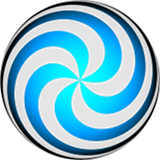

[true]: /wiki/shared/True.png
[false]: /wiki/shared/False.png

# Skinning osu!standard

## Default numbers

This may sound ambiguous/confusing, but this really is just the numbers used for the hitobjects.

On this note, you can use the skin.ini file to define the path for these images using the `HitCirclePrefix` command.

### default-0.png

| Animatable   | Beatmap Skinnable | Skin Version(s) | Origin Point | Optimal Size | Blend Mode |
|:------------:|:-----------------:|:---------------:|:------------:|:------------:|:----------:|
| ![No][false] | ![Yes][true]      | all             | Centre       | -            | Normal     |

- scaled down by 0.8x

### default-1.png

| Animatable   | Beatmap Skinnable | Skin Version(s) | Origin Point | Optimal Size | Blend Mode |
|:------------:|:-----------------:|:---------------:|:------------:|:------------:|:----------:|
| ![No][false] | ![Yes][true]      | all             | Centre       | -            | Normal     |

- scaled down by 0.8x

### default-2.png

| Animatable   | Beatmap Skinnable | Skin Version(s) | Origin Point | Optimal Size | Blend Mode |
|:------------:|:-----------------:|:---------------:|:------------:|:------------:|:----------:|
| ![No][false] | ![Yes][true]      | all             | Centre       | -            | Normal     |

- scaled down by 0.8x

### default-3.png

| Animatable   | Beatmap Skinnable | Skin Version(s) | Origin Point | Optimal Size | Blend Mode |
|:------------:|:-----------------:|:---------------:|:------------:|:------------:|:----------:|
| ![No][false] | ![Yes][true]      | all             | Centre       | -            | Normal     |

- scaled down by 0.8x

### default-4.png

| Animatable   | Beatmap Skinnable | Skin Version(s) | Origin Point | Optimal Size | Blend Mode |
|:------------:|:-----------------:|:---------------:|:------------:|:------------:|:----------:|
| ![No][false] | ![Yes][true]      | all             | Centre       | -            | Normal     |

- scaled down by 0.8x

### default-5.png

| Animatable   | Beatmap Skinnable | Skin Version(s) | Origin Point | Optimal Size | Blend Mode |
|:------------:|:-----------------:|:---------------:|:------------:|:------------:|:----------:|
| ![No][false] | ![Yes][true]      | all             | Centre       | -            | Normal     |

- scaled down by 0.8x

### default-6.png

| Animatable   | Beatmap Skinnable | Skin Version(s) | Origin Point | Optimal Size | Blend Mode |
|:------------:|:-----------------:|:---------------:|:------------:|:------------:|:----------:|
| ![No][false] | ![Yes][true]      | all             | Centre       | -            | Normal     |

- scaled down by 0.8x

### default-7.png

| Animatable   | Beatmap Skinnable | Skin Version(s) | Origin Point | Optimal Size | Blend Mode |
|:------------:|:-----------------:|:---------------:|:------------:|:------------:|:----------:|
| ![No][false] | ![Yes][true]      | all             | Centre       | -            | Normal     |

- scaled down by 0.8x

### default-8.png

| Animatable   | Beatmap Skinnable | Skin Version(s) | Origin Point | Optimal Size | Blend Mode |
|:------------:|:-----------------:|:---------------:|:------------:|:------------:|:----------:|
| ![No][false] | ![Yes][true]      | all             | Centre       | -            | Normal     |

- scaled down by 0.8x

### default-9.png

| Animatable   | Beatmap Skinnable | Skin Version(s) | Origin Point | Optimal Size | Blend Mode |
|:------------:|:-----------------:|:---------------:|:------------:|:------------:|:----------:|
| ![No][false] | ![Yes][true]      | all             | Centre       | -            | Normal     |

- scaled down by 0.8x

## Hitcircle

### approachcircle.png

| Animatable   | Beatmap Skinnable | Skin Version(s) | Origin Point | Optimal Size | Blend Mode           |
|:------------:|:-----------------:|:---------------:|:------------:|:------------:|:--------------------:|
| ![No][false] | ![Yes][true]      | all             | Centre       | 126x126      | Multiplicative&sup1; |

1. this element is tinted with the combo colours

- this element shrinks over time
- this is the visual cue that can help a player know when to tap the hitobject

### hitcircle.png

| Animatable   | Beatmap Skinnable | Skin Version(s) | Origin Point | Optimal Size | Blend Mode           |
|:------------:|:-----------------:|:---------------:|:------------:|:------------:|:--------------------:|
| ![No][false] | ![Yes][true]      | all             | Centre       | 118x118      | Multiplicative&sup1; |

1. this element is tinted with the combo colours

### hitcircleoverlay.png

| Animatable         | Beatmap Skinnable | Skin Version(s) | Origin Point | Optimal Size | Blend Mode  |
|:------------------:|:-----------------:|:---------------:|:------------:|:------------:|:-----------:|
| ![Yes][true]&sup1; | ![Yes][true]      | all             | Centre       | 118x118      | Normal      |

1. animation rate: 2FPS (4FPS max)
   - this rate is affected by the game modifiers (half time and double time/nightcore)

- animation name: `hitcircleoverlay-#.png`, replace # with indexed count (start count at zero)
- this can either overlay or underlay the combo number, by default this will always overlay
  - to make this underlay the combo number, set `HitCircleOverlayAboveNumber` to `0`

### hitcircleselect.png

| Animatable   | Beatmap Skinnable | Skin Version(s) | Origin Point | Optimal Size | Blend Mode |
|:------------:|:-----------------:|:---------------:|:------------:|:------------:|:----------:|
| ![No][false] | ![Yes][true]      | all             | Centre       | 126x126      | Normal     |

- used only in the editor
- this is the highlight for hitcircles and sliders

### followpoint.png

| Animatable   | Beatmap Skinnable | Skin Version(s) | Origin Point | Optimal Size | Blend Mode  |
|:------------:|:-----------------:|:---------------:|:------------:|:------------:|:-----------:|
| ![No][false] | ![Yes][true]      | all             | Centre       | -            | Normal      |

- the arrow should point towards the RIGHT
- this stays on the screen for 1.2 seconds (1200ms)

### lighting.png

| Animatable   | Beatmap Skinnable | Skin Version(s) | Origin Point | Optimal Size | Blend Mode     |
|:------------:|:-----------------:|:---------------:|:------------:|:------------:|:--------------:|
| ![No][false] | ![Yes][true]      | all&sup1;       | Centre       | 100x100      | Additive&sup2; |

1. v2.0+ has smaller expansion ratios
2. this element is tinted with the combo colours

- this can be disabled in the options
- used during kiai time
  - coloured afterimage as part of hitburst explosion
  - glowing behind hitcircles during kiai time
- this element is also used in osu!taiko and osu!catch

## Slider

### sliderstartcircle.png

_(transparent; not included)_

| Animatable   | Beatmap Skinnable | Skin Version(s) | Origin Point | Optimal Size | Blend Mode           |
|:------------:|:-----------------:|:---------------:|:------------:|:------------:|:--------------------:|
| ![No][false] | ![Yes][true]      | all             | Centre       | 118x118      | Multiplicative&sup1; |

1. this element is tinted with the combo colours

- not for Stable (Fallback) stream
- overrides the `hitcircle.png` image for the start of the slider
- this is the hitcircle for the start of the slider

### sliderstartcircleoverlay.png

_(transparent; not included)_

| Animatable         | Beatmap Skinnable | Skin Version(s) | Origin Point | Optimal Size | Blend Mode  |
|:------------------:|:-----------------:|:---------------:|:------------:|:------------:|:-----------:|
| ![Yes][true]&sup1; | ![Yes][true]      | all             | Centre       | 118x118      | Normal      |

1. animation rate: 2FPS (4FPS max)
   - this rate is affected by the game modifiers (half time and double time/nightcore)

- animation name: `sliderstartcircleoverlay-#.png`, replace # with indexed count (start count at zero)
- not for Stable (Fallback) stream
- overrides the `hitcircle.png` image for the start of the slider
- needs `sliderstartcircle.png` for this to work

### sliderendcircle.png

_(transparent; not included)_

| Animatable   | Beatmap Skinnable | Skin Version(s) | Origin Point | Optimal Size | Blend Mode           |
|:------------:|:-----------------:|:---------------:|:------------:|:------------:|:--------------------:|
| ![No][false] | ![Yes][true]      | all             | Centre       | 118x118      | Multiplicative&sup1; |

1. this element is tinted with the combo colours

- not for Stable (Fallback) stream
- overrides the `hitcircle.png` image for the end of the slider
- this is the hitcircle for the end of the slider

### sliderendcircleoverlay.png

_(transparent; not included)_

| Animatable         | Beatmap Skinnable | Skin Version(s) | Origin Point | Optimal Size | Blend Mode  |
|:------------------:|:-----------------:|:---------------:|:------------:|:------------:|:-----------:|
| ![Yes][true]&sup1; | ![Yes][true]      | all             | Centre       | 118x118      | Normal      |

1. animation rate: 2FPS (4FPS max)
   - this rate is affected by the game modifiers (half time and double time/nightcore)

- animation name: `sliderendcircleoverlay-#.png`, replace # with indexed count (start count at zero)
- not for Stable (Fallback) stream
- overrides the `hitcircle.png` image for the end of the slider
- needs `sliderendcircle.png` for this to work

### reversearrow.png

| Animatable   | Beatmap Skinnable | Skin Version(s) | Origin Point | Optimal Size | Blend Mode  |
|:------------:|:-----------------:|:---------------:|:------------:|:------------:|:-----------:|
| ![No][false] | ![Yes][true]      | all             | Centre       | 118x118      | Normal      |

- osu! will rotate this element to follow sliderpath
- this element will pulse at the bpm
- the arrow should point towards the RIGHT

### sliderfollowcircle.png

| Animatable   | Beatmap Skinnable | Skin Version(s) | Origin Point | Optimal Size | Blend Mode  |
|:------------:|:-----------------:|:---------------:|:------------:|:------------:|:-----------:|
| ![Yes][true] | ![Yes][true]      | all             | Centre       | 256x256      | Normal      |

- animation name: `sliderfollowcircle-#.png`, replace # with indexed count (start count at zero)
- this element expands when collecting a slidertick

### sliderb.png

| Animatable   | Beatmap Skinnable | Skin Version(s) | Origin Point | Optimal Size | Blend Mode           |
|:------------:|:-----------------:|:---------------:|:------------:|:------------:|:--------------------:|
| ![Yes][true] | ![Yes][true]      | all             | Centre       | 118x118      | Multiplicative&sup1; |

1. tinted with combo colours
   - this can be disabled in the options
     - if disabled in the skin, this setting will do nothing
   - this can be disabled by setting `AllowSliderBallTint` to `0`
     - if disabled in the options, this command will do nothing

- animation name: `sliderb#.png`, replace # with indexed count (start count at zero)
- by default, the sliderball flips upon hitting the reverse arrow
  - to disable this, set `sliderballflip` to `0`

### sliderb-nd.png

| Animatable   | Beatmap Skinnable | Skin Version(s) | Origin Point | Optimal Size | Blend Mode           |
|:------------:|:-----------------:|:---------------:|:------------:|:------------:|:--------------------:|
| ![No][false] | ![Yes][true]      | all             | Centre       | 118x118      | Multiplicative&sup1; |

1. tinted black

- not skinnable if `sliderb.png` is skinned

### sliderb-spec.png

| Animatable   | Beatmap Skinnable | Skin Version(s) | Origin Point | Optimal Size | Blend Mode     |
|:------------:|:-----------------:|:---------------:|:------------:|:------------:|:--------------:|
| ![No][false] | ![Yes][true]      | all             | Centre       | 118x118      | Additive&sup1; |

- not skinnable if `sliderb.png` is skinned
- used during kiai time
  - this is the lighting layer of the default sliderball

### sliderpoint10.png

_(transparent; not included)_

| Animatable   | Beatmap Skinnable  | Skin Version(s) | Origin Point | Optimal Size | Blend Mode |
|:------------:|:------------------:|:---------------:|:------------:|:------------:|:----------:|
| ![No][false] | ![Yes][true]&sup1; | 1.0             | Centre       | 50x30        | Normal     |

1. if included in a beatmap skin, the end user must be using a skin that uses version 1.0

- used when the player collects a slidertick

### sliderpoint30.png

_(transparent; not included)_

| Animatable   | Beatmap Skinnable  | Skin Version(s) | Origin Point | Optimal Size | Blend Mode |
|:------------:|:------------------:|:---------------:|:------------:|:------------:|:----------:|
| ![No][false] | ![Yes][true]&sup1; | 1.0             | Centre       | 50x30        | Normal     |

1. if included in a beatmap skin, the end user must be using a skin that uses version 1.0

- used when the player starts a slider or when they hit the reverse arrow

### sliderscorepoint.png

| Animatable   | Beatmap Skinnable  | Skin Version(s) | Origin Point | Optimal Size | Blend Mode |
|:------------:|:------------------:|:---------------:|:------------:|:------------:|:----------:|
| ![No][false] | ![Yes][true]&sup1; | all             | Centre       | 16x16        | Normal     |

- these are the sliderticks
- if these overlap the slider start or end, they will he _hidden_
- this element is also used in osu!taiko

## Spinner

**It is important to know that you cannot mix the old and the new spinner styles!**

### spinner-background.png

| Animatable   | Beatmap Skinnable  | Skin Version(s) | Origin Point | Optimal Size | Blend Mode           |
|:------------:|:------------------:|:---------------:|:------------:|:------------:|:--------------------:|
| ![No][false] | ![Yes][true]       | all&sup1;       | Centre&sup2; | 1024x702     | Multiplicative&sup3; |

1. if skinned, this will force "old" styled spinners on v2.0+ (this element is used)
2. positioned around 397px vertically
3. tinted grey, by default
   - to change this, use the `SpinnerBackground` command in the skin.ini file

- **old** spinner set

### spinner-circle.png

| Animatable   | Beatmap Skinnable  | Skin Version(s) | Origin Point | Optimal Size | Blend Mode |
|:------------:|:------------------:|:---------------:|:------------:|:------------:|:----------:|
| ![No][false] | ![Yes][true]       | all&sup1;       | Centre&sup2; | -            | Normal     |

1. if `spinner-background.png` is skinned, this element is used
2. positioned around 397px vertically

- this is the rotating part of the spinner
- **old** spinner set

### spinner-metre.png

| Animatable   | Beatmap Skinnable  | Skin Version(s) | Origin Point | Optimal Size | Blend Mode |
|:------------:|:------------------:|:---------------:|:------------:|:------------:|:----------:|
| ![No][false] | ![Yes][true]       | all&sup1;       | Centre&sup1; | 1024x692     | Normal     |

1. positioning:
   - 46px away from top
   - 512px to the left from the middle axis
   - (0,46) at 1024x768
   - (171,46) at 1366x768

- **old** spinner set

### spinner-osu.png

| Animatable   | Beatmap Skinnable  | Skin Version(s) | Origin Point | Optimal Size | Blend Mode |
|:------------:|:------------------:|:---------------:|:------------:|:------------:|:----------:|
| ![No][false] | ![Yes][true]&sup1; | 1.0             | Centre&sup2; | -            | Normal     |

1. if included in a beatmap skin, the end user must be using a skin that uses version 1.0
2. positioned around 288px vertically

- appears after the spinner fades out
- **old** spinner set

### spinner-bottom.png

| Animatable   | Beatmap Skinnable | Skin Version(s) | Origin Point | Optimal Size | Blend Mode |
|:------------:|:-----------------:|:---------------:|:------------:|:------------:|:----------:|
| ![No][false] | ![Yes][true]      | 2.0+            | Centre&sup1; | -            | Normal     |

1. positioned around 397px height

- rotates the slowest
- second lowest layer
- **new** spinner set

### spinner-glow.png

| Animatable   | Beatmap Skinnable | Skin Version(s) | Origin Point | Optimal Size | Blend Mode           |
|:------------:|:-----------------:|:---------------:|:------------:|:------------:|:--------------------:|
| ![No][false] | ![Yes][true]      | 2.0+            | Centre&sup1; | -            | Multiplicative&sup2; |

1. positioned around 397px height
2. this element is tinted cyan and blinks white when bonus points are awarded

- blinks when giving bonus points
- lowest layer
- **new** spinner set

### spinner-middle.png

| Animatable   | Beatmap Skinnable | Skin Version(s) | Origin Point | Optimal Size | Blend Mode           |
|:------------:|:-----------------:|:---------------:|:------------:|:------------:|:--------------------:|
| ![No][false] | ![Yes][true]      | 2.0+            | Centre&sup1; | -            | Multiplicative&sup2; |

1. positioned around 397px height
2. tinted white, fades into red over time

- tintes read over time (this is the time indicator)
- highest layer
- **new** spinner set

### spinner-middle2.png

| Animatable   | Beatmap Skinnable | Skin Version(s) | Origin Point | Optimal Size | Blend Mode |
|:------------:|:-----------------:|:---------------:|:------------:|:------------:|:----------:|
| ![No][false] | ![Yes][true]      | 2.0+            | Centre&sup1; | -            | Normal     |

1. positioned around 397px height
2. tinted white, fades into red over time

- rotates the fastest
- second highest layer
- **new** spinner set

### spinner-top.png

| Animatable   | Beatmap Skinnable | Skin Version(s) | Origin Point | Optimal Size | Blend Mode |
|:------------:|:-----------------:|:---------------:|:------------:|:------------:|:----------:|
| ![No][false] | ![Yes][true]      | 2.0+            | Centre&sup1; | -            | Normal     |

1. positioned around 397px height
2. tinted white, fades into red over time

- rotates the second fastest (slower than `spinner-middle2.png`)
- middle layer
- **new** spinner set

### spinner-approachcircle.png

| Animatable   | Beatmap Skinnable | Skin Version(s) | Origin Point | Optimal Size | Blend Mode |
|:------------:|:-----------------:|:---------------:|:------------:|:------------:|:----------:|
| ![No][false] | ![Yes][true]      | 2.0+            | Centre&sup1; | 384x384      | Normal     |

### spinner-rpm.png

| Animatable   | Beatmap Skinnable | Skin Version(s) | Origin Point  | Optimal Size | Blend Mode |
|:------------:|:-----------------:|:---------------:|:-------------:|:------------:|:----------:|
| ![No][false] | ![Yes][true]      | 2.0+            | TopLeft&sup1; | 280x56       | Normal     |

1. positioning:
   - positioned 139px from the left from screen middle at 712px vertically
   - (373,712) at 1024x768
   - (544,712) at 1366x768

- this is the window that displays the current spinning speed
- RPM = Revolutions Per Minute
  - Revolutions = full (circular) spin

### spinner-clear.png

| Animatable   | Beatmap Skinnable | Skin Version(s) | Origin Point | Optimal Size | Blend Mode |
|:------------:|:-----------------:|:---------------:|:------------:|:------------:|:----------:|
| ![No][false] | ![Yes][true]      | 2.0+            | Centre&sup1; | -            | Normal     |

1. positioned around 230px height

- this notifies the player that the spinner was cleared
- this implies that the player should keep spinning for bonus points

### spinner-spin.png

| Animatable   | Beatmap Skinnable | Skin Version(s) | Origin Point | Optimal Size | Blend Mode |
|:------------:|:-----------------:|:---------------:|:------------:|:------------:|:----------:|
| ![No][false] | ![Yes][true]      | 2.0+            | Centre&sup1; | -            | Normal     |

1. positioned around 582px height

- this appears at the start of a spinner
- this notifies the player that any spins from this point will be counted
