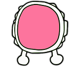
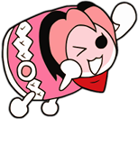

[true]: /wiki/shared/True.png
[false]: /wiki/shared/False.png

# Skinning osu!taiko

You can override the osu!taiko playfield parts by creating a folder called `taiko` inside your skin folder.

If this approach is used, the user will need to explicitly enable this in the options (enable the `Use Taiko skin for Taiko mode` button) otherwise the default skin elements will be used.

## Pippidon

_`pippidonclear.png`_ (included images below)

| Animatable               | Beatmap Skinnable |
|:------------------------:|:-----------------:|
| ![Yes][true] (see notes) | ![Yes][true]      |

**Notes:**

- Animation name: `pippidonclear#.png`, replace # with indexed count (start frame count at zero)
- The animation rate is BPM dependent.
- This animation plays when the player hits a combo milestone.

---

_`pippidonfail.png`_ (included images below)

| Animatable   | Beatmap Skinnable |
|:------------:|:-----------------:|
| ![Yes][true] | ![Yes][true]      |

**Notes:**

- Animation name: `pippidonfail#.png`, replace # with indexed count (start frame count at zero)
- The animation rate is BPM dependent.
- This animation plays when the player misses a note or does not have enough health during a break.
- This overrides `pippidonkiai` if the player misses a note during [kiai time](/wiki/kiai_time).

---

_`pippidonidle.png`_ (included images below)

| Animatable   | Beatmap Skinnable |
|:------------:|:-----------------:|
| ![Yes][true] | ![Yes][true]      |

**Notes:**

- Animation name: `pippidonidle#.png`, replace # with indexed count (start frame count at zero)
- The animation rate is BPM dependent.
- This animation plays when doing nothing (during breaks or waiting for the player to hit the next note)

---

_`pippidonkiai.png`_ (included images below)

| Animatable   | Beatmap Skinnable |
|:------------:|:-----------------:|
| ![Yes][true] | ![Yes][true]      |

**Notes:**

- Animation name: `pippidonkiai#.png`, replace # with indexed count (start frame count at zero)
- The animation rate is BPM dependent.
- This animation plays during [kiai time](/wiki/kiai_time).
- `pippidonfail.png` overrides this if the player misses a note during kiai time.

## Hit Bursts

The following table is for all hit bursts but `taiko-hit300g`.

| Animatable               | Beatmap Skinnable |
|:------------------------:|:-----------------:|
| ![Yes][true] (see notes) | ![Yes][true]      |

**Notes:**

- If the animation is not skinned, the original behavior is used.
  - The original behavior is a short bounce (or upscaling with particles).
  - If two or more frames are skinned, the animation is played.
- These elements follow a fixed animation rate of 60 FPS.
- The last frame persists until it is faded out.
- The ranking screen will use the 0th frame or the static image.

---

| Animatable               | Beatmap Skinnable |
|:------------------------:|:-----------------:|
| ![Yes][true] (see notes) | ![Yes][true]      |

**Note:**

- Animation name: `taiko-hit0-#.png`, replace # with indexed count (start frame count at zero)

---

**Note:**

- Animation name: `taiko-hit100-#.png`, replace # with indexed count (start frame count at zero)

---

**Note:**

- Animation name: `taiko-hit300-#.png`, replace # with indexed count (start frame count at zero)

---

**Note:**

- Animation name: `taiko-hit100k-#.png`, replace # with indexed count (start frame count at zero)

---

**Note:**

- Animation name: `taiko-hit300k-#.png`, replace # with indexed count (start frame count at zero)

---

| Animatable               | Beatmap Skinnable |
|:------------------------:|:-----------------:|
| ![No][false] (see notes) | ![Yes][true]      |

**Notes:**

- Animation name: `taiko-hit300g-#.png`, replace # with indexed count (start frame count at zero)
  - If this element is skinned as an animation, the zeroth frame is used.
- This is only used on the ranking screen in place of `taiko-hit300k` on the ranking screen.

## Notes

| Animatable   | Beatmap Skinnable |
|:------------:|:-----------------:|
| ![No][false] | ![Yes][true]      |

**Notes:**

- This is used for finisher/big notes.
  - This element is upscaled automatically.
- This is also used on the hit position.

---

| Animatable               | Beatmap Skinnable |
|:------------------------:|:-----------------:|
| ![Yes][true] (see notes) | ![Yes][true]      |

**Notes:**

- Animation name: `taikobigcircleoverlay-#.png`, replace # with indexed count (start frame count at zero)
  - 2 frames only (`0` and `1`)
    - animation speed depends on BPM
    - animation starts at combo 50
    - speeds up at combo 150
- This is seen overlaying `taikobigcircle`.
  - This element is upscaled automatically.
- This is also used on the hit position.

---

| Animatable   | Beatmap Skinnable |
|:------------:|:-----------------:|
| ![No][false] | ![Yes][true]      |

---

| Animatable               | Beatmap Skinnable |
|:------------------------:|:-----------------:|
| ![Yes][true] (see notes) | ![Yes][true]      |

**Notes:**

- Animation name: `taikohitcircleoverlay-#.png`, replace # with indexed count (start frame count at zero)
  - 2 frames only (`0` and `1`)
    - animation speed depends on BPM
    - animation starts at 50 combo
    - speeds up at 150 combo
- This is seen overlaying `taikohitcircle`.

---

| Animatable   | Beatmap Skinnable |
|:------------:|:-----------------:|
| ![Yes][true] | ![Yes][true]      |

**Notes:**

- This is used on the hit position as a border.
- This element is also used in osu!standard.

---

| Animatable   | Beatmap Skinnable        |
|:------------:|:------------------------:|
| ![Yes][true] | ![No][false] (see notes) |

**Notes:**

- Beatmap skinnable status is suspected to be a bug.
- This is tinted yellow.
- This is behind the hit position during [kiai time](/wiki/kiai_time), expands when notes are hit

---

| Animatable   | Beatmap Skinnable |
|:------------:|:-----------------:|
| ![No][false] | ![Yes][true]      |

**Notes:**

= This is tinted orange-red.
- There isn't a need to skin this element for osu!taiko.
  - This element is only visible when using a transparent taiko bar.
- This pulsates behind the scrolling bar on the hit position during [kiai time](/wiki/kiai_time).

## Playfield (upper half)

These parts are above the taiko bar, where the hit objects scroll through.

---

| Animatable   | Beatmap Skinnable        |
|:------------:|:------------------------:|
| ![Yes][true] | ![No][false] (see notes) |

**Notes:**

- Beatmap skinnable status is suspected to be a bug.
- This scrolls in a seamless loop, from the right side towards the left.
- This is disbaled if the beatmap has a storyboard.

---

| Animatable   | Beatmap Skinnable        |
|:------------:|:------------------------:|
| ![Yes][true] | ![No][false] (see notes) |

**Notes:**

- Beatmap skinnable status is suspected to be a bug.
- This appears when the player misses a note or if the health bar isn't filled up to 50% during a break.
- This scrolls in a seamless loop, from the right side towards the left.
- This is disbaled if the beatmap has a storyboard.

---

| Animatable               | Beatmap Skinnable |
|:------------------------:|:-----------------:|
| ![No][false] (see notes) | ![Yes][true]      |

**Notes:**

- Not an animation; instead, one of the frames will be used when a combo milestone is met
  - Animation name: `taiko-flower-group-#.png`, replace # with an indexed count (start frame count at zero)
- This element is really the comboburst of osu!taiko.
  - Appears when combo milestone is met.
- This image expands and fades in from behind pippidon when it changes to clear state.

## Playfield (lower half)

These parts are parts of the drums and the taiko bar.

---

| Animatable   | Beatmap Skinnable        |
|:------------:|:------------------------:|
| ![No][false] | ![No][false] (see notes) |

**Notes:**

- Beatmap skinnable status is suspected to be a bug.
- This is where the drum goes.

---

| Animatable   | Beatmap Skinnable        |
|:------------:|:------------------------:|
| ![No][false] | ![No][false] (see notes) |

**Note:**

- Beatmap skinnable status is suspected to be a bug.

---

| Animatable   | Beatmap Skinnable        |
|:------------:|:------------------------:|
| ![No][false] | ![No][false] (see notes) |

**Notes:**

- Beatmap skinnable status is suspected to be a bug.

---

| Animatable   | Beatmap Skinnable        |
|:------------:|:------------------------:|
| ![No][false] | ![No][false] (see notes) |

**Notes:**

- Beatmap skinnable status is suspected to be a bug.
- This element will get stretched to fit screen width.
- This is the normal state of the scrolling bar.

---

| Animatable   | Beatmap Skinnable        |
|:------------:|:------------------------:|
| ![No][false] | ![No][false] (see notes) |

**Notes:**

- Beatmap skinnable status is suspected to be a bug.
- This element will get stretched to fit screen width.
- This is the kiai state of the scrolling bar.
- This element overlays `taiko-bar-right`.

## Drumrolls

Drumrolls are the equivalent of the osu!standard sliders.

---

| Animatable   | Beatmap Skinnable |
|:------------:|:-----------------:|
| ![No][false] | ![Yes][true]      |

**Note:**

- This is the track of the roll where the `sliderscorepoint` are placed on.

---

| Animatable   | Beatmap Skinnable |
|:------------:|:-----------------:|
| ![No][false] | ![Yes][true]      |

**Note:**

- This is the end part of a roll.

---

| Animatable   | Beatmap Skinnable |
|:------------:|:-----------------:|
| ![No][false] | ![Yes][true]      |

**Note:**

- This is the ticks of the roll.

## Shaker

Shakers are the equivalent of the osu!standard spinner.

---

| Animatable   | Beatmap Skinnable |
|:------------:|:-----------------:|
| ![No][false] | ![No][false]      |

**Notes:**

- This is an indicator for the spinner.

---

| Animatable   | Beatmap Skinnable        |
|:------------:|:------------------------:|
| ![No][false] | ![No][false] (see notes) |

**Notes:**

- Beatmap skinnable status is suspected to be a bug.
- For each hit in the spinner happens, the circle rotates anti-clockwise.

---

| Animatable   | Beatmap Skinnable        |
|:------------:|:------------------------:|
| ![No][false] | ![No][false] (see notes) |

**Notes:**

- Beatmap skinnable status is suspected to be a bug.
- This is the duration indicator of the spinner.
  - This shrinks over time.
