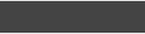

[true]: /wiki/shared/True.png
[false]: /wiki/shared/False.png

# Skinning osu!taiko

You can override the osu!taiko playfield parts by creating a folder called `taiko` inside your skin folder.

If this approach is used, the user will need to explicitly enable this in the options (enable the `Use Taiko skin for Taiko mode` button) otherwise the default skin elements will be used.

## Pippidon

### pippidonclear.png

| Animatable   | Beatmap Skinnable | Skin Version(s) | Origin Point | Optimal Size | Blend Mode |
|:------------:|:-----------------:|:---------------:|:------------:|:------------:|:----------:|
| ![Yes][true] | ![Yes][true]      | all             | BottomLeft   | -            | Normal     |

- animation name: `pippidonclear#.png`, replace # with indexed count (start count at zero)
- animation rate is BPM dependent
- plays when the player hits a combo milestone

### pippidonfail.png

| Animatable   | Beatmap Skinnable | Skin Version(s) | Origin Point | Optimal Size | Blend Mode |
|:------------:|:-----------------:|:---------------:|:------------:|:------------:|:----------:|
| ![Yes][true] | ![Yes][true]      | all             | BottomLeft   | -            | Normal     |

- animation name: `pippidonfail#.png`, replace # with indexed count (start count at zero)
- animation rate is BPM dependent
- plays when the player misses a note
- this overrides `pippidonkiai.png` if the player misses a note during kiai time

### pippidonidle.png

| Animatable   | Beatmap Skinnable | Skin Version(s) | Origin Point | Optimal Size | Blend Mode |
|:------------:|:-----------------:|:---------------:|:------------:|:------------:|:----------:|
| ![Yes][true] | ![Yes][true]      | all             | BottomLeft   | -            | Normal     |

- animation name: `pippidonidle#.png`, replace # with indexed count (start count at zero)
- animation rate is BPM dependent
- plays when doing nothing (during breaks or waiting for the player to hit the next note)

### pippidonkiai.png

| Animatable   | Beatmap Skinnable | Skin Version(s) | Origin Point | Optimal Size | Blend Mode |
|:------------:|:-----------------:|:---------------:|:------------:|:------------:|:----------:|
| ![Yes][true] | ![Yes][true]      | all             | BottomLeft   | -            | Normal     |

- animation name: `pippidonkiai#.png`, replace # with indexed count (start count at zero)
- animation rate is BPM dependent
- plays during kiai time
- `pippidonfail.png` overrides this if the player misses a note during kiai time

## Hitbursts

### taiko-hit0.png

| Animatable         | Beatmap Skinnable | Skin Version(s) | Origin Point | Optimal Size | Blend Mode |
|:------------------:|:-----------------:|:---------------:|:------------:|:------------:|:----------:|
| ![Yes][true]&sup1; | ![Yes][true]      | all             | Centre       | -            | Normal     |

1. if no animation is skinned, the original behavior is used
   - if two or more frames are skinned, this image remains static

- animation name: `taiko-hit0-#.png`, replace # with indexed count (start count at zero)
- fixed animation rate (60FPS)
- last frame persists untill fadeout
- ranking screen uses 0th frame or the static image

### taiko-hit100.png

| Animatable         | Beatmap Skinnable | Skin Version(s) | Origin Point | Optimal Size | Blend Mode |
|:------------------:|:-----------------:|:---------------:|:------------:|:------------:|:----------:|
| ![Yes][true]&sup1; | ![Yes][true]      | all             | Centre       | -            | Normal     |

1. if no animation is skinned, the original behavior is used
   - if two or more frames are skinned, this image remains static

- animation name: `taiko-hit100-#.png`, replace # with indexed count (start count at zero)
- fixed animation rate (60FPS)
- last frame persists untill fadeout
- ranking screen uses 0th frame or the static image

### taiko-hit300.png

| Animatable         | Beatmap Skinnable | Skin Version(s) | Origin Point | Optimal Size | Blend Mode |
|:------------------:|:-----------------:|:---------------:|:------------:|:------------:|:----------:|
| ![Yes][true]&sup1; | ![Yes][true]      | all             | Centre       | -            | Normal     |

1. if no animation is skinned, the original behavior is used
   - if two or more frames are skinned, this image remains static

- animation name: `taiko-hit300-#.png`, replace # with indexed count (start count at zero)
- fixed animation rate (60FPS)
- last frame persists untill fadeout
- ranking screen uses 0th frame or the static image

### taiko-hit100k.png

| Animatable         | Beatmap Skinnable | Skin Version(s) | Origin Point | Optimal Size | Blend Mode |
|:------------------:|:-----------------:|:---------------:|:------------:|:------------:|:----------:|
| ![Yes][true]&sup1; | ![Yes][true]      | all             | Centre       | -            | Normal     |

1. if no animation is skinned, the original behavior is used
   - if two or more frames are skinned, this image remains static

- animation name: `taiko-hit100k-#.png`, replace # with indexed count (start count at zero)
- fixed animation rate (60FPS)
- last frame persists untill fadeout
- ranking screen uses 0th frame or the static image

### taiko-hit300k.png

| Animatable         | Beatmap Skinnable | Skin Version(s) | Origin Point | Optimal Size | Blend Mode |
|:------------------:|:-----------------:|:---------------:|:------------:|:------------:|:----------:|
| ![Yes][true]&sup1; | ![Yes][true]      | all             | Centre       | -            | Normal     |

1. if no animation is skinned, the original behavior is used
   - if two or more frames are skinned, this image remains static

- animation name: `taiko-hit300k-#.png`, replace # with indexed count (start count at zero)
- fixed animation rate (60FPS)
- last frame persists untill fadeout
- ranking screen uses 0th frame or the static image

### taiko-hit300g.png

| Animatable         | Beatmap Skinnable | Skin Version(s) | Origin Point | Optimal Size | Blend Mode |
|:------------------:|:-----------------:|:---------------:|:------------:|:------------:|:----------:|
| ![No][false]&sup1; | ![Yes][true]      | all             | Centre       | -            | Normal     |

1. if skinned with animations, the zeroth frame is used

- animation name: `taiko-hit300g-#.png`, replace # with indexed count (start count at zero)
- this is only used on the ranking screen
  - this replaces the `taiko-hit300k.png` on the ranking screen

## Notes

### taikobigcircle.png

| Animatable   | Beatmap Skinnable | Skin Version(s) | Origin Point | Optimal Size | Blend Mode           |
|:------------:|:-----------------:|:---------------:|:------------:|:------------:|:--------------------:|
| ![No][false] | ![Yes][true]      | all             | Centre       | 118x118      | Multiplicative&sup1; |

1. tint colour depends on type of note:
   - tinted red for Don
   - tinted blue for Katsu
   - tinted yellow for drumroll starting circle

- this is used for finisher/big notes
  - this element is upscaled automatically
- this is also used on the hit position

### taikobigcircleoverlay.png

| Animatable         | Beatmap Skinnable | Skin Version(s) | Origin Point | Optimal Size | Blend Mode |
|:------------------:|:-----------------:|:---------------:|:------------:|:------------:|:----------:|
| ![Yes][true]&sup1; | ![Yes][true]      | all             | Centre       | 118x118      | Normal     |

1. 2 frame limit
   - animation speed depends on BPM
   - animation starts at 50 combo
   - speeds up at 150 combo

- this is used for finisher/big notes
  - this element is upscaled automatically
- this is also used on the hit position

### taikohitcircle.png

| Animatable   | Beatmap Skinnable | Skin Version(s) | Origin Point | Optimal Size | Blend Mode           |
|:------------:|:-----------------:|:---------------:|:------------:|:------------:|:--------------------:|
| ![No][false] | ![Yes][true]      | all             | Centre       | 118x118      | Multiplicative&sup1; |

1. tint colour depends on type of note:
   - tinted red for Don
   - tinted blue for Katsu
   - tinted yellow for drumroll starting circle

### taikohitcircleoverlay.png

| Animatable         | Beatmap Skinnable | Skin Version(s) | Origin Point | Optimal Size | Blend Mode |
|:------------------:|:-----------------:|:---------------:|:------------:|:------------:|:----------:|
| ![Yes][true]&sup1; | ![Yes][true]      | all             | Centre       | 118x118      | Normal     |

1. 2 frame limit
   - animation speed depends on BPM
   - animation starts at 50 combo
   - speeds up at 150 combo

### approachcircle.png

| Animatable   | Beatmap Skinnable | Skin Version(s) | Origin Point | Optimal Size | Blend Mode |
|:------------:|:-----------------:|:---------------:|:------------:|:------------:|:----------:|
| ![Yes][true] | ![Yes][true]      | all             | Centre       | 126x126      | Normal     |

- used on the hit position as a border
- this element is also used in osu!standard

### taiko-glow.png

| Animatable   | Beatmap Skinnable  | Skin Version(s) | Origin Point | Optimal Size | Blend Mode           |
|:------------:|:------------------:|:---------------:|:------------:|:------------:|:--------------------:|
| ![Yes][true] | ![No][false]&sup1; | all             | Centre       | 126x126      | Multiplicative&sup2; |

1. suspected to be a bug
2. tinted yellow

- behind the hit position during kiai time, expands when notes are hit

### lighting.png

| Animatable   | Beatmap Skinnable  | Skin Version(s) | Origin Point | Optimal Size | Blend Mode           |
|:------------:|:------------------:|:---------------:|:------------:|:------------:|:--------------------:|
| ![No][false] | ![Yes][true]&sup1; | all             | Centre       | 126x126      | Multiplicative&sup2; |

1. tinted orange red
2. there isn't a need to skin this element for osu!taiko
  - this element is only visible when using a transparent taiko bar

- pulsates behind the scrolling bar on the hit position during kiai time

## Playfield (upper half)

These parts are above the taiko bar, where the hitobjects scroll through.

### taiko-slider.png

| Animatable   | Beatmap Skinnable  | Skin Version(s) | Origin Point | Optimal Size | Blend Mode |
|:------------:|:------------------:|:---------------:|:------------:|:------------:|:----------:|
| ![Yes][true] | ![No][false]&sup1; | all             | TopLeft      | 776x162      | Normal     |

1. suspected to be a bug

- seamless loop, scrolling from the right side towards the left
- disbaled if map has a storyboard

### taiko-slider-fail.png

| Animatable   | Beatmap Skinnable  | Skin Version(s) | Origin Point | Optimal Size | Blend Mode |
|:------------:|:------------------:|:---------------:|:------------:|:------------:|:----------:|
| ![Yes][true] | ![No][false]&sup1; | all             | TopLeft      | 776x162      | Normal     |

1. suspected to be a bug

- appears when the player misses a note or if the health bar isn't filled up to 50% during a break
- seamless loop, scrolling from the right side towards the left
- disbaled if map has a storyboard

### taiko-flower-group.png

| Animatable         | Beatmap Skinnable | Skin Version(s) | Origin Point | Optimal Size | Blend Mode |
|:------------------:|:-----------------:|:---------------:|:------------:|:------------:|:----------:|
| ![No][false]&sup1; | ![Yes][true]      | all             | TopLeft      | 776x162      | Normal     |

1. not an animation; instead, one of the frames will be used when a combo milestone is met
   - use `taiko-flower-group-#.png`, replace # with an indexed count (start count at zero)

- this element is really the comboburst of osu!taiko
  - appears when combo milestone is met
- this image expands and fades in from behind pippidon when it changes to clear state

## Playfield (lower half)

These parts are parts of the drums and the taiko bar.

### taiko-bar-left.png

| Animatable   | Beatmap Skinnable  | Skin Version(s) | Origin Point | Optimal Size | Blend Mode |
|:------------:|:------------------:|:---------------:|:------------:|:------------:|:----------:|
| ![No][false] | ![No][false]&sup1; | all             | TopLeft      | 180x200      | Normal     |

1. suspected to be a bug

- this is where the drum goes

### taiko-drum-inner.png

| Animatable   | Beatmap Skinnable  | Skin Version(s) | Origin Point  | Optimal Size | Blend Mode |
|:------------:|:------------------:|:---------------:|:-------------:|:------------:|:----------:|
| ![No][false] | ![No][false]&sup1; | all&sup2;       | TopLeft&sup3; | varies&sup4; | Normal     |

1. suspected to be a bug
2. positioning changes for v2.1+
3. positions:
   - v2.1+: (0, 0) and (90, 0) mirrored
   - v2.0-: (29, 50) and (85, 50) mirrored
4. depends on skin version:
   - v2.1+ = 90x200
   - v2.0- = max width: 55px

### taiko-drum-outer.png

| Animatable   | Beatmap Skinnable  | Skin Version(s) | Origin Point  | Optimal Size | Blend Mode |
|:------------:|:------------------:|:---------------:|:-------------:|:------------:|:----------:|
| ![No][false] | ![No][false]&sup1; | all&sup2;       | TopLeft&sup3; | varies&sup4; | Normal     |

1. suspected to be a bug
2. positioning changes for v2.1+
3. positions:
   - v2.1+: (90, 0) and (0, 0) mirrored
   - v2.0-: (85, 37) and (13, 37) mirrored
4. depends on skin version:
   - v2.1+ = 90x200
   - v2.0- = max width: 55px

### taiko-bar-right.png

| Animatable   | Beatmap Skinnable  | Skin Version(s) | Origin Point  | Optimal Size | Blend Mode |
|:------------:|:------------------:|:---------------:|:-------------:|:------------:|:----------:|
| ![No][false] | ![No][false]&sup1; | all&sup2;       | TopLeft&sup3; | varies&sup4; | Normal     |

1. suspected to be a bug
2. positioning changes for v2.1+
3. positions:
   - v2.1+: (0, 0) (`taiko-bar-left.png` overlays)
   - v2.0-: (180, 0)
4. depends on skin version:
   - v2.1+ = 1024x200
   - v2.0- = 844x200

- this element will get stretched to fit screen width
- this is the normal state of the scrolling bar

### taiko-bar-right-glow.png

| Animatable   | Beatmap Skinnable  | Skin Version(s) | Origin Point  | Optimal Size | Blend Mode |
|:------------:|:------------------:|:---------------:|:-------------:|:------------:|:----------:|
| ![No][false] | ![No][false]&sup1; | all&sup2;       | TopLeft&sup3; | varies&sup4; | Normal     |

1. suspected to be a bug
2. positioning changes for v2.1+
3. positions:
   - v2.1+: (0, 0) (`taiko-bar-left.png` overlays)
   - v2.0-: (180, 0)
4. depends on skin version:
   - v2.1+ = 1024x200
   - v2.0- = 844x200

- this element will get stretched to fit screen width
- this is the kiai state of the scrolling bar
- this element overlays `taiko-bar-right.png`

## Drumroll

https://docs.google.com/spreadsheets/d/1bhnV-CQRMy3Z0npQd9XSoTdkYxz0ew5e648S00qkJZ8/edit#gid=2074725196
http://osu.ppy.sh/wiki/Skinning_Taiko

Drumrolls are the equivalent of the osu!standard sliders.

## Shaker

Shakers are the equivalent of the osu!standard spinner.
