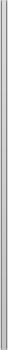

# Skinning de osu!taiko

Puedes modificar las partes del campo de juego de osu!taiko creando una carpeta llamada `taiko` dentro de la carpeta de tu skin. Si se usa este enfoque, el usuario deberá habilitarlo explícitamente en las [opciones](/wiki/Client/Options) (habilita el botón `Utilizar la skin de Taiko para Taiko`); de lo contrario, se usarán los elementos predeterminados de la skin.

## Pippidon

`pippidonclear.png`

| Versiones | Animable | Personalizable para los beatmaps | Modo de mezcla | Origen | Tamaño SD sugerido |
| :-: | :-: | :-: | :-: | :-: | :-: |
| Todas | ![Sí][true] (véase las notas) | ![Sí][true] | Normal | Abajo a la izquierda | - |

Notas:

- Nombre de la animación: `pippidonclear{n}.png`.
  - Solo puedes modificar 7 fotogramas (de 0 a 6).
  - Si se anima, se recomienda animar los 7 fotogramas. (De lo contrario, el último fotograma persistirá para los fotogramas faltantes en el orden de fotogramas como se indica a continuación).
  - El orden de los fotogramas de la animación es `0 1 2 3 4 5 6 5 6 5 4 3 2 1 0`.
- La velocidad de la animación depende del BPM.
- Esta animación solo se reproduce una vez cuando el jugador alcanza un hito de combo; luego vuelve al estado inactivo o kiai.

---

`pippidonfail.png`

| Versiones | Animable | Personalizable para los beatmaps | Modo de mezcla | Origen | Tamaño SD sugerido |
| :-: | :-: | :-: | :-: | :-: | :-: |
| Todas | ![Sí][true] (véase las notas) | ![Sí][true] | Normal | Abajo a la izquierda | - |

Notas:

- Nombre de la animación: `pippidonfail{n}.png`.
- La velocidad de la animación depende del BPM.
- Esta animación se reproduce cuando el jugador falla una nota o no tiene suficiente salud durante un descanso.
- Esto sustituirá a `pippidonkiai` si el jugador falla una nota durante el [kiai time](/wiki/Gameplay/Kiai_time).

---

`pippidonidle.png`

| Versiones | Animable | Personalizable para los beatmaps | Modo de mezcla | Origen | Tamaño SD sugerido |
| :-: | :-: | :-: | :-: | :-: | :-: |
| Todas | ![Sí][true] (véase las notas) | ![Sí][true] | Normal | Abajo a la izquierda | - |

Notas:

- Nombre de la animación: `pippidonidle{n}.png`.
- La velocidad de la animación depende del BPM.
- Esta animación se reproduce cuando no se hace nada (durante los descansos o esperando a que el jugador golpeé la siguiente nota)

---

`pippidonkiai.png`

| Versiones | Animable | Personalizable para los beatmaps | Modo de mezcla | Origen | Tamaño SD sugerido |
| :-: | :-: | :-: | :-: | :-: | :-: |
| Todas | ![Sí][true] (véase las notas) | ![Sí][true] | Normal | Abajo a la izquierda | - |

Notas:

- Nombre de la animación: `pippidonkiai{n}.png`.
- La velocidad de la animación depende del BPM.
- Esta animación se reproduce durante el [kiai time](/wiki/Gameplay/Kiai_time).
- `pippidonfail.png` lo sustituirá si el jugador falla una nota durante el kiai time.

## Hit Bursts

`taiko-hit0.png`

| Versiones | Animable | Personalizable para los beatmaps | Modo de mezcla | Origen | Tamaño SD sugerido |
| :-: | :-: | :-: | :-: | :-: | :-: |
| Todas | ![Sí][true] | ![Sí][true] | Normal | Centro | - |

Notas:

- Nombre de la animación: `taiko-hit0-{n}.png`.
- Si se anima, no se desactivará el efecto predeterminado de las imágenes estáticas.

---

`taiko-hit100.png`

| Versiones | Animable | Personalizable para los beatmaps | Modo de mezcla | Origen | Tamaño SD sugerido |
| :-: | :-: | :-: | :-: | :-: | :-: |
| Todas | ![Sí][true] | ![Sí][true] | Normal | Centro | - |

Notas:

- Nombre de la animación: `taiko-hit100-{n}.png`.
- Si se anima, no se desactivará el efecto predeterminado de las imágenes estáticas.

---

`taiko-hit100k.png`

| Versiones | Animable | Personalizable para los beatmaps | Modo de mezcla | Origen | Tamaño SD sugerido |
| :-: | :-: | :-: | :-: | :-: | :-: |
| Todas | ![Sí][true] | ![Sí][true] | Normal | Centro | - |

Notas:

- Nombre de la animación: `taiko-hit100k-{n}.png`.
- Si se anima, no se desactivará el efecto predeterminado de las imágenes estáticas.

---

`taiko-hit300.png`

| Versiones | Animable | Personalizable para los beatmaps | Modo de mezcla | Origen | Tamaño SD sugerido |
| :-: | :-: | :-: | :-: | :-: | :-: |
| Todas | ![Sí][true] | ![Sí][true] | Normal | Centro | - |

Notas:

- Nombre de la animación: `taiko-hit300-{n}.png`.
- Si se anima, no se desactivará el efecto predeterminado de las imágenes estáticas.

---

`taiko-hit300k.png`

| Versiones | Animable | Personalizable para los beatmaps | Modo de mezcla | Origen | Tamaño SD sugerido |
| :-: | :-: | :-: | :-: | :-: | :-: |
| Todas | ![Sí][true] | ![Sí][true] | Normal | Centro | - |

Notas:

- Nombre de la animación: `taiko-hit300k-{n}.png`.
- Si se anima, no se desactivará el efecto predeterminado de las imágenes estáticas.

---

`taiko-hit300g.png`

| Versiones | Animable | Personalizable para los beatmaps | Modo de mezcla | Origen | Tamaño SD sugerido |
| :-: | :-: | :-: | :-: | :-: | :-: |
| Todas | ![No][false] (véase las notas) | ![No][false] | Normal | Centro | - |

Notas:

- Se puede animar, pero solo se usará el fotograma cero.
  - Nombre de la animación: `taiko-hit300g-{n}.png`
- Esta imagen solo se usa en la pantalla de resultados (en lugar de `taiko-hit300k.png`).

## Notas

`taikobigcircle.png`

| Versiones | Animable | Personalizable para los beatmaps | Modo de mezcla | Origen | Tamaño SD sugerido |
| :-: | :-: | :-: | :-: | :-: | :-: |
| Todas | ![No][false] | ![Sí][true] | Multiplicativo | Centro | 118x118 |

Notas:

- Este elemento se usa para los finisher/notas grandes.
  - Este elemento se reescala automáticamente.
- Este elemento también se usa en la posición de impacto.
- Teñido de rojo para «Don» (235,69,44)
- Teñido de azul para «Katsu» (68,141,171)
- Teñido de amarillo para el círculo de inicio del redoble (252,83,6)

---

`taikobigcircleoverlay.png`

| Versiones | Animable | Personalizable para los beatmaps | Modo de mezcla | Origen | Tamaño SD sugerido |
| :-: | :-: | :-: | :-: | :-: | :-: |
| Todas | ![Sí][true] | ![Sí][true] | Normal | Centro | 118x118 |

Notas:

- Nombre de la animación: `taikobigcircleoverlay-{n}.png`.
  - solo 2 fotogramas (`0` y `1`)
  - la velocidad de la animación depende del BPM
    - la animación comienza a partir del combo 50
    - acelera a partir del combo 150
- Este elemento se reescala automáticamente.

---

`taikohitcircle.png`

| Versiones | Animable | Personalizable para los beatmaps | Modo de mezcla | Origen | Tamaño SD sugerido |
| :-: | :-: | :-: | :-: | :-: | :-: |
| Todas | ![No][false] | ![Sí][true] | Multiplicativo | Centro | 118x118 |

Notas:

- Teñido de rojo para «Don» (235,69,44)
- Teñido de azul para «Katsu» (68,141,171)
- Teñido de amarillo para el círculo de inicio del redoble (252,83,6)

---

`taikohitcircleoverlay.png`

| Versiones | Animable | Personalizable para los beatmaps | Modo de mezcla | Origen | Tamaño SD sugerido |
| :-: | :-: | :-: | :-: | :-: | :-: |
| Todas | ![Sí][true] | ![Sí][true] | Normal | Centro | 118x118 |

Notas:

- Nombre de la animación: `taikohitcircleoverlay-{n}.png`.
  - solo 2 fotogramas (`0` y `1`)
  - la velocidad de la animación depende del BPM
    - la animación comienza a partir del combo 50
    - acelera a partir del combo 150

---

`approachcircle.png`

| Versiones | Animable | Personalizable para los beatmaps | Modo de mezcla | Origen | Tamaño SD sugerido |
| :-: | :-: | :-: | :-: | :-: | :-: |
| Todas | ![No][false] | ![Sí][true] | Normal | Centro | 126x126 |

Notas:

- Este elemento se usa en la posición de impacto como borde.
- Este elemento también se usa en [osu!](/wiki/Game_mode/osu!).

---

`taiko-glow.png`

| Versiones | Animable | Personalizable para los beatmaps | Modo de mezcla | Origen | Tamaño SD sugerido |
| :-: | :-: | :-: | :-: | :-: | :-: |
| Todas | ![No][false] | ![No][false] (véase las notas) | Multiplicativo | Centro | - |

Notas:

- Se sospecha que el estado personalizable para los beatmaps es un error.
- Teñido de amarillo.
- Este elemento está detrás de la posición de impacto durante el [kiai time](/wiki/Gameplay/Kiai_time), se expande cuando se golpean las notas.

---

`lighting.png`

| Versiones | Animable | Personalizable para los beatmaps | Modo de mezcla | Origen | Tamaño SD sugerido |
| :-: | :-: | :-: | :-: | :-: | :-: |
| Todas | ![No][false] | ![Sí][true] | Aditivo | Centro | - |

Notas:

- Teñido de rojo anaranjado.
- No es necesario añadir este elemento para osu!taiko.
  - Este elemento solo es visible cuando se usa una barra de taiko transparente.
- Esto late detrás de la barra de desplazamiento en la posición de impacto durante el [kiai time](/wiki/Gameplay/Kiai_time).

## Campo de juego (mitad superior)

`taiko-slider.png`

| Versiones | Animable | Personalizable para los beatmaps | Modo de mezcla | Origen | Tamaño SD sugerido |
| :-: | :-: | :-: | :-: | :-: | :-: |
| Todas | ![No][false] | ![Sí][true] (véase las notas) | Normal | Arriba a la izquierda | 776x162 |

Notas:

- Se sospecha que el estado personalizable para los beatmaps es un error.
- Esto se desplaza en un bucle continuo, desde la derecha hacia la izquierda.
- Este elemento está deshabilitado si el beatmap tiene un storyboard.
- Se reescala 1,4 veces en el juego.

---

`taiko-slider-fail.png`

| Versiones | Animable | Personalizable para los beatmaps | Modo de mezcla | Origen | Tamaño SD sugerido |
| :-: | :-: | :-: | :-: | :-: | :-: |
| Todas | ![No][false] | ![No][false] | Normal | Arriba a la izquierda | 776x162 |

Notas:

- Esto aparece cuando el jugador falla una nota o si la barra de salud no se llena hasta el 50 % durante un descanso.
- Se sospecha que el estado personalizable para los beatmaps es un error.
- Esto se desplaza en un bucle continuo, desde la derecha hacia la izquierda.
- Este elemento está deshabilitado si el beatmap tiene un storyboard.
- Se reescala 1,4 veces en el juego.

---

`taiko-flower-group.png`

| Versiones | Animable | Personalizable para los beatmaps | Modo de mezcla | Origen | Tamaño SD sugerido |
| :-: | :-: | :-: | :-: | :-: | :-: |
| Todas | ![No][false] (véase las notas) | ![Sí][true] | Normal | Abajo | - |

Notas:

- Estos son como los combo bursts.
- Para tener múltiples combo bursts, usa: `taiko-flower-group-{n}.png`.
  - Una de las imágenes del conjunto aparecerá cuando se alcance un hito de combo.
- Esta imagen se expande y se desvanece desde detrás de pippidon cuando cambia al estado claro.

## Campo de juego (mitad inferior)

`taiko-bar-left.png`

| Versiones | Animable | Personalizable para los beatmaps | Modo de mezcla | Origen | Tamaño SD sugerido |
| :-: | :-: | :-: | :-: | :-: | :-: |
| Todas | ![No][false] | ![No][false] (véase las notas) | Normal | Arriba a la izquierda | 181x200 |

Notas:

- Se sospecha que el estado personalizable para los beatmaps es un error.
- Posicionado en (0,216).
- Este elemento es el lugar donde va el tambor.

---

`taiko-drum-inner.png`

| Versiones | Animable | Personalizable para los beatmaps | Modo de mezcla | Origen | Tamaño SD sugerido |
| :-: | :-: | :-: | :-: | :-: | :-: |
| v1 - v2.0 | ![No][false] | ![No][false] (véase las notas) | Normal | Arriba a la izquierda | Anchura máxima: 56px |
| v2.1 o posteriores | ![No][false] | ![No][false] (véase las notas) | Normal | Arriba a la izquierda | 90x200 |

Notas:

- Se sospecha que el estado personalizable para los beatmaps es un error.
- La posición varía según la versión de la skin:
  - Versión 1.0 - versión 2.0: (29,266) (y (86,266) cuando se refleja)
  - Versión 2.1 o versiones posteriores: (0,216) (y (90,216) cuando se refleja)

---

`taiko-drum-outer.png`

| Versiones | Animable | Personalizable para los beatmaps | Modo de mezcla | Origen | Tamaño SD sugerido |
| :-: | :-: | :-: | :-: | :-: | :-: |
| v1 - v2.0 | ![No][false] | ![No][false] (véase las notas) | Normal | Arriba a la izquierda | Anchura máxima: 72px |
| v2.1 o posteriores | ![No][false] | ![No][false] (véase las notas) | Normal | Arriba a la izquierda | 90x200 |

Notas:

- Se sospecha que el estado personalizable para los beatmaps es un error.
- La posición varía según la versión de la skin:
  - Versión 1.0 - versión 2.0: (85,253) ((13,253) cuando se refleja)
  - Versión 2.1 o versiones posteriores: (90,216) (y (0,216) cuando se refleja)

---

`taiko-bar-right.png`

| Versiones | Animable | Personalizable para los beatmaps | Modo de mezcla | Origen | Tamaño SD sugerido |
| :-: | :-: | :-: | :-: | :-: | :-: |
| v1.0 - v2.0 | ![No][false] | ![No][false] (véase las notas) | Normal | Arriba a la izquierda | 843x200 |
| v2.1 o posteriores | ![No][false] | ![No][false] (véase las notas) | Normal | Arriba a la izquierda | 1024x200 |

Notas:

- Se sospecha que el estado personalizable para los beatmaps es un error.
- Este elemento se estirará para ajustarse al ancho de la pantalla.
- Este elemento es el estado normal de la barra de desplazamiento.
- La posición varía según la versión de la skin:
  - Versión 1.0 - versión 2.0: (181,216)
  - Versión 2.1 o versiones posteriores: (0,216)

---

`taiko-bar-right-glow.png`

| Versiones | Animable | Personalizable para los beatmaps | Modo de mezcla | Origen | Tamaño SD sugerido |
| :-: | :-: | :-: | :-: | :-: | :-: |
| v1.0 - v2.0 | ![No][false] | ![No][false] (véase las notas) | Normal | Arriba a la izquierda | 843x200 |
| v2.1 o posteriores | ![No][false] | ![No][false] (véase las notas) | Normal | Arriba a la izquierda | 1024x200 |

Notas:

- Se sospecha que el estado personalizable para los beatmaps es un error.
- Este elemento se estirará para ajustarse al ancho de la pantalla.
- Este elemento es el estado del kiai de la barra de desplazamiento.
- Este elemento se superpone a `taiko-bar-right`.
- La posición varía según la versión de la skin:
  - Versión 1.0 - versión 2.0: (181,216)
  - Versión 2.1 o versiones posteriores: (0,216)

<!-- lint ignore heading-increment -->

#### `taiko-barline.png`

::: Infobox

|  |  |
| :-- | :-- |
| Versiones | Todas |
| Animable | ![No][false] |
| Personalizable para los beatmaps | ![No][false] |
| Modo de mezcla | Normal |
| Origen | Centro |
| Tamaño SD sugerido | 4x175 |

:::

Esta imagen se muestra en el campo de juego al principio de cada [compás](/wiki/Music_theory/Measure) de la canción (a menos que se omita mediante un [punto de tiempo](/wiki/Client/Beatmap_editor/Timing#puntos-de-tiempo-no-heredados)).

## Redobles de tambores

`taiko-roll-middle.png`

| Versiones | Animable | Personalizable para los beatmaps | Modo de mezcla | Origen | Tamaño SD sugerido |
| :-: | :-: | :-: | :-: | :-: | :-: |
| Todas | ![No][false] | ![Sí][true] | Multiplicativo | Arriba a la izquierda | 1x128 |

Notas:

- El ancho de la imagen SD debe tener exactamente 1 píxel de ancho.
- Este elemento es la línea del redoble donde se colocan los `sliderscorepoint.png`.
- El tinte pasa de amarillo a rojo.

---

`taiko-roll-end.png`

| Versiones | Animable | Personalizable para los beatmaps | Modo de mezcla | Origen | Tamaño SD sugerido |
| :-: | :-: | :-: | :-: | :-: | :-: |
| Todas | ![No][false] | ![Sí][true] | Multiplicativo | Arriba a la izquierda | 64x128 |

Notas:

- Este elemento es la parte final de un redoble.
- El tinte pasa de amarillo a rojo.

---

`sliderscorepoint.png`

| Versiones | Animable | Personalizable para los beatmaps | Modo de mezcla | Origen | Tamaño SD sugerido |
| :-: | :-: | :-: | :-: | :-: | :-: |
| Todas | ![No][false] | ![Sí][true] | Normal | Centro | - |

Notas:

- Este elemento también se usa en [osu!](/wiki/Game_mode/osu!).
- Estas son las marcas del redoble.

## Shaker

`spinner-warning.png`

| Versiones | Animable | Personalizable para los beatmaps | Modo de mezcla | Origen | Tamaño SD sugerido |
| :-: | :-: | :-: | :-: | :-: | :-: |
| Todas | ![No][false] | ![Sí][true] | Normal | Centro | - |

Notas:

- Este elemento es un indicador para el spinner.

---

`spinner-circle.png`

| Versiones | Animable | Personalizable para los beatmaps | Modo de mezcla | Origen | Tamaño SD sugerido |
| :-: | :-: | :-: | :-: | :-: | :-: |
| Todas | ![No][false] | ![No][false] (véase las notas) | Normal | Centro | - |

Notas:

- Se sospecha que el estado personalizable para los beatmaps es un error.
- Este elemento también se usa en [osu!](/wiki/Game_mode/osu!).
- Por cada golpe que se produce en el spinner, el círculo gira en el sentido contrario a las agujas del reloj.

---

`spinner-approachcircle.png`

| Versiones | Animable | Personalizable para los beatmaps | Modo de mezcla | Origen | Tamaño SD sugerido |
| :-: | :-: | :-: | :-: | :-: | :-: |
| Todas | ![No][false] | ![No][false] (véase las notas) | Normal | Centro | - |

Notas:

- Se sospecha que el estado personalizable para los beatmaps es un error.
- Este elemento también se usa en [osu!](/wiki/Game_mode/osu!).
- Este elemento es el indicador de duración del spinner.
  - Esto se reduce con el tiempo.

[true]: /wiki/shared/true.png
[false]: /wiki/shared/false.png
