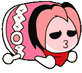
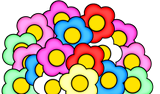
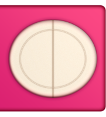
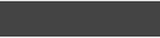
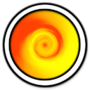
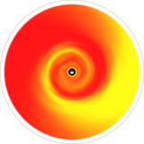

# Skinning du mode osu!taiko

Vous pouvez remplacer les parties du playfield osu!taiko en créant un dossier appelé `taiko` dans votre dossier skin. Si cette approche est utilisée, l'utilisateur devra explicitement l'activer dans les [options](/wiki/Client/Options) (activer le bouton `Utiliser le skin Taiko pour le mode Taiko`), sinon les éléments du skin par défaut seront utilisés.

## Pippidon

`pippidonclear.png`

| Versions | Peut être animé | Modifiable sur une beatmap | Blend Mode | Origine | Taille de SD suggérée |
| :-: | :-: | :-: | :-: | :-: | :-: |
| Toutes | ![Oui][true] (voir notes) | ![Oui][true] | Normal | En bas à gauche | - |

Notes :

- Nom de l'animation : `pippidonclear{n}.png`.
  - Vous ne pouvez skinner que 7 frames (de 0 à 6).
  - Si elles sont animées, il est recommandé d'animer les 7 images. (Si ce n'est pas le cas, la dernière image persistera pour les images manquantes dans l'ordre des images comme indiqué ci-dessous).
  - L'ordre des images de l'animation est `0 1 2 3 4 5 6 5 4 3 2 1 0`.
- Le taux d'animation dépend du BPM.
- Cette animation n'est jouée qu'une seule fois lorsque le joueur atteint un combo milestone ; ensuite, il retourne à l'état de repos ou de kiai.

---

`pippidonfail.png`

| Versions | Peut être animé | Modifiable sur une beatmap | Blend Mode | Origine | Taille de SD suggérée |
| :-: | :-: | :-: | :-: | :-: | :-: |
| Toutes | ![Oui][true] (voir notes) | ![Oui][true] | Normal | En bas à gauche | - |

Notes :

- Nom de l'animation : `pippidonfail{n}.png`.
- Le taux d'animation dépend du BPM.
- Cette animation est joué lorsque le joueur rate une note ou n'a pas assez de santé pendant une pause.
- Ceci remplace `pippidonkiai` si le joueur manque une note pendant le [kiai time](/wiki/Gameplay/Kiai_time).

---

`pippidonidle.png`

| Versions | Peut être animé | Modifiable sur une beatmap | Blend Mode | Origine | Taille de SD suggérée |
| :-: | :-: | :-: | :-: | :-: | :-: |
| Toutes | ![Oui][true] (voir notes) | ![Oui][true] | Normal | En bas à gauche | - |

Notes :

- Nom de l'animation : `pippidonidle{n}.png`.
- Le taux d'animation dépend du BPM.
- Cette animation est jouée lorsque vous ne faites rien (pendant les pauses ou lorsque vous attendez que le joueur frappe la note suivante).

---

`pippidonkiai.png`

| Versions | Peut être animé | Modifiable sur une beatmap | Blend Mode | Origine | Taille de SD suggérée |
| :-: | :-: | :-: | :-: | :-: | :-: |
| Toutes | ![Oui][true] (voir notes) | ![Oui][true] | Normal | En bas à gauche | - |

Notes :

- Nom de l'animation : `pippidonkiai{n}.png`.
- Le taux d'animation dépend du BPM.
- Cette animation est jouée pendant la [kiai time](/wiki/Gameplay/Kiai_time).
- `pippidonfail.png` remplace ceci si le joueur manque une note pendant le kiai time.

## Hit Bursts

`taiko-hit0.png`

| Versions | Peut être animé | Modifiable sur une beatmap | Blend Mode | Origine | Taille de SD suggérée |
| :-: | :-: | :-: | :-: | :-: | :-: |
| Toutes | ![Oui][true] | ![Oui][true] | Normal | Centre | - |

Notes :

- Nom de l'animation : `taiko-hit0-{n}.png`.
- S'il est animé, l'effet par défaut des images statiques ne sera pas désactivé.

---

`taiko-hit100.png`

| Versions | Peut être animé | Modifiable sur une beatmap | Blend Mode | Origine | Taille de SD suggérée |
| :-: | :-: | :-: | :-: | :-: | :-: |
| Toutes | ![Oui][true] | ![Oui][true] | Normal | Centre | - |

Notes :

- Nom de l'animation : `taiko-hit100-{n}.png`.
- S'il est animé, l'effet par défaut des images statiques ne sera pas désactivé.

---

`taiko-hit100k.png`

| Versions | Peut être animé | Modifiable sur une beatmap | Blend Mode | Origine | Taille de SD suggérée |
| :-: | :-: | :-: | :-: | :-: | :-: |
| Toutes | ![Oui][true] | ![Oui][true] | Normal | Centre | - |

Notes :

- Nom de l'animation : `taiko-hit100k-{n}.png`.
- S'il est animé, l'effet par défaut des images statiques ne sera pas désactivé.

---

`taiko-hit300.png`

| Versions | Peut être animé | Modifiable sur une beatmap | Blend Mode | Origine | Taille de SD suggérée |
| :-: | :-: | :-: | :-: | :-: | :-: |
| Toutes | ![Oui][true] | ![Oui][true] | Normal | Centre | - |

Notes :

- Nom de l'animation : `taiko-hit300-{n}.png`.
- S'il est animé, l'effet par défaut des images statiques ne sera pas désactivé.

---

`taiko-hit300k.png`

| Versions | Peut être animé | Modifiable sur une beatmap | Blend Mode | Origine | Taille de SD suggérée |
| :-: | :-: | :-: | :-: | :-: | :-: |
| Toutes | ![Oui][true] | ![Oui][true] | Normal | Centre | - |

Notes :

- Nom de l'animation : `taiko-hit300k-{n}.png`.
- S'il est animé, l'effet par défaut des images statiques ne sera pas désactivé.

---

`taiko-hit300g.png`

| Versions | Peut être animé | Modifiable sur une beatmap | Blend Mode | Origine | Taille de SD suggérée |
| :-: | :-: | :-: | :-: | :-: | :-: |
| Toutes | ![Non][false] (voir notes) | ![Non][false] | Normal | Centre | - |

Notes :

- Peut être animé, mais seule la dernière image sera utilisée.
  - Nom de l'animation : `taiko-hit300g-{n}.png`
- Cette image est uniquement utilisée sur l'écran de classement (à la place de `taiko-hit300k.png`).

## Notes

`taikobigcircle.png`

| Versions | Peut être animé | Modifiable sur une beatmap | Blend Mode | Origine | Taille de SD suggérée |
| :-: | :-: | :-: | :-: | :-: | :-: |
| Toutes | ![Non][false] | ![Oui][true] | Multiplicatif | Centre | 118x118 |

Notes :

- Cet élément est utilisé pour les notes de finisher/big.
  - Cet élément est automatiquement mis à l'échelle.
- Cet élément est également utilisé sur la position de la frappe.
- Teinté en rouge pour les "Don" (235,69,44)
- Teinté en bleu pour les "Katsu" (68,141,171)
- Teinté en jaune pour le cercle de départ du drumroll (252,83,6)

---

`taikobigcircleoverlay.png`

| Versions | Peut être animé | Modifiable sur une beatmap | Blend Mode | Origine | Taille de SD suggérée |
| :-: | :-: | :-: | :-: | :-: | :-: |
| Toutes | ![Oui][true] | ![Oui][true] | Normal | Centre | 118x118 |

Notes :

- Nom de l'animation : `taikobigcircleoverlay-{n}.png`.
  - 2 frames seulement (`0` et `1`)
  - la vitesse d'animation dépend du BPM
    - l'animation commence au combo 50
    - accélère au combo 150
- Cet élément est automatiquement mis à l'échelle.

---

`taikohitcircle.png`

| Versions | Peut être animé | Modifiable sur une beatmap | Blend Mode | Origine | Taille de SD suggérée |
| :-: | :-: | :-: | :-: | :-: | :-: |
| Toutes | ![Non][false] | ![Oui][true] | Multiplicatif | Centre | 118x118 |

Notes :

- Teinté en rouge pour les "Don" (235,69,44)
- Teinté en bleu pour les "Katsu" (68,141,171)
- Teinté en jaune pour le cercle de départ du drumroll (252,83,6)

---

`taikohitcircleoverlay.png`

| Versions | Peut être animé | Modifiable sur une beatmap | Blend Mode | Origine | Taille de SD suggérée |
| :-: | :-: | :-: | :-: | :-: | :-: |
| Toutes | ![Oui][true] | ![Oui][true] | Normal | Centre | 118x118 |

Notes :

- Nom de l'animation : `taikohitcircleoverlay-{n}.png`.
  - 2 frames seulement (`0` et `1`)
  - la vitesse d'animation dépend du BPM
    - l'animation commence au combo 50
    - accélère au combo 150

---

`approachcircle.png`

| Versions | Peut être animé | Modifiable sur une beatmap | Blend Mode | Origine | Taille de SD suggérée |
| :-: | :-: | :-: | :-: | :-: | :-: |
| Toutes | ![Non][false] | ![Oui][true] | Normal | Centre | 126x126 |

Notes :

- Cet élément est utilisé sur la position du hit comme une bordure.
- Cet élément est également utilisé dans [osu!](/wiki/Game_mode/osu!).

---

`taiko-glow.png`

| Versions | Peut être animé | Modifiable sur une beatmap | Blend Mode | Origine | Taille de SD suggérée |
| :-: | :-: | :-: | :-: | :-: | :-: |
| Toutes | ![Non][false] | ![Non][false] (voir notes) | Multiplicatif | Centre | - |

Notes :

- Le status de modifiable sur une beatmap est suspecté d'être un bug.
- Teinté en jaune.
- Cet élément se trouve derrière la position de frappe pendant le [kiai time](/wiki/Gameplay/Kiai_time), qui s'étend lorsque les notes sont touchées.

---

`lighting.png`

| Versions | Peut être animé | Modifiable sur une beatmap | Blend Mode | Origine | Taille de SD suggérée |
| :-: | :-: | :-: | :-: | :-: | :-: |
| Toutes | ![Non][false] | ![Oui][true] | Additif | Centre | - |

Notes :

- Teinté en rouge-orange.
- Il n'y a pas besoin de skinner cet élément pour osu!taiko.
  - Cet élément n'est visible que lorsqu'on utilise une barre de taiko transparente.
- Il s'affiche derrière la barre de défilement à l'emplacement de la touche pendant le [kiai time](/wiki/Gameplay/Kiai_time).

## Terrain de jeu (moitié supérieure)

`taiko-slider.png`

| Versions | Peut être animé | Modifiable sur une beatmap | Blend Mode | Origine | Taille de SD suggérée |
| :-: | :-: | :-: | :-: | :-: | :-: |
| Toutes | ![Non][false] | ![Oui][true] (voir notes) | Normal | En haut à gauche | 776x162 |

Notes :

- Le status de modifiable sur une beatmap est suspecté d'être un bug.
- Il défile en boucle, du côté droit vers le côté gauche.
- Cet élément est désactivé si la beatmap a un storyboard.
- La mise à l'échelle est de 1,4x dans le jeu.

---

`taiko-slider-fail.png`

| Versions | Peut être animé | Modifiable sur une beatmap | Blend Mode | Origine | Taille de SD suggérée |
| :-: | :-: | :-: | :-: | :-: | :-: |
| Toutes | ![Non][false] | ![Non][false] | Normal | En haut à gauche | 776x162 |

Notes :

- Cela apparaît lorsque le joueur manque une note ou si la barre de santé n'est pas remplie à 50% pendant une pause.
- Le status de modifiable sur une beatmap est suspecté d'être un bug.
- Il défile en boucle, du côté droit vers le côté gauche.
- Cet élément est désactivé si la beatmap a un storyboard.
- La mise à l'échelle est de 1,4x dans le jeu.

---

`taiko-flower-group.png`

| Versions | Peut être animé | Modifiable sur une beatmap | Blend Mode | Origine | Taille de SD suggérée |
| :-: | :-: | :-: | :-: | :-: | :-: |
| Toutes | ![Non][false] (voir notes) | ![Oui][true] | Normal | Bas | - |

Notes :

- Ce sont comme des combobursts.
- Pour avoir plusieurs combobursts, utilisez : `taiko-flower-group-{n}.png`.
  - L'une des images de la série apparaîtra lorsqu'une étape du combo sera atteinte.
- Cette image s'étend et s'estompe derrière le pippidon lorsqu'il passe à l'état clear.

## Playfield (lower half)

`taiko-bar-left.png`

| Versions | Peut être animé | Modifiable sur une beatmap | Blend Mode | Origine | Taille de SD suggérée |
| :-: | :-: | :-: | :-: | :-: | :-: |
| Toutes | ![Non][false] | ![Non][false] (voir notes) | Normal | En haut à gauche | 181x200 |

Notes :

- Le status de modifiable sur une beatmap est suspecté d'être un bug.
- Positionné à (0,216).
- C'est dans cet élément que va le tambour.

---

`taiko-drum-inner.png`

| Versions | Peut être animé | Modifiable sur une beatmap | Blend Mode | Origine | Taille de SD suggérée |
| :-: | :-: | :-: | :-: | :-: | :-: |
| v1 - v2.0 | ![Non][false] | ![Non][false] (voir notes) | Normal | En haut à gauche | Largeur maximale : 56px |
| v2.1+ | ![Non][false] | ![Non][false] (voir notes) | Normal | En haut à gauche | 90x200 |

Notes :

- Le status de modifiable sur une beatmap est suspecté d'être un bug.
- La position varie selon la version du skin :
  - v1 - v2.0 : (29,266) (et (86,266) en miroir)
  - v2.1+ : (0,216) (et (90,216) en miroir)

---

`taiko-drum-outer.png`

| Versions | Peut être animé | Modifiable sur une beatmap | Blend Mode | Origine | Taille de SD suggérée |
| :-: | :-: | :-: | :-: | :-: | :-: |
| v1 - v2.0 | ![Non][false] | ![Non][false] (voir notes) | Normal | En haut à gauche | Largeur maximale : 72px |
| v2.1+ | ![Non][false] | ![Non][false] (voir notes) | Normal | En haut à gauche | 90x200 |

Notes :

- Le status de modifiable sur une beatmap est suspecté d'être un bug.
- La position varie selon la version du skin :
  - v1 - v2.0 : (85,253) ((13,253) en miroir)
  - v2.1+ : (90,216) (et (0,216) en miroir)

---

`taiko-bar-right.png`

| Versions | Peut être animé | Modifiable sur une beatmap | Blend Mode | Origine | Taille de SD suggérée |
| :-: | :-: | :-: | :-: | :-: | :-: |
| v1.0 - v2.0 | ![Non][false] | ![Non][false] (voir notes) | Normal | En haut à gauche | 843x200 |
| v2.1+ | ![Non][false] | ![Non][false] (voir notes) | Normal | En haut à gauche | 1024x200 |

Notes :

- Le status de modifiable sur une beatmap est suspecté d'être un bug.
- Cet élément sera étiré pour s'adapter à la largeur de l'écran.
- Cet élément est l'état normal de la barre de défilement.
- La position varie selon la version du skin :
  - v1.0 - v2.0 : (181,216)
  - v2.1+ : (0,216)

---

`taiko-bar-right-glow.png`

| Versions | Peut être animé | Modifiable sur une beatmap | Blend Mode | Origine | Taille de SD suggérée |
| :-: | :-: | :-: | :-: | :-: | :-: |
| v1.0 - v2.0 | ![Non][false] | ![Non][false] (voir notes) | Normal | En haut à gauche | 843x200 |
| v2.1+ | ![Non][false] | ![Non][false] (voir notes) | Normal | En haut à gauche | 1024x200 |

Notes :

- Le status de modifiable sur une beatmap est suspecté d'être un bug.
- Cet élément sera étiré pour s'adapter à la largeur de l'écran.
- Cet élément est l'état kiai de la barre de défilement.
- Cet élément se superpose à `taiko-bar-right`.
- La position varie selon la version du skin :
  - v1.0 - v2.0 : (181,216)
  - v2.1+ : (0,216)

<!-- lint ignore heading-increment -->

#### `taiko-barline.png`

::: Infobox

|  |  |
| :-- | :-- |
| Versions | Toutes |
| Peut être animé | ![Non][false] |
| Modifiable sur une beatmap | ![Non][false] |
| Blend mode | Normal |
| Origine | Centre |
| Taille de SD suggérée | 4x175 |

:::

Cette image est affichée sur le terrain de jeu au début de chaque [mesure](/wiki/Music_theory/Measure) de la musique (sauf si elle est omise par un [point de synchronisation](/wiki/Client/Beatmap_editor/Timing#point-de-timing-non-hérité)).

## Drumrolls

`taiko-roll-middle.png`

| Versions | Peut être animé | Modifiable sur une beatmap | Blend Mode | Origine | Taille de SD suggérée |
| :-: | :-: | :-: | :-: | :-: | :-: |
| Toutes | ![Non][false] | ![Oui][true] | Multiplicatif | En haut à gauche | 1x128 |

Notes :

- La largeur de l'image SD doit être exactement de 1px.
- Cet élément est le chemin du slider sur laquelle sont placés les `sliderscorepoint.png`.
- La teinte passe du jaune au rouge.

---

`taiko-roll-end.png`

| Versions | Peut être animé | Modifiable sur une beatmap | Blend Mode | Origine | Taille de SD suggérée |
| :-: | :-: | :-: | :-: | :-: | :-: |
| Toutes | ![Non][false] | ![Oui][true] | Multiplicatif | En haut à gauche | 64x128 |

Notes :

- Cet élément est la partie finale de l'enroulement.
- La teinte passe du jaune au rouge.

---

`sliderscorepoint.png`

| Versions | Peut être animé | Modifiable sur une beatmap | Blend Mode | Origine | Taille de SD suggérée |
| :-: | :-: | :-: | :-: | :-: | :-: |
| Toutes | ![Non][false] | ![Oui][true] | Normal | Centre | - |

Notes :

- Cet élément est également utilisé dans [osu!](/wiki/Game_mode/osu!).
- Ce sont les ticks du rouleau.

## Shaker

`spinner-warning.png`

| Versions | Peut être animé | Modifiable sur une beatmap | Blend Mode | Origine | Taille de SD suggérée |
| :-: | :-: | :-: | :-: | :-: | :-: |
| Toutes | ![Non][false] | ![Oui][true] | Normal | Centre | - |

Notes :

- Cet élément est un indicateur pour le spinner.

---

`spinner-circle.png`

| Versions | Peut être animé | Modifiable sur une beatmap | Blend Mode | Origine | Taille de SD suggérée |
| :-: | :-: | :-: | :-: | :-: | :-: |
| Toutes | ![Non][false] | ![Non][false] (voir notes) | Normal | Centre | - |

Notes :

- Le status de modifiable sur une beatmap est suspecté d'être un bug.
- Cet élément est également utilisé dans [osu!](/wiki/Game_mode/osu!).
- À chaque fois que le spinner est touché, le cercle tourne dans le sens inverse des aiguilles d'une montre.

---

`spinner-approachcircle.png`

| Versions | Peut être animé | Modifiable sur une beatmap | Blend Mode | Origine | Taille de SD suggérée |
| :-: | :-: | :-: | :-: | :-: | :-: |
| Toutes | ![Non][false] | ![Non][false] (voir notes) | Normal | Centre | - |

Notes :

- Le status de modifiable sur une beatmap est suspecté d'être un bug.
- Cet élément est également utilisé dans [osu!](/wiki/Game_mode/osu!).
- Cet élément est l'indicateur de durée du spinner.
  - Celle-ci se rétrécit avec le temps.

[true]: /wiki/shared/true.png
[false]: /wiki/shared/false.png
