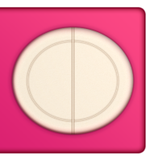

# osu!taiko 自定义皮肤

你可以通过在皮肤文件夹内创建一个名为 `taiko` 的文件夹来覆盖 osu!taiko 的游玩界面元素。如果使用这种方式，用户需要在[设置](/wiki/Client/Options)中明确启用（勾选 `在太鼓模式中使用太鼓皮肤` 选项），否则将使用默认的皮肤元素。

## Pippidon

`pippidonclear.png`

| 版本 | 可以使用动画？ | 可以在谱面中自定义？ | 混合模式 | 定位点 | 推荐标准大小 |
| :-: | :-: | :-: | :-: | :-: | :-: |
| 所有 | ![是][true]（见备注） | ![是][true] | 普通模式 | 底部左侧 | - |

备注：

- 动画文件名：`pippidonclear{n}.png`。
  - 最多只能自定义 7 帧（从 0 到 6）。
  - 如果使用动画，建议自定义全部 7 帧。（如果不全，最后一帧会按照下述帧序停留在缺失的帧上。）
  - 动画帧序为 `0 1 2 3 4 5 6 5 6 5 4 3 2 1 0`。
- 动画速率取决于 BPM。
- 此动画仅在玩家达成连击里程碑时播放一次；然后会回到待机或 Kiai 状态。

---

`pippidonfail.png`

| 版本 | 可以使用动画？ | 可以在谱面中自定义？ | 混合模式 | 定位点 | 推荐标准大小 |
| :-: | :-: | :-: | :-: | :-: | :-: |
| 所有 | ![是][true]（见备注） | ![是][true] | 普通模式 | 底部左侧 | - |

备注：

- 动画文件名：`pippidonfail{n}.png`。
- 动画速率取决于 BPM。
- 此动画在玩家漏掉物件或休息时段血量不足时播放。
- 如果在 [Kiai 时间](/wiki/Gameplay/Kiai_time)内玩家漏掉物件，此动画会覆盖 `pippidonkiai`。

---

`pippidonidle.png`

| 版本 | 可以使用动画？ | 可以在谱面中自定义？ | 混合模式 | 定位点 | 推荐标准大小 |
| :-: | :-: | :-: | :-: | :-: | :-: |
| 所有 | ![是][true]（见备注） | ![是][true] | 普通模式 | 底部左侧 | - |

备注：

- 动画文件名：`pippidonidle{n}.png`。
- 动画速率取决于 BPM。
- 此动画在无操作时播放（休息时段或等待玩家打击下一个物件）。

---

`pippidonkiai.png`

| 版本 | 可以使用动画？ | 可以在谱面中自定义？ | 混合模式 | 定位点 | 推荐标准大小 |
| :-: | :-: | :-: | :-: | :-: | :-: |
| 所有 | ![是][true]（见备注） | ![是][true] | 普通模式 | 底部左侧 | - |

备注：

- 动画文件名：`pippidonkiai{n}.png`。
- 动画速率取决于 BPM。
- 此动画在 [Kiai 时间](/wiki/Gameplay/Kiai_time)播放。
- 如果在 Kiai 时间内玩家漏掉物件，`pippidonfail.png` 会覆盖此动画。

## 打击反馈效果

`taiko-hit0.png`

| 版本 | 可以使用动画？ | 可以在谱面中自定义？ | 混合模式 | 定位点 | 推荐标准大小 |
| :-: | :-: | :-: | :-: | :-: | :-: |
| 所有 | ![是][true] | ![是][true] | 普通模式 | 中心 | - |

备注：

- 动画文件名：`taiko-hit0-{n}.png`。
- 如果使用动画，静态图像的默认效果不会被禁用。

---

`taiko-hit100.png`

| 版本 | 可以使用动画？ | 可以在谱面中自定义？ | 混合模式 | 定位点 | 推荐标准大小 |
| :-: | :-: | :-: | :-: | :-: | :-: |
| 所有 | ![是][true] | ![是][true] | 普通模式 | 中心 | - |

备注：

- 动画文件名：`taiko-hit100-{n}.png`。
- 如果使用动画，静态图像的默认效果不会被禁用。

---

`taiko-hit100k.png`

| 版本 | 可以使用动画？ | 可以在谱面中自定义？ | 混合模式 | 定位点 | 推荐标准大小 |
| :-: | :-: | :-: | :-: | :-: | :-: |
| 所有 | ![是][true] | ![是][true] | 普通模式 | 中心 | - |

备注：

- 动画文件名：`taiko-hit100k-{n}.png`。
- 如果使用动画，静态图像的默认效果不会被禁用。

---

`taiko-hit300.png`

| 版本 | 可以使用动画？ | 可以在谱面中自定义？ | 混合模式 | 定位点 | 推荐标准大小 |
| :-: | :-: | :-: | :-: | :-: | :-: |
| 所有 | ![是][true] | ![是][true] | 普通模式 | 中心 | - |

备注：

- 动画文件名：`taiko-hit300-{n}.png`。
- 如果使用动画，静态图像的默认效果不会被禁用。

---

`taiko-hit300k.png`

| 版本 | 可以使用动画？ | 可以在谱面中自定义？ | 混合模式 | 定位点 | 推荐标准大小 |
| :-: | :-: | :-: | :-: | :-: | :-: |
| 所有 | ![是][true] | ![是][true] | 普通模式 | 中心 | - |

备注：

- 动画文件名：`taiko-hit300k-{n}.png`。
- 如果使用动画，静态图像的默认效果不会被禁用。

---

`taiko-hit300g.png`

| 版本 | 可以使用动画？ | 可以在谱面中自定义？ | 混合模式 | 定位点 | 推荐标准大小 |
| :-: | :-: | :-: | :-: | :-: | :-: |
| 所有 | ![否][false]（见备注） | ![否][false] | 普通模式 | 中心 | - |

备注：

- 可制作成动画，但只会使用第 0 帧。
  - 动画文件名：`taiko-hit300g-{n}.png`
- 此图像仅在成绩结算界面使用（代替 `taiko-hit300k.png`）。

## 物件

`taikobigcircle.png`

| 版本 | 可以使用动画？ | 可以在谱面中自定义？ | 混合模式 | 定位点 | 推荐标准大小 |
| :-: | :-: | :-: | :-: | :-: | :-: |
| 所有 | ![否][false] | ![是][true] | 相乘模式 | 中心 | 118x118 |

备注：

- 此元素用于大音符 (finisher)。
  - 此元素会被自动放大。
- 此元素也用在打击位置上。
- “咚”使用红色(235,69,44)
- “咔”使用蓝色(68,141,171)
- 连打条的起始圈使用黄色(252,83,6)

---

`taikobigcircleoverlay.png`

| 版本 | 可以使用动画？ | 可以在谱面中自定义？ | 混合模式 | 定位点 | 推荐标准大小 |
| :-: | :-: | :-: | :-: | :-: | :-: |
| 所有 | ![是][true] | ![是][true] | 普通模式 | 中心 | 118x118 |

备注：

- 动画文件名：`taikobigcircleoverlay-{n}.png`。
  - 只有 2 帧（`0` 和 `1`）
  - 动画速度取决于 BPM
    - 连击数达到 50 时开始动画
    - 连击数达到 150 时加速
- 此元素会被自动放大。

---

`taikohitcircle.png`

| 版本 | 可以使用动画？ | 可以在谱面中自定义？ | 混合模式 | 定位点 | 推荐标准大小 |
| :-: | :-: | :-: | :-: | :-: | :-: |
| 所有 | ![否][false] | ![是][true] | 相乘模式 | 中心 | 118x118 |

备注：

- “咚”使用红色(235,69,44)
- “咔”使用蓝色(68,141,171)
- 连打条的起始圈使用黄色(252,83,6)

---

`taikohitcircleoverlay.png`

| 版本 | 可以使用动画？ | 可以在谱面中自定义？ | 混合模式 | 定位点 | 推荐标准大小 |
| :-: | :-: | :-: | :-: | :-: | :-: |
| 所有 | ![是][true] | ![是][true] | 普通模式 | 中心 | 118x118 |

备注：

- 动画文件名：`taikohitcircleoverlay-{n}.png`。
  - 只有 2 帧（`0` 和 `1`）
  - 动画速度取决于 BPM
    - 连击数达到 50 时开始动画
    - 连击数达到 150 时加速

---

`approachcircle.png`

| 版本 | 可以使用动画？ | 可以在谱面中自定义？ | 混合模式 | 定位点 | 推荐标准大小 |
| :-: | :-: | :-: | :-: | :-: | :-: |
| 所有 | ![否][false] | ![是][true] | 普通模式 | 中心 | 126x126 |

备注：

- 此元素作为边框用在打击位置上。
- 此元素也用在 [osu!](/wiki/Game_mode/osu!) 中。

---

`taiko-glow.png`

| 版本 | 可以使用动画？ | 可以在谱面中自定义？ | 混合模式 | 定位点 | 推荐标准大小 |
| :-: | :-: | :-: | :-: | :-: | :-: |
| 所有 | ![否][false] | ![否][false]（见备注） | 相乘模式 | 中心 | - |

备注：

- 可在谱面中自定义的状态疑似是 Bug。
- 颜色为黄色。
- 在 [Kiai 时间](/wiki/Gameplay/Kiai_time)中，此元素位于打击位置背后，打击物件时会放大。

---

`lighting.png`

| 版本 | 可以使用动画？ | 可以在谱面中自定义？ | 混合模式 | 定位点 | 推荐标准大小 |
| :-: | :-: | :-: | :-: | :-: | :-: |
| 所有 | ![否][false] | ![是][true] | 相加模式 | 中心 | - |

备注：

- 颜色为橙红色。
- 不需要为 osu!taiko 自定义此元素。
  - 此元素仅在使用透明太鼓条时可见。
- 在 [Kiai 时间](/wiki/Gameplay/Kiai_time)中，此元素会在打击位置的滚动条后方跳动。

## 游玩界面（上半部分）

`taiko-slider.png`

| 版本 | 可以使用动画？ | 可以在谱面中自定义？ | 混合模式 | 定位点 | 推荐标准大小 |
| :-: | :-: | :-: | :-: | :-: | :-: |
| 所有 | ![否][false] | ![是][true]（见备注） | 普通模式 | 顶部左侧 | 776x162 |

备注：

- 可在谱面中自定义的状态疑似是 Bug。
- 此元素会从右侧向左无缝循环滚动。
- 如果谱面有故事板，则此元素会被禁用。
- 游戏中会被放大 1.4 倍。

---

`taiko-slider-fail.png`

| 版本 | 可以使用动画？ | 可以在谱面中自定义？ | 混合模式 | 定位点 | 推荐标准大小 |
| :-: | :-: | :-: | :-: | :-: | :-: |
| 所有 | ![否][false] | ![否][false] | 普通模式 | 顶部左侧 | 776x162 |

备注：

- 当玩家漏掉物件或休息时段血量未满 50% 时显示。
- 可在谱面中自定义的状态疑似是 Bug。
- 此元素会从右侧向左无缝循环滚动。
- 如果谱面有故事板，则此元素会被禁用。
- 游戏中会被放大 1.4 倍。

---

`taiko-flower-group.png`

| 版本 | 可以使用动画？ | 可以在谱面中自定义？ | 混合模式 | 定位点 | 推荐标准大小 |
| :-: | :-: | :-: | :-: | :-: | :-: |
| 所有 | ![否][false]（见备注） | ![是][true] | 普通模式 | 底部 | - |

备注：

- 类似于连击提示图。
- 若要使用多个此类图像，使用：`taiko-flower-group-{n}.png`。
  - 当达成连击里程碑时，会显示其中一个图像。
- 当 Pippidon 变为 Clear 状态时，此图像会从 Pippidon 身后放大并渐显。

## 游玩界面（下半部分）

`taiko-bar-left.png`

| 版本 | 可以使用动画？ | 可以在谱面中自定义？ | 混合模式 | 定位点 | 推荐标准大小 |
| :-: | :-: | :-: | :-: | :-: | :-: |
| 所有 | ![否][false] | ![否][false]（见备注） | 普通模式 | 顶部左侧 | 181x200 |

备注：

- 可在谱面中自定义的状态疑似是 Bug。
- 位于 (0,216)。
- 此元素即是太鼓所在的位置。

---

`taiko-drum-inner.png`

| 版本 | 可以使用动画？ | 可以在谱面中自定义？ | 混合模式 | 定位点 | 推荐标准大小 |
| :-: | :-: | :-: | :-: | :-: | :-: |
| v1 - v2.0 | ![否][false] | ![否][false]（见备注） | 普通模式 | 顶部左侧 | 最大宽度：56px |
| v2.1+ | ![否][false] | ![否][false]（见备注） | 普通模式 | 顶部左侧 | 90x200 |

备注：

- 可在谱面中自定义的状态疑似是 Bug。
- 位置因皮肤版本而异：
  - v1–v2.0：(29,266)（镜像时位于 (86,266)）
  - v2.1+：(0,216)（镜像时位于 (90,216)）

---

`taiko-drum-outer.png`

| 版本 | 可以使用动画？ | 可以在谱面中自定义？ | 混合模式 | 定位点 | 推荐标准大小 |
| :-: | :-: | :-: | :-: | :-: | :-: |
| v1 - v2.0 | ![否][false] | ![否][false]（见备注） | 普通模式 | 顶部左侧 | 最大宽度：72px |
| v2.1+ | ![否][false] | ![否][false]（见备注） | 普通模式 | 顶部左侧 | 90x200 |

备注：

- 可在谱面中自定义的状态疑似是 Bug。
- 位置因皮肤版本而异：
  - v1–v2.0：(85,253)（镜像时位于 (13,253)）
  - v2.1+：(90,216)（镜像时位于 (0,216)）

---

`taiko-bar-right.png`

| 版本 | 可以使用动画？ | 可以在谱面中自定义？ | 混合模式 | 定位点 | 推荐标准大小 |
| :-: | :-: | :-: | :-: | :-: | :-: |
| v1.0 - v2.0 | ![否][false] | ![否][false]（见备注） | 普通模式 | 顶部左侧 | 843x200 |
| v2.1+ | ![否][false] | ![否][false]（见备注） | 普通模式 | 顶部左侧 | 1024x200 |

备注：

- 可在谱面中自定义的状态疑似是 Bug。
- 此元素会被拉伸以适应屏幕宽度。
- 此元素是滚动条的普通状态。
- 位置因皮肤版本而异：
  - v1.0–v2.0：(181,216)
  - v2.1+：(0,216)

---

`taiko-bar-right-glow.png`

| 版本 | 可以使用动画？ | 可以在谱面中自定义？ | 混合模式 | 定位点 | 推荐标准大小 |
| :-: | :-: | :-: | :-: | :-: | :-: |
| v1.0 - v2.0 | ![否][false] | ![否][false]（见备注） | 普通模式 | 顶部左侧 | 843x200 |
| v2.1+ | ![否][false] | ![否][false]（见备注） | 普通模式 | 顶部左侧 | 1024x200 |

备注：

- 可在谱面中自定义的状态疑似是 Bug。
- 此元素会被拉伸以适应屏幕宽度。
- 此元素是滚动条的 Kiai 状态。
- 此元素会覆盖在 `taiko-bar-right` 上方。
- 位置因皮肤版本而异：
  - v1.0–v2.0：(181,216)
  - v2.1+：(0,216)

<!-- don't want this to appear in the sidebar -clayton -->

<!-- lint ignore heading-increment -->

#### `taiko-barline.png`

::: Infobox

|  |  |
| :-- | :-- |
| 版本 | 所有 |
| 可以使用动画？ | ![否][false] |
| 可以在谱面中自定义？ | ![否][false] |
| 混合模式 | 普通模式 |
| 定位点 | 中心 |
| 推荐标准大小 | 4x175 |

:::

此图像在游戏中每个[小节](/wiki/Music_theory/Measure)开始时显示在游玩界面（除非被[非继承时间点（红线）](/wiki/Client/Beatmap_editor/Timing#非继承时间点（红线）)省略）。

## 连打条

`taiko-roll-middle.png`

| 版本 | 可以使用动画？ | 可以在谱面中自定义？ | 混合模式 | 定位点 | 推荐标准大小 |
| :-: | :-: | :-: | :-: | :-: | :-: |
| 所有 | ![否][false] | ![是][true] | 相乘模式 | 顶部左侧 | 1x128 |

备注：

- 标准图像的宽度必须恰好为 1px。
- 此元素是连打条的长条轨道，`sliderscorepoint.png` 会放置在上面。
- 其颜色会从黄色渐变为红色。

---

`taiko-roll-end.png`

| 版本 | 可以使用动画？ | 可以在谱面中自定义？ | 混合模式 | 定位点 | 推荐标准大小 |
| :-: | :-: | :-: | :-: | :-: | :-: |
| 所有 | ![否][false] | ![是][true] | 相乘模式 | 顶部左侧 | 64x128 |

备注：

- 此元素是连打条的尾部。
- 其颜色会从黄色渐变为红色。

---

`sliderscorepoint.png`

| 版本 | 可以使用动画？ | 可以在谱面中自定义？ | 混合模式 | 定位点 | 推荐标准大小 |
| :-: | :-: | :-: | :-: | :-: | :-: |
| 所有 | ![否][false] | ![是][true] | 普通模式 | 中心 | - |

备注：

- 此元素也用在 [osu!](/wiki/Game_mode/osu!) 中。
- 这些是连打条中的点。

## 摇铃

`spinner-warning.png`

| 版本 | 可以使用动画？ | 可以在谱面中自定义？ | 混合模式 | 定位点 | 推荐标准大小 |
| :-: | :-: | :-: | :-: | :-: | :-: |
| 所有 | ![否][false] | ![是][true] | 普通模式 | 中心 | - |

备注：

- 此元素是转盘的提示。

---

`spinner-circle.png`

| 版本 | 可以使用动画？ | 可以在谱面中自定义？ | 混合模式 | 定位点 | 推荐标准大小 |
| :-: | :-: | :-: | :-: | :-: | :-: |
| 所有 | ![否][false] | ![否][false]（见备注） | 普通模式 | 中心 | - |

备注：

- 可在谱面中自定义的状态疑似是 Bug。
- 此元素也用在 [osu!](/wiki/Game_mode/osu!) 中。
- 转盘中每打击一次，此圆圈会逆时针旋转一次。

---

`spinner-approachcircle.png`

| 版本 | 可以使用动画？ | 可以在谱面中自定义？ | 混合模式 | 定位点 | 推荐标准大小 |
| :-: | :-: | :-: | :-: | :-: | :-: |
| 所有 | ![否][false] | ![否][false]（见备注） | 普通模式 | 中心 | - |

备注：

- 可在谱面中自定义的状态疑似是 Bug。
- 此元素也用在 [osu!](/wiki/Game_mode/osu!) 中。
- 此元素是转盘的持续时间指示器。
  - 此元素随时间缩小。

[true]: /wiki/shared/true.png
[false]: /wiki/shared/false.png
