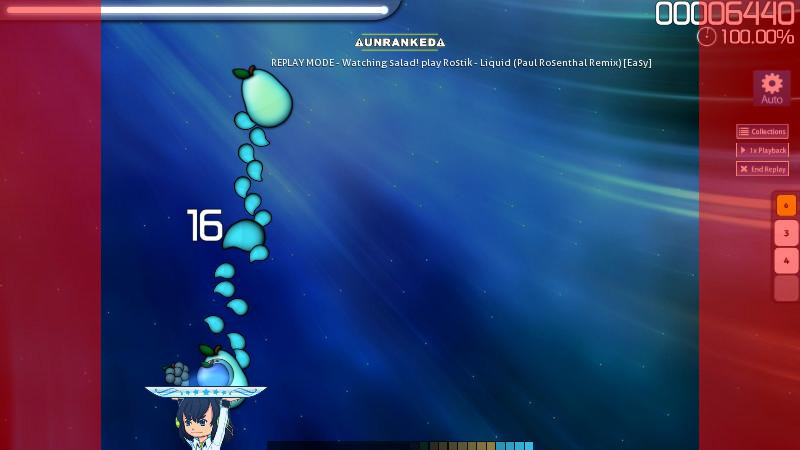
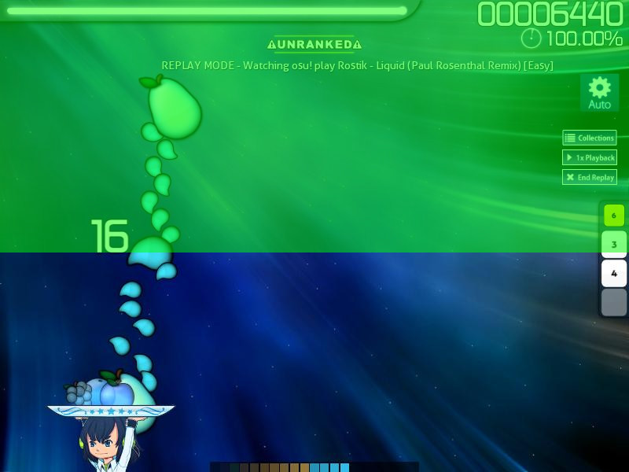

# osu!catch skinning tutorial

## Skinning elements

*See also: [Skinning/osu!catch](/wiki/Skinning/osu!catch)*

### Fruits

There are four fruits and four fruit overlays. These fruits resemble the hit, sliderstart, and sliderend circles in osu!catch. The fruits are tinted with the combo colour; however, unlike osu!standard (where each comboset uses the same combo colour) the individual fruits cycle through the combo colours (but slider trail, ticks, and end will use the same colour as its start fruit). Lastly, they appear in this order: pear, grapes, apple, orange, and repeat.

Fruits and their overlays are the same size as a hitcircle, 128x128 (SD size) with their origin point being the centre. Most skinners would make all of the fruits the same and it is common to use simple shapes.

Fruit overlays do not get tinted but should not be used in place of the fruit itself! This is because the hyperdash outlines are rendered based on the fruit itself, not the fruit's overlay. To combat this, you would need to include a shape of some kind for osu! to render the hyperdash outlines properly.

#### Juice streams

Juice streams are the equivalent of the osu!standard sliders. A drop is bigger in comparision to a droplet, but **they both use the same element** (thus, droplets are downscaled to be smaller). They have a size of 128x128 with their origin point being the centre. Drops (and droplets) do have an overlay but it is transparent by default.

#### Bananas

Bananas are separate from the fruits; despite being a fruit, they are used in place of osu!standard spinners. Bananas and its overlay has a size of 128x128 with its origin point being the centre. These will always be tinted in shades of yellow and orange.

### Shared elements

The following elements are shared with other parts of osu!:

-   scorebar and all its files
-   score numbers
-   combo numbers
-   inputoverlay-background and -key
-   hit bursts from osu!standard for the ranking panel

## Playfield design

There are two things to take into account when you design the playfield elements: the margins and the area of focus.

### Margins

Since the playfield is always 4:3, it possible to place an image on the left and right margins of the screen without covering the playfield. The combo numbers are placed in the middle of the screen, above the catcher. This means that the player will always see them and that you could take this into account when designing them.

---

")

In 4:3, there are no margins. Thus there is really no where else to place an image anywhere without having to go inside the playfield.

---

In 16:9 and 21:9, there should be enough room to place an image inside the margins (in red) on either side, but 16:10 might not.

### Area of focus

Avoid making a big scorebar that covers most of the top of the playfield. Remember that the fruits fall down from the top of the screen and it could shorten the field of view drastically if the scorebar is too big. Most players are looking from the combo number and above to position the catcher, if their view is blocked, it may deter them from using your skin.

## Catcher

The catcher is basically the cursor of osu!catch. There are three states: idle, kiai, and fail. Idle will be used during normal gameplay, kiai will be used in the kiai time, and fail will be used when you miss a note (which will override idle and kiai). When hyperdashing, these will leave a few after images behind that will expand.

These have a minimum width of 302px and the first 16 horizontal lines from the top of them should be empty (the hitbox is 16 horizontal lines from the top of these images). Catchers normally are pictured holding some kind of plate on top of their heads. The fruits, when caught, will go through the catcher until their hitboxes are hit and stay there until the comboset is completed. If the plate is too thin, it will appear as if it is clipping through the plate. Thus, many skinners design their catchers in a way to make sure this doesn't happen (usually by making the plate a little taller).

## Skin configuration

*See also: [skin.ini](/wiki/skin.ini)*

osu!catch has three unique skin configuration commands:

- `HyperDash` - defines the hyperdash colour of the catcher itself. This is used on the very first after image right after obtaining the hyperdash fruit. `255,0,0` (red) is used by default.
- `HyperDashFruit` - defines the hyperdash border on the fruit itself. `HyperDash` colour is used if not defined.
- `HyperDashAfterImage` - defines the tint colour of the after images from the catcher. `HyperDash` colour is used if not defined.

Make sure the `HyperDash` colour stands out!

### Shared commands

osu!catch shares these skin configuration commands with other modes:

- `Combo1`
- `Combo2`
- `Combo3`
- `Combo4`
- `Combo5`
- `Combo6`
- `Combo7`
- `Combo8`
- `InputOverlayText`
- `ScorePrefix`
- `ScoreOverlap`
- `ComboPrefix`
- `ComboOverlap`
