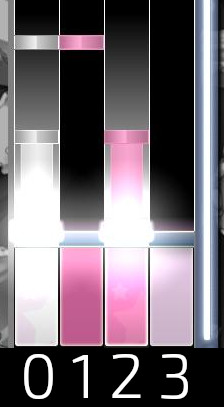
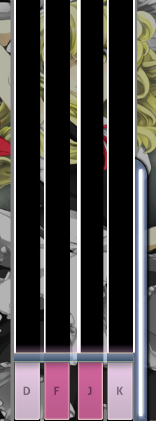
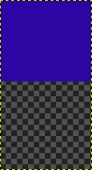
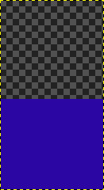

# osu!mania skinning tutorial

This tutorial uses [skin version](/wiki/skin.ini#versions) `2.5`. Since the skin configuration heavily affects osu!mania skinning, this tutorial will discuss both cases: using the default values (henceforth referred to as "basic") and modifying the skin configuration (henceforth referred to as "advanced").

## Skin configuration

*See also: [skin.ini](/wiki/skin.ini)*

When editing the skin configuration file, keep the following in mind:

- The skin version should be set to `2.5`.
- Positioning height-wise is based on a max-height of 480 pixels; the value used will be scaled across all game clients so it should be consistent for all players.
- Columns are identified with index 0 from left to right. Meaning that the first column from the left is 0, the second is 1, the third is 2, etc. (See image below.)
  - Keys, notes, and hold notes use the same column numbers they are part of to identify themselves. Meaning that keys, notes, and hold notes inside column 2 will also use 2.



- Each key count that is skinned must have its own section in the skin configuration.
- When defining an image's location and/or name, copy the path from the your skin's folder (not from `Skins/`, but the folder name after that) and remove the file's extension.
- If the stage is upside-down, you are given the option to tell osu! to flip keys and/or notes vertically.

---

The sections below are only affected when making changes to the skin configuration. Thus, basic sections will talk about default behaviours while advanced sections will talk about changing it.

### Columns (basic)

*Not to be confused with: [Stage (basic)](#stage-(basic))*

The number of columns the player will see is dependent on how osu! converts a beatmap, if the player has an xK mod enabled, or if the beatmap creator specified the number of keys (for osu!mania-specific beatmaps).

By default, the columns start from 136 units from the left, but ends if it reaches 19 units from the right. The line that is drawn in between each column will be white and have a width of 2 units. Each column is 30 units wide and does not have any spacing in between.

### Columns (advanced)

*Not to be confused with: [Stage (advanced)](#stage-(advanced))*

To adjust where the stage begins (from the left side), use `ColumnStart`. There is no minimum or maximum limit for this, so you technically can set it to whatever number you want; that is, if it doesn't go beyond the `ColumnRight` value.

`ColumnRight` limits `ColumnStart` to ensure that the stage is still visible (from the right side). This is useful if you want the stage to be as far right as possible for any screen resolution. However, the math done for this value is based from the left side of the stage; this means that you will need to add the widths of and spacings in between each column to ensure that the entire stage is drawn on the playfield. Similar to `ColumnStart`, there is no minimum or maximum limit; however, `ColumnRight` takes precedence over `ColumnStart`. This means that if `ColumnRight` is big enough, it can draw the stage too far into the left side of the screen.

---

To adjust how far apart each column is from one another, use `ColumnSpacing`. You will need to enter a number for the space between each column; otherwise, it will default to `0`. Since this is for the spacing in between each column, you only need to define one less than the key count (i.e. 4K has 3 gaps between each column, so 3 values are needed).

---

*Notice: Column lines are drawn on the left side of the inside of each column (except for the last column, which has both drawn on both sides of the inside of the last column).*

To adjust the column line width, use `ColumnLineWidth`. This will change the column's left line width (except for the last value, which will change the last column's right line width). A value for each line is needed; otherwise, it will default to `2`. Since this changes the line widths in between each column and on the outsides, you only need to define one more than the key count (i.e. 4K has 2 outline lines and 3 inside lines, so 5 values are needed).

*Note: Notes are drawn on top of column lines, if they happen to overlap.*

Using column lines and column spacing together may make your columns look weird (see image below). If using `ColumnSpacing`, it is suggested to set `ColumnLineWidth` to `0` to hide them.



---

To change the colours of the column lines, set `ColourColumnLine` to an RGB(a) value. This will change all of the column lines to that colour.

To adjust the column's width, use `ColumnWidth`. You will need to enter a number for each column; otherwise, it will use `30`.

#### Example

Your skin configuration:

```ini
[Mania]
Keys: 5

ColumnStart: 99999
ColumnRight: 350 // 150 units of padding
ColumnSpacing: 4,8,8,4
ColumnLineWidth: 4,3,6,6,3,4
ColumnWidth: 32,32,48,32,32
```

- `ColumnStart` says to push the stage 99999 units from the left side.
- `ColumnRight` says to stop pushing the stage at 350 units from the right side, if it ever reaches it, then start drawing the stage. `ColumnRight = sum of ColumnWidth + sum of ColumnSpacing + extra right padding` (You should give some extra padding to show the health bar and to not have other elements drawn on top of the stage.)
- `ColumnSpacing` says that the space between columns 0 and 1 will be 4 units apart, columns 1 and 2 will be 8 units apart, columns 1 and 2 will be 8 units apart, etc.
- `ColumnLineWidth` says that column 0's left line width is 4 units while it's right line width is 3 units. Column 1's left line width shares column 0's right line width and will use 3 units while it's right line width is 6 units. This continues for columns 2, 3, and 4. However, column 4's right line with will be 4 units.
- `ColumnWidth` says that columns 0, 1, 3, and 4 will have a width of 32 units while column 2 will have a column with of 48 units.

### Barline (basic)

By default the barline has a height of `1.2` and is white. This line is always drawn at every whole measure.

### Barline (advanced)

To remove the barline, set `BarlineHeight` to `0`. There is not a max-height for this value, so you can set it to whatever number you want it to be. The notes are drawn on top of this line, if they overlap.

To change the barline colour, set `ColourBarline` to an RGB(a) value.

## Skinning elements

*See also: [Skinning/osu!mania](/wiki/Skinning/osu!mania)*

### Keys (basic)

*Not to be confused with: [Notes](#notes-(basic))*

The keys have two states: idle and pressed. There are three variants of this element; totaling 6 images, two for each variant. When a key changes states, their images replace one another.

By default, there are only three images that are used:

- `mania-key1.png` (referred next as "1")
- `mania-key2.png` (referred next as "2")
- `mania-keyS.png` (referred next as "S")

The positioning of 1 and 2 depends on the key count and if the special style (explained below) is being used. S is used when the key count is odd (placed in the middle) or when a special style is used.

A special style can be used for even key counts that is greater than 5. The positioning of S can be set with the `SpecialStyle` command, but the player can overwrite this using the [Options](/wiki/Options).

### Keys (advanced)

With the skin configuration file, setting an image for individual keys is possible (per key count). See example below.

#### Example

Your skin folder:

```
Skins/
+-- My Skin/
|   +-- mania/
|   |   +-- keyC.png
|   |   +-- keyCD.png
|   |   +-- keyD.png
|   |   +-- keyDD.png
|   |   +-- keyL.png
|   |   +-- keyLD.png
|   |   +-- keyU.png
|   |   +-- keyUD.png
|   |   +-- keyR.png
|   |   +-- keyRD.png
|   +-- skin.ini
```

Your skin configuration:

```ini
[Mania]
Keys: 5

KeyImage0: mania/keyL
KeyImage0D: mania/keyLD

KeyImage1: mania/keyD
KeyImage1D: mania/keyDD

KeyImage2: mania/keyC
KeyImage2D: mania/keyCD

KeyImage3: mania/keyU
KeyImage3D: mania/keyUD

KeyImage4: mania/keyR
KeyImage4D: mania/keyRD
```

To break that down, let's look at the first column, `KeyImage0`:

```
KeyImage0: mania/keyL
KeyImage0D: mania/keyLD
```

- `KeyImage0` says that the first column's key image (idle state) is located in a folder called `mania/` and the image name is `keyL`.
- `KeyImage0D` says that the first column's key image (pressed state) is located in a folder called `mania/` and the image name is `keyLD`.
- This similarly applies to the other columns, but only when playing with 5 keys.

### Notes (basic)

*Not to be confused with: [Keys](#keys-(basic))*

Notes queue the player on when to press the correct key. Like the keys, there are only three images that are used:

- `mania-note1.png` (referred next as "1")
- `mania-note2.png` (referred next as "2")
- `mania-noteS.png` (referred next as "S")

1, 2, and S are used based on their respective columns.

You can animate these by adding `-n` to the file name, where `n` is the frame number starting from 0. The animation plays at a constant rate, if you need to slow it down, you will need to double or triple the frames

### Notes (advanced)

With the skin configuration file, specifying an image for each note in a column is possible. See example below.

#### Example

Your skin folder:

```
Skins/
+-- My Skin/
|   +-- mania/
|   |   +-- left/
|   |   |   +-- note-0.png
|   |   |   +-- note-1.png
|   |   |   +-- note-2.png
|   |   |   +-- note-3.png
|   |   +-- down/
|   |   |   +-- note-0.png
|   |   |   +-- note-1.png
|   |   |   +-- note-2.png
|   |   |   +-- note-3.png
|   |   +-- middle/
|   |   |   +-- note-0.png
|   |   |   +-- note-1.png
|   |   |   +-- note-2.png
|   |   |   +-- note-3.png
|   |   +-- up/
|   |   |   +-- note-0.png
|   |   |   +-- note-1.png
|   |   |   +-- note-2.png
|   |   |   +-- note-3.png
|   |   +-- right/
|   |   |   +-- note-0.png
|   |   |   +-- note-1.png
|   |   |   +-- note-2.png
|   |   |   +-- note-3.png
|   +-- skin.ini
```

Your skin configuration:

```ini
[Mania]
Keys: 5

NoteImage0: mania/left/note
NoteImage1: mania/down/note
NoteImage2: mania/middle/note
NoteImage3: mania/up/note
NoteImage4: mania/down/note
```

To break that down, let's look at the first column, `NoteImage0`:

```
NoteImage0: mania/left/note
```

- `NoteImage0` says that the first column's note image is located in a folder called `mania/left/` and the image prefix name is `note`.
- Since notes can be animated, the game client will check to see if an animation was supplied.
- This similarly applies to the other columns, but only when playing with 5 keys.

### Hold notes (basic)

Hold notes have three parts: a head, length, and tail. The head queues the player on when to press and hold the hold note, while the tail queues the player on when to release it (since releasing hold notes is also important in regards to scoring). By default, there are only nine images that are used:

- `mania-note1H.png` (referred next as "1H")
- `mania-note1L.png` (referred next as "1L")
- `mania-note1T.png` (referred next as "1T")
- `mania-note2H.png` (referred next as "2H")
- `mania-note2L.png` (referred next as "2L")
- `mania-note2T.png` (referred next as "2T")
- `mania-noteSH.png` (referred next as "ST")
- `mania-noteSL.png` (referred next as "SL")
- `mania-noteST.png` (referred next as "SH")

Like notes, 1H, 1L, 1T, 2H, 2L, 2T, ST, SL, and SH are used based on their respective columns.

You can animate these by adding `-n` to the file name, where `n` is the frame number starting from 0.

### Hold notes (advanced)

Like the notes, using the skin configuration file can allow you to specify what image each hold note will look like (per key count). See example below.

#### Example

Your skin folder:

```
Skins/
+-- My Skin/
|   +-- mania/
|   |   +-- hold/
|   |   |   +-- left/
|   |   |   |   +-- long-0.png
|   |   |   |   +-- long-1.png
|   |   |   |   +-- note-0.png
|   |   |   |   +-- note-1.png
|   |   |   |   +-- note-2.png
|   |   |   |   +-- note-3.png
|   |   |   +-- down/
|   |   |   |   +-- head-0.png
|   |   |   |   +-- head-1.png
|   |   |   |   +-- head-2.png
|   |   |   |   +-- head-3.png
|   |   |   |   +-- long-0.png
|   |   |   |   +-- long-1.png
|   |   |   |   +-- tail-0.png
|   |   |   |   +-- tail-1.png
|   |   |   |   +-- tail-2.png
|   |   |   |   +-- tail-3.png
|   |   |   +-- middle/
|   |   |   |   +-- long-0.png
|   |   |   |   +-- long-1.png
|   |   |   |   +-- note-0.png
|   |   |   |   +-- note-1.png
|   |   |   |   +-- note-2.png
|   |   |   |   +-- note-3.png
|   |   |   +-- up/
|   |   |   |   +-- head-0.png
|   |   |   |   +-- head-1.png
|   |   |   |   +-- head-2.png
|   |   |   |   +-- head-3.png
|   |   |   |   +-- long-0.png
|   |   |   |   +-- long-1.png
|   |   |   |   +-- tail-0.png
|   |   |   |   +-- tail-1.png
|   |   |   |   +-- tail-2.png
|   |   |   |   +-- tail-3.png
|   |   |   +-- right/
|   |   |   |   +-- long-0.png
|   |   |   |   +-- long-1.png
|   |   |   |   +-- note-0.png
|   |   |   |   +-- note-1.png
|   |   |   |   +-- note-2.png
|   |   |   |   +-- note-3.png
|   +-- skin.ini
```

Your skin configuration:

```ini
[Mania]
Keys: 5

NoteImage0H: mania/hold/left/note
NoteImage0L: mania/hold/left/long
NoteImage0T: mania/hold/left/note

NoteImage1H: mania/hold/down/head
NoteImage1L: mania/hold/down/long
NoteImage1T: mania/hold/down/tail

NoteImage2H: mania/hold/middle/note
NoteImage2L: mania/hold/middle/long
NoteImage2T: mania/hold/middle/note

NoteImage3H: mania/hold/up/head
NoteImage3L: mania/hold/up/long
NoteImage3T: mania/hold/up/tail

NoteImage4H: mania/hold/right/note
NoteImage4L: mania/hold/right/long
NoteImage4T: mania/hold/right/note
```

To break that down, let's look at the second column, `NoteImage1H`, `NoteImage1L`, and `NoteImage1T`:

```
NoteImage1H: mania/hold/down/head
NoteImage1L: mania/hold/down/long
NoteImage1T: mania/hold/down/tail
```

- `NoteImage1H` says that the first column's note image is located in a folder called `mania/hold/down/` and the image prefix name is `head`.
- `NoteImage1L` says that the first column's note image is located in a folder called `mania/hold/down/` and the image prefix name is `long`.
- `NoteImage1T` says that the first column's note image is located in a folder called `mania/hold/down/` and the image prefix name is `tail`.
- Since hold notes can be animated, the game client will check to see if an animation was supplied.
- This similarly applies to the other columns, but only when playing with 5 keys.

### Stage (basic)

*Not to be confused with: [Columns (basic)](#columns-(basic))*

The stage is drawn 136 units from the left side of the screen. By default, there are only six images that are used:

- `mania-warningarrow.png`
- `mania-stage-hint.png`
- `mania-stage-light.png`
- `mania-stage-bottom.png`
- `mania-stage-left.png`
- `mania-stage-right.png`

---

`mania-warningarrow.png` is displayed three times during the first three full bars (measures) before the gameplay begins. However, the player may only see one or two of these (or the bottom portion of the last arrow) if there isn't enough time. This is transparent by default, but can be skinned into looking like an arrow. Unlike certain elements that should be facing towards the right, this arrow should be pointing downwards (regardless if the stage is upside-down). It is centred horizontally in the stage and will appear on both stages if playing with two.

`mania-stage-hint.png` is a graphical representation of the judgement line. It is stretched to go across the entire stage, not repeated for each column.

`mania-stage-left.png` and `mania-stage-right.png` is the left and right sides of the stage respectively. These will stretch to match the stage height.

`mania-stage-bottom.png` is somewhat similar to `mania-stage-left.png` and `mania-stage-right.png` but covers the stage (including the keys, notes, and hold notes). This means that it can be used to cover up most of the stage for players who prefer playing with less viewing area. This element does not stretch to fit with the stage, thus it may be ideal to use the skin configuration to set this per key count.

`mania-stage-light.png` is displayed for each column's pressed key and will persist until the key is released.

### Stage (advanced)

*Not to be confused with: [Columns (advanced)](#columns-(advanced))*

With the skin configuration, you can specify where each stage element is located per key count. See example below.

You may want to use this in cases where differently sized stages (from differing key counts) may cause basic skinning issues. For example, you have differently sized `mania-stage-bottom.png` elements for each key count (since it does not stretch to fit).

#### Example

Your skin folder:

```
Skins/
+-- My Skin/
|   +-- mania/
|   |   +-- 4K/
|   |   |   +-- arrow.png
|   |   |   +-- bottom.png
|   |   |   +-- hint.png
|   |   |   +-- left.png
|   |   |   +-- light.png
|   |   |   +-- right.png
|   +-- skin.ini
```

Your skin configuration:

```ini
[Mania]
Keys: 4

StageBottom: mania/4K/bottom
StageHint: mania/4K/hint
StageLeft: mania/4K/left
StageLight: mania/4K/light
StageRight: mania/4K/right
WarningArrow: mania/4K/arrow
```

To break that down, let's look at the stage bottom element, `StageBottom`:

```
StageBottom: mania/4K/bottom
```

- `StageBottom` says that the first stage bottom image is located in a folder called `mania/4K/` and the image prefix name is `bottom`.
- This similarly applies to the other elements, but only when playing with 4 keys.

### Hit scores (basic)

Hit scores are drawn 325 units from the bottom, but are always centered horizontally against the stage. osu!mania uses different hit scores elements than the other game modes: `mania-hit0`, `mania-hit50`, `mania-hit100`, `mania-hit200`, `mania-hit300`, and `mania-hit300g`. These elements will also be used on the ranking screen.


### Hit scores (advanced)

With the skin configuration, you can specify where each stage element is located per key count. See example below.

*Notice: The ranking screen will use hit scores from the root skin folder, not the ones defined in the skin configuration.*

#### Example

Your skin folder:

```
Skins/
+-- My Skin/
|   +-- mania/
|   |   +-- 4K/
|   |   |   +-- hit0-0.png
|   |   |   +-- hit0-1.png
|   |   |   +-- hit0-2.png
|   |   |   +-- hit50-0.png
|   |   |   +-- hit50-1.png
|   |   |   +-- hit50-2.png
|   |   |   +-- hit100-0.png
|   |   |   +-- hit100-1.png
|   |   |   +-- hit100-2.png
|   |   |   +-- hit200-0.png
|   |   |   +-- hit200-1.png
|   |   |   +-- hit200-2.png
|   |   |   +-- hit300-0.png
|   |   |   +-- hit300-1.png
|   |   |   +-- hit300-2.png
|   |   |   +-- hit300g-0.png
|   |   |   +-- hit300g-1.png
|   |   |   +-- hit300g-2.png
|   +-- skin.ini
```

Your skin configuration:

```ini
[Mania]
Keys: 4

Hit0: mania/4K/hit0
Hit50: mania/4K/hit50
Hit100: mania/4K/hit100
Hit200: mania/4K/hit200
Hit300: mania/4K/hit300
Hit300g: mania/4K/hit300g
```

To break that down, let's look at the miss hit score element, `Hit0`:

```
Hit0: mania/4K/hit0
```

- `Hit0` says to use the image located in `mania/4K/` and the image prefix name is `hit0`. Since the provided skinning elements has animation frames, osu! will display it as such.
- This similarly applies to the other elements, but only when playing with 4 keys.
- On the ranking screen, the default hit scores will be used.

### Comboburst (basic)

osu!mania combobursts should be facing towards the right, similar to osu!standard and osu!catch. However, these images are not placed along the bottom adjacent corners of the screen. Thus, osu!mania combobursts should be complete images and not be cropped. All osu!mania combobursts will be displayed on the right side of the stage.

### Comboburst (advanced)

Using `ComboBurstStyle`, you can set which side of the stage the osu!mania combobursts should be displayed on. These should still be facing towards the right, similar to osu!standard and osu!catch combobursts, as osu! will flip these horizontally when appearing on the left side of the stage.

### Mod icons

osu!mania has a few specific mod icons that you can skin:

- Fade In
- 1K, 2K, 3K, 4K, 5K, 6K, 7K, 8K, and 9K
- Co-Op
- Random

On a side note, there was a mod called Fade Out which replaced the Hidden mod icon when osu!mania was the set game mode, but this was removed from the game. You could skin the hidden mod icon to make it appear as Fade Out, but this may look weird when playing in other game modes.

### Shared elements

The following elements are used with other parts of osu!:

- scorebar and all its files
- combo numbers
- score numbers
- mod icons, except the mode-specific mods

## Playfield design

### Combo numbers

By default, combo numbers are centred horizontally in the stage. The vertical positioning can be changed by setting `ComboPosition`.

If there are two stages, the combo number will be displayed on both stages (this cannot be changed).

### Hit scores

Like combo numbers, hit scores are centred horizontally in the stage. The vertical positioning can be changed by setting `ScorePosition`.

By default, if there are two stages, the hit scores from each stage will be displayed on the both stages. To change this behaviour (have hit scores display on the stage the note was hit on), set `SeparateScore` to `1`.

### Centring the stage

*Notice: Centring of the stage will be inconsistent between differing ratio aspects. You may want to provide extra download links for other common ratio aspects.*

To centre the osu!mania stage, use the following equation to set `ColumnStart`.

`ColumnStart = ((480 * screenWidth / screenHeight) - (columnWidths + ColumnSpacings)) / 2`.

- `screenWidth` = the game client's width (or the ratio aspect width)
- `screenHeight` = the game client's height (or the ratio aspect height)
- `columnWidths` = sum of `ColumnWidth`
- `ColumnSpacings` = sum of `ColumnSpacing`

*Notice: You will need to round the number to make it an integer. Because of this, the stage may be off by a unit to the left or right. In most cases, this will not be very noticeable.*

### Adding a lane cover

A lane cover is an element that covers part of the stage, primarily to limit viewing area. This can be used in place of the Hidden mod, which is commonly used for this purpose but has the drawback of moving up or down while playing.

If you want to add a lane cover to only one key count, use the `mania-stage-bottom` element. If you want to do this for multiple key counts, you will need to make multiple lane covers and set `StageBottom` in the skin configuration for each key count.

---

In your prefered image editor, create a new transparent image with the height set to 480 pixels and the width set to the sum of the `ColumnWidth` and `ColumnSpacing`. If your skin has the stage scroll down, fill the upper half with an image and/or a color. If your skin has the stage scroll up, fill the lower half with an image and/or a color. Once this is done, save it in your skin folder and test it out.

|  |  |
| :-- | :-- |
| For scroll down | For scroll up |
