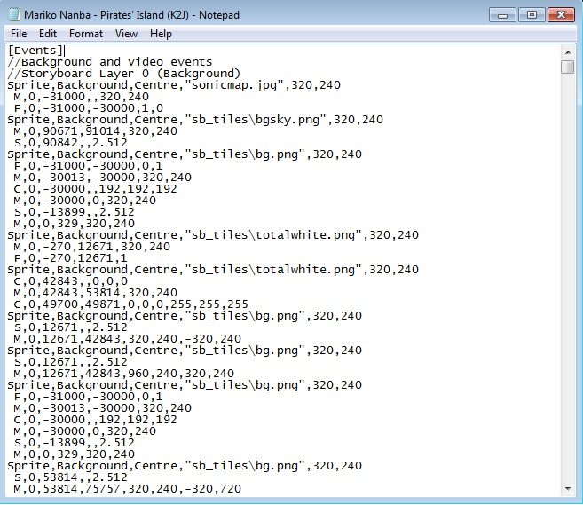
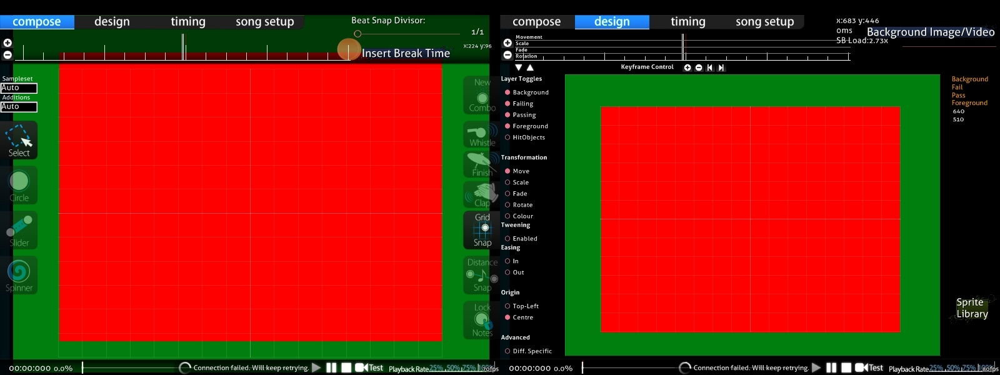
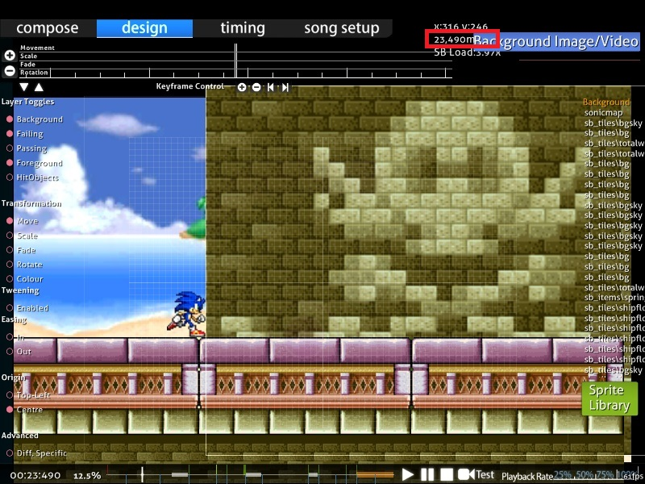

# General rules for storyboarding

This guide describes the lines of scripting code that are placed into the `.osb` or `.osu` file, under `[Events]`. Commands in the `.osb` file for the [beatmap](/wiki/Beatmap) will appear in all [difficulties](/wiki/Beatmap/Difficulty), while those that appear in the `.osu` file will only appear in the respective difficulty.

## Basic rules

### Objects

::: alert-note
**Note:** For objects in [osu!](/wiki/Game_mode/osu!) and [Beatmapping](/wiki/Beatmapping), see [Hit objects](/wiki/Gameplay/Hit_object)
:::

A [Storyboard object](/wiki/Storyboard/Scripting/Objects) is an instance of a sprite or an animation in a [storyboard](/wiki/Storyboard). Storyboards can also have sound, see the [audio guide](/wiki/Storyboard/Scripting/Audio) for more details.

The accepted formats for objects are PNG and JPEG. JPEG is lossy, which means it is smaller in file size, but does not precisely save each pixel. It also does not support transparency. Therefore, it is good for backgrounds and for square or photo-realistic images. PNG is lossless, which means it retains pixel-by-pixel information, but is of a larger file size than JPEG. It supports transparency, so it is usually the best for foreground objects or text.

Animations are done in-engine, so the PNG layer system or animation features should not be used. Instead, save each frame as a separate file and name the files with a decimal number before the extension (e.g., "sample0.png", "sample1.png" for a 2-frame animation "sample.png").

### Screen size

The editor screen is 640 x 480 pixels and the general play area is 510 x 385 pixels.

Coordinates are specified with positive values for `X` going to the **right**, positive values for `Y` going **down**, and the origin (0,0) being placed at the upper-left corner of the screen. It is possible to specify coordinates to be outside of these boundaries (e.g., for a sprite to come in from off-screen).

#### Editor coordinates

| Screen | x | y |
| :-: | :-: | :-: |
| Editor | 0–640 | 0–480 |
| Play area | 60–570 | 55–440 |

### Layers

All storyboard sprites are placed below the [hit objects](/wiki/Gameplay/Hit_object) except the Overlay layer, which is still placed below the [skin](/wiki/Skin). So, even the "highest" (Overlay) layer in the storyboard will always be above the hit objects, but behind the [health bar](/wiki/Client/Interface/Health_bar), the cursor, etc.

These are the five storyboard layers, in increasing order of priority:

- Background
- Fail (only displayed if the player is in the "Fail state", see [game state](#game-state) below)
- Pass (only displayed if the player is in the "Pass state", see [game state](#game-state) below)
- Foreground
- Overlay (displayed above hit objects, use with caution)

Note that the "Fail" and "Pass" layers are never on screen simultaneously, unlike in the [design tab](/wiki/Client/Beatmap_editor/Design).

By default, the preview [background](/wiki/Beatmap/Background) (the background visible in [song select](/wiki/Client/Interface#song-select)) specified for the beatmap is placed below all other layers. However, if that same file is referenced as an object in the storyboard, it will disappear immediately after the beatmap loads. It is common to have the beatmap's preview background to be the first object specified (time-wise and sprite-wise), and to use the "fade out" (brighten) command to "introduce" the background to the audience.

#### Overlapping rules

- Objects that overlap in **different** layers will be drawn in the order described above (e.g., any object in the Foreground layer will always be visible in front of any object in the Background, Fail, or Pass layers).
- Objects that overlap in the **same** layer will be drawn in the order they are specified (e.g., if object 1 is specified before object 2 in the `.osb` or `.osu` file and they are both in the same layer, object 2 will appear in front of object 1).
- Commands from the `.osb` file take precedence over those from the `.osu` file within the layers, as if the commands from the `.osb` were appended to the end of the `.osu` commands. This does not overrule the five layers mentioned above. See [this forum post](https://osu.ppy.sh/community/forums/topics/1869?start=469997) for an example.

### Game state

The idea behind using a storyboard rather than a video file is **the ability to change elements dynamically to fit them to the gameplay's circumstances**. osu! only displays one of the Fail/Pass layers at once, depending on the player's performance. These states are referred to as *Fail State* and *Pass State*.

States **before the first [drain time](/wiki/Beatmap/Drain_time)** (e.g., before the first [hit circle](/wiki/Gameplay/Hit_object/Hit_circle), [slider](/wiki/Gameplay/Hit_object/Slider) or [spinner](/wiki/Gameplay/Hit_object/Spinner), not necessarily before the audio file starts):

- Always Pass State, the Fail layer will never be displayed. It is not recommended to use either Pass or Fail layers at this point in the beatmap, as it is meaningless to say the player is "passing" at this point.

States during **drain time** (when the player is expected to click on objects to keep the health bar from draining):

- Pass State if this is the first [combo colour](/wiki/Beatmapping/Combo_colour) or if the previous [combo](/wiki/Beatmapping/Combo) ended with a [Geki](/wiki/Gameplay/Judgement/Geki).
- Fail State otherwise. Note that there is no state for just [Katu](/wiki/Gameplay/Judgement/Katu), unlike in the DS games (which had three states).
  - In [osu!taiko](/wiki/Game_mode/osu!taiko), Fail State if the player missed the last note, Pass State otherwise.
  - In [osu!catch](/wiki/Game_mode/osu!catch), it is always the state of the previous break. The first playable section will always be Pass State.

States during **break time** (between drain time segments):

- Pass State if the health bar ended above half in the last drain time section (i.e., the "O" symbol appears).
- Fail State otherwise (i.e., the "X" symbol appears).
  - In [osu!taiko](/wiki/Game_mode/osu!taiko), if it reaches a certain quota at a certain time. Refer to these two examples:
    - Getting an accuracy of 96.5% while the health bar is still at 40% will give a Pass instead of a Fail.
    - Getting too many 100s in about 30 notes and getting a D while the health bar is still at around 30% will result in a Fail instead of a Pass (in this case, refer to [ZUN - Maiden's Cappricio ~ Dream Battle](https://osu.ppy.sh/beatmapsets/18005#taiko/69556)).

States **after the last drain time**, if the beatmap had at least one [break](/wiki/Beatmap/Break):

- Pass State if at least half of the breaks occurred in the Pass State.
- Fail State otherwise.

States **after the last drain time**, if the beatmap had no breaks:

- Same as during break time.

### Time

- Time is measured in milliseconds from the start of the beatmap's main audio file (`.mp3`/`.ogg`), including negative values to indicate an intro.
- Time in the storyboard is not dependent on the beatmap's [timing](/wiki/Beatmapping/Timing) (e.g., the number of [measures](/wiki/Music_theory/Measure) or the BPM). Therefore, it is recommended to make sure the beatmap is reasonably well-timed before storyboarding, as it will be harder to adjust these times later.
- Time is not constrained to the length of the song. It is possible to use negative values for events before the song starts (an intro), and values that extend beyond the last playable section or even the end of the audio file (an outro).
- When loaded, the beatmap starts from the earliest event specified or from time 0, whichever is earlier.
  - In the former case, the `Skip` button will be displayed to the user. Clicking it or pressing `Space` will skip to time 0. The game reverts to normal pre-map skip behaviour (e.g., press `Skip` again to go straight to the countdown — unlike in [Elite Beat Agents](https://en.wikipedia.org/wiki/Elite_Beat_Agents), where restarting the beatmap takes the player all the way back to the start, not to time 0).
- The game will transition to the [results screen](/wiki/Client/Interface#results-screen) as soon as the last event occurs, or the user clicks the `Skip` button or presses `Space`.
  - This includes events that are on **both** the Pass and Fail layers, even though only one will be displayed.
    - Example: If the Fail storyboard ends at time 20.000 and the Pass storyboard ends at time 25.000, the game will wait until time 25.000, even if the player is in the Fail State (all objects will disappear). Therefore, it is best to ensure that both Pass and Fail ending variants take the same amount of time to complete.
  - Events will continue even if the user skips to the results screen early, and the audio produced by the storyboard can still be heard.
- In the beatmap editor's design tab, the current time in milliseconds is displayed. Press `Ctrl` + `C` to copy the current time to the clipboard.

## Comments

Single-line C-style comments can be added, but be advised they may be removed if the beatmap is saved in the in-game editor. By default, there are some comments to suggest the separation of commands into the five layers.

`// This is a comment.`

Unlike in C/C++/C#/Java, comments can not be placed on a line after a valid command. Block comments are unavailable as well.
