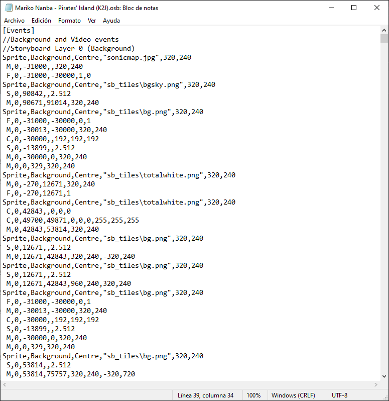
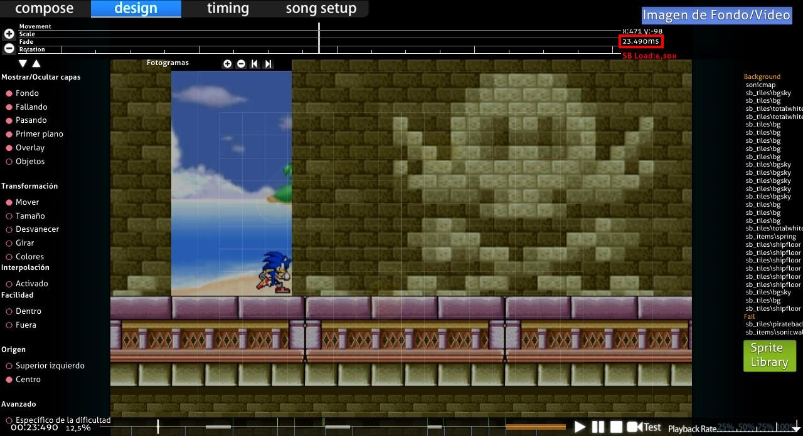

# Reglas generales del storyboarding

Esta guía describe las líneas de código de las secuencias de comandos que se colocan en el archivo .osb o .osu, en `[Events]`. Los comandos en el archivo .osb para el beatmap aparecerán en todas las dificultades, mientras que los que aparecen en el archivo .osu solo aparecerán en esa dificultad determinada.

## Reglas básicas

### Objetos

*Para los objetos en [osu!](/wiki/Game_mode/osu!) y el [beatmapping](/wiki/Beatmapping), véase: [Objetos](/wiki/Gameplay/Hit_object)*

Un [objeto de un storyboard](/wiki/Storyboard/Scripting/Objects) es una instancia de un sprite o una animación en un storyboard. Los storyboards también pueden tener sonido; consulta la guía de [audio](/wiki/Storyboard/Scripting/Audio) para obtener más detalles.

Los formatos aceptados para los objetos son PNG y JPEG. JPEG tiene pérdidas, lo que significa que el tamaño del archivo es menor, pero no guarda con precisión cada píxel. Tampoco es compatible con la transparencia. Por lo tanto, es bueno para fondos y para imágenes cuadradas o fotorrealistas. PNG no tiene pérdidas, lo que significa que retiene información píxel por píxel, pero tiene un tamaño de archivo mayor que JPEG. Admite transparencias, por lo que suele ser el mejor para objetos/texto en primer plano.

Las animaciones se realizan en el propio motor, por lo que no debe usarse el sistema de capas PNG ni las funciones de animación. En su lugar, guarda cada fotograma como un archivo separado y nombra los archivos con un número decimal antes de la extensión (por ejemplo, «sample0.png», «sample1.png» para una animación de 2 cuadros «sample.png»).

### Tamaño de pantalla

La pantalla del editor es de 640 x 480 píxeles y el área de juego general es de 510 x 385 píxeles.

Las coordenadas se especifican con valores positivos para `X` que van hacia la **derecha**, valores positivos para `Y` que van **hacia abajo** y el origen (0,0) se coloca en la esquina superior izquierda de la pantalla. Es posible especificar coordenadas para que estén fuera de estos límites (por ejemplo, para que un objeto entre desde fuera de la pantalla).

**Coordenadas del editor:**

| Pantalla | x | y |
| :-: | :-: | :-: |
| Editor | 0-640 | 0-480 |
| Área de juego | 60-570 | 55-440 |

### Capas

Todos los sprites del storyboard se colocan debajo de la skin y los [objetos](/wiki/Gameplay/Hit_object). Por lo tanto, incluso la capa «más alta» (primer plano) en el storyboard siempre estará detrás de la barra de HP, los círculos/sliders/spinners, el cursor, etc.

Estas son las cuatro capas de un storyboard, en orden creciente de prioridad:

- Fondo
- Fail (solo se muestra si el jugador está en el «estado Fail», consulta [estado de juego](#estado-de-juego) a continuación)
- Pass (solo se muestra si el jugador está en el «estado Pass», consulta [estado de juego](#estado-de-juego) a continuación)
- Primer plano

Ten en cuenta que las capas «Fail» y «Pass» nunca aparecen en la pantalla simultáneamente, a diferencia de lo que ocurre en la pestaña de diseño.

De forma predeterminada, el fondo de vista previa (el fondo visible en el [selector de canciones](/wiki/Client/Interface#selector-de-canciones)) especificado para el beatmap se coloca debajo de todas las demás capas. Sin embargo, si se hace referencia a ese mismo archivo como un objeto en el storyboard, desaparecerá inmediatamente después de que se cargue el beatmap. Es común tener el fondo de vista previa del beatmap como el primer objeto especificado (en términos de tiempo y de sprites) y usar el comando «fade out» (iluminar) para «presentar» el fondo a la audiencia.

#### Reglas para la superposición de objetos

- Los objetos que se superpongan en capas **diferentes** se mostrarán en el orden descrito anteriormente (por ejemplo, cualquier objeto en la capa primer plano siempre será visible frente a cualquier objeto en las capas fondo, fail o pass).
- Los objetos que se superponen en la **misma** capa se mostrarán en el orden en que se especifican (por ejemplo, si el objeto 1 se especifica primero en el archivo .osb o .osu, y luego el objeto 2 también, pero están ambos en la misma capa, el objeto 2 aparecerá delante del objeto 1).
- Los comandos del archivo .osb tienen prioridad sobre los del archivo .osu dentro de las capas, como si los comandos del .osb se añadieran al final de los comandos del .osu. Esto no anula las cuatro capas mencionadas anteriormente. [Véase este ejemplo](https://osu.ppy.sh/community/forums/topics/1869?start=469997).

### Estado de juego

La idea detrás de usar un storyboard en lugar de un archivo de vídeo es **la capacidad de cambiar elementos dinámicamente para adaptarlos a las circunstancias del juego**. osu! solo muestra una de las capas Fail/Pass a la vez, dependiendo del rendimiento del jugador. Estos estados se les llaman «estado Fail» y «estado Pass».

Los estados **antes del primer tiempo de juego** (por ejemplo, antes del primer [círculo/slider/spinner](/wiki/Gameplay/Hit_object), no necesariamente antes de que comience el MP3/OGG):

- Siempre en estado Pass. La capa Fail nunca se mostrará. No se recomienda usar las capas Pass o Fail en este punto del beatmap, ya que no tiene sentido decir que el jugador está «pasando» en este punto.

Los estados durante el **tiempo de juego** («tiempo de drenaje», cuando se espera que el jugador haga clic en los objetos para evitar que se vacíe su barra de HP):

- Estado Pass si este es el primer color de un combo o si el color anterior del combo terminó con un Geki/Elite Beat! (todos los 300 en un color de un combo).
- De lo contrario, estado Fail. Ten en cuenta que no hay un estado solo para Katu/Beat!, a diferencia de los juegos de DS (que tenían tres estados).
  - En [osu!taiko](/wiki/Game_mode/osu!taiko), estado Fail si el jugador falló la última nota, estado Pass en caso contrario.
  - En [osu!catch](/wiki/Game_mode/osu!catch), este es siempre el estado en el que estaba el descanso anterior. La primera sección jugable siempre será estado Pass.

Estados durante el **tiempo de descanso** (entre segmentos de tiempo de juego):

- Estado Pass si la barra de HP terminó por encima de la mitad en la última sección de tiempo de juego (es decir, aparece el símbolo «O»).
- De lo contrario, estado Fail (es decir, aparece el símbolo «X»).
  - En [osu!taiko](/wiki/Game_mode/osu!taiko), si se alcanza cierta cuota en un momento determinado. Consulta los dos ejemplos siguientes.
    - Ejemplo A: Obtener una precisión de 96,5 % mientras la barra de HP todavía está al 40 % dará un Pass en lugar de un Fail.
    - Ejemplo B: Obtener demasiados 100 en aproximadamente 30 notas y obtener una D mientras la barra de HP todavía está alrededor del 30 % resultará en un Fail en lugar de un Pass (en este caso, consulta [ZUN - Maiden's Cappricio ~ Dream Battle](https://osu.ppy.sh/beatmapsets/18005#taiko/69556)).

Los estados después del último tiempo de juego, si el beatmap tuvo al menos un descanso:

- Estado Pass si al menos la mitad de los descansos se produjeron en el estado Pass.
- De lo contrario, estado Fail

Los estados después del último tiempo de juego, si el beatmap no tuvo descansos:

- Igual que durante el descanso.

### Tiempo

- El tiempo se mide en milisegundos (1000 ms = 1 segundo) desde el inicio del archivo de audio principal del beatmap (`.mp3`/`.ogg`), incluidos los valores negativos para indicar una introducción.
- El tiempo en el SB no depende de la temporización del beatmap en sí (por ejemplo, cuántos compases hay o pulsos por minuto). Por lo tanto, se recomienda que el beatmap esté razonablemente temporizado antes del storyboarding, ya que será más difícil ajustar estos tiempos más adelante.
- El tiempo no está limitado a la duración de la canción. Es posible tener valores negativos para eventos antes de que comience la canción (una introducción) y para valores que se extienden más allá de la última sección jugable o incluso del final del archivo de audio (un cierre).
- Cuando se carga, el beatmap comenzará desde el primer evento especificado o desde el tiempo 0, lo que ocurra primero.
  - En el primer caso, se mostrará al usuario el botón `Skip`. Al hacer clic en él o al presionar `Barra espaciadora` saltará al tiempo 0. El juego vuelve al comportamiento normal de salto previo al mapa (por ejemplo, presionar `Skip` nuevamente para ir directamente a la cuenta regresiva, a diferencia de [Elite Beat Agents](https://es.wikipedia.org/wiki/Elite_Beat_Agents), donde reiniciar el beatmap lleva al jugador hasta el inicio, no hasta el tiempo 0).
- El juego pasará a la [pantalla de resultados](/wiki/Client/Interface#pantalla-de-resultados) tan pronto como ocurra el último evento, o el usuario haga clic en el botón `Skip` o presione `Barra espaciadora`.
  - Esto incluye eventos que se encuentran en **AMBAS** capas de Pass/Fail, aunque solo se mostrará una.
    - Ejemplo: si el storyboard de Fail termina en el tiempo 20 000 y el storyboard de Pass termina en el tiempo 25 000, el juego esperará hasta el momento 25 000 incluso si el jugador está en estado Fail (todos los objetos desaparecerán). Por lo tanto, es mejor asegurarse de que las variantes de finalización de Pass y Fail tarden la misma cantidad de tiempo en completarse.
  - Los eventos continuarán aunque el usuario salte a la pantalla de resultados antes de tiempo, y el audio producido por el storyboard podrá seguir escuchándose.
- Cuando se está en la pestaña de diseño del editor de beatmaps, se muestra el tiempo actual en milisegundos. Presiona `Ctrl` + `C` para copiar el tiempo actual al portapapeles.

## Comentarios

Se pueden agregar comentarios de estilo C de una sola línea, pero ten en cuenta que pueden eliminarse si el beatmap se guarda en el editor del juego. De forma predeterminada, hay algunos que sugieren la separación de comandos en cuatro capas.

`// Este es un comentario.`

A diferencia de C/C++/C#/Java, los comentarios no se pueden colocar en una línea después de un comando válido. Los comentarios en bloque tampoco están disponibles.
