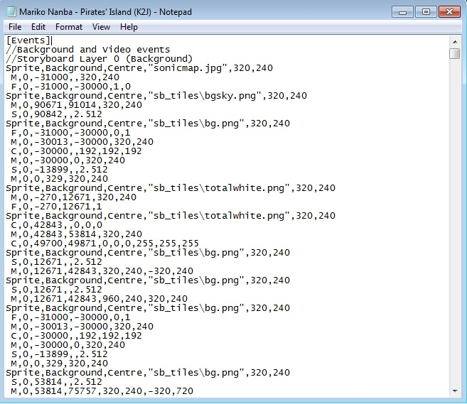
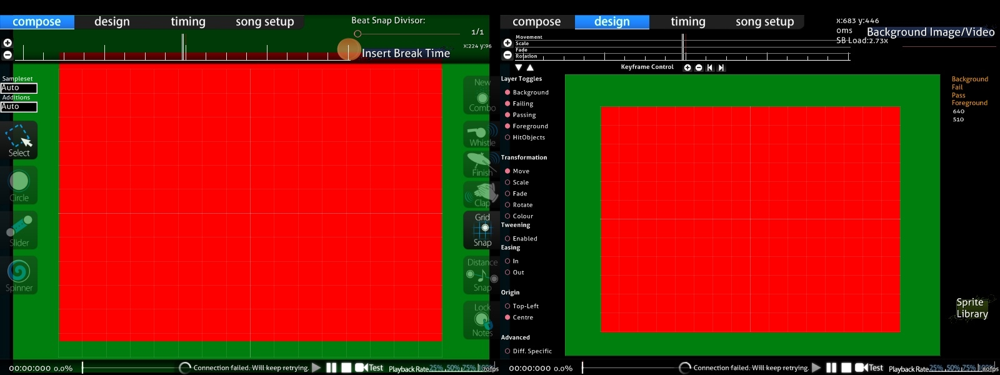
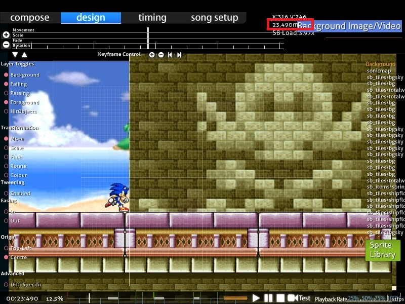

# General rules for storyboarding

ไกด์นี้อธิบายบรรทัดของ scripting code ที่ใส่ลงในไฟล์ .osb หรือ .osu ภายใต้ `[Events]` command ในไฟล์ .osb ของบีตแมปจะปรากฏในทุก difficulty ส่วน command ที่อยู่ในไฟล์ .osu จะปรากฏเฉพาะใน difficulty นั้น

## กฎพื้นฐาน

### Objects

*สำหรับ object ใน [osu!](/wiki/Game_mode/osu!) และ [Beatmapping](/wiki/Beatmapping) ดูที่: [Hit Objects](/wiki/Gameplay/Hit_object)*

[Storyboard object](/wiki/Storyboard/Scripting/Objects) คือ instance ของ sprite หรือ animation ใน storyboard Storyboard สามารถมีเสียงได้ด้วย ดูรายละเอียดเพิ่มเติมในไกด์ [Audio](/wiki/Storyboard/Scripting/Audio)

รูปแบบ object ที่ยอมรับคือ PNG และ JPEG โดย JPEG เป็น lossy หมายความว่าขนาดไฟล์เล็กกว่า แต่ไม่ได้บันทึกแต่ละพิกเซลอย่างแม่นยำ และไม่รองรับความโปร่งใส ดังนั้นจึงเหมาะกับพื้นหลังและภาพสี่เหลี่ยมหรือภาพสมจริง ส่วน PNG เป็น lossless หมายความว่าคงข้อมูลแบบพิกเซลต่อพิกเซล แต่มีขนาดไฟล์ใหญ่กว่า JPEG และรองรับความโปร่งใส จึงมักดีที่สุดสำหรับ foreground object / ข้อความ

Animation ทำงานใน engine ดังนั้นไม่ควรใช้ระบบ layer หรือฟีเจอร์ animation ของ PNG ให้บันทึกแต่ละเฟรมเป็นไฟล์แยกและตั้งชื่อไฟล์ด้วยเลขฐานสิบก่อนนามสกุลแทน (เช่น "sample0.png", "sample1.png" สำหรับ animation 2 เฟรมชื่อ "sample.png")

### ขนาดหน้าจอ

หน้าจอ editor มีขนาด 640 x 480 พิกเซล และพื้นที่เล่นทั่วไปมีขนาด 510 x 385 พิกเซล

พิกัดถูกระบุด้วยค่าบวกสำหรับ `X` ไปทาง **ขวา** ค่าบวกสำหรับ `Y` ไปทาง **ล่าง** และ origin (0,0) อยู่ที่มุมซ้ายบนของหน้าจอ สามารถระบุพิกัดให้อยู่นอกขอบเขตเหล่านี้ได้ (เช่น ให้ sprite เข้ามาจากนอกจอ)

**พิกัด editor:**

| Screen | x | y |
| :-: | :-: | :-: |
| Editor | 0-640 | 0-480 |
| Play area | 60-570 | 55-440 |

### Layers

Storyboard sprite ทั้งหมดจะถูกวางไว้ใต้ [hit object](/wiki/Gameplay/Hit_object) ยกเว้น Overlay ซึ่งยังคงอยู่ใต้สกิน ดังนั้นแม้ layer ที่ "สูงสุด" (Overlay) ใน storyboard จะอยู่เหนือ hit object เสมอ แต่ยังอยู่หลัง HP bar, cursor ฯลฯ

นี่คือ storyboard layer ทั้ง 5 ชั้น เรียงจาก priority ต่ำไปสูง:

- Background
- Fail (แสดงเฉพาะเมื่อผู้เล่นอยู่ใน "Fail state" ดู [Game State](#game-state) ด้านล่าง)
- Pass (แสดงเฉพาะเมื่อผู้เล่นอยู่ใน "Pass state" ดู [Game State](#game-state) ด้านล่าง)
- Foreground
- Overlay (แสดงเหนือ hit object ใช้อย่างระมัดระวัง)

โปรดทราบว่า layer "Fail" และ "Pass" จะไม่ปรากฏบนหน้าจอพร้อมกัน ต่างจากในแท็บ design

โดย default preview background (พื้นหลังที่เห็นใน [song select](/wiki/Client/Interface#song-select)) ที่กำหนดให้บีตแมปจะถูกวางไว้ใต้ layer อื่นทั้งหมด อย่างไรก็ตาม หากไฟล์เดียวกันถูกอ้างอิงเป็น object ใน storyboard มันจะหายไปทันทีหลังบีตแมปโหลด เป็นเรื่องปกติที่จะให้ preview background ของบีตแมปเป็น object แรก (ทั้งในเชิงเวลาและลำดับ sprite) ที่กำหนดไว้ และใช้ command "fade out" (brighten) เพื่อ "แนะนำ" พื้นหลังให้ผู้ชม

#### กฎการซ้อนทับ

- Object ที่ซ้อนกันใน layer **ต่างกัน** จะถูกวาดตามลำดับที่อธิบายไว้ด้านบน (เช่น object ใด ๆ ใน layer Foreground จะมองเห็นอยู่หน้า object ใด ๆ ใน layer Background, Fail หรือ Pass เสมอ)
- Object ที่ซ้อนกันใน layer **เดียวกัน** จะถูกวาดตามลำดับที่ระบุไว้ (เช่น หาก object 1 ถูกระบุก่อนในไฟล์ .osb หรือ .osu แล้วตามด้วย object 2 และทั้งคู่ layer เดียวกัน object 2 จะปรากฏหน้า object 1)
- Command จากไฟล์ .osb มี priority เหนือ command จากไฟล์ .osu ภายใน layer เหมือนกับว่า command จาก .osb ถูก append ต่อท้าย command ของ .osu สิ่งนี้ไม่ override layer ทั้ง 4 ชั้นที่กล่าวไว้ด้านบน [ดูตัวอย่างนี้](https://osu.ppy.sh/community/forums/topics/1869?start=469997)

### Game State

แนวคิดเบื้องหลังการใช้ storyboard แทนไฟล์วิดีโอคือ **ความสามารถในการเปลี่ยน element แบบ dynamic เพื่อให้เข้ากับสถานการณ์ของ gameplay** osu! จะแสดง layer Fail/Pass เพียง layer เดียวในแต่ละครั้ง ตามผลงานของผู้เล่น สถานะเหล่านี้เรียกว่า "Fail State" และ "Pass State"

สถานะ **ก่อน playtime แรก** (เช่น ก่อน [circle/slider/spinner](/wiki/Gameplay/Hit_object) แรก ไม่จำเป็นต้องก่อน MP3/OGG เริ่ม):

- เป็น Pass State เสมอ layer Fail จะไม่แสดง ไม่แนะนำให้ใช้ layer Pass หรือ Fail ณ จุดนี้ของบีตแมป เพราะไม่มีความหมายที่จะบอกว่าผู้เล่นกำลัง "passing" ในช่วงนี้

สถานะระหว่าง **playtime** ("draining time" คือช่วงที่ผู้เล่นต้องคลิก object เพื่อไม่ให้ HP bar ลด):

- Pass State หากเป็นคอมโบสีแรก หรือคอมโบสีก่อนหน้าจบด้วย Geki/Elite Beat! (ได้ 300 ทั้งหมดในคอมโบสี)
- Fail State ในกรณีอื่น โปรดทราบว่าไม่มีสถานะเฉพาะสำหรับ Katu/Beat! ต่างจากในเกม DS (ที่มี 3 สถานะ)
  - ใน [osu!taiko](/wiki/Game_mode/osu!taiko) จะเป็น Fail State หากผู้เล่น miss note ก่อนหน้า และเป็น Pass State ในกรณีอื่น
  - ใน [osu!catch](/wiki/Game_mode/osu!catch) สถานะนี้จะเป็นสถานะเดียวกับ break ก่อนหน้าเสมอ ส่วน playable section แรกจะเป็น Pass State เสมอ

สถานะระหว่าง **break time** (ระหว่างช่วง playtime):

- Pass State หาก HP bar จบเหนือครึ่งหนึ่งใน playtime section ก่อนหน้า (เช่น สัญลักษณ์ "O" ปรากฏ)
- Fail State ในกรณีอื่น (เช่น สัญลักษณ์ "X" ปรากฏ)
  - ใน [osu!taiko](/wiki/Game_mode/osu!taiko) จะขึ้นกับการถึง quota บางอย่าง ณ เวลาหนึ่ง ดูตัวอย่างสองข้อด้านล่าง
    - ตัวอย่าง A: ได้ accuracy 96.5% ขณะที่ HP bar ยังอยู่ที่ 40% จะให้ Pass แทน Fail
    - ตัวอย่าง B: ได้ 100 เยอะเกินไปในประมาณ 30 note และได้ D ขณะที่ HP bar ยังอยู่ราว 30% จะเป็น Fail แทน Pass (ในกรณีนี้ ดู [ZUN - Maiden's Cappricio ~ Dream Battle](https://osu.ppy.sh/beatmapsets/18005#taiko/69556))

สถานะหลัง playtime สุดท้าย หากบีตแมปมี break อย่างน้อยหนึ่งช่วง:

- Pass State หากอย่างน้อยครึ่งหนึ่งของ break เกิดใน Pass State
- Fail State ในกรณีอื่น

สถานะหลัง playtime สุดท้าย หากบีตแมปไม่มี break:

- เหมือนกับระหว่าง break time

### Time

- Time วัดเป็นมิลลิวินาที (1000 ms = 1 วินาที) จากจุดเริ่มต้นของไฟล์เสียงหลักของบีตแมป (`.mp3`/`.ogg`) รวมถึงค่าติดลบเพื่อระบุ intro
- Time ใน SB ไม่ขึ้นกับ timing ของบีตแมปเอง (เช่น มีกี่ measure หรือ beat per minute เท่าไร) ดังนั้นจึงแนะนำให้บีตแมป timed ดีพอสมควรก่อนเริ่ม storyboarding เพราะปรับเวลาเหล่านี้ทีหลังจะยากขึ้น
- Time ไม่ถูกจำกัดด้วยความยาวของเพลง สามารถมีค่าติดลบสำหรับ event ก่อนเพลงเริ่ม (intro) และค่าที่เลย playable section สุดท้าย หรือแม้แต่เลยท้ายไฟล์เสียง (outro) ได้
- เมื่อโหลด บีตแมปจะเริ่มจาก event ที่เร็วที่สุดที่กำหนดไว้ หรือจากเวลา 0 แล้วแต่ว่าอันไหนเร็วกว่า
  - ในกรณีแรก ปุ่ม `Skip` จะแสดงให้ผู้ใช้เห็น การคลิกปุ่มนี้หรือกด `Space` จะข้ามไปเวลา 0 เกมจะกลับไปใช้พฤติกรรม pre-map skip ปกติ (เช่น กด `Skip` อีกครั้งเพื่อข้ามไป countdown ทันที ไม่เหมือนใน [Elite Beat Agents](https://en.wikipedia.org/wiki/Elite_Beat_Agents) ที่ restart บีตแมปแล้วพาผู้เล่นกลับไปจุดเริ่มต้นทั้งหมด ไม่ใช่เวลา 0)
- เกมจะเปลี่ยนไปยัง [หน้าผลลัพธ์](/wiki/Client/Interface#results-screen) ทันทีที่ event สุดท้ายเกิดขึ้น หรือผู้ใช้คลิกปุ่ม `Skip` หรือกด `Space`
  - สิ่งนี้รวมถึง event ที่อยู่บน layer Pass/Fail **ทั้งคู่** แม้จะแสดงเพียง layer เดียว
    - ตัวอย่าง: หาก storyboard ฝั่ง Fail จบที่เวลา 20000 และ storyboard ฝั่ง Pass จบที่เวลา 25000 เกมจะรอจนถึงเวลา 25000 แม้ผู้เล่นจะอยู่ใน Fail State (object ทั้งหมดจะหายไป) ดังนั้นควรตรวจให้แน่ใจว่า ending variant ทั้ง Pass และ Fail ใช้เวลาเท่ากัน
  - Event จะดำเนินต่อแม้ผู้ใช้ข้ามไปหน้าผลลัพธ์ก่อนเวลา และเสียงที่ storyboard สร้างยังคงได้ยินอยู่
- เมื่ออยู่ในแท็บ design ของ beatmap editor เวลาปัจจุบันจะแสดงเป็นมิลลิวินาที กด `Ctrl` + `C` เพื่อ copy เวลาปัจจุบันลง clipboard

## Comments

สามารถเพิ่ม comment แบบ C-style บรรทัดเดียวได้ แต่โปรดทราบว่าอาจถูกลบหากบีตแมปถูกบันทึกใน editor ภายในเกม โดย default จะมี comment บางส่วนเพื่อแนะนำการแยก command ลงใน layer ทั้ง 4

`// This is a comment.`

ต่างจากใน C/C++/C#/Java comment ไม่สามารถใส่ท้ายบรรทัดหลัง command ที่ถูกต้องได้ และไม่มี block comment
