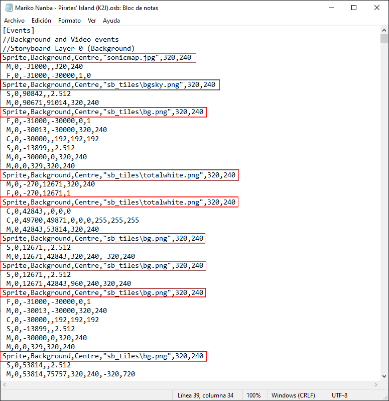

# Objetos de un storyboard

*Para los objetos en [osu!](/wiki/Game_mode/osu!) y [beatmapping](/wiki/Beatmapping), véase: [Objetos](/wiki/Gameplay/Hit_object)*

En el [storyboarding](/wiki/Storyboard), los **objetos** son sprites o animaciones que aparecen en la pantalla y componen el storyboard. Las instancias de audio específicas de un SB también pueden considerarse objetos; sin embargo, para mayor claridad, tienen [su propia sección en esta guía](/wiki/Storyboard/Scripting/Audio).

## Definición de un objeto

Para activar una instancia de un sprite (una imagen fija) o una animación, usa una sola línea en la sección `[Events]` de un archivo .osb o .osu.

| Imagen básica | Imagen en movimiento |
| :-- | :-- |
| Sprite,(capa),(origen),"(ruta del archivo)",(x),(y) | Animation,(capa),(origen),"(ruta del archivo)",(x),(y),(frameCount),(frameDelay),(looptype) |

En donde:

- **(capa)** es la **[capa](/wiki/Storyboard/Scripting/General_Rules) en la que aparece el objeto.** Los valores válidos se enumeran a continuación.
- **(origen)** es el lugar de la **imagen en el que osu! debe considerar que está el origen (coordenada) de esa imagen.** Esto afecta los valores (x) e (y), así como varios otros comportamientos específicos del comando. Por ejemplo, elegir (origen) = esquina superior izquierda, permitirá que los valores (x), (y) determinen dónde debe estar la esquina superior izquierda de la imagen en la pantalla. Los valores válidos se enumeran a continuación.
- **(ruta de archivo)** es, en términos sencillos, el **nombre del archivo de la imagen que deseas.** Pero no siempre es tan sencillo:
  - Si tienes una subcarpeta dentro de tu carpeta de canciones, también debes incluirla.
    - Ejemplo: «backgrounds/sky.jpg» si tienes una subcarpeta llamada «backgrounds» con una imagen llamada «sky.jpg» en ella. Comienza a enumerar directorios solo desde la carpeta de canciones, donde se encuentra el archivo .osu o .osb (es decir, una ruta de archivo relativa). No debería tener algo como «C:» en ninguna parte.
  - Se hace referencia a las animaciones sin su número. Entonces, si tienes «sample0.png» y «sample1.png» como dos fotogramas para crear una sola animación, deberás referirte a ellos como «sample.png».
  - Las comillas (` "" `) son técnicamente opcionales, pero son obligatorias si el nombre de tu archivo o subcarpeta tiene espacios.
    - Ejemplo: "SB/J\_K.jpg" en lugar de SB/J\_K.jpg. Lo anterior se encontrará en la carpeta SB J\_K.jpg mientras que el posterior anulará la instancia (se encontrará en SB/J, una variable no válida).
- **(x)** y **(y)** son las **coordenadas x/y de donde debería estar el objeto de forma predeterminada, respectivamente.** La interpretación de esto depende del valor de (origen); por ejemplo, para colocar una imagen de 640x480 como fondo, los valores podrían ser:
  - origin = TopLeft, x = 0, y = 0
  - origin = Centre, x = 320, y = 240
  - origin = BottomRight, x = 640, y = 480
    *y así sucesivamente.*

Las capas tienen estos valores:

| Valor | Capa |
| :-: | :-- |
| 0 | Fondo |
| 1 | Fail |
| 2 | Pass |
| 3 | Primer plano |

Los orígenes tienen estos valores:

| Valor | Origen |
| :-: | :-- |
| 0 | Esquina superior izquierda |
| 1 | Centro |
| 2 | Centrado a la izquierda |
| 3 | Esquina superior derecha |
| 4 | Centro de la parte inferior |
| 5 | Centro de la parte superior |
| 6 | Personalizado (mismo efecto que esquina superior izquierda, pero no debe usarse) |
| 7 | Centrado a la derecha |
| 8 | Esquina inferior izquierda |
| 9 | Esquina inferior derecha |

**Solo para animaciones**

- **(frameCount)** indica **cuántos fotogramas tiene la animación.** Si tenemos «sample0.png» y «sample1.png», en este caso tendremos `frameCount = 2`.
- **(frameDelay)** indica **cuántos milisegundos deben transcurrir entre cada fotograma.** Por ejemplo, si quisiéramos que nuestra animación avanzara a 2 fotogramas por segundo, `frameDelay = 500`.
- **(looptype)** indica si la **animación debe repetirse o no**. Los valores válidos son:
  - LoopForever (predeterminado si dejas este valor desactivado; la animación volverá al primer fotograma después de terminar el último fotograma)
  - LoopOnce (la animación se detendrá en el último fotograma y continuará mostrando ese último fotograma; útil para, por ejemplo, una animación de alguien dándose la vuelta)

Ten en cuenta que *no hay indicación de cuándo debería aparecer el objeto*. Eso depende completamente de [los propios comandos](/wiki/Storyboard/Scripting/Commands). El orden de las declaraciones de los objetos en el archivo .osu o .osb solo afecta a qué se superpone con qué; no influye en cuándo aparece el objeto (aunque, de todos modos, es convencional mantener las declaraciones ordenadas en función de cuándo aparecen).

## Ejemplos

| Imagen básica | Imagen en movimiento |
| :-- | :-- |
| Sprite,(capa),(origen),"(ruta del archivo)",(x),(y) | Animation,(capa),(origen),"(ruta del archivo)",(x),(y),(frameCount),(frameDelay),(looptype) |

Algunos ejemplos de declaraciones de los objetos:

`Sprite,Pass,Centre,"Text\Play2-HaveFunH.png",320,240`

Esto declara una imagen fija (sprite) basada en el archivo «Play2-HaveFunH.png» ubicado en la carpeta «Text». La imagen aparece en la capa Pass y el centro de la imagen estará ubicado en (320,240) en la pantalla del juego (el centro exacto de la pantalla).

`Animation,Fail,BottomCentre,"Other\Play3\explosion.png",418,108,12,31,LoopForever`

Esto declara una animación, cuyos fotogramas se pueden encontrar como «explosion0.png», «explosion1.png», ..., «explosion11.png» en la carpeta «Play3» de la carpeta «Other». La imagen aparece en la capa Fail y la parte inferior central de la imagen estará ubicada en (418,108) en la pantalla del juego. Hay 12 fotogramas en la animación (de ahí que el último fotograma se llame «explosion11.png») y hay un retraso de 31 milisegundos entre cada fotograma (por lo tanto, la animación tarda 31 \* 12 = 372 milisegundos en repetirse una vez). Después de que el juego ha mostrado el último fotograma durante 31 milisegundos, vuelve al primer fotograma y continúa hasta que el objeto ya no aparece en la pantalla.
