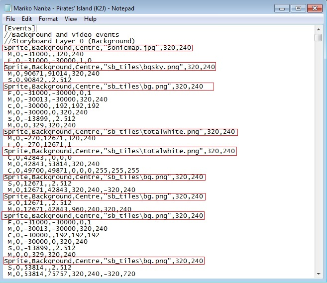

# Storyboard objects

*สำหรับ object ใน [osu!](/wiki/Game_mode/osu!) และ [Beatmapping](/wiki/Beatmapping) ดูที่: [Hit Objects](/wiki/Gameplay/Hit_object)*

ใน [Storyboarding](/wiki/Storyboard) **Object** คือ sprite หรือ animation ที่ปรากฏบนหน้าจอและประกอบกันเป็น storyboard instance ของเสียงเฉพาะ SB ก็ถือเป็น object ได้เช่นกัน อย่างไรก็ตาม เพื่อความชัดเจน เสียงมี [section ของตัวเองในไกด์นี้](/wiki/Storyboard/Scripting/Audio)

## การกำหนด Object

หากต้องการเรียก instance ของ sprite (ภาพนิ่ง) หรือ animation ให้ใช้หนึ่งบรรทัดใน section `[Events]` ของไฟล์ .osb หรือ .osu

| ภาพพื้นฐาน | ภาพเคลื่อนไหว |
| :-- | :-- |
| Sprite,(layer),(origin),"(filepath)",(x),(y) | Animation,(layer),(origin),"(filepath)",(x),(y),(frameCount),(frameDelay),(looptype) |

โดย:

- **(layer)** คือ **[layer](/wiki/Storyboard/Scripting/General_Rules) ที่ object ปรากฏอยู่** ค่าที่ใช้ได้อยู่ในรายการด้านล่าง
- **(origin)** คือจุดบน **ภาพที่ osu! ควรมองว่าเป็น origin (coordinate) ของภาพนั้น** สิ่งนี้ส่งผลต่อค่า (x) และ (y) รวมถึงพฤติกรรมเฉพาะ command อื่น ๆ ตัวอย่างเช่น หากเลือก (origin) = TopLeft ค่า (x),(y) จะกำหนดว่ามุมซ้ายบนของภาพควรอยู่ตรงไหนบนหน้าจอ ค่าที่ใช้ได้อยู่ในรายการด้านล่าง
- **(filepath)** พูดง่าย ๆ คือ **ชื่อไฟล์ของภาพที่คุณต้องการ** แต่มันไม่ได้ง่ายแบบนั้นเสมอไป:
  - หากมี subfolder อยู่ใน Song Folder คุณต้องใส่ชื่อนั้นด้วย
    - ตัวอย่าง: "backgrounds/sky.jpg" หากคุณมี subfolder ชื่อ "backgrounds" และมีภาพชื่อ "sky.jpg" อยู่ในนั้น ให้เริ่มระบุ directory จาก Song Folder ที่ไฟล์ .osu หรือ .osb อยู่เท่านั้น (เช่น relative filepath) ไม่ควรมีอะไรอย่าง "C:" อยู่ใน path
  - Animation จะถูกอ้างอิงโดยไม่ใส่เลขของเฟรม ดังนั้นหากคุณมี "sample0.png" และ "sample1.png" เป็นสองเฟรมเพื่อทำ animation เดียว ให้เรียกมันว่า "sample.png"
  - เครื่องหมาย "" ในทางเทคนิคไม่บังคับ แต่จำเป็นหากชื่อไฟล์หรือชื่อ subfolder มีช่องว่าง
    - ตัวอย่าง: ใช้ "SB/J\_K.jpg" แทน SB/J\_K.jpg แบบแรกจะหา J\_K.jpg ในโฟลเดอร์ SB ส่วนแบบหลังจะทำให้ instance เป็น null (เพราะมันหา SB/J ซึ่งเป็น variable ที่ไม่ถูกต้อง)
- **(x)** และ **(y)** คือ **พิกัด x-/y-coordinate ของตำแหน่งที่ object ควรอยู่โดย default ตามลำดับ** การตีความขึ้นอยู่กับค่า (origin) เช่น หากต้องการวางภาพ 640x480 เป็นพื้นหลัง ค่าอาจเป็น:
  - origin = TopLeft, x = 0, y = 0
  - origin = Centre, x = 320, y = 240
  - origin = BottomRight, x = 640, y = 480
    *และอื่น ๆ*

Layer มีค่าเหล่านี้:

| Value | Layer |
| :-: | :-- |
| 0 | Background |
| 1 | Fail |
| 2 | Pass |
| 3 | Foreground |

Origin มีค่าเหล่านี้:

| Value | Origin |
| :-: | :-- |
| 0 | TopLeft |
| 1 | Centre |
| 2 | CentreLeft |
| 3 | TopRight |
| 4 | BottomCentre |
| 5 | TopCentre |
| 6 | Custom (ให้ผลเหมือน TopLeft แต่ไม่ควรใช้) |
| 7 | CentreRight |
| 8 | BottomLeft |
| 9 | BottomRight |

**สำหรับ animation เท่านั้น**

- **(frameCount)** ระบุว่า **animation มีทั้งหมดกี่เฟรม** เช่น หากเรามี "sample0.png" และ "sample1.png" `frameCount = 2`
- **(frameDelay)** ระบุว่า **ระหว่างแต่ละเฟรมควรห่างกันกี่มิลลิวินาที** เช่น หากต้องการให้ animation เดินที่ 2 เฟรมต่อวินาที `frameDelay = 500`
- **(looptype)** ระบุว่า **animation ควร loop หรือไม่** ค่าที่ใช้ได้คือ:
  - LoopForever (ค่า default หากเว้นค่านี้ไว้ animation จะกลับไปเฟรมแรกหลังจบเฟรมสุดท้าย)
  - LoopOnce (animation จะหยุดที่เฟรมสุดท้ายและแสดงเฟรมสุดท้ายนั้นต่อไป มีประโยชน์กับ animation เช่น คนหันตัว)

โปรดสังเกตว่า *ไม่มีการระบุว่า object ควรปรากฏเมื่อไร* เรื่องนั้นขึ้นอยู่กับ [command เอง](/wiki/Storyboard/Scripting/Commands) ทั้งหมด ลำดับของการประกาศ object ในไฟล์ .osu หรือ .osb ส่งผลเฉพาะว่าอะไรทับอะไร ไม่ได้มีผลว่า object ปรากฏเมื่อไร (แม้โดยทั่วไปนิยมเรียง declaration ตามเวลาที่ปรากฏก็ตาม)

## ตัวอย่าง

| ภาพพื้นฐาน | ภาพเคลื่อนไหว |
| :-- | :-- |
| Sprite,(layer),(origin),"(filepath)",(x),(y) | Animation,(layer),(origin),"(filepath)",(x),(y),(frameCount),(frameDelay),(looptype) |

ตัวอย่างการประกาศ object:

`Sprite,Pass,Centre,"Text\Play2-HaveFunH.png",320,240`

บรรทัดนี้ประกาศภาพนิ่ง (sprite) จากไฟล์ "Play2-HaveFunH.png" ที่อยู่ในโฟลเดอร์ "Text" ภาพจะอยู่บน layer Pass และจุดกึ่งกลาง (centre) ของภาพจะอยู่ที่ (320,240) บนหน้าจอเกม (ตรงกลางหน้าจอพอดี)

`Animation,Fail,BottomCentre,"Other\Play3\explosion.png",418,108,12,31,LoopForever`

บรรทัดนี้ประกาศ animation ซึ่งเฟรมของมันจะพบได้ในชื่อ "explosion0.png", "explosion1.png", ..., "explosion11.png" ในโฟลเดอร์ "Play3" ของโฟลเดอร์ "Other" ภาพจะอยู่บน layer Fail และกึ่งกลางด้านล่างของภาพจะอยู่ที่ (418,108) บนหน้าจอเกม มี 12 เฟรมใน animation (ดังนั้นเฟรมสุดท้ายจึงชื่อ "explosion11.png") และมี delay 31 มิลลิวินาทีระหว่างแต่ละเฟรม (ดังนั้น animation ใช้เวลา 31 \* 12 = 372 มิลลิวินาทีต่อการ loop หนึ่งครั้ง) หลังเกมแสดงเฟรมสุดท้ายเป็นเวลา 31 มิลลิวินาที มันจะกลับไปเฟรมแรกและเล่นต่อไปจนกว่า object จะไม่ปรากฏบนหน้าจออีก
