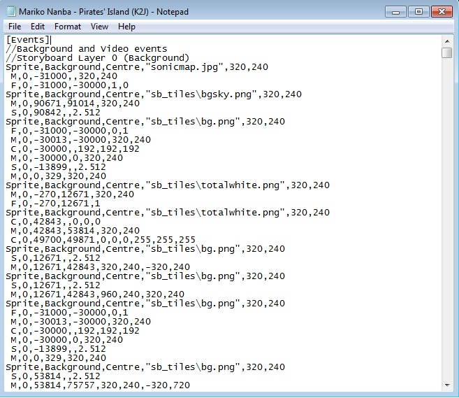

# Scénarisation d'un storyboard

Outre l'[éditeur de storyboard intégré](/wiki/Client/Beatmap_editor/Design), un éditeur de texte simple, tel que Notepad, [Notepad++](https://www.notepad-plus-plus.org/) ou [Visual Studio Code](https://code.visualstudio.com/), peut également être utilisé pour créer des [storyboards](/wiki/Storyboard) pour les beatmaps. Ce flux de travail est appelé **storyboarding by scripting** (*SBS*) et permet d'être plus précis (au pixel près et à la milliseconde près) quant au moment où les sprites apparaissent, à leur comportement, etc.

Pour étudier une partie spécifique du scripting, consultez l'un des articles ci-dessous :

- Concepts de base :
  - [Règles générales pour le storyboarding](General_Rules)
  - [Objets d'un storyboard](Objects)
  - [Commandes de script d'un storyboard](Commands)
  - [Commandes composées de script d'un storyboard](Compound_Commands)
  - [Variables de script d'un storyboard](Variables)
- Extra :
  - [Échantillons audio d'un storyboard](Audio)
  - [Aide-mémoire sur le scénario d'un storyboard](Cheat_Sheet)
  - [Bascule du fichier Storyboard .osu](osu!_File_Toggles)
  - [Raccourci de script d'un storyboard](Shorthand)

## Vue d'ensemble

Il y a une vue d'ensemble des concepts de script de scénarisation fournis par [Doomsday](https://osu.ppy.sh/users/18983) : [osu! - Storyboard Scripting for Beginners (12:22)](https://www.youtube.com/watch?v=UJ1YLDs-bZg).

## Spécifications complètes

*Note : Sauvegardez d'abord votre travail dans l'éditeur intégré, car il optimise certaines choses, et ensuite seulement dans un éditeur de texte simple. **Sauvegardez souvent** votre travail pour éviter toute perte de progression accidentelle.*

Le processus de script des storyboards est principalement basé sur [les spécifications officielles](https://osu.ppy.sh/community/forums/topics/1869) et sur l'expérience de la réalisation de grands storyboards. Bien que les articles du osu! wiki fournissent des exemples simples, ils ne sont pas des guides étape par étape. Les explications visent plutôt à détailler de manière exhaustive comment les commandes de script de base se traduisent en actions à l'écran dans osu!.

Avant d'écrire des scripts de storyboard, consultez les [règles générales pour le storyboarding](/wiki/Storyboard/Scripting/General_Rules) pour éviter tout problème et tout malentendu. Pour des explications plus approfondies, voir :

- [Objets d'un storyboard](/wiki/Storyboard/Scripting/Objects)
- [Commandes de script d'un storyboard](/wiki/Storyboard/Scripting/Commands)
