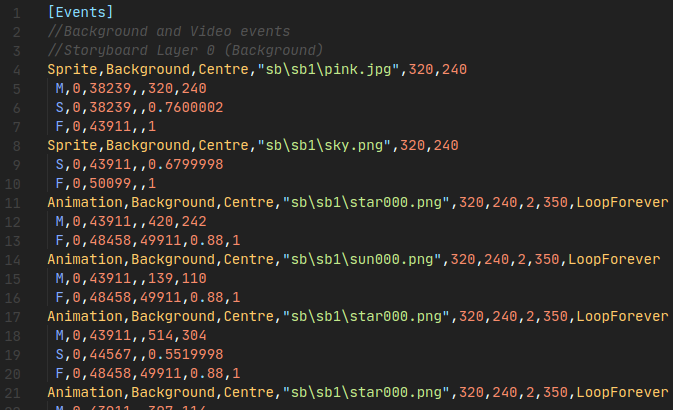

# ストーリーボードスクリプティング

[組み込みのストーリーボードエディター](/wiki/Client/Beatmap_editor/Design)に加えて、メモ帳や[Notepad++](https://www.notepad-plus-plus.org/)、[Visual Studio Code](https://code.visualstudio.com/)などのプレーンテキストエディターを使用して、ビートマップの[ストーリーボード](/wiki/Storyboard)を作成することもできます。このワークフローは**storyboarding by scripting**（*SBS*）と呼ばれ、スプライトの表示や動作などをピクセルやミリ秒単位でより正確に設定することができます。

## 概要

[Doomsday](https://osu.ppy.sh/users/18983)で提供されているストーリーボードスクリプティングのコンセプトの概要があります: [osu! - Storyboard Scripting for Beginners (12:22)](https://www.youtube.com/watch?v=UJ1YLDs-bZg)

## 完全な仕様書

*注意: 最適化されている箇所がある為、最初にビルトインエディタで保存し、その後、プレーンテキストエディタで保存してください。誤って進行状況が失われないように、**頻繁に保存**してください。*

ストーリーボードのスクリプティングプロセスは、主に[公式仕様書](https://osu.ppy.sh/community/forums/topics/1869)と大規模なストーリーボード作成の経験に基づいています。osu!wikiの記事では簡単な例を紹介していますが、ステップ・バイ・ステップのガイドではありません。基本的なスクリプトコマンドがどのようにosu!の画面上の動作に反映されるかを網羅的に説明することを目的としています。

ストーリーボードスクリプトを書く前に、[用語と基本的な概念](/wiki/Storyboard/Scripting/General_Rules)を確認して、問題や誤解が生じないようにしてください。より詳細な説明については、こちらをご覧ください:

- [ストーリーボード オブジェクト](/wiki/Storyboard/Scripting/Objects)
- [ストーリーボードスクリプティング コマンド](/wiki/Storyboard/Scripting/Commands)
