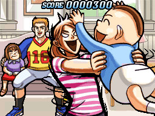
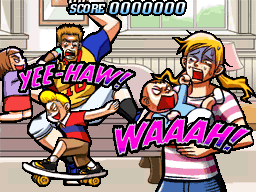

# Storyboard

**Storyboard** (SB) คือพื้นหลังอนิเมชันแบบ custom ที่มากับ [บีตแมป](/wiki/Beatmap) มักใช้เพื่อความสวยงาม และบางครั้งใช้เพื่อ gameplay ด้วย storyboard สามารถประกอบจากอะไรก็ได้แทบทั้งหมด แต่โดยทั่วไปจะเป็นเอฟเฟกต์ภาพที่ออกแบบมาเพื่อทำให้แมปดูสวยและมีเอกลักษณ์สำหรับผู้ใช้ Storyboard ได้แรงบันดาลใจจากพื้นหลังอนิเมชันใน [Osu! Tatakae! Ouendan](/wiki/Disambiguation/Ouendan) และเหมือนต้นแบบของมัน storyboard สามารถปรับตามผลงานของผู้เล่นในเกม และแสดงสิ่งต่างกันตามว่าผู้เล่นเล่นได้ดีแค่ไหน

Storyboard ถูกเก็บไว้ในโฟลเดอร์บีตแมป ไม่ว่าจะเป็น [ไฟล์ `.osb`](/wiki/Client/File_formats/osb_(file_format)) แบบแยกเดี่ยว หรือเป็นส่วนขยายของ section `[Events]` ใน [ไฟล์ `.osu`](/wiki/Client/File_formats/osu_(file_format)) ด้วยเหตุนี้จึงสามารถสร้าง storyboard ที่แตกต่างกันสำหรับแต่ละ difficulty ภายใน [บีตแมป](/wiki/Beatmap) ได้

## Storyboarding

*บทความหลัก: [Storyboard scripting](/wiki/Storyboard/Scripting)*

*Storyboarding* คือกระบวนการสร้าง storyboard โดยคนที่ทำกระบวนการนี้เรียกว่า *storyboarder* การทำ storyboard มักยากมาก และต้องใช้เวลา รวมถึงความเชี่ยวชาญด้านอนิเมชันและการสร้างกราฟิกพอสมควร osu! มี [editor ในตัว](/wiki/Client/Beatmap_editor/Design) ภายใน [beatmap editor](/wiki/Client/Beatmap_editor) เพื่อช่วยสร้าง storyboard แต่ storyboarder ที่จริงจังส่วนใหญ่มักเลือกเขียนโดยตรงผ่าน [storyboard scripting](/wiki/Storyboard/Scripting) ผู้สร้างจำนวนมากเลือกเขียนโปรแกรมด้วยภาษาโปรแกรมมิงแบบเต็มรูปแบบเพื่อสร้างสคริปต์ storyboard เพราะเอฟเฟกต์ภาพที่ซับซ้อนอาจต้องใช้โค้ด storyboard จำนวนมาก
