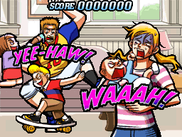

# Storyboards

")

Un **storyboard** (SB) est un arrière-plan animé personnalisé qui accompagne une [beatmap](/wiki/Beatmaps), souvent à des fins décoratives et parfois à des fins de jeu. Un storyboard peut être composé de presque tout, mais il consiste généralement en des effets visuels conçus pour rendre une map plus esthétique et plus distinctive pour les utilisateurs. Les storyboards sont inspirés des arrière-plans animés trouvés dans [Osu! Tatakae! Ouendan](/wiki/Glossary#ouendan). Comme leur inspiration, les storyboards peuvent s’adapter aux performances du joueur et afficher différentes choses en fonction de celles-ci.

Les storyboards sont stockés dans des dossiers Beatmap de manière autonome. [fichiers `.osb`](/wiki/osu!_File_Formats/Osb_(file_format)) ou des extensions de la section `[Events]` de [fichiers `.osu`](/wiki/osu!_File_Formats/Osu_(file_format)). De ce fait, il est possible de créer différents storyboards pour différentes maps dans un [beatmapset](/wiki/Glossary#beatmapset).

Les storyboards sont souvent très difficiles à réaliser et nécessitent du temps et une expertise considérables en animation standard et en création graphique. osu! offre un [éditeur de design](/wiki/Beatmap_Editor/Design) à l'intérieur de l'[éditeur de beatmap](/wiki/Beatmap_Editor) pour aider à la création de storyboards, mais la plupart des producteurs avides de storyboard choisissent plutôt de programmer via [storyboard scripting](/wiki/Storyboard_Scripting) directement. De nombreux créateurs choisissent d'écrire des programmes dans des langages de programmation complets pour générer des scripts de storyboards, car des effets visuels complexes peuvent nécessiter une grande quantité de code de storyboard.
