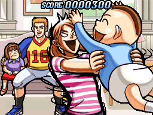

# ストーリーボード

**Storyboard** (SB)は640\*480もしくは1366\*768(ワイドスクリーンの出現による)の専用に調節された画像を[ビートマップの背景で使用するもので](/wiki/Glossary)、ほとんどが背景を装飾するために、稀にビートマップのためにSBが使用されます。ストーリーボードはいくつかの要素で構成され、ビートマップをより美しくするため、あるいは特徴的なものとするために利用されます。ちなみにこの元ネタはOsu! Tatakae! Ouendanから来ています。

ストーリーボードは作成難易度が高く、多くの時間も必要となる上に基本的なアニメーションや画像の生成についてのスキルが必要となります。

## Storyboardの作成

[Storyboard Editor](/wiki/Storyboard_Editor) (SBE)はDesignタブ(ショートカットはF2キー)にあり、SBEはユーザーに手軽な操作をする手段の一つとなります。しかしそれは"基本的"の粋を超えた内容を操作するのには不便であり、また一部の内容はそれを経由して操作をすることができません。またもしワイドスクリーン環境向けのSBを作る場合はsong setupからそれを設定してください。

SBに慣れたユーザーがSBEのバックエンドのコードを作る場合は[Storyboard Scripting](/wiki/Storyboard_Scripting) (SBS) を利用してより自由度の高いコードを作ります。詳細については記事を参照してください。
