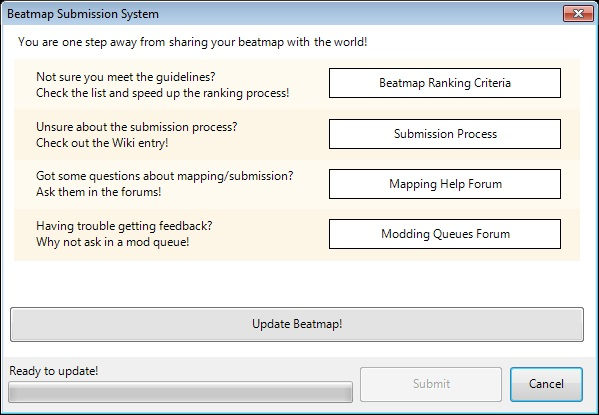

# Pengajuan

[Beatmapper](/wiki/Glossary/#beatmapper) dan mengajukan beatmap yang [masih dalam tahap pengerjaan (WIP)](/wiki/Glossary/#wip) maupun beatmap yang mereka anggap selesai (2 tingkat kesulitan dibutuhkan) ke masing-masing subforum [Beatmap](https://osu.ppy.sh/community/forums/12) *[Work In Progress/Help](https://osu.ppy.sh/community/forums/10)* dan [Pending Beatmap](https://osu.ppy.sh/community/forums/6), menggunakan **Sistem Pengajuan Beatmap (BSS)** dalam permainan \[Ctrl + Shift + U\].

Terletak dalam [Penyunting](/wiki/Beatmap_Editor) osu!, BSS secara otomatis mengunggah beatmap berserta segala elemennya (mp3, video, storyboard, dll.) ke server osu! dan membuat thread dengan sebuah tautan unduh di forum yang relevan. Moderator dan anggota forum lainnya dapat berkomentar dan menawarkan umpan balik pada beatmap. Jika beatmap itu telah mendapatkan persetujuan paling tidak 2 BNG, maka beatmap itu akan dirank .

 Beatmap yang telah dirank dipindahkan ke subforum *[Ranked/Approved Beatmaps](https://osu.ppy.sh/community/forums/14)*, ditambahkan ke [Daftar Beatmap Ranked](https://osu.ppy.sh/p/beatmaplist) termasuk ke dalam [Paket Beatmap Ranked](https://osu.ppy.sh/p/packlist), dan akan muncul di profil mereka. Skor yang diperoleh ketika mereka bermain beatmap tersebut akan menambahkan *Total Ranked Score* pemain dalam [Peringkat Pemain](https://osu.ppy.sh/p/playerranking) dan penilaian pemain dapat dimasukkan sebagai hitungan mereka pada [Peringkat Beatmapper](https://osu.ppy.sh/p/mapperranking).

## Pengajuan

### Sebelum mengajukan sebuah beatmap

Sebelum mengajukan beatmapmu, pastikan kamu telah mencoba membuatnya sebagus pengalaman yang kamu dapat. Bagaimanapun, jangan ragu untuk mengajukan beatmapmu jika kamu baru saja memulai dalam pembuatan beatmap atau jika kamu percaya masih ada sesuatu yang salah dengan beatmapmu - semua disini untuk membantu, akan lebih baik jika kamu menunjukkan bahwa kamu telah berusaha dan perhatian dalam membuat beatmapmu. Cobalah membaca bagian bantuan yang relevan untuk tips tentang bagaimana cara membuat sebuah beatmap yang bagus.

### Mengajukan sebuah Beatmap

Buka *salah satu* versi tingkat kesulitan dari beatmapmu di Penyunting, pilih **"File"** dari kepala menu dan kemudian pilih **"Upload Beatmap"** (atau "Ctrl + Shift + U"). Kotak dialog Sistem Pengajuan Beatmap akan terbuka. Klik tombol *Upload* untuk mengirim mapnya. Jika kamu berubah pikiran, pilih *Cancel* untuk keluar dari kotak dialog dan kembali ke Penyunting.

Jika kamu hanya memperbaharui timing beatmap, peletakan objek (pada posisinya dan/atau baris waktunya), warna kombo, efek suara dll, prosesnya akan relatif lebih cepat karena hanya berkas .osu, yang merupakan berkas dengan ukuran rendah, yang berubah.

Jika kamu telah menambahkan, menghilangkan, atau mengganti berkas mp3nya, video dan/atau storyboard, jika ada, pengiriman akan lebih lama sebab memerlukan waktu untuk mengunggah kembali berkas tersebut ke server.

Setelah kamu menekan tombol "**Upload Files**", Sistem Pengajuan Beatmap akan mulai mengunggah berkasmu berdasarkan metode pengiriman yang kamu pilih. Bar yang berada di bawah mengilustrasikan proses pengunggahannya. Di dalam kotak dialog ini, kamu dapat menyunting judul dan pesan pertama dari topik forum yang secara otomatis dibuat oleh BSS untuk beatmapmu. Kamu juga dapat memilih subforum tempat thread beatmapmu dikirimkan. Mengganti pilihanmu ketika memperbaharui beatmapmu akan memindahkan keseluruhan topik ke forum lainnya dengan mudah.

Pilih **Work In Progress/Help** untuk mengirim thread beatmapmu di dalam subforum *[Work In Progress/Help](https://osu.ppy.sh/community/forums/10)*. Pilih ini jika kamu merasa kamu membutuhkan bantuan dengan satu atau lebih aspek spesifik dari beatmapmu (seperti timing) atau hanya untuk membagikan versi sebagian jadi dari beatmapmu ke komunitas dan mendapatkan komentar umum dan umpan balik.

Pilih **Pending Beatmap** untuk mengirim thread beatmapmu di dalam subforum *[Pending Beatmaps](https://osu.ppy.sh/community/forums/6)*. Pilih ini jika kamu percaya beatmapmu kurang lebih telah mengikuti kriteria persetujuan dasar dan kamu megharapkannya untuk dipertimbangkan oleh moderator untuk dirank. Kamu telah berusaha paling tidak mendekati pengaturan timing yang benar sebelum mengirim sebuah beatmap ke forum *Pending Beatmaps*, dan beatmapmu harus memiliki paling tidak 2 tingkat kesulitian.

Kamu juga dapat memilih opsi berikut lewat kotak centang dibawah kotak masukan pesan:

-   **Receive email notification on reply:** Jika kotak ini dicentang, ketika seseorang membalas ke thread beatmapmu, kamu akan mendapatkan surel notfikasi yang kamu tuliskan ketika kamu mendaftar osu!. Kamu tidak akan mendapatkan notifikasi lebih lanjut untuk balasan selanjutnya jika kamu tidak mengunjungi threadnya.
-   **Load in browser after submission:** Jika kotak ini dicentang, setelah pengunggahan selesai dan kamu menekan "Submit", peramban bakumu akan mencoba untuk menampilkan halaman dari thread forum beatmapmu.

### Proses Modding Beatmap

*Artikel utama: [Modding](/wiki/Modding).*

Setelah kamu mengirim beatmapmu, itu akan tersedia untuk diunduh oleh anggota forum osu! dan moderator, yang mungkin dapat memberikan komentar dan umpan balik pada beatmapmu (secara umum disebut sebagai *modding* sebuah beatmap). Dalam [konsol obrolan yang diperluas](/wiki/Chat_Console), status dari seseorang yang sedang membuka beatmap orang lain dalam Penyunting akan disetel sebagai *Modding* dan panel mereka akan berubah menjadi warna hijau. Semua diperbolehkan - *dianjurkan*, faktanya untuk memberikan mod pada beatmap, namun hanya modding oleh moderator yang menentukan seberapa dekat sebuah beatmap untuk dapat dirank.

Moderator dapat memberikan sebuah simbol ke thread beatmap tersebut berdasarkan evaluasi mereka terhadap beatmap tersebut. Simbol ini ditampilkan di sebelah judulnya dalam subforum dan di sebelah judul kiriman pertamanya. Simbol yang mungkin untuk sebuah beatmap miliki ialah sebagai berikut (diurutukan dari terbaik hingga terburuk):

-    Hati /  Api
-    Gelembung berpikir (Gelembung untuk lebih singkatnya)
-    Bintang
-   Tanpa simbol
-    Hati yang retak
-    Nuklir
    -   *Graveyard* jika tidak aktif selama sebulan.

####  Hati

Setelah BN kedua menominasikan sebuah beatmap dengan sebuah simbol Gelembung Pikiran  , ia mengkualifikasikannya dan otomatis diberikan simbol ini ketika dipindahkan ke forum *Ranked/Approved Beatmaps*.

####  Api

Sebuah Api diberikan pada beatmap yang tidak memiliki masalah teknis yang  beatmap Nuked punya, dan akan dianggap sebagai beatmap Approved karena durasinya panjang dan memenuhi Kriteria Pemeringkatan. Dahulu skor total atau jumlah tingkat kesulitannya termasuk dalam kriteria pemeringkatannya, tapi sekarang hanya durasi yang dipertimbangkan. Map tersebut bisa disebut susah dan dibuat sebagai tantangan pada para pemain yang mahir.

####  Gelembung pikiran

Biasanya dipanggil *Bubble (Gelembung)* untuk lebih singkatnya, simbol ini diberikan ketika **seorang BN telah puas terhadap seluruh aspek dari beatmap tersebut dan menominasikannya untuk dirank.** Setelah BN kedua menyetujui beatmap tersebut, maka itu telah dikualifikasi . Sebuah Gelembung Pikiran mungkin akan turun menjadi sebuah  Bintang jika moderator kedua menemukan kesalahan pada bagian moderator pertama, tapi selama ini belum ada penurunan yang pernah terjadi.

####  Bintang

Sebuah bintang diberikan pada sebuah beatmap yang **BN anggap telah benar namun masih membutuhkan beberapa peningkatan sebelum ia menyetujuinya dengan sebuah  Gelembung Pemikiran.** Contoh termasuk beberapa sedikit penyesuaian pada timing, jarak ketukan yang kurang tepat pada beberapa bagian, atau membutuhkan tambahan versi tingkat kesulitan.

Ini seharusnya TIDAK membuat kerancuan dengan sebuah "Bintang Kudosu". Sebuah Bintang Kudosu diberikan oleh modder yang berpikir bahwa map tersebut layak mendapatkannya. Bintang Kudosu memberikan berbagai macam bintang prioritas bergantung siapa yang memberikannya, tapi mereka dapat menempatkan map leih tinggi pada daftar prioritas. Tolong lihat [Kudosu](/wiki/Glossary/#kudosu) untuk informasi lebih lanjut tentang Kudosu.

#### Tanpa simbol

Semua beatmap yang tidak mempunyai simbol pada mereka ketika mereka baru dikirim pertama kali. BN yang berpikir ada beberapa masalah yang mencegahnya memberikan sebuah  Bintang. Keadaan ini tidak seharusnya membuatmu khawatir terlalu banyak, karena biasanya beatmap ditandai dengan sebuah bintang ataupun sebuah Gelembung Pemikiran setelah anjuran BN diikuti.

####  Didiskualifikasi

BN hanyalah seorang manusia. Jika sebuah beatmap telah dikualifikasi dan QAT menemukan sesuatu yang menurut mereka mencegah sebuat beatmap disetujui secara resmi, beatmap dapat didiskualifikasi sementara dan skor yang didapat pada beatmap tersebut *dibersihkan*. Beatmap kembali ke kondisi WIP. Setelah masalah telah diperbaiki, beatmap dapat dikualifikasi lagi.

####  Nuklir

Simbol ini diberikan pada beatmap yang **gagal mengikuti petunjuk yang paling dasar**, seperti memiliki timing yang sangat tidak benar atau objek ditempatkan secara acak dan/atau baris waktu, dan memerlukan banyak peningkatan untuk memulai dirank.

Simbol nuklir pada sebuah beatmap tidak berarti moderator tidak setuju pada beatmap itu secara umum. Ini hanya berarti mereka tidak setuju pada *kondisinya sekarang*. Jika beatmapmu ditandai dengan simbol nuklir, jangan khawatir - biasanya kamu dapat menghilangkannya jika kamu mencoba untuk:

-   Memberi perhatian yang lebih pada komentar moderator dan sarannya di dalam thread.
-   Bacalah [Pembuatan Beatmap](/wiki/Beatmapping), Halaman Bantuan, dan/atau menonton tutorial tentang pembuatan beatmap.
-   Buka dan lihat beatmap yang telah dirank di Penyunting untuk melihat bagaimana tampilannya.
-   Jika kamu orang baru dalam pembuatan beatmap, mungkin lagu yang telah kamu pilih menantang untuk dimap; dalam kasus ini, kamu juga dapat mempertimbangkan membuat sebuah beatmap pada lagu yang lebih mudah. Cobalah memilih lagu dengan ritme konstan, jernih, dan baik untuk memudahkanmu dalam membuatnya.
-   Jangan terburu-buru - selama kamu tetap mencoba, kamu akan meningkat secara konstan.

#### Beatmap Graveyard

Thread pada forum Completed Beatmaps dan Beatmap Help yang tidak mendapatkan balasan dalam kurun waktu 4 minggu sejak kiriman terakhir mereka otomatis dipindahkan ke subforum Beatmap Graveyard untuk mencegah subforum beatmap lainnya menjadi berantakan. Untuk mencegah agar ini tidak terjadi, kamu dapat menggunakan Sistem Pengajuan Beatmap untuk mengunggah kembali beatmapmu dan mengangkat threadnya kembali dalam proses. Tolong gunakan fitur ini setiap beberapa hari sekali dan hanya jika kamu telah mengikuti semua saran moderator.

Walaupun beatmapmu masuk ke dalam Graveyard, kamu dapat memulihkannya kembali dengan mudah jika kamu masih ingin bekerja pada beatmapmu kembali. Tekan tombol 'Resurrect' pada profilmu.

### Kriteria untuk pemeringkatan

*Artikel Utama: [Kriteria Pemeringkatan](/wiki/Ranking_Criteria).*

Sangat sulit untuk menuliskan semua hal yang mungkin dapat menghalangi sebuah beatmap untuk dirank, sebab setiap beatmap memiliki kreasi yang unik. Bagaimanapun, berikut adalah beberapa petunjuk umum yang harus diikuti beatmap dalam rangka agar dapat dirank:

-   **Ditiming secara sempurna.** Ini berarti bahwa BPMmu dan offset harus tepat, slider berakhir dimana mereka seharusnya, dan not secara umum mengikuti ritme yang dapat dipahami oleh seorang pemain.
-   Penempatan ketukan secara umum mengikuti peraturan kesetaraan antara waktu dan jarak (tahan tombol Alt ketika menempatkan ketukan atau nyalakan ikon Distance Snap (Jarak Ketukan) untuk memaksanya.) Ini berarti kamu tidak seharusnya memiliki beberapa not yang cepat dengan jarak yang besar di antara mereka dan/atau ditaruh sangat dekat tapi not yang pelan. Ini akan sangat memusingkan jika pemain bukanlah orang yang mendesain beatmapnya! Gunakan sedikit logika dalam penempatan merupakan satu dari tujuanmu. Di dalam tingkat kesulitan Insane sebuah map, petunjuk ini bisa dilonggarkan sedikit.
-   **Setidaknya 2 tingkat kesulitan setiap lagu**; lebih banyak tingkat kesulitan sangatlah direkomendasikan, terutama jika satu dari mereka dinilai dengan 4 atau lebih bintang tingkat kesulitan (dalam layar pemilihan lagu). Sangat disarankan apabila kamu memasukkan versi yang lebih mudah dari 3 atau kurang bintang tingkat kesulitan. Di sini terdapat banyak permain yang tidak mempunyai keterampilan yang cukup dalam permainan ritme - dan juga ini adalah salah satu kesulitan untuk terbiasa, maka kita perlu untuk melihat beatmap yang disediakan bisa dilewati bahkan oleh pemula!
-   **Pastikan kamu dapat memainkan lagunya, atau setidaknya tingkat kesulitan yang lebih mudah.** Jika kamu tidak dapat mencoba pada tingkat kesulitan yang lebih sulit, kamu dapat meminta bantuan BNG atau memintanya di sekitar [konsol obrolan](/wiki/Chat_Console).
-   Durasi lagu seharusnya tidak terlalu panjang! Targetkan maksimum 2-3 menit. Durasi lagu yang lebih panjang dapat membuatmu lelah. Jika kamu membutuhkan bantuan dalam menyunting durasi lagu agar lebih singkat, jangan sungkan untuk memintanya di forum Beatmap Help.
-   Gunakan jeda jika memungkinkan. Walaupun hanya ada 5-10 detik, itu akan memberikan sedikit pemulihan dan pereposisian tangan untuk para pemain.
-   Cobalah untuk menjaga ukuran berkas .osz di bawah 12 MB, atau 26 MB jika kamu memasukkan video/storyboard.

Sekali lagi, ingat bahwa masih banyak masalah yang mungkin terjadi dalam sebuah beatmap. Beri perhatian pada saran jika kamu membuka Penyunting dan saran dari [Beatmapping](/wiki/Beatmapping), halaman bantuan dan video tutorial. Kamu juga dapat mencoba melihat beberapa beatmap ranked untuk mendapatkan ide tentang bagaimana penampilan suatui beatmap ranked.

Tolong lihat [Kriteria Pemeringkatan](/wiki/Ranking_Criteria) untuk informasi lebih lanjut tentang ini.

## Pertanyaan

### Map saya tidak akan dimod maupun dirank...

Memang banyak, lebih banyak beatmapper dari moderator, dan jika *mereka* ceroboh, mereka dapat mengajukan beatmap mereka lebih cepat dari moderator dapat memberikan mod kepada mereka. Terlebih, moderator tidak hanya memberikan mod pada beatmap sebagai bagian dari pekerjaan mereka - mereka juga berpatroli di forum dan obrolan, memberikan dukungan pada pemain, dan (jangan sampai) *membuat* beatmap dan sesekali bermain osu!. Ini berarti faktor kunci dalam mengajukan beatmap ialah kesabaran. Tolong diingat bahwa moderator pun perlu untuk mengurusi *kehidupan fisik* mereka, dan melakukan moderasi sebagai hobi.

Moderator akan memberikan mod pada beatmap apapun, tetapi hanya jika beatmapmu menunjukkan usaha dan kepedulian yang telah kamu berikan dalam pembuatannya.

Kamu juga dapat mencoba mengangkat thread beatmapmu lewat Sistem Pengajuan Beatmap (hanya gunakan beberapa hari sekali) atau pergi ke channel \#modreqs osu dan mintalah beatmapmu untuk dimod.

Setelah beatmapmu mendapatkan saran awal, meresponnya tepat waktu, menunjukkan niat untuk meningkatkan beatmapmu untuk dirank akan membantunya mendapat perhatian moderator terhadap beatmapmu.

Semisalnya kamu mendapat komentar dan saran dari pengguna yang bukan moderator, kamu sebaiknya tidak mengabaikan mereka. Memang benar beberapa dari mereka mungkin salah, tapi beberapa dari mereka pun mempunyai saran yang berguna layaknya dari moderator. Faktanya, kiriman tersebut yang akan membuat pengguna ditandai berpotensi sebagai moderator di masa depan. Berbicara mengenai itu, jika kamu merasa kamu bisa memberikan beberapa umpan balik terhadap beatmapmu sendiri, kamu secara tidak langsung akan membantu beatmapmu akan dimod, sebab kamu telah meringankan pekerjaan moderator.

Untuk penjelasan lebih lanjut, lihat [Modding](/wiki/Modding).

### Berapa banyak map yang dapat saya unggah?

Semua pengguna osu! mempunyai angka maksimum dari beatmap unranked di Pending yang mereka boleh miliki.

Bergantung dari berapa banyak map ranked yang kamu miliki, kamu diperbolehkan mulai dari **3 hingga 6 map unranked**. Angka ini bertambah 1 setiap kali mapmu dirank. Hanya map di forum Pending dan Help yang dihitung. Batas ini dibuat untuk membantu mengatur laju beatmap baru dan agar para mapper tetap berdedikasi terhadap map yang mereka buat.

**osu!supporter** memiliki batas yang lebih besar dan diperbolehkan mulai dari **4 hingga 10 map unranked**. sss Beatmap unranked di dalam graveyard *tidak memiliki batas*.
