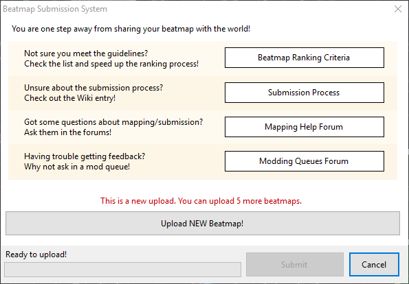
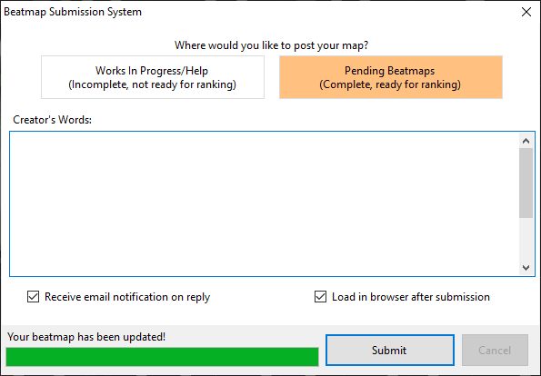

# 提交

[谱面](/wiki/Beatmap)可以通过[谱面编辑器](/wiki/Beatmap_Editor)提交至 osu! 网站。提交谱面可以使其他用户注意到该谱面，且该谱面可能会标记为 [Ranked](/wiki/Beatmap/Category#ranked) 或 [Loved](/wiki/Beatmap/Category#loved)。

在编辑器内的`文件`下拉列表中选择`上传地图...`（快捷键：`Ctrl` + `Shift` + `U`）会打开**谱面提交系统**（***Beatmap Submission System***，简写为***BSS***）窗口。窗口首先会列出帮助用户解决做图相关的问题、寻求谱面的反馈以及确保地图合理的资源。若在使用系统时遇到问题，请参阅指南[如何解决谱面提交系统的问题](/wiki/Guides/BSS_Issues)。

如果用户上传的谱面还没有提交至 osu! 网站，窗口会提示用户可以再上传多少张地图。若谱面已被提交，窗口会警告上传地图会使谱面重置。若谱面已成为坟图，窗口会警告谱面将会改变为 pending 状态。

## 提交选项

点击`上传新的地图！`或`更新地图！`按钮后，用户可以选择将他们上传的谱面标记为 `Work In Progress/Help` 或 `Pending Beatmaps`。标记为 WIP 的谱面不能改变排名状态，但 pending 的谱面可以。

`作者的话`部分可以输入在谱面介绍页上显示的描述，其支持使用 [BBCode](/wiki/BBCode) 格式。

窗口底部有两个复选框。第一个是`当有回复的时候，发送邮件通知我`，其会将谱面加入到用户的[谱面关注列表](https://osu.ppy.sh/beatmapsets/watches)。第二个是`提交后从浏览器打开`，其会在上传后使用默认浏览器打开谱面介绍页。

## 限制

若谱面超过了线上文件的最大大小或难度数量，则会上传失败。文件最大大小为：基础为5MB，谱面长度的每分钟会额外增加10MB，最高为100MB。难度数量目前最高为128。

用户上传的待处理谱面有数量限制。这个限制受用户拥有多少个 Ranked 谱面和当前是否为 [osu!supporter](/wiki/osu!supporter) 影响。不是 osu!supporter 的用户最多可以上传 4 个待处理谱面，每个 Ranked 谱面额外增加 1 个（上限为2），总共至多 6 张。若是 osu!supporter 则增加至最多可以上传 8 个待处理谱面，每个 Ranked 谱面额外增加 1 个（上限为12），总共至多 20 张。

上传速度受文件的改动影响。若只有 `.osu` 文件被改动，则只有这个文件在谱面文件夹中会被处理及上传。若其他文件也被改动，则所有的文件将在谱面文件夹中被处理及上传。
