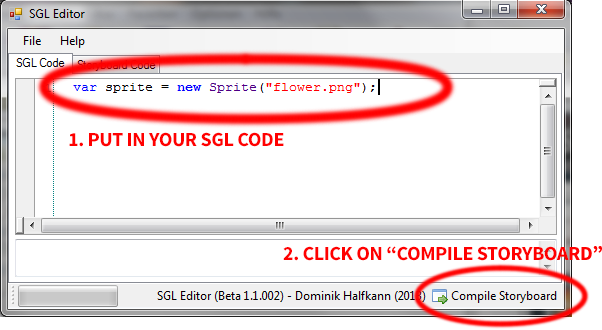
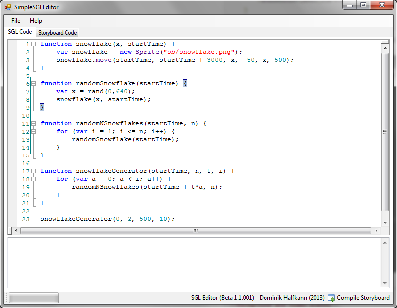
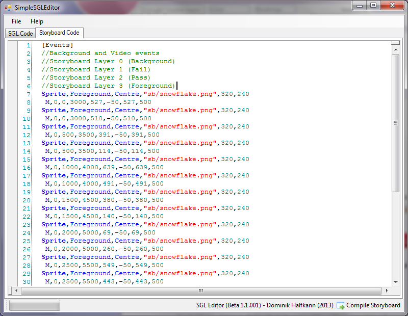

SGL Tool
===========

>peppy asked me/encouraged me a long long while ago to built SGL with C\# so it can be built in osu! once it is somewhat usable in a productive environment. In this time, I almost finished the project, then lost interest and had lot of other things on the go and long story short, I now want this project to move forward again. This project is somewhat related to my old SGL, but I built everything from scratch, changed the language a lot and used other technologies to built this tool, so I think a new topic for this is needed.

**SGL** means "**S**toryboard **G**eneration **L**anguage", it's a programming language with the only purpose of it is to produce storyboard code - both simple storyboard and very complicated ones. What's basically better about SGL than scripting everything by hand? Well, I guess you can't write thousands lines of storyboard code all by yourself now, can you? Also it's very easy to change many parameters at once if you code wisely. 

Video Tutorial
--------------

[SGL Tutorial - Snow Falling](https://youtu.be/s8CCIXMx3-c)

Downloads
---------

*We regret to inform you that the original listed download links were dead! :(* (but you can use this one instead!)

-   [MoonShade/osu-sgl](https://github.com/Damnae/osu-sgl/releases)

You should also check these out too!

-   [Source Code](https://github.com/MoonShade/osu-sgl/)
-   [List of bugs and planned improvements](https://github.com/MoonShade/osu-sgl/issues?state=open)

Examples of SGL code
----------------------

Please feel free to use it, improve it and copy it under the terms of [GPL 3.0](http://www.gnu.org/licenses/gpl.html)

And now for the important part: I need people to help improve this tool by pointing out errors, saying what they would like to see implemented. If you come across an "Unexpected Exception" or other errors apart from your coding mistakes of course, please report that in this thread or via PM! I'm thankful for any feedback from you guys! If you think you know what this tool needs which isn't already implemented or planned, please tell me!

Also, if you have a great SGL script which you think needs sharing, post/PM. And of couse you can write here or ask via PM for any questions you might have using this tool. I hope it will be useful :)

Known Issues
------------

that hopefully will be fixed in the next release:

-   Compiler blocks UI
-   Several Bugs, see Bug List

Trivia
--------

- [*The new SGL Tool (Beta) - Generate Storyboards* by: MoonShade](https://osu.ppy.sh/forum/t/118733)
