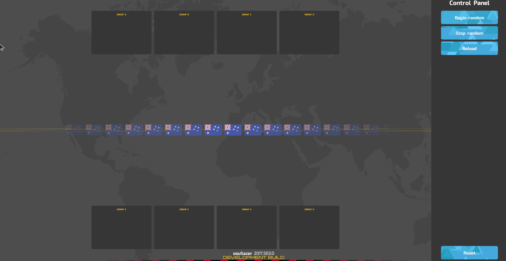

<!-- TODO: lazer updated tournaments since this article was written -->

# Tournament drawings

The tournament drawings screen is used to livestream the sorting of teams into groups that will compete in the group stages for a tournament. It is only available in the [osu!lazer](https://github.com/ppy/osu/releases) client.

Please note that the osu!lazer client is currently under development and there may be bugs.

## Accessing The Client

Open osu!lazer and press `Ctrl + O` to reveal the game settings. From there, click "Open osu! folder". Create the following two files in this directory:  
`drawings.ini`  
`drawings.txt`  
Next, add the following line to the `drawings.txt` file:  
`AU : Australia : AUS`

The drawings screen is now ready to be previewed. It is important to understand how the drawings screen looks and acts before modifying each of these files further.

### Usage

From the main menu, press `Ctrl + Shift + D` to access the drawings screen. The following should appear:


There are two sections to this screen - the main section on the left with the world map as a background, and the control panel section on the right. Please **avoid** livestreaming the control panel.

There are 4 buttons in the control panel, let's go over them:

- **Begin random**
  - This will start the randomization process, causing the flags on the screen to scroll.
- **Stop random**
  - This will stop the randomization process, causing the scrolling to slow down until eventually stopping and centering on a flag in the middle of the screen.
- **Reload**
  - This will reload the `drawings.txt` file.
- **Reset**
  - This button should rarely be used. It is destructive and will reset the results of the drawings process.

Press the `Begin random` and the `Stop random` buttons. When the scrolling stops on a flag at the centre of the screen, go back to the osu! folder and notice that there is now an additional file created: `drawings_results.txt`.  
Open the file and observe the format - this is where the results of the drawings process are stored, and should be imported into further tools to assist in managing the tournament, such as Google Spreadsheets.  
**Please make sure to save the `drawings_results.txt` file in a safe location before pressing the Reset button otherwise it will be destroyed!**

### Configuration

A tournament may not desire as many as 8 groups, and likewise may not desire 8 teams per group. The `drawings.ini` file is a configuration file that allows the adjustment of such properties.
A valid configuration file looks like:
```
Groups = 4
TeamsPerGroup = 4
```

The following are properties which are configurable through this file:

| Property | Description | Valid Values | Default Value |
| :-- | :-- | :-- | :-- |
| Groups | The number of groups to sort teams into. | Between 1 and 8 (inclusive) | 8 |
| TeamsPerGroup | The maximum number of teams in any one group. | Between 1 and 8 (inclusive) | 8 |

### Defining Teams

The `drawings.txt` file provides a way to specify the teams that will be sorted into groups on separate lines. An example line is the following:  
`AU : Australia : AUS`  
This line has three sections separated by a colon (`:`):

| Flag Name | Full Team Name | Team Acronym |
| :-: | :-: | :-: |
| AU | Australia | AUS |

- The flag name refers to the name of a file that provides the flag image. By default, osu!lazer provides country flags as [ISO 3166 Alpha-2 Country Codes](https://www.iso.org/iso-3166-country-codes.html).
- The full team name is displayed in the centre of the screen when a team is selected through the scrolling process.
- The team acronym is displayed in the group boxes.


A valid `drawings.txt` file with multiple countries as teams is:
```
AU : Australia : AUS
RO : Romania : RO
IT : Italy : IT
US : United States of America : USA
```

To define a custom flag, go back to the osu! folder containing the `drawings.ini` file and inside it create the folder `Flags`. Custom flag image files can be placed inside the Flags folder. For example if the file `my-flag-file.png` was placed inside the Flags folder, then a valid line that can be added to the `drawings.txt` file is:  
`my-flag-file : My Team : MT`

The optimal resolution for flag images is 70x47 pixels (or the same aspect ratio).

### Seeding

It may be desirable to "seed" teams. In this case multiple `drawings.txt` files can be hotswapped with the aid of the Reload button in the control panel.

## Questions?

Please don't hesitate to contact `tournaments@ppy.sh` if there are any further usage questions.
