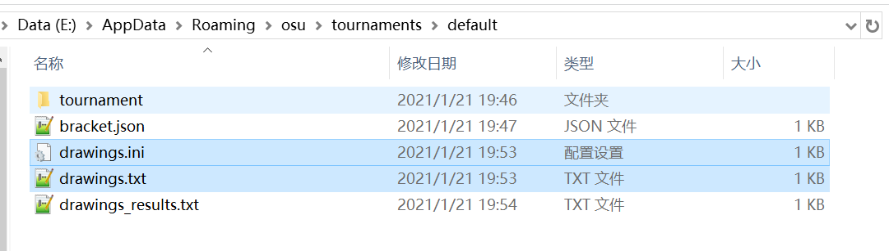
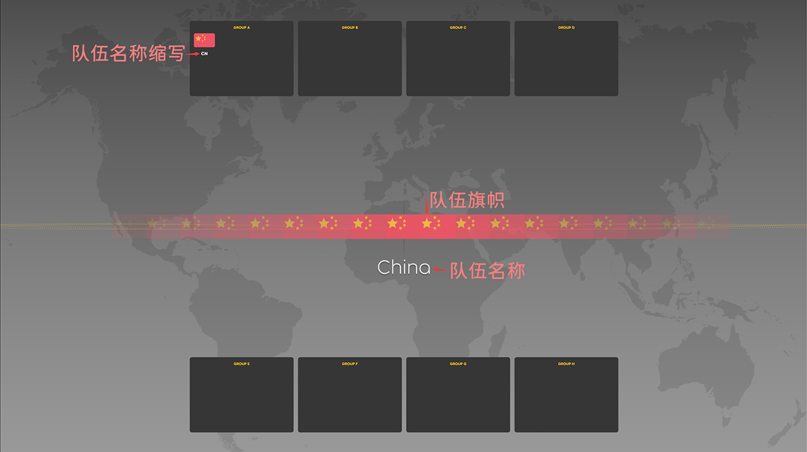
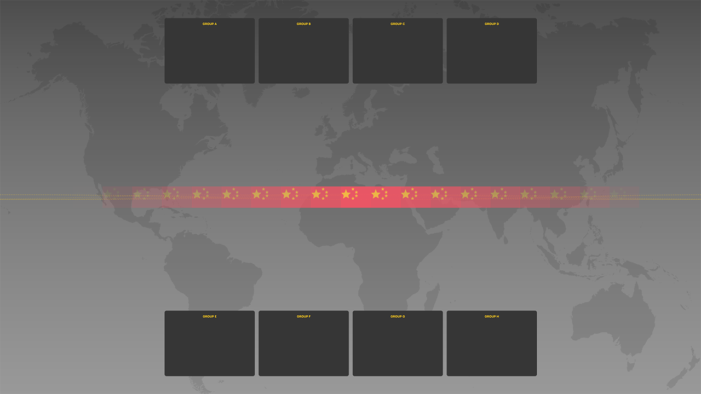

<!-- lazer在持续更新，所以请记得更新！ 最后更新日期2021年1月 -->

# 比赛抽签

有些锦标赛可能包括小组赛阶段。在 [osu!lazer比赛端](/wiki/osu!lazer/tournament_client) 中，可以利用比赛抽签系统对小组赛的分组仪式进行现场直播。

*注意：* osu!lazer *仍然处于开发阶段，因此难免会出现程序上的漏洞。*

## 进入比赛抽签界面

你需要先打开 [osu!lazer](https://github.com/ppy/osu/releases) ，按下`Ctrl + O`进入设置侧边栏，再按下 `打开游戏目录（Open osu! folder）` 进入 osu!lazer 的目录，并在 `osu!lazer\tournaments\####（当前比赛名称，默认为 default ）` 文件夹下创建两个文件： `drawings.ini` 和 `drawings.txt` 。如图所示：
然后添加新的一行到` drawings.txt`：
`CN : China : CN`

请注意格式，每个英文分号前后都有一个空格隔开。第一个是旗帜简写，如中国的CN，澳大利亚的AU等。第二个是队伍名称，第三个则是抽签完毕后显示在组中的缩写。效果如下图所示：

### 用法

如果以上步骤无误，打开你的 osu!lazer 比赛端，点击 `抽签（Drawings）`就可以查看到如图所示的界面：

屏幕左右都有控制面板，直播时尽量**避免**把控制面板区域录进去。左侧设置请参考 [osu!lazer 比赛端](/wiki/osu!lazer/tournament_client) ，右侧设置则有以下按钮：

- **开始抽签（Begin random）**
  - 按下这个会开始抽签，所有未分配的队旗都会在屏幕中间滚动。
- **停止抽签（Stop random）**
  - 按下这个后，屏幕滚动会缓慢停止。屏幕正中央的队伍则被抽中，并被分配进小组。
- **重新加载（Reload）**
  - 会重新载入`drawings.txt`文件的内容。
- **清除结果（Reset）**
  - 这个按钮应该不常用，会清空之前记录的抽签结果。

准备工作都做好了，接下来先按下 `开始抽签`，此时，队旗开始滚动。再按下 `停止抽签` 即可抽出队伍。完成抽签后，在 `osu!lazer\tournaments\####（当前比赛名称，默认为 default）` 文件夹中会多出一个叫 `drawings_results.txt` 的文件，这里面记录着抽签的结果。接下来就可以自行利用结果去做你想做的事了。
**请记住，一定要妥善保存抽签结果文件。如果不保存，按下 `清除结果` 按钮后，抽签结果将会消失！**

### 队伍配置

`drawings.ini` 文件是用于设置队伍数量及队伍人数的，毕竟有些比赛可能不足8支队伍，单支队伍的人数也可能不足8人。一个有效的配置文件应该是这样的：

```
Groups = 4
TeamsPerGroup = 4
```

里面的设置很简单：
| 设置名 | 解释 | 范围 | 默认值 |
| :- | :- | :- | :- |
| Groups | 队伍总数 | 1~8 | 8 |
| TeamsPerGroup | 单支队伍的人数 | 1~8 | 8 |

### 队伍信息

`drawing.txt` 文件是用于记录队伍信息的。如：
`CN : China : CN`
这一行有三个被英文冒号（:）分隔的部分：

| 队旗缩写 | 队伍名称 | 队名缩写 |
| :-: | :-: | :-: |
| CN | China | CN |

- 在 osu!lazer 中，队旗缩写和队旗图案是根据 [ISO 3166 Alpha-2 Country Codes](https://www.iso.org/iso-3166-country-codes.html) 标准提供的。
- 被抽中的队伍名称会在停止抽签后显示于该队旗下方。
- 每轮抽签结束后，被抽中的队伍会自动被分配至上下的小组框中，此时，队旗下的队伍名称会变更为显示队名缩写。


如果参赛队伍均为国家或地区队，那么文件应该是：

```
AU : Australia : AUS
RO : Romania : RO
IT : Italy : IT
US : United States of America : USA
```

如果想使用自定义队旗，请在 `osu!lazer\tournaments\####（当前比赛名称，默认为 default）` 目录下创建一个名为 `Flags` 的文件夹。并将自定义队旗图片放于其中，如一张名为 `my-flag.png` 的图片，那么就可以在 `drawing.txt` 文件中添加如下一行：
`my-flag : My Team : MT`

队旗的最佳分辨率为 70x47 像素（相同比例放大亦可）。

### 按队伍分级抽签（Seeded teams）

osu!lazer 支持按队伍分级抽签。可以通过使用多份 `drawing.txt` 文件，并点击 `重新加载` 实现。

## 有疑问？

若有任何使用上的疑问或建议，请务必联系 `tournaments@ppy.sh` 。
