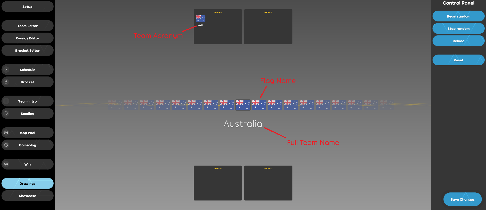

# Tournament drawings

The tournament drawings screen is used to livestream the sorting of teams into groups that will compete in the group stages for a tournament. It is only available in [osu!(lazer)](/wiki/Client/Release_stream/Lazer).

Please note that the osu!(lazer) client is currently under development and there may be bugs.

## Accessing The Client

*For detailed steps about running and setting the osu! tournament client up, see: [osu! tournament client](/wiki/osu!_tournament_client#setup)*

If you never used the osu! tournament client before, open it once by creating a shortcut on the desktop, whose location is set to `%LOCALAPPDATA%/osulazer/osu!.exe --tournament`.

After that, a directory called `default` should be created inside `%APPDATA%/osu/tournaments`, which is the tournament storage folder for osu!(lazer). Create the following two files in this directory:

```
drawings.ini
drawings.txt
```

Next, add the following line to the `drawings.txt` file:

```
AU : Australia : AUS
```

Then restart the tournament client, and ensure `default` is selected as the current tournament in the setup screen.

The drawings screen is now ready to be previewed. It is important to understand how the drawings screen looks and acts before modifying each of these files further.

### Usage

Start the osu! tournament client, and press the `Drawings` button in the left sidebar to access the drawings screen. The following should appear:


There are three sections to this screen: the sidebar on the left, the main section, and the control panel section on the right. Please **avoid** livestreaming the sidebar and the control panel.

There are 4 buttons in the control panel, let's go over them:

- **Begin random**
  - This will start the randomisation process, causing the flags on the screen to scroll.
  - The flags would scroll only when there is any team remaining to be grouped.
- **Stop random**
  - This will stop the randomisation process, causing the scrolling to slow down until eventually stopping and centring on a flag in the middle of the screen.
- **Reload**
  - This will reload the `drawings.txt` file.
- **Reset**
  - This button should rarely be used. It is destructive and will reset the results of the drawings process.

Press the `Begin random` and the `Stop random` buttons. When the scrolling stops on a flag at the centre of the screen, go back to the tournament folder and notice that an additional file has been created, called `drawings_results.txt`.

Open the file and observe the format — this is where the results of the drawings process are stored, and should be imported into further tools to assist in managing the tournament, such as Google Spreadsheets.

**Please make sure to save the `drawings_results.txt` file in a safe location before pressing the Reset button, otherwise its content will be cleared!**

### Configuration

A tournament may not desire as many as 8 groups, and likewise may not desire 8 teams per group. The `drawings.ini` file is a configuration file that allows the adjustment of such properties.
A valid configuration file looks like:

```
Groups = 4
TeamsPerGroup = 4
```

The following are properties which are configurable through this file:

| Property | Description | Valid Values | Default Value |
| :-- | :-- | :-- | :-- |
| `Groups` | The number of groups to sort teams into. | Between 1 and 8 (inclusive) | 8 |
| `TeamsPerGroup` | The maximum number of teams in any one group. | Between 1 and 8 (inclusive) | 8 |

### Defining Teams

The `drawings.txt` file provides a way to specify the teams that will be sorted into groups on separate lines. An example line is the following:

```
AU : Australia : AUS
```

This line has three sections separated by a colon (`:`):

| Flag Name | Full Team Name | Team Acronym |
| :-: | :-: | :-: |
| AU | Australia | AUS |

- The flag name refers to the name of a file that provides the flag image. By default, osu!(lazer) provides country flags as [ISO 3166 Alpha-2 Country Codes](https://www.iso.org/iso-3166-country-codes.html).
- The full team name is displayed in the centre of the screen when a team is selected through the scrolling process.
- The team acronym is displayed in the group boxes.



A valid `drawings.txt` file with multiple countries as teams is:

```
AU : Australia : AUS
RO : Romania : RO
IT : Italy : IT
US : United States of America : USA
```

To define a custom flag, go back to the folder containing the `drawings.ini` file and create the folder `Flags` inside it. Custom flag image files can be placed inside this folder. For example if the file `my-flag-file.png` was placed inside the `Flags` folder, then a valid line that can be added to the `drawings.txt` file is:

```
my-flag-file : My Team : MT
```

The optimal resolution for flag images is 70x47 pixels (or the same aspect ratio).

### Seeding

It may be desirable to "seed" teams. In this case multiple `drawings.txt` files can be hotswapped with the aid of the `Reload` button in the control panel.

## Questions?

Please don't hesitate to contact `tournaments@ppy.sh` if there are any further usage questions.
