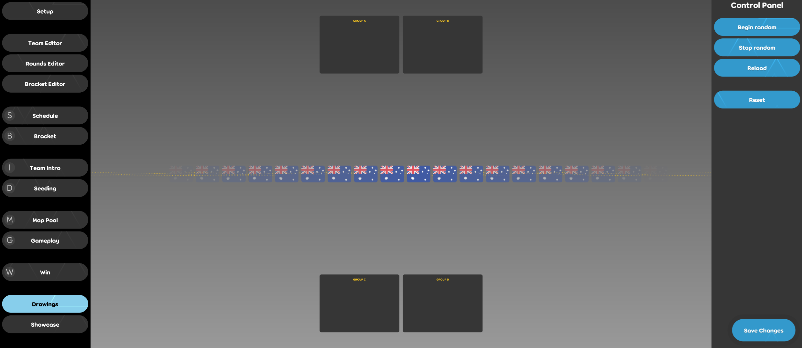

<!-- there are small differences with EN that should be fixed. compare line numbers with EN to find those differences easily. -->

# Pengundian Turnamen

Layar pengundian turnamen digunakan untuk menyiarkan berbagai tim ke dalam kelompok-kelompok yang akan bersaing di babak grup untuk sebuah turnamen. Untuk saat ini hanya tersedia di klien [osu!(lazer)](/wiki/Client/Release_stream/Lazer).

Harap perhatikan bahwa klien osu!(lazer) saat ini sedang dalam masa pengembangan dan berkemungkinan akan bertemu bug.

## Mengakses Klien

Buka osu!(lazer) dan tekan `Ctrl + O` untuk memperlihatkan pengaturan permainan. Dari sana, klik "Buka folder osu!". Buat dua file berikut di direktori ini:

```
drawings.ini
drawings.txt
```

Selanjutnya, tambahkan baris berikut ke file `drawings.txt`:

```
AU : Australia : AUS
```

Layar pengundian sekarang siap untuk dipratinjau. Pemahaman mengenai bagaimana tampilan layar pengundian beserta fungsi-fungsinya menjadi poin penting sebelum mulai memodifikasi masing-masing file ini lebih lanjut.

### Penggunaan

Dari menu utama, tekan `Ctrl + Shift + D` untuk mengakses layar pengundian. Jika melakukannya dengan benar, akan muncul:


Terdapat dua bagian di layar ini - bagian utama di sebelah kiri dengan peta dunia sebagai latar belakang layar pengundian, dan bagian panel kontrol di sebelah kanan. Mohon untuk **tidak** menyorot panel kontrol saat siaran berlangsung.

Ada 4 tombol di panel kontrol, mari kita bahas lebih lanjut:

- **Begin random**
  - Tombol ini akan memulai proses pengacakan, membuat bendera yang berada di layar pengundian akan bergulir.
- **Stop random**
  - Tombol ini akan menghentikan proses pengacakan, membuat pengacakan melambat sampai akhirnya berhenti dan berpusat pada bendera yang berada di tengah layar.
- **Reload**
  - Tombol ini akan memuat ulang file `drawings.txt`.
- **Reset**
  - Tombol ini jarang digunakan. Tombol ini bersifat merusak dan akan mengatur ulang hasil proses pengundian.

Tekan tombol `Begin random` dan `Stop random`. Saat pengacakan berhenti di bendera yang berada di tengah layar, kembali ke folder osu! dan perhatikan bahwa sekarang ada file tambahan yang dibuat: `drawings_results.txt`.
Buka file tambahan tadi dan amati format - disinilah tempat hasil proses pengundian disimpan, dan harus diimpor ke alat lebih lanjut untuk membantu dalam mengelola turnamen, seperti google Spreadsheets.

**Pastikan untuk menyimpan file `drawings_results.txt` di lokasi yang aman sebelum menekan tombol Reset, jika tidak maka file akan hilang!**

### Konfigurasi

Sebuah turnamen mungkin tidak menginginkan grup sebanyak 8 grup, dan juga mungkin tidak menginginkan 8 tim per grup. File `drawings.ini` adalah file konfigurasi yang memungkinkan penyesuaian properti tersebut.
File konfigurasi yang valid, akan terlihat seperti:

```
Groups = 4
TeamsPerGroup = 4
```

Berikut ini adalah properti yang dapat dikonfigurasi melalui file ini:

| Properti | Deskripsi | Nilai yang Valid | Nilai Bawaan |
| :-- | :-- | :-- | :-- |
| Groups | Jumlah grup yang akan disediakan. | Antara 1 dan 8 (termasuk) | 8 |
| TeamsPerGroup | Jumlah maksimum tim dalam satu grup. | Antara 1 dan 8 (termasuk) | 8 |

### Mendefinisikan Tim

File `drawings.txt` menyediakan cara untuk menentukan tim yang akan disortir ke dalam grup pada baris terpisah. Contoh adalah baris berikut:

```
AU : Australia : AUS
```

Baris ini memiliki tiga bagian yang dipisahkan oleh titik dua (`:`):

| Kode Bendera | Nama Lengkap Tim | Akronim Tim |
| :-: | :-: | :-: |
| AU | Australia | AUS |

- Kode bendera mengacu pada nama file yang menyediakan gambar bendera. Secara bawaan, osu!(lazer) menyediakan format bendera negara dari [Kode Bendera ISO 3166 Alpha-2](https://www.iso.org/iso-3166-country-codes.html).
- Nama lengkap tim ditampilkan di tengah layar ketika tim dipilih melalui proses pengundian.
- Akronim tim ditampilkan dalam kotak grup.


File `drawings.txt` yang valid dengan beberapa negara sebagai tim adalah sebagai berikut:

```
AU : Australia : AUS
RO : Romania : RO
IT : Italia : IT
US : Amerika Serikat : USA
```

Untuk menambahkan bendera kustom, kembali ke folder osu! yang berisi file `drawings.ini`, buat folder `Drawings`, dan di dalamnya buat kembali folder dengan nama `Flags` sedemikian rupa sehingga hierarki folder `osu/Drawings/Flags/` dibuat.

File gambar bendera kustom dapat ditempatkan di dalam folder `Flags`. Sebagai contoh jika file `my-flag-file.png` ditempatkan di dalam folder `Flags`, maka baris valid yang dapat ditambahkan ke dalam file `drawings.txt` adalah:

```
my-flag-file : My Team : MT
```

Resolusi optimal untuk gambar bendera adalah 70x47 pixels (atau rasio aspek yang sejenis).

### Pemisahan Tingkat

Mungkin akan lebih disarankan untuk memisahkan tim berdasarkan tingkat kemampuan. Dalam hal ini, beberapa file `drawings.txt` dapat ditukar-tukar dengan bantuan tombol Reload pada panel kontrol.

## Pertanyaan?

Jangan ragu untuk menghubungi `tournaments@ppy.sh` jika ada pertanyaan penggunaan lebih lanjut.
