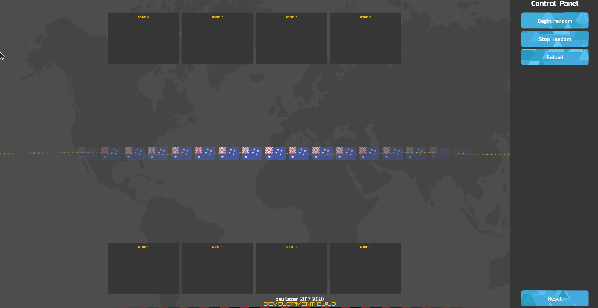
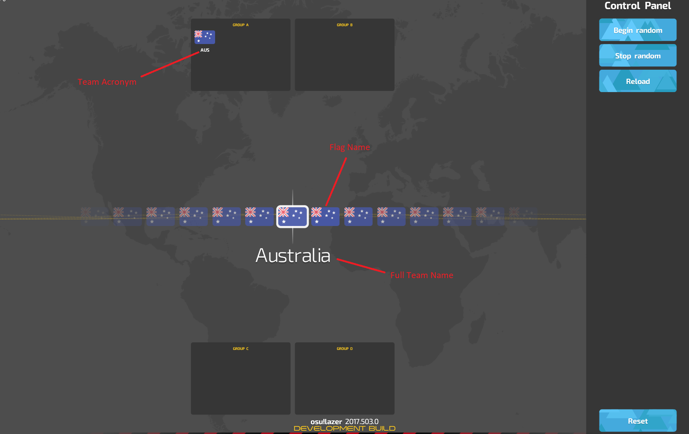

# Tournament drawings

หน้าจอ tournament drawings ใช้สำหรับ livestream การสุ่มจัดทีมลงกลุ่มที่จะไปแข่งใน group stage ของทัวร์นาเมนต์ ฟีเจอร์นี้มีเฉพาะใน [osu!(lazer)](/wiki/Client/Release_stream/Lazer)

โปรดทราบว่า client osu!(lazer) ยังอยู่ระหว่างการพัฒนา และอาจมี bug ได้

## การเข้าถึง Client

*สำหรับขั้นตอนละเอียดเกี่ยวกับการรันและตั้งค่า osu! tournament client ดูที่: [osu! tournament client](/wiki/osu!_tournament_client#setup)*

ถ้าคุณไม่เคยใช้ osu! tournament client มาก่อน ให้เปิดมันหนึ่งครั้งด้วยการสร้าง shortcut บน desktop โดยตั้ง location เป็น `%LOCALAPPDATA%/osulazer/osu!.exe --tournament`

หลังจากนั้น ควรมี directory ชื่อ `default` ถูกสร้างขึ้นใน `%APPDATA%/osu/tournaments` ซึ่งเป็นโฟลเดอร์เก็บ tournament ของ osu!(lazer) ให้สร้างไฟล์สองไฟล์ต่อไปนี้ใน directory นี้:

```
drawings.ini
drawings.txt
```

จากนั้นเพิ่ม line ต่อไปนี้ลงในไฟล์ `drawings.txt`:

```
AU : Australia : AUS
```

แล้ว restart tournament client และตรวจให้แน่ใจว่าเลือก `default` เป็น tournament ปัจจุบันในหน้าจอ setup

ตอนนี้หน้าจอ drawings พร้อม preview แล้ว สิ่งสำคัญคือต้องเข้าใจว่าหน้าจอ drawings มีหน้าตาและทำงานอย่างไร ก่อนจะแก้ไขไฟล์เหล่านี้เพิ่มเติม

### การใช้งาน

เริ่ม osu! tournament client แล้วกดปุ่ม `Drawings` ใน sidebar ด้านซ้ายเพื่อเข้าหน้าจอ drawings คุณควรเห็นหน้าจอต่อไปนี้:



หน้าจอนี้มีสามส่วน: sidebar ด้านซ้าย, ส่วนหลัก และ control panel ด้านขวา โปรด **หลีกเลี่ยง** การ livestream sidebar และ control panel

control panel มี 4 ปุ่ม มาดูกันทีละปุ่ม:

- **Begin random**
  - เริ่มกระบวนการสุ่ม ทำให้ flag บนหน้าจอเลื่อน
  - flag จะเลื่อนเฉพาะเมื่อยังมีทีมเหลือให้จัดกลุ่ม
- **Stop random**
  - หยุดกระบวนการสุ่ม ทำให้การเลื่อนช้าลงจนหยุดในที่สุด และจัด flag ไว้ตรงกลางหน้าจอ
- **Reload**
  - reload ไฟล์ `drawings.txt`
- **Reset**
  - ปุ่มนี้ควรใช้น้อยมาก เป็นการกระทำแบบ destructive และจะ reset ผลลัพธ์ของกระบวนการ drawings

กดปุ่ม `Begin random` และ `Stop random` เมื่อการเลื่อนหยุดบน flag ตรงกลางหน้าจอ ให้กลับไปที่โฟลเดอร์ tournament แล้วสังเกตว่าจะมีไฟล์เพิ่มเติมถูกสร้างขึ้นชื่อ `drawings_results.txt`

เปิดไฟล์และดู format ของมัน นี่คือที่เก็บผลลัพธ์ของกระบวนการ drawings และควรถูก import ไปยัง tool อื่นเพื่อช่วยจัดการทัวร์นาเมนต์ เช่น Google Spreadsheets

**กรุณาแน่ใจว่าได้บันทึกไฟล์ `drawings_results.txt` ไว้ในที่ปลอดภัยก่อนกดปุ่ม Reset ไม่อย่างนั้นเนื้อหาในไฟล์จะถูกล้าง!**

### Configuration

บางทัวร์นาเมนต์อาจไม่ต้องการมากถึง 8 กลุ่ม และเช่นเดียวกัน อาจไม่ต้องการ 8 ทีมต่อกลุ่ม ไฟล์ `drawings.ini` เป็นไฟล์ configuration ที่ใช้ปรับคุณสมบัติเหล่านี้
ไฟล์ configuration ที่ถูกต้องจะหน้าตาแบบนี้:

```
Groups = 4
TeamsPerGroup = 4
```

ต่อไปนี้คือ property ที่ตั้งค่าได้ผ่านไฟล์นี้:

| Property | Description | Valid Values | Default Value |
| :-- | :-- | :-- | :-- |
| `Groups` | จำนวนกลุ่มที่จะจัดทีมลงไป | ระหว่าง 1 ถึง 8 (รวมสองค่านี้) | 8 |
| `TeamsPerGroup` | จำนวนทีมสูงสุดในแต่ละกลุ่ม | ระหว่าง 1 ถึง 8 (รวมสองค่านี้) | 8 |

### การกำหนดทีม

ไฟล์ `drawings.txt` ใช้ระบุทีมที่จะถูกจัดเข้ากลุ่ม โดยแยกแต่ละทีมเป็นคนละ line ตัวอย่าง line คือ:

```
AU : Australia : AUS
```

line นี้มีสามส่วนที่คั่นด้วย colon (`:`):

| Flag Name | Full Team Name | Team Acronym |
| :-: | :-: | :-: |
| AU | Australia | AUS |

- flag name หมายถึงชื่อไฟล์ที่ใช้เป็นรูป flag โดยค่าเริ่มต้น osu!(lazer) มี flag ประเทศเป็น [ISO 3166 Alpha-2 Country Codes](https://www.iso.org/iso-3166-country-codes.html)
- full team name จะแสดงตรงกลางหน้าจอเมื่อทีมถูกเลือกผ่านกระบวนการเลื่อน
- team acronym จะแสดงในกล่องกลุ่ม



ไฟล์ `drawings.txt` ที่ถูกต้องพร้อมหลายประเทศเป็นทีมจะเป็น:

```
AU : Australia : AUS
RO : Romania : RO
IT : Italy : IT
US : United States of America : USA
```

หากต้องการกำหนด flag แบบ custom ให้กลับไปที่โฟลเดอร์ที่มีไฟล์ `drawings.ini` แล้วสร้างโฟลเดอร์ `Flags` ไว้ด้านใน สามารถวางไฟล์รูป custom flag ไว้ในโฟลเดอร์นี้ได้ ตัวอย่างเช่น ถ้าไฟล์ `my-flag-file.png` ถูกวางไว้ในโฟลเดอร์ `Flags` line ที่ถูกต้องซึ่งเพิ่มลงในไฟล์ `drawings.txt` ได้คือ:

```
my-flag-file : My Team : MT
```

resolution ที่เหมาะสมสำหรับรูป flag คือ 70x47 pixel (หรือ aspect ratio เดียวกัน)

### Seeding

บางครั้งอาจต้องการ "seed" ทีม ในกรณีนี้สามารถ hotswap ไฟล์ `drawings.txt` หลายไฟล์ได้ด้วยความช่วยเหลือของปุ่ม `Reload` ใน control panel

## มีคำถาม?

หากมีคำถามเพิ่มเติมเกี่ยวกับการใช้งาน โปรดอย่าลังเลที่จะติดต่อ `tournaments@ppy.sh`
