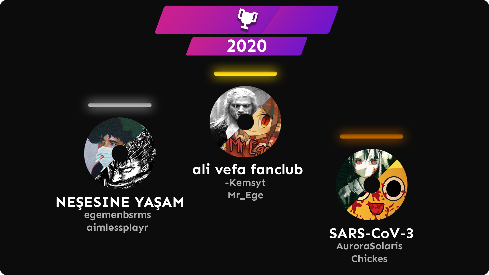

---
tags:
  - 112servis
  - 112CT
  - 112 Corona
---

# 112's Corona Tournament

The **112's Corona Tournament** (***112CT***) was a double-elimination 2v2 osu! tournament started with qualifiers hosted by ::{ flag=TR }:: [112servis](https://osu.ppy.sh/users/3953470) and ::{ flag=TR }:: [Sibyl](https://osu.ppy.sh/users/10440852). The tournament was only allowed for Turkish-speaking users regardless of their country flags. This was the fifth instalment of 112's Tournaments series.

## Tournament schedule

| Event | Timestamp |
| --: | :-- |
| Registration phase | 2020-03-31/2020-04-08 |
| Qualifiers | 2020-04-09/2020-04-12 |
| Round of 16 | 2020-04-18/2020-04-20 |
| Quarterfinals | 2020-07-25/2020-07-27 |
| Semifinals | 2020-05-02/2020-05-04 |
| Finals | 2020-05-08/2020-05-10 |
| Grand Finals | 2020-05-23/2020-05-30 |

## Prizes

| Placing | Prize |
| :-: | :-- |
|  | 1 month of osu!supporter |

## Organisation

The 112's Corona Tournament was run by various community members.

| Position | Member(s) |
| :-- | :-- |
| Organizer | ::{ flag=TR }:: [112servis](https://osu.ppy.sh/users/3953470), ::{ flag=TR }:: [Sibyl](https://osu.ppy.sh/users/10440852) |
| Mappool selector | ::{ flag=TR }:: [112servis](https://osu.ppy.sh/users/3953470), ::{ flag=TR }:: [Entry](https://osu.ppy.sh/users/10213311), ::{ flag=NL }:: [iepie122](https://osu.ppy.sh/users/12235433), ::{ flag=TR }:: [mezelyus](https://osu.ppy.sh/users/5938859), ::{ flag=CA }:: [Sansnaka](https://osu.ppy.sh/users/5543535) |
| Referee | ::{ flag=TR }:: [112servis](https://osu.ppy.sh/users/3953470), ::{ flag=TR }:: [Coderbora](https://osu.ppy.sh/users/11873333), ::{ flag=TR }:: [Entry](https://osu.ppy.sh/users/10213311), ::{ flag=TR }:: [Hazar](https://osu.ppy.sh/users/6364554), ::{ flag=TR }:: [heyronii](https://osu.ppy.sh/users/5642779), ::{ flag=NL }:: [goeo_](https://osu.ppy.sh/users/6832107), ::{ flag=TR }:: [LeBoum](https://osu.ppy.sh/users/8700026), ::{ flag=TR }:: [ozge1907](https://osu.ppy.sh/users/6511453), ::{ flag=TR }:: [Sibyl](https://osu.ppy.sh/users/10440852), ::{ flag=DE }:: [takoz53](https://osu.ppy.sh/users/2214428), ::{ flag=TR }:: [tingirmin](https://osu.ppy.sh/users/9027514), ::{ flag=TR }:: [We0l](https://osu.ppy.sh/users/13196066) |
| Streamer | ::{ flag=TR }:: [112servis](https://osu.ppy.sh/users/3953470), ::{ flag=TR }:: [HakoFixed](https://osu.ppy.sh/users/7188447) |
| Commentator | ::{ flag=TR }:: [112servis](https://osu.ppy.sh/users/3953470), ::{ flag=TR }:: [heyronii](https://osu.ppy.sh/users/5642779), ::{ flag=TR }:: [mezelyus](https://osu.ppy.sh/users/5938859), ::{ flag=NL }:: [goeo_](https://osu.ppy.sh/users/6832107) |
| Designer | ::{ flag=TR }:: [Sibyl](https://osu.ppy.sh/users/10440852) |
| Wiki editor | ::{ flag=TR }:: [Zeus-](https://osu.ppy.sh/users/5464437) |

## Links

- [Discussion thread](https://osu.ppy.sh/community/forums/topics/1044086)
- [112's Tournaments Discord server](https://discord.gg/g3nqqeZ)
- [Livestream](https://www.twitch.tv/osu_turkiye)
- [Challonge bracket](https://challonge.com/112korona2020)

## Participants

| Team | Members |
| :-- | :-- |
| .\`\*\*HIDDEN\*\*\`. | ::{ flag=TR }:: [Kizu](https://osu.ppy.sh/users/12940938), ::{ flag=TR }:: [Shinkir0](https://osu.ppy.sh/users/6093148) |
| ( ͡° ͜ʖ ͡°) | ::{ flag=TR }:: [robertvarne](https://osu.ppy.sh/users/11913835), ::{ flag=BE }:: [iblue](https://osu.ppy.sh/users/9184180) |
| 1.yiz kasmayın | ::{ flag=TR }:: [heyronii](https://osu.ppy.sh/users/5642779), ::{ flag=TR }:: [NamDeer](https://osu.ppy.sh/users/10389841) |
| 1deag | ::{ flag=TR }:: [edizberkserbest](https://osu.ppy.sh/users/9256771), ::{ flag=TR }:: [tingirmin](https://osu.ppy.sh/users/9027514) |
| ali vefa fanclub | ::{ flag=TR }:: [Mr\_Ege](https://osu.ppy.sh/users/9542170), ::{ flag=TR }:: [-Kemsyt](https://osu.ppy.sh/users/3170401) |
| ataturj | ::{ flag=TR }:: [Rexin](https://osu.ppy.sh/users/7953720), ::{ flag=TR }:: [He is Batuhan](https://osu.ppy.sh/users/4939723) |
| Bakamitai | ::{ flag=TR }:: [JustBurak](https://osu.ppy.sh/users/4939723), ::{ flag=LT }:: [mamakatas](https://osu.ppy.sh/users/7011187) |
| bucocukamerikalı | ::{ flag=TR }:: [Cynesta](https://osu.ppy.sh/users/8674027), ::{ flag=TR }:: [huckmen444](https://osu.ppy.sh/users/5019334) |
| busu | ::{ flag=TR }:: [MFaik](https://osu.ppy.sh/users/11199222), ::{ flag=TR }:: [Berkk](https://osu.ppy.sh/users/16298931) |
| deneme | ::{ flag=TR }:: [nitromehmet](https://osu.ppy.sh/users/9909537), ::{ flag=TR }:: [haygiya](https://osu.ppy.sh/users/11604012) |
| Easy Bots | ::{ flag=TR }:: [MouseControlV2](https://osu.ppy.sh/users/10307622), ::{ flag=TR }:: [kanna\_kamuisan](https://osu.ppy.sh/users/14728608) |
| EkmekKırıntısı | ::{ flag=TR }:: [velihan33](https://osu.ppy.sh/users/14181899), ::{ flag=US }:: [Avora](https://osu.ppy.sh/users/8986927) |
| Gaz Treni | ::{ flag=TR }:: [Lxran](https://osu.ppy.sh/users/3651081), ::{ flag=TR }:: [SnowLyRain](https://osu.ppy.sh/users/12489717) |
| harumachi clover | ::{ flag=TR }:: [dragonsaga](https://osu.ppy.sh/users/4982690), ::{ flag=TR }:: [empirasu](https://osu.ppy.sh/users/12500084) |
| i may be stupid | ::{ flag=TR }:: [Raikouhou](https://osu.ppy.sh/users/8007528), ::{ flag=TR }:: [Tsuda-](https://osu.ppy.sh/users/6713666) |
| isim bulamadık | ::{ flag=TR }:: [\[-Shadowa-\]](https://osu.ppy.sh/users/1313327), ::{ flag=TR }:: [sentez](https://osu.ppy.sh/users/8816305) |
| K G O O | ::{ flag=TR }:: [Ekrem Imamoglu](https://osu.ppy.sh/users/10801545), ::{ flag=TR }:: [roseacti](https://osu.ppy.sh/users/10518505) |
| kartal.network | ::{ flag=NL }:: [goeo_](https://osu.ppy.sh/users/6832107), ::{ flag=TR }:: [Cyberia950](https://osu.ppy.sh/users/9143539) |
| kms | ::{ flag=TR }:: [Yoani](https://osu.ppy.sh/users/10660282), ::{ flag=TR }:: [mirayno](https://osu.ppy.sh/users/11593174) |
| Mağdurlar | ::{ flag=TR }:: [star1322](https://osu.ppy.sh/users/8128670), ::{ flag=TR }:: [We0l](https://osu.ppy.sh/users/13196066) |
| nE | ::{ flag=TR }:: [Nymphe](https://osu.ppy.sh/users/10507407), ::{ flag=TR }:: [emptypudding](https://osu.ppy.sh/users/11003085) |
| NEŞESİNE YAŞAM | ::{ flag=TR }:: [egemenbsrms](https://osu.ppy.sh/users/4520477), ::{ flag=TR }:: [aimlessplayr](https://osu.ppy.sh/users/4903088) |
| NM | ::{ flag=TR }:: [Koqla](https://osu.ppy.sh/users/12817802), ::{ flag=DE }:: [Skellexon](https://osu.ppy.sh/users/11268328) |
| Plz Enjoy Chiaki | ::{ flag=TR }:: [Plz Enjoy RSI](https://osu.ppy.sh/users/8365050), ::{ flag=TR }:: [Chiaki Nanami-](https://osu.ppy.sh/users/8588336) |
| SARS-CoV-3 | ::{ flag=TR }:: [Chickes](https://osu.ppy.sh/users/5341891), ::{ flag=TR }:: [AuroraSolaris](https://osu.ppy.sh/users/9319605) |
| Team Big Chungus | ::{ flag=TR }:: [pyth0nix](https://osu.ppy.sh/users/10922849), ::{ flag=TR }:: [LeBoum](https://osu.ppy.sh/users/8700026) |
| Traps Not Gay V2 | ::{ flag=TR }:: [CutieDemon](https://osu.ppy.sh/users/6440158), ::{ flag=TR }:: [HakoFixed](https://osu.ppy.sh/users/7188447) |
| uwu | ::{ flag=TR }:: [-Miia-](https://osu.ppy.sh/users/8543307), ::{ flag=TR }:: [-Satella-](https://osu.ppy.sh/users/4890227) |
| Zurna | ::{ flag=TR }:: [Mikatsu](https://osu.ppy.sh/users/6612642), ::{ flag=TR }:: [Coderbora](https://osu.ppy.sh/users/11873333) |
| ﷽﷽﷽﷽﷽﷽﷽﷽﷽﷽﷽﷽﷽﷽﷽﷽ | ::{ flag=TR }:: [Ekin](https://osu.ppy.sh/users/2947405), ::{ flag=TR }:: [ozge1907](https://osu.ppy.sh/users/6511453) |

## Podium

## Mappools

### Finals & Grand Finals

**[Download the map pack here! (143 MB)](https://drive.google.com/uc?id=1sVaWgNQRU6nLrtt4tytYhd7xDZQJToxy&export=download)**

- NoMod
  1. [Suzuki Konomi - Blow out (Kalibe) \[Spell\]](https://osu.ppy.sh/beatmapsets/617203#osu/1629264)
  2. [JUNNA – Kono Yubi Tomare (Atalanta) \[Extra\]](https://osu.ppy.sh/beatmapsets/942476#osu/1975886)
  3. [Eagle – S!ck (den0saur) \[Extreme\]](https://osu.ppy.sh/beatmapsets/868473#osu/1815278)
  4. [xi – Solar Storm (sdafsf) \[Eruption\]](https://osu.ppy.sh/beatmapsets/566408#osu/1226904)
  5. [Pastel\*Palettes – Happy Synthesizer (ktgster) \[Expert\]](https://osu.ppy.sh/beatmapsets/932654#osu/1989147)
- Hidden
  1. [Suzumu – Kakumeisei ousama densenbyou (tutuhaha) \[AngelHoney's Extra\]](https://osu.ppy.sh/beatmapsets/307686#osu/701528)
  2. [Manasora Akiha, Tokika – Toukasa Funtouki!\~ Rakutoferin no Hate e \~ (fanzhen0019) \[Lunatic\]](https://osu.ppy.sh/beatmapsets/43170#osu/137303)
  3. [lapix – Horizon Blue feat. Kanata.N (Mir) \[Real's Extra\]](https://osu.ppy.sh/beatmapsets/974832#osu/2055575)
- HardRock
  1. [REOL – Endless Line (DeRandom Otaku) \[Infinite\]](https://osu.ppy.sh/beatmapsets/706150#osu/1493345)
  2. [Nekomata Master+ – nightbird lost wing (Regou) \[acyl's another\]](https://osu.ppy.sh/beatmapsets/1053490#osu/2204492)
  3. [Morimori Atsushi – Applique (Uta) \[Lonely apple\]](https://osu.ppy.sh/beatmapsets/838366#osu/1755242)
- DoubleTime
  1. [Aki - Darkish (Lortus) \[Light Insane\]](https://osu.ppy.sh/beatmapsets/514965#osu/1097552)
  2. [Amane - exist except (ktgster) \[Beyond\]](https://osu.ppy.sh/beatmapsets/99770#osu/765706)
  3. [Wakamiya Hina (CV: Mikami Shiori), Segawa Ayame (CV: Takamori Natsumi) – Koigokoro Tsunagi (Shirahane Suou) \[Insane\]](https://osu.ppy.sh/beatmapsets/1030225#osu/2154208)
- FreeMod
  1. [System Of A Down - Toxicity (Icekalt) \[Hectic's Extra\]](https://osu.ppy.sh/beatmapsets/1041151#osu/2196360)
  2. [Kinjishi – Nageki no Ki (Matrix) \[Insane\]](https://osu.ppy.sh/beatmapsets/1017760#osu/2130349)
  3. [DragonForce – Ring of Fire (MashaSG) \[Extra\]](https://osu.ppy.sh/beatmapsets/717015#osu/1518059)
- Tiebreaker
  1. **[Traktion - Gid V (EphemeralFetish) \[Fragment Collab\]](https://osu.ppy.sh/beatmapsets/879767#osu/1839789)**

### Semifinals

**[Download the map pack here! (134 MB)](https://drive.google.com/uc?id=1nga7eNy-P94EzdRrw0c7Twi8mdthJTh_&export=download)**

- NoMod
  1. [KISIDA KYODAN & THE AKEBOSI ROCKETS – Fall of Fall (Shirahane Suou) \[Extreme\]](https://osu.ppy.sh/beatmapsets/1084063#osu/2267125)
  2. [Zutto Mayonaka de Ii no ni. – Byoushin o Kamu (Irohas) \[moph's Extra\]](https://osu.ppy.sh/beatmapsets/833772#osu/1746520)
  3. [Feryquitous - Ordirehv (JeZag) \[Extra\]](https://osu.ppy.sh/beatmapsets/935602#osu/2154182)
  4. [TeamGrimoire+Amaneko – croiX (Down) \[INFINITE\]](https://osu.ppy.sh/beatmapsets/598495#osu/1265139)
  5. [onoken – Cristalisia (Mir) \[Fragments\]](https://osu.ppy.sh/beatmapsets/950955#osu/1985946)
- Hidden
  1. [MEMAI SIREN - Ajisai (Deca) \[WITHER\]](https://osu.ppy.sh/beatmapsets/1099654#osu/2297237)
  2. [Susumu Hirasawa – Sobu Naru Kaze (Real1) \[KIRBY Mix\]](https://osu.ppy.sh/beatmapsets/10390#osu/40637)
  3. [Hommarju – Sahara (Otosaka-Yu) \[Self Collab\]](https://osu.ppy.sh/beatmapsets/1033872#osu/2161662)
- HardRock
  1. [yanaginagi – here and there (Inulloid DnB Remix) (Meg) \[kino\]](https://osu.ppy.sh/beatmapsets/1049686#osu/2193852)
  2. [Cranky – Libera me (Kloyd) \[Muya's Insane\]](https://osu.ppy.sh/beatmapsets/1085726#osu/2273615)
  3. [penoreri - Preserved Valkyria (Kroytz) \[Zexous' INFINITE\]](https://osu.ppy.sh/beatmapsets/644642#osu/1366191)
- DoubleTime
  1. [Wyvern's Spirit – Force Zero (Mismagius) \[grumd\]](https://osu.ppy.sh/beatmapsets/992515#osu/2075562)
  2. [Ichigaya Arisa (CV: Itou Ayasa) – Su-Suki Nanka Janai! (Gaia) \[Insane\]](https://osu.ppy.sh/beatmapsets/796450#osu/1686207)
  3. [Yumi Arai - Hikouki Gumo (el poco maro DnB EDIT) (Monstrata) \[Collab Light Insane\]](https://osu.ppy.sh/beatmapsets/357161#osu/813166)
- FreeMod
  1. [Yorushika – Hole In The Heart (Ryuusei Aika) \[deetz’ Extra\]](https://osu.ppy.sh/beatmapsets/1000972#osu/2104942)
  2. [Karen – Sudden Death R99 (v2b) \[Sudden Death\]](https://osu.ppy.sh/beatmapsets/6269#osu/28805)
  3. [MAX MAXIMIZER vs. DJ TOTTO – Rebellio (Realazy) \[REALARU'S EXTRA\]](https://osu.ppy.sh/beatmapsets/744636#osu/1632337)
- Tiebreaker
  1. **[Seraph – Resurrection (Atalanta) \[Resurgence\]](https://osu.ppy.sh/beatmapsets/831738#osu/1742470)**

### Quarterfinals

**[Download the map pack here! (117 MB)](https://drive.google.com/file/d/16YRfUGd2yHpeTLEwrryNIlftPaSCfxcg/view?usp=sharing)**

- NoMod
  1. [yanaginagi – over and over (Hanazawa Kana) \[Kibb's Extra\]](https://osu.ppy.sh/beatmapsets/735969#osu/1656228)
  2. [ORESAMA - Hotohashiru (Meg) \[Extra\]](https://osu.ppy.sh/beatmapsets/1090567#osu/2279885)
  3. [EmoCo. - This Club is not 4 U (RatinA0) \[Expert\]](https://osu.ppy.sh/beatmapsets/1060196#osu/2219890)
  4. [Silent Spica – Anhedonia (\[ Lost \]) \[Extreme\]](https://osu.ppy.sh/beatmapsets/682342#osu/1442880)
  5. [Junk – elegante (ktgster) \[Expert\]](https://osu.ppy.sh/beatmapsets/1045019#osu/2197185)
- Hidden
  1. [Hirano Aya – Lost My Music (Fycho) \[Insane\]](https://osu.ppy.sh/beatmapsets/102969#osu/271662)
  2. [MiYAMO – Kapanet Ntiori (NachoPiggy) \[Overpriced\]](https://osu.ppy.sh/beatmapsets/16606#osu/59420)
  3. [Umeboshi Chazuke – Owari to Hajimari no Oto \[Long ver.\] (Azzedd) \[Collab Extra\]](https://osu.ppy.sh/beatmapsets/896054#osu/2001907)
- HardRock
  1. [Namaste ft. Tiana Khasi – Signs (Radio Edit) (Xellie) \[pishi's Insane\]](https://osu.ppy.sh/beatmapsets/277479#osu/668108)
  2. [Nekomata Master – Sayonara Heaven (Reol) \[Another\]](https://osu.ppy.sh/beatmapsets/535952#osu/1135149)
  3. [MASAKI (ZUNTATA) - Scarlet Lance (QuiescentRabbit) \[Expert\]](https://osu.ppy.sh/beatmapsets/967178#osu/2052735)
- DoubleTime
  1. [ZUN - Beware the Umbrella Left There Forever (Leyko) \[Nyquill's Lunatic\]](https://osu.ppy.sh/beatmapsets/49852#osu/156070)
  2. [fhana - Hoshikuzu no Interlude (Crystal) \[Interlude\]](https://osu.ppy.sh/beatmapsets/225575#osu/526305)
  3. [ASCA - Nisemono no Koi ni Sayounara with Wakeshima Kanon (timemon) \[Hard\]](https://osu.ppy.sh/beatmapsets/1055201#osu/2208363)
- FreeMod
  1. [Foreground Eclipse – Vermillion Halo (Natteke desu) \[Shiroha my Mirash's Lunatic\]](https://osu.ppy.sh/beatmapsets/1075426#osu/2268407)
  2. [Kaneko Chiharu - iLLness LiLin (Kroytz) \[Pono's INFINITE\]](https://osu.ppy.sh/beatmapsets/634147#osu/1345674)
  3. [F.I – 44teru.k (Philippines) \[Gold\]](https://osu.ppy.sh/beatmapsets/42225#osu/136411)
- Tiebreaker
  1. **[EPICA – Dancing In A Hurricane (Hobbes2) \[Torn\]](https://osu.ppy.sh/beatmapsets/818826#osu/1716825)**

### Round of 16

**[Download the map pack here! (80 MB)](https://mega.nz/file/DRJ21Y7C#4Zfg5UZbhCNBo3e6ahidKMOsb7FqPHodBH7_2nyK3M8)**

- NoMod
  1. [yuikonnu & ayaponzu\* – Shinde Shimau towa Nasakenai! (Frey) \[Continue? < Yes / No >\]](https://osu.ppy.sh/beatmapsets/710207#osu/1501342)
  2. [monet – Kagami no Sekai ni wa Watashi shika Inai -another version- (Mirash) \[Extra\]](https://osu.ppy.sh/beatmapsets/685725#osu/1476104)
  3. [HyperJuice feat. EVO+, Jinmenusagi – City Lights (Pa's Lam System Remix) (- Frontier -) \[faygo's Extreme\]](https://osu.ppy.sh/beatmapsets/1105970#osu/2311510)
  4. [celas – Azul (Remix) (N a s y a) \[Fort's Extra\]](https://osu.ppy.sh/beatmapsets/302545#osu/849410)
- Hidden
  1. [nano.RIPE - Real World (bakabaka) \[Insane\]](https://osu.ppy.sh/beatmapsets/59269#osu/177735)
  2. [bibuko - Crayon (val0108) \[Insane\]](https://osu.ppy.sh/beatmapsets/49455#osu/152463)
- HardRock
  1. [Rob Gasser – Taking Over (ft. Miyoki) (Mir) \[Conquest\]](https://osu.ppy.sh/beatmapsets/624879#osu/1316977)
  2. [GUHROOVY – AIR RAID FROM THA UNDAGROUND (Matrix) \[Niva's Insane\]](https://osu.ppy.sh/beatmapsets/1067854#osu/2314637)
- DoubleTime
  1. [wa. – Mellow (Seikatu) \[Another\]](https://osu.ppy.sh/beatmapsets/155094#osu/380596)
  2. [Celldweller – The Best It's Gonna Get (Mirash) \[piroshki's Light Insane\]](https://osu.ppy.sh/beatmapsets/1079727#osu/2263669)
  3. [cinema staff – great escape (Seto Kousuke) \[Light Insane\]](https://osu.ppy.sh/beatmapsets/915864#osu/1912767)
- FreeMod
  1. [COOL&CREATE(BeatMario) – Destined Marionette (avira0922) \[14KEY\]](https://osu.ppy.sh/beatmapsets/8273#osu/40202)
  2. [cosMo@Bousou-P - End Mark ni Kibou to Namida wo soete (SnowNiNo\_) \[Internal's Expert\]](https://osu.ppy.sh/beatmapsets/772055#osu/1647542)
- Tiebreaker
  1. **[pocotan – Dear Jewel (Meg) \[Jewelry Box\]](https://osu.ppy.sh/beatmapsets/417306#osu/903667)**

### Qualifiers

**[Download the map pack here! (45 MB)](https://drive.google.com/uc?id=1ty3WFqIiY2OQ-bN9phbrivIOA1jry-WK&export=download)**

- NoMod
  1. [Camellia feat. Nanahira – Tsukitourou (jonathanlfj) \[Nyquill's Extra\]](https://osu.ppy.sh/beatmapsets/383147#osu/1313971)
  2. [jippusu feat. mafumafu - Reiwai Terror Izumu (captin1) \[Distortion\]](https://osu.ppy.sh/beatmapsets/112626#osu/292529)
  3. [Seiryu - Critical Crystal (Priti) \[wa's Extra\]](https://osu.ppy.sh/beatmapsets/199535#osu/475805)
- Hidden
  1. [ayaponzu\* – Otsukimi Recital (captin1) \[Broccoly's Extra\]](https://osu.ppy.sh/beatmapsets/172157#osu/416211)
  2. [SHK – Imagination (Gabi) \[SHD\]](https://osu.ppy.sh/beatmapsets/5958#osu/28148)
- HardRock
  1. [TOTTO – Wadatsumi (Desperate-kun) \[Pho's Insane\]](https://osu.ppy.sh/beatmapsets/351828#osu/775364)
  2. [DJ YOSHITAKA – FLOWER (Apricot) \[EXTREME\]](https://osu.ppy.sh/beatmapsets/31054#osu/128780)
- DoubleTime
  1. [FELT – Prayer Blue (Frostmourne) \[Lunatic\]](https://osu.ppy.sh/beatmapsets/51145#osu/156927)
  2. [LhoU – popotnik \~ The Traveller of Ljubljana (Niva) \[Ryo's Insane\]](https://osu.ppy.sh/beatmapsets/712388#osu/1620017)

## Match results

### Grand Finals

Tuesday, 26 May 2020:

| Team 1 |  |  | Team 2 | Match link |
| --: | :-: | :-: | :-- | :-- |
| SARS-CoV-3 | 0 | **7** | **NEŞESİNE YAŞAM** | [#1](https://osu.ppy.sh/community/matches/62136858) |

Saturday, 30 May 2020:

| Team 1 |  |  | Team 2 | Match link |
| --: | :-: | :-: | :-- | :-- |
| **ali vefa fanclub** | **7** | 1 | NEŞESİNE YAŞAM | [#1](https://osu.ppy.sh/community/matches/62306456) |

### Finals

Monday, 18 May 2020:

| Team 1 |  |  | Team 2 | Match link |
| --: | :-: | :-: | :-- | :-- |
| **NEŞESİNE YAŞAM** | **6** | 3 | isim bulamadık | [#1](https://osu.ppy.sh/community/matches/61821224) |

Friday, 8 May 2020:

| Team 1 |  |  | Team 2 | Match link |
| --: | :-: | :-: | :-- | :-- |
| .\`\*\*HIDDEN\*\*\`. | 5 | **6** | **isim bulamadık** | [#1](https://osu.ppy.sh/community/matches/61418925) |

Saturday, 9 May 2020:

| Team 1 |  |  | Team 2 | Match link |
| --: | :-: | :-: | :-- | :-- |
| Team Big Chungus | 2 | **6** | **NEŞESİNE YAŞAM** | [#1](https://osu.ppy.sh/community/matches/61461476) |

Sunday, 10 May 2020:

| Team 1 |  |  | Team 2 | Match link |
| --: | :-: | :-: | :-- | :-- |
| SARS-CoV-3 | 0 | **6** | **ali vefa fanclub** | [#1](https://osu.ppy.sh/community/matches/61502822) |

### Semifinals

Sunday, 3 May 2020:

| Team 1 |  |  | Team 2 | Match link |
| --: | :-: | :-: | :-- | :-- |
| Team Big Chungus | 0 | **1** | **SARS-CoV-3** | *win by default* |
| **ali vefa fanclub** | **6** | 3 | isim bulamadık | [#1](https://osu.ppy.sh/community/matches/61222339) |
| **NEŞESİNE YAŞAM** | **6** | 1 | 1.yiz kasmayın | [#1](https://osu.ppy.sh/community/matches/61218558) |

Monday, 4 May 2020:

| Team 1 |  |  | Team 2 | Match link |
| --: | :-: | :-: | :-- | :-- |
| **.\`\*\*HIDDEN\*\*\`.** | **6** | 1 | Zurna | [#1](https://osu.ppy.sh/community/matches/61260110) |

### Quarterfinals

Saturday, 25 April 2020:

| Team 1 |  |  | Team 2 | Match link |
| --: | :-: | :-: | :-- | :-- |
| **isim bulamadık** | **5** | 0 | nE | [#1](https://osu.ppy.sh/community/matches/60883287) |

Sunday, 26 April 2020:

| Team 1 |  |  | Team 2 | Match link |
| --: | :-: | :-: | :-- | :-- |
| **SARS-CoV-3** | **5** | 3 | i may be stupid | [#1](https://osu.ppy.sh/community/matches/60915278) |
| yoo biz 1.yiz | 0 | **1** | **kms** | *win by default* |
| **ali vefa fanclub** | **5** | 2 | 1.yiz kasmayın | [#1](https://osu.ppy.sh/community/matches/60921181) |

Saturday, 2 May 2020:

| Team 1 |  |  | Team 2 | Match link |
| --: | :-: | :-: | :-- | :-- |
| nE | 3 | **6** | **NEŞESİNE YAŞAM** | [#1](https://osu.ppy.sh/community/matches/61167419) |
| **1.yiz kasmayın** | **6** | 1 | kms | [#1](https://osu.ppy.sh/community/matches/61178173) |
| i may be stupid | 1 | **6** | **.\`\*\*HIDDEN\*\*\`.** | [#1](https://osu.ppy.sh/community/matches/61178098) |
| **Zurna** | **6** | 3 | bucocukamerikalı | [#1](https://osu.ppy.sh/community/matches/61181306) |

### Round of 16

Saturday, 18 April 2020:

| Team 1 |  |  | Team 2 | Match link |
| --: | :-: | :-: | :-- | :-- |
| **1.yiz kasmayın** | **5** | 4 | .\`\*\*HIDDEN\*\*\`. | [#1](https://osu.ppy.sh/community/matches/60565926) |
| NEŞESİNE YAŞAM | 4 | **5** | **Zurna** | [#1](https://osu.ppy.sh/community/matches/60580367) |
| **ali vefa fanclub** | **5** | 0 | Traps Not Gay V2 | [#1](https://osu.ppy.sh/community/matches/60582854) |

Sunday, 19 April 2020:

| Team 1 |  |  | Team 2 | Match link |
| --: | :-: | :-: | :-- | :-- |
| yoo biz 1.yiz | 4 | **5** | **SARS-CoV-3** | [#1](https://osu.ppy.sh/community/matches/60613623) |
| **nE** | **5** | 2 | 1deag | [#1](https://osu.ppy.sh/community/matches/60618664) |
| kms | 4 | **5** | **i may be stupid** | [#1](https://osu.ppy.sh/community/matches/60624640) |
| **Team Big Chungus** | **5** | 1 | Mağdurlar | [#1](https://osu.ppy.sh/community/matches/60624863) |

Monday, 20 April 2020:

| Team 1 |  |  | Team 2 | Match link |
| --: | :-: | :-: | :-- | :-- |
| **isim bulamadık** | **5** | 1 | bucocukamerikalı | [#1](https://osu.ppy.sh/community/matches/60665808) |

Saturday, 25 April 2020:

| Team 1 |  |  | Team 2 | Match link |
| --: | :-: | :-: | :-- | :-- |
| **bucocukamerikalı** | **5** | 2 | 1deag | [#1](https://osu.ppy.sh/community/matches/60886113) |

Sunday, 26 April 2020:

| Team 1 |  |  | Team 2 | Match link |
| --: | :-: | :-: | :-- | :-- |
| Mağdurlar | 3 | **5** | **NEŞESİNE YAŞAM** | [#1](https://osu.ppy.sh/community/matches/60919257) |

Monday, 27 April 2020:

| Team 1 |  |  | Team 2 | Match link |
| --: | :-: | :-: | :-- | :-- |
| Traps Not Gay V2 | 1 | **5** | **.\`\*\*HIDDEN\*\*\`.** | [#1](https://osu.ppy.sh/community/matches/60966668) |

## Ruleset

### Tournament rules

1. 112's Corona Tournament is an osu! tournament only allowed for Turkish-speaking players regardless of their profile flags.
2. The tournament uses a qualifier into a double elimination bracket.
3. The format of the tournament is planned as **2-player team versus** setup.
4. Beatmap scoring is based on Score V2.
5. Total weighted pp amount of each player should be 13200 to register the tournament. Refer [here](https://www.desmos.com/calculator/idwmeev5ns) for how it is calculated.
6. The beatmaps for each round will be announced by the map selectors in advance at least a week before the actual matches take place. Only these beatmaps will be used during the respective matches.
   - One beatmap will be a tiebreaker beatmap. This beatmap will only be played in case of a tie. **The only exception to this is the Qualifiers pool.**
7. Match schedule will be decided by tournament staff.
8. In the event of a player disconnecting during the match due to connectivity or hardware difficulties;
   - If the disconnection occurs within 30 seconds after beatmap begin, the beatmap is replayed. If it occurs after 30 seconds, the score on the match link is valid.
   - The player will be given 10 minutes to reconnect. If the player fails to reconnect in 10 minutes, or frequently disconnects during the match and reconnecting takes too long, the player will be excluded from the match.
9. Beatmaps cannot be reused in the same match.
10. All players are supposed to be ready on time for the match. For the teams unable to show up on time, match can be postponed for 10 minutes. **If it exceeds, the specific player(s) will lose by default.**
    - If both teams are unable to attend, players will be blacklisted and the match will be postponed to a further date. **Blacklisted player(s) will be eliminated if the same situation occurs twice.**
11. If one of the players of a team is unable to attend the match, on condition of the agreement of both teams, the match can be played in 1v2 format, yet 1v1 is unacceptable. If one of the teams does not agree, the match will be declared as Lose by Default for the team missing a player.
12. All players and referees must be treated with respect. Instructions of the referees and tournament Management are to be followed. Decisions labeled as final are not to be objected.
13. Disrupting the match by foul play, picking inappropriate warmup beatmaps, insulting and provoking other players or referees, delaying the match or other deliberate inappropriate misbehavior is strictly prohibited.
14. Players that are suspected of cheating during the tournament will be disqualified from the tournament.
15. Tournament hosts hold the right to exclude any player from participating in the tournament at will.

### Registration

1. Every user interested in joining the tournament will sign up individually.
   - **Any form of registration, other than using the method provided in related channels, will be disregarded.**
2. Registrations will be handled in the [Discord server](https://discord.gg/g3nqqeZ) via a special tournament bot. Instructions are provided in related channels. Participants **must not** leave the server for the duration of the tournament.
3. As no badge will be awarded, tournament staff can participate in the tournament. Screening procedure will also not be applied for this tournament.
4. Participants will be published after the Registration period ends.

### Stage instructions

1. In the Qualifier stage, each seed will have a specific pool designed by the map selectors.
2. The pool will contain 4 brackets: NoMod, [Hidden](/wiki/Gameplay/Game_modifier/Hidden), [HardRock](/wiki/Gameplay/Game_modifier/Hard_Rock), [DoubleTime](/wiki/Gameplay/Game_modifier/Double_Time). There will not be a tiebreaker for this stage.
3. Each of the Qualifier pools contain 9 maps. There will be 3 maps under the NoMod bracket and 2 map for the other mod brackets.
4. No warm-ups will be entertained during this stage.
5. Players will have to play the map pool **twice** at a designated time. Placement results will be calculated according to their best combined scores.
6. Players will have the option to choose the multiplayer room they wish to play. If a room happens to be too empty, remaining players will be navigated to the other rooms.
7. Latecomers can be admitted to the room, but they have to commence playing from the part where the others are at.
8. If no players will join the room, the match will be aborted. No points will be awarded to the absent players.
9. First 16 players with the highest overall score will get through to Double Elimination stages. If there will be more participants than the predicted number, player(s) placed the last will be eliminated.
10. During the Double Elimination stages, the winner moves to the next stage and the losing team gets moved to the Losers bracket.
11. **Winning conditions:**
    - The Round of 16 and Quarterfinals will be best of 9 (first team to 5 wins).
    - The Semifinals and Finals will be best of 11 (first team to 6 wins).
    - The Grand Finals will be best of 13 (first team to 7 wins).

### Match instructions

1. A referee will create a multiplayer room 15 minutes in advance. Players must gather during this period.
   - Room settings are osu!, Team-Vs., Win Condition: 'ScoreV2'.
2. Players can select up to two warm-up beatmaps that should not exceed 4 minutes. Players are free to not to pick a warm-up, but have to play if the opponent wants to.
3. Each team must use `!roll` once in `#multiplayer`.
   - The team with the higher roll **picks** first.
   - The team with the lower roll **bans** first.
   - Each team will be given 2 minutes to decide upon picks or bans. If first team fails to provide an answer, other team takes the turn.
   - **From Quarterfinals onwards the team that bans first will ban one map, then the other team will ban two maps, then finally the first team will make their final ban.**
4. During Round of 16, each player can only ban 1 beatmap.
   - **From Quarterfinals onwards, the number of bans increases to 2. However, each player/team may not ban more than one map of any mod bracket (excluding NoMod).**
5. Beatmap selection will alternate between each player/team selecting a beatmap out of the mappool.
6. Players map pick freely from any mod pool.
   - In the case of a tie, the tiebreaker beatmap will be played.
7. The results will be published in the dedicated Discord channel in the server.

### Mappool instructions

1. There will be a new mappool for every stage.
   - Only Finals and Grand Finals will share the same pool.
2. Each mappool consists of 5 brackets: NoMod, [Hidden](/wiki/Gameplay/Game_modifier/Hidden), [HardRock](/wiki/Gameplay/Game_modifier/Hard_Rock), [DoubleTime](/wiki/Gameplay/Game_modifier/Double_Time) and FreeMod.
3. Each mappool has a specific size depending on the stage.
   - The Round of 16 mappools will have 4 NoMod maps, 3 DoubleTime maps and 2 maps for each of the remaining mod brackets.
   - The Double Elimination stage mappools will have 5 NoMod maps, 3 maps for each of the remaining mod brackets.
4. Each mappool has one tiebreaker.
5. The NoFail mod may be selected on any map.
6. The NoMod bracket will be played with no mods enabled at all (other than NoFail).
7. The Hidden, HardRock and DoubleTime brackets will be played with the respective mod enabled by all players.
8. The FreeMod bracket will have Free Mods enabled.
   - Possible mod choices are Hidden, HardRock and Hidden+HardRock.
9. The tiebreaker will be played under FreeMod conditions.
   - When playing the tiebreaker, there are no mod requirements.

### Scheduling instructions

1. Match schedule will be planned in accordance with weekly schedule-planning forms.
2. Matches will be scheduled and announced according to the Turkey Time (UTC+3).
3. Players may ask for a reschedule upon agreement with the opponent(s) if the current schedule does not work for them.
4. Reschedules will only be considered if both players/teams agree to a time at least 4 hours before the first match in that particular stage.
5. If it is certain that participant(s) is/are unavailable for the scheduled time, they are obliged to inform the tournament staff beforehand. This is required in order not to waste the time of staff and other participants.
