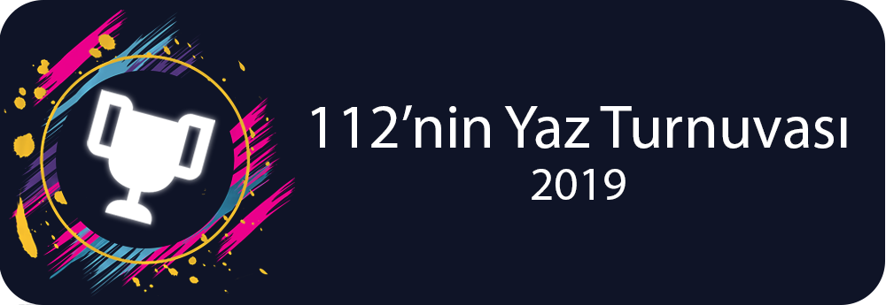
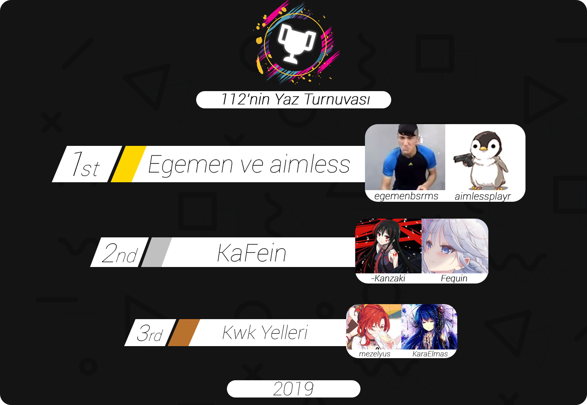

---
tags:
  - 112servis
  - 112ST
  - 112ST 2019
---

# 112's Summer Tournament 2019

The **112's Summer Tournament 2019** (***112ST***) was a double-elimination 2v2 osu! tournament started with 1v1 qualifiers hosted by ::{ flag=TR }:: [112servis](https://osu.ppy.sh/users/3953470), ::{ flag=TR }:: [heyronii](https://osu.ppy.sh/users/5642779) and ::{ flag=TR }:: [Sibyl](https://osu.ppy.sh/users/10440852). The tournament was only allowed for Turkish-speaking users regardless of their country flags. This was the fourth instalment of 112's Tournaments series.

## Tournament schedule

| Event | Timestamp |
| --: | :-- |
| Registration phase | 2019-06-05/2019-06-30 |
| Qualifiers | 2019-07-13/2019-07-14 |
| Group stage | 2019-07-20/2019-07-21 |
| Quarterfinals | 2019-07-27/2019-07-28 |
| Semifinals | 2019-08-03/2019-08-04 |
| Finals | 2019-08-11/2019-08-16 |
| Grand Finals | 2019-08-19/2019-08-22 |

## Prizes

| Placing | Prize(s) |
| :-: | :-- |
|  | Unique profile badge, 1 month of osu!supporter |

## Organisation

The 112's Summer Tournament 2019 was run by various community members.

| Position | Member(s) |
| :-- | :-- |
| Organizer | ::{ flag=TR }:: [112servis](https://osu.ppy.sh/users/3953470), ::{ flag=TR }:: [heyronii](https://osu.ppy.sh/users/5642779), ::{ flag=TR }:: [Sibyl](https://osu.ppy.sh/users/10440852) |
| Mappool selector | ::{ flag=TR }:: [112servis](https://osu.ppy.sh/users/3953470), ::{ flag=TR }:: [heyronii](https://osu.ppy.sh/users/5642779), ::{ flag=TH }:: [Seaweed](https://osu.ppy.sh/users/5151214), ::{ flag=TR }:: [sentez](https://osu.ppy.sh/users/8816305) |
| Referee | ::{ flag=TR }:: [112servis](https://osu.ppy.sh/users/3953470), ::{ flag=TR }:: [Entry](https://osu.ppy.sh/users/10213311), ::{ flag=TR }:: [heyronii](https://osu.ppy.sh/users/5642779), ::{ flag=NL }:: [goeo_](https://osu.ppy.sh/users/6832107), ::{ flag=TR }:: [LeBoum](https://osu.ppy.sh/users/8700026), ::{ flag=TR }:: [oralekin](https://osu.ppy.sh/users/7631823), ::{ flag=TR }:: [ozge1907](https://osu.ppy.sh/users/6511453), ::{ flag=PL }:: [P a t r i c k](https://osu.ppy.sh/users/6814521) |
| Streamer | ::{ flag=TR }:: [heyronii](https://osu.ppy.sh/users/5642779), ::{ flag=NL }:: [goeo\_](https://osu.ppy.sh/users/6832107), ::{ flag=TR }:: [pyth0nix](https://osu.ppy.sh/users/10922849) |
| Commentator | ::{ flag=TR }:: [112servis](https://osu.ppy.sh/users/3953470), ::{ flag=TR }:: [bigbirb-](https://osu.ppy.sh/users/11285985), ::{ flag=TR }:: [Ekin](https://osu.ppy.sh/users/2947405), ::{ flag=TR }:: [heyronii](https://osu.ppy.sh/users/5642779), ::{ flag=TR }:: [Lxran](https://osu.ppy.sh/users/3651081), ::{ flag=TR }:: [mezelyus](https://osu.ppy.sh/users/5938859), ::{ flag=NL }:: [goeo\_](https://osu.ppy.sh/users/6832107) |
| Designer | ::{ flag=TR }:: [Sibyl](https://osu.ppy.sh/users/10440852) |
| Statistician | ::{ flag=TR }:: [heyronii](https://osu.ppy.sh/users/5642779) |
| Wiki editor | ::{ flag=TR }:: [Zeus-](https://osu.ppy.sh/users/5464437) |

## Links

- [Discussion thread](https://osu.ppy.sh/community/forums/topics/917454)
- [112's Tournaments Discord server](https://discord.gg/g3nqqeZ)
- [Livestream](https://www.twitch.tv/osu_turkiye)
- **[Statistics sheet](https://docs.google.com/spreadsheets/d/1d6JqZWqnZ32nFCgGMcXz3Pc4KyE1iLmU5KpTIg6TEhE/edit)**

## Participants

### 1-15K Seed

| Seed ranking | Players | Qualifier points |
| :-- | :-- | :-- |
| #1 | ::{ flag=DE }:: [-Kanzaki](https://osu.ppy.sh/users/1652478) | 1.6 |
| #2 | ::{ flag=TR }:: [egemenbsrms](https://osu.ppy.sh/users/4520477) | 2 |
| #3 | ::{ flag=TR }:: [Raikouhou](https://osu.ppy.sh/users/8007528) | 5.4 |
| #4 | ::{ flag=TR }:: [AkashiDagara](https://osu.ppy.sh/users/6118485) | 6.2 |
| #5 | ::{ flag=TR }:: [edizberkserbest](https://osu.ppy.sh/users/9256771) | 7.6 |
| #6 | ::{ flag=TR }:: [star1322](https://osu.ppy.sh/users/8128670) | 8.2 |
| #7 | ::{ flag=TR }:: [KaraElmas](https://osu.ppy.sh/users/9300293) | 8.8 |
| #8 | ::{ flag=TR }:: [Iron Man](https://osu.ppy.sh/users/4242381) | 9.2 |
| #9 | ::{ flag=TR }:: [dragonsaga](https://osu.ppy.sh/users/4982690) | 9.6 |
| #10 | ::{ flag=TR }:: [exporage](https://osu.ppy.sh/users/5573525) | 10.8 |
| #11 | ::{ flag=TR }:: [Ruushin](https://osu.ppy.sh/users/4696304) | 11 |
| #12 | ::{ flag=TR }:: [Ekin](https://osu.ppy.sh/users/2947405) | 11 |
| #13 | ::{ flag=TR }:: [Cynesta](https://osu.ppy.sh/users/8674027) | 13 |
| #14 | ::{ flag=TR }:: [huckmen444](https://osu.ppy.sh/users/5019334) | 13.2 |
| #15 | ::{ flag=TR }:: [Mr\_Ege](https://osu.ppy.sh/users/9542170) | 13.8 |
| #16 | ::{ flag=TR }:: [Valiente](https://osu.ppy.sh/users/2617985) | 15.2 |
| E | ::{ flag=TR }:: [Aga Kalk Sahur](https://osu.ppy.sh/users/8212609) | 15.2 |
| E | ::{ flag=TR }:: [Duoquote](https://osu.ppy.sh/users/4920617) | 15.4 |
| E | ::{ flag=TR }:: [SusKuN](https://osu.ppy.sh/users/9723526) | 16.8 |
| E | ::{ flag=TR }:: [KaanKorkmaz](https://osu.ppy.sh/users/4906401) | 18.2 |
| E | ::{ flag=TR }:: [cqyc](https://osu.ppy.sh/users/6748059) | 18.8 |

\*E: Eliminated

### 15K+ Seed

| Seed ranking | Players | Qualifier points |
| :-- | :-- | :-- |
| #1 | ::{ flag=TR }:: [pyth0nix](https://osu.ppy.sh/users/10922849) | 2 |
| #2 | ::{ flag=TR }:: [mezelyus](https://osu.ppy.sh/users/5938859) | 2.6 |
| #3 | ::{ flag=TR }:: [Fequin](https://osu.ppy.sh/users/11665593) | 3.6 |
| #4 | ::{ flag=TR }:: [Tsuda-](https://osu.ppy.sh/users/6713666) | 4.8 |
| #5 | ::{ flag=TR }:: [tingirmin](https://osu.ppy.sh/users/9027514) | 5.4 |
| #6 | ::{ flag=TR }:: [Purple_Glasses](https://osu.ppy.sh/users/9045874) | 6 |
| #7 | ::{ flag=TR }:: [withmystyle](https://osu.ppy.sh/users/7953720) | 8.2 |
| #8 | ::{ flag=TR }:: [empirasu](https://osu.ppy.sh/users/12500084) | 9 |
| #9 | ::{ flag=TR }:: [emptypudding](https://osu.ppy.sh/users/11003085) | 9.4 |
| #10 | ::{ flag=TR }:: [Ekrem Imamoglu](https://osu.ppy.sh/users/10801545) | 10.8 |
| #11 | ::{ flag=TR }:: [sezaiemre](https://osu.ppy.sh/users/10807430) | 11.4 |
| #12 | ::{ flag=TR }:: [aimlessplayr](https://osu.ppy.sh/users/4903088) | 11.4 |
| #13 | ::{ flag=TR }:: [HayunGuys](https://osu.ppy.sh/users/9693852) | 13.4 |
| #14 | ::{ flag=TR }:: [amdinstartor](https://osu.ppy.sh/users/10505284) | 13.4 |
| #15 | ::{ flag=TR }:: [karyuunatsu](https://osu.ppy.sh/users/12575190) | 14 |
| #16 | ::{ flag=TR }:: [Horoz](https://osu.ppy.sh/users/11614447) | 14 |
| E | ::{ flag=TR }:: [L Lones](https://osu.ppy.sh/users/4954493) | 14.6 |
| E | ::{ flag=TR }:: [Mikazu](https://osu.ppy.sh/users/12474487) | 17 |

\*E: Eliminated

Only first 16 players from each seed are qualified, the rest is eliminated.

## Teams

After Group matches, those who get through to Quarterfinals are obliged to form a team with a player from the other seed.

| Team | 1 - 15K seed | 15K+ seed |
| :-: | :-- | :-- |
| KaFein | ::{ flag=DE }:: [-Kanzaki](https://osu.ppy.sh/users/1652478) | ::{ flag=TR }:: [Fequin](https://osu.ppy.sh/users/11665593) |
| bum patladın | ::{ flag=TR }:: [Raikouhou](https://osu.ppy.sh/users/8007528) | ::{ flag=TR }:: [Tsuda-](https://osu.ppy.sh/users/6713666) |
| Kwk Yelleri | ::{ flag=TR }:: [KaraElmas](https://osu.ppy.sh/users/9300293) | ::{ flag=TR }:: [mezelyus](https://osu.ppy.sh/users/5938859) |
| KFC Managers | ::{ flag=TR }:: [dragonsaga](https://osu.ppy.sh/users/4982690) | ::{ flag=TR }:: [pyth0nix](https://osu.ppy.sh/users/10922849) |
| eTi dasmjasdk | ::{ flag=TR }:: [edizberkserbest](https://osu.ppy.sh/users/9256771) | ::{ flag=TR }:: [tingirmin](https://osu.ppy.sh/users/9027514) |
| egemen ve aimless | ::{ flag=TR }:: [egemenbsrms](https://osu.ppy.sh/users/4520477) | ::{ flag=TR }:: [aimlessplayr](https://osu.ppy.sh/users/4903088) |
| İsim bulamadık pingleme artık | ::{ flag=TR }:: [AkashiDagara](https://osu.ppy.sh/users/6118485) | ::{ flag=TR }:: [empirasu](https://osu.ppy.sh/users/12500084) |
| Yürü baba fingo | ::{ flag=TR }:: [Iron Man](https://osu.ppy.sh/users/4242381) | ::{ flag=TR }:: [emptypudding](https://osu.ppy.sh/users/11003085) |

## Podium

## Mappools

### Grand Finals

**[Download the map pack here! (132 MB)](https://112.s-ul.eu/yUBjoWpe)**

- NoMod
  1. [XX:me - Escape (jonathanlfj) \[Freedom\]](https://osu.ppy.sh/beatmapsets/811119#osu/1701563)
  2. [Camellia – Chirality (‘Dissymmetric’ Long ver.) (Len) \[Classic EX\]](https://osu.ppy.sh/beatmapsets/753501#osu/1586427)
  3. [Y&Co - Daisuke (kwk) \[moph’s Expert\]](https://osu.ppy.sh/beatmapsets/697087#osu/1481149)
  4. [toby fox vs. Ferdk – Battle Against a True Hero (Hobbes2) \[Genocide\]](https://osu.ppy.sh/beatmapsets/576030#osu/1457925)
  5. [Mastermind(xi-nora2r) - Dreadnought (Cherry Blossom) \[Final Destination\]](https://osu.ppy.sh/beatmapsets/361306#osu/793845)
- Hidden
  1. [HyuN - Grin (ktgster) \[Expert\]](https://osu.ppy.sh/beatmapsets/947770#osu/1982581)
  2. [Pegboard Nerds – We Are One (Original Vocal Mix) (Frey) \[Night Begins\]](https://osu.ppy.sh/beatmapsets/605745#osu/1279815)
  3. [RUMI – Densetsu no Matsuri (Net0) \[Oni\]](https://osu.ppy.sh/beatmapsets/781683#osu/1641637)
- HardRock
  1. [TK from Ling tosite sigure - haze (Ametrin) \[Extra\]](https://osu.ppy.sh/beatmapsets/568305#osu/1204502)
  2. [Pierce The Veil – King For A Day (feat Kellin Quinn) (pishifat) \[Extra\]](https://osu.ppy.sh/beatmapsets/297909#osu/679771)
  3. [Memme – Sky of the Ocean (Syph) \[Loli’s Extra\]](https://osu.ppy.sh/beatmapsets/668888#osu/1429745)
- DoubleTime
  1. [Tsunamaru - paranoia (Chewin) \[Insane\]](https://osu.ppy.sh/beatmapsets/77999#osu/218464)
  2. [ALiCE’S EMOTiON – Foughten Field (Natsu) \[Lunatic\]](https://osu.ppy.sh/beatmapsets/366643#osu/806465)
  3. [Halozy – Heart of Night (Chaoslitz) \[Life of Loneliness\]](https://osu.ppy.sh/beatmapsets/462878#osu/991229)
- FreeMod
  1. [Function Phantom - Variable (Chaoslitz) \[Deluxe\]](https://osu.ppy.sh/beatmapsets/751774#osu/1582594)
  2. [PUP - Mabu (Hobbes2) \[Milan’s Expert\]](https://osu.ppy.sh/beatmapsets/762836#osu/1606045)
  3. [DCX – Flying High (DJ Splash Remix) (yeahyeahyeahhh) \[InoSane\]](https://osu.ppy.sh/beatmapsets/22194#osu/76663)
- Tiebreaker
  1. **[gmtn. vs. kozato (fw. LUZE) - squartatrice (Morinaga) \[Skystar’s Descent\]](https://osu.ppy.sh/beatmapsets/679272#osu/1436329)**

### Finals

**[Download the map pack here! (91 MB)](https://112.s-ul.eu/MBhzkPlU)**

- NoMod
  1. [nano - Nevereverland (zhu) \[Starset’s Redemption\]](https://osu.ppy.sh/beatmapsets/621438#osu/1507079)
  2. [sky\_delta vs Street – Load of the Ciel (Rokkea) \[BMD’s Extra\]](https://osu.ppy.sh/beatmapsets/340527#osu/861191)
  3. [Halogen – U Got That (Camellia’s Neurofunk Bootleg) (Sotarks) \[ricardoFlick\]](https://osu.ppy.sh/beatmapsets/934144#osu/1950290)
  4. [Co shu Nie – ZETTAI ZETSUMEI (Monstrata) \[Gill’s Another\]](https://osu.ppy.sh/beatmapsets/908973#osu/1907437)
  5. [Suigetsu Yamato – Fuujin Shoujo (Suigetsu Yamato Remix) (ktgster) \[Lunatic\]](https://osu.ppy.sh/beatmapsets/647546#osu/1371758)
- Hidden
  1. [Akatsuki Records – ENDLESS FANTASY (Night Mare) \[Extra Stage\]](https://osu.ppy.sh/beatmapsets/898849#osu/1877694)
  2. [otetsu – Yokuatsu Sakuran Girl (ZZHBOY) \[Insane\]](https://osu.ppy.sh/beatmapsets/195582#osu/1676603)
  3. [07th Expansion – Final Answer (gowww) \[Insane\]](https://osu.ppy.sh/beatmapsets/26226#osu/88633)
- HardRock
  1. [The Flashbulb – Dead on the 4th of July (Mismagius) \[Afterlife\]](https://osu.ppy.sh/beatmapsets/347882#osu/767594)
  2. [Dance Gavin Dance – Tree Village (Dilectus) \[Cool’s Extra\]](https://osu.ppy.sh/beatmapsets/703666#osu/1590637)
  3. [Lite Show Magic – TRICKL4SH 220 (Regou) \[toybot’s 4NOTHER\]](https://osu.ppy.sh/beatmapsets/616696#osu/1308411)
- DoubleTime
  1. [Sushi Killer - Zora (Nerova Riuz GX) \[Kyubey’s Insane\]](https://osu.ppy.sh/beatmapsets/205107#osu/947478)
  2. [Rameses B - Flaklypa (-kevincela-) \[Insane\]](https://osu.ppy.sh/beatmapsets/190390#osu/453358)
  3. [cYsmix – Dovregubben’s Hall (Guy) \[Insane\]](https://osu.ppy.sh/beatmapsets/360950#osu/793190)
- FreeMod
  1. [Renard feat. The Quick Brown Fox - Cloudsmasher (\[ Eon Fox \]) \[Rohit’s Light Extra\]](https://osu.ppy.sh/beatmapsets/373872#osu/1153669)
  2. [Maki Ligon & Karamitasu – Touhou vs. Fortnite Dance Compilation (Testo) \[Where We Dropping? Scarlet Devil Mansion\]](https://osu.ppy.sh/beatmapsets/872310#osu/1822957)
  3. [Casandra – Freaks Romanticism (kwk) \[Insane\]](https://osu.ppy.sh/beatmapsets/722312#osu/1524996)
- Tiebreaker
  1. **[paraoka feat. haru\*nya - Manimani (Yales) \[Yamazakura\]](https://osu.ppy.sh/beatmapsets/714808#osu/1510461)**

### Semifinals

**[Download the map pack here!(109 MB)](https://drive.google.com/file/d/1F_eyDQuN1zKThMuWwW6wxYP1wa7m_ciY/view)**

- NoMod
  1. [PSYQUI – Still in my heart feat. Punipuni Denki (Nanashima Asami) \[I’m gonna miss you\]](https://osu.ppy.sh/beatmapsets/964997#osu/2020137)
  2. [Metrik – Freefall VIP (feat. Reija Lee) (Slips) \[Immunity\]](https://osu.ppy.sh/beatmapsets/749003#osu/1577751)
  3. [8284 vs wa. - Adularescence (Cherry Blossom) \[Extra\]](https://osu.ppy.sh/beatmapsets/119438#osu/306669)
  4. [Rise Against – Disparity By Design (pishifat) \[Extra\]](https://osu.ppy.sh/beatmapsets/360325#osu/1768260)
  5. [kamome sano Electric Orchestra – HE4VEN \~Tengoku e Youkoso\~ (Kawashiro) \[\[ -Scarlet- \]’s MAXIMUM\]](https://osu.ppy.sh/beatmapsets/597797#osu/1413421)
- Hidden
  1. [Dictate - Treason (Realazy) \[The Senate\]](https://osu.ppy.sh/beatmapsets/848976#osu/1775314)
  2. [Dormir – Une mage blanche (Sulfur) \[Kalibe’s Extra\]](https://osu.ppy.sh/beatmapsets/759524#osu/1652205)
  3. [monet – Kagami no Sekai ni wa Watashi shika Inai -another version- (Mirash) \[PandaHero’s Insane\]](https://osu.ppy.sh/beatmapsets/685725#osu/1469159)
- HardRock
  1. [solfa feat. Shimotsuki Haruka – leap in your mind (Lasse) \[Expert\]](https://osu.ppy.sh/beatmapsets/818672#osu/1718542)
  2. [HyuN – White Aura (Mirash) \[coco's Insane\]](https://osu.ppy.sh/beatmapsets/891333#osu/1863198)
  3. [M2U - Stellar (Ultima Fox) \[Starlight\]](https://osu.ppy.sh/beatmapsets/773043#osu/1625011)
- DoubleTime
  1. [fhana – RHAPSODY OF BLUE SKY (Kamiya) \[Dynamix’s Insane\]](https://osu.ppy.sh/beatmapsets/586841#osu/1242820)
  2. [Co shu Nie – asphyxia (TV edit) (Monstrata) \[Light Insane\]](https://osu.ppy.sh/beatmapsets/758101#osu/1594731)
  3. [Umi no Soko kara Mermaid Prim by ARM x Komso - Gyogyotto Ningyo Bakkon Bridal (fanzhen0019) \[Hyper\]](https://osu.ppy.sh/beatmapsets/651723#osu/1382058)
- FreeMod
  1. [UNDEAD CORPORATION – Flowering Night Fever (Alheak) \[pishi’s Lunatic\]](https://osu.ppy.sh/beatmapsets/393663#osu/895806)
  2. [Kucchy vs Akky – Satori \~3rd eyes\~ (DJPop) \[Lunatic\]](https://osu.ppy.sh/beatmapsets/13827#osu/50892)
  3. [LukHash – 8BIT FAIRY TALE (Delis) \[Extra\]](https://osu.ppy.sh/beatmapsets/847930#osu/1773235)
- Tiebreaker
  1. **[NOMA – Brain Power Long Version (Skystar) \[Overdrive\]](https://osu.ppy.sh/beatmapsets/432822#osu/933228)**

### Quarterfinals

**[Download the map pack here! (122 MB)](https://112.s-ul.eu/yIQMxrAl)**

- NoMod
  1. [Son Feci Bisiklet – Viva La Vadi (Pati) \[Green Valley\]](https://osu.ppy.sh/beatmapsets/460386#osu/986011)
  2. [The Eden Project - Lost (Bearizm) \[Escapism\]](https://osu.ppy.sh/beatmapsets/247747#osu/835941)
  3. [sky\_delta - Kreuz (Side) \[Another\]](https://osu.ppy.sh/beatmapsets/347551#osu/785113)
  4. [baker – For a Dead Girl+ (handsome) \[Collab Extra\]](https://osu.ppy.sh/beatmapsets/682287#osu/1444316)
  5. [la la larks – Sayonara Waltz (Mirash) \[Delis’ Insane\]](https://osu.ppy.sh/beatmapsets/813903#osu/1706995)
- Hidden
  1. [dB soundworks – The Battle of Lil’ Slugger (lolcubes) \[Insane\]](https://osu.ppy.sh/beatmapsets/28708#osu/95590)
  2. [Starlight Kukugumi – You are a ghost, I am a ghost \~Gekijou no Ghost\~ (Gaia) \[Kalibe’s Extra\]](https://osu.ppy.sh/beatmapsets/941509#osu/1971493)
  3. [HyuN – Infinity Heaven (Niva) \[Ad Infinitum\]](https://osu.ppy.sh/beatmapsets/891345#osu/1863246)
- HardRock
  1. [Fujiwara Chika (CV: Kohara Konomi) – Chikatto Chika Chika (Andrea) \[Sekai’s IQ <3\]](https://osu.ppy.sh/beatmapsets/962521#osu/2015394)
  2. [YURiKA – Kyoumen no Nami (Vell) \[Expert\]](https://osu.ppy.sh/beatmapsets/731108#osu/1542973)
  3. [sakuzyo - Altale (toybot) \[Bonzi’s Extra\]](https://osu.ppy.sh/beatmapsets/228815#osu/1012279)
- DoubleTime
  1. [Mili - Rightfully (Okoratu) \[Hard\]](https://osu.ppy.sh/beatmapsets/875117#osu/1874011)
  2. [96neko - ELECT (Lasse) \[Insane\]](https://osu.ppy.sh/beatmapsets/716122#osu/1517345)
  3. [3L – Spring of Dreams (impossiblexu) \[Karen\]](https://osu.ppy.sh/beatmapsets/27875#osu/97338)
- FreeMod
  1. [A.SAKA – Nanatsu Issenzakura (yf\_bmp) \[Gust’s Insane\]](https://osu.ppy.sh/beatmapsets/513731#osu/1350672)
  2. [Festa - Lemuria (QuiescentRabbit) \[Nayarabbit’s Expert\]](https://osu.ppy.sh/beatmapsets/835474#osu/1806961)
  3. [Riko (CV: Tomita Miyu), Reg (CV: Mariya Ise) – Deep in Abyss (Kaifin) \[kwk’s Insane\]](https://osu.ppy.sh/beatmapsets/683322#osu/1459462)
- Tiebreaker
  1. **[Falcom Sound Team jdk feat. Suehiro Yuri – Nageki no Refrain (AIR) \[OriginatorZero\]](https://osu.ppy.sh/beatmapsets/907848#osu/1894536)**

### Group stage

#### 1–15K

**[Download the map pack here! (70 MB)](https://112.s-ul.eu/6D3w5waU)**

- NoMod
  1. [Ayalis – Ai o Chikaishi Hime Kazari (handsome) \[Kyshiro’s Extra\]](https://osu.ppy.sh/beatmapsets/506155#osu/1086956)
  2. [Utsu-P – Galapagos de Warui ka (DendyHere) \[Akitoshi’s Extreme\]](https://osu.ppy.sh/beatmapsets/795379#osu/1670393)
  3. [DJ Noriken – Stargazer feat. YUC’e (PSYQUI Remix) (-Jordan-) \[Expert\]](https://osu.ppy.sh/beatmapsets/853867#osu/1784484)
  4. [DJ TOTTO – Douwa Kairou (Yusomi) \[Insane\]](https://osu.ppy.sh/beatmapsets/913314#osu/1932857)
- Hidden
  1. [kurokumo x konoco - Ifuudoudou (Kyuukai) \[Linada’s Indecency\]](https://osu.ppy.sh/beatmapsets/656179#osu/1390352)
  2. [Cameliia - overcomplexification (ProfessionalBox) \[byfar’s Extra\]](https://osu.ppy.sh/beatmapsets/351408#osu/934812)
- HardRock
  1. [Minami – Kawaki wo Ameku (Mirash) \[Trynna’s Extra\]](https://osu.ppy.sh/beatmapsets/919827#osu/1921070)
  2. [yu\_tokiwa.djw merge scl.gtr – murmur twins (guitar pop ver.) (felys) \[Pink Another\]](https://osu.ppy.sh/beatmapsets/771062#osu/1621079)
- DoubleTime
  1. [Muzzy – Play (feat. UK:ID) (Yamicchi) \[Pika’s Hyper\]](https://osu.ppy.sh/beatmapsets/770484#osu/1634670)
  2. [Infected Mushroom – Pink Nightmares (RLC) \[Insane\]](https://osu.ppy.sh/beatmapsets/107639#osu/281977)
- FreeMod
  1. [Antiserum & Mayhem – Cry Baby (Shadren) \[Extra\]](https://osu.ppy.sh/beatmapsets/565136#osu/1231936)
  2. [Susumu Hirasawa - Parade (Real1) \[KIRBY Mix\]](https://osu.ppy.sh/beatmapsets/8487#osu/34819)
- Tiebreaker
  1. **[Camellia – Controlled dive (Side) \[Sequence Break\]](https://osu.ppy.sh/beatmapsets/320058#osu/712278)**

#### 15K+

**[Download the map pack here! (88 MB)](https://112.s-ul.eu/aJfLLa0v)**

- NoMod
  1. [Porter Robinson – Flicker (Cyllinus) \[Alonevpk’s Insane\]](https://osu.ppy.sh/beatmapsets/284931#osu/712895)
  2. [Gentle Stick X M2U – Ineffabilis (buhei) \[Yuki’s Extra\]](https://osu.ppy.sh/beatmapsets/340903#osu/766528)
  3. [YUC’e – POISON (KO3 Remix) (JrSzZ) \[Insane\]](https://osu.ppy.sh/beatmapsets/967021#osu/2044890)
  4. [toby fox – MEGALOVANIA (Kyshiro) \[Insane\]](https://osu.ppy.sh/beatmapsets/387700#osu/847387)
- Hidden
  1. [PolyphonicBranch – Usotsuki Betty (Chewin) \[Insane\]](https://osu.ppy.sh/beatmapsets/60140#osu/522349)
  2. [SHK – Weep Irish (AngelHoney) \[Another\]](https://osu.ppy.sh/beatmapsets/28545#osu/95360)
- HardRock
  1. [Igorrr – Tout Petit Moineau (fergas) \[Light Insane\]](https://osu.ppy.sh/beatmapsets/212180#osu/665210)
  2. [Kino Hiko – The Noise of Rain (Battle) \[Insane\]](https://osu.ppy.sh/beatmapsets/613928#osu/1466008)
- DoubleTime
  1. [Andromedik – Invasion (Mirash) \[Collab Hard\]](https://osu.ppy.sh/beatmapsets/789544#osu/1656913)
  2. [Shihori – Magic Girl !! (Entry) \[Hard\]](https://osu.ppy.sh/beatmapsets/845249#osu/1803697)
- FreeMod
  1. [Nekomata Master – Sennen no Kotowari (celerih) \[Real’s EXHAUST\]](https://osu.ppy.sh/beatmapsets/647730#osu/1438536)
  2. [Ice Cube – Go to Church (feat. Snoop Dogg & Lil Jon) (TicClick) \[Insane feat. EvilElvis\]](https://osu.ppy.sh/beatmapsets/319999#osu/712147)
- Tiebreaker
  1. **[Halozy – Paranoid Lost (Hakurei Yoru) \[Soda’s Lunatic\]](https://osu.ppy.sh/beatmapsets/440925#osu/964622)**

### Qualifiers stage

#### 1-15K

**[Download the map pack here! (36 MB)](https://112.s-ul.eu/ytXqfkWL)**

- NoMod
  1. [Himeringo – Idola no Circus (Nevo) \[Salvation\]](https://osu.ppy.sh/beatmapsets/902250#osu/1883745)
  2. [Function Phantom - Euclid (byfar) \[Fifth Postulate\]](https://osu.ppy.sh/beatmapsets/419614#osu/908093)
- Hidden
  1. [Agent Fresco – Dark Water (Godot) \[Destrier\]](https://osu.ppy.sh/beatmapsets/761140#osu/1618950)
- HardRock
  1. [Imperial Circus Dead Decadence – Danzai No Honoo To Koibito-Tachi No Rondo (Gottagof4st) \[Piercing Pain\]](https://osu.ppy.sh/beatmapsets/961431#osu/2012740)
- DoubleTime
  1. [Unlucky Morpheus – Phantom Blood (IsomirDiAngelo) \[Azzedd’s Light Insane\]](https://zeu.s-ul.eu/XHGcqmAq.osz)

#### 15K+

**[Download the map pack here! (33 MB)](https://112.s-ul.eu/VMeQXi78)**

- NoMod
  1. [Memme – Geurida (NeilPerry) \[Mellifluous Miracle\]](https://osu.ppy.sh/beatmapsets/688183#osu/1456417)
  2. [Major Lazer – Sua Cara (feat. Anitta & Pabllo Vittar) (handsome) \[byfar’s extra\]](https://osu.ppy.sh/beatmapsets/720615#osu/1665735)
- Hidden
  1. [ak+q – Axium Crisis (MrSergio) \[Collapse\]](https://osu.ppy.sh/beatmapsets/812551#osu/1704329)
- HardRock
  1. [Nekomata Master+ – encounter (Sing) \[Frey’s Expert\]](https://zeu.s-ul.eu/Lzk6C8ux.osz)
- DoubleTime
  1. [Hate vs Brilliance – Qubism (Regraz) \[Elexus’ HYPER\]](https://osu.ppy.sh/beatmapsets/524503#osu/1802266)

## Match results

### Grand Finals

Saturday, 17 August 2019:

| Team 1 |  |  | Team 2 | Match link |
| --: | :-: | :-: | :-- | :-- |
| Kwk Yelleri | 0 | **1** | **egemen ve aimless** | *forfeit* |

Monday, 19 August 2019:

| Team 1 |  |  | Team 2 | Match link |
| --: | :-: | :-: | :-- | :-- |
| KaFein | 5 | **7** | **egemen ve aimless** | [#1](https://osu.ppy.sh/community/matches/54199892) |

Thursday, 22 August 2019:

| Team 1 |  |  | Team 2 | Match link |
| --: | :-: | :-: | :-- | :-- |
| KaFein | 6 | **7** | **egemen ve aimless** | [#1](https://osu.ppy.sh/community/matches/54269710) |

### Finals

Thursday, 15 August 2019:

| Team 1 |  |  | Team 2 | Match link |
| --: | :-: | :-: | :-- | :-- |
| bum patladın | 3 | **6** | **egemen ve aimless** | [#1](https://osu.ppy.sh/community/matches/54101219) |

Friday, 16 August 2019:

| Team 1 |  |  | Team 2 | Match link |
| --: | :-: | :-: | :-- | :-- |
| **KaFein** | **6** | 2 | Kwk Yelleri | [#1](https://osu.ppy.sh/community/matches/54123533) |

### Semifinals

Sunday, 4 August 2019:

| Team 1 |  |  | Team 2 | Match link |
| --: | :-: | :-: | :-- | :-- |
| **KaFein** | **5** | 4 | egemen ve aimless | [#1](https://osu.ppy.sh/community/matches/53834185) |
| bum patladın | 3 | **5** | **Kwk Yelleri** | [#1](https://osu.ppy.sh/community/matches/53836911) |

Sunday, 11 August 2019:

| Team 1 |  |  | Team 2 | Match link |
| --: | :-: | :-: | :-- | :-- |
| **bum patladın** | **6** | 3 | KFC Managers | [#1](https://osu.ppy.sh/community/matches/54005552) |

Tuesday, 13 August 2019:

| Team 1 |  |  | Team 2 | Match link |
| --: | :-: | :-: | :-- | :-- |
| **egemen ve aimless** | **6** | 1 | Yürü Baba Fingo | [#1](https://osu.ppy.sh/community/matches/54055221) |

### Quarterfinals

Saturday, 27 July 2019:

| Team 1 |  |  | Team 2 | Match link |
| --: | :-: | :-: | :-- | :-- |
| **KaFein** | **5** | 1 | İsim bulamadık pingleme artık | [#1](https://osu.ppy.sh/community/matches/53645819) |

Sunday, 28 July 2019:

| Team 1 |  |  | Team 2 | Match link |
| --: | :-: | :-: | :-- | :-- |
| **bum patladın** | **1** | 0 | eTi dasmjasdk | *forfeit* |
| eTi dasmjasdk | 0 | **1** | **Yürü Baba Fingo** | *forfeit* |
| KFC Managers | 3 | **5** | **egemen ve aimless** | [#1](https://osu.ppy.sh/community/matches/53666015) |
| **Kwk Yelleri** | **5** | 2 | Yürü Baba Fingo | [#1](https://osu.ppy.sh/community/matches/53668619) |

Sunday, 4 August 2019:

| Team 1 |  |  | Team 2 | Match link |
| --: | :-: | :-: | :-- | :-- |
| İsim bulamadık pingleme artık | 3 | **5** | **KFC Managers** | [#1](https://osu.ppy.sh/community/matches/53835518) |

### Group matches

Saturday, 20 July 2019:

| Group | Player 1 |  |  | Player 2 |
| :-: | --: | :-: | :-: | :-- |
| A | Iron Man | *forfeit* | *forfeit* | Ekin |
| A | **AkashiDagara** | **4** | 0 | huckmen444 |
| A | **AkashiDagara** | **4** | 1 | Iron Man |
| A | **AkashiDagara** | **4** | 1 | Ekin |
| B | **edizberkserbest** | **4** | 2 | Cynesta |
| B | **-Kanzaki** | **4** | 0 | edizberkserbest |
| B | **-Kanzaki** | **4** | *forfeit* | Ruushin |
| B | **edizberkserbest** | **4** | 3 | Ruushin |
| B | Ruushin | *forfeit* | **4** | **Cynesta** |
| C | **KaraElmas** | **4** | 0 | exporage |
| D | star1322 | *forfeit* | **4** | **dragonsaga** |
| D | **egemenbsrms** | **4** | 0 | dragonsaga |
| D | **egemenbsrms** | **4** | *forfeit* | star1322 |
| E | **Tsuda-** | **4** | 2 | Purple\_Glasses |
| E | Purple\_Glasses | 0 | **4** | **emptypudding** |
| E | Tsuda- | 3 | **4** | **emptypudding** |
| F | **tingirmin** | **4** | 0 | sezaiemre |
| F | Fequin | 0 | **4** | **tingirmin** |
| F | **Fequin** | **4** | 0 | sezaiemre |
| G | **mezelyus** | **4** | 1 | empirasu |
| G | **empirasu** | **4** | 0 | Ekrem Imamoglu |
| G | **mezelyus** | **4** | 0 | Ekrem Imamoglu |
| H | **pyth0nix** | **4** | 0 | aimlessplayr |
| H | **pyth0nix** | **4** | 0 | withmystyle |
| H | withmystyle | 0 | **4** | **aimlessplayr** |

Sunday, 21 July 2019:

| Group | Player 1 |  |  | Player 2 |
| :-: | --: | :-: | :-: | :-- |
| A | **Iron Man** | **4** | 0 | huckmen444 |
| A | **huckmen444** | **4** | *forfeit* | Ekin |
| B | Ruushin | *forfeit* | **4** | **Cynesta** |
| C | **Raikouhou** | **4** | 0 | KaraElmas |
| C | **Raikouhou** | **4** | 2 | exporage |
| C | **KaraElmas** | **4** | 3 | Mr\_Ege |
| C | **Raikouhou** | **4** | 0 | Mr\_Ege |
| D | **dragonsaga** | **4** | 1 | Valiente |
| D | star1322 | *forfeit* | **4** | **Valiente** |
| D | **egemenbsrms** | **4** | 1 | Valiente |
| E | **Tsuda-** | **4** | *forfeit* | karyuunatsu |
| E | **Purple\_Glasses** | **4** | *forfeit* | karyuunatsu |
| E | **emptypudding** | **4** | *forfeit* | karyuunatsu |
| F | **Fequin** | **4** | 0 | amdinstartor |
| F | **sezaiemre** | **4** | 3 | amdinstartor |
| F | **tingirmin** | **4** | 0 | amdinstartor |
| G | **mezelyus** | **4** | 0 | HayunGuys |
| G | Ekrem Imamoglu | 0 | **4** | **empirasu** |
| H | withmystyle | 0 | **4** | **Horoz** |
| H | **pyth0nix** | **4** | 0 | Horoz |
| H | **aimlessplayr** | **4** | 0 | Horoz |

Monday, 22 July 2019:

| Group | Player 1 |  |  | Player 2 |
| :-: | --: | :-: | :-: | :-- |
| B | **-Kanzaki** | **4** | *forfeit* | Cynesta |
| C | **Mr\_Ege** | **4** | 0 | exporage |
| G | **empirasu** | **4** | 0 | HayunGuys |

## Ruleset

### Tournament rules

1. 112’s Summer Tournament 2019 is an osu! tournament only allowed for Turkish-speaking players regardless of their profile flags.
2. The tournament uses a qualifier into a double elimination bracket.
3. Qualifiers and Group stage matches are in **single-player** format, the Elimination stage is planned as a **2-player team versus** setup.
4. Beatmap scoring is based on Score V2.
5. The following seeding method will be used for the tournament:
   - Top seed will consist of players between **#1 - #15,000.**
   - Low seed will consist of players **over #15,000.**
6. The beatmaps for each round will be announced by the map selectors in advance at least a week before the actual matches take place. Only these beatmaps will be used during the respective matches.
   - One beatmap will be a tiebreaker beatmap. This beatmap will only be played in case of a tie. **The only exception to this is the Qualifiers pool.**
7. Match schedule will be decided by tournament staff in accordance with weekly schedule-planning forms.
8. In the event of a player disconnecting during the match due to connectivity or hardware difficulties;
   - If the disconnection occurs within 30 seconds after beatmap begin, the beatmap is replayed. If it occurs after 30 seconds, the score on the match link is valid.
   - The player will be given 10 minutes to reconnect. If the player fails to reconnect in 10 minutes, or frequently disconnects during the match and reconnecting takes too long, the player will be excluded from the match.
9. Beatmaps cannot be reused in the same match.
10. All players are supposed to be ready on time for the match. For the players/teams unable to show up on time, match can be postponed for 10 minutes. **If it exceeds, the specific player(s) will lose by default.**
    - During the Group stages, if both players are unable to attend, no points will be awarded.
    - During the Elimination stage, if both teams are unable to attend, players will be blacklisted and the match will be postponed to a further date. **Blacklisted player(s) will be eliminated if the same situation occurs twice.**
11. During the Elimination phase, if one of the players of a team is unable to attend the match, on condition of the agreement of both teams, the match can be played in 1v2 format, yet 1v1 is unacceptable. If one of the teams does not agree, the match will be declared as Lose by Default for the team missing a player.
12. All players and referees must be treated with respect. Instructions of the referees and tournament Management are to be followed. Decisions labeled as final are not to be objected.
13. Disrupting the match by foul play, picking inappropriate warmup beatmaps, insulting and provoking other players or referees, delaying the match or other deliberate inappropriate misbehavior is strictly prohibited.
14. Players that are suspected of cheating during the tournament will be disqualified from the tournament.
15. Tournament hosts hold the right to exclude any player from participating in the tournament at will.

### Registration

1. Every user interested in joining the tournament will sign up individually.
   - **Any form of registration, other than the registration form provided in related channels, will be disregarded.**
2. Participants **must** join the [Discord server](https://discord.gg/g3nqqeZ) for the duration of the tournament.
3. Excluding commentators and streamers, tournament staff cannot participate in the tournament.
4. Upon the conclusion of registration period, the list of participants will be submitted to the osu! Support Team for screening. Participants that fail the screening procedure will not be able to participate in the tournament. Please refer to [here](/wiki/Tournaments/Official_support#tournament-screening) for more information about tournament screening.
5. All players eligible to participate in the tournament will be published after the Registration period ends.

### Stage instructions

1. In the Qualifier stage, each seed will have a specific pool designed by the map selectors.
2. The pool will contain 4 brackets: NoMod, [Hidden](/wiki/Gameplay/Game_modifier/Hidden), [HardRock](/wiki/Gameplay/Game_modifier/Hard_Rock), [DoubleTime](/wiki/Gameplay/Game_modifier/Double_Time). There will not be a tiebreaker for this stage.
3. Each of the Qualifier pools contain 5 maps. There will be 2 maps under the NoMod bracket and 1 map for the other mod brackets.
4. No warm-ups will be entertained during this stage.
5. Players will have to play the map pool **twice** at a designated time. Placement results will be calculated according to their best combined scores.
6. Players will have the option to choose the multiplayer room they wish to play. If a room happens to be too empty, remaining players will be navigated to the other rooms.
7. Latecomers can be admitted to the room, but they have to commence playing from the part where the others are at.
8. If no players will join the room, the match will be aborted. No points will be awarded to the absent players.
9. First 16 players from each seed with the highest overall score will be divided into groups of 4 players based on their points. If there will be more participants than the predicted number, player(s) placed the last will be eliminated.
10. Following the Qualifiers, Group stages will be played. During Group stages, players of each group will match against one another. 2 players of each group with highest points will get through the Group stage, the rest will be eliminated.
11. There will be 2 separate mappools for the Group stages, each of them will contain 13 maps: 4 maps under the NoMod bracket, 2 maps each for the other mod brackets and 1 will be played as Tiebreaker.
12. Before the Double Elimination stages, players will have to form 2-player teams with the other seeders upon agreement of both parties.
13. Players will commence the Double Elimination stages as teams made up of players from each seed. During these stages, the winner moves to the next stage and the losing team gets moved to the Losers bracket.
14. The mappool for Double Elimination stages contain 17 maps: 5 maps under the NoMod bracket, 3 maps each for the other mod brackets and 1 will be played as Tiebreaker.
15. **Winning conditions:**
    - The Group stages will be best of 7 (first team to 4 wins).
    - The Quarterfinals and Semifinals will be best of 9 (first team to 5 wins).
    - The Finals will be best of 11 (first team to 6 wins).
    - The Grand Finals will be best of 13 (first team to 7 wins).

### Match instructions

1. A referee will create a multiplayer room 15 minutes in advance. Players must gather during this period.
   - Room settings are osu!, Head to Head (Group stages) / Team-Vs. (Double Elimination stages), Win Condition: ‘ScoreV2’.
2. Players can select up to two warm-up beatmaps that should not exceed 4 minutes. Players are free to not to pick a warm-up, but have to play if the opponent wants to.
3. After the warm-ups, players will be asked a simple question. Players are given 30 seconds to answer the question, with only 1 chance to answer.
   - The player/team with correct answer **picks** first.
   - The player/team with incorrect answer **bans** first.
   - If both players/teams answer correctly, the winner is decided upon the first to answer according to the referee’s screen.
   - **From Quarterfinals onwards the team that bans first will ban one map, then the other team will ban two maps, then finally the first team will make their final ban.**
4. During Group stages, each player can only ban 1 beatmap.
   - **From Quarterfinals onwards, the number of bans increases to 2. However, each player/team may not ban more than one map of any mod bracket (excluding NoMod).**
5. Beatmap selection will alternate between each player/team selecting a beatmap out of the mappool.
6. Players map pick freely from any mod pool.
   - In the case of a tie, the tiebreaker beatmap will be played.
7. The results will be published via a statistics sheet.

### Mappool instructions

1. There will be a new mappool for every stage.
2. Each mappool consists of 5 brackets: NoMod, [Hidden](/wiki/Gameplay/Game_modifier/Hidden), [HardRock](/wiki/Gameplay/Game_modifier/Hard_Rock), [DoubleTime](/wiki/Gameplay/Game_modifier/Double_Time) and FreeMod.
3. Each mappool has a specific size depending on the stage.
   - The Group stage mappools will have 4 NoMod maps, 2 maps for each of the remaining mod brackets.
   - The Double Elimination stage mappools will have 5 NoMod maps, 3 maps for each of the remaining mod brackets.
4. Each mappool has one tiebreaker.
5. The NoFail mod may be selected on any map.
6. The NoMod bracket will be played with no mods enabled at all (other than NoFail).
7. The Hidden, HardRock and DoubleTime brackets will be played with the respective mod enabled by all players.
8. The FreeMod bracket will have Free Mods enabled.
   - Possible mod choices are Hidden, HardRock and Hidden+HardRock.
9. The tiebreaker will be played under FreeMod conditions.
   - When playing the tiebreaker, there are no mod requirements.

### Scheduling instructions

1. Match schedule will be planned in accordance with weekly schedule-planning forms.
2. Matches will be scheduled and announced according to the Turkey Time (UTC+3).
3. Players may ask for a reschedule upon agreement with the opponent(s) if the current schedule does not work for them.
4. Reschedules will only be considered if both players/teams agree to a time at least 24 hours before the first match in that particular stage.
   - If players wish to change the scheduled time within 24 hours until the match, they have to seek for an available referee for the rescheduled time. **Participants cannot use this opportunity more than once.**
5. If it is certain that participant(s) is/are unavailable for the scheduled time, they are obliged to inform the tournament staff beforehand. This is required in order not to waste the time of staff and other participants.
