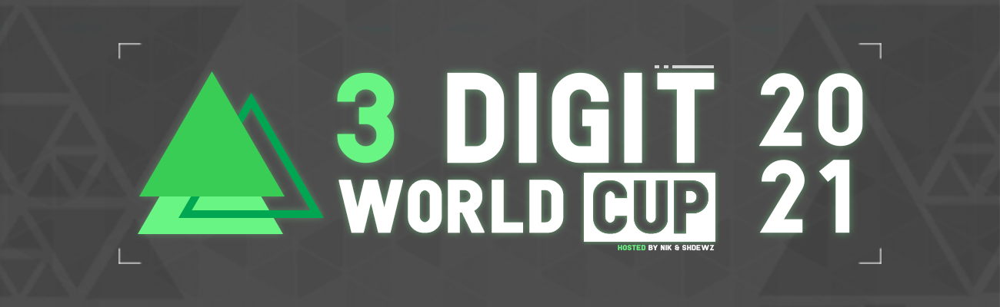
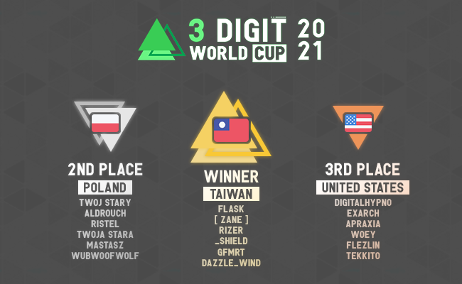

---
tags:
  - 3WC
  - 3WC2021
---

# 3 Digit World Cup 2021

The **3 Digit World Cup 2021** (***3WC 2021***) was a country-based osu! tournament hosted by ::{ flag=NL }:: [nik](https://osu.ppy.sh/users/10077264) and ::{ flag=FI }:: [shdewz](https://osu.ppy.sh/users/10000899). It was the third instalment of the 3 Digit World Cup.

## Tournament schedule

| Event | Timestamp |
| --: | :-- |
| Registration phase | 2021-02-24/2021-03-13 (18:00 UTC+0) |
| Team submission | 2021-03-13/2021-03-28 (18:00 UTC+0) |
| Qualifiers | 2021-04-02/2021-04-04 |
| Round of 16 | 2021-04-09/2021-04-11 |
| Quarterfinals | 2021-04-16/2021-04-18 |
| Semifinals | 2021-04-23/2021-04-25 |
| Finals | 2021-04-30/2021-05-02 |
| Grand Finals | 2021-05-07/2021-05-09 |

## Prizes

| Placing | Prize(s) |
| :-: | :-- |
|  | Unique profile badge, exclusive team banner |
|  | Exclusive team banner |
|  | Exclusive team banner |

## Organisation

The 3 Digit World Cup was run by various community members.

| Position | Member(s) |
| :-- | :-- |
| Organizer | ::{ flag=NL }:: [nik](https://osu.ppy.sh/users/10077264), ::{ flag=FI }:: [shdewz](https://osu.ppy.sh/users/10000899) |
| Mappool selector | ::{ flag=US }:: [fooders](https://osu.ppy.sh/users/7545218), ::{ flag=NL }:: [nik](https://osu.ppy.sh/users/10077264) |
| Referee | ::{ flag=KR }:: [choke-](https://osu.ppy.sh/users/12242622), ::{ flag=PL }:: [crissof](https://osu.ppy.sh/users/9505673), ::{ flag=AU }:: [Fairy Bread](https://osu.ppy.sh/users/8306102), ::{ flag=DE }:: [GDLenny](https://osu.ppy.sh/users/8406711), ::{ flag=AT }:: [GumalaOC](https://osu.ppy.sh/users/5367718), ::{ flag=BR }:: [LeoFLT](https://osu.ppy.sh/users/3668779), ::{ flag=DE }:: [Menty](https://osu.ppy.sh/users/3619284), ::{ flag=NL }:: [nik](https://osu.ppy.sh/users/10077264), ::{ flag=US }:: [ruruchewy](https://osu.ppy.sh/users/7112839), ::{ flag=FI }:: [shdewz](https://osu.ppy.sh/users/10000899), ::{ flag=IN }:: [Speshimen](https://osu.ppy.sh/users/7720204), ::{ flag=US }:: [Tuco](https://osu.ppy.sh/users/11706350), ::{ flag=GB }:: [Yazzehh](https://osu.ppy.sh/users/7068973), ::{ flag=PL }:: [zibi](https://osu.ppy.sh/users/11301620) |
| Streamer | ::{ flag=US }:: [D I O](https://osu.ppy.sh/users/3958619), ::{ flag=FI }:: [shdewz](https://osu.ppy.sh/users/10000899) |
| Commentator | ::{ flag=GB }:: [AJT](https://osu.ppy.sh/users/3181083), ::{ flag=US }:: [ChillierPear](https://osu.ppy.sh/users/9501251), ::{ flag=US }:: [D I O](https://osu.ppy.sh/users/3958619), ::{ flag=GB }:: [Damarsh](https://osu.ppy.sh/users/7465147), ::{ flag=US }:: [fieryrage](https://osu.ppy.sh/users/3533958), ::{ flag=AU }:: [Jordan The Bear](https://osu.ppy.sh/users/7477458), ::{ flag=AU }:: [jordanlr7](https://osu.ppy.sh/users/11652827), ::{ flag=AU }:: [Kano](https://osu.ppy.sh/users/3036203), ::{ flag=AU }:: [Mavs](https://osu.ppy.sh/users/11076938), ::{ flag=DE }:: [Menty](https://osu.ppy.sh/users/3619284), ::{ flag=US }:: [Monko2k](https://osu.ppy.sh/users/4852013), ::{ flag=SE }:: [nautzz](https://osu.ppy.sh/users/2012039), ::{ flag=US }:: [this1neguy](https://osu.ppy.sh/users/1797189) |
| Designer | ::{ flag=US }:: [Celsea](https://osu.ppy.sh/users/7464885), ::{ flag=FI }:: [shdewz](https://osu.ppy.sh/users/10000899) |
| Statistician | ::{ flag=FI }:: [shdewz](https://osu.ppy.sh/users/10000899) |

## Links

- [Forum thread](https://osu.ppy.sh/community/forums/topics/1256770)
- **[Statistics sheet](https://docs.google.com/spreadsheets/d/1oLTe6_WStAfmNU2b6RhyAvZXKkp23dhp5LM6vL6cYuM)**
- [Discord server](https://discord.gg/ZjPs7ya)
- [Challonge brackets](https://challonge.com/3WC2021)
- [Pick'ems page](https://pickem.hwc.hr/tournaments/54) hosted by ::{ flag=DE }:: [hallowatcher](https://osu.ppy.sh/users/1874761)
- [Livestream](https://www.twitch.tv/3wc_osu)

## Participants

|  | Country | Members |
| :-: | :-: | :-- |
| ::{ flag=AR }:: | **Argentina** | **[Emiru Ikuno](https://osu.ppy.sh/users/6169195)**, [Amuro](https://osu.ppy.sh/users/7119659), [Emiru Ikuno 2](https://osu.ppy.sh/users/9393446), [Lexalia](https://osu.ppy.sh/users/1887616), [Pein](https://osu.ppy.sh/users/2212941), [SlowBurn](https://osu.ppy.sh/users/3608846) |
| ::{ flag=AU }:: | **Australia** | **[jordanlr7](https://osu.ppy.sh/users/11652827)**, [Dumii](https://osu.ppy.sh/users/3068044), [Vivace](https://osu.ppy.sh/users/3698691), [Enumi](https://osu.ppy.sh/users/10625283), [Monk The Don](https://osu.ppy.sh/users/4012086), [GranDSenpai](https://osu.ppy.sh/users/3997580) |
| ::{ flag=BR }:: | **Brazil** | **[niii\_san](https://osu.ppy.sh/users/5403374)**, [Coreanmaluco](https://osu.ppy.sh/users/3149577), [Dafonz](https://osu.ppy.sh/users/6667041), [Mystia](https://osu.ppy.sh/users/4277702), [NovatoKing](https://osu.ppy.sh/users/9316213), [xxluizxx47](https://osu.ppy.sh/users/4687701) |
| ::{ flag=CA }:: | **Canada** | **[Zylice](https://osu.ppy.sh/users/5033077)**, [Yip](https://osu.ppy.sh/users/5177569), [Stoof](https://osu.ppy.sh/users/4916057), [Vespirit](https://osu.ppy.sh/users/5425046), [MuffinSlayer14](https://osu.ppy.sh/users/7613309), [Ignite](https://osu.ppy.sh/users/3122948) |
| ::{ flag=CL }:: | **Chile** | **[Eunha](https://osu.ppy.sh/users/7701428)**, [kanocchi](https://osu.ppy.sh/users/2321050), [Negaces](https://osu.ppy.sh/users/6024502), [Pancho](https://osu.ppy.sh/users/11305398), [xaxreid](https://osu.ppy.sh/users/4227431), [YukariSmug](https://osu.ppy.sh/users/12211248) |
| ::{ flag=CN }:: | **China** | **[Crystal](https://osu.ppy.sh/users/1646397)**, [Gynophobia-](https://osu.ppy.sh/users/6090175), [EmertxE](https://osu.ppy.sh/users/954557), [im\_a\_burger\_fox](https://osu.ppy.sh/users/5791401), [milk-tea](https://osu.ppy.sh/users/11375105), [MyAngelMiku](https://osu.ppy.sh/users/7025429) |
| ::{ flag=XX }:: | **Countryless** | **[hammytr](https://osu.ppy.sh/users/11562243)**, [GSBlank](https://osu.ppy.sh/users/2312106), [seegii](https://osu.ppy.sh/users/4659319), [Crezz](https://osu.ppy.sh/users/7108275), [Arge](https://osu.ppy.sh/users/11215030), [Blazink](https://osu.ppy.sh/users/6427216) |
| ::{ flag=CZ }:: | **Czech Republic** | **[Avenito](https://osu.ppy.sh/users/7415910)**, [LaBron Jayms](https://osu.ppy.sh/users/3853840), [MrNobady](https://osu.ppy.sh/users/9303599), [Orbi](https://osu.ppy.sh/users/3574151), [PoggersCZ](https://osu.ppy.sh/users/3198446), [VilaZ](https://osu.ppy.sh/users/5155680) |
| ::{ flag=FI }:: | **Finland** | **[Freezd](https://osu.ppy.sh/users/6524603)**, [Haadez](https://osu.ppy.sh/users/8925266), [Ataraksia](https://osu.ppy.sh/users/7503114), [HENKSELI](https://osu.ppy.sh/users/7005392), [Dezku](https://osu.ppy.sh/users/9505131), [Jerekek](https://osu.ppy.sh/users/4162662) |
| ::{ flag=FR }:: | **France** | **[Musty](https://osu.ppy.sh/users/251683)**, [-raizen-](https://osu.ppy.sh/users/3872987), [Fumatsu](https://osu.ppy.sh/users/8236827), [Hifkil](https://osu.ppy.sh/users/4301976), [ThePooN](https://osu.ppy.sh/users/718454), [Thundur](https://osu.ppy.sh/users/4141918) |
| ::{ flag=DE }:: | **Germany** | **[hallowatcher](https://osu.ppy.sh/users/1874761)**, [Risiing](https://osu.ppy.sh/users/2282047), [\_Criller](https://osu.ppy.sh/users/8116659), [KyoouN](https://osu.ppy.sh/users/1458932), [khz](https://osu.ppy.sh/users/9254536), [Ephix](https://osu.ppy.sh/users/3772251) |
| ::{ flag=HK }:: | **Hong Kong** | **[Petal](https://osu.ppy.sh/users/7354729)**, [BaconPug](https://osu.ppy.sh/users/10320157), [Koltay](https://osu.ppy.sh/users/4787843), [Muji](https://osu.ppy.sh/users/2200982), [Riushi](https://osu.ppy.sh/users/2353581), [Rlsc](https://osu.ppy.sh/users/2110845) |
| ::{ flag=JP }:: | **Japan** | **[Delis](https://osu.ppy.sh/users/1603923)**, [EIGER](https://osu.ppy.sh/users/1504556), [KonKonKinakoN](https://osu.ppy.sh/users/4733185), [----](https://osu.ppy.sh/users/4304495), [haga1115](https://osu.ppy.sh/users/6574823), [Eryth](https://osu.ppy.sh/users/11414953) |
| ::{ flag=NO }:: | **Norway** | **[comfv](https://osu.ppy.sh/users/6888972)**, [Kurean](https://osu.ppy.sh/users/10622576), [Melvr](https://osu.ppy.sh/users/9211924), [Surv](https://osu.ppy.sh/users/10549880) |
| ::{ flag=PH }:: | **Philippines** | **[zonelouise](https://osu.ppy.sh/users/1492995)**, [Kageno](https://osu.ppy.sh/users/7246165), [Senjuro](https://osu.ppy.sh/users/3003839), [Xyloz](https://osu.ppy.sh/users/12040280) |
| ::{ flag=PL }:: | **Poland** | **[twoj stary](https://osu.ppy.sh/users/3543130)**, [Aldrouch](https://osu.ppy.sh/users/5575135), [ristel](https://osu.ppy.sh/users/12408961), [TWOJA STARA](https://osu.ppy.sh/users/8170186), [Mastasz](https://osu.ppy.sh/users/1876565), [WubWoofWolf](https://osu.ppy.sh/users/39828) |
| ::{ flag=RU }:: | **Russia** | **[Okinotori](https://osu.ppy.sh/users/4346274)**, [Red\_Pixel](https://osu.ppy.sh/users/4170932), [DJ EBAN](https://osu.ppy.sh/users/9053619), [zin](https://osu.ppy.sh/users/7447249), [-Din-](https://osu.ppy.sh/users/7972980), [Meniwa](https://osu.ppy.sh/users/4248481) |
| ::{ flag=KR }:: | **South Korea** | **[\[Karcher\]](https://osu.ppy.sh/users/11443437)**, [Jeong Woo Yeong](https://osu.ppy.sh/users/8359561), [Piper](https://osu.ppy.sh/users/10592853), [Peresia](https://osu.ppy.sh/users/7027766), [Suyong\_](https://osu.ppy.sh/users/8799923), [Hugofrost](https://osu.ppy.sh/users/6896883) |
| ::{ flag=ES }:: | **Spain** | **[Rekens](https://osu.ppy.sh/users/1073575)**, [-Hideki-](https://osu.ppy.sh/users/8688804), [Frosiito](https://osu.ppy.sh/users/6462387), [Kalal331](https://osu.ppy.sh/users/8433636), [kazamabc](https://osu.ppy.sh/users/6937470), [NHarmonia](https://osu.ppy.sh/users/9582556) |
| ::{ flag=SE }:: | **Sweden** | **[\[ Coach \]](https://osu.ppy.sh/users/2854598)**, [Saika0k1](https://osu.ppy.sh/users/4316633), [Felrion](https://osu.ppy.sh/users/3673083), [-Masta-](https://osu.ppy.sh/users/12521607), [scylla](https://osu.ppy.sh/users/9405745), [\[ Blue \]](https://osu.ppy.sh/users/4859699) |
| ::{ flag=TW }:: | **Taiwan** | **[Flask](https://osu.ppy.sh/users/959763)**, [\[ Zane \]](https://osu.ppy.sh/users/3517706), [Rizer](https://osu.ppy.sh/users/5155973), [\_Shield](https://osu.ppy.sh/users/1860489), [GfMRT](https://osu.ppy.sh/users/3163649), [DazzLE\_Wind](https://osu.ppy.sh/users/2537924) |
| ::{ flag=UA }:: | **Ukraine** | **[Kryterion](https://osu.ppy.sh/users/9920144)**, [1Max](https://osu.ppy.sh/users/11653711), [AlasMO](https://osu.ppy.sh/users/9850229), [gusniki](https://osu.ppy.sh/users/9830628), [Lappen777](https://osu.ppy.sh/users/8274648), [Tooqie](https://osu.ppy.sh/users/9203015) |
| ::{ flag=GB }:: | **United Kingdom** | **[Voss](https://osu.ppy.sh/users/7657761)**, [Rinnu](https://osu.ppy.sh/users/12179012), [majoreh](https://osu.ppy.sh/users/7959222), [Kingling](https://osu.ppy.sh/users/7010761), [Jemzsee](https://osu.ppy.sh/users/11553627), [Doomsday](https://osu.ppy.sh/users/18983) |
| ::{ flag=US }:: | **United States** | **[DigitalHypno](https://osu.ppy.sh/users/4384207)**, [Exarch](https://osu.ppy.sh/users/5370153), [Apraxia](https://osu.ppy.sh/users/4194445), [Woey](https://osu.ppy.sh/users/3792472), [Flezlin](https://osu.ppy.sh/users/3696423), [Tekkito](https://osu.ppy.sh/users/7075211) |

## Podium

## Mappools

### Grand Finals

- NoMod
  1. [nao - Toaru Shoukoku no Ohimesama ga... (Nana Abe) \[Hime Hime Collab\]](https://osu.ppy.sh/beatmapsets/1276409#osu/2651915)
  2. [Plum - Dustwind (knowledgeking) \[Hikuptah\]](https://osu.ppy.sh/beatmapsets/1450157#osu/2981463)
  3. [Imy - Meteora (Icekalt) \[Petal\]](https://osu.ppy.sh/beatmapsets/1129440#osu/2359478)
  4. [Getty vs. DJ DiA - Antifront Gears (Realazy) \[Assault\]](https://osu.ppy.sh/beatmapsets/1103463#osu/2305315)
  5. [cosMo@bousouP feat. Hatsune Miku, GUMI - Monochrome Voice (rollpan) \[Anti the "OJT" HOLIC\]](https://osu.ppy.sh/beatmapsets/1395882#osu/2881155)
  6. [xi - d e a t h p i a n o \~for four pianos\~ (Riana) \[Finale\]](https://osu.ppy.sh/beatmapsets/950606#osu/2507141)
- Hidden
  1. [Yousei Teikoku - Kuusou Mesorogiwi (IsomirDiAngelo) \[Prophecy\]](https://osu.ppy.sh/beatmapsets/1260852#osu/2621030)
  2. [POLKADOT STINGRAY - Otoshimae (moph) \[Extreme\]](https://osu.ppy.sh/beatmapsets/1301330#osu/2699135)
  3. [Chikamori Kayako - Kigurumi Sungeki (Mirash) \[Labyrinth of Steam\]](https://osu.ppy.sh/beatmapsets/1312079#osu/2719334)
- HardRock
  1. [yuikonnu - caramel heaven (knowledgeking) \[Sweet Heaven\]](https://osu.ppy.sh/beatmapsets/1101604#osu/2301348)
  2. [linear ring - enchanted love (captin1) \[special\]](https://osu.ppy.sh/beatmapsets/1450161#osu/2981472)
  3. [onoken - K8107 (MaridiuS) \[Red Another\]](https://osu.ppy.sh/beatmapsets/807396#osu/1694521)
- DoubleTime
  1. [la la larks - self (captin1) \[Insane\]](https://osu.ppy.sh/beatmapsets/646002#osu/1594070)
  2. [SOUND HOLIC vs. dj TAKA feat. YURiCa - TIEFSEE (celerih) \[Insane\]](https://osu.ppy.sh/beatmapsets/928646#osu/2248322)
  3. [Faylan - Mind as Judgment (miccoliasms) \[Impossible\]](https://osu.ppy.sh/beatmapsets/10192#osu/43666)
  4. [lapix - Horizon Blue feat. Kanata.N (Mir) \[Reform's Insane\]](https://osu.ppy.sh/beatmapsets/974832#osu/2062581)
- FreeMod
  1. [Getty vs. DJ DiA - Ops:Code-Rapture- (Seolv) \[Ren's Eternal Warfare\]](https://osu.ppy.sh/beatmapsets/1341590#osu/2779114)
  2. [Zutto Mayonaka de Ii no ni. - Byoushin o Kamu (Natteke desu) \[Hareta Leila\]](https://osu.ppy.sh/beatmapsets/969520#osu/2028397)
  3. [Takanashi Yasuharu - Ketsudan no Toki (Mordred) \[Final Judgement\]](https://osu.ppy.sh/beatmapsets/1312098#osu/2719372)
- Tiebreaker
  1. **[LeaF - Kyouki Ranbu (extended ver.) (My Angel Watame) \[Master\]](https://osu.ppy.sh/beatmapsets/1371373#osu/2835408)**

### Finals

- NoMod
  1. [Aqours - Kimeta yo Hand in Hand (SkyFlame) \[Unity\]](https://osu.ppy.sh/beatmapsets/1288914#osu/2675756)
  2. [Camellia feat. Aitsuki Nakuru - Oborozuki Oou Kumo wo mo Sakinu (knowledgeking) \[Tenebrae of Regina\]](https://osu.ppy.sh/beatmapsets/1443880#osu/2970030)
  3. [THE BINARY mido - Ego mo Id mo Tanjun ni (kuyusu) \[Expert\]](https://osu.ppy.sh/beatmapsets/1268824#osu/2636826)
  4. [ISOMERZ (DJ Raisei + seatrus) - Symmetric (Realazy) \[Sing's Extreme\]](https://osu.ppy.sh/beatmapsets/1381824#osu/2961607)
  5. [Spire - sayonara (Seamob) \[240\]](https://osu.ppy.sh/beatmapsets/1093583#osu/2288722)
  6. [ESQUARIA - Kantsubaki (Regou) \[Sakimashita\]](https://osu.ppy.sh/beatmapsets/621584#osu/1310626)
- Hidden
  1. [Kotone - Autonomy (captin1) \[Thorn\]](https://osu.ppy.sh/beatmapsets/1420776#osu/2926505)
  2. [DJ Totoriott - Chloe (Yusomi) \[yf's Extra\]](https://osu.ppy.sh/beatmapsets/768982#osu/1908705)
  3. [solfa - Battle 6 : okamitachi no kiba -Revenge of the wolves- (Reiji Maigo) \[awa\]](https://osu.ppy.sh/beatmapsets/1431935#osu/2947341)
- HardRock
  1. [Kishida Kyoudan & THE Akeboshi Rockets - Necrofantasia (skytuna) \[Delusion\]](https://osu.ppy.sh/beatmapsets/1100490#osu/2299186)
  2. [HiTECH NINJA - Modelista (-jordan-) \[Beyond Lv.10\]](https://osu.ppy.sh/beatmapsets/1148442#osu/2397737)
  3. [Nekomata L.E.D.Master+ - Chrono Diver -PENDULUMs- (yf\_bmp) \[Itsuki's Another\]](https://osu.ppy.sh/beatmapsets/714552#osu/1597481)
- DoubleTime
  1. [Mikakuning! - Tomadoi Recipe (Fycho) \[Insane\]](https://osu.ppy.sh/beatmapsets/154114#osu/378617)
  2. [KAMELOT - Kevlar Skin (LMT) \[Insane\]](https://osu.ppy.sh/beatmapsets/1267309#osu/2633777)
  3. [hapi - NTD03 ''26ROAD'' (Full Edit) (\[Takuya\]) \[Insane\]](https://osu.ppy.sh/beatmapsets/23667#osu/80863)
  4. [the GazettE - MALFORMED BOX / INSIDE BEAST (Vell) \[Insane\]](https://osu.ppy.sh/beatmapsets/627671#osu/1322582)
- FreeMod
  1. [ShinRa-Bansho - Traveller of the Aurora (Asagi) \[Heaven\]](https://osu.ppy.sh/beatmapsets/827677#osu/1734270)
  2. [HuMeR - ChaserXX (Hishiro Chizuru) \[Cybernetics\]](https://osu.ppy.sh/beatmapsets/1293408#osu/2771171)
  3. [Brymir - Nephilim (LMT) \[Unholy Ritualus\]](https://osu.ppy.sh/beatmapsets/1271973#osu/2643166)
- Tiebreaker
  1. **[Amuro vs Killer - Mei (Camellia's "Yomigae' Remix) (RLC) \[Resurrection\]](https://osu.ppy.sh/beatmapsets/1123064#osu/2346860)**

### Semifinals

- NoMod
  1. [Suzuki Konomi - My Days (Depths) \[Ascend Beyond the Heavens\]](https://osu.ppy.sh/beatmapsets/1005224#osu/2103821)
  2. [Xi - Densetsu no Sabori Shinigami \~ Make a quick escape (vita2) \[Extra Stage\]](https://osu.ppy.sh/beatmapsets/1432725#osu/2948669)
  3. [Akatsuki Records - BLOODSHED (Zelq) \[Extra\]](https://osu.ppy.sh/beatmapsets/937624#osu/1958623)
  4. [Camellia - B L A C K - R A Y (Mir) \[Obtrusion\]](https://osu.ppy.sh/beatmapsets/1020387#osu/2134989)
  5. [goreshit - MATZcore (smozit) \[A A A A A\]](https://osu.ppy.sh/beatmapsets/865872#osu/1810374)
  6. [Alice Schach and the Magic Orchestra - The eve of epokhe (captin1) \[movement mapping\]](https://osu.ppy.sh/beatmapsets/1436242#osu/2955142)
- Hidden
  1. [04 Limited Sazabys - Squall (Gillstar) \[Expert\]](https://osu.ppy.sh/beatmapsets/1029349#osu/2152441)
  2. [MYUKKE. - The 89's Momentum (Cubby) \[Cubby & Yusomi Extreme\]](https://osu.ppy.sh/beatmapsets/1235496#osu/2568326)
  3. [Hijirime Laeria - stlaeria (Hinsvar) \[Salvation\]](https://osu.ppy.sh/beatmapsets/1352739#osu/2800493)
- HardRock
  1. [ZAQ - Seven Doors (SkyFlame) \[knowledge's Extreme\]](https://osu.ppy.sh/beatmapsets/1078911#osu/2430049)
  2. [Rin - Eientewi set 13 \~ Extend Ash (Halfslashed) \[Lunatic\]](https://osu.ppy.sh/beatmapsets/1262466#osu/2624071)
  3. [GUHROOVY - AIR RAID FROM THA UNDAGROUND (Matrix) \[Extreme\]](https://osu.ppy.sh/beatmapsets/1067854#osu/2272299)
- DoubleTime
  1. [senya - Wasurerareta Kiseki (Satellite) \[Narcissu's Lunatic\]](https://osu.ppy.sh/beatmapsets/662578#osu/1428656)
  2. [Feryquitous feat. F9 - Monochrome Anomaly (captin1) \[Insane\]](https://osu.ppy.sh/beatmapsets/1436243#osu/2955143)
  3. [Ryu\* - bloomin' feeling (Nakagawa-Kanon) \[Another\]](https://osu.ppy.sh/beatmapsets/28332#osu/94533)
  4. [Cranky - Libera me (eiri-) \[IOException's Insane\]](https://osu.ppy.sh/beatmapsets/757813#osu/1596819)
- FreeMod
  1. [Yuuka - Girls' Carnival (mindmaster107) \[Extreme\]](https://osu.ppy.sh/beatmapsets/1279334#osu/2657668)
  2. [Jun.A - The Fairy's Adventurous Tale (KanbeKotori) \[Extra\]](https://osu.ppy.sh/beatmapsets/26480#osu/89229)
  3. [\*Luna feat. IA - Start Line (Cut Ver.) (Niva) \[Niva x Kuro Fuyusaki's Sea Food Extra\]](https://osu.ppy.sh/beatmapsets/1395285#osu/2880033)
- Tiebreaker
  1. **[Demetori - Furuki Yuanxian (GoldenWolf) \[Extra Stage\]](https://osu.ppy.sh/beatmapsets/430959#osu/929660)**

### Quarterfinals

- NoMod
  1. [Yuna (CV: Kanada Sayaka) - Break Beat Bark! (SkyFlame) \[Checkmate\]](https://osu.ppy.sh/beatmapsets/924734#osu/1931547)
  2. [Hazuki - Legend of Millennium (Soruah) \[Zecent's Extra\]](https://osu.ppy.sh/beatmapsets/1195065#osu/2541686)
  3. [ZUTOMAYO - STUDY ME (sukiNathan) \[yanki-yanki-da\]](https://osu.ppy.sh/beatmapsets/1172774#osu/2446006)
  4. [factal - Flux (Sharu) \[liquid\]](https://osu.ppy.sh/beatmapsets/1190470#osu/2480417)
  5. [The ghost Of 3.13 - Daydream (orinel) \[ghost\]](https://osu.ppy.sh/beatmapsets/635056#osu/1347584)
  6. [II-L - SPUTNIK-4 (ConsumerOfBean) \[Odyssey\]](https://osu.ppy.sh/beatmapsets/1415634#osu/2917552)
- Hidden
  1. [WHITEFISTS feat. Sennzai - Paralyzed Ash (Keqing) \[lowbe's Extra\]](https://osu.ppy.sh/beatmapsets/1374055#osu/2840551)
  2. [Makai Toshi Niigata - Ukiyo-e Yokochou (DeviousPanda) \[Extravaganza\]](https://osu.ppy.sh/beatmapsets/921808#osu/1924977)
  3. [syatten remixed celas - Bird Sprite -Awakening of Light- (emu1337) \[LMT's Extra\]](https://osu.ppy.sh/beatmapsets/1321314#osu/2741605)
- HardRock
  1. [Kotone - Kagome (Kyle73) \[Sparhten's Extra\]](https://osu.ppy.sh/beatmapsets/1146727#osu/2410799)
  2. [Eagle - D (P o M u T a) \[Kotori's EXTREME\]](https://osu.ppy.sh/beatmapsets/403667#osu/902947)
  3. [Nekomata Master+ - nightbird lost wing (captin1) \[apaffy's Extreme\]](https://osu.ppy.sh/beatmapsets/241892#osu/627961)
- DoubleTime
  1. [aki - Clione no Akari (MiyohashiKoori) \[G11K's Insane\]](https://osu.ppy.sh/beatmapsets/1013752#osu/2225415)
  2. [Lime - Noblesse Gloria (yaspo) \[Noblesse\]](https://osu.ppy.sh/beatmapsets/1257575#osu/2613166)
  3. [Infinite Stratos Cast - SUPER STREAM \~INFINIT FUTURE Revised MIX\~ (JauiPlaY) \[DisPlaY\]](https://osu.ppy.sh/beatmapsets/29601#osu/98163)
  4. [Camellia feat. Nanahira - Bassdrop Freaks (2018 "Redrop" ver.) (Mir) \[Hyper\]](https://osu.ppy.sh/beatmapsets/806859#osu/1694582)
- FreeMod
  1. [USAO - Cyaegha (captin1) \[edit\]](https://osu.ppy.sh/beatmapsets/1171888#osu/2444326)
  2. [xi - Glorious Crown (Monstrata) \[Atsuro's Extra\]](https://osu.ppy.sh/beatmapsets/558694#osu/1188172)
  3. [Tatsh - Lunatic Tears... (Tatsh Remix) (Dada) \[Vintage\]](https://osu.ppy.sh/beatmapsets/882485#osu/1844892)
- Tiebreaker
  1. **[Mizuki Nana - TESTAMENT -Aufwachen Form- (Yogurtt) \[--///DEUS EX MACHINA///--\]](https://osu.ppy.sh/beatmapsets/1241779#osu/2581647)**

### Round of 16

- NoMod
  1. [Kurosaki Maon - Setsuna no Kajitsu (jonathanlfj) \[captin lfj's Paradise\]](https://osu.ppy.sh/beatmapsets/332112#osu/1900365)
  2. [m108 - \* Crow Solace \* (knowledgeking) \[FOUR DIMENSIONS\]](https://osu.ppy.sh/beatmapsets/1338384#osu/2772466)
  3. [Nanahoshi Kangengakudan - No,39 (pkk) \[No Sankyuu\]](https://osu.ppy.sh/beatmapsets/531488#osu/1126317)
  4. [seatrus - MONONOKE (Realazy) \[Cubby's Expert\]](https://osu.ppy.sh/beatmapsets/1280194#osu/2733296)
  5. [fallen shepherd feat. RabbiTon Strings - ENDYMION (Acylica) \[Realazy(Frenchcore)\]](https://osu.ppy.sh/beatmapsets/1291409#osu/2680522)
  6. [Saint Snow - CRASH MIND (ktgster) \[Special\]](https://osu.ppy.sh/beatmapsets/1134448#osu/2369018)
- Hidden
  1. [Ayaponzu\* - Streaming Heart (Lasse) \[Karen's Extra\]](https://osu.ppy.sh/beatmapsets/552702#osu/1172667)
  2. [lapix - shime (Extended Mix) (Livia) \[Collab\]](https://osu.ppy.sh/beatmapsets/1144604#osu/2389811)
  3. [Lizean - Shinde Shimau towa Nasakenai! (Yugu) \[BAKA x BAKA x BAKA\]](https://osu.ppy.sh/beatmapsets/1052264#osu/2199070)
- HardRock
  1. [Jin ft.MARiA from GARNiDELiA - daze (deetz) \[captin's Extra\]](https://osu.ppy.sh/beatmapsets/306746#osu/695893)
  2. [Ling Yuan yousa - Shen De Sui Bo Zhu Liu (Rizen) \[Karen's Expert\]](https://osu.ppy.sh/beatmapsets/650303#osu/1395662)
  3. [Nanawo Akari - One Room Sugar Life (Fushimi Rio) \[Gust's Insane\]](https://osu.ppy.sh/beatmapsets/818245#osu/1730526)
- DoubleTime
  1. [Minato Aqua - #Aquairo Palette (Yuuma) \[Ne Motto\]](https://osu.ppy.sh/beatmapsets/1244542#osu/2587040)
  2. [Nekomata Master - Sennen no Kotowari (celerih) \[Real's EXHAUST\]](https://osu.ppy.sh/beatmapsets/647730#osu/1438536)
  3. [HTT - Gohan wa Okazu (Sumisola) \[Insane\]](https://osu.ppy.sh/beatmapsets/21872#osu/77580)
  4. [ak+q & Redeilia - Enigma Helix (Icekalt) \[Celeslashed's Hard\]](https://osu.ppy.sh/beatmapsets/867825#osu/1814067)
- FreeMod
  1. [Akatsuki Records - Trance Dance Anarchy (papapa213) \[Dancing!\]](https://osu.ppy.sh/beatmapsets/1056140#osu/2207263)
  2. [Renard - TU4AR (Mercurius) \[Nogard\]](https://osu.ppy.sh/beatmapsets/28997#osu/97934)
  3. [SHK - Identity Part III (ktgster) \[SHD\]](https://osu.ppy.sh/beatmapsets/280329#osu/634351)
- Tiebreaker
  1. **[USAO - Extra Mode (\_MiaoFUuU\_) \[Rhythm Crisis\]](https://osu.ppy.sh/beatmapsets/579451#osu/1226973)**

### Qualifiers

- NoMod
  1. [Itowokashi - Kanadeai (Flask) \[Twin Star\]](https://osu.ppy.sh/beatmapsets/1089616#osu/2278105)
  2. [xi - over the top (Kroytz) \[broccoly's extreme\]](https://osu.ppy.sh/beatmapsets/479215#osu/1242897)
  3. [Tenjin Kotone - Who Are You Nante Iwanaide (Talulah) \[The World's Best Vtuber\]](https://osu.ppy.sh/beatmapsets/1266996#osu/2633136)
  4. [Xect. - Emptiness (J1\_) \[#4\]](https://osu.ppy.sh/beatmapsets/791110#osu/1659770)
- Hidden
  1. [Aso Natsuko - Perfect-area complete! (gary00737) \[yf's Expert\]](https://osu.ppy.sh/beatmapsets/927758#osu/1992475)
  2. [lapix - Nothing but Theory (dkblaze) \[nautzz's Extra\]](https://osu.ppy.sh/beatmapsets/1166109#osu/2442117)
- HardRock
  1. [Kanzaki Elza starring ReoNa - Independence (Yasaija 714) \[Extra\]](https://osu.ppy.sh/beatmapsets/780318#osu/1639219)
  2. [a\_hisa - Fanatiker der Liebe (Minakami Yuki) \[Extreme\]](https://osu.ppy.sh/beatmapsets/167091#osu/405982)
- DoubleTime
  1. [Gekidan Record feat. Nekomata Master - Houkou Orpheus (celerih) \[felys' White Hard\]](https://osu.ppy.sh/beatmapsets/879051#osu/1855074)
  2. [Duca - Dreamer (timemon) \[Insane\]](https://osu.ppy.sh/beatmapsets/730660#osu/1542024)

## Match results

### Grand Finals

The stats of the Grand Finals can be found on the [spreadsheet](https://docs.google.com/spreadsheets/d/146pzh4VK_PuUh2k-AT8T8IRpNWt_da6NmrdTiU0eZR4/edit#gid=181538024).

Saturday, 8 May 2021:

| Team 1 |  |  | Team 2 | Match link |
| --: | :-: | :-: | :-- | :-- |
| United States ::{ flag=US }:: | 1 | **7** | ::{ flag=PL }:: **Poland** | [#1](https://osu.ppy.sh/community/matches/82865958) |

Sunday, 9 May 2021:

| Team 1 |  |  | Team 2 | Match link |
| --: | :-: | :-: | :-- | :-- |
| **Taiwan** ::{ flag=TW }:: | **7** | 6 | ::{ flag=PL }:: Poland | [#1](https://osu.ppy.sh/community/matches/82933592) |

### Finals

The stats of the Finals can be found on the [spreadsheet](https://docs.google.com/spreadsheets/d/146pzh4VK_PuUh2k-AT8T8IRpNWt_da6NmrdTiU0eZR4/edit#gid=1957562667).

Saturday, 1 May 2021:

| Team 1 |  |  | Team 2 | Match link |
| --: | :-: | :-: | :-- | :-- |
| **Countryless** ::{ flag=XX }:: | **7** | 6 | ::{ flag=DE }:: Germany | [#1](https://osu.ppy.sh/community/matches/82272039) |
| **Taiwan** ::{ flag=TW }:: | **7** | 5 | ::{ flag=US }:: United States | [#1](https://osu.ppy.sh/community/matches/82282558) |
| Brazil ::{ flag=BR }:: | 6 | **7** | ::{ flag=PL }:: **Poland** | [#1](https://osu.ppy.sh/community/matches/82284291) |

Sunday, 2 May 2021:

| Team 1 |  |  | Team 2 | Match link |
| --: | :-: | :-: | :-- | :-- |
| Countryless ::{ flag=XX }:: | 2 | **7** | ::{ flag=PL }:: **Poland** | [#1](https://osu.ppy.sh/community/matches/82360123) |

### Semifinals

The stats of the Semifinals can be found on the [spreadsheet](https://docs.google.com/spreadsheets/d/146pzh4VK_PuUh2k-AT8T8IRpNWt_da6NmrdTiU0eZR4/edit#gid=740688322).

Saturday, 24 April 2021:

| Team 1 |  |  | Team 2 | Match link |
| --: | :-: | :-: | :-- | :-- |
| **Germany** ::{ flag=DE }:: | **6** | 5 | ::{ flag=GB }:: United Kingdom | [#1](https://osu.ppy.sh/community/matches/81677156) |
| Russia ::{ flag=RU }:: | 3 | **6** | ::{ flag=CN }:: **China** | [#1](https://osu.ppy.sh/community/matches/81677216) |
| Japan ::{ flag=JP }:: | 1 | **6** | ::{ flag=FR }:: **France** | [#1](https://osu.ppy.sh/community/matches/81681175) |
| **Poland** ::{ flag=PL }:: | **6** | 1 | ::{ flag=SE }:: Sweden | [#1](https://osu.ppy.sh/community/matches/81683023) |

Sunday, 25 April 2021:

| Team 1 |  |  | Team 2 | Match link |
| --: | :-: | :-: | :-- | :-- |
| **United States** ::{ flag=US }:: | **6** | 5 | ::{ flag=XX }:: Countryless | [#1](https://osu.ppy.sh/community/matches/81761659) |
| **Germany** ::{ flag=DE }:: | **6** | 5 | ::{ flag=FR }:: France | [#1](https://osu.ppy.sh/community/matches/81768522) |
| **Poland** ::{ flag=PL }:: | **6** | 5 | ::{ flag=CN }:: China | [#1](https://osu.ppy.sh/community/matches/81770687) |

Monday, 26 April 2021:

| Team 1 |  |  | Team 2 | Match link |
| --: | :-: | :-: | :-- | :-- |
| **Taiwan** ::{ flag=TW }:: | **6** | 2 | ::{ flag=BR }:: Brazil | [#1](https://osu.ppy.sh/community/matches/81840073) |

### Quarterfinals

The stats of the Quarterfinals can be found on the [spreadsheet](https://docs.google.com/spreadsheets/d/146pzh4VK_PuUh2k-AT8T8IRpNWt_da6NmrdTiU0eZR4/edit#gid=1091288063).

Saturday, 17 April 2021:

| Team 1 |  |  | Team 2 | Match link |
| --: | :-: | :-: | :-- | :-- |
| Finland ::{ flag=FI }:: | 2 | **6** | ::{ flag=CN }:: **China** | [#1](https://osu.ppy.sh/community/matches/81084501) |
| **United States** ::{ flag=US }:: | **6** | 2 | ::{ flag=RU }:: Russia | [#1](https://osu.ppy.sh/community/matches/81093063) |

Sunday, 18 April 2021:

| Team 1 |  |  | Team 2 | Match link |
| --: | :-: | :-: | :-- | :-- |
| Australia ::{ flag=AU }:: | 1 | **6** | ::{ flag=SE }:: **Sweden** | [#1](https://osu.ppy.sh/community/matches/81169171) |
| South Korea ::{ flag=KR }:: | 1 | **6** | ::{ flag=GB }:: **United Kingdom** | [#1](https://osu.ppy.sh/community/matches/81174384) |
| **Taiwan** ::{ flag=TW }:: | **6** | 4 | ::{ flag=JP }:: Japan | [#1](https://osu.ppy.sh/community/matches/81176236) |
| Poland ::{ flag=PL }:: | 2 | **6** | ::{ flag=XX }:: **Countryless** | [#1](https://osu.ppy.sh/community/matches/81181353) |
| **Brazil** ::{ flag=BR }:: | **6** | 2 | ::{ flag=DE }:: Germany | [#1](https://osu.ppy.sh/community/matches/81194271) |
| **France** ::{ flag=FR }:: | **6** | 4 | ::{ flag=CA }:: Canada | [#1](https://osu.ppy.sh/community/matches/81205049) |

### Round of 16

The stats of the Round of 16 can be found on the [spreadsheet](https://docs.google.com/spreadsheets/d/146pzh4VK_PuUh2k-AT8T8IRpNWt_da6NmrdTiU0eZR4/edit?rm=minimal#gid=676071053).

Saturday, 10 April 2021:

| Team 1 |  |  | Team 2 | Match link |
| --: | :-: | :-: | :-- | :-- |
| Sweden ::{ flag=SE }:: | 5 | **6** | ::{ flag=JP }:: **Japan** | [#1](https://osu.ppy.sh/community/matches/80470980) |

Sunday, 11 April 2021:

| Team 1 |  |  | Team 2 | Match link |
| --: | :-: | :-: | :-- | :-- |
| **United States** ::{ flag=US }:: | **6** | 0 | ::{ flag=KR }:: South Korea | [#1](https://osu.ppy.sh/community/matches/80536771) |
| **Taiwan** ::{ flag=TW }:: | **6** | 1 | ::{ flag=AU }:: Australia | [#1](https://osu.ppy.sh/community/matches/80551557) |
| **Germany** ::{ flag=DE }:: | **6** | 5 | ::{ flag=CN }:: China | [#1](https://osu.ppy.sh/community/matches/80567562) |
| **Poland** ::{ flag=PL }:: | **6** | 5 | ::{ flag=FR }:: France | [#1](https://osu.ppy.sh/community/matches/80567658) |
| **Countryless** ::{ flag=XX }:: | **6** | 5 | ::{ flag=CA }:: Canada | [#1](https://osu.ppy.sh/community/matches/80575588) |
| **Brazil** ::{ flag=BR }:: | **6** | 1 | ::{ flag=FI }:: Finland | [#1](https://osu.ppy.sh/community/matches/80579699) |
| **Russia** ::{ flag=RU }:: | **6** | 4 | ::{ flag=GB }:: United Kingdom | [#1](https://osu.ppy.sh/community/matches/80579745) |

## Ruleset

### Tournament rules

1. The 3 Digit World cup is a world cup style tournament aimed for players in the 3 digit rank range (#100-#999) of osu! without the enforcement of a Badge Weighting System (BWS).
2. Team size is 4-6 players, and matches are played in a 3v3 format.
3. Beatmap scoring is based on ScoreV2.
4. After signups close, players that did not get a minimum roster for their country will be able to form a "Countryless team", with a maximum of one player per country.
5. Qualifiers will be used to seed the teams into a 16 team double elimination bracket.
   - The qualifiers mappool will be ten beatmaps (4NM/2HD/2HR/2DT) and will be played twice. The best combined team run will be used for seeding, and teams are allowed to skip beatmaps in the second run where they believe they already have a good run on.
6. Grand Finals will have a bracket reset if the team coming from the losers bracket wins the first match.
7. Match schedules and mappools will be released on the Monday before those matches should be played, and schedules will be written in UTC+0.
8. As per standard tournament guidelines, staff — other than streamers and commentators — are not allowed to play.

### Tournament registrations

1. Each player will sign up individually
   - Players must be in the rank range (#100–#999) by the registrations closing.
2. A captain will be designated from the players that signed up and will be responsible for the well-being of the team.
   - The assigned captain may give their role to another player, and even exclude themselves from the team if they believe that is the right move.
   - If a country has more signups than the team size allows for, the captain will be tasked with forming the team.

### Match instructions

- Round of 16 and Quarterfinals
  - Best of 11, 2 Bans, 6NM/3HD/3HR/4DT/3FM/1TB
- Semifinals
  - Best of 11, 2 Bans, 6NM/3HD/3HR/4DT/3FM/1TB
- Finals and Grand Finals
  - Best of 13, 2 Bans, 6NM/3HD/3HR/4DT/3FM/1TB

1. The referee will invite the captains of each team to the multiplayer lobby. Captains have ten minutes to get a minimum of a three-man roster in the lobby, otherwise the opposing team will be allowed to claim a win by default.
2. Both captains will `!roll`. The lowest roll will ban first, while the highest roll will ban second and pick first.
   - Bans and picks will alternate between teams
3. The referee may set an `!mp timer` in order to limit how long teams have to make a choice. Should a team take longer than the timer, they will be forced to forfeit their choice
   - If they run the timer on a ban, they will lose their opportunity to ban.
   - If they run the timer on a pick, their pick will be skipped and the opposing team will pick instead.
4. No Fail will be enforced on every map.
5. Should a Freemod map be picked, at least 2 players of the team will have to choose a mod.
   - Players are allowed to choose between Hidden, Hard Rock, Easy and Flashlight
   - Easy scores will be multiplied by 1.75, which results in 875,000 score for an SS (excluding spinner bonus).
6. In the case of a genuine disconnection, common sense will be applied: if proof exists of the disconnected player's score (or a rough estimate of their hypothetical score had they finished the map), it will be added to their team's total score; if it is at all ambiguous, the other team will get the point; if the disconnection occurred in the first few seconds, the map will be replayed.

### Scheduling instructions

#### Qualifiers

1. Teams will be able to choose their own time, as each team will be in a separate lobby. Should a team not submit their prefered time by 2 April 2021 (23:59 UTC+0), their country will be disqualified from the tournament.
2. A qualifier lobby is expected to take around 90-120 minutes; however, the mappool will be designed in such a way to try and reduce this.

#### Round of 16 onwards

1. Teams will be given a default schedule around Monday night on the week before their matches at the latest. Schedule will be made based on the default timezone of their country.
   - If the default timezone causes any issues for whatever reason, captains may ask to change their country's timezone.
2. Captains will have until Friday 23:59 UTC+0 before the matches to post any reschedules. Exceptions can be made and will be reviewed on a case-by-case basis.
3. All matches will be defaulted to between Saturday 00:00 and Sunday 23:59 UTC+0 on the week of the matches. Teams may reschedule to Monday, although it is preferable that this not happen.
