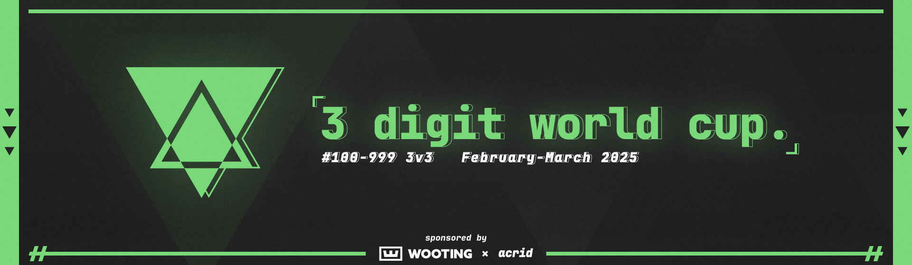
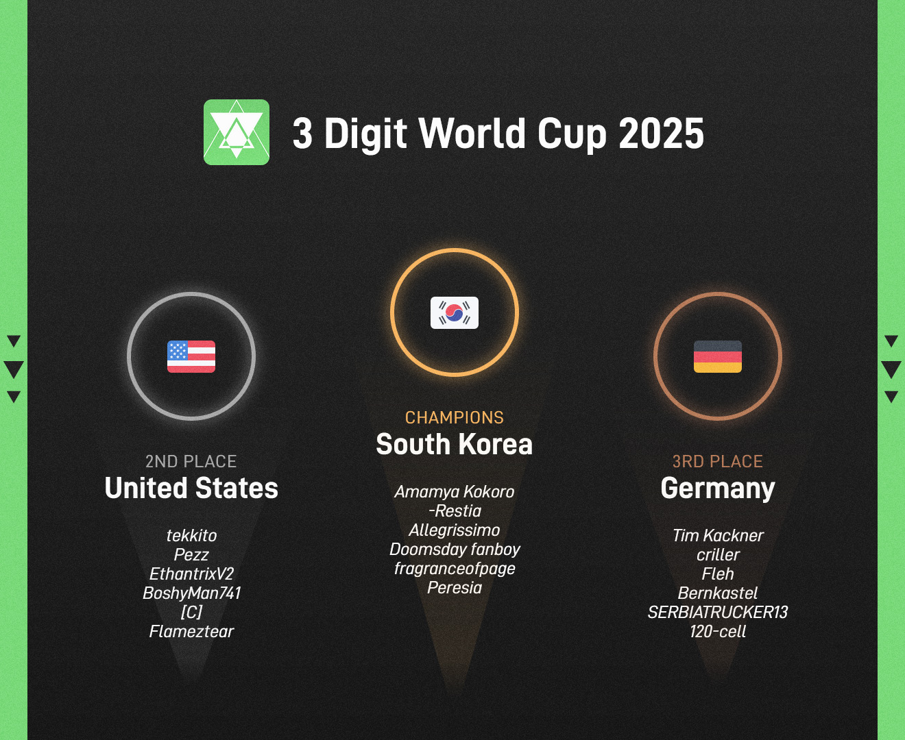

---
tags:
  - 3WC2025
  - 3WC
---

# 3 Digit World Cup 2025

The **3 Digit World Cup 2025** (***3WC2025***) was a 3v3, double-elimination, country-based osu! tournament hosted by ::{ flag=FI }:: [shdewz](https://osu.ppy.sh/users/10000899) and ::{ flag=NL }:: [nik](https://osu.ppy.sh/users/10077264). It was the seventh instalment of the 3 Digit World Cup.

## Tournament schedule

| Event | Timestamp |
| --: | :-- |
| Registration phase | 2024-12-28/2025-01-12 (18:00 UTC) |
| Team submission phase | 2025-01-12/2025-01-26 (23:59 UTC) |
| Qualifier showcase | 2025-02-02 |
| Qualifier stage | 2025-02-08/2025-02-09 |
| Round of 16 | 2025-02-15/2025-02-16 |
| Quarterfinals | 2025-02-22/2025-02-23 |
| Semifinals | 2025-03-01/2025-03-02 |
| Finals | 2025-03-08/2025-03-09 |
| Grand Finals | 2025-03-15/2025-03-16 |

## Prizes

The 3 Digit World Cup 2025 awarded winners with a [community-funded prize pool on Open Collective](https://opencollective.com/3wc).

| Placing | Prize(s) |
| :-: | :-- |
|  | Tablet cover and Wooting UwU (non-RGB) keyboard for each player, 44% of the prize pool, profile badge, animated profile banner |
|  | 32% of the prize pool, animated profile banner |
|  | 24% of the prize pool, animated profile banner |

## Organisation

The 3 Digit World Cup 2025 was run by various community members.

| Position | Member(s) |
| :-- | :-- |
| Organiser | ::{ flag=FI }:: [shdewz](https://osu.ppy.sh/users/10000899), ::{ flag=NL }:: [nik](https://osu.ppy.sh/users/10077264) |
| Designer and developer | ::{ flag=FI }:: [shdewz](https://osu.ppy.sh/users/10000899) |
| Mappool selector | ::{ flag=NL }:: [nik](https://osu.ppy.sh/users/10077264) |
| Mappool playtester | ::{ flag=SM }:: [Arge](https://osu.ppy.sh/users/11215030), ::{ flag=PL }:: [cezgru](https://osu.ppy.sh/users/2629617), ::{ flag=US }:: [ChillierPear](https://osu.ppy.sh/users/9501251), ::{ flag=CA }:: [chiv](https://osu.ppy.sh/users/6701656), ::{ flag=CA }:: [D I O](https://osu.ppy.sh/users/3958619), ::{ flag=US }:: [Emerald Ages](https://osu.ppy.sh/users/10224047), ::{ flag=PH }:: [enri](https://osu.ppy.sh/users/8640970), ::{ flag=DE }:: [Ezius](https://osu.ppy.sh/users/1861823), ::{ flag=CN }:: [FcEazy](https://osu.ppy.sh/users/7825227), ::{ flag=US }:: [fieryrage](https://osu.ppy.sh/users/3533958), ::{ flag=DE }:: [Hixia](https://osu.ppy.sh/users/6263574), ::{ flag=US }:: [hubbawubba](https://osu.ppy.sh/users/15910288), ::{ flag=PL }:: [kiir0chii](https://osu.ppy.sh/users/9322480), ::{ flag=KR }:: [Lujeol](https://osu.ppy.sh/users/14447878), ::{ flag=US }:: [M I L E S](https://osu.ppy.sh/users/6036351), ::{ flag=GB }:: [MALTESER](https://osu.ppy.sh/users/5218178), ::{ flag=FR }:: [Musty](https://osu.ppy.sh/users/251683), ::{ flag=FI }:: [nemq](https://osu.ppy.sh/users/11644972), ::{ flag=FI }:: [Nev-](https://osu.ppy.sh/users/11836334), ::{ flag=NL }:: [niqht](https://osu.ppy.sh/users/14390731), ::{ flag=MX }:: [Riot](https://osu.ppy.sh/users/4256461), ::{ flag=FI }:: [shdewz](https://osu.ppy.sh/users/10000899), ::{ flag=TW }:: [Shiina Noriko](https://osu.ppy.sh/users/1285637), ::{ flag=PL }:: [Tutka](https://osu.ppy.sh/users/8170022), ::{ flag=AU }:: [Vordi](https://osu.ppy.sh/users/6659116), ::{ flag=NO }:: [YokesPai](https://osu.ppy.sh/users/6399568) |
| Eliminated playtester | ::{ flag=FI }:: [Amasetic](https://osu.ppy.sh/users/11375251), ::{ flag=GR }:: [JackPaX](https://osu.ppy.sh/users/11226645), ::{ flag=GB }:: [skiatzo](https://osu.ppy.sh/users/16774872) |
| Mapper | ::{ flag=TW }:: [9ami](https://osu.ppy.sh/users/1499997), ::{ flag=KR }:: [Atipir](https://osu.ppy.sh/users/8991722), ::{ flag=DE }:: [Bazuso](https://osu.ppy.sh/users/11726139), ::{ flag=TH }:: [chests](https://osu.ppy.sh/users/14806365), ::{ flag=TW }:: [knowledgeking](https://osu.ppy.sh/users/8022517), ::{ flag=HK }:: [Kurashina Asuka](https://osu.ppy.sh/users/7476493), ::{ flag=CA }:: [MochiA](https://osu.ppy.sh/users/9312734), ::{ flag=TR }:: [MonsieurSebas](https://osu.ppy.sh/users/16543098), ::{ flag=US }:: [nooj](https://osu.ppy.sh/users/8271086), ::{ flag=TR }:: [Orkay](https://osu.ppy.sh/users/9321674), ::{ flag=TW }:: [oTwinkle](https://osu.ppy.sh/users/15095654), ::{ flag=US }:: [Rentai](https://osu.ppy.sh/users/11033243), ::{ flag=DE }:: [Ryuukan Ameri](https://osu.ppy.sh/users/8260206), ::{ flag=ID }:: [Shurelia](https://osu.ppy.sh/users/3807986), ::{ flag=SG }:: [Slyze-](https://osu.ppy.sh/users/9162649), ::{ flag=ID }:: [SupaV](https://osu.ppy.sh/users/19511007), ::{ flag=GB }:: [vita2](https://osu.ppy.sh/users/10706998), ::{ flag=AU }:: [xLolicore-](https://osu.ppy.sh/users/4525153), ::{ flag=NO }:: [YokesPai](https://osu.ppy.sh/users/6399568) |
| Streamer | ::{ flag=CA }:: [D I O](https://osu.ppy.sh/users/3958619), ::{ flag=VN }:: [Hoaq](https://osu.ppy.sh/users/7696512), ::{ flag=GB }:: [ilw8](https://osu.ppy.sh/users/14167692), ::{ flag=CA }:: [kymotsujason](https://osu.ppy.sh/users/2541804), ::{ flag=US }:: [ROB_](https://osu.ppy.sh/users/12455868), ::{ flag=RU }:: [RobotSkin_](https://osu.ppy.sh/users/13820038), ::{ flag=FI }:: [shdewz](https://osu.ppy.sh/users/10000899), ::{ flag=VN }:: [SIay](https://osu.ppy.sh/users/9587896) |
| Commentator | ::{ flag=ID }:: [BlankTap](https://osu.ppy.sh/users/10137131), ::{ flag=US }:: [ChillierPear](https://osu.ppy.sh/users/9501251), ::{ flag=CA }:: [chiv](https://osu.ppy.sh/users/6701656), ::{ flag=CA }:: [D I O](https://osu.ppy.sh/users/3958619), ::{ flag=GB }:: [Damarsh](https://osu.ppy.sh/users/7465147), ::{ flag=CA }:: [ExiaXD](https://osu.ppy.sh/users/17241883), ::{ flag=US }:: [fieryrage](https://osu.ppy.sh/users/3533958), ::{ flag=US }:: [hubbawubba](https://osu.ppy.sh/users/15910288), ::{ flag=CA }:: [I-Flame](https://osu.ppy.sh/users/11257542), ::{ flag=GR }:: [JackPaX](https://osu.ppy.sh/users/11226645), ::{ flag=KZ }:: [Lightin](https://osu.ppy.sh/users/7595619), ::{ flag=FI }:: [Nev-](https://osu.ppy.sh/users/11836334), ::{ flag=NL }:: [nik](https://osu.ppy.sh/users/10077264), ::{ flag=GB }:: [SadShiba](https://osu.ppy.sh/users/10747626), ::{ flag=FI }:: [shdewz](https://osu.ppy.sh/users/10000899), ::{ flag=FR }:: [Subaru_Arima](https://osu.ppy.sh/users/11273062), ::{ flag=US }:: [this1neguy](https://osu.ppy.sh/users/1797189), ::{ flag=US }:: [Tycani](https://osu.ppy.sh/users/6693266), ::{ flag=AU }:: [Vordi](https://osu.ppy.sh/users/6659116) |
| Referee | ::{ flag=IN }:: [-Space](https://osu.ppy.sh/users/7720204), ::{ flag=FI }:: [Aetherian](https://osu.ppy.sh/users/6263040), ::{ flag=KR }:: [Discord](https://osu.ppy.sh/users/16194858), ::{ flag=BR }:: [DizzyH](https://osu.ppy.sh/users/9896172), ::{ flag=US }:: [Emerald Ages](https://osu.ppy.sh/users/10224047), ::{ flag=US }:: [freddiiieeee](https://osu.ppy.sh/users/7112839), ::{ flag=KR }:: [Garalulu](https://osu.ppy.sh/users/757783), ::{ flag=BR }:: [LeoFLT](https://osu.ppy.sh/users/3668779), ::{ flag=SK }:: [Mavosiik](https://osu.ppy.sh/users/18927594), ::{ flag=NL }:: [nik](https://osu.ppy.sh/users/10077264), ::{ flag=RU }:: [Rainbowtaves](https://osu.ppy.sh/users/10079847), ::{ flag=US }:: [ROB_](https://osu.ppy.sh/users/12455868), ::{ flag=RU }:: [RobotSkin_](https://osu.ppy.sh/users/13820038), ::{ flag=FI }:: [shdewz](https://osu.ppy.sh/users/10000899), ::{ flag=DE }:: [TheHunter1](https://osu.ppy.sh/users/6496016), ::{ flag=GB }:: [Yazzehh](https://osu.ppy.sh/users/7068973) |

## Links

- **[Information spreadsheet](https://docs.google.com/spreadsheets/d/1XtERK64vr63pvl7yjvTGbw4P-Gz3zJaqTaDnX1Rilf8)**
- [Weekly statistics spreadsheets](https://drive.google.com/drive/folders/1v8NVyNq__TUsc8JbpN75IgGq3LZbchYL)
- [Discussion thread](https://osu.ppy.sh/community/forums/topics/2020058?n=1)
- [Livestream](https://www.twitch.tv/3wc_osu)
- [VOD collection (YouTube)](https://www.youtube.com/@3wc_osu)
- [Challonge bracket](https://challonge.com/3WC2025)
- [Pick'ems page](https://pickem.hwc.hr/tournaments/164) hosted by ::{ flag=DE }:: [hallowatcher](https://osu.ppy.sh/users/1874761)
- [Discord server](https://discord.gg/ZjPs7ya)

## Participants

|  | Team | Members |
| :-: | :-: | :-- |
|  | **Austria-Hungary**[^austria-hungary] | **[fedoragoose](https://osu.ppy.sh/users/2323131)**, [z9a](https://osu.ppy.sh/users/13057699), [z10a](https://osu.ppy.sh/users/18153252), [defii](https://osu.ppy.sh/users/8698024) |
|  | **Baltics**[^baltics] | **[basketball](https://osu.ppy.sh/users/10290012)**, [cedru](https://osu.ppy.sh/users/10162611), [ganjanov](https://osu.ppy.sh/users/11584075), [Hera_](https://osu.ppy.sh/users/8766780) |
| ::{ flag=BR }:: | **Brazil** | **[dasdwqdf](https://osu.ppy.sh/users/5403374)**, [Coreanmaluco](https://osu.ppy.sh/users/3149577), [-izzy](https://osu.ppy.sh/users/15225729), [VitorSkull](https://osu.ppy.sh/users/10223298), [shwq](https://osu.ppy.sh/users/22536015), [vetoed](https://osu.ppy.sh/users/10909373) |
| ::{ flag=CA }:: | **Canada** | **[PikaPwn](https://osu.ppy.sh/users/2012453)**, [nicki1324](https://osu.ppy.sh/users/612898), [PinkEyeFan2013](https://osu.ppy.sh/users/13609904), [fireblaze3028](https://osu.ppy.sh/users/9088637), [pretty girl](https://osu.ppy.sh/users/11684952), [leny](https://osu.ppy.sh/users/8222366) |
| ::{ flag=CL }:: | **Chile** | **[Eunha](https://osu.ppy.sh/users/7701428)**, [Nekore](https://osu.ppy.sh/users/18946207), [_fefe](https://osu.ppy.sh/users/8133880), [Oscar con boina](https://osu.ppy.sh/users/18284065), [alfiu](https://osu.ppy.sh/users/17724014), [YukariSmug](https://osu.ppy.sh/users/12211248) |
| ::{ flag=CN }:: | **China** | **[lolol235](https://osu.ppy.sh/users/6090175)**, [Crystal](https://osu.ppy.sh/users/1646397), [MidC](https://osu.ppy.sh/users/20461077), [Ledeau_Fox](https://osu.ppy.sh/users/15816872) |
| ::{ flag=FI }:: | **Finland** | **[Amasetic](https://osu.ppy.sh/users/11375251)**, [AllyrD](https://osu.ppy.sh/users/9561644), [Isak-](https://osu.ppy.sh/users/8702650), [Tabletti](https://osu.ppy.sh/users/9523661), [chu](https://osu.ppy.sh/users/14764185), [BeerLovingGnome](https://osu.ppy.sh/users/4959454) |
| ::{ flag=FR }:: | **France** | **[Hifkil](https://osu.ppy.sh/users/4301976)**, [Thuya](https://osu.ppy.sh/users/11750028), [Satsukiiii](https://osu.ppy.sh/users/25626082), [JapWhite](https://osu.ppy.sh/users/7068158), [-Wum-](https://osu.ppy.sh/users/11170841), [lonq noir](https://osu.ppy.sh/users/14165027) |
| ::{ flag=DE }:: | **Germany** | **[Tim Kackner](https://osu.ppy.sh/users/14385814)**, [criller](https://osu.ppy.sh/users/8116659), [Fleh](https://osu.ppy.sh/users/7780605), [Bernkastel](https://osu.ppy.sh/users/5154946), [SERBIATRUCKER13](https://osu.ppy.sh/users/15339747), [120-cell](https://osu.ppy.sh/users/12571145) |
| ::{ flag=GR }:: | **Greece** | **[JackPaX](https://osu.ppy.sh/users/11226645)**, [-Puyu](https://osu.ppy.sh/users/10398348), [Nekkid](https://osu.ppy.sh/users/12145220), [Mqnster](https://osu.ppy.sh/users/27672816), [bob man](https://osu.ppy.sh/users/20263707) |
|  | **Iberia**[^iberia] | **[M A N O L O](https://osu.ppy.sh/users/12296128)**, [ESCRUPULILLO](https://osu.ppy.sh/users/18217876), [RafaMat](https://osu.ppy.sh/users/10743390), [A L E P H](https://osu.ppy.sh/users/6735738), [Omeguii](https://osu.ppy.sh/users/10596572), [towny1](https://osu.ppy.sh/users/16512684) |
|  | **Imperio Rioplatense**[^imperio-rioplatense] | **[Rebo](https://osu.ppy.sh/users/6942259)**, [Kazuki K](https://osu.ppy.sh/users/6407282), [R1cho](https://osu.ppy.sh/users/13065919), [viciobylike](https://osu.ppy.sh/users/18922516), [Bomilk](https://osu.ppy.sh/users/7081596), [Seiong](https://osu.ppy.sh/users/7341471) |
| ::{ flag=ID }:: | **Indonesia** | **[Hakui Koyori](https://osu.ppy.sh/users/10717635)**, [Stixe](https://osu.ppy.sh/users/18351160), [GNX](https://osu.ppy.sh/users/10069909), [MineFrostID](https://osu.ppy.sh/users/12159899), [Norlain](https://osu.ppy.sh/users/11983229), [VtuberVoiceASMR](https://osu.ppy.sh/users/8780223) |
| ::{ flag=JP }:: | **Japan** | **[Teacchyyy](https://osu.ppy.sh/users/7178423)**, [YMD](https://osu.ppy.sh/users/17202789), [haga1115](https://osu.ppy.sh/users/6574823), [yukin1014](https://osu.ppy.sh/users/8329753), [Furamun](https://osu.ppy.sh/users/14671051) |
| ::{ flag=NO }:: | **Norway** | **[Melvr](https://osu.ppy.sh/users/9211924)**, [Pinguinzi](https://osu.ppy.sh/users/9414229), [nanolini](https://osu.ppy.sh/users/12353810), [veirakk](https://osu.ppy.sh/users/15423958), [chaotic_turtle](https://osu.ppy.sh/users/5563397), [HUNDUR](https://osu.ppy.sh/users/3145033) |
|  | **Oceania**[^oceania] | **[cyo](https://osu.ppy.sh/users/8195473)**, [palr](https://osu.ppy.sh/users/15429006), [Arbusion](https://osu.ppy.sh/users/11469447), [Xaver](https://osu.ppy.sh/users/7410343), [ozy](https://osu.ppy.sh/users/11310423), [Emilbus](https://osu.ppy.sh/users/11141578) |
| ::{ flag=PH }:: | **Philippines** | **[NathanRam1918](https://osu.ppy.sh/users/4734703)**, [zonelouise](https://osu.ppy.sh/users/1492995), [LordGabriel](https://osu.ppy.sh/users/9227895), [aurora on osu](https://osu.ppy.sh/users/12352050), [Alue](https://osu.ppy.sh/users/7467327), [Icarussy](https://osu.ppy.sh/users/19526828) |
| ::{ flag=PL }:: | **Poland** | **[szedis](https://osu.ppy.sh/users/14282987)**, [Bartek22830](https://osu.ppy.sh/users/6404027), [Mastasz](https://osu.ppy.sh/users/1876565), [Kosiarek](https://osu.ppy.sh/users/9086565), [Tartis](https://osu.ppy.sh/users/9513980), [alimentaire](https://osu.ppy.sh/users/4981809) |
| ::{ flag=RO }:: | **Romania** | **[Lucrise](https://osu.ppy.sh/users/9719351)**, [etn](https://osu.ppy.sh/users/4581069), [nanoya](https://osu.ppy.sh/users/12366071), [badeu](https://osu.ppy.sh/users/1473890), [origin_](https://osu.ppy.sh/users/15095811) |
| ::{ flag=RU }:: | **Russian Federation** | **[HandsomeMe](https://osu.ppy.sh/users/11376152)**, [Skrowell](https://osu.ppy.sh/users/9694263), [-Din-](https://osu.ppy.sh/users/7972980), [de_nuke_](https://osu.ppy.sh/users/9712285), [Ice Shark](https://osu.ppy.sh/users/9459674), [DaHuJka](https://osu.ppy.sh/users/6830745) |
| ::{ flag=KR }:: | **South Korea** | **[Amamya Kokoro](https://osu.ppy.sh/users/2511839)**, [-Restia](https://osu.ppy.sh/users/7892320), [Allegrissimo](https://osu.ppy.sh/users/9052194), [Doomsday fanboy](https://osu.ppy.sh/users/4511522), [fragranceofpage](https://osu.ppy.sh/users/11399348), [Peresia](https://osu.ppy.sh/users/7027766) |
| ::{ flag=SE }:: | **Sweden** | **[trumpatino69](https://osu.ppy.sh/users/10903510)**, [Jageko](https://osu.ppy.sh/users/5798349), [TheNexusGamer](https://osu.ppy.sh/users/7205256), [Zever](https://osu.ppy.sh/users/16620877), [Purpol](https://osu.ppy.sh/users/14287201), [Sleya](https://osu.ppy.sh/users/11961979) |
| ::{ flag=TW }:: | **Taiwan** | **[_Shield](https://osu.ppy.sh/users/1860489)**, [willy0214](https://osu.ppy.sh/users/8660293), [\[ Zane \]](https://osu.ppy.sh/users/3517706), [Rizer](https://osu.ppy.sh/users/5155973), [DazzLE_Wind](https://osu.ppy.sh/users/2537924), [Kyros_](https://osu.ppy.sh/users/23925029) |
| ::{ flag=UA }:: | **Ukraine** | **[Ayla](https://osu.ppy.sh/users/4548264)**, [RafGPio](https://osu.ppy.sh/users/13705417), [sur1](https://osu.ppy.sh/users/13872859), [Slowpoke1327](https://osu.ppy.sh/users/9820878), [gusniki](https://osu.ppy.sh/users/9830628), [1Max](https://osu.ppy.sh/users/11653711) |
| ::{ flag=GB }:: | **United Kingdom** | **[Bubbleman](https://osu.ppy.sh/users/5182050)**, [Mahmood](https://osu.ppy.sh/users/7627844), [EZChamp](https://osu.ppy.sh/users/1719471), [HAUNTE](https://osu.ppy.sh/users/7333471), [skiatzo](https://osu.ppy.sh/users/16774872), [lystia](https://osu.ppy.sh/users/11042418) |
| ::{ flag=US }:: | **United States** | **[tekkito](https://osu.ppy.sh/users/7075211)**, [Pezz](https://osu.ppy.sh/users/10651106), [EthantrixV2](https://osu.ppy.sh/users/10634348), [BoshyMan741](https://osu.ppy.sh/users/4830687), [\[C\]](https://osu.ppy.sh/users/7959945), [Flameztear](https://osu.ppy.sh/users/13207763) |

## Podium

## Mappools

### Grand Finals

[View the showcase VOD here](https://www.youtube.com/watch?v=w0YuXWm3WCw)

- No Mod
  1. [hasu - Pile Of Corpses (bad boy) \[alden & melon's Abyss\]](https://osu.ppy.sh/beatmapsets/2196123#osu/4647035)
  2. [Spire - sayonara (Elcheer) \[farewell 260\]](https://osu.ppy.sh/beatmapsets/1703903#osu/3481594)
  3. [TK from Ling tosite sigure - first death (aishiteiru-) \[raijodo's extreme\]](https://osu.ppy.sh/beatmapsets/2033133#osu/4469976)
  4. [Akiri - ROTTED AS THE QUEEN OF THE RATS (xLolicore-) \[lucky cookie vicky!\]](https://osu.ppy.sh/beatmapsets/2337064#osu/5017759)
  5. [tikango - Tubumi (YokesPai) \[Late Night Reading Session\]](https://osu.ppy.sh/beatmapsets/2337077#osu/5017787)
- Hidden
  1. [Remo Prototype (CV: Hanamori Yumiri) - Sendan Life (fedora-) \[Prototype\]](https://osu.ppy.sh/beatmapsets/1507523#osu/3087594)
  2. [Ruxxi - Black Magic (Realazy) \[Dark Arts\]](https://osu.ppy.sh/beatmapsets/1850920#osu/3802313)
  3. [Sasaki Sayaka - Golden Mission (Kurashina Asuka) \[Blissful Fantasy\]](https://osu.ppy.sh/beatmapsets/2337069#osu/5017767)
- Hard Rock
  1. [TRiDENT - Continue (knowledgeking) \[Perpetual\]](https://osu.ppy.sh/beatmapsets/2336993#osu/5017323)
  2. [AAAA + Umeboshi Chazuke - Cait Sith (bob) \[Cat-sith\]](https://osu.ppy.sh/beatmapsets/1848926#osu/3798091)
  3. [The Gentle Men - I Am Truth (squirrelpascals) \[Big if Truth\]](https://osu.ppy.sh/beatmapsets/1485216#osu/3045656)
- Double Time
  1. [Tsuda Minami & Okubo Rumi - Girl's Power de (Ryuukan Ameri) \[Yuri\]](https://osu.ppy.sh/beatmapsets/2337075#osu/5017782)
  2. [S.S.H. & Aether - Locked Girl ~ the Girl's Secret Room (Shurelia) \[Philosopher's Stone\]](https://osu.ppy.sh/beatmapsets/2336986#osu/5017283)
  3. [Camellia feat. Ninomae Ina'nis - Drenched in Air (Mir) \[Insane\]](https://osu.ppy.sh/beatmapsets/1995184#osu/4152865)
  4. [kors k - Insane Techniques (Extended) (RLC) \[( ' v ' )\]](https://osu.ppy.sh/beatmapsets/181957#osu/1151879)
- Free Mod
  1. [Masa - Kitsune no Yomeiri (Roll_Pan) \[AR9.6\]](https://osu.ppy.sh/beatmapsets/352624#osu/777073)
  2. [Gojira - Esoteric surgery (MonsieurSebas) \[Tale of the immortal\]](https://osu.ppy.sh/beatmapsets/2337070#osu/5017768)
  3. [44teru-k - F.I (-Tynamo) \[ktgster's Special Insanity\]](https://osu.ppy.sh/beatmapsets/2036791#osu/4280072)
  4. [Nhato - Virus Funk (-kevincela-) \[Zelq's chonk Z\]](https://osu.ppy.sh/beatmapsets/2114086#osu/4876662)
- Tiebreaker
  1. **[sugosugiii - Zyphorath Quixalune (9ami) \[Celestial Veil\]](https://osu.ppy.sh/beatmapsets/2337098#osu/5017830)**

### Finals

[View the showcase VOD here](https://www.youtube.com/watch?v=M65YOQCyyJY)

- No Mod
  1. [System Of A Down - Cigaro (SupaV) \[Can't you see that you love my C\]](https://osu.ppy.sh/beatmapsets/2332976#osu/5006403)
  2. [Whispered - Exile of the Floating World (MrKosiej) \[Drifting Path\]](https://osu.ppy.sh/beatmapsets/769346#osu/1617731)
  3. [XenjeS - Night Sky Solitude (nooj) \[Nocturne, the Eternal Nightmare\]](https://osu.ppy.sh/beatmapsets/2333228#osu/5006943 )
  4. [Endorfin. vs Feryquitous - Sincuvate (Rentai) \[Coalescence\]](https://osu.ppy.sh/beatmapsets/2333309#osu/5007132)
  5. [NayutalieN - Rocket Cider (BoshyMan741) \[I want soda pop\]](https://osu.ppy.sh/beatmapsets/2056015#osu/4296282)
- Hidden
  1. [Falcom Sound Team jdk - Belief (Deca) \[LMT's Extra\]](https://osu.ppy.sh/beatmapsets/1569794#osu/3205628)
  2. [SiLiS vs sugosugiii feat. Eili - AZENINE (Bazuso) \[Irisine Zenith\]](https://osu.ppy.sh/beatmapsets/2333230#osu/5006948)
  3. [ELEMENTAS (A-One) - Yoru ga Oritekuru ~ Evening Star (Shurelia) \[Last Word\]](https://osu.ppy.sh/beatmapsets/2027939#osu/4225846)
- Hard Rock
  1. [MuryokuP - Sweet Sweet Cendrillon Drug (Mordred) \[Despair\]](https://osu.ppy.sh/beatmapsets/878167#osu/1836680)
  2. [fripSide - LEVEL5 -judgelight- (iRedi) \[Matha's -extraordinary-\]](https://osu.ppy.sh/beatmapsets/2074570#osu/4342484)
  3. [Amuro vs. Killer - Mei (Ascended) \[how2miss' Kaiden\]](https://osu.ppy.sh/beatmapsets/2062538#osu/4314556)
- Double Time
  1. [MGMT - Song for Dan Treacy (vita2) \[Enigmatic\]](https://osu.ppy.sh/beatmapsets/2205966#osu/4670486)
  2. [ZUN - Desire Drive (Halfslashed) \[Lunatic\]](https://osu.ppy.sh/beatmapsets/1276352#osu/2789103)
  3. [Camellia vs Akira Complex - Railgun Roulette (VIP) (NeilPerry) \[LowBot's Insane\]](https://osu.ppy.sh/beatmapsets/694402#osu/1501410)
  4. [P.I.N.A. - Rat ga Shinda feat. SymaG (eiri-) \[Expert\]](https://osu.ppy.sh/beatmapsets/976205#osu/2042993)
- Free Mod
  1. [Laur - Nostalgic Blood of the Strife (Zelq) \[HEAVENLY\]](https://osu.ppy.sh/beatmapsets/1257525#osu/3036752)
  2. [Tsumiki - phony (Ryuusei Aika) \[?????????\]](https://osu.ppy.sh/beatmapsets/1533832#osu/3136646)
  3. [ZUN - G Free (Halfslashed) \[Extra Stage\]](https://osu.ppy.sh/beatmapsets/1884924#osu/3880952)
  4. [onoken - ZADAMGA (Down) \[Black Seal\]](https://osu.ppy.sh/beatmapsets/1492550#osu/3169730)
- Tiebreaker
  1. **[Camellia feat. Nanahira - Force! (Deca) \[Canadian Collab!\]](https://osu.ppy.sh/beatmapsets/2135413#osu/4493336)**

### Semifinals

[View the showcase VOD here](https://www.youtube.com/watch?v=MxCvSWU7w0A)

- No Mod
  1. [nao - Toaru Shoukoku no Ohimesama ga... (Nana Abe) \[Hime Hime Collab\]](https://osu.ppy.sh/beatmapsets/1276409#osu/2651915)
  2. [Dj Grimoire - Astral Quantization (Slyze-) \[Forlorn\]](https://osu.ppy.sh/beatmapsets/2329337#osu/4994856)
  3. [School Food Punishment - Y/N (Weoweet) \[Interrobang\]](https://osu.ppy.sh/beatmapsets/2322078#osu/4975201)
  4. [Camellia - Syzygia (colicen) \[Galaxy Burst\]](https://osu.ppy.sh/beatmapsets/1282504#osu/2663767)
  5. [Krimek feat. dokxid - Gravity Hole (Nytrocide_) \[Interstellar\]](https://osu.ppy.sh/beatmapsets/1983505#osu/4119360)
- Hidden
  1. [Natori Sana - Parallel Searchlight (Atipir) \[Prismatic Starlight\]](https://osu.ppy.sh/beatmapsets/2329507#osu/4996026)
  2. [May'n - Scarlet Ballet (bakabaka) \[Expert\]](https://osu.ppy.sh/beatmapsets/105090#osu/4375293)
  3. [I2ka x Tanchiky - Voice (Cut Ver.) (Kyrian) \[Special\]](https://osu.ppy.sh/beatmapsets/1532435#osu/3133966)
- Hard Rock
  1. [paraoka feat. haru\*nya - Tyranny (toybot) \[EXPERT\]](https://osu.ppy.sh/beatmapsets/2255589#osu/4798381)
  2. [Midian - Metro Speedway (vita2) \[Extreme\]](https://osu.ppy.sh/beatmapsets/2329369#osu/4995025)
  3. [Masayoshi Iimori - BREAK OVER (-PC) \[Another\]](https://osu.ppy.sh/beatmapsets/921088#osu/1923476)
- Double Time
  1. [Nakano Nino (CV: Taketatsu Ayana) - Suki yo ~Two Hearts~ (ckharv) \[Tsundere\]](https://osu.ppy.sh/beatmapsets/1787575#osu/3662336)
  2. [Halozy - Kikoku Doukoku Jigokuraku (228) \[Orin, what the HELL is this\]](https://osu.ppy.sh/beatmapsets/2066012#osu/4322135)
  3. [ALiCE'S EMOTiON - Dark Flight Dreamer (Feiri) \[Lunatic\]](https://osu.ppy.sh/beatmapsets/1431375#osu/2946442)
  4. [onoken - vijore (kiddly) \[Mythic\]](https://osu.ppy.sh/beatmapsets/248948#osu/572475)
- Free Mod
  1. [UNDEAD CORPORATION - MEGALOMANIA (Daycore) \[KK'S EXTREME\]](https://osu.ppy.sh/beatmapsets/2280680#osu/4862035)
  2. [Demetori - Love Coloured Master Spark (Seni) \[Eggstra Stegg\]](https://osu.ppy.sh/beatmapsets/2215054#osu/4693296)
  3. [Ryu\* - Mind Mapping (kors k mix) (AJT) \[EXTRA\]](https://osu.ppy.sh/beatmapsets/1774369#osu/3633083)
  4. [kamome sano - Elemental Creation (kamome sano Remix) (UberFazz) \[MAXIMUM\]](https://osu.ppy.sh/beatmapsets/1569809#osu/3205646)
- Tiebreaker
  1. **[FELT - Lies in Reality (Vanya2) \[Reflection\]](https://osu.ppy.sh/beatmapsets/1851016#osu/3802584)**

### Quarterfinals

[View the showcase VOD here](https://www.youtube.com/watch?v=2DQ70wI-MOw)

- No Mod
  1. [Caramell - Caramelldansen (Ryu\* Remix) (AJT) \[(\* V\* )\]](https://osu.ppy.sh/beatmapsets/1770758#osu/3624869)
  2. [Hideous Divinity - The Deaden Room (Orkay) \[Precognition of Blood\]](https://osu.ppy.sh/beatmapsets/2325281#osu/4984190)
  3. [Kakeru - Do you love me? feat. Rntl (lcfc) \[kurukuru\]](https://osu.ppy.sh/beatmapsets/1235834#osu/2569027)
  4. [Feryquitous vs. xi - Orca (lcfc) \[Succulent\]](https://osu.ppy.sh/beatmapsets/1166748#osu/2433641)
- Hidden
  1. [ASIAN KUNG-FU GENERATION - After Dark (-NeBu-) \[Riding On Faint Hopes Carried By The Night Wind\]](https://osu.ppy.sh/beatmapsets/2268520#osu/4831196)
  2. [POLKADOT STINGRAY - Keshin (Keqing) \[Atalanta's Extreme\]](https://osu.ppy.sh/beatmapsets/1311266#osu/2987479)
- Hard Rock
  1. [Ice - Amber Wishes (Deemo edit) (Astronic) \[\_Epreus' Diminuendo\]](https://osu.ppy.sh/beatmapsets/1610241#osu/4254657)
  2. [Feryquitous - Estahv (jazzberry) \[Ethereal (nwc ver.)\]](https://osu.ppy.sh/beatmapsets/1693141#osu/3459819)
- Double Time
  1. [WALKUERE - Ikenai Borderline (Aranel) \[A Lovely Rebirth\]](https://osu.ppy.sh/beatmapsets/1866176#osu/3838647)
  2. [UNDEAD CORPORATION - Hafuri (tokiko) \[Extra Stage\]](https://osu.ppy.sh/beatmapsets/624607#osu/1316417)
  3. [An - TearVid (Shiirn) \[Another\]](https://osu.ppy.sh/beatmapsets/37980#osu/121804)
- Free Mod
  1. [Natori Sana - Mondainai Tripper! (Atipir) \[Heilia's Extra Koi!\]](https://osu.ppy.sh/beatmapsets/2199122#osu/4753450)
  2. [Ocelot - TSUBAKI (Hollow Wings) \[EX EX\]](https://osu.ppy.sh/beatmapsets/364574#osu/800237)
  3. [ani - D R G (Mordred) \[Expert\]](https://osu.ppy.sh/beatmapsets/1080571#osu/2260687)
- Tiebreaker
  1. **[LeaF - Calamity Fortune (extended ver.) (Guchiry) \[Deconstruction\]](https://osu.ppy.sh/beatmapsets/1626172#osu/3320026)**

### Round of 16

[View the showcase VOD here](https://www.youtube.com/watch?v=-gUQk3w9xPQ)

- No Mod
  1. [Neru - Inotte Iru Dake feat. Wolpis Carter (captin1) \[car slider\]](https://osu.ppy.sh/beatmapsets/1755081#osu/3591652)
  2. [Breakchild - I finally finished reading the beastars manga!!! (Tekkito) \[Extra!!!\]](https://osu.ppy.sh/beatmapsets/1757819#osu/3597317)
  3. [DIALOGUE+ - Jinsei Easy? (Amateurre) \[LV.75 Matha's Extreme\]](https://osu.ppy.sh/beatmapsets/1507979#osu/3266522)
  4. [Ariana Grande feat. Iggy Azalea - Problem (rHO) \[rHO & emilia's Trouble\]](https://osu.ppy.sh/beatmapsets/1588192#osu/3243714)
- Hidden
  1. [Mili - Ga1ahad and Scientific Witchery (Icekalt) \[617\]](https://osu.ppy.sh/beatmapsets/932901#osu/1947706)
  2. [Kairiki bear feat. Hatsune Miku - BUG (sukii) \[Lost Extra\]](https://osu.ppy.sh/beatmapsets/1796464#osu/4058452)
- Hard Rock
  1. [nano - Bull's Eye (Asphyxia) \[Last Trigger\]](https://osu.ppy.sh/beatmapsets/393986#osu/857586)
  2. [Nanahoshi Kangengakudan - Rubik's Cube (Ryuusei Aika) \[Extra\]](https://osu.ppy.sh/beatmapsets/1324798#osu/2744034)
- Double Time
  1. [ClariS - Koi Sekai (Amateurre) \[cjstmdoodl's Another\]](https://osu.ppy.sh/beatmapsets/2030184#osu/4278756)
  2. [Masayoshi Minoshima - Dream War feat. nomico (Sanch-KK) \[Koishionic Dimension\]](https://osu.ppy.sh/beatmapsets/2103125#osu/4612513)
  3. [Krimek - HyperColor (nik) \[Insane\]](https://osu.ppy.sh/beatmapsets/2248565#osu/4781121)
- Free Mod
  1. [P\*Light - 2 MINUTES FIGHTERS (Regraz) \[toybot's MASTER\]](https://osu.ppy.sh/beatmapsets/542163#osu/1156568)
  2. [Nekomata Master - The Sky of Sadness (seros) \[world/contemporary\]](https://osu.ppy.sh/beatmapsets/1983503#osu/4119358)
  3. [Kurosawa Daisuke x Masahiro "Godspeed" Aoki - Dairokutenmaou (pw384) \[Extreme\]](https://osu.ppy.sh/beatmapsets/1120841#osu/2371971)
- Tiebreaker
  1. **[USAO - USAO ULTIMATE HYPER MEGA MIX (Realazy) \[REAL x ALHEAK'S ULTIMATE HYPER MEGA COLLAB\]](https://osu.ppy.sh/beatmapsets/943354#osu/1970040)**

### Qualifiers

[View the showcase VOD here](https://www.youtube.com/watch?v=eLejcl0Dewk)

- No Mod
  1. [mirai akari - mirai to mirai (toybot) \[?\]](https://osu.ppy.sh/beatmapsets/2012939#osu/4188886)
  2. [xi - Beatrice (Gordon) \[Solace\]](https://osu.ppy.sh/beatmapsets/1664961#osu/3398914)
  3. [ZAQ - Minor Piece (Petal) \[Melancholy\]](https://osu.ppy.sh/beatmapsets/2147857#osu/4524272)
  4. [Rory in early 20s - used to it (Halgoh) \[Halgoh x Sharu Tridolon Cull\]](https://osu.ppy.sh/beatmapsets/2012001#osu/4186705)
- Hidden
  1. [paraoka feat. haru\*nya - Boot (attendant) \[Jounzan's Expert\]](https://osu.ppy.sh/beatmapsets/1649456#osu/3366726)
  2. [Frog96 - Letter to the Black World (_Destiny) \[ar8 for pissbabies\]](https://osu.ppy.sh/beatmapsets/2098923#osu/4638573)
- Hard Rock
  1. [Camellia - Compute It With Some Devilish Alcoholic Steampunk Engines (DeRandom Otaku) \[Retrofuturism\]](https://osu.ppy.sh/beatmapsets/1280590#osu/2660097)
  2. [Alice Schach and the Magic Orchestra - Give Me a Nightmare (Aeril) \[FUTURE+\]](https://osu.ppy.sh/beatmapsets/1569814#osu/3205652)
- Double Time
  1. [Mitchie M - Ageage Again (Natsu) \[captin's Insane\]](https://osu.ppy.sh/beatmapsets/220694#osu/516452)
  2. [Yousei Teikoku - Infection (Net0) \[Insane\]](https://osu.ppy.sh/beatmapsets/1897554#osu/3910916)

## Match results

### Grand Finals

Saturday, 15 March 2025:

| Team A |  |  | Team B | Match link | VOD link |
| --: | :-: | :-: | :-- | :-- | :-- |
| **South Korea** ::{ flag=KR }:: | **7** | 1 | ::{ flag=DE }:: Germany | [#1](https://osu.ppy.sh/community/matches/117486446) | [#1](https://www.youtube.com/watch?v=gjVsVFJvn5o) |

Sunday, 16 March 2025:

| Team A |  |  | Team B | Match link | VOD link |
| --: | :-: | :-: | :-- | :-- | :-- |
| United States ::{ flag=US }:: | 1 | **7** | ::{ flag=KR }:: **South Korea** | [#1](https://osu.ppy.sh/community/matches/117495377) | [#1](https://www.youtube.com/watch?v=PjAs9o0a9PI) |

Sunday, 23 March 2025:

| Team A |  |  | Team B | Match link | VOD link |
| --: | :-: | :-: | :-- | :-- | :-- |
| **South Korea** ::{ flag=KR }:: | **7** | 6 | ::{ flag=US }:: United States | [#1](https://osu.ppy.sh/community/matches/117566226) | [#1](https://www.youtube.com/watch?v=ETBqWoZm-wQ) |

### Finals

Detailed statistics for this round can be found [on this spreadsheet](https://docs.google.com/spreadsheets/d/1styKehRVhim7PeFEr178Bk39KQdVxEJtFXfSEiXTK10).

Friday, 7 March 2025:

| Team A |  |  | Team B | Match link | VOD link |
| --: | :-: | :-: | :-- | :-- | :-- |
| **Germany** ::{ flag=DE }:: | **7** | 5 | ::{ flag=GB }:: United Kingdom | [#1](https://osu.ppy.sh/community/matches/117407341) | [#1](https://www.youtube.com/watch?v=deEmC2CaYIE) |

Saturday, 8 March 2025:

| Team A |  |  | Team B | Match link | VOD link |
| --: | :-: | :-: | :-- | :-- | :-- |
| Poland ::{ flag=PL }:: | 6 | **7** | ::{ flag=PH }:: **Philippines** | [#1](https://osu.ppy.sh/community/matches/117414921) | [#1](https://www.youtube.com/watch?v=b7gfbGQUtNc) |

Sunday, 9 March 2025:

| Team A |  |  | Team B | Match link | VOD link |
| --: | :-: | :-: | :-- | :-- | :-- |
| South Korea ::{ flag=KR }:: | 4 | **7** | ::{ flag=US }:: **United States** | [#1](https://osu.ppy.sh/community/matches/117423979) | [#1](https://www.youtube.com/watch?v=W3QNvK2oZdk) |
| **Germany** ::{ flag=DE }:: | **7** | 2 | ::{ flag=PH }:: Philippines | [#1](https://osu.ppy.sh/community/matches/117428066) | [#1](https://www.youtube.com/watch?v=o9IXB_JRTQs) |

### Semifinals

Detailed statistics for this round can be found [on this spreadsheet](https://docs.google.com/spreadsheets/d/14RnJtOcHnPFkQ-UZf9ijI_6TMbWaACOlCiyatpf_BRc).

Saturday, 1 March 2025:

| Team A |  |  | Team B | Match link | VOD link |
| --: | :-: | :-: | :-- | :-- | :-- |
| **Philippines** ::{ flag=PH }:: | **7** | 4 | ::{ flag=CA }:: Canada | [#1](https://osu.ppy.sh/community/matches/117338946) | [#1](https://www.youtube.com/watch?v=IoV1aDp7Aac) |
| Romania ::{ flag=RO }:: | 4 | **7** |  **Austria-Hungary** | [#1](https://osu.ppy.sh/community/matches/117344432) | [#1](https://www.youtube.com/watch?v=yR3aZ97-0G4) |
| **United Kingdom** ::{ flag=GB }:: | **7** | 3 | ::{ flag=BR }:: Brazil | [#1](https://osu.ppy.sh/community/matches/117347800) | [#1](https://www.youtube.com/watch?v=RnBtdqx8E0I) |

Sunday, 2 March 2025:

| Team A |  |  | Team B | Match link | VOD link |
| --: | :-: | :-: | :-- | :-- | :-- |
| Russian Federation ::{ flag=RU }:: | 6 | **7** |  **Oceania** | [#1](https://osu.ppy.sh/community/matches/117354497) | [#1](https://www.youtube.com/watch?v=-foIqkldTH0) |
| Oceania  | 4 | **7** | ::{ flag=PH }:: **Philippines** | [#1](https://osu.ppy.sh/community/matches/117355379) | [#1](https://www.youtube.com/watch?v=bnCtay6mKas) |
| **South Korea** ::{ flag=KR }:: | **7** | 1 | ::{ flag=PL }:: Poland | [#1](https://osu.ppy.sh/community/matches/117355771) | [#1](https://www.youtube.com/watch?v=6elNDd8BVwQ) |
| Austria-Hungary  | 4 | **7** | ::{ flag=GB }:: **United Kingdom** | [#1](https://osu.ppy.sh/community/matches/117358981) | [#1](https://www.youtube.com/watch?v=_jbNvl86cDw) |
| **United States** ::{ flag=US }:: | **7** | 4 | ::{ flag=DE }:: Germany | [#1](https://osu.ppy.sh/community/matches/117359986) | [#1](https://www.youtube.com/watch?v=-H4Vg5ldfYA) |

### Quarterfinals

Detailed statistics for this round can be found [on this spreadsheet](https://docs.google.com/spreadsheets/d/1sr482zw80HC4ItRqqLsysFPkFWfxH7q1eLrtjR27QBo).

Saturday, 22 February 2025:

| Team A |  |  | Team B | Match link | VOD link |
| --: | :-: | :-: | :-- | :-- | :-- |
| **United States** ::{ flag=US }:: | **6** | 1 | ::{ flag=PH }:: Philippines | [#1](https://osu.ppy.sh/community/matches/117261142) | [#1](https://www.youtube.com/watch?v=-ZBOppgAo2o) |
| **South Korea** ::{ flag=KR }:: | **6** | 0 | ::{ flag=GB }:: United Kingdom | [#1](https://osu.ppy.sh/community/matches/117265646) | [#1](https://www.youtube.com/watch?v=C9Afzts_kZ0) |
| France ::{ flag=FR }:: | 2 | **6** | ::{ flag=BR }:: **Brazil** | [#1](https://osu.ppy.sh/community/matches/117268474) | [#1](https://www.youtube.com/watch?v=SJ-WGJF6_Gg) |

Sunday, 23 February 2025:

| Team A |  |  | Team B | Match link | VOD link |
| --: | :-: | :-: | :-- | :-- | :-- |
| Greece ::{ flag=GR }:: | 1 | **6** |  **Oceania** | [#1](https://osu.ppy.sh/community/matches/117278395) | [#1](https://www.youtube.com/watch?v=t5lz-lTMp1M) |
| **Germany** ::{ flag=DE }:: | **6** | 2 | ::{ flag=RU }:: Russian Federation | [#1](https://osu.ppy.sh/community/matches/117280759) | [#1](https://www.youtube.com/watch?v=G9kA38jcvSs) |
| **Austria-Hungary**  | **6** | 5 | ::{ flag=FI }:: Finland | [#1](https://osu.ppy.sh/community/matches/117281926) | [#1](https://www.youtube.com/watch?v=w-uiBSqM0s0) |
| **Poland** ::{ flag=PL }:: | **6** | 1 | ::{ flag=RO }:: Romania | [#1](https://osu.ppy.sh/community/matches/117282689) | [#1](https://www.youtube.com/watch?v=Wvy-gwGheaU) |
| **Canada** ::{ flag=CA }:: | **6** | 1 | ::{ flag=CL }:: Chile | [#1](https://osu.ppy.sh/community/matches/117286475) | [#1](https://www.youtube.com/watch?v=JQN63VmFJv4) |

### Round of 16

Detailed statistics for this round can be found [on this spreadsheet](https://docs.google.com/spreadsheets/d/1NDfInG1UA_E5dKPK6goQB_slQlD1Feu-K0uVvtzGc4I).

Saturday, 15 February 2025:

| Team A |  |  | Team B | Match link | VOD link |
| --: | :-: | :-: | :-- | :-- | :-- |
| **Philippines** ::{ flag=PH }:: | **6** | 2 | ::{ flag=FI }:: Finland | [#1](https://osu.ppy.sh/community/matches/117184894) | [#1](https://www.youtube.com/watch?v=e6tZ8RmxiQg) |
| **Germany** ::{ flag=DE }:: | **6** | 1 | ::{ flag=FR }:: France | [#1](https://osu.ppy.sh/community/matches/117186667) | [#1](https://www.youtube.com/watch?v=3t8g_nKxc6Q) |
| Chile ::{ flag=CL }:: | 1 | **6** | ::{ flag=RO }:: **Romania** | [#1](https://osu.ppy.sh/community/matches/117187534) | [#1](https://www.youtube.com/watch?v=PuocEekmY-8) |

Sunday, 16 February 2025:

| Team A |  |  | Team B | Match link | VOD link |
| --: | :-: | :-: | :-- | :-- | :-- |
| **United Kingdom** ::{ flag=GB }:: | **6** | 3 |  Oceania | [#1](https://osu.ppy.sh/community/matches/117196409) | [#1](https://www.youtube.com/watch?v=sQRinFyPMQE) |
| **South Korea** ::{ flag=KR }:: | **6** | 0 | ::{ flag=GR }:: Greece | [#1](https://osu.ppy.sh/community/matches/117198894) | [#1](https://www.youtube.com/watch?v=xw7CMKVUCpY) |
| Brazil ::{ flag=BR }:: | 5 | **6** | ::{ flag=RU }:: **Russian Federation** | [#1](https://osu.ppy.sh/community/matches/117200315) | [#1](https://www.youtube.com/watch?v=eOLcIsrPQ0k) |
| **Poland** ::{ flag=PL }:: | **6** | 1 | ::{ flag=CA }:: Canada | [#1](https://osu.ppy.sh/community/matches/117203308) | [#1](https://www.youtube.com/watch?v=6Kru-EVUiJ0) |
| **United States** ::{ flag=US }:: | **6** | 0 |  Austria-Hungary | [#1](https://osu.ppy.sh/community/matches/117203379) | [#1](https://www.youtube.com/watch?v=mlvFgnnn-4E) |

### Qualifiers

The final standings for the Qualifier stage can be found in the [following spreadsheet](https://docs.google.com/spreadsheets/d/1TtfjUBgCOLTyZORO6sjDClSiuhFwcp2DV73I5o4lBqA?rm=minimal).\
[View the Qualifier seed reveal VOD here](https://www.youtube.com/watch?v=wBUsfbDHeQ4).

| Seed | Country | Points[^qualifiers-seeding] |
| :-: | :-- | :-: |
| #1 | ::{ flag=KR }:: South Korea | 100.00 |
| #2 | ::{ flag=US }:: United States | 95.65 |
| #3 | ::{ flag=DE }:: Germany | 76.65 |
| #4 | ::{ flag=PL }:: Poland | 65.35 |
| #5 | ::{ flag=CL }:: Chile | 60.36 |
| #6 | ::{ flag=BR }:: Brazil | 55.73 |
| #7 | ::{ flag=PH }:: Philippines | 55.34 |
| #8 | ::{ flag=GB }:: United Kingdom | 53.35 |
| #9 |  Oceania | 49.63 |
| #10 | ::{ flag=FI }:: Finland | 47.72 |
| #11 | ::{ flag=RU }:: Russian Federation | 47.54 |
| #12 | ::{ flag=RO }:: Romania | 45.55 |
| #13 | ::{ flag=CA }:: Canada | 45.45 |
| #14 | ::{ flag=FR }:: France | 44.74 |
| #15 |  Austria-Hungary | 43.70 |
| #16 | ::{ flag=GR }:: Greece | 43.14 |
| #17 |  Iberia | 41.05 |
| #18 | ::{ flag=ID }:: Indonesia | 39.76 |
| #19 | ::{ flag=CN }:: China | 39.59 |
| #20 | ::{ flag=NO }:: Norway | 37.26 |
| #21 |  Imperio Rioplatense | 28.45 |
| #22 | ::{ flag=TW }:: Taiwan | 27.79 |
| #23 | ::{ flag=JP }:: Japan | 27.49 |
| #24 | ::{ flag=SE }:: Sweden | 17.63 |
| #25 | ::{ flag=UA }:: Ukraine | 16.76 |
| #26 |  Baltics | 0.00 |

## Ruleset

### General

1. The 3 Digit World Cup is a **country-based**, **3 versus 3**, **double-elimination** team tournament, played on the **osu!** game mode.
2. Beatmap scoring is based on **ScoreV2**.
3. The minimum size for a team is **3 players**, and the maximum is **6**.
4. The rank range is **#100–999**. Players outside the rank range are allowed to register. However, if they are not strictly within the rank range by the time registrations close (January 12, 18:00 UTC), their registration will be removed.
   - After registrations close, players are allowed to leave the rank range.
5. Teams will be seeded by Qualifier results.
6. Grand Finals will feature a **bracket reset** if the team coming from the losers' bracket wins the first match.
7. Match schedules and other events will be displayed in **UTC time**.
8. The tournament organisers reserve the right to modify these rules at any moment. Any such changes will be announced in advance.

### Conduct

1. All spaces affiliated with 3WC are subject to the [osu! community rules](/wiki/Rules), as well as the rules of the respective platforms themselves.
2. Players are expected to uphold a competitive and friendly environment, and to treat tournament staff and other players with respect.
   - This includes keeping matches running smoothly and avoiding deliberate delays.
3. Any foul play, including but not limited to cheating, bracket manipulation, and failure to cooperate in match rescheduling, is strictly prohibited.
4. Failing to abide by these rules will be punished accordingly and **may lead to the offending player or team being disqualified**.

### Registration

1. Every user interested in joining their country's team signs up individually by connecting their osu! and Discord accounts via the [registration page](https://r.shdewz.me/3wc25-registration).
   - The tournament organisers will create a list of potential candidates for a country's team.
   - The tournament organisers will elect one representative for each country with at least 3 players registered as the provisional captain for that team.
   - The provisional captain will receive a private message via Discord containing further instructions for submitting the final team.
2. Countries that fail to have enough registrations for the minimum team size may merge with other nearby, closely related countries, at the tournament organisers discretion.
3. The provisional captain will then form their team by selecting players from the candidate pool for their country during the team submission phase.
   - Captains are expected to choose team members with honesty and good will, with the aim of fielding the strongest team possible.
   - Captains are allowed to exclude themselves from the team list.
   - Captains are allowed and encouraged to conduct and coordinate "tryouts", tests to gauge player aptitude, on their own terms.
   - Captains are allowed, at any time, to transfer their role to other prospective team members. Once given, only the new captain may assign the captaincy to another player.
   - Users responsible for organising their country's tryouts are encouraged to contact ::{ flag=NL }:: [nik](https://osu.ppy.sh/users/10077264) or ::{ flag=FI }:: [shdewz](https://osu.ppy.sh/users/10000899) in advance to be elected as provisional captains for their team.
   - Captains are allowed to include up to 2 substitute players in their team submission. These substitute players may replace any players that get screened out.
   - **Teams that do not not send their team list by January 26, 23:59 UTC will be disqualified from the tournament.**
4. After the team submission phase, all selected players will be checked by the [account support team](/wiki/People/Account_support_team) through [screening](/wiki/Tournaments/Official_support#tournament-screening).
   - Players must not have violated the [osu! community rules](/wiki/Rules) within the last 12 months to pass the screening.
5. Tournament staff members are **not** allowed to play in the tournament, with the exception of commentators and streamers.

### Mappool information

1. Every stage will have its own mappool.
2. Each mappool will consist of 5 brackets: [No Mod](/wiki/Gameplay/Game_modifier#no-mod), [Hidden](/wiki/Gameplay/Game_modifier/Hidden), [Hard Rock](/wiki/Gameplay/Game_modifier/Hard_Rock), [Double Time](/wiki/Gameplay/Game_modifier/Double_Time), and [Free Mod](/wiki/Gameplay/Game_modifier#free-mod).
   - The Qualifier mappool will not include the Free Mod bracket.
3. The mappool sizes are as follows:
   - Qualifiers: 10 beatmaps
   - Round of 16 and Quarterfinals: 15 beatmaps
   - Semifinals, Finals, and Grand Finals: 20 beatmaps
4. The Hidden, Hard Rock, and Double Time brackets will be played with the respective mods enabled for all players.
5. Every beatmap will have the [No Fail](/wiki/Gameplay/Game_modifier/No_Fail) mod enforced on top of the indicated mods.
   - Teams that disregard this instruction by choosing to play without at least one No Fail and fail as a result will lose the point.
6. The Free Mod bracket will have "Free Mods" enabled, that is, players will be able to select what mods they use.
   - Allowed mods are Hidden, Hard Rock, and [Easy](/wiki/Gameplay/Game_modifier/Easy).
   - Players are allowed to use multiple mods.
   - **Teams must have at least one player with Hidden or Easy and one player with Hard Rock or Hidden + Hard Rock.** For the third player, enabling mods is optional.
     - Scores with Easy will be multiplied by 1.75 for a maximum score of 875,000.
7. The tiebreaker will be played under Free Mod conditions, but players will be exempt from the mod requirements.

### Match format

| Stage | Format |
| :-- | :-- |
| Round of 16 | Best of 11, 1 ban |
| Quarterfinals | Best of 11, 1 ban |
| Semifinals | Best of 13, 2 bans |
| Finals | Best of 13, 2 bans |
| Grand Finals | Best of 13, 2 bans |

### Match instructions

1. A referee will create a multiplayer room before the scheduled match time and the captains of both teams will be invited. The captains are then responsible for inviting the rest of their team. If the captain of a team is not online, the referee will invite any other player from the team, who is then responsible for substituting their captain.
2. Teams have a **strict 10-minute grace period** to have **at least 4 players** available to play the match. If 10 minutes pass and a team cannot field enough players to play the match, the other team will receive a win by default unless a reschedule is agreed upon by both teams within a timely manner.
3. At the start of the match, both captains will `!roll`. The **roll winner will choose either the pick or the ban order**, with the **loser choosing the remaining order**.
4. There will be no warmup maps.
5. The referee is not allowed to play in the match.
6. Each team may ban **one beatmap** from the mappool in the Round of 16 and Quarterfinals, increased to **two beatmaps** from Semifinals onwards. Banned maps beatmaps are effectively removed from the mappool and cannot be picked for the entire duration of the match.
   - From Semifinals onwards, bans will follow a **snaking (ABBA) order**.
7. After bans are decided, both teams will take turns in picking a beatmap from the mappool.
8. There are no pick or ban restrictions, that is, players are allowed to pick or ban multiple beatmaps from the same mod bracket in a row.
9. Teams will have **one 2-minute timeout available per match**. Timeouts can be activated at any time at the team's discretion.
10. Teams are allowed **2 minutes to pick a beatmap** and **2 minutes to ready up** after a pick. If a team takes more time than allotted for either action, the procedures adopted will be as follows:
    - For the first occurence:
      - The team will receive a verbal warning from the referee and their tactical timeout will be forcefully used to allow for the team to pick or ready up.
      - If the timeout ends and the team is still not ready, it will be counted as a subsequent occurence.
    - On subsequent occurences or if a timeout is not available:
      - For a pick timer: the map pick will pass to the other team.
      - For a ready timer: the referee will force start the match with `!mp start 15` and the map will start with the players present in the lobby.
        - Should a team have too many players in the lobby, the scores from their 3 worst-performing players will be counted.
      - Repeat offenders may receive further sanctions from the tournament organisers.
11. If a player disconnects during play, common sense will be applied: if proof exists of the disconnected player's score (or a rough estimate of their hypothetical score if they finished the map), it will be added to their team's total score; if it is at all ambiguous, the other team will get the point.
    - If a disconnection happens in the **first 30 seconds or 1/4 of the map's drain time** (whichever comes first) the team may ask to replay the map. This will be allowed once per match and suspected misuse may lead to disqualification.
    - Any replays of a map must be done with the same rosters as the initial playthrough. If the disconnected player is unable to play due to the nature of the disconnect, both teams will be able to change rosters.

### Qualifier instructions

1. The Qualifier mappool will feature 10 beatmaps, organised as such:
   - No Mod: 4 beatmaps
   - Hidden: 2 beatmaps
   - Hard Rock: 2 beatmaps
   - Double Time: 2 beatmaps
2. Teams have until **Friday, February 7, 23:59 UTC**, to choose a time to play qualifiers. Teams that fail to select a time before the deadline will be disqualified.
   - The latest time to play qualifiers is **Sunday, February 9, 20:00 UTC**.
3. Teams will play through the **entire** mappool **in the order** given on the mappool sheet up to **two times**.
   - Teams are allowed to skip maps on their second playthrough.
   - The **best team score on each map** is used for seeding.
4. Each team must have 3 players play each map. Players may be exchanged freely between maps.
5. All teams will play their qualifiers in separate rooms. It is *suggested* that teams do not broadcast or share their results publicly to avoid seed manipulation.
   - Multiple teams may be grouped into a singular room if there are not enough referees available at match time.
6. Qualifiers will be seeded by cumulative z-score, scaled to 0–100.
   - The exact formula that will be used for all teams (and for each map) is `z-score = (Team score - Mean score) / Standard deviation`, where:
     - `Team score` is the score the current team achieved on the current map
     - `Mean score` is the mean score across all teams on the current map
     - `Standard deviation` is the standard deviation of all team scores on the current map
   - The final score for each team is `Points = SUM(z-score)`, which is then visually scaled to 0–100 with `Final Points = 100 * (Points - MIN(Points)) / (MAX(Points) - MIN(Points))`, where:
     - `MIN(Points)` is the points of the lowest ranking team
     - `MAX(Points)` is the points of the highest ranking team
7. The **16 best-performing** teams will advance to the Round of 16.

### Scheduling information

1. Each stage will be held on **a single weekend**.
2. Qualifiers will be held between Friday 00:00 and Sunday 20:00 UTC.
3. All bracket stages will be held between Saturday 00:00 and Sunday 23:00 UTC.
   - Other times may be available upon request. Teams should consult with the tournament organisers for more information.
4. Match scheduling will be handled by the tournament organisers. Schedules will be released on the Sunday before the first matches of the stage. The tournament organisers will try to create the schedule to respect the participants' time zones.
5. Reschedules will only be considered if both teams agree to a time and communicate it to the tournament organisers, **before Thursday 23:59 UTC** of the week the match is to take place on.
   - In exceptional circumstances, the reschedule deadline may be extended at the tournament organisers discretion.
6. Captains are responsible for their team's availability.

[^austria-hungary]: Country merge between Austria and Hungary
[^baltics]: Country merge between Estonia and Lithuania
[^imperio-rioplatense]: Country merge between Argentina and Uruguay
[^iberia]: Country merge between Spain and Portugal
[^oceania]: Country merge between Australia and New Zealand
[^qualifiers-seeding]: Cumulative z-score, scaled to 0–100
