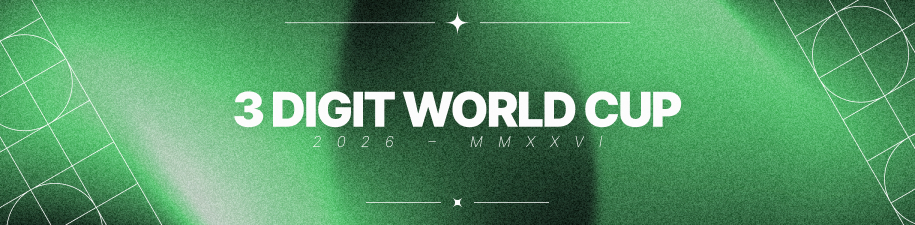

---
tags:
  - 3WC2026
  - 3WC
---

# 3 Digit World Cup 2026

The **3 Digit World Cup 2026** (***3WC2026***) is a 3v3, double-elimination, country-based osu! tournament hosted by ::{ flag=FI }:: [shdewz](https://osu.ppy.sh/users/10000899) and ::{ flag=NL }:: [nik](https://osu.ppy.sh/users/10077264). It is the eighth instalment of the 3 Digit World Cup.

## Tournament schedule

| Event | Timestamp |
| --: | :-- |
| Registration phase | 2026-01-11/2026-01-25 (18:00 UTC) |
| Team submission phase | 2026-01-25/2026-02-08 (23:59 UTC) |
| Qualifier showcase | 2026-02-15 |
| Qualifier stage | 2026-02-21/2026-02-22 |
| Round of 16 | 2026-02-28/2026-03-01 |
| Quarterfinals | 2026-03-07/2026-03-08 |
| Semifinals | 2026-03-14/2026-03-15 |
| Finals | 2026-03-21/2026-03-22 |
| Grand Finals | 2026-03-28/2026-03-29 |

## Prizes

| Placing | Prize(s) |
| :-: | :-- |
|  | 44% of the prize pool, profile badge, animated profile banner |
|  | 32% of the prize pool, animated profile banner |
|  | 24% of the prize pool, animated profile banner |

## Organisation

The 3 Digit World Cup 2026 is run by various community members.

| Position | Member(s) |
| :-- | :-- |
| Organiser | ::{ flag=FI }:: [shdewz](https://osu.ppy.sh/users/10000899), ::{ flag=NL }:: [nik](https://osu.ppy.sh/users/10077264) |
| Designer and developer | ::{ flag=FI }:: [shdewz](https://osu.ppy.sh/users/10000899) |
| Mappool selector | ::{ flag=NL }:: [nik](https://osu.ppy.sh/users/10077264) |
| Mapping quality assurance | ::{ flag=CA }:: [Gordon](https://osu.ppy.sh/users/7856835), ::{ flag=DE }:: [KSN](https://osu.ppy.sh/users/5442251), ::{ flag=NL }:: [nik](https://osu.ppy.sh/users/10077264) |
| Mappool playtester | ::{ flag=PL }:: [Agent5d](https://osu.ppy.sh/users/5472693), ::{ flag=US }:: [ChillierPear](https://osu.ppy.sh/users/9501251), ::{ flag=US }:: [fieryrage](https://osu.ppy.sh/users/3533958), ::{ flag=US }:: [hubbawubba](https://osu.ppy.sh/users/15910288), ::{ flag=NL }:: [niqht](https://osu.ppy.sh/users/14390731), ::{ flag=MX }:: [Riot](https://osu.ppy.sh/users/4256461) |
| Mapper | *TBA* |
| Streamer | ::{ flag=CA }:: [D I O](https://osu.ppy.sh/users/3958619), ::{ flag=VN }:: [Hoaq](https://osu.ppy.sh/users/7696512), ::{ flag=GB }:: [ilw8](https://osu.ppy.sh/users/14167692), ::{ flag=CA }:: [kymotsujason](https://osu.ppy.sh/users/2541804), ::{ flag=US }:: [ROB_](https://osu.ppy.sh/users/12455868), ::{ flag=RU }:: [RobotSkin_](https://osu.ppy.sh/users/13820038), ::{ flag=FI }:: [shdewz](https://osu.ppy.sh/users/10000899), ::{ flag=VN }:: [SIay](https://osu.ppy.sh/users/9587896) |
| Commentator | ::{ flag=ID }:: [BlankTap](https://osu.ppy.sh/users/10137131), ::{ flag=GB }:: [Bubbleman](https://osu.ppy.sh/users/5182050), ::{ flag=US }:: [ChillierPear](https://osu.ppy.sh/users/9501251), ::{ flag=CA }:: [chiv](https://osu.ppy.sh/users/6701656), ::{ flag=CA }:: [D I O](https://osu.ppy.sh/users/3958619), ::{ flag=GB }:: [Damarsh](https://osu.ppy.sh/users/7465147), ::{ flag=CA }:: [ExiaXD](https://osu.ppy.sh/users/17241883), ::{ flag=US }:: [fieryrage](https://osu.ppy.sh/users/3533958), ::{ flag=US }:: [hubbawubba](https://osu.ppy.sh/users/15910288), ::{ flag=CA }:: [I-Flame](https://osu.ppy.sh/users/11257542), ::{ flag=GR }:: [JackPaX](https://osu.ppy.sh/users/11226645), ::{ flag=KZ }:: [Lightin](https://osu.ppy.sh/users/7595619), ::{ flag=FI }:: [Nev-](https://osu.ppy.sh/users/11836334), ::{ flag=NL }:: [nik](https://osu.ppy.sh/users/10077264), ::{ flag=GB }:: [SadShiba](https://osu.ppy.sh/users/10747626), ::{ flag=FI }:: [shdewz](https://osu.ppy.sh/users/10000899), ::{ flag=FR }:: [Subaru_Arima](https://osu.ppy.sh/users/11273062), ::{ flag=US }:: [this1neguy](https://osu.ppy.sh/users/1797189), ::{ flag=AU }:: [Vordi](https://osu.ppy.sh/users/6659116) |
| Referee | ::{ flag=IN }:: [-Space](https://osu.ppy.sh/users/7720204), ::{ flag=FI }:: [Aetherian](https://osu.ppy.sh/users/6263040), ::{ flag=KR }:: [Discord](https://osu.ppy.sh/users/16194858), ::{ flag=BR }:: [DizzyH](https://osu.ppy.sh/users/9896172), ::{ flag=US }:: [Emerald Ages](https://osu.ppy.sh/users/10224047), ::{ flag=US }:: [freddiiieeee](https://osu.ppy.sh/users/7112839), ::{ flag=KR }:: [Garalulu](https://osu.ppy.sh/users/757783), ::{ flag=BR }:: [LeoFLT](https://osu.ppy.sh/users/3668779), ::{ flag=SK }:: [Mavosiik](https://osu.ppy.sh/users/18927594), ::{ flag=NL }:: [nik](https://osu.ppy.sh/users/10077264), ::{ flag=RU }:: [Rainbowtaves](https://osu.ppy.sh/users/10079847), ::{ flag=US }:: [ROB_](https://osu.ppy.sh/users/12455868), ::{ flag=RU }:: [RobotSkin_](https://osu.ppy.sh/users/13820038), ::{ flag=FI }:: [shdewz](https://osu.ppy.sh/users/10000899), ::{ flag=DE }:: [TheHunter1](https://osu.ppy.sh/users/6496016), ::{ flag=GB }:: [Yazzehh](https://osu.ppy.sh/users/7068973) |

## Links

- **[Information spreadsheet](https://docs.google.com/spreadsheets/d/17tQOAKWcZsZwJaRJP-3JVEcQJP-16WfaSxVexhYVuDM)**
- [Discussion thread](https://osu.ppy.sh/community/forums/topics/2169669?n=1)
- [Challonge bracket](https://challonge.com/3WC2026)
- [Livestream](https://www.twitch.tv/3wc_osu)
- [VOD collection (YouTube)](https://www.youtube.com/@3wc_osu)
- [Discord server](https://discord.gg/ZjPs7ya)

## Ruleset

### Conduct

1. All spaces affiliated with 3WC are subject to the [osu! community rules](/wiki/Rules) as well as the rules of the respective platforms themselves.
2. Players are expected to uphold a competitive and friendly environment, and to treat tournament staff and other players with respect.
   - This includes keeping matches running smoothly and avoiding deliberate delays.
3. Any foul play, including but not limited to: cheating, bracket manipulation, or failure to cooperate in match rescheduling, is strictly prohibited.
4. Failure to abide by the tournament rules will be punished accordingly. Penalties for violating the tournament rules include, but are not limited to:
   - Exclusion of specific players for one beatmap.
   - Exclusion of specific players for an entire match.
   - Declaring the match as forfeited, or as a win by default for the other team.
   - Disqualification from the entire tournament.
   - Disqualification from the current and future tournaments in the series, until appealed.

### General

1. 3WC is a country-based 3 versus 3 team tournament, played on the osu! game mode.
2. The tournament begins with a qualifier stage, followed by a 16-team double-elimination bracket.
3. Beatmap scoring is based on ScoreV2.
4. The minimum size for a team is 3 players, and the maximum is 6.
5. The mappool, matchups, and match schedules will be announced by the tournament organisers on the spreadsheet on the Sunday before the matches take place.
   - These announcements may be delayed to ensure higher quality or to accommodate commentators for the mappool showcase. Any delays will be communicated clearly to all participants.
6. Use of the Visual Settings to alter background dim or disable beatmap elements like storyboards and skins is allowed.
   - Custom skin elements must not be used to alter core gameplay elements or mechanics in unintended ways.
7. If less than the minimum amount of required players are present at match time, the match can be postponed for up to 10 minutes. If after this period there are still not enough players for either team, a win by default will be declared for the side with the most members present.
   - The minimum number of required players is the number of players needed to play a beatmap without any vacant spots in the lobby (i.e. at least 3 participants from each team must be present for the match to begin).
8. Switching team members between beatmaps is allowed without limitations.
9. If a beatmap ends in a draw, it will be nullified and the beatmap will be replayed.
10. Teams may ask for a replay of a beatmap if a team member encounters technical issues while playing within 30 seconds or 25% of the beatmap's drain time (whichever happens first) of the beatmap's start. Referees may perform a replay independently of either team if reasonable evidence of a disconnect/tech issue exists. Referees may veto any replay requests at their discretion.
    - "Lag spikes", using the wrong skin, and similar, are not considered valid reasons to replay a beatmap.
    - The roster for each team during a replay must remain the same as the original run. If that is not possible, e.g. by virtue of a technical issue that prevents a player from entering the lobby, both teams will be allowed to swap rosters.
    - Misuse or abuse of this rule may lead to penalties being applied to the offending player or team.
11. If a player disconnects mid-game, common sense will be applied: if proof exists of the disconnected player's score (or a rough estimate of their hypothetical score if they finished the map), it will be added to their team's total score; if it is at all ambiguous, their score will be excluded from their team's total. Valid proof of a score includes but is not limited to:
    - Screenshots from other players taken directly in-game that show the affected player's score. These screenshots **MUST** be taken directly in-game with `Shift` + `F12`, that is, they must be hosted on the `https://osu.ppy.sh/` domain.
    - Player point-of-view live stream snippets (commonly referred to as "clips" or "VODs"). The entirety of the play, along with the results screen must be clearly visible along with the affected player's score.
    - Replay files of the play, taken directly from the "Local scores" tab on the affected player's client (the timestamps must exactly match the time at which the game took place, as seen on the multiplayer lobby link).
    - As shown on the official livestream, in cases where the match is streamed. This may not be used if there is any doubt that the player's score did not decrease following the disconnect (i.e. before an ending diffspike).
12. Players are expected to keep the match running smoothly and without delays. Excessive match delays from the players' side may result in penalties being applied by the tournament organisers. Disrupting the match by foul play, insulting and provoking other players or staff, delaying the match, or other deliberate inappropriate misbehaviour are strictly prohibited, and will be punished accordingly.
13. All players and staff must be treated with respect. Instructions from the referees and the tournament organisers are to be followed. Decisions labelled as final may not be appealed.
14. Referees may allow, at their discretion, lower or higher tolerances for timers.
15. The tournament organisers may request liveplays or recordings of individual players or teams at any point in the tournament without prior warning.

### Registration

1. Every user interested in joining their country's team signs up individually.
   - The tournament organisers will create a list of potential candidates for a country's team.
   - The tournament organisers will elect one representative for each country with at least 3 players registered as the provisional captain for that team.
   - The provisional captain will receive a private message on Discord containing further instructions.
2. The provisional captain will form their team by selecting players from the candidate pool for their country.
   - Captains are expected to choose team members with honesty and good will, with the aim of fielding the strongest team possible.
   - Captains **MUST** submit their finalised team list before the deadline. Teams that fail to send a finalised team list before the deadline will be disqualified.
   - Captains are allowed to exclude themselves from the team list.
   - Captains are encouraged to, should there be more than 6 signups for their country, conduct and coordinate "tryouts", tests to gauge player aptitude, on their own terms.
   - Captains are allowed, at any time, to transfer their role to other prospective team members. Once given, only the new captain may assign the captaincy to another player.
   - Users responsible for organising their country's tryouts are encouraged to contact the tournament organisers to be elected as provisional captains for their team.
3. To ensure valid registrations, every prospective participant will go through [tournament screening](/wiki/Tournaments/Official_support#tournament-screening); violation of the [osu! community rules](/wiki/Rules) within the previous 12 months or an active tournament ban may void a player's eligibility to participate.
   - Individuals who are unhappy with the results of screening should contact [accounts@ppy.sh](mailto:accounts@ppy.sh) to request more information about their case.
4. Tournament staff members are not allowed to play in the tournament, with the exception of commentators, streamers, and designers.
   - The tournament organisers must ensure that such staff members do not have access to any privileged data, e.g. qualifier score information, or mappool information before the mappool showcase.

### Mappool information

1. Every stage will have its own mappool.
2. Each mappool will consist of 5 brackets: [No Mod](/wiki/Gameplay/Game_modifier#no-mod), [Hidden](/wiki/Gameplay/Game_modifier/Hidden), [Hard Rock](/wiki/Gameplay/Game_modifier/Hard_Rock), [Double Time](/wiki/Gameplay/Game_modifier/Double_Time), and [Free Mod](/wiki/Gameplay/Game_modifier#free-mod).
3. The mappool sizes are as follows:
   - Qualifiers: 10 beatmaps
   - Group stage and Round of 16: 15 beatmaps
   - Quarterfinals, Semifinals, Finals, and Grand Finals: 20 beatmaps
4. The Hidden, Hard Rock, and Double Time brackets will be played with the respective mods enabled for all players.
5. The Free Mod bracket will have "Free Mods" enabled, that is, players will be able to select what mods they use.
   - Possible mod choices are Hidden, Hard Rock, Easy, and any valid combination of the aforementioned mods.
   - At least one player must play with Hidden and/or Easy, and one player with Hard Rock or Hidden + Hard Rock. For the remaining player, enabling further mods is optional.
   - Easy scores will be multiplied with a per-beatmap custom multiplier. These will be noted in the comments of the mappool page next to each map.
6. The tiebreaker will be played under Free Mod conditions, but players will be exempt from the mod requirement.
   - Tiebreakers will not feature custom Easy multipliers.
7. Failed scores will be counted in their entirety. To that end, the [No Fail](/wiki/Gameplay/Game_modifier/No_Fail) mod will be enforced on every beatmap.
   - Teams that disregard this instruction by choosing to play without at least one No Fail and fail as a result will forfeit the map.

### Qualifier instructions

1. In the Qualifier stage, all teams will play a specific mappool designed by the mappool selectors.
2. The mappool will feature 10 beatmaps, organised as such:
   - 4 No Mod beatmaps
   - 2 Hidden beatmaps
   - 2 Hard Rock beatmaps
   - 2 Double Time beatmaps
   - There will be no Free Mods or tiebreakers for this stage.
3. Teams will be asked to play the mappool twice at a time of their choosing, considering any applicable deadlines, and referee availability should there be delays with scheduling.
4. The team's best playthrough for each beatmap, that is, the team score grouped per beatmap as seen on the multiplayer lobby link, will be used for seeding.
   - The voided run (should there be one) will be accounted for in various statistics, and in most cases a score is improvable from multiple factors, so players are recommended to play to their fullest ability at all times.
5. The mappool is to be played according to the order listed on this page.
   - Teams may skip playing any beatmap on their second run. They may not, however, play the beatmaps out of order, for any reason.
   - Each team must have 3 members play each beatmaps. These players may be freely switched between beatmaps.
   - An optional 3-minute break will be offered between the first and second playthrough of the mappool.
6. All teams will play their qualifiers in separate rooms. It is suggested that teams do not broadcast or share their results publicly to avoid seed manipulation.
7. Cumulative Z-score, scaled to 0–100, will be used to seed the teams.
8. Only the top 16 seeded teams will advance to the next stage, and based on the above method will be placed in a double elimination bracket.

### Bracket stage instructions

1. Following the Qualifier stage, a double-elimination bracket will be played — for teams in the winners' bracket, the winning team continues in the same bracket, while the losing team gets moved to the losers' bracket, where any further defeats will eliminate the team from the competition.
2. Teams in the losers' bracket must play up to 2 matches each weekend, starting from the Semifinals.
3. Win conditions
   - In the Round of 16 and Quarterfinals, teams need to win 6 maps to win a match (best of 11).
   - In the Semifinals, Finals, and Grand Finals, teams need to win 7 maps to win a match (best of 13).
   - Note: for the Grand Finals match, the team that is coming from the winners' bracket is required to win one "set", that is, one best-of-13, to win the tournament. The team coming from the losers' bracket, however, needs to win 2 sets. This second set is commonly referred to as the "bracket reset".

### Match format

| Stage | Format |
| :-- | :-- |
| Round of 16 | Best of 11, 1 ban |
| Quarterfinals | Best of 11, 1 ban |
| Semifinals | Best of 13, 2 bans |
| Finals | Best of 13, 2 bans |
| Grand Finals | Best of 13, 2 bans |

### Match instructions

1. A referee will create a multiplayer room 5 to 10 minutes before the scheduled match time. Teams must join the lobby in that period.
   - The room settings are Game mode: "osu!", Team mode: "Team Vs" and Score mode: "ScoreV2". The room name must follow the pattern of `3WC2026: ({Red Team}) vs ({Blue Team})`. The team mentioned first in the room name must be the red team, the team mentioned second in the room name must be the blue team.
2. Each team may ban one beatmap to be selected from the mappool in the Round of 16 and Quarterfinals, increased to two beatmaps from Semifinals onwards. These beatmaps may not be picked by any team for the entire duration of the match.
   - "Double bans" (i.e. banning two beatmaps from the same mod pool) are allowed without restrictions.
3. Each captain must use `!roll` once in the match's chatroom. After the rolls are set, the pick and ban phase will have the following steps:
   - The winner of the roll decides either the pick *or* the ban order; that is, they may pick from one of the following: first pick, first ban, second pick, or second ban.
   - The loser of the roll decides the remaining order; that is, if for example the winner of the roll chose to pick first, the loser of the roll may choose to ban first or second.
   - From Semifinals onwards, the first team will ban one beatmap, followed by two bans from second team, finishing with one ban from the first team (also known as ABBA order).
4. After bans are decided, both teams will take turns in picking a beatmap from the mappool.
   - Teams may "double pick" (i.e. pick two or more beatmaps from the same mod pool in sequence) without restrictions.
5. Teams will be allowed 2 minutes to pick a beatmap and 2 minutes to press the Ready button on their client. If a team takes more time than allotted for either action, the procedures adopted will be as follows:
   - For the first occurrence:
     - The team will receive a verbal warning from the referee; in addition, the referee may opt to forcefully use the team's tactical timeout to allow for the team to pick.
     - If the team does not pick a map within 15 seconds from when the timer expires, the referee will apply the procedure for subsequent occurrences listed below, i.e. a random pick will be used for a pick timer, and the match will be forcefully started for a ready timer.
   - On subsequent occurrences:
     - For a pick timer: a random map will be chosen from the mappool using `!roll X`, where `X` is the number of beatmaps that were neither picked nor banned, excluding the tiebreaker.
     - For a ready timer: the referee will issue the `!mp start 15` command, regardless of how many players from each team are present in the lobby. Should a team have too many players in the lobby, the scores from their 3 worst-performing players will be counted.
   - Repeat offenders may receive further sanctions from the tournament organisers.
6. In the case of a team starting a map with less than the permitted number of players on their roster due to an unforeseen circumstance (e.g. a technical issue or unavoidable player absence), the team in question will be granted the right to fill their roster before play commences. The remainder of the original roster must stay the same, only player additions are allowed.
7. Each team will receive one "tactical timeout" of 2 minutes, to be used as extra time to ban, pick, or ready for a beatmap. The tactical timeout is optional.
   - The tactical timeout may be called on a tiebreaker once per match, provided that both teams' captains agree to it, irrespective of the amount of tactical timeouts available for either team.

### Scheduling information

1. Each stage will be held on a single weekend.
2. Qualifier lobbies will be held at each team's convenience. Rather than pre-existing slots, time slots will be created for each team at the time of their choosing.
   - The latest possible time to play Qualifiers is Sunday, 22 February 20:00 UTC.
   - Teams that do not pick a time by Friday, 20 February, 12:00 UTC will be considered disqualified.
   - Teams may reschedule their time at any point after this deadline, if they already have a lobby scheduled. The tournament organisers, however, reserve the right to deny such reschedules should a referee not be available for this last minute change.
3. All bracket stages will be held between Saturday 00:00 and Sunday 20:00 UTC.
   - Other times may be available upon request. Consult with the tournament organisers for more information.
4. Match scheduling will be handled by the tournament organisers. Schedules will be released on the Sunday before the week the matches are to be played. The tournament organisers will try to create the schedule to respect the participants' time zones.
5. Reschedules will only be considered if both teams agree to a time and communicate it to the tournament organisers, before Thursday 23:59 UTC of the week the match is to take place.
   - Late reschedules will not be allowed.
6. Captains are chiefly responsible for their team's availability, and will be held accountable for any mismanagement in this regard. Captains that do not observe deadlines, act in bad faith when rescheduling matches, or similar offenses, are subject to sanctions.
7. Teams are encouraged to create "Threads" in the `#rescheduling` channel of the tournament's Discord server when in need of extended discussion regarding a reschedule. This allows the tournament organisers to intervene if required, and provides them with great context to help resolve disputes, or to accommodate late reschedules. Threads greatly expedite complicated rescheduling processes, and may grant exceptions for late reschedules if circumstances require it.
