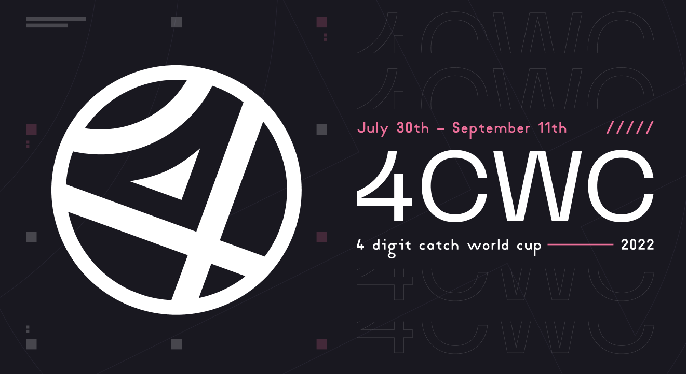
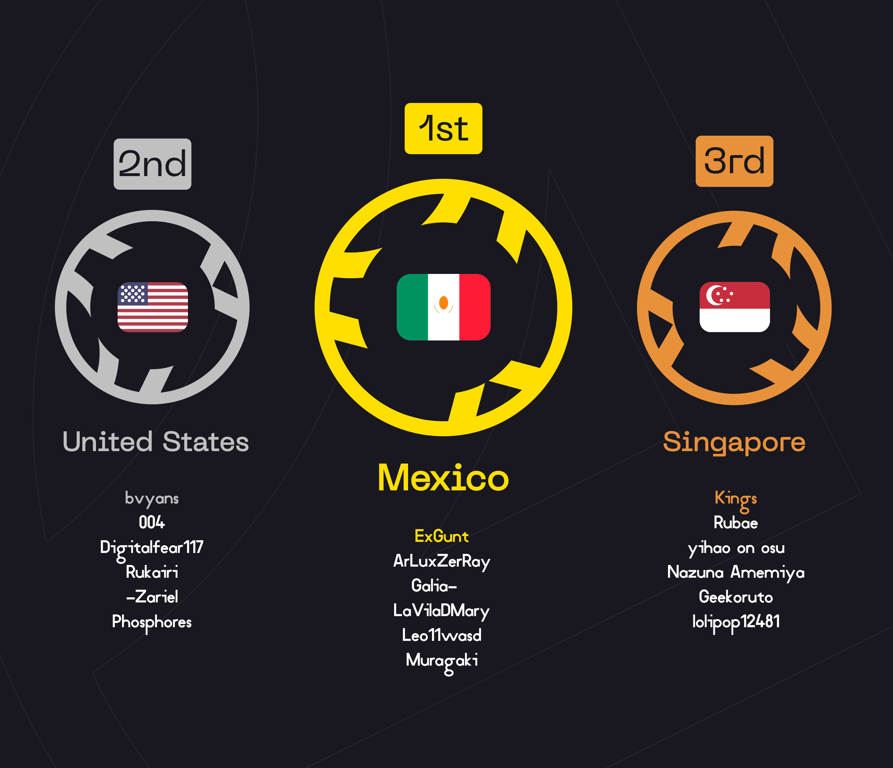

---
tags:
  - 4CWC
  - 4CWC2022
  - 4CWC 2022
---

# 4 Digit Catch World Cup 2022

The **4 Digit Catch World Cup 2022** (***4CWC 2022***) was a country-based osu!catch tournament hosted by ::{ flag=UA }:: [M0RU](https://osu.ppy.sh/users/13681464), ::{ flag=RU }:: [KitsunIvy](https://osu.ppy.sh/users/7055384), and ::{ flag=RU }:: [ThankYou](https://osu.ppy.sh/users/4571241). It was the second iteration of the 4 Digit Catch World Cup.

## Tournament schedule

| Event | Timestamp |
| --: | :-- |
| Registration phase | 2022-06-25/2022-07-10 (20:00 UTC) |
| Screening phase | 2022-07-11/2022-07-17 |
| Team submission phase | 2022-07-18/2022-07-23 |
| Qualifiers | 2022-07-30/2022-07-31 |
| Round of 32 | 2022-08-06/2022-08-07 |
| Round of 16 | 2022-08-13/2022-08-14 |
| Quarterfinals | 2022-08-20/2022-08-21 |
| Semifinals | 2022-08-27/2022-02-28 |
| Finals | 2022-09-03/2022-09-04 |
| Grand Finals | 2022-09-10/2022-09-11 |

## Prizes

| Placing | Prizes |
| :-: | :-- |
|  | Unique profile badge, exclusive team banner, 18 months of osu!supporter for each team member |
|  | Exclusive team banner, 10 months of osu!supporter for each team member |
|  | Exclusive team banner, 6 months of osu!supporter for each team member |

## Organisation

The 4 Digit Catch World Cup 2022 was run by various community members.

| Position | Member(s) |
| :-- | :-- |
| Host | ::{ flag=UA }:: [M0RU](https://osu.ppy.sh/users/13681464), ::{ flag=RU }:: [KitsunIvy](https://osu.ppy.sh/users/7055384), ::{ flag=RU }:: [ThankYou](https://osu.ppy.sh/users/4571241) |
| Mappool selector | ::{ flag=SG }:: [[Eun]](https://osu.ppy.sh/users/3788536), ::{ flag=ID }:: [Chroneko](https://osu.ppy.sh/users/5472877), ::{ flag=SG }:: [lovemathboy](https://osu.ppy.sh/users/4220829), ::{ flag=UA }:: [M0RU](https://osu.ppy.sh/users/13681464), ::{ flag=PL }:: [Mniam](https://osu.ppy.sh/users/6050530), ::{ flag=TH }:: [Social Distance](https://osu.ppy.sh/users/17385454), ::{ flag=CL }:: [Stark](https://osu.ppy.sh/users/1565036), ::{ flag=RU }:: [Xetopia](https://osu.ppy.sh/users/6689101) |
| Mappool tester | ::{ flag=AU }:: [-NOBLE-](https://osu.ppy.sh/users/8363648), ::{ flag=KR }:: [[Amazing]](https://osu.ppy.sh/users/1391036), ::{ flag=RU }:: [2zz](https://osu.ppy.sh/users/8201267), ::{ flag=ES }:: [Alepe](https://osu.ppy.sh/users/15273403), ::{ flag=FR }:: [Bebar](https://osu.ppy.sh/users/12584928), ::{ flag=PL }:: [BoberOfDarkness](https://osu.ppy.sh/users/3427748), ::{ flag=DE }:: [Daihmuddah](https://osu.ppy.sh/users/1619007), ::{ flag=CL }:: [Des9](https://osu.ppy.sh/users/5404711), ::{ flag=US }:: [Enmei](https://osu.ppy.sh/users/11497549), ::{ flag=FR }:: [h-e-c-a123](https://osu.ppy.sh/users/3163012), ::{ flag=PL }:: [hrohoroko](https://osu.ppy.sh/users/14121250), ::{ flag=PH }:: [Kyonkichi](https://osu.ppy.sh/users/7585544), ::{ flag=IL }:: [LiL L1ghtMare](https://osu.ppy.sh/users/16782179), ::{ flag=FR }:: [MitsukeZ](https://osu.ppy.sh/users/12943161), ::{ flag=FR }:: [R-34](https://osu.ppy.sh/users/8266817), ::{ flag=ID }:: [Reid Hezzel](https://osu.ppy.sh/users/5604201), ::{ flag=CA }:: [SadEgg](https://osu.ppy.sh/users/10278243), ::{ flag=KR }:: [-Zellen](https://osu.ppy.sh/users/17405762) |
| Custom mapper | ::{ flag=PH }:: [-Rustyy](https://osu.ppy.sh/users/16355636), ::{ flag=PL }:: [BoberOfDarkness](https://osu.ppy.sh/users/3427748), ::{ flag=ID }:: [Dapuluous](https://osu.ppy.sh/users/8140944), ::{ flag=PH }:: [Jemzuu](https://osu.ppy.sh/users/7890134), ::{ flag=RU }:: [Kimitakari](https://osu.ppy.sh/users/4741164), ::{ flag=PL }:: [Mniam](https://osu.ppy.sh/users/6050530), , ::{ flag=PH }:: [Nosuri](https://osu.ppy.sh/users/2150415), ::{ flag=FR }:: [R-34](https://osu.ppy.sh/users/8266817), ::{ flag=US }:: [Secre](https://osu.ppy.sh/users/2306637), ::{ flag=KR }:: [Spectator](https://osu.ppy.sh/users/702598), ::{ flag=RU }:: [Terton](https://osu.ppy.sh/users/6955523), ::{ flag=RU }:: [Xetopia](https://osu.ppy.sh/users/6689101) |
| Streamer | ::{ flag=AU }:: [-NOBLE-](https://osu.ppy.sh/users/8363648), ::{ flag=SE }:: [EclipZ](https://osu.ppy.sh/users/4586549), ::{ flag=FR }:: [Jielefe](https://osu.ppy.sh/users/15334170), ::{ flag=UA }:: [M0RU](https://osu.ppy.sh/users/13681464), ::{ flag=LU }:: [Melodies](https://osu.ppy.sh/users/7787785), ::{ flag=DE }:: [Penggwin](https://osu.ppy.sh/users/14050018), ::{ flag=RU }:: [Rainbowtaves](https://osu.ppy.sh/users/10079847), ::{ flag=CA }:: [SadEgg](https://osu.ppy.sh/users/10278243), ::{ flag=RU }:: [ThankYou](https://osu.ppy.sh/users/4571241), ::{ flag=AU }:: [wangwangg](https://osu.ppy.sh/users/6416920) |
| Commentator | ::{ flag=US }:: [004](https://osu.ppy.sh/users/9228388) ::{ flag=AU }:: [-NOBLE-](https://osu.ppy.sh/users/8363648), ::{ flag=AU }:: [Beat43210](https://osu.ppy.sh/users/5664171), ::{ flag=AU }:: [CoolEVT](https://osu.ppy.sh/users/3252653), ::{ flag=AU }:: [Corrosion](https://osu.ppy.sh/users/16899553), ::{ flag=SE }:: [EclipZ](https://osu.ppy.sh/users/4586549), ::{ flag=US }:: [Enmei](https://osu.ppy.sh/users/11497549), ::{ flag=DE }:: [GinIkari](https://osu.ppy.sh/users/6083491), ::{ flag=AU }:: [Kureiji Ollie](https://osu.ppy.sh/users/11435502), ::{ flag=AU }:: [KWYJIBO](https://osu.ppy.sh/users/7178386), ::{ flag=LU }:: [Melodies](https://osu.ppy.sh/users/7787785), ::{ flag=CA }:: [Naguri](https://osu.ppy.sh/users/3935174), ::{ flag=CA }:: [SadEgg](https://osu.ppy.sh/users/10278243), ::{ flag=TH }:: [Social Distance](https://osu.ppy.sh/users/17385454), ::{ flag=AU }:: [wongwongg](https://osu.ppy.sh/users/16859546) |
| Referee | ::{ flag=AU }:: [-NOBLE-](https://osu.ppy.sh/users/8363648), ::{ flag=PH }:: [-Pekora-](https://osu.ppy.sh/users/17959882), ::{ flag=RU }:: [2zz](https://osu.ppy.sh/users/8201267), ::{ flag=ID }:: [Chroneko](https://osu.ppy.sh/users/5472877), ::{ flag=RU }:: [cosilgam](https://osu.ppy.sh/users/15960747), ::{ flag=SE }:: [EclipZ](https://osu.ppy.sh/users/4586549), ::{ flag=FR }:: [h-e-c-a123](https://osu.ppy.sh/users/3163012), ::{ flag=PL }:: [hrohoroko](https://osu.ppy.sh/users/14121250), ::{ flag=FR }:: [Jielefe](https://osu.ppy.sh/users/15334170), ::{ flag=ID }:: [Kenneth Alfredo](https://osu.ppy.sh/users/829469), ::{ flag=BR }:: [Konohana Lucia](https://osu.ppy.sh/users/8642224), ::{ flag=PH }:: [Kyonkichi](https://osu.ppy.sh/users/7585544), ::{ flag=UA }:: [M0RU](https://osu.ppy.sh/users/13681464), ::{ flag=VN }:: [NamSPro](https://osu.ppy.sh/users/11387006), ::{ flag=VN }:: [poitydabezt](https://osu.ppy.sh/users/17148657), ::{ flag=CA }:: [SadEgg](https://osu.ppy.sh/users/10278243), ::{ flag=TH }:: [Social Distance](https://osu.ppy.sh/users/17385454) |
| Designer | ::{ flag=RU }:: [Arhella](https://osu.ppy.sh/users/4411044), ::{ flag=RU }:: [ThankYou](https://osu.ppy.sh/users/4571241) |
| Spreadsheet manager | ::{ flag=UA }:: [M0RU](https://osu.ppy.sh/users/13681464) |
| Wiki editor | ::{ flag=RU }:: [Kimitakari](https://osu.ppy.sh/users/4741164) |

## Links

- **[Main spreadsheet](https://docs.google.com/spreadsheets/d/1Yd3iHhU1ABF0MOxUFR9FJAeMcXtGBZkBuC_N7dX4bfc/edit?usp=sharing)**
- [Discussion thread](https://osu.ppy.sh/community/forums/topics/1600070)
- [Discord server](https://discord.gg/JcJ7w9x6B6)
- [Challonge bracket](https://challonge.com/4cwc_2022)
- [Pick'ems page](https://pickem.hwc.hr/tournaments/91) hosted by ::{ flag=DE }:: [hallowatcher](https://osu.ppy.sh/users/1874761)
- [Livestream channel](https://www.twitch.tv/4cwc)

## Participants

|  | Country | Members |
| :-: | :-: | :-- |
| ::{ flag=MA }:: ::{ flag=KZ }:: ::{ flag=KE }:: ::{ flag=BH }:: ::{ flag=IN }:: | **Afrasia** | **[OSUjanaiKATSURAda](https://osu.ppy.sh/users/2154499)**, [RussianKot](https://osu.ppy.sh/users/10760717), [Dragonesia](https://osu.ppy.sh/users/14314269), [RotMG](https://osu.ppy.sh/users/12705051), [Hagaru](https://osu.ppy.sh/users/8200513), [Ly4nik](https://osu.ppy.sh/users/24032082) |
| ::{ flag=DZ }:: | **Algeria** | **[nadvanlis](https://osu.ppy.sh/users/1402808)**, [Abdera7mane](https://osu.ppy.sh/users/20083587), [ELNabhan Jr](https://osu.ppy.sh/users/20799245), [Blue_steven](https://osu.ppy.sh/users/24467933) |
| ::{ flag=AU }:: | **Australia** | **[Corrosion](https://osu.ppy.sh/users/16899553)**, [wingwingg](https://osu.ppy.sh/users/15712785), [Kureiji Ollie](https://osu.ppy.sh/users/11435502), [Merami Crab](https://osu.ppy.sh/users/11523326), [TheTixTop](https://osu.ppy.sh/users/19236870), [wongwongg](https://osu.ppy.sh/users/16859546) |
| ::{ flag=BR }:: | **Brazil** | **[Avenged](https://osu.ppy.sh/users/3300147)**, [- Angelium -](https://osu.ppy.sh/users/1343670), [Coreanmaluco](https://osu.ppy.sh/users/3149577), [-Nozomi Tojo](https://osu.ppy.sh/users/8024582), [Omyon](https://osu.ppy.sh/users/11799110), [someon](https://osu.ppy.sh/users/21118424) |
| ::{ flag=CA }:: | **Canada** | **[Naguri](https://osu.ppy.sh/users/3935174)**, [Zyoulou](https://osu.ppy.sh/users/8668722), [As-](https://osu.ppy.sh/users/8253095), [D o k a](https://osu.ppy.sh/users/19019806), [Kevaca](https://osu.ppy.sh/users/12528295), [Devil_Oid](https://osu.ppy.sh/users/3805080) |
| ::{ flag=CL }:: | **Chile** | **[ZiRoX](https://osu.ppy.sh/users/200768)**, [Jeongyeon-](https://osu.ppy.sh/users/13956591), [KerK\_](https://osu.ppy.sh/users/14277249), [Arkanii](https://osu.ppy.sh/users/24781130), [Shiny Froakie](https://osu.ppy.sh/users/6194830), [SethRGS](https://osu.ppy.sh/users/9901244) |
| ::{ flag=CN }:: | **China** | **[No Meaningful](https://osu.ppy.sh/users/253015)**, [[Paw]Just_MLN](https://osu.ppy.sh/users/8837858), [zjy1](https://osu.ppy.sh/users/3162675), [fastbeetle](https://osu.ppy.sh/users/12866104), [Yousei](https://osu.ppy.sh/users/3406297), [ShigeLuna](https://osu.ppy.sh/users/10959112) |
| ::{ flag=EU }:: | **Europe** | **[Melodies](https://osu.ppy.sh/users/7787785)**, [Yi-](https://osu.ppy.sh/users/4140062), [Rawrity](https://osu.ppy.sh/users/28222), [Resibini](https://osu.ppy.sh/users/348490), [CirnUwU](https://osu.ppy.sh/users/11713317), [Abstracto](https://osu.ppy.sh/users/21822645) |
| ::{ flag=FR }:: | **France** | **[Fuka Pura](https://osu.ppy.sh/users/2326688)**, [Pizou](https://osu.ppy.sh/users/9475990), [-Enias-](https://osu.ppy.sh/users/8384680), [Kaleesy Pura](https://osu.ppy.sh/users/1800077), [Gray Hardrock](https://osu.ppy.sh/users/9049282), [floflim](https://osu.ppy.sh/users/5954015) |
| ::{ flag=DE }:: | **Germany** | **[13187berlin](https://osu.ppy.sh/users/4035950)**, [white-raven](https://osu.ppy.sh/users/2363941), [Cynaestra](https://osu.ppy.sh/users/2103365), [KukajuLp](https://osu.ppy.sh/users/9370371), [ERA medium kek](https://osu.ppy.sh/users/11625617), [ERA Sirbeyy](https://osu.ppy.sh/users/12917829) |
| ::{ flag=HK }:: | **Hong Kong** | **[BlackBN](https://osu.ppy.sh/users/6291741)**, [WInkY1220](https://osu.ppy.sh/users/1123309), [fua](https://osu.ppy.sh/users/21138904), [Dream Fire](https://osu.ppy.sh/users/11198186), [on9](https://osu.ppy.sh/users/3951909), [AutoSleepyFan](https://osu.ppy.sh/users/16792523) |
| ::{ flag=ID }:: | **Indonesia** | **[Kinora](https://osu.ppy.sh/users/20571283)**, [Mixuri](https://osu.ppy.sh/users/9153772), [ARTPHONEY](https://osu.ppy.sh/users/2128050), [Execration-](https://osu.ppy.sh/users/9260926), [dalyz](https://osu.ppy.sh/users/3951909), [Foranex](https://osu.ppy.sh/users/9888039) |
| ::{ flag=JP }:: | **Japan** | **[giru HD](https://osu.ppy.sh/users/707456)**, [eisuke0530](https://osu.ppy.sh/users/9814770), [Sooty](https://osu.ppy.sh/users/235618), [Kokutan](https://osu.ppy.sh/users/5994353), [yuzupon1133](https://osu.ppy.sh/users/22136262), [kira0728](https://osu.ppy.sh/users/17545253) |
| ::{ flag=KG }:: | **Kyrgyzstan** | **[ded24lol](https://osu.ppy.sh/users/14795251)**, [Tek-Tek](https://osu.ppy.sh/users/13395917), [Chaosage](https://osu.ppy.sh/users/6820522) |
| ::{ flag=EC }:: ::{ flag=CO }:: ::{ flag=PE }:: ::{ flag=AR }:: | **LATAM** | **[Gato2499](https://osu.ppy.sh/users/7857559)**, [Narnia](https://osu.ppy.sh/users/3600162), [juzoewe](https://osu.ppy.sh/users/18981878), [Lunati1kid](https://osu.ppy.sh/users/25723773), [alemagno333](https://osu.ppy.sh/users/11411697), [wlfgrl](https://osu.ppy.sh/users/24598839) |
| ::{ flag=MO }:: | **Macau** | **[papeto](https://osu.ppy.sh/users/10718248)**, [idqoos123](https://osu.ppy.sh/users/3946113), [PtiIopsis](https://osu.ppy.sh/users/2888857), [Fasthard](https://osu.ppy.sh/users/16115877) |
| ::{ flag=MY }:: | **Malaysia** | **[DTNLRiki](https://osu.ppy.sh/users/12382410)**, [[MY]error\_exe](https://osu.ppy.sh/users/6056288), [Green Ghost](https://osu.ppy.sh/users/10826368), [loftylime](https://osu.ppy.sh/users/18226127), [leaf89](https://osu.ppy.sh/users/19346652), [CrabCow Fanboy](https://osu.ppy.sh/users/9351030) |
| ::{ flag=MX }:: | **Mexico** | **[ExGunt](https://osu.ppy.sh/users/20136125)**, [ArLuxZerRay](https://osu.ppy.sh/users/23996812), [Galia-](https://osu.ppy.sh/users/10881728), [LaVilaDMary](https://osu.ppy.sh/users/8579310), [Leo11wasd](https://osu.ppy.sh/users/20085430), [Muragaki](https://osu.ppy.sh/users/13195815) |
| ::{ flag=NL }:: | **Netherlands** | **[Fyunix](https://osu.ppy.sh/users/2503365)**, [Greaper](https://osu.ppy.sh/users/2369776), [Physo](https://osu.ppy.sh/users/8805840), [CornDoggy](https://osu.ppy.sh/users/6061952), [vampi72](https://osu.ppy.sh/users/14950857) |
| ::{ flag=NZ }:: | **New Zealand** | **[CTB Sakamata1](https://osu.ppy.sh/users/11735313)**, [Cipse](https://osu.ppy.sh/users/7928880), [Superlunah](https://osu.ppy.sh/users/4535765), [Wettham77](https://osu.ppy.sh/users/14476098), [kit-](https://osu.ppy.sh/users/10981171), [Otab](https://osu.ppy.sh/users/11986449) |
| ::{ flag=NO }:: | **Norway** | **[Lanki](https://osu.ppy.sh/users/2535200)**, [Elfilin](https://osu.ppy.sh/users/12640485), [[ Real ]](https://osu.ppy.sh/users/15709224), [-Hero-chan-](https://osu.ppy.sh/users/17685037), [IceCold](https://osu.ppy.sh/users/12847517), [Scaredmilk](https://osu.ppy.sh/users/7954112) |
| ::{ flag=PH }:: | **Philippines** | **[Eoneru](https://osu.ppy.sh/users/9025855)**, [Chloebe](https://osu.ppy.sh/users/4577865), [Vixen](https://osu.ppy.sh/users/11828474), [-HyperDream](https://osu.ppy.sh/users/12410693), [Tephtunia](https://osu.ppy.sh/users/5209045), [Loreal](https://osu.ppy.sh/users/9362231) |
| ::{ flag=PL }:: | **Poland** | **[-ExGon-](https://osu.ppy.sh/users/7552274)**, [404usernotfound](https://osu.ppy.sh/users/5274209), [BL4CKBUSIDO](https://osu.ppy.sh/users/1559927), [Mefisto422](https://osu.ppy.sh/users/22298755), [DISCOMAREK](https://osu.ppy.sh/users/12408961), [Xellander](https://osu.ppy.sh/users/6573608) |
| ::{ flag=PT }:: | **Portugal** | **[Rosa](https://osu.ppy.sh/users/7385703)**, [[SS]Bell](https://osu.ppy.sh/users/2600197), [Nelson](https://osu.ppy.sh/users/4095868), [GoncS](https://osu.ppy.sh/users/19423459) |
| ::{ flag=RO }:: | **Romania** | **[DCega](https://osu.ppy.sh/users/16223132)**, [salam4life](https://osu.ppy.sh/users/11161490), [Crowny360](https://osu.ppy.sh/users/11108104) |
| ::{ flag=RU }:: | **Russian Federation** | **[aoe](https://osu.ppy.sh/users/6094216)**, [liquid\_boba](https://osu.ppy.sh/users/11694783), [mirofantasm](https://osu.ppy.sh/users/6650048), [Mazuki](https://osu.ppy.sh/users/15208771), [llerena](https://osu.ppy.sh/users/22137678) |
| ::{ flag=SG }:: | **Singapore** | **[Kings](https://osu.ppy.sh/users/1016926)**, [Rubae](https://osu.ppy.sh/users/21105275), [yihao on osu](https://osu.ppy.sh/users/8387373), [Nazuna Amemiya](https://osu.ppy.sh/users/13966422), [Geekoruto](https://osu.ppy.sh/users/16634503), [lolipop12481](https://osu.ppy.sh/users/7845180) |
| ::{ flag=ES }:: | **Spain** | **[Anchoadae](https://osu.ppy.sh/users/22598202)**, [nekonyo](https://osu.ppy.sh/users/4871211), [Alsael](https://osu.ppy.sh/users/13938746), [skyres00](https://osu.ppy.sh/users/10158490), [[-Vappy-]](https://osu.ppy.sh/users/10588504) |
| ::{ flag=KR }:: | **South Korea** | **[Civil oath](https://osu.ppy.sh/users/3216107)**, [log out side](https://osu.ppy.sh/users/11535744), [Kuzino](https://osu.ppy.sh/users/158552), [Hoshikuz](https://osu.ppy.sh/users/9892196), [Bloodyperch201](https://osu.ppy.sh/users/1424173), [WitchRabbit](https://osu.ppy.sh/users/13135192) |
| ::{ flag=SE }:: | **Sweden** | **[Osten](https://osu.ppy.sh/users/4417929)**, [Aardwolf XI](https://osu.ppy.sh/users/1352257), [[ M e a k u ]](https://osu.ppy.sh/users/2747072), [Fuwa Hyouka](https://osu.ppy.sh/users/20340480), [Mana\_blu](https://osu.ppy.sh/users/20252536) |
| ::{ flag=TW }:: | **Taiwan** | **[Nazrin on osu](https://osu.ppy.sh/users/2512267)**, [Pdog4ni](https://osu.ppy.sh/users/14581544), [- Lacaille -](https://osu.ppy.sh/users/1965491), [mamonowo](https://osu.ppy.sh/users/1298335), [[ BrianOuO ]](https://osu.ppy.sh/users/4642193), [Mashyuf](https://osu.ppy.sh/users/14356517) |
| ::{ flag=TH }:: | **Thailand** | **[-TANAKITO-](https://osu.ppy.sh/users/6037121)**, [Char0n](https://osu.ppy.sh/users/17838855), [N3Marry](https://osu.ppy.sh/users/13222425), [pattarachai\_12016](https://osu.ppy.sh/users/1465079), [G1ilbert](https://osu.ppy.sh/users/7408055), [shokoha](https://osu.ppy.sh/users/14134289) |
| ::{ flag=TR }:: | **Turkey** | **[LightningStorm](https://osu.ppy.sh/users/24658537)**, [shimu](https://osu.ppy.sh/users/14318796), [KatnissEverdeen](https://osu.ppy.sh/users/23895020), [gorkem\_xd](https://osu.ppy.sh/users/27415754), [Konaime](https://osu.ppy.sh/users/18823543), [Yasinnnnnn](https://osu.ppy.sh/users/17482520) |
| ::{ flag=UA }:: | **Ukraine** | **[Cookraine](https://osu.ppy.sh/users/6655145)**, [iCrYsT4L](https://osu.ppy.sh/users/11994066), [MegaMix\_Craft](https://osu.ppy.sh/users/18152711), [CrossCringe](https://osu.ppy.sh/users/15486986) |
| ::{ flag=VE }:: | **Venezuela** | **[-Nande](https://osu.ppy.sh/users/7554179)**, [CthuNox](https://osu.ppy.sh/users/13136479), [[MG] Replinter](https://osu.ppy.sh/users/25690654), [jxrri](https://osu.ppy.sh/users/12686699) |
| ::{ flag=VN }:: | **Vietnam** | **[crazyblox20081](https://osu.ppy.sh/users/17731506)**, [Sakura Matou](https://osu.ppy.sh/users/26347638), [LeDuc2409](https://osu.ppy.sh/users/28532715) |
| ::{ flag=GB }:: | **United Kingdom** | **[arwab](https://osu.ppy.sh/users/16496103)**, [Adisi](https://osu.ppy.sh/users/12182399), [Danielstigman](https://osu.ppy.sh/users/9407594), [EpicTHO](https://osu.ppy.sh/users/10281149), [Icy](https://osu.ppy.sh/users/8205964), [Teezel](https://osu.ppy.sh/users/7528639) |
| ::{ flag=US }:: | **United States** | **[bvyans](https://osu.ppy.sh/users/7789926)**, [004](https://osu.ppy.sh/users/9228388), [Digitalfear117](https://osu.ppy.sh/users/6715645), [Rukairi](https://osu.ppy.sh/users/6642597), [-Zariel](https://osu.ppy.sh/users/7293637), [Phosphores](https://osu.ppy.sh/users/2904705) |

## Podium

## Mappools

### Grand Finals

- NoMod
  1. [DM DOKURO - Roar of The Jungle Dragon (Dapuluous) \[Last Roar\]](https://osu.ppy.sh/beatmapsets/1842659#fruits/3784859)
  2. [ZxNX - Schadenfreude (Jemzuu) \[Sinnoh's Overdose\]](https://osu.ppy.sh/beatmapsets/1698949#fruits/3617889)
  3. [Yorushika - Yuunagi, Bou, Hana Madoi (Deca) \[Collab Extra\]](https://osu.ppy.sh/beatmapsets/1029377#fruits/2152484)
  4. [MYUKKE. - AKKERA-COUNTRY-BOY (Hishiro Chizuru) \[Polychromatic\]](https://osu.ppy.sh/beatmapsets/1601364#fruits/3270303)
- Hidden
  1. [DUSTCELL - Anemone (Xetopia) \[Dapu & Xetopia's Short-Lived Love\]](https://osu.ppy.sh/beatmapsets/1842645#fruits/3784844)
  2. [KillerBlood - Run Lads Run (-Rustyy) \[Rhapsody\]](https://osu.ppy.sh/beatmapsets/1595684#fruits/3259170)
  3. [Seatbelts - Tank! (Monstrata) \[Insane\]](https://osu.ppy.sh/beatmapsets/801747#fruits/1789393)
  4. [Hiina - Aishite (ktgster) \[Insane\]](https://osu.ppy.sh/beatmapsets/1564795#fruits/3201886)
- HardRock
  1. [Gram vs. Yooh - Apocalypse (Jemzuu) \[Rain\]](https://osu.ppy.sh/beatmapsets/1816401#fruits/3727552)
  2. [IAHN - Mad Halloween (Jemzuu) \[Daletto's Rain\]](https://osu.ppy.sh/beatmapsets/1280183#fruits/2663266)
  3. [AliA - impulse (SkyFlame) \[kotachi's Insane\]](https://osu.ppy.sh/beatmapsets/1133470#fruits/2604513)
  4. [HyuN - Grin (ktgster) \[Expert\]](https://osu.ppy.sh/beatmapsets/947770#fruits/1982581)
- DoubleTime
  1. [Ceres Fauna - Let Me Stay Here (Nosuri) \[Deep Dream\]](https://osu.ppy.sh/beatmapsets/1842808#fruits/3785107)
  2. [Vansire - That I Miss You (Deif) \[Team Europe's Rain\]](https://osu.ppy.sh/beatmapsets/1840037#fruits/3779226)
  3. [Shimotsuki Haruka - EXEC_LINCA/. (Mir) \[Insane\]](https://osu.ppy.sh/beatmapsets/686464#fruits/1455666)
  4. [REOL - ChiruChiru (Pho) \[Scatter\]](https://osu.ppy.sh/beatmapsets/476697#fruits/1018250)
- MixedMod
  1. [dark cat - ELINE (Absolute Zero) \[Catstep\]](https://osu.ppy.sh/beatmapsets/1064394#fruits/2228562)
  2. [Kujira - Kinmokusei (feat. Ado) (Ryuusei Aika) \[Another\]](https://osu.ppy.sh/beatmapsets/1435450#fruits/2953702)
- Tiebreaker
  1. **[Camellia - Another Xronixle (Jemzuu) \[Final Arxive\]](https://osu.ppy.sh/beatmapsets/1842792#fruits/3785071)**

### Finals

- NoMod
  1. [La priere - Atonement Twins (bigh) \[Team Various Countries 3's Overdose\]](https://osu.ppy.sh/beatmapsets/1652079#fruits/3372610)
  2. [schwarzekugel - $trange Attraktor (Dika312) \[\$trange Velocity\]](https://osu.ppy.sh/beatmapsets/1350854#fruits/2796787)
  3. [LIQU@. - Rakka Factor (PandaHero) \[Crow\]](https://osu.ppy.sh/beatmapsets/1028094#fruits/2149731)
  4. [NIWASHI - The Fascinating Cat's Eye (Flask) \[Staccato\]](https://osu.ppy.sh/beatmapsets/1710885#fruits/3495841)
- Hidden
  1. [Vairo - Scarab (Nosuri) \[Seal\]](https://osu.ppy.sh/beatmapsets/1696052#fruits/3465390)
  2. [meganeko - Sirius A (osu! edit) (Jemzuu) \[Rain\]](https://osu.ppy.sh/beatmapsets/1156968#fruits/2414315)
  3. [TUYU - Itsuka Otona ni Nareru to Ii ne. (Len) \[Athanasia's Obsessive\]](https://osu.ppy.sh/beatmapsets/1773106#fruits/3631192)
  4. [Feryquitous - Quon-Extend- (captin1) \[hi niva\]](https://osu.ppy.sh/beatmapsets/1362537#fruits/2858703)
- HardRock
  1. [Reol - Utena (-Ken) \[Du5t's Rain\]](https://osu.ppy.sh/beatmapsets/1038484#fruits/2223123)
  2. [Silent Spica - Anhedonia (alienflybot) \[Equim's Rain\]](https://osu.ppy.sh/beatmapsets/379524#fruits/935536)
  3. [96neko - Uso no Hibana (keeVY) \[Insane\]](https://osu.ppy.sh/beatmapsets/1347368#fruits/2884129)
  4. [Duoscience - Indifferences (Mir) \[Ametrin's Insane\]](https://osu.ppy.sh/beatmapsets/722662#fruits/1538481)
- DoubleTime
  1. [Maggie_Maggie - Slow down (-MomoX) \[0.1x\]](https://osu.ppy.sh/beatmapsets/1345277#fruits/2786110)
  2. [LukHash - WINTER ERROR (Rocma) \[COLLAB PLATTER\]](https://osu.ppy.sh/beatmapsets/1031668#fruits/2163462)
  3. [Sewerslvt - Newlove (DTM9 Nowa) \[Nuvolina's Insane\]](https://osu.ppy.sh/beatmapsets/1442626#fruits/2997337)
  4. [Rita - Alea jacta est! (DELiS) \[Insane\]](https://osu.ppy.sh/beatmapsets/112150#fruits/291402)
- MixedMod
  1. [solfa feat. Ceui - Koiiro Recipe (Cut Ver.) (-Luminate) \[Rain\]](https://osu.ppy.sh/beatmapsets/918591#fruits/2173258)
  2. [Mitsukiyo - Unwelcome School (gazimal) \[AdveNt's Insane\]](https://osu.ppy.sh/beatmapsets/1541421#fruits/3158362)
- Tiebreaker
  1. **[II-L - Asteroid Field of DECAPLETS (-Rustyy) \[Polyrhythmic Journey (4CWC Ver.)\]](https://osu.ppy.sh/beatmapsets/1838552#fruits/3775570)**

### Semifinals

- NoMod
  1. [PUP - Dark Days (JBHyperion) \[Silver Lining\]](https://osu.ppy.sh/beatmapsets/1158124#fruits/2419060)
  2. [Memme - Pandemonium (Mniam) \[Hi-Tech Rain\]](https://osu.ppy.sh/beatmapsets/1833544#fruits/3764199)
  3. [Foreground Eclipse - Dear, Are You Getting Sober ([Karcher]) \[Extra\]](https://osu.ppy.sh/beatmapsets/1431969#fruits/2979824)
  4. [Dictate - Militant (NeilPerry) \[Extra\]](https://osu.ppy.sh/beatmapsets/785677#fruits/1649482)
- Hidden
  1. [Dua Lipa - Hotter Than Hell (Xetopia) \[Rain\]](https://osu.ppy.sh/beatmapsets/1833595#fruits/3764271)
  2. [Freda - Maybe (Tronix DJ Remix) (Nightcore Mix) (R-34) \[Shine Forever (4CWC Edit.)\]](https://osu.ppy.sh/beatmapsets/1833597#fruits/3764273)
  3. [linear ring - enchanted love ([Hatsune Miku]) \[captin's Special\]](https://osu.ppy.sh/beatmapsets/1403832#fruits/3055117)
- HardRock
  1. [Yuyoyuppe - Hope (Sinnoh) \[Rain\]](https://osu.ppy.sh/beatmapsets/930566#fruits/1943318)
  2. [Umeboshi Chazuke - ICHIBANBOSHI*ROCKET (Jemzuu) \[PLATTER\]](https://osu.ppy.sh/beatmapsets/1258751#fruits/2636873)
  3. [xi - Overwhelm (KingBaxter) \[Melting Point\]](https://osu.ppy.sh/beatmapsets/1588164#fruits/3243663)
- DoubleTime
  1. [Lady Gaga - Bad Romance (Secre) \[Toxic\]](https://osu.ppy.sh/beatmapsets/1833566#fruits/3764230)
  2. [Beethoven - Moonlight Sonata 3rd Movement (meganeko remix) (Dapuluous) \[Hyperion's Platter\]](https://osu.ppy.sh/beatmapsets/1734804#fruits/3550346)
  3. [Shubh Saran - Slip (defiance) \[4/20\]](https://osu.ppy.sh/beatmapsets/1543028#fruits/3154009)
- MixedMod
  1. [Ricky Montgomery - Cabo (autofanboy) \[Team Various Countries 3's Light Overdose\]](https://osu.ppy.sh/beatmapsets/1556103#fruits/3178898)
  2. [seiya-murai feat.ALT - Sumidagawa Karenka (kiddly) \[Extreme\]](https://osu.ppy.sh/beatmapsets/28796#fruits/95870)
- Tiebreaker
  1. **[Chroma - Hoshi ga Furanai Machi (Rocma) \[Collab Overdose\]](https://osu.ppy.sh/beatmapsets/1121344#fruits/2349931)**

### Quarterfinals

- NoMod
  1. [LiSA - Yuke (Secre) \[Rain\]](https://osu.ppy.sh/beatmapsets/1828600#fruits/3752991)
  2. [Mitsuki - Eeliaas (Deif) \[Rain\]](https://osu.ppy.sh/beatmapsets/1724385#fruits/3533259)
  3. [PUP - Sleep In The Heat (Milan-) \[BOUYAAA's Insane\]](https://osu.ppy.sh/beatmapsets/1141879#fruits/2391144)
  4. [Trerey-U + NIWASHI - Hisui (Allice) \[Yokes' Expert\]](https://osu.ppy.sh/beatmapsets/1303715#fruits/2793345)
- Hidden
  1. [Yorushika - Gogatsu wa Hanarokushou no Madobe Kara (autofanboy) \[Verdant Green, Canary Yellow and Empty White\]](https://osu.ppy.sh/beatmapsets/1799847#fruits/3689829)
  2. [Grand Thaw - AltMirrorBell (Deif) \[Rain\]](https://osu.ppy.sh/beatmapsets/959843#fruits/2177808)
  3. [Silver Forest feat. Nano - (9) destiny ~ Zutto Cirno no Turn  (Bloxi) \[Collab Extra\]](https://osu.ppy.sh/beatmapsets/1714809#fruits/3563454)
- HardRock
  1. [tokiwa - wasurena feat. Sennzai (Sanyi) \[Platter\]](https://osu.ppy.sh/beatmapsets/1638487#fruits/3376686)
  2. [polysha - Hypnos Metropolis (Jemzuu) \[GIGACHAD's Platter\]](https://osu.ppy.sh/beatmapsets/1339895#fruits/2780330)
  3. [Memme - Erebus (Suicune3) \[lean's Hidden Extra\]](https://osu.ppy.sh/beatmapsets/1763237#fruits/3630007)
- DoubleTime
  1. [Pitbull - I Know You Want Me (Calle Ocho) (Radio Edit) (Secre) \[Secre y Bastian's Rumba\]](https://osu.ppy.sh/beatmapsets/1358018#fruits/2810420)
  2. [wase - Re Ai 105C De Ni (Nosuri) \[Platter\]](https://osu.ppy.sh/beatmapsets/1828615#fruits/3753037)
  3. [BESTie - Excuse Me (Euny) \[Natsu's Hyper\]](https://osu.ppy.sh/beatmapsets/423925#fruits/922407)
- MixedMod
  1. [Pierce The Veil - A Match Into Water (AJamez) \[Lumi's Platter\]](https://osu.ppy.sh/beatmapsets/694311#fruits/1468937)
  2. [HHHxMMxST - Oboro (jordanlr7) \[Insane\]](https://osu.ppy.sh/beatmapsets/1536560#fruits/3575906)
- Tiebreaker
  1. **[ClariS - Kimi no Shiranai Monogatari (Ymiir) \[Ymiir & Azu's Duet\]](https://osu.ppy.sh/beatmapsets/1801439#fruits/3693548)**

### Round of 16

- NoMod
  1. [EiK feat. Raimu - a wonderful days -rebirth- (Nelly) \[Rain\]](https://osu.ppy.sh/beatmapsets/1823937#fruits/3742590)
  2. [P4koo - 8th:Planet ~Re:search~ (Bunnrei) \[7th:Planet \~Hyperion's Rain\~\]](https://osu.ppy.sh/beatmapsets/1240162#fruits/2602447)
  3. [Kino Hiko - The Noise of Rain (Battle) \[Insane\]](https://osu.ppy.sh/beatmapsets/613928#fruits/1466008)
  4. [Chicala Lpis - Blackest Luxury Car (gazimal) \[AdveNt's Insane\]](https://osu.ppy.sh/beatmapsets/1555709#fruits/3347141)
- Hidden
  1. [Frog96 - Fill me (Mniam) \[Outward Things\]](https://osu.ppy.sh/beatmapsets/1823936#fruits/3742589)
  2. [Gentle stick - Amphitryon (yaspo) \[Another\]](https://osu.ppy.sh/beatmapsets/1286286#fruits/2670774)
- HardRock
  1. [REDALiCE vs. Kobaryo - REKKA RESONANCE (Jemzuu) \[SALAD\]](https://osu.ppy.sh/beatmapsets/1530133#fruits/3272146)
  2. [BOOGABOO - BUGABUGA CHEW CHEW (emu1337) \[Another\]](https://osu.ppy.sh/beatmapsets/1052766#fruits/2200077)
- DoubleTime
  1. [BUTAOTOME - Gensou no Satellite (Spectator) \[Xetopia's Platter\]](https://osu.ppy.sh/beatmapsets/699439#fruits/1615649)
  2. [sana - Kotonoha Clinic (Kite) \[Hard\]](https://osu.ppy.sh/beatmapsets/419189#fruits/918202)
- MixedMod
  1. [jioyi attacked by mirror - I lost my flp (Spectator) \[Platter\]](https://osu.ppy.sh/beatmapsets/1166709#fruits/2549972)
  2. [Camellia feat. Nanahira - Amor De Verao (Tofu1222) \[Regou's Another\]](https://osu.ppy.sh/beatmapsets/746316#fruits/1574002)
- Tiebreaker
  1. **[SEPHID feat. darkxixin - Fu Xiang Di Xin De Luo Ri Liu Hao ~ Little Raven (Jemzuu) \[Rain\]](https://osu.ppy.sh/beatmapsets/1618365#fruits/3307129)**

### Round of 32

- NoMod
  1. [ITO KASHITARO - Re;MilkyWay (Dapuluous) \[Dapu & Rustyy's Collection\]](https://osu.ppy.sh/beatmapsets/1819362#fruits/3733107)
  2. [xi - Titania (Jemzuu) \[AFB's Platter\]](https://osu.ppy.sh/beatmapsets/1278046#fruits/2669849)
  3. [Dreamcatcher - GOOD NIGHT (Natsu) \[Afternoon\]](https://osu.ppy.sh/beatmapsets/603905#fruits/1283463)
  4. [Function Phantom - Paradox (byfar) \[J1's Insane\]](https://osu.ppy.sh/beatmapsets/824125#fruits/1756217)
- Hidden
  1. [DJ TOTTO feat. \*spiLa\* - illumina (Imai Lisa) \[Platter\]](https://osu.ppy.sh/beatmapsets/880513#fruits/2594189)
  2. [Can't Stop Won't Stop (feat. Fresh Big Mouf) - Mighty & High (thiev) \[Extra\]](https://osu.ppy.sh/beatmapsets/770361#fruits/1952154)
- HardRock
  1. [Yuzuki - Dear You (DJ Genericname DnB Remix) (R-34) \[R-34 & M0RU's Salad (4CWC Edit.)\]](https://osu.ppy.sh/beatmapsets/1819634#fruits/3733788)
  2. [Yuna (CV: Kanda Sayaka) - Break Beat Bark! (Cut Ver.) (-Crimson-) \[Hard\]](https://osu.ppy.sh/beatmapsets/1285419#fruits/2670654)
- DoubleTime
  1. [BLANKFIELD - Retrospective City (Nelly) \[Collab Salad\]](https://osu.ppy.sh/beatmapsets/1203586#fruits/2531997)
  2. [petit milady - azurite (garden) \[ArThasCD's hard\]](https://osu.ppy.sh/beatmapsets/777993#fruits/1653983)
- MixedMod
  1. [trapman featuring CreeperWorks - minefield surfing (Nelly) \[Platter\]](https://osu.ppy.sh/beatmapsets/1819363#fruits/3733108)
  2. [Nekomata Master - Byakuya Gentou (ignorethis) \[Hyper\]](https://osu.ppy.sh/beatmapsets/36849#fruits/119376)
- Tiebreaker
  1. **[Camellia feat. Nanahira - Bassline Yatteru? w (Kukkai) \[Rain\]](https://osu.ppy.sh/beatmapsets/1643938#fruits/3356878)**

### Qualifiers

- NoMod
  1. [ShinRa-Bansho - Dramatic Hizakurige (Xetopia) \[Rain\]](https://osu.ppy.sh/beatmapsets/1813556#fruits/3720529)
  2. [REDO - TRABMAT (Nelly) \[KOLLAB RAIH\]](https://osu.ppy.sh/beatmapsets/1813562#fruits/3720535)
  3. [Nanawo Akari - One Room Sugar Life (-[Pino]-) \[Kana's Insane\]](https://osu.ppy.sh/beatmapsets/857715#fruits/1803699)
- Hidden
  1. [Synthion - Aurora (wonjae) \[Syamu's Rain\]](https://osu.ppy.sh/beatmapsets/1290796#fruits/2686307)
  2. [Chikamori Kayako - Kigurumi Sungeki (Mirash) \[Djulus' Insane\]](https://osu.ppy.sh/beatmapsets/1312079#fruits/2755563)
- HardRock
  1. [Raimukun - Firmament star (Jemzuu) \[Rustyy's Platter\]](https://osu.ppy.sh/beatmapsets/1633703#fruits/3345430)
  2. [nmk - sola (sjoy) \[cwR's Insane\]](https://osu.ppy.sh/beatmapsets/183267#fruits/440413)
- DoubleTime
  1. [solfa feat. Ceui - melty love (-Luminate) \[Platter\]](https://osu.ppy.sh/beatmapsets/1617558#fruits/3310327)
  2. [cosMo@BousouP - Oceanus (Broccoly) \[Irreversible's Hard\]](https://osu.ppy.sh/beatmapsets/267767#fruits/650188)

## Match results

### Grand Finals

Saturday, 10 September 2022:

| Team 1 |  |  | Team 2 | Match link |
| --: | :-: | :-: | :-- | :-- |
| Singapore ::{ flag=SG }:: | 5 | **7** | ::{ flag=US }:: **United States** | [#1](https://osu.ppy.sh/community/matches/103693990) |

Sunday, 11 September 2022:

| Team 1 |  |  | Team 2 | Match link |
| --: | :-: | :-: | :-- | :-- |
| **Mexico** ::{ flag=MX }:: | **7** | 1 | ::{ flag=US }:: United States | [#1](https://osu.ppy.sh/community/matches/103706450) |

### Finals

Saturday, 3 September 2022:

| Team 1 |  |  | Team 2 | Match link |
| --: | :-: | :-: | :-- | :-- |
| **Japan** ::{ flag=JP }:: | **7** | 2 | ::{ flag=TH }:: Thailand | [#1](https://osu.ppy.sh/community/matches/103535250) |
| **United States** ::{ flag=US }:: | **7** | 2 | ::{ flag=DE }:: Germany | [#1](https://osu.ppy.sh/community/matches/103545081) |

Sunday, 4 September 2022:

| Team 1 |  |  | Team 2 | Match link |
| --: | :-: | :-: | :-- | :-- |
| **Mexico** ::{ flag=MX }:: | **7** | 1 | ::{ flag=SG }:: Singapore | [#1](https://osu.ppy.sh/community/matches/103553633) |
| **United States** ::{ flag=US }:: | **7** | 4 | ::{ flag=JP }:: Japan | [#1](https://osu.ppy.sh/community/matches/103567329) |

### Semifinals

Saturday, 27 August 2022:

| Team 1 |  |  | Team 2 | Match link |
| --: | :-: | :-: | :-- | :-- |
| **France** ::{ flag=FR }:: | **6** | 4 | ::{ flag=KR }:: South Korea | [#1](https://osu.ppy.sh/community/matches/103368443) |
| **Thailand** ::{ flag=TH }:: | **6** | 0 | ::{ flag=HK }:: Hong Kong | [#1](https://osu.ppy.sh/community/matches/103371910) |
| United States ::{ flag=US }:: | 4 | **6** | ::{ flag=SG }:: **Singapore** | [#1](https://osu.ppy.sh/community/matches/103374645) |
| **Germany** ::{ flag=DE }:: | **6** | 3 | ::{ flag=GB }:: United Kingdom | [#1](https://osu.ppy.sh/community/matches/103378849) |

Sunday, 28 August 2022:

| Team 1 |  |  | Team 2 | Match link |
| --: | :-: | :-: | :-- | :-- |
| **Mexico** ::{ flag=MX }:: | **6** | 2 | ::{ flag=JP }:: Japan | [#1](https://osu.ppy.sh/community/matches/103388118) |
| Taiwan ::{ flag=TW }:: | 3 | **6** | ::{ flag=CL }:: **Chile** | [#1](https://osu.ppy.sh/community/matches/103387966) |
| **Thailand** ::{ flag=TH }:: | **6** | 3 | ::{ flag=FR }:: France | [#1](https://osu.ppy.sh/community/matches/103398156) |
| **Germany** ::{ flag=DE }:: | **6** | 3 | ::{ flag=CL }:: Chile | [#1](https://osu.ppy.sh/community/matches/103404976) |

### Quarterfinals

Friday, 19 August 2022:

| Team 1 |  |  | Team 2 | Match link |
| --: | :-: | :-: | :-- | :-- |
| Australia ::{ flag=AU }:: | 5 | **6** | ::{ flag=PT }:: **Portugal** | [#1](https://osu.ppy.sh/community/matches/103177686) |

Saturday, 20 August 2022:

| Team 1 |  |  | Team 2 | Match link |
| --: | :-: | :-: | :-- | :-- |
| **China** ::{ flag=CN }:: | **6** | 2 | ::{ flag=PL }:: Poland | [#1](https://osu.ppy.sh/community/matches/103206068) |
| **South Korea** ::{ flag=KR }:: | **6** | 3 | ::{ flag=ID }:: Indonesia | [#1](https://osu.ppy.sh/community/matches/103206106) |
| **Hong Kong** ::{ flag=HK }:: | **6** | 0 | ::{ flag=MA }:: ::{ flag=KZ }:: ::{ flag=KE }:: ::{ flag=BH }:: ::{ flag=IN }:: Afrasia | [#1](https://osu.ppy.sh/community/matches/103206106) |
| **Russian Federation** ::{ flag=RU }:: | **6** | 3 | ::{ flag=EC }:: ::{ flag=CO }:: ::{ flag=PE }:: ::{ flag=AR }:: Latam | [#1](https://osu.ppy.sh/community/matches/103212534) |

Sunday, 21 August 2022:

| Team 1 |  |  | Team 2 | Match link |
| --: | :-: | :-: | :-- | :-- |
| **Mexico** ::{ flag=MX }:: | **6** | 4 | ::{ flag=TW }:: Taiwan | [#1](https://osu.ppy.sh/community/matches/103222443) |
| **Malaysia** ::{ flag=MY }:: | **6** | 5 | ::{ flag=CA }:: Canada | [#1](https://osu.ppy.sh/community/matches/103222423) |
| **Chile** ::{ flag=CL }:: | **6** | 0 | ::{ flag=PH }:: Philippines | [#1](https://osu.ppy.sh/community/matches/103222432) |
| **Hong Kong** ::{ flag=HK }:: | **6** | 2 | ::{ flag=CN }:: China | [#1](https://osu.ppy.sh/community/matches/103225932) |
| Netherlands ::{ flag=NL }:: | 4 | **6** | ::{ flag=GB }:: **United Kingdom** | [#1](https://osu.ppy.sh/community/matches/103230094) |
| **South Korea** ::{ flag=KR }:: | **6** | 0 | ::{ flag=PT }:: Portugal | *win by default* |
| **Singapore** ::{ flag=SG }:: | **6** | 4 | ::{ flag=TH }:: Thailand | [#1](https://osu.ppy.sh/community/matches/103230801) |
| Malaysia ::{ flag=MY }:: | 5 | **6** | ::{ flag=GB }:: **United Kingdom** | [#1](https://osu.ppy.sh/community/matches/103231947) |
| Germany ::{ flag=DE }:: | 2 | **6** | ::{ flag=JP }:: **Japan** | [#1](https://osu.ppy.sh/community/matches/103234110) |
| **Chile** ::{ flag=CL }:: | **6** | 2 | ::{ flag=RU }:: Russian Federation | [#1](https://osu.ppy.sh/community/matches/103235493) |
| **United States** ::{ flag=US }:: | **6** | 3 | ::{ flag=FR }:: France | [#1](https://osu.ppy.sh/community/matches/103236761) |

### Round of 16

Saturday, 13 August 2022:

| Team 1 |  |  | Team 2 | Match link |
| --: | :-: | :-: | :-- | :-- |
| **Mexico** ::{ flag=MX }:: | **5** | 1 | ::{ flag=AU }:: Australia | [#1](https://osu.ppy.sh/community/matches/103028915) |
| Macau ::{ flag=MO }:: | 2 | **5** | ::{ flag=MA }:: ::{ flag=KZ }:: ::{ flag=KE }:: ::{ flag=BH }:: ::{ flag=IN }:: **Afrasia** | [#1](https://osu.ppy.sh/community/matches/103035414) |
| **Taiwan** ::{ flag=TW }:: | **5** | 2 | ::{ flag=KR }:: South Korea | [#1](https://osu.ppy.sh/community/matches/103036397) |
| Brazil ::{ flag=BR }:: | 2 | **5** | ::{ flag=PH }:: **Philippines** | [#1](https://osu.ppy.sh/community/matches/103037514) |
| **Germany** ::{ flag=DE }:: | **5** | 0 | ::{ flag=CN }:: China | [#1](https://osu.ppy.sh/community/matches/103038491) |
| Sweden ::{ flag=SE }:: | 0 | **5** | ::{ flag=ID }:: **Indonesia** | [#1](https://osu.ppy.sh/community/matches/103040057) |
| **United States** ::{ flag=US }:: | **5** | 2 | ::{ flag=RU }:: Russian Federation | [#1](https://osu.ppy.sh/community/matches/103042655) |
| Algeria ::{ flag=DZ }:: | 0 | **5** | ::{ flag=CA }:: **Canada** | [#1](https://osu.ppy.sh/community/matches/103045219) |
| Chile ::{ flag=CL }:: | 2 | **5** | ::{ flag=FR }:: **France** | [#1](https://osu.ppy.sh/community/matches/103046568) |
| Turkey ::{ flag=TR }:: | 1 | **5** | ::{ flag=EC }:: ::{ flag=CO }:: ::{ flag=PE }:: ::{ flag=AR }:: **Latam** | [#1](https://osu.ppy.sh/community/matches/103046573) |

Sunday, 14 August 2022:

| Team 1 |  |  | Team 2 | Match link |
| --: | :-: | :-: | :-- | :-- |
| New Zealand ::{ flag=NZ }:: | 2 | **5** | ::{ flag=PL }:: **Poland** | [#1](https://osu.ppy.sh/community/matches/103060538) |
| **Thailand** ::{ flag=TH }:: | **5** | 1 | ::{ flag=MY }:: Malaysia | [#1](https://osu.ppy.sh/community/matches/103062469) |
| **Singapore** ::{ flag=SG }:: | **5** | 3 | ::{ flag=NL }:: Netherlands | [#1](https://osu.ppy.sh/community/matches/103062592) |
| Europe ::{ flag=EU }:: | 2 | **5** | ::{ flag=PT }:: **Portugal** | [#1](https://osu.ppy.sh/community/matches/103063929) |
| **Japan** ::{ flag=JP }:: | **5** | 0 | ::{ flag=HK }:: Hong Kong | [#1](https://osu.ppy.sh/community/matches/103063949) |
| Spain ::{ flag=ES }:: | 1 | **5** | ::{ flag=GB }:: **United Kingdom** | [#1](https://osu.ppy.sh/community/matches/103065233) |

### Round of 32

Friday, 5 August 2022:

| Team 1 |  |  | Team 2 | Match link |
| --: | :-: | :-: | :-- | :-- |
| **Netherlands** ::{ flag=NL }:: | **5** | 0 | ::{ flag=ID }:: Indonesia | [#1](https://osu.ppy.sh/community/matches/102835585) |

Saturday, 6 August 2022:

| Team 1 |  |  | Team 2 | Match link |
| --: | :-: | :-: | :-- | :-- |
| **Taiwan** ::{ flag=TW }:: | **5** | 0 | ::{ flag=ES }:: Spain | [#1](https://osu.ppy.sh/community/matches/102860074) |
| **Singapore** ::{ flag=SG }:: | **5** | 2 | ::{ flag=SE }:: Sweden | [#1](https://osu.ppy.sh/community/matches/102865215) |
| **Japan** ::{ flag=JP }:: | **5** | 1 | ::{ flag=TR }:: Turkey | [#1](https://osu.ppy.sh/community/matches/102865333) |
| **France** ::{ flag=FR }:: | **5** | 2 | ::{ flag=PL }:: Poland | [#1](https://osu.ppy.sh/community/matches/102865239) |

Sunday, 7 August 2022:

| Team 1 |  |  | Team 2 | Match link |
| --: | :-: | :-: | :-- | :-- |
| Canada ::{ flag=CA }:: | 4 | **5** | ::{ flag=AU }:: **Australia** | [#1](https://osu.ppy.sh/community/matches/102877171) |
| **Chile** ::{ flag=CL }:: | **5** | 0 | ::{ flag=NZ }:: New Zealand | [#1](https://osu.ppy.sh/community/matches/102877646) |
| Latam ::{ flag=EC }:: ::{ flag=CO }:: ::{ flag=PE }:: ::{ flag=AR }:: | 3 | **5** | ::{ flag=HK }:: **Hong Kong** | [#1](https://osu.ppy.sh/community/matches/102879111) |
| **United States** ::{ flag=US }:: | **5** | 0 | ::{ flag=MO }:: Macau | [#1](https://osu.ppy.sh/community/matches/102880042) |
| Philippines ::{ flag=PH }:: | 3 | **5** | ::{ flag=CN }:: **China** | [#1](https://osu.ppy.sh/community/matches/102882092) |
| **South Korea** ::{ flag=KR }:: | **5** | 1 | ::{ flag=GB }:: United Kingdom | [#1](https://osu.ppy.sh/community/matches/102882092) |
| **Malaysia** ::{ flag=MY }:: | **5** | 3 | ::{ flag=PT }:: Portugal | [#1](https://osu.ppy.sh/community/matches/102889292) |
| **Thailand** ::{ flag=TH }:: | **5** | 0 | ::{ flag=EU }:: Europe | [#1](https://osu.ppy.sh/community/matches/102890545) |
| **Russian Federation** ::{ flag=RU }:: | **5** | 3 | ::{ flag=MA }:: ::{ flag=KZ }:: ::{ flag=KE }:: ::{ flag=BH }:: ::{ flag=IN }:: Afrasia | [#1](https://osu.ppy.sh/community/matches/102891869) |
| **Germany** ::{ flag=DE }:: | **5** | 2 | ::{ flag=BR }:: Brazil | [#1](https://osu.ppy.sh/community/matches/102895725) |
| **Mexico** ::{ flag=MX }:: | **5** | 0 | ::{ flag=DZ }:: Algeria | [#1](https://osu.ppy.sh/community/matches/102897168) |

### Qualifiers

The final standings for the qualifiers can be found in [this spreadsheet](https://docs.google.com/spreadsheets/d/1Yd3iHhU1ABF0MOxUFR9FJAeMcXtGBZkBuC_N7dX4bfc/edit#gid=429273414).

| Seed | Country | Points |
| :-: | :-- | :-- |
| #1 | ::{ flag=MX }:: Mexico | 31 |
| #2 | ::{ flag=US }:: United States | 43 |
| #3 | ::{ flag=SG }:: Singapore | 50 |
| #4 | ::{ flag=DE }:: Germany | 67 |
| #5 | ::{ flag=JP }:: Japan | 70 |
| #6 | ::{ flag=TH }:: Thailand | 71 |
| #7 | ::{ flag=CL }:: Chile | 76 |
| #8 | ::{ flag=TW }:: Taiwan | 96 |
| #9 | ::{ flag=KR }:: South Korea | 110 |
| #10 | ::{ flag=FR }:: France | 114 |
| #11 | ::{ flag=MY }:: Malaysia | 114 |
| #12 | ::{ flag=EC }:: ::{ flag=CO }:: ::{ flag=PE }:: ::{ flag=AR }:: Latam | 118 |
| #13 | ::{ flag=PH }:: Philippines | 122 |
| #14 | ::{ flag=NL }:: Netherland | 130 |
| #15 | ::{ flag=RU }:: Russian Federation | 138 |
| #16 | ::{ flag=CA }:: Canada | 142 |
| #17 | ::{ flag=AU }:: Australia | 149 |
| #18 | ::{ flag=MA }:: ::{ flag=KZ }:: ::{ flag=KE }:: ::{ flag=BH }:: ::{ flag=IN }:: Afrasia | 149 |
| #19 | ::{ flag=ID }:: Indonesia | 150 |
| #20 | ::{ flag=CN }:: China | 159 |
| #21 | ::{ flag=HK }:: Hong Kong | 168 |
| #22 | ::{ flag=PT }:: Portugal | 173 |
| #23 | ::{ flag=PL }:: Poland | 178 |
| #24 | ::{ flag=GB }:: United Kingdom | 195 |
| #25 | ::{ flag=ES }:: Spain | 218 |
| #26 | ::{ flag=NZ }:: New Zealand | 225 |
| #27 | ::{ flag=EU }:: Europe | 226 |
| #28 | ::{ flag=TR }:: Turkey | 248 |
| #29 | ::{ flag=BR }:: Brazil | 257 |
| #30 | ::{ flag=SE }:: Sweden | 268 |
| #31 | ::{ flag=MO }:: Macau | 273 |
| #32 | ::{ flag=DZ }:: Algeria | 276 |
| #33 | ::{ flag=UA }:: Ukraine | 287 |
| #34 | ::{ flag=VE }:: Venezuela | 288 |
| #35 | ::{ flag=NO }:: Norway | 298 |
| #36 | ::{ flag=VN }:: Vietnam | 317 |

## Ruleset

### Tournament rules

1. Team size is 3–6 players, and matches are played in a 3v3 format.
2. Map scoring is based on **[ScoreV2](/wiki/Gameplay/Score#scorev2).**
3. NF is forced on every map.
4. At the end of the screening, all qualified players will be notified of the captain chosen by the hosts in their country/region. If the candidacy does not suit the players of the respective country/region, then a vote will be held to select a different captain.
5. If a country has more than 6 eligible signups, they will be recommended to host tryouts/team qualifiers. A tryouts template sheet will be given to the captains that need it, however it is not required to follow the templates if captains would like to host tryouts with their own format.
6. All members of the team must be registered for the tournament; the deadline is strict. Captains will only be sent players who properly registered within the registration phase.
7. The captain may designate another person on the team as the captain when they submit their roster.

### Match instructions

- Round of 32 and Round of 16
  - Best of 9, 1 ban
- Quarterfinals and Semifinals
  - Best of 11, 1 ban
- Finals and Grand Finals
  - Best of 13, 2 bans

1. The match lobby will be created by the referee, and the team captains of both teams will be invited. The captain is then responsible for inviting the rest of their team. If the captain of a team is not online, the referee will invite any other player from that team, and that player will be responsible for inviting their team.
2. Teams have a strict 10-minute grace period to have at least 3 players available to play the match. If 10 minutes pass and a team does not have enough players to play the match, the other team will receive a win by default.
3. At the start of the match, both captains `!roll`. The roll winner decides to ban or pick first.
4. The referee is not allowed to play in the match, which means the referee should not be in the lobby during the match process.
5. Each team is allowed 1 or 2 bans per match. Banned maps are removed from the mappool for the duration of the match and not allowed to be picked. A team is not allowed to ban 2 maps from the same mod pool.
6. Teams have 2 minutes to select a map; if they fail to choose in the allotted time, the map choice will be random.
7. For Mixed Mod (MM) picks, teams need 1 player with HR, 1 player with HD and 1 player with NM. Hidden is allowed for the HR player.
8. Each team will receive a "tactical timeout" of two minutes, which can be used at any time during their team's pick, once per match. The tactical timeout is optional and is not required to be used.
9. Once the map choice is locked in, players will have 2 minutes to ready up. The referee will start the match when all players are ready. When the 2-minute timer ends, all players should be ready. If one team does not have enough players to play the map, the other team will receive a win by default on the map. Losing by default twice will cause a loss by default for the whole match.
10. In the case of a disconnection, common sense will be applied: if proof exists of the disconnected player's score, it will be added to their team's total score; if it is at all ambiguous, the other team will get the point; if the disconnection occurred in the first few seconds, the map will be replayed.

### Qualifiers

1. All the rules found above will be in effect during the qualifier lobbies. Qualifier lobbies will be Head to Head instead of Team VS, and there are no bans or warmups.
2. Each team will be playing by themselves in a qualifier lobby. Captains will have to discuss with the team to see which time works best and submit that time by Thursday, 28 July (23:59 UTC). There will be a reminder on Wednesday morning preceding the deadline to the teams that have not selected a time yet. Any teams that do not select a time to play by the deadline will be disqualified.
3. In the lobby, the team will play through the entire mappool in the order given on the mappool sheet. This means you will play through the NM maps, then HD, then HR, and then DT.
4. You will play through the pool once.
5. In the event of any disconnects, the player(s) who disconnect will be allowed to replay the map after the run by themselves.
6. You will have 3 players in the lobby from your team at a time. You may switch players in and out during the match however you like.
7. Qualifier scores will be hidden until all teams have played, in order to prevent seed manipulation.
