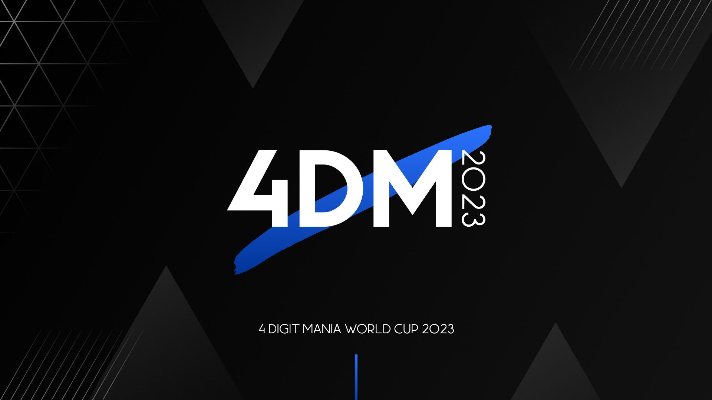

---
tags:
  - 4DM
  - 4DM2023
  - 4DMWC2023
---

# 4 Digit osu!mania World Cup 2023

The **4 Digit osu!mania World Cup 2023** (***4DM2023***) is a worldwide double-elimination 3v3 osu!mania 4-key tournament hosted by ::{ flag=NL }:: ::DannyPX::{ user=11253722 }, ::{ flag=US }:: ::Logan636::{ user=9423766 }, and ::{ flag=FR }:: ::Paturages::{ user=1375479 }. Only players ranked between #1,000 and #9,999 may participate. It is the fifth instalment of the 4 Digit osu!mania World Cup.

## Tournament schedule

| Event | Timestamp |
| --: | :-- |
| Staff registration phase | 2022-11-06/2022-11-27 |
| Player registration phase | 2022-11-27/2022-12-18 |
| Screening phase | 2022-12-18/2023-01-01 |
| Team captain announcement | 2023-01-07 |
| Qualifiers | 2023-01-14/2023-01-15 |
| Round of 32 | 2023-01-21/2023-01-22 |
| Round of 16 | 2023-01-28/2023-01-29 |
| Quarterfinals | 2023-02-04/2023-02-05 |
| Semifinals | 2023-02-11/2023-02-12 |
| Finals week 1 | 2023-02-18/2023-02-19 |
| Finals week 2 | 2023-02-25/2023-02-25 |

## Prizes

| Placing | Prize(s) |
| :-: | :-- |
|  | Unique profile badge, exclusive banner, 48% of the total prize pool |
|  | Exclusive banner, 32% of the total prize pool |
|  | Exclusive banner, 20% of the total prize pool |
| *4th place* | 1 month of osu!supporter |
| *5th place* | 1 month of osu!supporter |
| *6th place* | 1 month of osu!supporter |

Generous donations from ::{ flag=DO }:: ::Antalf::{ user=8793773 }, ::{ flag=NL }:: ::DannyPX::{ user=11253722 }, ::{ flag=DE }:: ::ERA medium kek::{ user=11625617 }, ::{ flag=US }:: ::Logan636::{ user=9423766 }, ::{ flag=FR }:: ::Paturages::{ user=1375479 }, and ::{ flag=GB }:: ::XxNewson1234xX::{ user=9895650 } helped fund some of the prizes.

## Organisation

The 4 Digit osu!mania World Cup 2023 is run by various community members.

| Position | Member(s) |
| :-- | :-- |
| Coordinator | ::{ flag=NL }:: ::DannyPX::{ user=11253722 }, ::{ flag=US }:: ::Logan636::{ user=9423766 }, ::{ flag=FR }:: ::Paturages::{ user=1375479 } |
| Consultant | ::{ flag=NL }:: ::Albionthegreat::{ user=9853595 }, ::{ flag=US }:: ::Orca-::{ user=7958845 }, ::{ flag=SG }:: ::Polytetral::{ user=8612061 } |
| Mappool selector | ::{ flag=US }:: ::chxu::{ user=13712190 }, ::{ flag=BR }:: ::DemiFiendSMT::{ user=20051971 }, ::{ flag=US }:: ::Orca-::{ user=7958845 }, ::{ flag=FR }:: ::Paturages::{ user=1375479 } |
| Map creator | ::{ flag=US }:: ::\[GS\]Rose::{ user=9481266 }, ::{ flag=CN }:: ::AlexDunk::{ user=9194799 }, ::{ flag=PH }:: ::arccat::{ user=4848294 }, ::{ flag=PL }:: ::Archaic84::{ user=8611177 }, ::{ flag=SG }:: ::Claren::{ user=9362562 }, ::{ flag=NL }:: ::DannyPX::{ user=11253722 }, ::{ flag=PH }:: ::doctormango::{ user=13370527 }, ::{ flag=PL }:: ::Eclipse-::{ user=8493070 }, ::{ flag=US }:: ::elexire::{ user=9206093 }, ::{ flag=PH }:: ::ERA Hatsuki::{ user=11306351 }, ::{ flag=ID }:: ::FelixSpade::{ user=2651304 }, ::{ flag=TH }:: ::HowToPlayLN::{ user=10879600 }, ::{ flag=AR }:: ::juankristal::{ user=443656 }, ::{ flag=RU }:: ::Lerck::{ user=10450696 }, ::{ flag=TH }:: ::MIkuaimbot::{ user=17699745 }, ::{ flag=TH }:: ::MyZterioN-::{ user=8521723 }, ::{ flag=US }:: ::Orca-::{ user=7958845 }, ::{ flag=TH }:: ::RuleBlazing::{ user=7312402 }, ::{ flag=CA }:: ::Stability::{ user=6701738 }, ::{ flag=SG }:: ::TheFunk::{ user=13981991 }, ::{ flag=BE }:: ::yetii::{ user=6914714 }, ::{ flag=HK }:: ::zero2snow::{ user=7751516 } |
| Mappool tester | ::{ flag=PE }:: ::\[GS\]DaZeRo5::{ user=6114633 }, ::{ flag=SG }:: ::AdamAckerville::{ user=12297375 }, ::{ flag=PL }:: ::Archaic84::{ user=8611177 }, ::{ flag=PL }:: ::Bexi::{ user=11548612 }, ::{ flag=MY }:: ::cheewee10::{ user=4477497 }, ::{ flag=MY }:: ::ERA Leon::{ user=13382147 }, ::{ flag=JP }:: ::gyoza\_goki::{ user=18144664 }, ::{ flag=BR }:: ::LeMarcinho::{ user=13347579 }, ::{ flag=TH }:: ::MIkuaimbot::{ user=17699745 }, ::{ flag=ES }:: ::Quenlla::{ user=4725379 }, ::{ flag=PH }:: ::Silhoueska Elze::{ user=11517895 } |
| Referee | ::{ flag=CN }:: ::\[Crz\]xz1z1z::{ user=10500832 }, ::{ flag=US }:: ::\[GS\]linc::{ user=12093536 }, ::{ flag=PE }:: ::-Xuste-::{ user=17989444 }, ::{ flag=ID }:: ::-Yubi-::{ user=17851478 }, ::{ flag=NL }:: ::Albionthegreat::{ user=9853595 }, ::{ flag=US }:: ::Alter-::{ user=4980256 }, ::{ flag=MY }:: ::Auxesiaa::{ user=16417718 }, ::{ flag=PL }:: ::Bexi::{ user=11548612 }, ::{ flag=US }:: ::bonkmi::{ user=21148690 }, ::{ flag=GB }:: ::Chimchar::{ user=18646531 }, ::{ flag=KR }:: ::Chronicler::{ user=16194858 }, ::{ flag=NL }:: ::DannyPX::{ user=11253722 }, ::{ flag=US }:: ::Doelon::{ user=17422924 }, ::{ flag=FI }:: ::Fisu::{ user=12545346 }, ::{ flag=ID }:: ::Fr05tyGD::{ user=14230684 }, ::{ flag=PH }:: ::Gerwin13::{ user=15776185 }, ::{ flag=US }:: ::Halogen-::{ user=169992 }, ::{ flag=PH }:: ::Kyonkichi::{ user=7585544 }, ::{ flag=ID }:: ::Kurami\_San::{ user=8867495 }, ::{ flag=RU }:: ::Lerck::{ user=10450696 }, ::{ flag=SE }:: ::Logg45vs::{ user=8684540 }, ::{ flag=VN }:: ::MashedPotato::{ user=10494860 }, ::{ flag=BE }:: ::Mortelspawn\_::{ user=5331420 }, ::{ flag=SG }:: ::Nazuna Amemiya::{ user=13966422 }, ::{ flag=US }:: ::Orca-::{ user=7958845 }, ::{ flag=VN }:: ::Poity::{ user=17148657 }, ::{ flag=SG }:: ::Polytetral::{ user=8612061 }, ::{ flag=ID }:: ::Reihynn::{ user=16630515 }, ::{ flag=PH }:: ::Silhoueska Elze::{ user=11517895 }, ::{ flag=SG }:: ::sukidayo-::{ user=16870002 }, ::{ flag=DE }:: ::TheHunter1::{ user=6496016 }, ::{ flag=CN }:: ::YuEast 2018::{ user=13953619 }, ::{ flag=HK }:: ::zero2snow::{ user=7751516 }, ::{ flag=FR }:: ::Zulsramno::{ user=12563193 } |
| Streamer | ::{ flag=MY }:: ::-Einar-::{ user=8782656 }, ::{ flag=NL }:: ::Albionthegreat::{ user=9853595 }, ::{ flag=PL }:: ::Bexi::{ user=11548612 }, ::{ flag=US }:: ::bonkmi::{ user=21148690 }, ::{ flag=US }:: ::Doelon::{ user=17422924 }, ::{ flag=US }:: ::EpsilonMaiagare::{ user=3855052 }, ::{ flag=TH }:: ::konkawe::{ user=15665805 }, ::{ flag=SE }:: ::Logg45vs::{ user=8684540 }, ::{ flag=SE }:: ::Mestro::{ user=4798263 }, ::{ flag=US }:: ::MoltenLead::{ user=22310025 }, ::{ flag=NL }:: ::NightNarumi::{ user=4381142 }, ::{ flag=FR }:: ::Paturages::{ user=1375479 }, ::{ flag=CA }:: ::Sinaeb::{ user=1576095 }, ::{ flag=US }:: ::SunApple::{ user=11817622 } |
| Commentator | ::{ flag=ID }:: ::\[Crz\]Crysarlene::{ user=5492871 }, ::{ flag=US }:: ::\[Crz\]Mitter::{ user=14551764 }, ::{ flag=US }:: ::\[GS\]Antunder::{ user=10416995 }, ::{ flag=US }:: ::\[GS\]linc::{ user=12093536 }, ::{ flag=US }:: ::\[LS\]Ham::{ user=17523947 }, ::{ flag=US }:: ::-mint-::{ user=8976576 }, ::{ flag=US }:: ::-Sparky-::{ user=3187959 }, ::{ flag=SG }:: ::AdamAckerville::{ user=12297375 }, ::{ flag=AU }:: ::aiemasu::{ user=16954929 }, ::{ flag=US }:: ::A kiwi::{ user=19587411 }, ::{ flag=NL }:: ::Albionthegreat::{ user=9853595 }, ::{ flag=US }:: ::Alter-::{ user=4980256 }, ::{ flag=PL }:: ::Bexi::{ user=11548612 }, ::{ flag=US }:: ::CompNebula::{ user=18418917 }, ::{ flag=MY }:: ::Cryolien::{ user=1626983 }, ::{ flag=PH }:: ::DaMeMeThEiFxD::{ user=14324153 }, ::{ flag=KR }:: ::DHLEE727::{ user=3428908 }, ::{ flag=US }:: ::Dynascape::{ user=8784587 }, ::{ flag=US }:: ::EpsilonMaiagare::{ user=3855052 }, ::{ flag=MY }:: ::ERA Leon::{ user=13382147 }, ::{ flag=US }:: ::ERA PorkIsGreat::{ user=10756322 }, ::{ flag=FI }:: ::Fisu::{ user=12545346 }, ::{ flag=ID }:: ::Fr05tyGD::{ user=14230684 }, ::{ flag=US }:: ::FullCombro::{ user=12045149 }, ::{ flag=GB }:: ::H1Pur::{ user=15756120 }, ::{ flag=PH }:: ::Itawachi::{ user=12929973 }, ::{ flag=AR }:: ::juankristal::{ user=443656 }, ::{ flag=IT }:: ::Kiraz::{ user=3807675 }, ::{ flag=VN }:: ::Lott::{ user=13821222 }, ::{ flag=VN }:: ::MashedPotato::{ user=10494860 }, ::{ flag=ID }:: ::Oofyxl::{ user=20599160 }, ::{ flag=US }:: ::Orca-::{ user=7958845 }, ::{ flag=SG }:: ::Polytetral::{ user=8612061 }, ::{ flag=SG }:: ::Raveille::{ user=1388767 }, ::{ flag=NZ }:: ::Robeats::{ user=19446399 }, ::{ flag=PH }:: ::Silhoueska Elze::{ user=11517895 }, ::{ flag=PH }:: ::Steeeven::{ user=15503384 }, ::{ flag=SG }:: ::sukidayo-::{ user=16870002 }, ::{ flag=US }:: ::SunApple::{ user=11817622 }, ::{ flag=SG }:: ::TheFunk::{ user=13981991 }, ::{ flag=FI }:: ::Tre::{ user=10024264 }, ::{ flag=CA }:: ::walmart5193::{ user=16468962 } |
| Designer | ::{ flag=NL }:: ::DannyPX::{ user=11253722 } |
| Statistician | ::{ flag=NL }:: ::Albionthegreat::{ user=9853595 }, ::{ flag=TH }:: ::HowToPlayLN::{ user=10879600 }, ::{ flag=SG }:: ::Polytetral::{ user=8612061 } |
| Wiki writer | ::{ flag=NL }:: ::Albionthegreat::{ user=9853595 }, ::{ flag=ID }:: ::fajar13k::{ user=7100002 } |
| Pick'em manager | ::{ flag=NL }:: ::Albionthegreat::{ user=9853595 } |
| Fantasy League manager | ::{ flag=SG }:: ::Raveille::{ user=1388767 } |

## Links

- [Discussion thread](https://osu.ppy.sh/community/forums/topics/1671710)
- [4DM Discord server](https://discord.gg/W2MQ647)
- [4DM Youtube channel](https://www.youtube.com/channel/UC9mLxo8frxAJCf1vrASEFDg)
- [4DM2023 trailer](https://www.youtube.com/watch?v=dkDgvkmCEQg)
- [Livestream](https://www.twitch.tv/4digitmwc)
- [Pick'em predictions website](https://pickem.hwc.hr/tournaments/104) hosted by ::{ flag=DE }:: ::hallowatcher::{ user=1874761 }
- Spreadsheets
  - **[Master](https://docs.google.com/spreadsheets/d/1Bx9iESgLlLqxVarV_Oq75V67WH-n-3OY6SFi1eAH2bI/edit?rm=minimal)**
  - [Statistics](https://docs.google.com/spreadsheets/d/1kzi1CAdh56pcj6Gy-YVmPZBRF7sMqu9QLH6rtyZ_lII/edit?rm=minimal)

## Participants

|  | Country | Members |
| :-: | :-- | :-- |
| ::{ flag=AR }:: | **Argentina** | **::Spktr::{ user=9856089 }**, ::aluuu::{ user=4585260 }, ::BL5::{ user=13187997 }, ::Gonzalo::{ user=6719880 }, ::-hakitsu::{ user=25300387 }, ::chwisuwu::{ user=11394892 } |
| ::{ flag=AU }:: | **Australia** | **::PotassiumF::{ user=4247722 }**, ::aiemasu::{ user=16954929 }, ::\[ Decku \]::{ user=13360768 }, ::Orcanos::{ user=13762441 }, ::beatsaberisgood::{ user=24427023 }, ::FluffyGMD::{ user=10502251 } |
| ::{ flag=BR }:: | **Brazil** | **::Zergh::{ user=3181281 }**, ::nayeonie bunny::{ user=15187174 }, ::Maykee kee::{ user=23091978 }, ::Jeyfor::{ user=12377583 }, ::Buvuw::{ user=22921542 }, ::Soore::{ user=15753462 } |
| ::{ flag=CA }:: | **Canada** | **::svp-::{ user=13887380 }**, ::twitch chat::{ user=12723207 }, ::\[LS\]Byte::{ user=15174223 }, ::Axelerrixx::{ user=18236316 }, ::Robert6400::{ user=11467559 }, ::Holo the Wise::{ user=17036270 } |
| ::{ flag=CL }:: | **Chile** | **::itourith::{ user=10809147 }**, ::\[TMEO\]Okita::{ user=13594429 }, ::NewMaxsue::{ user=16910603 }, ::xaxreid::{ user=4227431 } |
| ::{ flag=CN }:: | **China** | **::\[GB\]Mafufu::{ user=10884561 }**, ::\[GB\]Luoxuan0327::{ user=8586018 }, ::\[GB\]mmttyy233::{ user=28639641 }, ::lovely\1hyahya::{ user=10318380 }, ::Molli::{ user=8893772 }, ::Zyuuu::{ user=15389275 } |
| ::{ flag=CO }:: | **Colombia** | **::ag0::{ user=17989209 }**, ::MarvelousCosmos::{ user=14189527 }, ::teclado de whip::{ user=11251832 }, ::Saikuto::{ user=22095766 }, ::iTzMeEsteban::{ user=10442657 }, ::wretched egg 16::{ user=14935856 } |
| ::{ flag=DK }:: | **Denmark** | **::Jole::{ user=2883132 }**, ::\[HD\]Urrk::{ user=11539225 }, ::Cath::{ user=10202140 }, ::Fritte::{ user=5001658 }, ::Stoom::{ user=13572493 }, ::VirtualND::{ user=5352616 } |
| ::{ flag=EC }:: | **Ecuador** | **::-Kokito::{ user=17530958 }**, ::BOLITA\1PEGADA::{ user=24075447 }, ::jefflainsat::{ user=22827237 }, ::Joshua9793::{ user=18740701 }, ::roingus::{ user=10012563 }, ::SunshineCris::{ user=19392744 } |
| ::{ flag=FI }:: | **Finland** | **::Albania Illya::{ user=10393606 }**, ::Leka::{ user=11408653 }, ::\[WP\]Danitskin::{ user=4337529 }, ::Mazzuli500::{ user=10648818 }, ::Tre::{ user=10024264 } |
| ::{ flag=FR }:: | **France** | **::Babibelbleu::{ user=16892459 }**, ::ssiizz\1::{ user=16487992 }, ::Limbecile::{ user=12341059 }, ::billiack::{ user=14013641 }, ::jeremkyurem::{ user=13431947 }, ::Wavelation::{ user=5415502 } |
| ::{ flag=DE }:: | **Germany** | **::ERA medium kek::{ user=11625617 }**, ::ERA Punish::{ user=10615367 }, ::ERA Sirbeyy::{ user=12917829 }, ::ERA Leo::{ user=15440118 }, ::Tiger::{ user=10242297 }, ::Spacee\1::{ user=17692627 } |
| ::{ flag=HK }:: | **Hong Kong** | **::DC2\1727::{ user=17483369 }**, ::Misolato::{ user=6187838 }, ::roy2206::{ user=15035633 }, ::pofnkul::{ user=23717210 }, ::\[Mom\] xbob::{ user=18481445 }, ::HolySteven::{ user=10502375 } |
| ::{ flag=ID }:: | **Indonesia** | **::Oofyxl::{ user=20599160 }**, ::AZKiFanboy::{ user=5179764 }, ::zxibs::{ user=26634482 }, ::iSxga::{ user=15801261 }, ::\[ -Asriel- \]::{ user=11829623 }, ::SuzuneHanamona::{ user=24559683 } |
| ::{ flag=IE }:: | **Ireland** | **::MilkWatcher::{ user=13794811 }**, ::-Nightkore::{ user=26311862 }, ::-Scott::{ user=6246211 }, ::iParacosm::{ user=19466314 }, ::Lumarium::{ user=20110813 }, ::Walibi::{ user=15096052 } |
| ::{ flag=IT }:: | **Italy** | **::Kiraz::{ user=3807675 }**, ::antony88fayah::{ user=20656485 }, ::Sib3riaN\1T3cK::{ user=17768545 }, ::- Rick -::{ user=25263357 }, ::michxxx::{ user=16965810 }, ::EliteDreamer::{ user=18274507 } |
| ::{ flag=JP }:: | **Japan** | **::Mi0117::{ user=15501680 }**, ::AxReo::{ user=10924058 }, ::yakik::{ user=16801743 }, ::shirokuma1022::{ user=31755778 }, ::Ageha8239::{ user=8895079 }, ::syo73::{ user=14495182 } |
| ::{ flag=KZ }:: | **Kazakhstan** | **::IlasTv::{ user=23598112 }**, ::pashalka::{ user=25371717 }, ::sfsisko::{ user=24229334 } |
| ::{ flag=MY }:: | **Malaysia** | **::-Einar-::{ user=8782656 }**, ::JayLye::{ user=14892447 }, ::Cryolien::{ user=1626983 }, ::Tosai\1::{ user=3760209 }, ::StyGix::{ user=7745408 }, ::Ju1nY11::{ user=14743871 } |
| ::{ flag=MX }:: | **Mexico** | **::\[TK\]Martin\122::{ user=9653729 }**, ::Shadow\1GM::{ user=19554046 }, ::Dex uwu::{ user=12084755 }, ::\[-Elliot-\]::{ user=29716889 }, ::Andromeda btw::{ user=14629669 }, ::\[LS\]rudify::{ user=16425015 } |
| ::{ flag=NL }:: | **Netherlands** | **::2fast::{ user=5183940 }**, ::samuelhklumpers::{ user=10945523 }, ::Tyronixfanboy::{ user=16999311 }, ::Ready Perfectly::{ user=10944966 }, ::Freek::{ user=9630674 }, ::Saemitsu::{ user=14262789 } |
| ::{ flag=NZ }:: | **New Zealand** | **::Prismal Gaming::{ user=25689815 }**, ::jrny::{ user=11328112 }, ::Zed0x::{ user=12136108 }, ::troydogape679::{ user=24534806 }, ::IslandMan::{ user=28045758 } |
| ::{ flag=NI }:: | **Nicaragua** | **::BlenkchL::{ user=15714839 }**, ::\_ZaFkieL\_::{ user=11372299 }, ::ArtTrits55::{ user=22508663 }, ::KevinRJF::{ user=14309000 }, ::LLB\1BBX::{ user=26133850 }, ::RiRinST::{ user=17113003 } |
| ::{ flag=PE }:: | **Peru** | **::Kamikho::{ user=12664851 }**, ::Sp3ctro::{ user=18344249 }, ::AkemiWaton::{ user=22660023 }, ::Itz\1cuy::{ user=17797442 }, ::samu3lg::{ user=22630679 }, ::\[ Defuu- \]::{ user=25129861 } |
| ::{ flag=PH }:: | **Philippines** | **::ERA Frossno::{ user=17480973 }**, ::Dyei::{ user=23643731 }, ::iid3rp::{ user=23274559 }, ::ManiaDegengod::{ user=13193798 }, ::\[LS\]Tenshi::{ user=18520056 }, ::DiamondGenius75::{ user=19107638 } |
| ::{ flag=PL }:: | **Poland** | **::Mr\1adamello::{ user=7420894 }**, ::SitekX::{ user=3840946 }, ::PoweR\1LendzeR::{ user=2894654 }, ::Paraxia::{ user=14001000 }, ::bagjettka::{ user=18338179 }, ::MemePaladin399::{ user=16116021 } |
| ::{ flag=PR }:: | **Puerto Rico** | **::ovr::{ user=23922839 }**, ::FoxyGaming398YT\1old::{ user=14322727 }, ::undr::{ user=17640899 }, ::Dari\1::{ user=15905527 } |
| ::{ flag=RO }:: | **Romania** | **::Mich\1::{ user=11784492 }**, ::Kiirbo::{ user=14985143 }, ::Bluestone413::{ user=17705451 } |
| ::{ flag=RU }:: | **Russian Federation** | **::SmeadollsBoy::{ user=9504954 }**, ::Asefis::{ user=10840899 }, ::Soldier\1Hibi::{ user=18867357 }, ::Starpage::{ user=9510882 }, ::ZugamiRA::{ user=11026954 } |
| ::{ flag=SG }:: | **Singapore** | **::riunosk::{ user=5594381 }**, ::McButt::{ user=18018708 }, ::awdse22::{ user=8743513 }, ::icxfire::{ user=21207265 }, ::TheOPmeme::{ user=15763622 }, ::Neon-Hooray::{ user=24058560 } |
| ::{ flag=KR }:: | **South Korea** | **::AnMaO::{ user=11143150 }**, ::Piper::{ user=10592853 }, ::-3000::{ user=27671243 }, ::Hakos-Baelz::{ user=8990884 } |
| ::{ flag=ES }:: | **Spain** | **::Froggie09::{ user=14332005 }**, ::Enthalpy::{ user=9552883 }, ::Minikrimi::{ user=15186865 }, ::White Hare::{ user=19687112 }, ::Kracohc::{ user=11554942 }, ::sagerao::{ user=6605301 } |
| ::{ flag=SE }:: | **Sweden** | **::diamondBIaze::{ user=10553827 }**, ::Johnney101::{ user=11928361 }, ::NeonDrakon::{ user=6315000 }, ::oliverq::{ user=14888056 } |
| ::{ flag=TW }:: | **Taiwan** | **::yaya901609::{ user=15317574 }**, ::\[ Kloc \]::{ user=11609084 }, ::\[Paw\]Shiro::{ user=15096556 }, ::amano\1hina::{ user=19882148 }, ::Pdog4ni::{ user=14581544 }, ::tommy125::{ user=15189878 } |
| ::{ flag=TH }:: | **Thailand** | **::nanonbandusty::{ user=15543726 }**, ::basicmaime::{ user=6537441 }, ::HowToBeIntel::{ user=6535376 }, ::G1ilbert::{ user=7408055 }, ::Freshky::{ user=11959687 }, ::- Rinmoz -::{ user=16639144 } |
| ::{ flag=TR }:: | **Turkey** | **::KabizEjderha::{ user=16348899 }**, ::Ayhan2005::{ user=6419257 }, ::nismo::{ user=16137157 }, ::dumbidot::{ user=19664675 } |
| ::{ flag=AE }:: | **United Arab Emirates** | **::iAteYourToys::{ user=23253720 }**, ::Ph0xie::{ user=25117537 }, ::Phagosaur::{ user=11365333 }, ::Spong\1boii::{ user=26113356 } |
| ::{ flag=GB }:: | **United Kingdom** | **::H1Pur::{ user=15756120 }**, ::epic man 2::{ user=14566000 }, ::kinuh::{ user=20849531 }, ::\[CE\]asukai::{ user=15465935 }, ::Usie::{ user=16162078 }, ::--Dragon--::{ user=11924624 } |
| ::{ flag=US }:: | **United States** | **::\1Seth::{ user=8111953 }**, ::Scep::{ user=11196445 }, ::Retina::{ user=11392859 }, ::Znow::{ user=15513303 }, ::charlie72::{ user=14177626 }, ::- Sky -::{ user=15255368 } |
| ::{ flag=VN }:: | **Vietnam** | **::\[KN\]Vixile::{ user=26233321 }**, ::SturpdaFuro::{ user=22644374 }, ::ZMCKENBI::{ user=24254663 }, ::-dex-::{ user=21188734 }, ::khoakiller123::{ user=13219309 }, ::TvS SorAKuN::{ user=11115041 } |

## Podium

This competition has come to an end and resulted in the following podium:

| Placing | Team |
| :-: | :-- |
|  | ::{ flag=CN }:: **China** (**::\[GB\]Mafufu::{ user=10884561 }**, ::\[GB\]Luoxuan0327::{ user=8586018 }, ::\[GB\]mmttyy233::{ user=28639641 }, ::lovely\1hyahya::{ user=10318380 }, ::Molli::{ user=8893772 }, ::Zyuuu::{ user=15389275 }) |
|  | ::{ flag=SG }:: **Singapore** (**::riunosk::{ user=5594381 }**, ::McButt::{ user=18018708 }, ::awdse22::{ user=8743513 }, ::icxfire::{ user=21207265 }, ::TheOPmeme::{ user=15763622 }, ::Neon-Hooray::{ user=24058560 }) |
|  | ::{ flag=CA }:: **Canada** (**::svp-::{ user=13887380 }**, ::twitch chat::{ user=12723207 }, ::\[LS\]Byte::{ user=15174223 }, ::Axelerrixx::{ user=18236316 }, ::Robert6400::{ user=11467559 }, ::Holo the Wise::{ user=17036270 }) |

## Mappools

### Grand Finals

- Rice
  1. [Horie Yui - The World's End (Cut version) (Hylotl) \[Nostalgia <3 \[1.05x Rate\]\]](https://osu.ppy.sh/beatmapsets/1942797#mania/4018764)
  2. [Diablo Swing Orchestra - Voodoo Mon Amour (chxu) \[LoftyKlaius's Beginner\]](https://osu.ppy.sh/beatmapsets/1943701#mania/4020905)
  3. [My Chemical Romance - Lofty's Ending (Nezu-) \[Sklaina137's Beginner 1.15x\]](https://osu.ppy.sh/beatmapsets/1943032#mania/4019195)
  4. [Bring Me The Horizon - Dear Diary (chxu) \[VALEDICT'S NIGHT OF THE LIVING DEAD (EDIT)\]](https://osu.ppy.sh/beatmapsets/1943700#mania/4020903)
  5. [Otros Aires - Los Vino (DemiFiendSMT) \[Catena Zapata 1.2x\]](https://osu.ppy.sh/beatmapsets/1943621#mania/4020621)
  6. [Frums - parvorbital (walmart5193) \[do you want to see it too? (edit)\]](https://osu.ppy.sh/beatmapsets/1801175#mania/4018474)
  7. [-45 - Doll of Ai-Ren (Zami) \[AMRITA\]](https://osu.ppy.sh/beatmapsets/1221155#mania/2540250)
- Hybrid
  1. [NIWASHI - Playing With Ruby (elexire) \[Gem 1.15x (207bpm)\]](https://osu.ppy.sh/beatmapsets/1942787#mania/4018744)
  2. [lhk - 5D TETRIS MATCH & REMATCH (Cut Ver.) (TheFunk) \[Ultimatris\]](https://osu.ppy.sh/beatmapsets/1942708#mania/4018544)
  3. [Shiraishi - Makoto. Sennen Joou (Archaic84) \[Divine\]](https://osu.ppy.sh/beatmapsets/1943362#mania/4019887)
- LN
  1. [Kabocha feat. Aitsuki Nakuru - Lilith (doctormango) \[sways of lust\]](https://osu.ppy.sh/beatmapsets/1942613#mania/4018366)
  2. [Se-U-Ra - Igallta (FelixSpade) \[LN Prodigy\]](https://osu.ppy.sh/beatmapsets/1942894#mania/4018922)
  3. [sasakure.UK feat. Hatsune Miku + KAITO - AMARA (Daimirai Dennou) (MyZterioN-) \[artificial language\]](https://osu.ppy.sh/beatmapsets/1943025#mania/4099552)
  4. [youman feat. GUMI - Weenywalker (-mint-) \[Predetermination 1.05x\]](https://osu.ppy.sh/beatmapsets/1939419#mania/4009798)
- SV
  1. [IDK - Porno (Saint Punk Remix) (Nightcore Ver.) (Orca-) \[Explicit\]](https://osu.ppy.sh/beatmapsets/1943788#mania/4021087)
  2. [Lamanya - Q33B (Claren) \[PH4N745M460R1C4L 51LH0U37735 (4DM23 Edit)\]](https://osu.ppy.sh/beatmapsets/1943680#mania/4020859)
- Tiebreaker
  1. **[takehirotei vs. HowToPlayLN - Essence (MyZterioN-) \[Constellation\]](https://osu.ppy.sh/beatmapsets/1943786#mania/4021083)**

### Finals

- Rice
  1. [Yanagi Eiichiro - Scarlet Tears (DemiFiendSMT) \[Blessia's Bloody Symphonia\]](https://osu.ppy.sh/beatmapsets/1939353#mania/4009633)
  2. [Mao Abe - Believe in yourself (DemiFiendSMT) \[Skwid's Challenge\]](https://osu.ppy.sh/beatmapsets/1939280#mania/4009446)
  3. [Yuuyu - Ra Variationen (chxu) \[DZ's POSSESSION (nerfed trills)\]](https://osu.ppy.sh/beatmapsets/1939055#mania/4008654)
  4. [JOYRYDE - FUEL TANK (DemiFiendSMT) \[Lemon's Beginner 1.05x\]](https://osu.ppy.sh/beatmapsets/1939372#mania/4009672)
  5. [Tanchiky - ENERGY SYNERGY MATRIX (DemiFiendSMT) \[Sheenoboo's EZ \[1,05x\]\]](https://osu.ppy.sh/beatmapsets/1939381#mania/4009690)
  6. [Motley Crue - Kickstart My Heart (chxu) \[Zeta's Medium x1.05\]](https://osu.ppy.sh/beatmapsets/1939063#mania/4008710)
  7. [A.SAKA - KARAKURI (arpia97) \[Orient\]](https://osu.ppy.sh/beatmapsets/1778365#mania/3642199)
- Hybrid
  1. [LucaProject - Nidhoggr (HowToPlayLN) \[Journalism\]](https://osu.ppy.sh/beatmapsets/1939404#mania/4009748)
  2. [Ashrount - AureoLe ~For Triumph~ (Eclipse-) \[EXCEED\]](https://osu.ppy.sh/beatmapsets/1938859#mania/4008170)
  3. [Terminal 11 - Rabid Mist (Lerck) \[Maddening vapors\]](https://osu.ppy.sh/beatmapsets/1938627#mania/4007619)
- LN
  1. [Camellia - Cho Kisou Sengaku-tai - Subete ga maboroshi ni natta nochi de (Eclipse-) \[EXCEED\]](https://osu.ppy.sh/beatmapsets/1938863#mania/4008174)
  2. [Morimori Atsushi - PUPA (FelixSpade) \[LN Prodigy 1.05x (212bpm)\]](https://osu.ppy.sh/beatmapsets/1938678#mania/4007714)
  3. [eropius - Albion After the Dawn (Cut Ver.) (Paturages) \[Triple Reffing\]](https://osu.ppy.sh/beatmapsets/1938867#mania/4008183)
  4. [Feryquitous - Dille (\[Crz\]Crysarlene) \[(edit) => { return edit }\]](https://osu.ppy.sh/beatmapsets/1270439#mania/3881139)
- SV
  1. [Aire - Get Down (AlexDunk) \[:touchsvgrass:\]](https://osu.ppy.sh/beatmapsets/1939427#mania/4009815)
  2. [Frequent - Alpha State (Cut Ver.) (arccat) \[Anamnesis\]](https://osu.ppy.sh/beatmapsets/1748927#mania/4009371)
- Tiebreaker
  1. **[Kurokotei feat. Sennzai - escape (the looking-glass, and what alice found there) (doctormango) \[doppelganger in the elysium fields\]](https://osu.ppy.sh/beatmapsets/1939380#mania/4009689)**

### Semifinals

- Rice
  1. [Spacelectro feat. Shiiki Reku - Rhythmy \[Joulez Remix\] (LeiN-) \[Equinox // 4K 1.35x (232bpm)\]](https://osu.ppy.sh/beatmapsets/1665954#mania/3401286)
  2. [HIM - In the Arms of Rain (isokasapupuja) \[Beginner 1.05x (156bpm)\]](https://osu.ppy.sh/beatmapsets/1935600#mania/4000364)
  3. [Queen 26 - Don't Let Me Be The First (Leo137) \[Vroom\]](https://osu.ppy.sh/beatmapsets/1935063#mania/3999010)
  4. [JAKAZiD - Take Me Higher (chxu) \[Biosphere's Ultra x1.05\]](https://osu.ppy.sh/beatmapsets/1935074#mania/3999028)
  5. [lapix - Born 2 Lose (Chrubble) \[Collapse\]](https://osu.ppy.sh/beatmapsets/1002885#mania/2099056)
  6. [sakuzyo - Battle Frenzy Dance (chxu) \[Xingyue's BFD (low-LN)\]](https://osu.ppy.sh/beatmapsets/1935061#mania/3998984)
- Hybrid
  1. [lapix - Flying Castle (TheFunk) \[Colourdrive\]](https://osu.ppy.sh/beatmapsets/1935107#mania/3999102)
  2. [Virtual Riot - Don't Worry (AlexDunk) \[Mutation.\]](https://osu.ppy.sh/beatmapsets/1900372#mania/3917229)
  3. [r - Abendo (Eclipse-) \[Revenant (2023)\]](https://osu.ppy.sh/beatmapsets/1328186#mania/2751419)
- LN
  1. [Halv - Kyubi (MIkuaimbot) \[Life String (edit)\]](https://osu.ppy.sh/beatmapsets/1935389#mania/3999807)
  2. [Jellyfish! - Castles (Dazuko Remix) (Cut ver.) (MIkuaimbot) \[HowToPlayLN's Vulnerability\]](https://osu.ppy.sh/beatmapsets/1876680#mania/3862183)
  3. [Mitsukiyo - Rolling Beat (chxu) \[Hereafter\]](https://osu.ppy.sh/beatmapsets/1935065#mania/3999014)
- SV
  1. [Alkome - Trust It (Claren) \[Trust me, there are SVs\]](https://osu.ppy.sh/beatmapsets/1935441#mania/3999979)
  2. [Avans - All In (RuleBlazing) \[croissant is the diffname\]](https://osu.ppy.sh/beatmapsets/1935432#mania/3999964)
- Tiebreaker
  1. **[Amuro vs. Killer - Mei (Camellia's "Yomigae" Remix) (Seiran-) \[Eternities\]](https://osu.ppy.sh/beatmapsets/1827115#mania/3749678)**

### Quarterfinals

- Rice
  1. [Outracks - Blockbuster (Guilhermeziat) \[Beginner 1.15x (223bpm) OD8.5\]](https://osu.ppy.sh/beatmapsets/996116#mania/2083579)
  2. [Manuel - GAS GAS GAS (chxu) \[R666's Challenge\]](https://osu.ppy.sh/beatmapsets/1931519#mania/3990289)
  3. [Streetlight Manifesto - Point / Counterpoint (Monheim) \[Antics (Low LN)\]](https://osu.ppy.sh/beatmapsets/1705189#mania/3987469)
  4. [Black Eyed Peas - Pump It (DemiFiendSMT) \[Zeta's Challenge \[1,05x Rate\]\]](https://osu.ppy.sh/beatmapsets/1931542#mania/3990322)
  5. [Igorrr & Ruby My Dear - Alain (lemonguy) \[Challenge (edit)\]](https://osu.ppy.sh/beatmapsets/999132#mania/3988723)
  6. [Kensuke Ushio - China (Falcon) \[Ni Hao (1.0x)\]](https://osu.ppy.sh/beatmapsets/1927760#mania/3981008)
- Hybrid
  1. [Silentroom - Angel Echo (BringoBrango) \[By God's Grace (cut)\]](https://osu.ppy.sh/beatmapsets/1929150#mania/3984465)
  2. [lapix - Amazing Mirage (TingMomentum) \[Timewarp\]](https://osu.ppy.sh/beatmapsets/1676258#mania/3982841)
  3. [Twinfield - Selfish Collider feat. Rei Tsumugine (ERA Leon) \[Stay with you (cut & edit)\]](https://osu.ppy.sh/beatmapsets/1924770#mania/3987764)
- LN
  1. [Ado - New Genesis (juankristal) \[The Juan Piece is Real\]](https://osu.ppy.sh/beatmapsets/1931452#mania/3990123)
  2. [penoreri - Lord=Crossight (FelixSpade) \[LN Expert 1.05x (162bpm)\]](https://osu.ppy.sh/beatmapsets/1931345#mania/3989857)
  3. [M2U - Quo Vadis (HowToPlayLN) \[HTPLN x Felix's Departure\]](https://osu.ppy.sh/beatmapsets/1931135#mania/3989388)
- SV
  1. [PSYQUI - Concentration (Cut Ver.) (Paturages) \[Juice\]](https://osu.ppy.sh/beatmapsets/1931485#mania/3990217)
  2. [Haywyre - Back and Forth (RuleBlazing) \[Reversive\]](https://osu.ppy.sh/beatmapsets/1931366#mania/3989898)
- Tiebreaker
  1. **[Rabbit House - Divine Ordeal (TheFunk) \[Woodworks (4DM2023 edit)\]](https://osu.ppy.sh/beatmapsets/1931432#mania/3990073)**

### Round of 16

- Rice
  1. [Seiryu - Crimson Mist (DemiFiendSMT) \[Challenge \[Edit 1.05x\]\]](https://osu.ppy.sh/beatmapsets/1927533#mania/3980515)
  2. [Katy Perry - Teenage Dream (chxu) \[Sexuality Violation 2\]](https://osu.ppy.sh/beatmapsets/1927519#mania/3980492)
  3. [ONE OK ROCK - Mighty Long Fall (chxu) \[Low LN\]](https://osu.ppy.sh/beatmapsets/1927518#mania/3980489)
  4. [paraoka ft. MIROMU*STARDUST - Rainbow Archiver (0DZ0) \[Miraiya\]](https://osu.ppy.sh/beatmapsets/1924559#mania/3973196)
  5. [Ekcle - Crafted In Ice (cosmovibe) \[Pristine\]](https://osu.ppy.sh/beatmapsets/1924580#mania/3973286)
- Hybrid
  1. [Nekomata Master vs. HuMeR - BUZRA (DoNotMess) \[Arts (NSV)\]](https://osu.ppy.sh/beatmapsets/1924515#mania/3973074)
  2. [uma vs. Morimori Atsushi - FIRST : DREAMS (Suu is my waifu) \[MAXIMUM\]](https://osu.ppy.sh/beatmapsets/1361861#mania/2817877)
- LN
  1. [luvlxckdown - tbh i dont like being social (Stability) \[introverted \[edit\]\]](https://osu.ppy.sh/beatmapsets/1625473#mania/3978783)
  2. [PinocchioP feat. Hatsune Miku - Non-breath oblige (\[GS\]Rose) \[edit\]](https://osu.ppy.sh/beatmapsets/1852295#mania/3948720)
  3. [M2U - Wicked Fate (FelixSpade) \[LN Expert\]](https://osu.ppy.sh/beatmapsets/1927405#mania/3980139)
- SV
  1. [android52 - Like This (Paturages) \[SV Like This\]](https://osu.ppy.sh/beatmapsets/1927522#mania/3980498)
  2. [Blue Archive - GIVE ME CHOCO (RuleBlazing) \[Lovely Valentine\]](https://osu.ppy.sh/beatmapsets/1927511#mania/3980450)
- Tiebreaker
  1. **[Arch Echo - To the moon (Nezu-) \[Stellar\]](https://osu.ppy.sh/beatmapsets/1657643#mania/3977098)**

### Round of 32

- Rice
  1. [Official HIGE DANdism - Bad for me (Dz'Xa's Amenpunk) (myucchii) \[Urusai's Extra\]](https://osu.ppy.sh/beatmapsets/1868761#mania/3844526)
  2. [Blitz Lunar - Heavenly Spores (Kommisar_old) \[Chipstream\]](https://osu.ppy.sh/beatmapsets/1919091#mania/3960212)
  3. [KO3 - Fire in the sky (feat.Kanae Asaba) (Doshowz) \[Medium x1.05\]](https://osu.ppy.sh/beatmapsets/1920978#mania/3965029)
  4. [orangentle - HAELEQUIN (hi19hi19) \[Hard\]](https://osu.ppy.sh/beatmapsets/1918671#mania/3959400)
  5. [The Flashbulb - Undiscovered Colors (Cut Ver.) (Halogen-) \[Achromatic 1.05x (147bpm)\]](https://osu.ppy.sh/beatmapsets/1920291#mania/3963299)
- Hybrid
  1. [Kanade Hayami - Hotel Moonside(kors k Bootleg) (riktoi) \[edit 1.2x\]](https://osu.ppy.sh/beatmapsets/903360#mania/3959729)
  2. [Zekk - SUPER * HARAGURO * POP (Lami-) \[Expert\]](https://osu.ppy.sh/beatmapsets/1721103#mania/3517331)
- LN
  1. [Namitape feat. Kaai Yuki - Mirareru Mirror (Ballistic) \[Reflection\]](https://osu.ppy.sh/beatmapsets/1823196#mania/3741072)
  2. [POLKADOT STINGRAY - FREE (Stability) \[Euphoric \[edit\]\]](https://osu.ppy.sh/beatmapsets/1541763#mania/3960222)
  3. [KNOWER - Time Traveler (AlexDunk) \[Penguin's Hard\]](https://osu.ppy.sh/beatmapsets/1612144#mania/3321655)
- SV
  1. [Kakeru - Progress (cut ver.) (HowToPlayLN) \[wokrs (sv)\]](https://osu.ppy.sh/beatmapsets/1923542#mania/3970874)
  2. [Kana Nishino - Sweet Dreams (11t dnb mix) (Paturages) \[Martin Luther King\]](https://osu.ppy.sh/beatmapsets/1923685#mania/3971246)
- Tiebreaker
  1. **[Camellia - New Era (Eclipse-) \[Forgotten Legacy\]](https://osu.ppy.sh/beatmapsets/1923684#mania/3971245)**

### Qualifiers

1. [Chroma - Test Flight (Orca-) \[Stage 1: Takeoff\]](https://osu.ppy.sh/beatmapsets/1918273#mania/3958440)
2. [Cranky - La fuite des jours (RuleBlazing) \[Stage 2: Delightful\]](https://osu.ppy.sh/beatmapsets/1918411#mania/3958784)
3. [Yunosuke - Illusional Flashback (TheFunk) \[Stage 3: Phantasm\]](https://osu.ppy.sh/beatmapsets/1918428#mania/3958820)
4. [tropes - a reason why (Stability) \[Stage 4: Euphemism\]](https://osu.ppy.sh/beatmapsets/1918406#mania/3958778)
5. [IOSYS TRAX with Chiyoko - DX Choyasei! Survival Zundoko Chan (Sped Up Ver.) (arccat) \[Stage 5: Groove\]](https://osu.ppy.sh/beatmapsets/1918400#mania/3958763)
6. [Sta - 2 Minutes Euphoria (ft. Feryquitous) (AlexDunk) \[Stage 6: neverlasting.\]](https://osu.ppy.sh/beatmapsets/1918412#mania/3958785)
7. [Neutralizer - Cosmic Isolation (Speed up ver.) (Lerck) \[Stage 7: FieryVoid\]](https://osu.ppy.sh/beatmapsets/1918418#mania/3958797)
8. [Supire - Aquaphilia (DannyPX) \[Stage 8: Depths\]](https://osu.ppy.sh/beatmapsets/1918438#mania/3958847)

## Match results

### Grand Finals

Saturday, 25 February 2023:

| Team 1 |  |  | Team 2 | Match link |
| --: | :-: | :-: | :-- | :-- |
| **Singapore** ::{ flag=SG }:: | **7** | 0 | ::{ flag=CA }:: Canada | [#1](https://osu.ppy.sh/community/matches/107049442) |

Saturday, 4 March 2023:

| Team 1 |  |  | Team 2 | Match link |
| --: | :-: | :-: | :-- | :-- |
| China ::{ flag=CN }:: | 5 | **7** | ::{ flag=SG }:: **Singapore** | [#1](https://osu.ppy.sh/community/matches/107170387) |
| Singapore ::{ flag=SG }:: | 2 | **7** | ::{ flag=CN }:: **China** | [#1](https://osu.ppy.sh/community/matches/107172136) |

### Finals

Saturday, 18 February 2023:

| Team 1 |  |  | Team 2 | Match link |
| --: | :-: | :-: | :-- | :-- |
| Singapore ::{ flag=SG }:: | 6 | **7** | ::{ flag=CN }:: **China** | [#1](https://osu.ppy.sh/community/matches/106912106) |
| **Brazil** ::{ flag=BR }:: | **7** | 5 | ::{ flag=HK }:: Hong Kong | [#1](https://osu.ppy.sh/community/matches/106913987) |
| **Canada** ::{ flag=CA }:: | **7** | 1 | ::{ flag=MY }:: Malaysia | [#1](https://osu.ppy.sh/community/matches/106915788) |

Sunday, 19 February 2023:

| Team 1 |  |  | Team 2 | Match link |
| --: | :-: | :-: | :-- | :-- |
| Brazil ::{ flag=BR }:: | 6 | **7** | ::{ flag=CA }:: **Canada** | [#1](https://osu.ppy.sh/community/matches/106941933) |

### Semifinals

Saturday, 11 February 2023:

| Team 1 |  |  | Team 2 | Match link |
| --: | :-: | :-: | :-- | :-- |
| Peru ::{ flag=PE }:: | 4 | **6** | ::{ flag=TH }:: **Thailand** | [#1](https://osu.ppy.sh/community/matches/106776465) |
| **United States** ::{ flag=US }:: | **6** | 2 | ::{ flag=JP }:: Japan | [#1](https://osu.ppy.sh/community/matches/106777030) |
| **Malaysia** ::{ flag=MY }:: | **6** | 5 | ::{ flag=VN }:: Vietnam | [#1](https://osu.ppy.sh/community/matches/106784340) |
| **Hong Kong** ::{ flag=HK }:: | **6** | 4 | ::{ flag=GB }:: United Kingdom | [#1](https://osu.ppy.sh/community/matches/106785408) |

Sunday, 12 February 2023:

| Team 1 |  |  | Team 2 | Match link |
| --: | :-: | :-: | :-- | :-- |
| **China** ::{ flag=CN }:: | **6** | 4 | ::{ flag=BR }:: Brazil | [#1](https://osu.ppy.sh/community/matches/106799652) |
| **Hong Kong** ::{ flag=HK }:: | **6** | 0 | ::{ flag=US }:: United States | [#1](https://osu.ppy.sh/community/matches/106801621) |
| **Malaysia** ::{ flag=MY }:: | **6** | 1 | ::{ flag=TH }:: Thailand | [#1](https://osu.ppy.sh/community/matches/106808316) |
| **Singapore** ::{ flag=SG }:: | **6** | 5 | ::{ flag=CA }:: Canada | [#1](https://osu.ppy.sh/community/matches/106810812) |

### Quarterfinals

Friday, 3 February 2023:

| Team 1 |  |  | Team 2 | Match link |
| --: | :-: | :-: | :-- | :-- |
| Indonesia ::{ flag=ID }:: | 4 | **6** | ::{ flag=JP }:: **Japan** | [#1](https://osu.ppy.sh/community/matches/106628599) |
| Netherlands ::{ flag=NL }:: | 4 | **6** | ::{ flag=SE }:: **Sweden** | [#1](https://osu.ppy.sh/community/matches/106635054) |

Saturday, 4 February 2023:

| Team 1 |  |  | Team 2 | Match link |
| --: | :-: | :-: | :-- | :-- |
| Philippines ::{ flag=PH }:: | 5 | **6** | ::{ flag=VN }:: **Vietnam** | [#1](https://osu.ppy.sh/community/matches/106646406) |
| Poland ::{ flag=PL }:: | 5 | **6** | ::{ flag=TW }:: **Taiwan** | [#1](https://osu.ppy.sh/community/matches/106649638) |
| **Thailand** ::{ flag=TH }:: | **6** | 1 | ::{ flag=ES }:: Spain | [#1](https://osu.ppy.sh/community/matches/106650307) |
| **France** ::{ flag=FR }:: | **6** | 2 | ::{ flag=AR }:: Argentina | [#1](https://osu.ppy.sh/community/matches/106659854) |
| **Germany** ::{ flag=DE }:: | **6** | 2 | ::{ flag=MX }:: Mexico | [#1](https://osu.ppy.sh/community/matches/106661572) |
| **United Kingdom** ::{ flag=GB }:: | **6** | 3 | ::{ flag=CL }:: Chile | [#1](https://osu.ppy.sh/community/matches/106664011) |

Sunday, 5 February 2023:

| Team 1 |  |  | Team 2 | Match link |
| --: | :-: | :-: | :-- | :-- |
| **China** ::{ flag=CN }:: | **6** | 3 | ::{ flag=PE }:: Peru | [#1](https://osu.ppy.sh/community/matches/106667930) |
| Sweden ::{ flag=SE }:: | 3 | **6** | ::{ flag=JP }:: **Japan** | [#1](https://osu.ppy.sh/community/matches/106673626) |
| **Vietnam** ::{ flag=VN }:: | **6** | 3 | ::{ flag=FR }:: France | [#1](https://osu.ppy.sh/community/matches/106675348) |
| **Thailand** ::{ flag=TH }:: | **6** | 1 | ::{ flag=TW }:: Taiwan | [#1](https://osu.ppy.sh/community/matches/106676684) |
| **Canada** ::{ flag=CA }:: | **6** | 3 | ::{ flag=HK }:: Hong Kong | [#1](https://osu.ppy.sh/community/matches/106678686) |
| Malaysia ::{ flag=MY }:: | 2 | **6** | ::{ flag=BR }:: **Brazil** | [#1](https://osu.ppy.sh/community/matches/106678684) |
| Germany ::{ flag=DE }:: | 2 | **6** | ::{ flag=GB }:: **United Kingdom** | [#1](https://osu.ppy.sh/community/matches/106678785) |
| **Singapore** ::{ flag=SG }:: | **6** | 1 | ::{ flag=US }:: United States | [#1](https://osu.ppy.sh/community/matches/106680089) |

### Round of 16

Friday, 27 January 2023:

| Team 1 |  |  | Team 2 | Match link |
| --: | :-: | :-: | :-- | :-- |
| **Brazil** ::{ flag=BR }:: | **5** | 2 | ::{ flag=DE }:: Germany | [#1](https://osu.ppy.sh/community/matches/106504552) |

Saturday, 28 January 2023:

| Team 1 |  |  | Team 2 | Match link |
| --: | :-: | :-: | :-- | :-- |
| Nicaragua ::{ flag=NI }:: | 1 | **5** | ::{ flag=MX }:: **Mexico** | [#1](https://osu.ppy.sh/community/matches/106529387) |
| Turkey ::{ flag=TR }:: | 0 | **5** | ::{ flag=SE }:: **Sweden** | [#1](https://osu.ppy.sh/community/matches/106518488) |
| Ireland ::{ flag=IE }:: | 0 | **5** | ::{ flag=VN }:: **Vietnam** | [#1](https://osu.ppy.sh/community/matches/106515861) |
| Australia ::{ flag=AU }:: | 1 | **5** | ::{ flag=AR }:: **Argentina** | [#1](https://osu.ppy.sh/community/matches/106508357) |
| **China** ::{ flag=CN }:: | **5** | 0 | ::{ flag=ID }:: Indonesia | [#1](https://osu.ppy.sh/community/matches/106516136) |
| Netherlands ::{ flag=NL }:: | 3 | **5** | ::{ flag=PE }:: **Peru** | [#1](https://osu.ppy.sh/community/matches/106528056) |
| **Malaysia** ::{ flag=MY }:: | **5** | 2 | ::{ flag=GB }:: United Kingdom | [#1](https://osu.ppy.sh/community/matches/106517258) |

Sunday, 29 January 2023:

| Team 1 |  |  | Team 2 | Match link |
| --: | :-: | :-: | :-- | :-- |
| **Chile** ::{ flag=CL }:: | **5** | 1 | ::{ flag=FI }:: Finland | [#1](https://osu.ppy.sh/community/matches/106548475) |
| Colombia ::{ flag=CO }:: | 1 | **5** | ::{ flag=JP }:: **Japan** | [#1](https://osu.ppy.sh/community/matches/106533550) |
| Denmark ::{ flag=DK }:: | 4 | **5** | ::{ flag=ES }:: **Spain** | [#1](https://osu.ppy.sh/community/matches/106540269) |
| Italy ::{ flag=IT }:: | 3 | **5** | ::{ flag=TW }:: **Taiwan** | [#1](https://osu.ppy.sh/community/matches/106542917) |
| **Singapore** ::{ flag=SG }:: | **5** | 0 | ::{ flag=PL }:: Poland | [#1](https://osu.ppy.sh/community/matches/106542538) |
| Thailand ::{ flag=TH }:: | 3 | **5** | ::{ flag=US }:: **United States** | [#1](https://osu.ppy.sh/community/matches/106533254) |
| **Canada** ::{ flag=CA }:: | **5** | 1 | ::{ flag=FR }:: France | [#1](https://osu.ppy.sh/community/matches/106548413) |
| **Hong Kong** ::{ flag=HK }:: | **5** | 2 | ::{ flag=PH }:: Philippines | [#1](https://osu.ppy.sh/community/matches/106537827) |

### Round of 32

Friday, 20 January 2023:

| Team 1 |  |  | Team 2 | Match link |
| --: | :-: | :-: | :-- | :-- |
| **Malaysia** ::{ flag=MY }:: | **5** | 0 | ::{ flag=DK }:: Denmark | [#1](https://osu.ppy.sh/community/matches/106361064) |
| **Germany** ::{ flag=DE }:: | **5** | 0 | ::{ flag=TW }:: Taiwan | [#1](https://osu.ppy.sh/community/matches/106364412) |

Saturday, 21 January 2023:

| Team 1 |  |  | Team 2 | Match link |
| --: | :-: | :-: | :-- | :-- |
| **Hong Kong** ::{ flag=HK }:: | **5** | 0 | ::{ flag=CO }:: Colombia | [#1](https://osu.ppy.sh/community/matches/106374991) |
| **Indonesia** ::{ flag=ID }:: | **5** | 2 | ::{ flag=VN }:: Vietnam | [#1](https://osu.ppy.sh/community/matches/106378841) |
| **China** ::{ flag=CN }:: | **5** | 0 | ::{ flag=IE }:: Ireland | [#1](https://osu.ppy.sh/community/matches/106382651) |
| Mexico ::{ flag=MX }:: | 2 | **5** | ::{ flag=PL }:: **Poland** | [#1](https://osu.ppy.sh/community/matches/106387689) |
| **United States** ::{ flag=US }:: | **5** | 1 | ::{ flag=FI }:: Finland | [#1](https://osu.ppy.sh/community/matches/106389025) |
| **Peru** ::{ flag=PE }:: | **5** | 1 | ::{ flag=AR }:: Argentina | [#1](https://osu.ppy.sh/community/matches/106395404) |

Sunday, 22 January 2023:

| Team 1 |  |  | Team 2 | Match link |
| --: | :-: | :-: | :-- | :-- |
| **Philippines** ::{ flag=PH }:: | **5** | 4 | ::{ flag=JP }:: Japan | [#1](https://osu.ppy.sh/community/matches/106402539) |
| **Netherlands** ::{ flag=NL }:: | **5** | 2 | ::{ flag=AU }:: Australia | [#1](https://osu.ppy.sh/community/matches/106403977) |
| **Thailand** ::{ flag=TH }:: | **5** | 2 | ::{ flag=CL }:: Chile | [#1](https://osu.ppy.sh/community/matches/106407471) |
| **Singapore** ::{ flag=SG }:: | **5** | 0 | ::{ flag=NI }:: Nicaragua | [#1](https://osu.ppy.sh/community/matches/106408907) |
| **Canada** ::{ flag=CA }:: | **5** | 0 | ::{ flag=TR }:: Turkey | [#1](https://osu.ppy.sh/community/matches/106411245) |
| **France** ::{ flag=FR }:: | **5** | 1 | ::{ flag=SE }:: Sweden | [#1](https://osu.ppy.sh/community/matches/106412562) |
| **Brazil** ::{ flag=BR }:: | **5** | 2 | ::{ flag=IT }:: Italy | [#1](https://osu.ppy.sh/community/matches/106412677) |
| **United Kingdom** ::{ flag=GB }:: | **5** | 1 | ::{ flag=ES }:: Spain | [#1](https://osu.ppy.sh/community/matches/106413780) |

### Qualifiers

- More detailed qualifier results can be accessed via the [statistics spreadsheet](https://docs.google.com/spreadsheets/d/1kzi1CAdh56pcj6Gy-YVmPZBRF7sMqu9QLH6rtyZ_lII/edit?rm=minimal)
- Average rank was determined by `Σ(position earned when playing the Qualifiers mappool) / amount of maps played in the mappool`
- Ties in average rank were broken by total scores
- Only the top 32 teams proceeded to the brackets

| Seed | Team | Average rank |
| --: | :-- | --: |
| #1 | ::{ flag=SG }:: Singapore | 3.625 |
| #2 | ::{ flag=CN }:: China | 4.500 |
| #3 | ::{ flag=MY }:: Malaysia | 5.625 |
| #4 | ::{ flag=CA }:: Canada | 5.625 |
| #5 | ::{ flag=HK }:: Hong Kong | 5.750 |
| #6 | ::{ flag=BR }:: Brazil | 7.250 |
| #7 | ::{ flag=NL }:: Netherlands | 8.000 |
| #8 | ::{ flag=TH }:: Thailand | 8.875 |
| #9 | ::{ flag=US }:: United States | 10.500 |
| #10 | ::{ flag=PE }:: Peru | 11.250 |
| #11 | ::{ flag=DE }:: Germany | 11.500 |
| #12 | ::{ flag=PH }:: Philippines | 11.750 |
| #13 | ::{ flag=FR }:: France | 13.750 |
| #14 | ::{ flag=GB }:: United Kingdom | 17.000 |
| #15 | ::{ flag=ID }:: Indonesia | 17.500 |
| #16 | ::{ flag=MX }:: Mexico | 17.500 |
| #17 | ::{ flag=PL }:: Poland | 18.000 |
| #18 | ::{ flag=VN }:: Vietnam | 18.625 |
| #19 | ::{ flag=ES }:: Spain | 19.250 |
| #20 | ::{ flag=SE }:: Sweden | 19.750 |
| #21 | ::{ flag=JP }:: Japan | 19.875 |
| #22 | ::{ flag=TW }:: Taiwan | 21.750 |
| #23 | ::{ flag=AR }:: Argentina | 22.125 |
| #24 | ::{ flag=FI }:: Finland | 22.375 |
| #25 | ::{ flag=CL }:: Chile | 22.625 |
| #26 | ::{ flag=AU }:: Australia | 23.500 |
| #27 | ::{ flag=IT }:: Italy | 25.125 |
| #28 | ::{ flag=CO }:: Colombia | 27.375 |
| #29 | ::{ flag=TR }:: Turkey | 27.500 |
| #30 | ::{ flag=DK }:: Denmark | 28.625 |
| #31 | ::{ flag=IE }:: Ireland | 29.000 |
| #32 | ::{ flag=NI }:: Nicaragua | 32.250 |
| #33 | ::{ flag=NZ }:: New Zealand | 32.750 |
| #34 | ::{ flag=RU }:: Russian Federation | 34.000 |
| #35 | ::{ flag=AE }:: United Arab Emirates | 34.000 |
| #36 | ::{ flag=EC }:: Ecuador | 34.875 |
| #37 | ::{ flag=RO }:: Romania | 35.000 |
| #38 | ::{ flag=KR }:: South Korea | 35.250 |
| #39 | ::{ flag=PR }:: Puerto Rico | 36.375 |
| #40 | ::{ flag=KZ }:: Kazakhstan | 39.875 |

## Ruleset

### Registration

1. In order to be eligible for this tournament, players must...
   1. ...be within the osu!mania 4-key rank range of #1,000 and #9,999 both when they submit their registration form and until the end of the registration phase.
   2. ...not have violated the osu! community rules in the past 12 months.
   3. ...not exceed the global osu!mania rank of #250.
   4. ...not have been part of a former winning 4 Digit MWC Team.
   5. ...not appear on the [skillbans list](https://docs.google.com/spreadsheets/d/1udZFfvt3it7Hk_k4J89k-UMzY1gfELaBN_oxw53CUOA/edit#gid=757705500). (There may be a possibility to appeal one's placement on this list. More information on this is given in the [screening phase](#screening-phase) section.)
2. To register for this tournament:
   1. Submit the [player registration form](https://forms.gle/hhTmPVZjvbuDx7QSA).
   2. Join the [4DM Discord server](https://discord.gg/W2MQ647). (Failure to join may result in disqualification.)

### Screening phase

1. The planned *unique profile badge* prize depends on 4DM2023's eligibility for [official tournament support](/wiki/Tournaments/Official_support). Players will be [screened](/wiki/Tournaments/Official_support#tournament-screening) by osu! staff and players found to be ineligible for tournament play will be denied entry. Consult [accounts@ppy.sh](mailto:accounts@ppy.sh) for appeals; if a failed screening result is retracted and notified of to a host, the player will still be eligible for participation in the tournament.
2. A [skill-based restriction system](https://4digitmwc.github.io/skillban-articles) developed and maintained by ::{ flag=TH }:: ::HowToPlayLN::{ user=10879600 }, ::{ flag=FR }:: ::Paturages::{ user=1375479 }, and ::{ flag=SG }:: ::Polytetral::{ user=8612061 } will be in effect in order to keep 4DM2023 fair to all players and as free of malicious sandbagging as possible. To see who has been shown to be too skilled for the tournament by this system, see the [skillbans list](https://docs.google.com/spreadsheets/d/1udZFfvt3it7Hk_k4J89k-UMzY1gfELaBN_oxw53CUOA/edit#gid=757705500).
   - This list of players shown on the sheet is subject to change until it has been sent to osu! staff for review. Any player appearing on this list may not sign up for 4DM2023, but there will be an appeal system. Players shown as **true** on both the ranked and tournament columns may not appeal their restriction to sign. However if they are only **true** for one or the other, they may message log.\#7606 via Discord with a request to appeal their restriction, which will be reviewed by tournament staff. For questions, refer to 4DM's `#questions` channel in the Discord server.

### Teams

1. Just like the official osu!mania World Cups, 4DM2023 will be a country-based team tournament.
   - The country flag displayed on the osu! profile determines which country a player may play for.
   - At the end of the registration and screening phases, a team captain will be picked by the hosts from each country's signup list based on tournament competency.
   - This team captain will pick the members to play alongside them on their country's team. The deadline for captains to submit their countries' teams is by January 5th at 23:59 UTC.
   - Teams will consist of a minimum of 3 members, and a maximum of 6 members per team.

### Structure

#### Qualifiers

1. After teams are selected, the first weekend of tournament play will be the qualifier stage in order to cut down to the top 32 teams that will advance into the Round of 32, as well as to rank said teams in approximate order of skill. There will be a total of eight different qualifier maps **custom-made** by the map selection team, each meant to test a different skillset found in mappools throughout the tournament. These maps will be released approximately one week before the qualifiers, and follow the structure below:
   - Stage 1: Slider Velocity (SV)
   - Stage 2: Rice Accuraccy
   - Stage 3: Early Stage Hybrid
   - Stage 4: Long Note Released
   - Stage 5: Long Note Density
   - Stage 6: Late Stage Hybrid
   - Stage 7: Rice Stamina
   - Stage 8: Rice Technical
2. For the qualifier stage, each team will play these eight maps in order. Teams will present three players to play each map (switching which three play between maps is allowed), and will play each of the qualifier maps up to two times in the lobby. Whichever team score was the highest per stage will be recorded. (For example, if a team scores 975,000, 975,000, 980,000 on one go and then 980,000, 985,000, 970,000 on the next go, the 2nd go will be the one recorded because the total team score was higher.)
3. Teams will be ranked based on the **score rating** of their qualifier performances, meaning that each team's performances on the eight qualifier maps will be compared against every other team. The ranks achieved are then summed together to form the score rating, where lower is better. Essentially, a team's qualifier performance is ranked based on how well they perform compared to every other participating team.

#### Bracket stage

1. After the qualifier stage, the remaining 32 teams will be placed into a double-elimination bracket in a predetermined order where the rank 1 player faces rank 32, rank 2 faces rank 31, etc.
2. Each stage has a different win condition and mappool size. Mappools will be released approximately one week prior to their respective stages. The details for it are as follows:

| Stage | Format | Mappool size |
| :-- | :-- | :-- |
| Round of 32 | Best of 9 | 12 FM, 1 TB |
| Round of 16 | Best of 9 | 12 FM, 1 TB |
| Quarterfinals | Best of 11 | 14 FM, 1 TB |
| Semifinals | Best of 11 | 14 FM, 1 TB |
| Finals | Best of 13 | 16 FM, 1 TB |
| Grand Finals | Best of 13 | 16 FM, 1 TB |

### Match procedures

1. Team captains will be notified of their match via ping on Discord by the referee of their match 30 minutes before the match is scheduled to commence. At this time, team captains shall give the link of one map they wish to play as warmup to the referee of their match. This map must be an osu!mania 4K map and must be no longer than **4:00**. Referees may refuse a team's warmup and demand another one from the team captain if the map does not meet these guidelines or is found to be offensive. Failure to provide a warmup to the referee at this time may result in the team skipping their warmup map.
2. Team captains will be invited to their match lobby by a referee no less than **five minutes** before the match is scheduled to commence. In the time before the match, team captains will invite and gather their teams into the lobby.
3. When both team members have 3 members present in the lobby, the match will commence by each team playing their selected warmup.
4. After warmups, both team captains will `!roll` for the highest roll in the lobby chat. This will decide the order of protects, bans, and picks as laid out below:
   1. The roll **winner protects** one Free Mod map from being banned.
   2. The roll **loser protects** one Free Mod map from being banned.
   3. The roll **loser bans** one Free Mod map.
   4. The roll **winner bans** one Free Mod map.
   5. The roll **winner picks** one Free Mod map.
5. Teams will have **two minutes** to pick a beatmap and **two minutes** to get ready.
6. After each map concludes, the team with the highest team score on the map will be awarded one point. Picks will alternate between team captains until a winner is decided by being the first to get the required amount of points to win that round.
7. If both teams tie at match point, the tiebreaker map will be played, which determines the winner of the match.
8. Each team will receive one "tactical timeout" of **two minutes** to be used as extra time to pick a beatmap. The tactical timeout may only be used by the team who has to pick.
9. If a tiebreaker gets played, both teams may use their tactical timeout, but only one timeout can be given.
10. Matches will be played with `Team VS` mode on `ScoreV2`.
11. The Red Team will occupy slots 1–3, and the Blue Team will occupy slots 4–6.
12. Allowed mods in the Free Mod pool are No Fail, Hidden, Fade In, Flashlight, and Mirror. The tiebreaker map is also played under Free Mod conditions.
13. Teams have a maximum of 3 minutes after the conclusion of the previous map to pick another map from the Free Mod pool to play (and are expected to pick in 2 minutes or less). If a team takes longer than 3 minutes, a random beatmap from the Free Mod pool will be picked for them by the match referee.
14. If a player disconnects during a match, their score is counted as a failed score. However, if this disconnect happens before 30 seconds of the map is played, the referee can decide to let the teams rematch. If this rematch happens, the rosters on both teams must stay the same unless the disconnected player cannot return to the lobby, in which case both teams are allowed to switch rosters.
15. Failed scores do not count towards a team's total score, however a score which fails and then revives will still count. (Use No Fail if you believe you are in jeopardy of failing a map!)
16. If team scores are an exact tie at the conclusion of a map, the map will be replayed.
17. If a team cannot gather 3 members into the match lobby by 10 minutes after the match's scheduled start time, the opposing team will be declared to win by default. If neither team can gather 3 members into the match lobby by 10 minutes after the match's scheduled start time, the team with the higher seed out of qualifiers will be declared to win by default.
18. If a player disconnects in the middle of a match and the team cannot provide a replacement, the match can be delayed by up to 10 minutes before a win by default is declared to the opposing team.
19. For additional rules left out of this section of the forum, please see the [Additional rules](#additional-rules) section below. As well, feel free to ask a host about any questions regarding rules or the tournament in general!

### Additional rules

NOTE: Staff will attempt to closely follow the rules of [the most recent 4K osu!mania World Cup](/wiki/Tournaments/MWC/2022_4K).

1. The tournament hosts are responsible for scheduling all matches and informing players of when they are scheduled to play. If a team is unhappy with when they are scheduled by the hosts to play, they have the option to reschedule their match as late as the end of **Thursday of the week before the weekend** of their match. Instructions on how to do so will be provided in the Discord server.
2. Please note that while the organisers will try to schedule all matches for the best possible time for both teams, timezone conflicts may force some matches to occur in the early mornings or late nights.
3. If no referee is available to referee a match, the match will be postponed.
4. If no streamers are available to broadcast the match, the match will still occur without being broadcasted.
5. If no commentators are available to commentate the match but broadcasters are available to broadcast the match, the match will still be broadcasted but without commentary. Please note that organisers will try to broadcast every match possible.
6. Rescheduled matches will be prioritised under non-rescheduled matches in terms of being broadcasted.
7. Each respective stage of the tournament is to be completed in a single weekend, using the same mappool for the entire weekend. Weekday matches are allowed if both team captains agree to them and they take place before the weekend of that scheduled stage. Mappools will be released roughly a week before the stage they are to be played on. The latest a map in a released mappool may be slightly updated (e.g. as to fixing a notable timing or snapping issue) is by **23:59 UTC of the Monday after the mappool is released**.
8. If one player on a team has their account restricted while still participating in the tournament for reasons of believed cheating, multi-accounting, or anything else, this player's entire team shall be disqualified from the tournament with no exceptions. Depending on the case, the team most recently defeated in a match by the newly disqualified team may be allowed to advance in this disqualified team's place. If this happens, the result of this former match will be voided.
9. Repeated and excessive toxic behavior toward any staff member, player, or spectator either in match multiplayer chatroom, the official discord server, or the official twitch channel chatroom is strictly prohibited and will lead to, in successive order with host's discretion to skip certain steps:
   1. Casual, undocumented warning
   2. Formal, documented warning
   3. Timeout of player wherever necessary for a subjective amount of time (disallowing them from playing in tournament matches)
   4. Ban from the tournament as well as a ban from the official Discord server and Twitch channel
