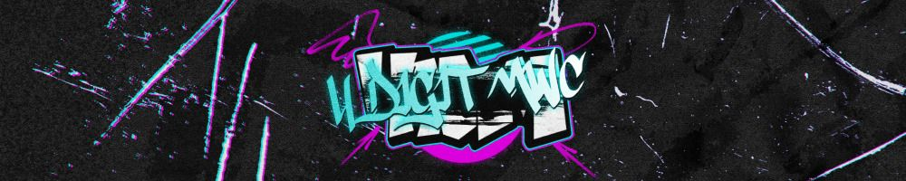

---
tags:
  - 4DM
  - 4DM24
  - 4DM2024
  - 4DMWC2024
---

# 4 Digit osu!mania World Cup 2024

The **4 Digit osu!mania World Cup 2024** (***4DM2024***) was a worldwide double-elimination 3v3 osu!mania 4-key tournament hosted by ::{ flag=NL }:: ::DannyPX::{ user=11253722 } and ::{ flag=AR }:: ::juankristal::{ user=443656 }. Only players ranked between #1,000 and #9,999 could participate. It was the sixth instalment of the 4 Digit osu!mania World Cup.

## Tournament schedule

| Event | Timestamp |
| --: | :-- |
| Registration phase | 2023-11-24/2023-12-16 |
| Screening phase | 2023-12-16/2023-12-24 |
| Team captain announcement | 2023-12-24 |
| Qualifiers | 2024-01-13/2024-01-14 |
| Round of 32 | 2024-01-20/2024-01-21 |
| Round of 16 | 2024-01-27/2024-01-28 |
| Quarterfinals | 2024-02-03/2024-02-04 |
| Semifinals | 2024-02-10/2024-02-11 |
| Finals | 2024-02-17/2024-02-18 |
| Grand Finals | 2024-02-24/2024-02-25 |

## Prizes

| Placing | Prize(s) |
| :-: | :-- |
|  | Unique profile badge, exclusive banner, 48% of the total prize pool |
|  | Exclusive banner, 32% of the total prize pool |
|  | Exclusive banner, 20% of the total prize pool |

## Organisation

The 4 Digit osu!mania World Cup 2024 was run by various community members.

| Position | Member(s) |
| :-- | :-- |
| Coordinator | ::{ flag=NL }:: ::DannyPX::{ user=11253722 }, ::{ flag=AR }:: ::juankristal::{ user=443656 } |
| Consultant | ::{ flag=NL }:: ::Albionthegreat::{ user=9853595 }, ::{ flag=ES }:: ::Quenlla::{ user=4725379 }, ::{ flag=SG }:: ::Polytetral::{ user=8612061 } |
| Mappool selector | ::{ flag=NL }:: ::DannyPX::{ user=11253722 }, ::{ flag=BR }:: ::DemiFiendSMT::{ user=20051971 }, ::{ flag=AR }:: ::juankristal::{ user=443656 }, ::{ flag=ES }:: ::Quenlla::{ user=4725379 } |
| Playtester | ::{ flag=ID }:: ::-Yubi-::{ user=17851478 }, ::{ flag=KR }:: ::\1GB\1SuddenDeath::{ user=6699923 }, ::{ flag=SG }:: ::awdse22::{ user=8743513 }, ::{ flag=FR }:: ::Darkmew2::{ user=13921965 }, ::{ flag=FR }:: ::Paturages::{ user=1375479 }, ::{ flag=US }:: ::SunApple::{ user=11817622 }, ::{ flag=NL }:: ::Toxic Scent::{ user=12599154 }, ::{ flag=CA }:: ::walmart5193::{ user=16468962 } |
| Mapper | ::{ flag=CN }:: ::\[GB\]Mafufu::{ user=10884561 }, ::{ flag=CN }:: ::\[GB\]Reisen::{ user=8586018 }, ::{ flag=US }:: ::\[GS\]Rose::{ user=9481266 }, ::{ flag=ES }:: ::Alen-::{ user=9552883 }, ::{ flag=CN }:: ::AlexDunk::{ user=9194799 }, ::{ flag=AU }:: ::AnatharaX::{ user=14390680 }, ::{ flag=BR }:: ::AutotelicBrown::{ user=4238941 }, ::{ flag=SG }:: ::awdse22::{ user=8743513 }, ::{ flag=FR }:: ::BlackyDay::{ user=5724831 }, ::{ flag=CN }:: ::Blue\1Potion::{ user=13094831 }, ::{ flag=US }:: ::chxu::{ user=13712190 }, ::{ flag=SG }:: ::Claren::{ user=9362562 }, ::{ flag=JP }:: ::CrewK::{ user=11488604 }, ::{ flag=NL }:: ::DannyPX::{ user=11253722 }, ::{ flag=PH }:: ::doctormango::{ user=13370527 }, ::{ flag=US }:: ::elexire::{ user=9206093 }, ::{ flag=US }:: ::ERA Imperial::{ user=5066305 }, ::{ flag=ID }:: ::FelixSpade::{ user=2651304 }, ::{ flag=AU }:: ::fvrex::{ user=11863699 }, ::{ flag=CN }:: ::Hylotl::{ user=18270260 }, ::{ flag=PH }:: ::Hytex::{ user=8536263 }, ::{ flag=SG }:: ::Japeynius::{ user=13993659 }, ::{ flag=AR }:: ::juankristal::{ user=443656 }, ::{ flag=US }:: ::KimMui::{ user=26090734 }, ::{ flag=ES }:: ::Kyrya::{ user=12459591 }, ::{ flag=RU }:: ::Lerck::{ user=10450696 }, ::{ flag=VN }:: ::Lott::{ user=13821222 }, ::{ flag=TH }:: ::\1Kiruru::{ user=17699745 }, ::{ flag=PH }:: ::mukotsuu::{ user=31043210 }, ::{ flag=TH }:: ::MyZterioN-::{ user=8521723 }, ::{ flag=SG }:: ::Neon-Hooray::{ user=24058560 }, ::{ flag=PH }:: ::notapplicable::{ user=7170536 }, ::{ flag=US }:: ::Orca-::{ user=7958845 }, ::{ flag=FR }:: ::Paturages::{ user=1375479 }, ::{ flag=US }:: ::Polarin::{ user=15104680 }, ::{ flag=NL }:: ::Promachos::{ user=14069486 }, ::{ flag=ES }:: ::RandomeLoL::{ user=7080063 }, ::{ flag=ID }:: ::Revv-::{ user=12424909 }, ::{ flag=TH }:: ::RuleBlazing::{ user=7312402 }, ::{ flag=NL }:: ::Saemitsu::{ user=14262789 }, ::{ flag=SG }:: ::TheFunk::{ user=13981991 }, ::{ flag=ID }:: ::Ucitysm::{ user=14768693 }, ::{ flag=CN }:: ::YuEast 2018::{ user=13953619 }, ::{ flag=HK }:: ::zero2snow::{ user=7751516 } |
| Referee | ::{ flag=CN }:: ::\[GB\]Mafufu::{ user=10884561 }, ::{ flag=CN }:: ::\[GB\]Reisen::{ user=8586018 }, ::{ flag=CN }:: ::\[GB\]Rush\1FTK::{ user=3046856 }, ::{ flag=US }:: ::Akace100::{ user=9308128 }, ::{ flag=NL }:: ::Albionthegreat::{ user=9853595 }, ::{ flag=MY }:: ::Auxesiaa::{ user=16417718 }, ::{ flag=NL }:: ::DannyPX::{ user=11253722 }, ::{ flag=US }:: ::EpsilonMaiagare::{ user=3855052 }, ::{ flag=PH }:: ::Gerwin13::{ user=15776185 }, ::{ flag=IT }:: ::Kiraz::{ user=3807675 }, ::{ flag=ID }:: ::Kurami\1San::{ user=8867495 }, ::{ flag=SE }:: ::Logg45vs::{ user=8684540 }, ::{ flag=VN }:: ::MashedPotato::{ user=10494860 }, ::{ flag=BE }:: ::Mortelspawn\1::{ user=5331420 }, ::{ flag=PH }:: ::Normiplier::{ user=10069850 }, ::{ flag=BR }:: ::Nukrid::{ user=2307484 }, ::{ flag=MY }:: ::Onlinee::{ user=13630137 }, ::{ flag=VN }:: ::Poity::{ user=17148657 }, ::{ flag=FR }:: ::Satsukel::{ user=9066390 }, ::{ flag=CN }:: ::shizehao::{ user=4928674 }, ::{ flag=PH }:: ::Silhoueska Elze::{ user=11517895 }, ::{ flag=US }:: ::SunApple::{ user=11817622 }, ::{ flag=DE }:: ::TheHunter1::{ user=6496016 }, ::{ flag=US }:: ::vleth::{ user=18556796 }, ::{ flag=CA }:: ::walmart5193::{ user=16468962 }, ::{ flag=US }:: ::Znow::{ user=15513303 } |
| Streamer | ::{ flag=CN }:: ::\[GB\]Rush\1FTK::{ user=3046856 }, ::{ flag=NL }:: ::Albionthegreat::{ user=9853595 }, ::{ flag=NL }:: ::DannyPX::{ user=11253722 }, ::{ flag=US }:: ::ethfan922::{ user=10402769 }, ::{ flag=US }:: ::EpsilonMaiagare::{ user=3855052 }, ::{ flag=SE }:: ::Logg45vs::{ user=8684540 }, ::{ flag=BE }:: ::Mortelspawn\1::{ user=5331420 }, ::{ flag=NL }:: ::NightNarumi::{ user=4381142 }, ::{ flag=US }:: ::SunApple::{ user=11817622 }, ::{ flag=CA }:: ::walmart5193::{ user=16468962 }, ::{ flag=US }:: ::Znow::{ user=15513303 } |
| Commentator | ::{ flag=IE }:: ::-Nightkore::{ user=26311862 }, ::{ flag=NL }:: ::Albionthegreat::{ user=9853595 }, ::{ flag=US }:: ::Dynascape::{ user=8784587 }, ::{ flag=SG }:: ::ERA Adam::{ user=12297375 }, ::{ flag=US }:: ::ERA Basil::{ user=7097990 }, ::{ flag=MY }:: ::Gumi Fumo::{ user=1626983 }, ::{ flag=PH }:: ::Itawachi::{ user=12929973 }, ::{ flag=AR }:: ::juankristal::{ user=443656 }, ::{ flag=PH }:: ::Lazereed::{ user=12894120 }, ::{ flag=VN }:: ::MashedPotato::{ user=10494860 }, ::{ flag=US }:: ::PorkIsGreat::{ user=10756322 }, ::{ flag=GB }:: ::Rageinater::{ user=23151496 }, ::{ flag=PH }:: ::Silhoueska Elze::{ user=11517895 }, ::{ flag=US }:: ::Sparky::{ user=3187959 }, ::{ flag=US }:: ::SunApple::{ user=11817622 }, ::{ flag=US }:: ::trooperr::{ user=32028459 }, ::{ flag=CA }:: ::walmart5193::{ user=16468962 }, ::{ flag=US }:: ::Znow::{ user=15513303 } |
| Designer | ::{ flag=NL }:: ::DannyPX::{ user=11253722 }, ::{ flag=VN }:: ::Lott::{ user=13821222 }, ::{ flag=SG }:: ::Polytetral::{ user=8612061 }, ::{ flag=NL }:: ::Promachos::{ user=14069486 }, ::{ flag=SG }:: ::TheFunk::{ user=13981991 } |
| Statistician | ::{ flag=NL }:: ::2fast::{ user=5183940 }, ::{ flag=NL }:: ::Albionthegreat::{ user=9853595 }, ::{ flag=TH }:: ::HowToPlayLN::{ user=10879600 }, ::{ flag=SG }:: ::Polytetral::{ user=8612061 } |
| Wiki writer | ::{ flag=NL }:: ::Albionthegreat::{ user=9853595 }, ::{ flag=ES }:: ::RandomeLoL::{ user=7080063 } |
| Pick'em manager | ::{ flag=NL }:: ::Albionthegreat::{ user=9853595 } |

## Links

- [Announcement post](https://osu.ppy.sh/home/news/2023-11-24-4dmwc-registrations-open)
- [Discussion thread](https://osu.ppy.sh/community/forums/topics/1848473)
- [4DM Discord server](https://discord.gg/W2MQ647)
- [4DM YouTube channel](https://www.youtube.com/channel/UC9mLxo8frxAJCf1vrASEFDg)
- [Livestream](https://www.twitch.tv/4digitmwc)
- [Pick'em predictions website](https://pickem.hwc.hr/tournaments/134)
- [Tournament bracket](https://challonge.com/4DM2024)
- Spreadsheets
  - **[Master](https://docs.google.com/spreadsheets/d/1y8w8SkP95VDyjqo4-APiCOBP27HcG3nIcKyb8Cqftk4)**
  - [Statistics](https://docs.google.com/spreadsheets/d/1Ro0kH2LwUZRBBbknN-xXaHD1gP0LbK558EE2gJLTWPo)

## Participants

|  | Country | Members |
| :-: | :-- | :-- |
| ::{ flag=AR }:: | **Argentina** | **::APRL03::{ user=11394892 }**, ::joako\1loco::{ user=13659177 }, ::monten505::{ user=21702734 }, ::Mateo12345::{ user=16481146 }, ::Iplaygames13::{ user=24253806 }, ::ElMancoDelSiglo::{ user=22447212 } |
| ::{ flag=AU }:: | **Australia** | **::PotassiumF::{ user=4247722 }**, ::HD\1AdreNaline::{ user=10540368 }, ::Orcanos::{ user=13762441 }, ::-Ainsel-::{ user=27855382 }, ::Jerold::{ user=18481219 }, ::-Willow-::{ user=11247298 } |
| ::{ flag=BR }:: | **Brazil** | **::Namirin-chan::{ user=6761832 }**, ::zKuri::{ user=25445118 }, ::MORDEST68::{ user=28527409 }, ::Villanovinho::{ user=29512763 }, ::1Nuttelinha1::{ user=13104856 }, ::soutin::{ user=11771029 } |
| ::{ flag=CA }:: | **Canada** | **::Holo the Wise::{ user=17036270 }**, ::CommandoBlack::{ user=7025841 }, ::Robert6400::{ user=11467559 }, ::twitch chat::{ user=12723207 }, ::dylan52528::{ user=13145344 }, ::Icetiger333::{ user=14461963 } |
|  | **Caribbean** | **::JordqnPlayz::{ user=11980833 }**, ::Suwano::{ user=16274535 }, ::TheBSGovernment::{ user=29575916 } |
| ::{ flag=CL }:: | **Chile** | **::NewMaxsue::{ user=16910603 }**, ::Shiny Sylveon::{ user=22813898 }, ::Hourou::{ user=12889871 }, ::Best Sanallite::{ user=23315931 }, ::Xxelectro196xX::{ user=24236733 }, ::THE BATH::{ user=10184587 } |
| ::{ flag=CN }:: | **China** | **::Llkkm::{ user=24989144 }**, ::Hitachimako0721::{ user=8883576 }, ::-fm777-::{ user=30122510 }, ::Kirchhoff123::{ user=29546640 }, ::7581Eason::{ user=23070586 }, ::\[ Classic \]::{ user=5858053 } |
| ::{ flag=CO }:: | **Colombia** | **::xSoiFan::{ user=13896159 }**, ::robertokpro::{ user=24237864 }, ::2kyFangirl::{ user=10442657 }, ::Juanormal::{ user=22975802 }, ::Xeibaa::{ user=30717006 } |
| ::{ flag=CZ }:: | **Czechia-Slovakia** | **::Kiruliatkoska::{ user=13013350 }**, ::144p\1uhd::{ user=19156437 }, ::Foxy007cz::{ user=17740440 }, ::TicTimeless::{ user=15142530 }, ::AlejarTV::{ user=12568571 } |
| ::{ flag=DK }:: | **Denmark** | **::ERA Urrk::{ user=11539225 }**, ::Haveaffald::{ user=12854716 }, ::Moofy::{ user=4151282 }, ::Cath::{ user=10202140 }, ::VirtualND::{ user=5352616 }, ::Fridi::{ user=15952677 } |
| ::{ flag=FI }:: | **Finland** | **::Crazzeh::{ user=5054154 }**, ::Leka::{ user=11408653 }, ::Tre::{ user=10024264 }, ::BanaaniMies32::{ user=12116540 }, ::lolguy132::{ user=4613613 }, ::ZOD3R::{ user=15673436 } |
| ::{ flag=FR }:: | **France** | **::Jerem\[Monkey\]::{ user=13431947 }**, ::- Stay -::{ user=19910862 }, ::\[RUE\]J K L::{ user=16518063 }, ::Simca\1::{ user=9718775 }, ::billiack::{ user=14013641 }, ::ssiizz\1::{ user=16487992 } |
| ::{ flag=DE }:: | **Germany** | **::ERA medium kek::{ user=11625617 }**, ::Crqstalized7::{ user=14131275 }, ::Blacku1::{ user=14160917 }, ::ERA Sirbeyy::{ user=12917829 }, ::Lotex09::{ user=14114899 }, ::Niko\1Plays::{ user=9409456 } |
| ::{ flag=GR }:: | **Greece** | **::-Puyu::{ user=10398348 }**, ::TreaKii::{ user=17665565 }, ::Demersio::{ user=30279494 }, ::\[FB\] Debris::{ user=34120247 } |
| ::{ flag=HK }:: | **Hong Kong** | **::pofnkul::{ user=23717210 }**, ::popy\1gd::{ user=30829023 }, ::\[Mom\] -So1-::{ user=18265431 }, ::\[Mom\] xbob::{ user=18481445 }, ::TheAo0402::{ user=16157387 }, ::ERDFS::{ user=28707779 } |
| ::{ flag=ID }:: | **Indonesia** | **::Reihynn::{ user=16630515 }**, ::danar mw::{ user=13859109 }, ::Rakanovan::{ user=10478980 }, ::Wishtynite::{ user=14217379 }, ::iSxga::{ user=15801261 }, ::nayuu::{ user=12561379 } |
| ::{ flag=IE }:: | **Ireland** | **::iParacosm::{ user=19466314 }**, ::MilkWatcher::{ user=13794811 }, ::-Nightkore::{ user=26311862 }, ::-uyetb-::{ user=22945300 }, ::Lumarium::{ user=20110813 }, ::-Scott::{ user=6246211 } |
| ::{ flag=IT }:: | **Italy** | **::\[SPNG\]Sib3riaN::{ user=17768545 }**, ::angela202133::{ user=27540621 }, ::antony88fayah::{ user=20656485 }, ::24Marzo::{ user=17952001 }, ::ricetoasty::{ user=15339833 } |
| ::{ flag=JP }:: | **Japan** | **::AxReo::{ user=10924058 }**, ::hashimoto1129::{ user=14832777 }, ::yoshyap::{ user=16608860 }, ::HyAn3355::{ user=19500985 }, ::rusk\1BT::{ user=6795897 }, ::faaaaas::{ user=28750311 } |
| ::{ flag=LV }:: | **Latvia** | **::Acc Main::{ user=18850111 }**, ::libertylad::{ user=10973296 }, ::arcis666::{ user=5936601 } |
| ::{ flag=MY }:: | **Malaysia** | **::StyGix::{ user=7745408 }**, ::YtAlbin0::{ user=21873512 }, ::Fuuneral::{ user=31042682 }, ::ReJust::{ user=20670028 }, ::JayLye::{ user=14892447 }, ::Evirir::{ user=8126553 } |
| ::{ flag=MX }:: | **Mexico** | **::Dex uwu::{ user=12084755 }**, ::happergamer::{ user=15513319 }, ::\[TK\]Martin\122::{ user=9653729 }, ::\[DT\] Lun1x::{ user=20578625 }, ::\[TK\]Mapxa::{ user=16078911 }, ::Sillot::{ user=29716889 } |
| ::{ flag=NL }:: | **Netherlands** | **::NightNarumi::{ user=4381142 }**, ::Polygone::{ user=22703533 }, ::Cube9112::{ user=20454338 }, ::Freek::{ user=9630674 }, ::onto199::{ user=18951819 }, ::samuelhklumpers::{ user=10945523 } |
| ::{ flag=NZ }:: | **New Zealand** | **::kit-::{ user=10981171 }**, ::Pakaponc::{ user=29531154 }, ::Arcie68805::{ user=31201579 } |
| ::{ flag=NI }:: | **Nicaragua** | **::RiRinST::{ user=17113003 }**, ::Kaxio6902::{ user=22524646 }, ::eeeduardo::{ user=31659272 }, ::KevinRJF::{ user=14309000 }, ::\_ZaFkieL\_::{ user=11372299 } |
| ::{ flag=PE }:: | **Peru** | **::ERA Xuste::{ user=17989444 }**, ::macacko::{ user=25112602 }, ::\[ Defuu- \]::{ user=25129861 }, ::cSamu::{ user=22630679 }, ::Sp3ctro::{ user=18344249 }, ::Piero \[GD\]::{ user=25265187 } |
| ::{ flag=PH }:: | **Philippines** | **::CuB-03::{ user=18560307 }**, ::Jarodpog::{ user=23604857 }, ::\[LS\]liadayo::{ user=26851935 }, ::Soir0116::{ user=13193798 }, ::\[LS\]Tenshi::{ user=18520056 }, ::\[KN\]Puddles::{ user=12123265 } |
| ::{ flag=PL }:: | **Poland** | **::Paraxia::{ user=14001000 }**, ::Hlimak::{ user=1340272 }, ::-Beajek-::{ user=12696546 }, ::SitekX::{ user=3840946 }, ::DaDarkDragon::{ user=8902097 }, ::Bexi::{ user=11548612 } |
| ::{ flag=RO }:: | **Romania** | **::Mich\1::{ user=11784492 }**, ::Bluestone413::{ user=17705451 }, ::SplatK::{ user=28168805 }, ::RteEz::{ user=15265534 }, ::Kiirbo::{ user=14985143 } |
| ::{ flag=RU }:: | **Russian Federation** | **::wolfpup08::{ user=11939641 }**, ::RobotHaKolecax::{ user=26702763 }, ::depny::{ user=25168820 }, ::DimonTheGood::{ user=19077203 }, ::kloofhi::{ user=29627572 } |
| ::{ flag=SG }:: | **Singapore** | **::Fallingtuna::{ user=19834488 }**, ::MrDabian::{ user=19660729 }, ::dolfin-\1::{ user=24531833 }, ::Pokeccino::{ user=18472374 }, ::Master193::{ user=16724650 }, ::megasheeper::{ user=21903060 } |
| ::{ flag=KR }:: | **South Korea** | **::Jumphand::{ user=9120753 }**, ::Scalar::{ user=12338676 }, ::4203::{ user=26007397 }, ::jangwook::{ user=12830719 }, ::tptplayer::{ user=10692507 } |
| ::{ flag=ES }:: | **Spain** | **::cartografiar::{ user=16118849 }**, ::Adrig3::{ user=15933630 }, ::Adr053::{ user=23517155 }, ::ERA Minikrimi::{ user=15186865 }, ::White Hare::{ user=19687112 }, ::\[AR\]lv3plane::{ user=15964029 } |
| ::{ flag=SE }:: | **Sweden** | **::NeonDrakon::{ user=6315000 }**, ::oliverq::{ user=14888056 }, ::Emik::{ user=3350987 }, ::diamondBIaze::{ user=10553827 }, ::Johnney101::{ user=11928361 }, ::Lotus779::{ user=17191390 } |
| ::{ flag=TW }:: | **Taiwan** | **::amano\1hina::{ user=19882148 }**, ::-Veloce-::{ user=23248427 }, ::diablorex1234::{ user=11912607 }, ::Shice2566::{ user=16191180 }, ::Hanson351::{ user=26888475 }, ::SaKuRaLaN::{ user=6193819 } |
| ::{ flag=TH }:: | **Thailand** | **::shokoha::{ user=14134289 }**, ::Phachon::{ user=20179559 }, ::\[GS\]Thanachot::{ user=23509758 }, ::Freshky::{ user=11959687 }, ::- Rinmoz -::{ user=16639144 }, ::basicmaime::{ user=6537441 } |
| ::{ flag=TR }:: | **Türkiye** | **::Zmor0133::{ user=6419257 }**, ::Ahmet\1Selman::{ user=27296956 }, ::hel0l::{ user=28554005 } |
| ::{ flag=GB }:: | **United Kingdom** | **::H1Pur::{ user=15756120 }**, ::CoolDudeYes::{ user=24780361 }, ::\[ will \]::{ user=17484397 }, ::--Dragon--::{ user=11924624 }, ::epic man 2::{ user=14566000 }, ::\_Squiddy\_::{ user=24227505 } |
| ::{ flag=US }:: | **United States** | **::Retina::{ user=11392859 }**, ::Tonels::{ user=15179858 }, ::ERA Basil::{ user=7097990 }, ::z2a::{ user=12542173 }, ::charlie72::{ user=14177626 }, ::- Sky -::{ user=15255368 } |
| ::{ flag=VE }:: | **Venezuela** | **::Edvo::{ user=8301758 }**, ::\[LS\]Fluzt::{ user=23402647 }, ::Konamp::{ user=27445750 }, ::TheM4fius::{ user=13944304 }, ::Frafrozc::{ user=1951426 }, ::Kangel::{ user=15197323 } |
| ::{ flag=VN }:: | **Vietnam** | **::\[LS\]Vixile::{ user=26233321 }**, ::\[LS\]Tokiyume::{ user=13219309 }, ::OrangeJuiceQT::{ user=24534466 }, ::SturpdaFuro::{ user=22644374 }, ::Rxizuna::{ user=16055641 }, ::TvS SorAKuN::{ user=11115041 } |

## Podium

This competition has come to an end and resulted in the following podium:

| Placing | Team |
| :-: | :-- |
|  | ::{ flag=VN }:: **Vietnam** (**::\[LS\]Vixile::{ user=26233321 }**, ::\[LS\]Tokiyume::{ user=13219309 }, ::OrangeJuiceQT::{ user=24534466 }, ::SturpdaFuro::{ user=22644374 }, ::Rxizuna::{ user=16055641 }, ::TvS SorAKuN::{ user=11115041 }) |
|  | ::{ flag=US }:: **United States** (**::Retina::{ user=11392859 }**, ::Tonels::{ user=15179858 }, ::ERA Basil::{ user=7097990 }, ::z2a::{ user=12542173 }, ::charlie72::{ user=14177626 }, ::- Sky -::{ user=15255368 }) |
|  | ::{ flag=TW }:: **Taiwan** (**::amano\1hina::{ user=19882148 }**, ::-Veloce-::{ user=23248427 }, ::diablorex1234::{ user=11912607 }, ::Shice2566::{ user=16191180 }, ::Hanson351::{ user=26888475 }, ::SaKuRaLaN::{ user=6193819 }) |

## Mappools

### Grand Finals

- Rice
  1. [Dan Terminus - Margaritifer (XeoStyle) \[Phobos\]](https://osu.ppy.sh/beatmapsets/747211#mania/1574526)
  2. [E-Type - Olympia (Hylotl) \[In a world of harmony (Cut) \[1.15x Rate\]\]](https://osu.ppy.sh/beatmapsets/2137650#mania/4498698)
  3. [matryoshka - Hallucinatory Halo (arai tasuku Remix) (MyZterioN-) \[lesion\]](https://osu.ppy.sh/beatmapsets/2137814#mania/4499082)
  4. [RoughSketch - System Doctor (Valedict) \[Hypernull\]](https://osu.ppy.sh/beatmapsets/2118195#mania/4448810)
  5. [Silentroom - Shuu no Hazama (Feraligatr) \[sombre (edit)\]](https://osu.ppy.sh/beatmapsets/1136849#mania/4486169)
  6. [technoplanet feat. Haruno - End of Fairytale (Nezu-) \[Extra 1.1x (EDIT)\]](https://osu.ppy.sh/beatmapsets/1884825#mania/4486091)
- Hybrid
  1. [Kai - Rebellion (Japeynius) \[Genesis of the END\]](https://osu.ppy.sh/beatmapsets/2137723#mania/4498884)
  2. [KURORAK - DOMINATOR (Polarin) \[F U R R Y  I N  B I O he/him, absolute sigma, DON'T MESS WITH ME (edit ft. Lott)\]](https://osu.ppy.sh/beatmapsets/2137903#mania/4499288)
  3. [sakuraburst - descent (doctormango) \[last laugh\]](https://osu.ppy.sh/beatmapsets/2137595#mania/4498582)
  4. [Akira Complex - SURVIVAL AT THE END OF THE UNIVERSE (TheFunk) \[Don't Stop, Keep It Moving;\]](https://osu.ppy.sh/beatmapsets/2137730#mania/4498901)
- LN
  1. [AAAA vs. penoreri - Recollect Lines (Saemitsu) \[Reminiscent Flashback | End of a Journey\]](https://osu.ppy.sh/beatmapsets/2137930#mania/4499374)
  2. [Noah - Trackless wilderness (Japeynius) \[Feral Onslaught\]](https://osu.ppy.sh/beatmapsets/2137724#mania/4498885)
  3. [Mono. - Susceptible (DannyPX) \[Influenced\]](https://osu.ppy.sh/beatmapsets/1889156#mania/3890770)
  4. [Guo MeiMei - My Darling (YuEast 2018) \[123456789\]](https://osu.ppy.sh/beatmapsets/2137692#mania/4498800)
  5. [Iyowa - Suisoh(Cover - Netsu Ijou (Heat abnormal) (ERA Imperial) \[Soliloquy (cut)\]](https://osu.ppy.sh/beatmapsets/2137913#mania/4499328)
  6. [JAKAZiD - Slaughta (lemonguy) \[chalLeNge x1.1\]](https://osu.ppy.sh/beatmapsets/1747998#mania/3575493)
- SV
  1. [l'avenir proche - Unraveling Stasis (awdse22) \[Vivid Discordance\]](https://osu.ppy.sh/beatmapsets/2137800#mania/4499058)
  2. [callasoiled - ARTIFICALIMAGE (Cut Ver.) (Paturages) \[WHAT IS NOT REAL CANNOT HURT YOU\]](https://osu.ppy.sh/beatmapsets/2137954#mania/4499441)
- Tiebreaker
  1. **[Dubstep 2 - Emotional Clap (DannyPX) \[Angry Birds\]](https://osu.ppy.sh/beatmapsets/2137962#mania/4499450)**

### Finals

- Rice
  1. [Blacklolita - Sound Alchemist (Halogen-) \[Corrupted Transformation\]](https://osu.ppy.sh/beatmapsets/1742466#mania/3562090)
  2. [Daisuke Ishiwatari - Awe of She (RandomeLoL) \[Duality\]](https://osu.ppy.sh/beatmapsets/2134246#mania/4490312)
  3. [TOOBOE - Melancholy (KimMui) \[Sorrow\]](https://osu.ppy.sh/beatmapsets/2134075#mania/4489869)
  4. [Taishi feat. Noriko Mitose - The Personalizer (ERA Imperial) \[Chain Your Heart (cut) 1.05x (145bpm)\]](https://osu.ppy.sh/beatmapsets/2134248#mania/4490314)
  5. [Her Bright Skies - The Glorious (Final Sketch Remix) (Shoegazer) \[Another 1.15x (299bpm)\]](https://osu.ppy.sh/beatmapsets/852660#mania/3553820)
  6. [CHARAN-PO-RANTAN - Ano Ko No Jinta (Vortex-) \[Dance 1.1x\]](https://osu.ppy.sh/beatmapsets/703414#mania/1488278)
- Hybrid
  1. [TAG - Astral Stranger (TheFunk) \[Stargazer 1.05x\]](https://osu.ppy.sh/beatmapsets/2133509#mania/4488247)
  2. [DJ Raisei - T.R.A.P. (Ryax) \[T.R.A.P.P.E.D.\]](https://osu.ppy.sh/beatmapsets/1894276#mania/3903621)
  3. [Akiri - Beyond Wood (ERA Imperial) \[Medium Density Fiber\]](https://osu.ppy.sh/beatmapsets/2134266#mania/4490359)
  4. [Rregula & Dementia x Smooth - Obfuscate (Billain Remix) (Abraxos) \[Disambiguation\]](https://osu.ppy.sh/beatmapsets/1185353#mania/2496420)
- LN
  1. [DJ Myosuke - Killing Rhythm (Raveille) \[Cessation\]](https://osu.ppy.sh/beatmapsets/1206127#mania/2511454)
  2. [II-L - VANGUARD-2 (Lott) \[MULTITUDES OF RHYTHMIC DISHEVELMENT\]](https://osu.ppy.sh/beatmapsets/2132945#mania/4486936)
  3. [D-D-Dice - World's end loneliness (full ver.) (FelixSpade) \[LN Prodigy // Solitary (cut)\]](https://osu.ppy.sh/beatmapsets/2132586#mania/4486061)
  4. [NIWASHI - Sono Emerald wo Miyo (Saemitsu) \[Brilliant Jewel\]](https://osu.ppy.sh/beatmapsets/2134296#mania/4490409)
  5. [Camellia - NEURO-CLOUD-9 (\[Crz\]Crysarlene) \[Neurotoxin\]](https://osu.ppy.sh/beatmapsets/1995244#mania/4146509)
  6. [USAO - Night Sky (Quenlla) \[YuEast's Night \[4DM 2024\]\]](https://osu.ppy.sh/beatmapsets/2134217#mania/4490269)
- SV
  1. [The Living Proof & Kaval - Solar Eclipse (BlackyDay) \[Blood Moon\]](https://osu.ppy.sh/beatmapsets/2134303#mania/4490421)
  2. [BlackY - VAZiLiSQ (notapplicable) \[Stasis\]](https://osu.ppy.sh/beatmapsets/2134226#mania/4490283)
- Tiebreaker
  1. **[ZxNX & Sot-C - 1KONOS (Saemitsu) \[PLANETO1D RAD1ATOR\]](https://osu.ppy.sh/beatmapsets/2134306#mania/4490430)**

### Semifinals

- Rice
  1. [hya - snake (Kyrya) \[Basilisk\]](https://osu.ppy.sh/beatmapsets/2130734#mania/4481181)
  2. [EXO-K - MAMA (Sped Up Ver.) (\[GB\]Reisen) \[No One Who Care About Me... x1.05\]](https://osu.ppy.sh/beatmapsets/2130561#mania/4480775)
  3. [mayumusi, SHAKABOOZ, FUNKYHIGEHANK - Magicrash Ice (CrewK) \[Easy\]](https://osu.ppy.sh/beatmapsets/2128990#mania/4476515)
  4. [Suue & Petboy - Meant To Be (Nightcore Mix) (Blue_Potion) \[Be Yourself\]](https://osu.ppy.sh/beatmapsets/2130736#mania/4481183)
  5. [Camellia - Wolves Standing Towards Enemies (11Bit) \[IshBosheth\]](https://osu.ppy.sh/beatmapsets/1660179#mania/3389167)
- Hybrid
  1. [JOYRYDE & Skrillex - AGEN WIDA (DannyPX) \[Nitro \[1.1x Rate\]\]](https://osu.ppy.sh/beatmapsets/1120583#mania/4481258)
  2. [litmus* - Rush-Hour (Claren) \[Traffic Congestion\]](https://osu.ppy.sh/beatmapsets/2130605#mania/4480889)
  3. [Kolaa - Ichirin (AlexDunk) \[Polaris.\]](https://osu.ppy.sh/beatmapsets/2130743#mania/4481214)
  4. [DIVELA feat. KomugiKiritani - VANTABLACK RAVER (arpia97) \[BLACKOUT x1.05\]](https://osu.ppy.sh/beatmapsets/1589952#mania/4236469)
- LN
  1. [ZxNX - FORTALiCE (Irone OSU) \[Irone & FolAH's Fortress\]](https://osu.ppy.sh/beatmapsets/2015919#mania/4196794)
  2. [Jeff Williams - Time to say Goodbye (feat. Casey Lee Williams) (juankristal) \[Team LNBY 2024\]](https://osu.ppy.sh/beatmapsets/524244#mania/4481255)
  3. [John Coltrane - Giant Steps (Davvy) \[Sheets of sound\]](https://osu.ppy.sh/beatmapsets/1592995#mania/3253520)
  4. [iconoclasm feat. GUMI - idola (_Kiruru) \[Reborn\]](https://osu.ppy.sh/beatmapsets/2129282#mania/4477318)
  5. [penoreri - Seiren ~Hisou no Tategoto~ (cherrychou) \[HEAVENLY\]](https://osu.ppy.sh/beatmapsets/1830480#mania/3757068)
- SV
  1. [ZAQUVA - Speculation (Orca-) \[Haphephobia\]](https://osu.ppy.sh/beatmapsets/2130505#mania/4480208)
  2. [Five Hammer - fffff (awdse22) \[sssssv\]](https://osu.ppy.sh/beatmapsets/2130598#mania/4480871)
- Tiebreaker
  1. **[Raphlesia - ResolvE -means to an end- (Japeynius) \[Endless Shutdown\]](https://osu.ppy.sh/beatmapsets/2130562#mania/4480781)**

### Quarterfinals

- Rice
  1. [Intervals - D.O.S.E. (feat. Saxl Rose) (Alptraum) \[cut ver without sax ohno\]](https://osu.ppy.sh/beatmapsets/2122798#mania/4460875)
  2. [TOOBOE - Chili Sauce (KimMui) \[sauce?\]](https://osu.ppy.sh/beatmapsets/2127160#mania/4471743)
  3. [Frums - one of none (Cut Ver.) (YunoMaya) \[contingency 1.1x (132bpm)\]](https://osu.ppy.sh/beatmapsets/1812007#mania/3716890)
  4. [Mr. Bill, kLL sMTH - Slamurai (DannyPX) \[Conceal \[1.05x Rate\] \[OD edit\]\]](https://osu.ppy.sh/beatmapsets/2127213#mania/4471816)
  5. [Kommisar - Mint Tango (RandomeLoL) \[Spring Scent\]](https://osu.ppy.sh/beatmapsets/2127073#mania/4471653)
- Hybrid
  1. [Polyphia - ABC (feat. Sophia Black) (nayeonie bunny) \[abcdefghijklmnopqrstuvwxyz\]](https://osu.ppy.sh/beatmapsets/2004631#mania/4168877)
  2. [KARUT - Oxygen Destroyer (Revv-) \[Asphyxiate\]](https://osu.ppy.sh/beatmapsets/2126961#mania/4471275)
  3. [Shadow Community - Restless Song (doctormango) \[Perennial\]](https://osu.ppy.sh/beatmapsets/2126848#mania/4471047)
  4. [Ardolf - lapse of memory (Ucitysm) \[oblivion\]](https://osu.ppy.sh/beatmapsets/2125631#mania/4467978)
- LN
  1. [Mili - world.execute(me); (juankristal) \[logkristal.execute(LN);\]](https://osu.ppy.sh/beatmapsets/2127212#mania/4471815)
  2. [Noisestorm - Barracuda (wolfyou) \[Torpedo\]](https://osu.ppy.sh/beatmapsets/2016927#mania/4199045)
  3. [sekai - Doctorine (Lott) \[live well, mr. "greatest" with your "perfect cure-all"!\]](https://osu.ppy.sh/beatmapsets/2126901#mania/4471161)
  4. [onoken - Viden (Guilhermeziat) \[another editation 1.05x\]](https://osu.ppy.sh/beatmapsets/1788533#mania/4212691)
  5. [Mono. - Tricolor Prizm*** (\[Crz\]FolAH1217) \[Refraction\]](https://osu.ppy.sh/beatmapsets/2036437#mania/4246904)
- SV
  1. [Frums - sing sing red indigo (AlexDunk) \[mundane loops;\]](https://osu.ppy.sh/beatmapsets/2127152#mania/4471723)
  2. [Haraguchi Sasuke - Hito Mania (\[GB\]Mafufu) \[osu!mania \[Mods: \[HR\]\]\]](https://osu.ppy.sh/beatmapsets/2127065#mania/4471537)
- Tiebreaker
  1. **[Frums - UMBRA, RADIOLOGOS. (Lott) \[\[ENTRY NUMBER SEVENTEEN :: DARKNESS PREVAILS\]\]](https://osu.ppy.sh/beatmapsets/2127200#mania/4471794)**

### Round of 16

- Rice
  1. [KARUT - Neo City Dive (Revv-) \[Utopia (edit)\]](https://osu.ppy.sh/beatmapsets/2123210#mania/4461899)
  2. [moyu - Show Me Your Love (DannyPX) \[Show Me Your Heart\]](https://osu.ppy.sh/beatmapsets/2123370#mania/4462358)
  3. [Pa's Lam System - City Lights Feat. EVO+ , Jinmenusagi (Pa's Lam System Remix) (elexire) \[Phosphorescent\]](https://osu.ppy.sh/beatmapsets/2123348#mania/4462321)
  4. [Marcioz - Mate Um Bonito Hoje Mesmo! (Disguise) \[who dares call it nostalgia\]](https://osu.ppy.sh/beatmapsets/2068181#mania/4416050)
  5. [Kanzaki Shion - Palette Lab (Extended) (DannyPX) \[-MysticEyes' Scarlet Another (cut)\]](https://osu.ppy.sh/beatmapsets/2123371#mania/4462360)
- Hybrid
  1. [lapix - Silvia (Azubeur) \[Another\]](https://osu.ppy.sh/beatmapsets/805336#mania/1690565)
  2. [t+pazolite & Punipuni denki - deja vu (Japeynius) \[Daydreamer\]](https://osu.ppy.sh/beatmapsets/2123122#mania/4461743)
  3. [MYUKKE. - BUNA*SYNERGY!!! (Muses) \[M \[1.1x Rate\]\]](https://osu.ppy.sh/beatmapsets/1398645#mania/2885985)
  4. [Hommarju - BEAST BASS BOMB (-MysticEyes) \[MAXIMUM\]](https://osu.ppy.sh/beatmapsets/929247#mania/1940816)
- LN
  1. [Sakuzyo - Amenohoakari (DannyPX) \[Raveille's Nokoribi (edit)\]](https://osu.ppy.sh/beatmapsets/2123372#mania/4462361)
  2. [Mili - String Theocracy (Her LN Mapper) \[Marionette\]](https://osu.ppy.sh/beatmapsets/2122479#mania/4460030)
  3. [R300K - Please (Alen-) \[nah\]](https://osu.ppy.sh/beatmapsets/2056808#mania/4462261)
  4. [xi - Beatrice (elexire) \[Apotheosis\]](https://osu.ppy.sh/beatmapsets/2123352#mania/4462331)
  5. [Nekomata Master - Scars of FAUNA (Raveille) \[Orchid\]](https://osu.ppy.sh/beatmapsets/846374#mania/1770185)
- SV
  1. [PSYQUI - Nervousness (Promachos) \[Stress-inducing\]](https://osu.ppy.sh/beatmapsets/2123339#mania/4462299)
  2. [ETIA. - Daisycutter (Claren) \[BLU-82 (SV)\]](https://osu.ppy.sh/beatmapsets/2123216#mania/4461920)
- Tiebreaker
  1. **[SiLiS - GAME MAKE OVER (Saemitsu) \[RETRO ANAMNESIS\]](https://osu.ppy.sh/beatmapsets/2123356#mania/4462335)**

### Round of 32

- Rice
  1. [nitro - kiss the sexy robot?? ultimate championship 201X!!! (Cut Ver.) (aeoliancarp) \[podium """finish"""""""\]](https://osu.ppy.sh/beatmapsets/1393640#mania/3275345)
  2. [ARAKI x nqrse x Meychan - Odo (Cut Ver.) (MocaLoca) \[K.O.\]](https://osu.ppy.sh/beatmapsets/1871561#mania/3850861)
  3. [Terminal 11 - The Bird's Midair Heatstroke (DannyPX) \[Mipha's Challenge\]](https://osu.ppy.sh/beatmapsets/2119591#mania/4452481)
  4. [MAX MAXIMIZER VS DJ TOTTO - Rebellio (Leniane) \[Stage 4: Chaos\]](https://osu.ppy.sh/beatmapsets/1151487#mania/2403563)
  5. [Yuyoyuppe - brbyjpusr2vip(o) (riktoi) \[Insane (edit)\]](https://osu.ppy.sh/beatmapsets/676323#mania/4432255)
- Hybrid
  1. [Schwank - Deimos (DannyPX) \[Insane\]](https://osu.ppy.sh/beatmapsets/1808053#mania/4022929)
  2. [Blacklolita - CyberConnect (Falcon) \[Expert\]](https://osu.ppy.sh/beatmapsets/1672894#mania/3417228)
- LN
  1. [Creo - Dark Tides (Alen-) \[lost\]](https://osu.ppy.sh/beatmapsets/2119509#mania/4452318)
  2. [Kurokotei feat. AKA - Belle de Nuit (Her LN Mapper) \[Se souvenir\]](https://osu.ppy.sh/beatmapsets/2119221#mania/4451576)
  3. [Tokisawa Nao - Analyze (Buschan) \[MX\]](https://osu.ppy.sh/beatmapsets/2101966#mania/4409645)
  4. [Kairiki Bear - Shippaisaku Shoujo \[inabakumori Remix\] (Ballistic) \[Forlorn\]](https://osu.ppy.sh/beatmapsets/1604016#mania/3334514)
  5. [Ado - Show (DannyPX) \[Ain't Nobody Stop\]](https://osu.ppy.sh/beatmapsets/2119593#mania/4452484)
- SV
  1. [Nor - Usagi Flap (Neon-Hooray) \[Orbital Rabbit SVrike\]](https://osu.ppy.sh/beatmapsets/2119450#mania/4452195)
  2. [Nor - Aoharu (Revv-) \[Miracles\]](https://osu.ppy.sh/beatmapsets/2119447#mania/4452191)
- Tiebreaker
  1. **[BrayanKitsn vs. burger ate pizza - plana stella achernar (Ucitysm) \[lux eridanus\]](https://osu.ppy.sh/beatmapsets/2119559#mania/4452403)**

### Qualifiers

1. [Metaroom - SPIRAL (RuleBlazing) \[Stage 1: Whirl\]](https://osu.ppy.sh/beatmapsets/2115576#mania/4442623)
2. [QWertism - Adrenaline Blaster (AutotelicBrown) \[Stage 2: Jacklet Blaster\]](https://osu.ppy.sh/beatmapsets/2115580#mania/4442633)
3. [JOYRYDE - IM GONE (DannyPX) \[Stage 3: TEMPO\]](https://osu.ppy.sh/beatmapsets/2115592#mania/4442673)
4. [KARUT - Spiral Rider (FelixSpade) \[Stage 4: Accelerator\]](https://osu.ppy.sh/beatmapsets/2115584#mania/4442648)
5. [niki feat. Reol - WAVE (juankristal) \[Stage 5: Sin\]](https://osu.ppy.sh/beatmapsets/2115589#mania/4442663)
6. [nitro - \[line:theta\] (elexire) \[Stage 6: Agathos\]](https://osu.ppy.sh/beatmapsets/2115585#mania/4442655)
7. [Alle-Star, Enkoded, lingoturbo & ZEEMEE - Hallucination (MyZterioN-) \[Stage 7: Phosphenes\]](https://osu.ppy.sh/beatmapsets/2115598#mania/4442684)

## Match results

### Grand Finals

Saturday, 24 February 2024:

| Team 1 |  |  | Team 2 | Match link |
| --: | :-: | :-: | :-- | :-- |
| Taiwan ::{ flag=TW }:: | 1 | **7** | ::{ flag=US }:: **United States** | [#1](https://osu.ppy.sh/community/matches/112800765) |

Sunday, 25 February 2024:

| Team 1 |  |  | Team 2 | Match link |
| --: | :-: | :-: | :-- | :-- |
| **Vietnam** ::{ flag=VN }:: | **7** | 1 | ::{ flag=US }:: United States | [#1](https://osu.ppy.sh/community/matches/112825045) |

### Finals

Saturday, 17 February 2024:

| Team 1 |  |  | Team 2 | Match link |
| --: | :-: | :-: | :-- | :-- |
| Malaysia ::{ flag=MY }:: | 4 | **7** | ::{ flag=US }:: **United States** | [#1](https://osu.ppy.sh/community/matches/112698662) |
| Philippines ::{ flag=PH }:: | 2 | **7** | ::{ flag=IT }:: **Italy** | [#1](https://osu.ppy.sh/community/matches/112704654) |

Sunday, 18 February 2024:

| Team 1 |  |  | Team 2 | Match link |
| --: | :-: | :-: | :-- | :-- |
| **Vietnam** ::{ flag=VN }:: | **7** | 3 | ::{ flag=TW }:: Taiwan | [#1](https://osu.ppy.sh/community/matches/112721424) |
| **United States** ::{ flag=US }:: | **7** | 0 | ::{ flag=IT }:: Italy | [#1](https://osu.ppy.sh/community/matches/112725909) |

### Semifinals

Saturday, 10 February 2024:

| Team 1 |  |  | Team 2 | Match link |
| --: | :-: | :-: | :-- | :-- |
| Canada ::{ flag=CA }:: | 1 | **6** | ::{ flag=ID }:: **Indonesia** | [#1](https://osu.ppy.sh/community/matches/112596915) |
| Malaysia ::{ flag=MY }:: | 3 | **6** | ::{ flag=TW }:: **Taiwan** | [#1](https://osu.ppy.sh/community/matches/112602561) |
| **China** ::{ flag=CN }:: | **6** | 2 | ::{ flag=BR }:: Brazil | [#1](https://osu.ppy.sh/community/matches/112603415) |
| **United States** ::{ flag=US }:: | **6** | 3 | ::{ flag=TH }:: Thailand | [#1](https://osu.ppy.sh/community/matches/112603397) |
| United Kingdom ::{ flag=GB }:: | 1 | **6** | ::{ flag=IT }:: **Italy** | [#1](https://osu.ppy.sh/community/matches/112606417) |

Sunday, 11 February 2024:

| Team 1 |  |  | Team 2 | Match link |
| --: | :-: | :-: | :-- | :-- |
| **Italy** ::{ flag=IT }:: | **6** | 5 | ::{ flag=ID }:: Indonesia | [#1](https://osu.ppy.sh/community/matches/112620235) |
| **Vietnam** ::{ flag=VN }:: | **6** | 1 | ::{ flag=PH }:: Philippines | [#1](https://osu.ppy.sh/community/matches/112620238) |
| **United States** ::{ flag=US }:: | **6** | 2 | ::{ flag=CN }:: China | [#1](https://osu.ppy.sh/community/matches/112622010) |

### Quarterfinals

Saturday, 3 February 2024:

| Team 1 |  |  | Team 2 | Match link |
| --: | :-: | :-: | :-- | :-- |
| **Indonesia** ::{ flag=ID }:: | **6** | 2 | ::{ flag=MX }:: Mexico | [#1](https://osu.ppy.sh/community/matches/112495854) |
| **Hong Kong** ::{ flag=HK }:: | **6** | 1 | ::{ flag=NL }:: Netherlands | [#1](https://osu.ppy.sh/community/matches/112499005) |
| **Japan** ::{ flag=JP }:: | **6** | 2 | ::{ flag=IE }:: Ireland | [#1](https://osu.ppy.sh/community/matches/112500995) |
| **Italy** ::{ flag=IT }:: | **6** | 0 | ::{ flag=RU }:: Russian Federation | [#1](https://osu.ppy.sh/community/matches/112501014) |
| **Taiwan** ::{ flag=TW }:: | **6** | 5 | ::{ flag=GB }:: United Kingdom | [#1](https://osu.ppy.sh/community/matches/112501929) |
| **Thailand** ::{ flag=TH }:: | **6** | 2 | ::{ flag=FR }:: France | [#1](https://osu.ppy.sh/community/matches/112502560) |
| **Germany** ::{ flag=DE }:: | **6** | 3 | ::{ flag=CL }:: Chile | [#1](https://osu.ppy.sh/community/matches/112507271) |
| Sweden ::{ flag=SE }:: | 4 | **6** | ::{ flag=BR }:: **Brazil** | [#1](https://osu.ppy.sh/community/matches/112507318) |
| Peru ::{ flag=PE }:: | 0 | **6** | ::{ flag=AR }:: **Argentina** | *win by default* |

Sunday, 4 February 2024:

| Team 1 |  |  | Team 2 | Match link |
| --: | :-: | :-: | :-- | :-- |
| United States ::{ flag=US }:: | 5 | **6** | ::{ flag=PH }:: **Philippines** | [#1](https://osu.ppy.sh/community/matches/112513890) |
| **Malaysia** ::{ flag=MY }:: | **6** | 3 | ::{ flag=CA }:: Canada | [#1](https://osu.ppy.sh/community/matches/112514871) |
| **Indonesia** ::{ flag=ID }:: | **6** | 0 | ::{ flag=JP }:: Japan | [#1](https://osu.ppy.sh/community/matches/112517791) |
| **Vietnam** ::{ flag=VN }:: | **6** | 1 | ::{ flag=CN }:: China | [#1](https://osu.ppy.sh/community/matches/112519987) |
| **Thailand** ::{ flag=TH }:: | **6** | 2 | ::{ flag=HK }:: Hong Kong | [#1](https://osu.ppy.sh/community/matches/112520390) |
| **Italy** ::{ flag=IT }:: | **6** | 2 | ::{ flag=AR }:: Argentina | [#1](https://osu.ppy.sh/community/matches/112523726) |
| **Brazil** ::{ flag=BR }:: | **6** | 5 | ::{ flag=DE }:: Germany | [#1](https://osu.ppy.sh/community/matches/112523526) |

### Round of 16

Friday, 26 January 2024:

| Team 1 |  |  | Team 2 | Match link |
| --: | :-: | :-: | :-- | :-- |
| Czechia-Slovakia ::{ flag=SK }:: | 1 | **6** | ::{ flag=FR }:: **France** | [#1](https://osu.ppy.sh/community/matches/112384742) |

Saturday, 27 January 2024:

| Team 1 |  |  | Team 2 | Match link |
| --: | :-: | :-: | :-- | :-- |
| **Vietnam** ::{ flag=VN }:: | **6** | 0 | ::{ flag=JP }:: Japan | [#1](https://osu.ppy.sh/community/matches/112394216) |
| **Taiwan** ::{ flag=TW }:: | **6** | 0 | ::{ flag=HK }:: Hong Kong | [#1](https://osu.ppy.sh/community/matches/112397680) |
| Thailand ::{ flag=TH }:: | 4 | **6** | ::{ flag=GB }:: **United Kingdom** | [#1](https://osu.ppy.sh/community/matches/112397565) |
| Colombia ::{ flag=CO }:: | 1 | **6** | ::{ flag=NL }:: **Netherlands** | [#1](https://osu.ppy.sh/community/matches/112399643) |
| **Ireland** ::{ flag=IE }:: | **6** | 4 | ::{ flag=RO }:: Romania | [#1](https://osu.ppy.sh/community/matches/112400190) |
| Spain ::{ flag=ES }:: | 5 | **6** | ::{ flag=BR }:: **Brazil** | [#1](https://osu.ppy.sh/community/matches/112402782) |
| Sweden ::{ flag=SE }:: | 4 | **6** | ::{ flag=CA }:: **Canada** | [#1](https://osu.ppy.sh/community/matches/112406218) |

Sunday, 28 January 2024:

| Team 1 |  |  | Team 2 | Match link |
| --: | :-: | :-: | :-- | :-- |
| **Chile** ::{ flag=CL }:: | **6** | 4 | ::{ flag=SG }:: Singapore | [#1](https://osu.ppy.sh/community/matches/112407728) |
| **United States** ::{ flag=US }:: | **6** | 0 | ::{ flag=PE }:: Peru | [#1](https://osu.ppy.sh/community/matches/112408288) |
| Australia ::{ flag=AU }:: | 4 | **6** | ::{ flag=MX }:: **Mexico** | [#1](https://osu.ppy.sh/community/matches/112409476) |
| **China** ::{ flag=CN }:: | **6** | 3 | ::{ flag=ID }:: Indonesia | [#1](https://osu.ppy.sh/community/matches/112413314) |
| Poland ::{ flag=PL }:: | 1 | **6** | ::{ flag=RU }:: **Russian Federation** | [#1](https://osu.ppy.sh/community/matches/112414520) |
| **Philippines** ::{ flag=PH }:: | **6** | 2 | ::{ flag=IT }:: Italy | [#1](https://osu.ppy.sh/community/matches/112415346) |
| South Korea ::{ flag=KR }:: | 4 | **6** | ::{ flag=AR }:: **Argentina** | [#1](https://osu.ppy.sh/community/matches/112416455) |
| **Malaysia** ::{ flag=MY }:: | **6** | 1 | ::{ flag=DE }:: Germany | [#1](https://osu.ppy.sh/community/matches/112417215) |

### Round of 32

Saturday, 20 January 2024:

| Team 1 |  |  | Team 2 | Match link |
| --: | :-: | :-: | :-- | :-- |
| **Malaysia** ::{ flag=MY }:: | **5** | 0 | ::{ flag=PL }:: Poland | [#1](https://osu.ppy.sh/community/matches/112291838) |
| **United Kingdom** ::{ flag=GB }:: | **5** | 1 | ::{ flag=RO }:: Romania | [#1](https://osu.ppy.sh/community/matches/112294965) |
| **Peru** ::{ flag=PE }:: | **5** | 4 | ::{ flag=BR }:: Brazil | [#1](https://osu.ppy.sh/community/matches/112298352) |
| **Canada** ::{ flag=CA }:: | **5** | 0 | ::{ flag=AR }:: Argentina | [#1](https://osu.ppy.sh/community/matches/112299286) |

Sunday, 21 January 2024:

| Team 1 |  |  | Team 2 | Match link |
| --: | :-: | :-: | :-- | :-- |
| **China** ::{ flag=CN }:: | **5** | 2 | ::{ flag=CO }:: Colombia | [#1](https://osu.ppy.sh/community/matches/112302612) |
| Mexico ::{ flag=MX }:: | 2 | **5** | ::{ flag=HK }:: **Hong Kong** | [#1](https://osu.ppy.sh/community/matches/112303112) |
| **Taiwan** ::{ flag=TW }:: | **5** | 0 | ::{ flag=AU }:: Australia | [#1](https://osu.ppy.sh/community/matches/112304764) |
| France ::{ flag=FR }:: | 4 | **5** | ::{ flag=JP }:: **Japan** | [#1](https://osu.ppy.sh/community/matches/112307159) |
| **Indonesia** ::{ flag=ID }:: | **5** | 1 | ::{ flag=NL }:: Netherlands | [#1](https://osu.ppy.sh/community/matches/112307296) |
| **Italy** ::{ flag=IT }:: | **5** | 0 | ::{ flag=SG }:: Singapore | [#1](https://osu.ppy.sh/community/matches/112307067) |
| Russian Federation ::{ flag=RU }:: | 2 | **5** | ::{ flag=DE }:: **Germany** | [#1](https://osu.ppy.sh/community/matches/112308017) |
| **Sweden** ::{ flag=SE }:: | **5** | 0 | ::{ flag=KR }:: South Korea | [#1](https://osu.ppy.sh/community/matches/112308021) |
| **Vietnam** ::{ flag=VN }:: | **5** | 1 | ::{ flag=SK }:: Czechia-Slovakia | [#1](https://osu.ppy.sh/community/matches/112308837) |
| **Philippines** ::{ flag=PH }:: | **5** | 0 | ::{ flag=CL }:: Chile | [#1](https://osu.ppy.sh/community/matches/112308789) |
| **Thailand** ::{ flag=TH }:: | **5** | 2 | ::{ flag=IE }:: Ireland | [#1](https://osu.ppy.sh/community/matches/112309962) |
| **United States** ::{ flag=US }:: | **5** | 0 | ::{ flag=ES }:: Spain | [#1](https://osu.ppy.sh/community/matches/112314958) |

### Qualifiers

- More detailed Qualifier results can be accessed via the [statistics spreadsheet](https://docs.google.com/spreadsheets/d/1Ro0kH2LwUZRBBbknN-xXaHD1gP0LbK558EE2gJLTWPo)
- Average rank was determined by `Σ(position earned when playing the Qualifiers mappool) / amount of maps played in the mappool`
- Ties in average rank were broken by total scores
- Only the top 32 teams proceeded to the brackets

| Seed | Team | Average rank |
| --: | :-- | --: |
| #1 | ::{ flag=VN }:: Vietnam | 2.86 |
| #2 | ::{ flag=MY }:: Malaysia | 5.86 |
| #3 | ::{ flag=TW }:: Taiwan | 7 |
| #4 | ::{ flag=US }:: United States | 7.43 |
| #5 | ::{ flag=PH }:: Philippines | 8 |
| #6 | ::{ flag=TH }:: Thailand | 8.71 |
| #7 | ::{ flag=SE }:: Sweden | 9.29 |
| #8 | ::{ flag=CN }:: China | 9.43 |
| #9 | ::{ flag=ID }:: Indonesia | 11.43 |
| #10 | ::{ flag=CA }:: Canada | 11.86 |
| #11 | ::{ flag=GB }:: United Kingdom | 12.57 |
| #12 | ::{ flag=IT }:: Italy | 12.86 |
| #13 | ::{ flag=PE }:: Peru | 12.86 |
| #14 | ::{ flag=MX }:: Mexico | 13.29 |
| #15 | ::{ flag=RU }:: Russian Federation | 14.29 |
| #16 | ::{ flag=FR }:: France | 14.43 |
| #17 | ::{ flag=JP }:: Japan | 16.29 |
| #18 | ::{ flag=DE }:: Germany | 16.86 |
| #19 | ::{ flag=HK }:: Hong Kong | 17.29 |
| #20 | ::{ flag=BR }:: Brazil | 17.43 |
| #21 | ::{ flag=SG }:: Singapore | 17.86 |
| #22 | ::{ flag=RO }:: Romania | 20.29 |
| #23 | ::{ flag=AR }:: Argentina | 24.14 |
| #24 | ::{ flag=NL }:: Netherlands | 24.14 |
| #25 | ::{ flag=CO }:: Colombia | 24.43 |
| #26 | ::{ flag=KR }:: South Korea | 25.29 |
| #27 | ::{ flag=IE }:: Ireland | 25.57 |
| #28 | ::{ flag=CL }:: Chile | 26.43 |
| #29 | ::{ flag=ES }:: Spain | 26.57 |
| #30 | ::{ flag=AU }:: Australia | 27.57 |
| #31 | ::{ flag=PL }:: Poland | 30.14 |
| #32 | ::{ flag=SK }:: Czechia-Slovakia | 30.86 |
| #33 | ::{ flag=DK }:: Denmark | 32.86 |
| #34 | ::{ flag=FI }:: Finland | 33.57 |
| #35 | ::{ flag=VE }:: Venezuela | 34.29 |
| #36 | ::{ flag=NI }:: Nicaragua | 35.29 |
| #37 | ::{ flag=CB }:: Caribbean | 35.86 |
| #38 | ::{ flag=GR }:: Greece | 37 |
| #39 | ::{ flag=LV }:: Latvia | 38.29 |
| #40 | ::{ flag=NZ }:: New Zealand | 39.57 |

## Ruleset

### Registration

1. In order to be eligible for this tournament, players must...
   1. ...be within the osu!mania 4-key rank range of #1,000 and #9,999 both when they submit their registration form and until the end of the registration phase.
   2. ...not have violated the [osu! community rules](/wiki/Rules) in the past 12 months.
   3. ...not exceed the global osu!mania rank of #250.
   4. ...not have been part of a former winning 4DM team. (4DM1 winners are excluded from this.)
   5. ...not appear on the [skillban list](https://docs.google.com/spreadsheets/d/1k3vgxupqwgiofD0KAK6c7R3k2t9ndzjFmlvQyUM7u5g).
2. To register for this tournament:
   1. Submit the [player registration form](http://4dm-registrations.dannypx.com/).
   2. Join the [4DM Discord server](https://discord.gg/W2MQ647). (Failure to join may result in disqualification.)

### Screening phase

1. The planned *unique profile badge* prize depends on 4DM2024's eligibility for [official tournament support](/wiki/Tournaments/Official_support). Players will be [screened](/wiki/Tournaments/Official_support#tournament-screening) by osu! staff and players found to be ineligible for tournament play will be denied entry. Consult [accounts@ppy.sh](mailto:accounts@ppy.sh) for appeals; if a failed screening result is retracted and a host is notified, the player will still be eligible for participation in the tournament.
2. A [skill-based restriction system](https://4digitmwc.github.io/skillban-articles) developed and maintained by ::{ flag=TH }:: ::HowToPlayLN::{ user=10879600 }, and ::{ flag=SG }:: ::Polytetral::{ user=8612061 } will be in effect in order to keep 4DM2024 fair to all players and as free of malicious sandbagging as possible. To see who is considered to be too skilled for the tournament by this system, see the [skillban list](https://docs.google.com/spreadsheets/d/1k3vgxupqwgiofD0KAK6c7R3k2t9ndzjFmlvQyUM7u5g). For more information on how the system works, please check the [GitHub repository](https://github.com/4digitmwc/skillbans-in-2024).
   - This list of players shown on the sheet is subject to change until it has been sent to osu! staff for review. Any player appearing on this list may not sign up for 4DM2024.

### Teams

1. Just like the official osu!mania World Cups, 4DM2024 will be a country-based team tournament.
   - The country flag displayed on the osu! profile determines which country a player may play for.
   - At the end of the registration and screening phases, a team captain will be picked by the hosts from each country's signup list based on tournament competency.
   - This team captain will pick the members to play alongside them on their country's team. The deadline for captains to submit their countries' teams is by January 5th at 23:59 UTC.
   - Teams will consist of a minimum of 3 members, and a maximum of 6 members per team.
2. If a country or territory is unable to field enough players to make a full team (a team consisting of 6 players) even if all eligible players from the country or territory sign up, they may be able to play for, or play with, other countries.
   - Players from dependent territories (as seen on their profile flag) may choose to play for the country they are dependent on. Refer to [this article](https://wikipedia.org/wiki/Dependent_territory#Lists_of_dependent_territories) for an overview of dependent territories.
   - Players from independent countries may join ranks with other independent countries, if and only if the other countries are also unable to field a full team, and if both countries lie in the same geographic region. e.g. they both lie in the Caribbean.

### Structure

#### Qualifiers

1. After teams are selected, the first weekend of tournament play will be the Qualifier stage in order to cut down to the top 32 teams that will advance into the Round of 32, as well as to rank said teams in approximate order of skill. There will be a total of seven different Qualifier maps **custom-made** by the map selection team, each meant to test a different skillset found in mappools throughout the tournament. These maps will be released approximately one week before the Qualifiers, and follow the structure below:
   - Stage 1: SV - Medium
   - Stage 2: Rice - Easy
   - Stage 3: Rice - Hard
   - Stage 4: Long Note - Medium
   - Stage 5: Long Note - Hard
   - Stage 6: Hybrid - Medium
   - Stage 7: Hybrid - Hard
2. Teams will be required to submit the order in which they would like to play the Qualifiers beforehand. All stages must appear twice in the order. Teams will then play through the Qualifier maps in the order submitted. The order may not be changed during the lobby. Teams will present three players to play each map (switching which three play between maps is allowed). Whichever team score was the highest per stage will be recorded. (For example, if a team scores 975,000, 975,000, 980,000 on one run and then 980,000, 985,000, 970,000 on the next run, the 2nd run will be the one recorded because the total team score was higher.)
3. Teams will be ranked based on the **score rating** of their Qualifier performances, meaning that each team's performances on the seven Qualifier maps will be compared against every other team. The ranks achieved are then summed together to form the score rating, where lower is better. Essentially, a team's Qualifier performance is ranked based on how well they perform compared to every other participating team.

#### Bracket stage

1. After the Qualifier stage, the remaining 32 teams will be placed into a double-elimination bracket in a predetermined order where the rank 1 player faces rank 32, rank 2 faces rank 31, etc.
2. Each stage has a different win condition and mappool size. Mappools will be released approximately one week prior to their respective stages. The details for it are as follows:

| Stage | Format | Mappool size |
| :-- | :-- | :-- |
| Round of 32 | Best of 9 | 14 FM, 1 TB |
| Round of 16 | Best of 11 | 16 FM, 1 TB |
| Quarterfinals | Best of 11 | 16 FM, 1 TB |
| Semifinals | Best of 11 | 16 FM, 1 TB |
| Finals | Best of 13 | 18 FM, 1 TB |
| Grand Finals | Best of 13 | 18 FM, 1 TB |

### Match procedures

::: alert-notice
**Notice**
Staff will attempt to closely follow the rules of [the most recent 4K osu!mania World Cup](/wiki/Tournaments/MWC/2023_4K).
:::

1. Team captains will be notified of their match via ping on Discord by the referee of their match 15 minutes before the match is scheduled to commence. At this time, team captains shall give the link of one map they wish to play as warmup to the referee of their match. This map must be an osu!mania 4K map and must be no longer than **4:00**. Referees may refuse a team's warmup and demand another one from the team captain if the map does not meet these guidelines or is found to be offensive. Failure to provide a warmup to the referee at this time may result in the team skipping their warmup map.
2. Team captains will be invited to their match lobby by a referee no less than **five minutes** before the match is scheduled to commence. In the time before the match, team captains will invite and gather their teams into the lobby.
3. When both team members have 3 members present in the lobby, the match will commence by each team playing their selected warmup.
4. After warmups, both team captains will `!roll` for the highest roll in the lobby chat. This will decide the order of protects, bans, and picks as laid out below:
   1. The roll **winner protects** one Free Mod map from being banned.
   2. The roll **loser protects** one Free Mod map from being banned.
   3. The roll **loser bans** one Free Mod map.
   4. The roll **winner bans** one Free Mod map.
   5. The roll **winner picks** one Free Mod map.
5. Once a team reaches half the required points to win the match (rounded up), the opposing team must ban another map from the pool.
6. Teams will be allowed 2 minutes to pick a beatmap and 2 minutes to press the `Ready` button on their client. If a team takes more time than allotted for either action, the procedures adopted will be as follows:
   - For the first occurrence:
     - The team will receive a verbal warning from the referee; in addition, the referee may opt to forcefully use the team's tactical timeout to allow for the team to pick.
   - On subsequent occurrences:
     - For a pick timer: a random map will be chosen from the mappool using `!roll X`, where X is the number of beatmaps that were neither picked nor banned, excluding the tiebreaker.
     - For a ready timer: the referee will issue the `!mp start 10` command, regardless of how many players from each team are present in the lobby, using `!mp kick` on any extra players for each team, starting from the top (i.e. the first valid player combination for each team will be forced to play the pick). The results for such games are to be taken as is.
     - Repeat offenders may receive further sanctions from the tournament management.
7. After each map concludes, the team with the highest team score on the map will be awarded one point. Picks will alternate between team captains until a winner is decided by being the first to get the required amount of points to win that round.
8. If both teams tie at match point, the tiebreaker map will be played, which determines the winner of the match.
9. Each team will receive one "tactical timeout" of 2 minutes, to be used as extra time to ban, protect, pick, or ready for a beatmap. *The tactical timeout is optional.*
10. If a tiebreaker gets played, both teams may use their tactical timeout, but only one timeout can be given.
11. Matches will be played with `Team VS` mode on ScoreV2.
12. The Red Team will occupy slots 1–3, and the Blue Team will occupy slots 4–6.
13. All maps will be played under Free Mod conditions. Allowed mods are No Fail, Hidden, Fade In, Flashlight, and Mirror
14. If a player disconnects during a match, their score is counted as a failed score. However, if this disconnect happens before 30 seconds of the map is played, the referee can decide to let the teams rematch. If this rematch happens, the rosters on both teams must stay the same unless the disconnected player cannot return to the lobby, in which case both teams are allowed to switch rosters.
15. Failed scores do not count towards a team's total score. However, a score that fails and then revives will still count. (Use No Fail if you believe you are in jeopardy of failing a map!)
16. If team scores are an exact tie at the conclusion of a map, the map will be replayed.
17. If a team cannot gather 3 members into the match lobby 10 minutes after the match's scheduled start time, the opposing team will be declared to win by default. If neither team can gather 3 members into the match lobby 10 minutes after the match's scheduled start time, the team with the higher seed out of Qualifiers will be declared to win by default.
18. If a player disconnects in the middle of a match and the team cannot provide a replacement, the match can be delayed by up to 10 minutes before a win by default is declared to the opposing team.
19. For additional rules left out of this section, please see the [Additional rules](#additional-rules) section below. As well, feel free to ask a host about any questions regarding rules or the tournament in general!

### Additional rules

1. The tournament hosts are responsible for scheduling all matches and informing players of when they are scheduled to play. If a team is unhappy with when they are scheduled by the hosts to play, they have the option to reschedule their match as late as the end of **Thursday of the week before the weekend** of their match. Instructions on how to do so will be provided in the Discord server.
2. Please note that while the organisers will try to schedule all matches for the best possible time for both teams, time zone conflicts may force some matches to occur in the early mornings or late nights.
3. If no referee is available to referee a match, the match will be postponed.
4. If no streamers are available to broadcast the match, the match will still occur without being broadcast.
5. If no commentators are available to commentate the match but broadcasters are available to broadcast the match, the match will still be broadcast but without commentary. Please note that organisers will try to broadcast every match possible.
6. Rescheduled matches will be prioritised under non-rescheduled matches in terms of being broadcast.
7. Each stage of the tournament is to be completed in a single weekend, using the same mappool for the entire weekend. Weekday matches are allowed if both team captains agree to them and they take place before the weekend of the scheduled stage. Mappools will be released roughly a week before the stage they are to be played on. The latest a map in a released mappool may be slightly updated (e.g. as to fixing a notable timing or snapping issue) is by **23:59 UTC of the Monday after the mappool is released**.
8. If one player on a team has their account restricted while still participating in the tournament for reasons of believed cheating, multi-accounting, or anything else, the player's entire team shall be disqualified from the tournament with no exceptions. Depending on the case, the team most recently defeated in a match by the newly disqualified team may be allowed to advance in this disqualified team's place. If this happens, the result of the former match will be voided.
9. Repeated and excessive toxic behavior toward any staff member, player, or spectator either in match multiplayer chatroom, the official Discord server, or the official Twitch channel chatroom is strictly prohibited and will lead to, in successive order with host's discretion to skip certain steps:
   1. Formal, documented warning.
   2. Timeout of player wherever necessary for a subjective amount of time (disallowing them from playing in tournament matches).
   3. Ban from the tournament as well as a ban from the official Discord server and Twitch channel.
