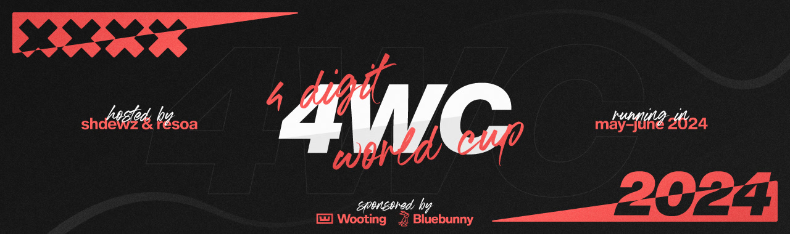

---
tags:
  - 4WC2024
  - 4WC
---

# 4 Digit World Cup 2024

The **4 Digit World Cup 2024** (***4WC2024***) was a 4v4, double-elimination, country-based osu! tournament hosted by ::{ flag=DE }:: [resoa](https://osu.ppy.sh/users/6754508) and ::{ flag=FI }:: [shdewz](https://osu.ppy.sh/users/10000899). It was the sixth instalment of the 4 Digit World Cup.

## Tournament schedule

| Event | Timestamp |
| --: | :-- |
| Registration phase | 2024-03-21/2024-04-13 (23:59 UTC) |
| Team submission phase | 2024-04-14/2024-04-20 (23:59 UTC) |
| Qualifier showcase | 2024-04-28 |
| Qualifier stage | 2024-05-04/2024-05-05 |
| Round of 32 | 2024-05-11/2024-05-12 |
| Round of 16 | 2024-05-18/2024-05-19 |
| Quarterfinals | 2024-05-25/2024-05-26 |
| Semifinals | 2024-06-01/2024-06-02 |
| Finals | 2024-06-08/2024-06-09 |
| Grand Finals | 2024-06-15/2024-06-16 |

## Prizes

The 4 Digit World Cup 2024 awarded winners with a [community-funded prize pool on Open Collective](https://opencollective.com/4wc).

| Placing | Prize(s) |
| :-: | :-- |
|  | Wooting UwU (non-RGB) keyboard and Bluebunny tablet cover for each player, 40% of the prize pool, profile badge (pending), animated profile banner |
|  | 40% of the prize pool, animated profile banner |
|  | 20% of the prize pool, animated profile banner |

## Organisation

The 4 Digit World Cup 2024 was run by various community members.

| Position | Member(s) |
| :-- | :-- |
| Host | ::{ flag=DE }:: [resoa](https://osu.ppy.sh/users/6754508), ::{ flag=FI }:: [shdewz](https://osu.ppy.sh/users/10000899) |
| Designer and developer | ::{ flag=FI }:: [shdewz](https://osu.ppy.sh/users/10000899) |
| Mappool Playtester | ::{ flag=RU }:: [_wonderer](https://osu.ppy.sh/users/8215374), ::{ flag=US }:: [-Arko](https://osu.ppy.sh/users/8802914), ::{ flag=DE }:: [-semi](https://osu.ppy.sh/users/5154946), ::{ flag=PL }:: [cezgru](https://osu.ppy.sh/users/2629617), ::{ flag=US }:: [ChillierPear](https://osu.ppy.sh/users/9501251), ::{ flag=US }:: [conradmittn](https://osu.ppy.sh/users/8208289), ::{ flag=CA }:: [El Condor Pasa](https://osu.ppy.sh/users/4415285), ::{ flag=RU }:: [Endura](https://osu.ppy.sh/users/7774197), ::{ flag=PH }:: [enri](https://osu.ppy.sh/users/8640970), ::{ flag=US }:: [EthantrixV2](https://osu.ppy.sh/users/10634348), ::{ flag=DE }:: [Ezius](https://osu.ppy.sh/users/1861823), ::{ flag=CN }:: [FcEazy](https://osu.ppy.sh/users/7825227), ::{ flag=US }:: [Flameztear](https://osu.ppy.sh/users/13207763), ::{ flag=ES }:: [GATmoneyTJ1994](https://osu.ppy.sh/users/6735738), ::{ flag=CA }:: [GENDER BENDER](https://osu.ppy.sh/users/2758279), ::{ flag=US }:: [Jakson](https://osu.ppy.sh/users/8788058), ::{ flag=PL }:: [kiir0chii](https://osu.ppy.sh/users/9322480), ::{ flag=KR }:: [Lujeol](https://osu.ppy.sh/users/14447878), ::{ flag=US }:: [M I L E S](https://osu.ppy.sh/users/6036351), ::{ flag=GB }:: [Malteser](https://osu.ppy.sh/users/5218178), ::{ flag=ES }:: [MeiFTW](https://osu.ppy.sh/users/15049805), ::{ flag=US }:: [Mejir0 McQueen](https://osu.ppy.sh/users/12522447), ::{ flag=RO }:: [nanoya](https://osu.ppy.sh/users/12366071), ::{ flag=FI }:: [Nev-](https://osu.ppy.sh/users/11836334), ::{ flag=NO }:: [ninerik](https://osu.ppy.sh/users/10549880), ::{ flag=CA }:: [pretty girl](https://osu.ppy.sh/users/11684952), ::{ flag=MN }:: [seegii](https://osu.ppy.sh/users/4659319), ::{ flag=FI }:: [shdewz](https://osu.ppy.sh/users/10000899), ::{ flag=US }:: [Sheldon C](https://osu.ppy.sh/users/10322186), ::{ flag=CA }:: [Too Slow](https://osu.ppy.sh/users/2944449), ::{ flag=PL }:: [Tutka](https://osu.ppy.sh/users/8170022), ::{ flag=CA }:: [Vespirit](https://osu.ppy.sh/users/5425046), ::{ flag=KR }:: [worst hr player](https://osu.ppy.sh/users/14106450), ::{ flag=DE }:: [ZeitFrost](https://osu.ppy.sh/users/11234706) |
| Streamer | ::{ flag=CA }:: [D I O](https://osu.ppy.sh/users/3958619), ::{ flag=VN }:: [Hoaq](https://osu.ppy.sh/users/7696512), ::{ flag=GB }:: [ilw8](https://osu.ppy.sh/users/14167692), ::{ flag=CA }:: [kymotsujason](https://osu.ppy.sh/users/2541804), ::{ flag=US }:: [ROB_](https://osu.ppy.sh/users/12455868), ::{ flag=FI }:: [shdewz](https://osu.ppy.sh/users/10000899), ::{ flag=VN }:: [SIay](https://osu.ppy.sh/users/9587896), ::{ flag=US }:: [this1neguy](https://osu.ppy.sh/users/1797189) |
| Commentator | ::{ flag=BR }:: [-felicia](https://osu.ppy.sh/users/10157694), ::{ flag=DE }:: [-semi](https://osu.ppy.sh/users/5154946), ::{ flag=FI }:: [Amasetic](https://osu.ppy.sh/users/11375251), ::{ flag=US }:: [ampy](https://osu.ppy.sh/users/4458239), ::{ flag=ID }:: [BlankTap](https://osu.ppy.sh/users/10137131), ::{ flag=US }:: [ChillierPear](https://osu.ppy.sh/users/9501251), ::{ flag=CA }:: [D I O](https://osu.ppy.sh/users/3958619), ::{ flag=GB }:: [Damarsh](https://osu.ppy.sh/users/7465147), ::{ flag=AT }:: [extrasensory](https://osu.ppy.sh/users/5841333), ::{ flag=US }:: [hubbawubba](https://osu.ppy.sh/users/15910288), ::{ flag=CA }:: [I-Flame](https://osu.ppy.sh/users/11257542), ::{ flag=US }:: [M I L E S](https://osu.ppy.sh/users/6036351), ::{ flag=AU }:: [Mavs](https://osu.ppy.sh/users/11076938), ::{ flag=FI }:: [Nev-](https://osu.ppy.sh/users/11836334), ::{ flag=DE }:: [resoa](https://osu.ppy.sh/users/6754508), ::{ flag=GB }:: [SadShiba](https://osu.ppy.sh/users/10747626), ::{ flag=US }:: [Suicune3](https://osu.ppy.sh/users/6895187), ::{ flag=US }:: [this1neguy](https://osu.ppy.sh/users/1797189), ::{ flag=US }:: [Tycani](https://osu.ppy.sh/users/6693266), ::{ flag=AU }:: [Vordi](https://osu.ppy.sh/users/6659116) |
| Referee | ::{ flag=PH }:: [-PeKoRa-](https://osu.ppy.sh/users/17959882), ::{ flag=US }:: [[K]](https://osu.ppy.sh/users/16551387), ::{ flag=FI }:: [Aetherian](https://osu.ppy.sh/users/6263040), ::{ flag=NZ }:: [cyndrean](https://osu.ppy.sh/users/12872893), ::{ flag=KR }:: [Discord](https://osu.ppy.sh/users/16194858), ::{ flag=DE }:: [Dragoncurve](https://osu.ppy.sh/users/6675367), ::{ flag=DE }:: [Elzix](https://osu.ppy.sh/users/4990127), ::{ flag=US }:: [freddiiieeee](https://osu.ppy.sh/users/7112839), ::{ flag=BR }:: [LeoFLT](https://osu.ppy.sh/users/3668779), ::{ flag=SK }:: [Mavosiik](https://osu.ppy.sh/users/18927594), ::{ flag=NL }:: [nik](https://osu.ppy.sh/users/10077264), ::{ flag=PL }:: [P a t r i c k](https://osu.ppy.sh/users/6814521), ::{ flag=RU }:: [Rainbowtaves](https://osu.ppy.sh/users/10079847), ::{ flag=DE }:: [resoa](https://osu.ppy.sh/users/6754508), ::{ flag=US }:: [ROB_](https://osu.ppy.sh/users/12455868), ::{ flag=HK }:: [ShadeCegLgMn](https://osu.ppy.sh/users/12609866), ::{ flag=FI }:: [shdewz](https://osu.ppy.sh/users/10000899), ::{ flag=IN }:: [Speshimen](https://osu.ppy.sh/users/7720204), ::{ flag=GB }:: [SSScotty](https://osu.ppy.sh/users/10319851), ::{ flag=US }:: [Suicune3](https://osu.ppy.sh/users/6895187), ::{ flag=US }:: [vleth](https://osu.ppy.sh/users/18556796), ::{ flag=GB }:: [Yazzehh](https://osu.ppy.sh/users/7068973) |

## Links

- [Discussion thread](https://osu.ppy.sh/community/forums/topics/1898593)
- [Livestream](https://twitch.tv/4wcb)
- [Information spreadsheet](https://docs.google.com/spreadsheets/d/1gPRSI1lTW8ZMlu_1mnxpVcZyzO2Atbb_2H5nfDt0CXM)
- [Weekly statistics spreadsheets](https://drive.google.com/drive/u/0/folders/1dvBabKdU7V1nx1wEMhINi89NSdBvDU5f)
- [Challonge bracket](https://challonge.com/4wc24)
- [Discord server](https://discord.com/invite/uQarcRtB3u)

## Participants

|  | Country | Members |
| :-: | :-: | :-- |
| ::{ flag=AR }:: | **Argentina** | **[Kagami](https://osu.ppy.sh/users/10459580)**, [AlexKito](https://osu.ppy.sh/users/12902737), [Amuro](https://osu.ppy.sh/users/7119659), [FD3S 13B-REW](https://osu.ppy.sh/users/12301126), [juliancala](https://osu.ppy.sh/users/3272902), [Kaoshii](https://osu.ppy.sh/users/7807935), [SlowBurn](https://osu.ppy.sh/users/3608846), [viciobylike](https://osu.ppy.sh/users/18922516) |
| ::{ flag=AU }:: | **Australia** | **[oslash](https://osu.ppy.sh/users/13228917)**, [JGLF](https://osu.ppy.sh/users/10665363), [palr](https://osu.ppy.sh/users/15429006), [xtremeities](https://osu.ppy.sh/users/10759664), [Dumb-Andy](https://osu.ppy.sh/users/20963631), [-sephy](https://osu.ppy.sh/users/11380644), [bromothymolblue](https://osu.ppy.sh/users/10302933), [Delchoran](https://osu.ppy.sh/users/8530809) |
| ::{ flag=AT }:: | **Austria** | **[awhi](https://osu.ppy.sh/users/21285251)**, [Deshoou](https://osu.ppy.sh/users/21753287), [Tuffy](https://osu.ppy.sh/users/12807415), [\[ Neon \]](https://osu.ppy.sh/users/2583259), [rixope](https://osu.ppy.sh/users/9468744), [gadse](https://osu.ppy.sh/users/1009285), [punjabi\_gaming](https://osu.ppy.sh/users/18024782), [-Toketsu](https://osu.ppy.sh/users/17709282) |
| ::{ flag=BY }:: | **Belarus** | **[KortezR](https://osu.ppy.sh/users/6433474)**, [anmear](https://osu.ppy.sh/users/25927812), [c1a0](https://osu.ppy.sh/users/7054373), [Cafenoo](https://osu.ppy.sh/users/10270238), [LoPij](https://osu.ppy.sh/users/6892711), [Nuwo](https://osu.ppy.sh/users/15406353), [Tepe6oHbka](https://osu.ppy.sh/users/17604898), [Yuuka](https://osu.ppy.sh/users/14220975) |
| ::{ flag=BE }:: | **Belgium** | **[Hanori](https://osu.ppy.sh/users/7078544)**, [Loriax](https://osu.ppy.sh/users/11331829), [Mornis](https://osu.ppy.sh/users/6479616), [Meersu](https://osu.ppy.sh/users/6311605), [5joshi](https://osu.ppy.sh/users/4279650), [uyaz](https://osu.ppy.sh/users/13717099), [Fblade](https://osu.ppy.sh/users/3168085), [Vinnie](https://osu.ppy.sh/users/8509247) |
| ::{ flag=BR }:: | **Brazil** | **[Daf0nz](https://osu.ppy.sh/users/14592820)**, [kagiura](https://osu.ppy.sh/users/11461810), [Lirumin](https://osu.ppy.sh/users/15274893), [revoken](https://osu.ppy.sh/users/15251627), [Lineu](https://osu.ppy.sh/users/17192419), [Aphrodi](https://osu.ppy.sh/users/12714574), [RafaelXDP](https://osu.ppy.sh/users/11984937), [Uchirrod](https://osu.ppy.sh/users/11472811) |
| ::{ flag=CA }:: | **Canada** | **[Yip](https://osu.ppy.sh/users/5177569)**, [CutPaper](https://osu.ppy.sh/users/10975777), [Jimarrah](https://osu.ppy.sh/users/11267857), [Birchman](https://osu.ppy.sh/users/10676573), [tan-](https://osu.ppy.sh/users/6283858), [Zucchiniii](https://osu.ppy.sh/users/13959253), [DarkKarate](https://osu.ppy.sh/users/8666950), [nanawo](https://osu.ppy.sh/users/5426640) |
| ::{ flag=CL }:: | **Chile** | **[Siiphs](https://osu.ppy.sh/users/11786864)**, [Jyuifty](https://osu.ppy.sh/users/3595282), [6Nusu9](https://osu.ppy.sh/users/20501126), [Pancho](https://osu.ppy.sh/users/11305398), [NO37](https://osu.ppy.sh/users/4653583), [Rinyeki](https://osu.ppy.sh/users/13249394), [xXChokgamerXx](https://osu.ppy.sh/users/7748891), [Hellbeak](https://osu.ppy.sh/users/2367495) |
| ::{ flag=CN }:: | **China** | **[lolol235](https://osu.ppy.sh/users/6090175)**, [z980838928](https://osu.ppy.sh/users/1355695), [Dwagon](https://osu.ppy.sh/users/9975427), [Dsan](https://osu.ppy.sh/users/1266166), [SurvivorX4](https://osu.ppy.sh/users/12585048), [jj986544591](https://osu.ppy.sh/users/2917990), [\[Crz\]xz1z1z](https://osu.ppy.sh/users/10500832), [\[Crz\]Makii](https://osu.ppy.sh/users/5242158) |
| ::{ flag=CO }:: | **Colombia** | **[Carlosflow](https://osu.ppy.sh/users/11940767)**, [Goold](https://osu.ppy.sh/users/13744487), [Okinari](https://osu.ppy.sh/users/18373966), [Ither](https://osu.ppy.sh/users/17117482), [gato hongo](https://osu.ppy.sh/users/11068425), [Schwarze](https://osu.ppy.sh/users/12502593), [Phel](https://osu.ppy.sh/users/9367683), [Bae Joohyun](https://osu.ppy.sh/users/11037250) |
| ::{ flag=HR }:: | **Croatia** | **[KarliXon](https://osu.ppy.sh/users/9283403)**, [The Fart Lord](https://osu.ppy.sh/users/7912447), [DragonCroc](https://osu.ppy.sh/users/4334103), [nettspend](https://osu.ppy.sh/users/13330123), [cempresi](https://osu.ppy.sh/users/14898728), [-Milky](https://osu.ppy.sh/users/8541186), [Suki](https://osu.ppy.sh/users/7289538), [-Milfy](https://osu.ppy.sh/users/11013016) |
| ::{ flag=CZ }:: | **Czechia** | **[zabloink](https://osu.ppy.sh/users/4605548)**, [fisskill](https://osu.ppy.sh/users/15247939), [Dri3x](https://osu.ppy.sh/users/11478426), [Domass](https://osu.ppy.sh/users/19359793), [-\[ YasuoMain \]-](https://osu.ppy.sh/users/15270835), [Umatza](https://osu.ppy.sh/users/8211461), [synf](https://osu.ppy.sh/users/3123488), [Adam Cadillac](https://osu.ppy.sh/users/9523358) |
| ::{ flag=DK }:: | **Denmark** | **[Polle](https://osu.ppy.sh/users/13218204)**, [cat burger](https://osu.ppy.sh/users/11380904), [thebeastjona](https://osu.ppy.sh/users/13452017), [xbox dog](https://osu.ppy.sh/users/11547643), [Zeezus](https://osu.ppy.sh/users/9125328), [Malach](https://osu.ppy.sh/users/9364696), [Vandabe](https://osu.ppy.sh/users/7050754), [Redzy](https://osu.ppy.sh/users/9732417) |
| ::{ flag=EE }:: | **Estonia** | **[Ancenthe](https://osu.ppy.sh/users/4479041)**, [slepingcookiegi](https://osu.ppy.sh/users/19911567), [riot1133](https://osu.ppy.sh/users/11877992), [Slay](https://osu.ppy.sh/users/7093124), [TommeX](https://osu.ppy.sh/users/15860861) |
| ::{ flag=FI }:: | **Finland** | **[Amasetic](https://osu.ppy.sh/users/11375251)**, [Sampo](https://osu.ppy.sh/users/7503114), [nemq](https://osu.ppy.sh/users/11644972), [Tabletti](https://osu.ppy.sh/users/9523661), [Kalanluu](https://osu.ppy.sh/users/2035254), [miyuo](https://osu.ppy.sh/users/15242810), [yupyep](https://osu.ppy.sh/users/12031584), [apisedo](https://osu.ppy.sh/users/11048151) |
| ::{ flag=FR }:: | **France** | **[Fiaee](https://osu.ppy.sh/users/10325072)**, [CharleLee](https://osu.ppy.sh/users/10434787), [calangi](https://osu.ppy.sh/users/7810180), [Lexonox](https://osu.ppy.sh/users/7640581), [-Atour-](https://osu.ppy.sh/users/11245184), [MyzeJD](https://osu.ppy.sh/users/3257847), [Qumania](https://osu.ppy.sh/users/17467899), [Biroche](https://osu.ppy.sh/users/11285958) |
| ::{ flag=GE }:: | **Georgia** | **[Andria2004](https://osu.ppy.sh/users/7224935)**, [dandura](https://osu.ppy.sh/users/19785709), [javier antonio](https://osu.ppy.sh/users/14252070), [n o v a h](https://osu.ppy.sh/users/18153031), [Deadline](https://osu.ppy.sh/users/5783393), [nawhbody](https://osu.ppy.sh/users/20656091), [DarkFTW](https://osu.ppy.sh/users/14350221) |
| ::{ flag=DE }:: | **Germany** | **[iFakeRz](https://osu.ppy.sh/users/5281485)**, [-lion](https://osu.ppy.sh/users/24270105), [Blad\_D](https://osu.ppy.sh/users/12988448), [Th1](https://osu.ppy.sh/users/15441612), [jaaysfa](https://osu.ppy.sh/users/8508931), [Shiragi](https://osu.ppy.sh/users/8788898), [Hixia](https://osu.ppy.sh/users/6263574), [Kichou](https://osu.ppy.sh/users/11393715) |
| ::{ flag=GR }:: | **Greece** | **[awesomemacD](https://osu.ppy.sh/users/5589933)**, [Tsokoz](https://osu.ppy.sh/users/4512984), [Leftie](https://osu.ppy.sh/users/3423454), [trushpack](https://osu.ppy.sh/users/9498428), [HR sketos](https://osu.ppy.sh/users/3478000), [Knee Cutter](https://osu.ppy.sh/users/14373390) |
| ::{ flag=HK }:: | **Hong Kong** | **[Hibiki](https://osu.ppy.sh/users/5413624)**, [tezi](https://osu.ppy.sh/users/20988374), [flyond](https://osu.ppy.sh/users/17663666), [Shima Rin Dango](https://osu.ppy.sh/users/13510394), [Laplus Darkness](https://osu.ppy.sh/users/12585858), [stllok](https://osu.ppy.sh/users/14817468), [Wanderio](https://osu.ppy.sh/users/16529875), [pedeko](https://osu.ppy.sh/users/8645133) |
| ::{ flag=HU }:: | **Hungary** | **[glass2wave7](https://osu.ppy.sh/users/5442931)**, [gecseboti](https://osu.ppy.sh/users/15213139), [Tashigi](https://osu.ppy.sh/users/10762622), [csaba21123](https://osu.ppy.sh/users/7764237), [baliiii](https://osu.ppy.sh/users/14059423), [mqno](https://osu.ppy.sh/users/10021506), [matyk0](https://osu.ppy.sh/users/8596945), [KishikiHUN](https://osu.ppy.sh/users/15189392) |
| ::{ flag=IN }:: | **India** | **[ArtoriaMyAngel](https://osu.ppy.sh/users/11412507)**, [\_Cyan](https://osu.ppy.sh/users/10250612), [GENDER BLENDER](https://osu.ppy.sh/users/1788022), [BruhMoment](https://osu.ppy.sh/users/12322135), [Skinfreek](https://osu.ppy.sh/users/16005022), [Smudgy24](https://osu.ppy.sh/users/25011352), [-kyaru](https://osu.ppy.sh/users/23532205), [zmecha](https://osu.ppy.sh/users/20861921) |
| ::{ flag=ID }:: | **Indonesia** | **[FAW](https://osu.ppy.sh/users/11070577)**, [BlankTap](https://osu.ppy.sh/users/10137131), [Fuma](https://osu.ppy.sh/users/1501956), [MejiroMcQueen](https://osu.ppy.sh/users/11320627), [DeathHydra](https://osu.ppy.sh/users/7457788), [Suikami](https://osu.ppy.sh/users/1929336), [beabadobee](https://osu.ppy.sh/users/8688737), [Zonii](https://osu.ppy.sh/users/6596134) |
| ::{ flag=IE }:: | **Ireland** | **[Yaksen](https://osu.ppy.sh/users/5312461)**, [IMPRESSIVE BEAR](https://osu.ppy.sh/users/10278329), [swankitydankity](https://osu.ppy.sh/users/14449630), [Implies](https://osu.ppy.sh/users/11216852), [Davney](https://osu.ppy.sh/users/20210086), [Jukka](https://osu.ppy.sh/users/9490823), [nat](https://osu.ppy.sh/users/4073754), [souljaboytellem](https://osu.ppy.sh/users/8726490) |
| ::{ flag=IL }:: | **Israel** | **[CIash of Clans](https://osu.ppy.sh/users/16048250)**, [MrPotato](https://osu.ppy.sh/users/2787415), [Galog](https://osu.ppy.sh/users/7799629), [Accelerator](https://osu.ppy.sh/users/10822717), [Ditch\_](https://osu.ppy.sh/users/21196745), [snowfort](https://osu.ppy.sh/users/12713821), [StormBrightNess](https://osu.ppy.sh/users/10712019), [DP285](https://osu.ppy.sh/users/23162589) |
| ::{ flag=IT }:: | **Italy** | **[ILBOSSDELPOPPIN](https://osu.ppy.sh/users/13925698)**, [Crazy Hot](https://osu.ppy.sh/users/21709356), [bgm16](https://osu.ppy.sh/users/11476143), [giulio](https://osu.ppy.sh/users/11409111), [TWEEKER](https://osu.ppy.sh/users/7201269), [Ganyu1](https://osu.ppy.sh/users/10831582), [\_Ecly](https://osu.ppy.sh/users/13757181), [mhh](https://osu.ppy.sh/users/14832855) |
| ::{ flag=JP }:: | **Japan** | **[Rikuima](https://osu.ppy.sh/users/14035920)**, [Sabakan-](https://osu.ppy.sh/users/12941954), [Aotoleen](https://osu.ppy.sh/users/3162741), [Nobuchi-](https://osu.ppy.sh/users/4355380), [k4rnu1](https://osu.ppy.sh/users/15537476), [----](https://osu.ppy.sh/users/4304495), [syuq](https://osu.ppy.sh/users/9157301), [Mitage](https://osu.ppy.sh/users/10925451) |
| ::{ flag=KZ }:: | **Kazakhstan** | **[Plombire](https://osu.ppy.sh/users/15656399)**, [Ravexi](https://osu.ppy.sh/users/14438574), [Schastye](https://osu.ppy.sh/users/17066686), [skill\_issue](https://osu.ppy.sh/users/13297978), [-akino](https://osu.ppy.sh/users/12403742), [FrequencyOL](https://osu.ppy.sh/users/13529248), [ItzZeroIce](https://osu.ppy.sh/users/18673485), [endofsunnydays](https://osu.ppy.sh/users/22417587) |
| ::{ flag=KW }:: | **Kuwait** | **[\_sola](https://osu.ppy.sh/users/19770259)**, [Heiichi](https://osu.ppy.sh/users/13983118), [CozyMF](https://osu.ppy.sh/users/4601372), [\_yogu](https://osu.ppy.sh/users/13372743), [Kyupou](https://osu.ppy.sh/users/3471120), [MeshVI](https://osu.ppy.sh/users/3037647) |
| ::{ flag=LV }:: | **Latvia** | **[hihihaha142](https://osu.ppy.sh/users/21653406)**, [UselessJohn](https://osu.ppy.sh/users/10902307), [waywern2012](https://osu.ppy.sh/users/5870453), [Murzikk](https://osu.ppy.sh/users/12000193), [olivers31](https://osu.ppy.sh/users/10816682), [TheBigDrop](https://osu.ppy.sh/users/10470806), [StellarOW](https://osu.ppy.sh/users/11342324), [ejnah](https://osu.ppy.sh/users/11038469) |
| ::{ flag=LT }:: | **Lithuania** | **[Ignas](https://osu.ppy.sh/users/6391852)**, [Furudo Erika](https://osu.ppy.sh/users/16329318), [fybeth](https://osu.ppy.sh/users/7225339), [CamperLt](https://osu.ppy.sh/users/4582149), [Recvee](https://osu.ppy.sh/users/9498216), [NiZY](https://osu.ppy.sh/users/10891105), [Endogz](https://osu.ppy.sh/users/12556610), [ZdefLT](https://osu.ppy.sh/users/9455803) |
| ::{ flag=MY }:: | **Malaysia** | **[Zeph2003](https://osu.ppy.sh/users/10343292)**, [Chiyuu](https://osu.ppy.sh/users/8226107), [Agagak](https://osu.ppy.sh/users/3645490), [AHotDawg](https://osu.ppy.sh/users/15271985), [Chibi Maruko](https://osu.ppy.sh/users/5585377), [Auxuelus](https://osu.ppy.sh/users/5414124), [n0 head](https://osu.ppy.sh/users/14067834), [Blethz](https://osu.ppy.sh/users/11918602) |
| ::{ flag=MX }:: | **Mexico** | **[\[Andy\]](https://osu.ppy.sh/users/13611061)**, [northsign](https://osu.ppy.sh/users/16775763), [Paskuin](https://osu.ppy.sh/users/7918953), [Abran](https://osu.ppy.sh/users/6266914), [Nuni](https://osu.ppy.sh/users/18357552), [ChunkyGoatMilk](https://osu.ppy.sh/users/16814997), [Siros](https://osu.ppy.sh/users/3787685), [\[Mexico\]](https://osu.ppy.sh/users/19084209) |
| ::{ flag=NL }:: | **Netherlands** | **[niqht](https://osu.ppy.sh/users/14390731)**, [Aheo](https://osu.ppy.sh/users/14919428), [chillington 15](https://osu.ppy.sh/users/6744123), [Kushper](https://osu.ppy.sh/users/4832514), [dyl](https://osu.ppy.sh/users/9507985), [cavoeboy](https://osu.ppy.sh/users/7361815), [wessel\_osu2](https://osu.ppy.sh/users/4382220), [UC2](https://osu.ppy.sh/users/6989615) |
| ::{ flag=NZ }:: | **New Zealand** | **[its going up](https://osu.ppy.sh/users/7731995)**, [mitya](https://osu.ppy.sh/users/16536519), [she gon pay me](https://osu.ppy.sh/users/11172360), [Ozzy265](https://osu.ppy.sh/users/23179637), [HaSappy](https://osu.ppy.sh/users/11518376), [dasher1505](https://osu.ppy.sh/users/23738997), [Goofster](https://osu.ppy.sh/users/18004953), [pii](https://osu.ppy.sh/users/13588932) |
| ::{ flag=NO }:: | **Norway** | **[YokesPai](https://osu.ppy.sh/users/6399568)**, [antonyw](https://osu.ppy.sh/users/12959983), [Flemes](https://osu.ppy.sh/users/13621727), [Frodo](https://osu.ppy.sh/users/14398471), [Hundur](https://osu.ppy.sh/users/3145033), [Nairda\_](https://osu.ppy.sh/users/9291448), [Ole Brumm](https://osu.ppy.sh/users/9401816), [Read Horimiya](https://osu.ppy.sh/users/14963905) |
| ::{ flag=PA }:: | **Panama** | **[AR9](https://osu.ppy.sh/users/5136821)**, [Ramon 2](https://osu.ppy.sh/users/11562243), [Daniel11PTY](https://osu.ppy.sh/users/16535905), [chica emo](https://osu.ppy.sh/users/6033536), [Bakiii](https://osu.ppy.sh/users/6790430), [Sirny](https://osu.ppy.sh/users/18962732), [ne0craft](https://osu.ppy.sh/users/17545095), [AlvaroS046](https://osu.ppy.sh/users/15475154) |
| ::{ flag=PE }:: | **Peru** | **[-ktrihc](https://osu.ppy.sh/users/11685498)**, [miss yo](https://osu.ppy.sh/users/12728547), [Bijou Koseki](https://osu.ppy.sh/users/11405734), [P r a h](https://osu.ppy.sh/users/10509043), [Judani](https://osu.ppy.sh/users/6787898), [Cochinomori](https://osu.ppy.sh/users/15639661), [- Koshiin -](https://osu.ppy.sh/users/19135423), [-Gardevoir-](https://osu.ppy.sh/users/11646616) |
| ::{ flag=PH }:: | **Philippines** | **[Impowster](https://osu.ppy.sh/users/13484596)**, [MioMilo](https://osu.ppy.sh/users/2199427), [rwnd\_](https://osu.ppy.sh/users/14916935), [Icarussy](https://osu.ppy.sh/users/19526828), [konawiki](https://osu.ppy.sh/users/4003979), [puffonxe](https://osu.ppy.sh/users/15771173), [Cohue](https://osu.ppy.sh/users/12538598), [yukixo](https://osu.ppy.sh/users/17847877) |
| ::{ flag=PL }:: | **Poland** | **[-Sylvari](https://osu.ppy.sh/users/3493804)**, [Michni](https://osu.ppy.sh/users/3543130), [szedis](https://osu.ppy.sh/users/14282987), [Kosiarek](https://osu.ppy.sh/users/9086565), [cyanai](https://osu.ppy.sh/users/14100781), [hedayo](https://osu.ppy.sh/users/9323821), [Agent5d](https://osu.ppy.sh/users/5472693), [BMG\_](https://osu.ppy.sh/users/4981809) |
| ::{ flag=PT }:: | **Portugal** | **[Just2Gud](https://osu.ppy.sh/users/4430263)**, [uatzap](https://osu.ppy.sh/users/16509171), [WhiteCar](https://osu.ppy.sh/users/8133117), [RafaMat](https://osu.ppy.sh/users/10743390), [TamamoLover](https://osu.ppy.sh/users/7772622), [m t g](https://osu.ppy.sh/users/2850104), [AlfredTheSalmon](https://osu.ppy.sh/users/1052349), [Pinto78](https://osu.ppy.sh/users/13158972) |
| ::{ flag=RO }:: | **Romania** | **[robotonic](https://osu.ppy.sh/users/14880483)**, [account](https://osu.ppy.sh/users/15095811), [Kehest](https://osu.ppy.sh/users/6145000), [\_Silvian](https://osu.ppy.sh/users/8511882), [Futakuchi Mana](https://osu.ppy.sh/users/10345787), [AlexBelea](https://osu.ppy.sh/users/19430137), [cristi2708](https://osu.ppy.sh/users/7552300), [Pregnancy](https://osu.ppy.sh/users/10569381) |
| ::{ flag=RU }:: | **Russian Federation** | **[Vitya1437](https://osu.ppy.sh/users/4346274)**, [Markrum](https://osu.ppy.sh/users/11854446), [DJ R0YSTEN](https://osu.ppy.sh/users/9984244), [Ice Shark](https://osu.ppy.sh/users/9459674), [MAKCOH](https://osu.ppy.sh/users/7101953), [Arclyte](https://osu.ppy.sh/users/6585939), [Delete](https://osu.ppy.sh/users/6583827), [steisha](https://osu.ppy.sh/users/13951894) |
| ::{ flag=SA }:: | **Saudi Arabia** | **[CallMeRed](https://osu.ppy.sh/users/11959709)**, [3BDOOO](https://osu.ppy.sh/users/22461441), [EyesNeverOpen](https://osu.ppy.sh/users/10170668), [Raydric](https://osu.ppy.sh/users/648462), [Yukihana Lamy](https://osu.ppy.sh/users/12450422), [BIackMouse](https://osu.ppy.sh/users/13323488), [-Aurora](https://osu.ppy.sh/users/7063083), [Shadowtrail123](https://osu.ppy.sh/users/14165168) |
| ::{ flag=RS }:: | **Serbia** | **[chepy](https://osu.ppy.sh/users/16360422)**, [lazy](https://osu.ppy.sh/users/12101240), [lepinja77](https://osu.ppy.sh/users/11189453), [Zabranjeno](https://osu.ppy.sh/users/11016385), [Loopes](https://osu.ppy.sh/users/13241206), [WhetBoi37](https://osu.ppy.sh/users/9402025), [HomingLesi](https://osu.ppy.sh/users/11353707) |
| ::{ flag=SG }:: | **Singapore** | **[megumic](https://osu.ppy.sh/users/7537133)**, [Tebi](https://osu.ppy.sh/users/5407620), [emilia](https://osu.ppy.sh/users/2003326), [GSBlank](https://osu.ppy.sh/users/2312106), [Dawnwing](https://osu.ppy.sh/users/5144534), [SeeL](https://osu.ppy.sh/users/5104320), [qstronaut](https://osu.ppy.sh/users/10958852), [Baechuu](https://osu.ppy.sh/users/13988393) |
| ::{ flag=SK }:: | **Slovakia** | **[Hranolka](https://osu.ppy.sh/users/6149947)**, [PeteX](https://osu.ppy.sh/users/1285945), [Dugyy](https://osu.ppy.sh/users/23303515), [Jake Boii](https://osu.ppy.sh/users/11195133), [Seviade](https://osu.ppy.sh/users/10954912), [FlipRopiik](https://osu.ppy.sh/users/10806437), [TeraKrono](https://osu.ppy.sh/users/8067943), [Seam](https://osu.ppy.sh/users/10876026) |
| ::{ flag=KR }:: | **South Korea** | **[Atipir](https://osu.ppy.sh/users/8991722)**, [KRZY](https://osu.ppy.sh/users/114017), [mx10000](https://osu.ppy.sh/users/3730848), [Mouse Player](https://osu.ppy.sh/users/5309981), [Piper](https://osu.ppy.sh/users/10592853), [mokia-](https://osu.ppy.sh/users/4399129), [Behwall](https://osu.ppy.sh/users/4980135), [Nopekjk](https://osu.ppy.sh/users/4585186) |
| ::{ flag=ES }:: | **Spain** | **[M A N O L O](https://osu.ppy.sh/users/12296128)**, [ESCRUPULILLO](https://osu.ppy.sh/users/18217876), [My Angel Bawe](https://osu.ppy.sh/users/12975612), [NHarmonia](https://osu.ppy.sh/users/9582556), [Radiownd](https://osu.ppy.sh/users/6792694), [Bairechuu](https://osu.ppy.sh/users/15346564), [Damn DanyL](https://osu.ppy.sh/users/10596572), [dariito0xx](https://osu.ppy.sh/users/4739655) |
| ::{ flag=SE }:: | **Sweden** | **[Saika0k1](https://osu.ppy.sh/users/4316633)**, [scylla](https://osu.ppy.sh/users/9405745), [melwem](https://osu.ppy.sh/users/10349559), [Felrion](https://osu.ppy.sh/users/3673083), [TOnyrino](https://osu.ppy.sh/users/7338010), [Grippeh](https://osu.ppy.sh/users/11749569), [\[ Couch \]](https://osu.ppy.sh/users/2854598), [Fejlan](https://osu.ppy.sh/users/8150535) |
| ::{ flag=TW }:: | **Taiwan** | **[Shiina Noriko](https://osu.ppy.sh/users/1285637)**, [Rucker](https://osu.ppy.sh/users/147515), [Diaostrophism](https://osu.ppy.sh/users/2317789), [Flyer](https://osu.ppy.sh/users/9767342), [NekoKamui](https://osu.ppy.sh/users/7172340), [Imokora](https://osu.ppy.sh/users/2472609), [Ruyaya](https://osu.ppy.sh/users/16288992), [Spinesnight](https://osu.ppy.sh/users/4519494) |
| ::{ flag=TH }:: | **Thailand** | **[chests](https://osu.ppy.sh/users/14806365)**, [\_Arigato](https://osu.ppy.sh/users/9317938), [Arz3](https://osu.ppy.sh/users/6571991), [Araga Kiwi](https://osu.ppy.sh/users/14017762), [Kim Siyoon](https://osu.ppy.sh/users/12290117), [TzArtifactz](https://osu.ppy.sh/users/14833619), [Agnes Digital](https://osu.ppy.sh/users/2165622) |
| ::{ flag=TR }:: | **Türkiye** | **[Orkay](https://osu.ppy.sh/users/9321674)**, [Shinkiro](https://osu.ppy.sh/users/6093148), [egemenbsrms](https://osu.ppy.sh/users/4520477), [Ievi-](https://osu.ppy.sh/users/14684430), [Xlyana](https://osu.ppy.sh/users/6167983), [Mikatsu](https://osu.ppy.sh/users/6612642), [dragonsaga](https://osu.ppy.sh/users/4982690), [Liery](https://osu.ppy.sh/users/11551991) |
| ::{ flag=UA }:: | **Ukraine** | **[SHADOW FREAK](https://osu.ppy.sh/users/7587763)**, [POMAH](https://osu.ppy.sh/users/11794209), [1Max](https://osu.ppy.sh/users/11653711), [Dim0ND](https://osu.ppy.sh/users/10096496), [EPEMA](https://osu.ppy.sh/users/18781432), [KirbyTwister](https://osu.ppy.sh/users/7979597), [kug1](https://osu.ppy.sh/users/6997572), [balner](https://osu.ppy.sh/users/9634394) |
| ::{ flag=GB }:: | **United Kingdom** | **[Fwuffy](https://osu.ppy.sh/users/7374212)**, [skiatzo](https://osu.ppy.sh/users/16774872), [cheeeeto](https://osu.ppy.sh/users/10778848), [polski1](https://osu.ppy.sh/users/18131614), [Matt4132](https://osu.ppy.sh/users/11706972), [SinqHD](https://osu.ppy.sh/users/15887523), [velcro shoes](https://osu.ppy.sh/users/11345690), [NeoPixel201](https://osu.ppy.sh/users/12139352) |
| ::{ flag=US }:: | **United States** | **[BATBALL](https://osu.ppy.sh/users/15173952)**, [Pezz](https://osu.ppy.sh/users/10651106), [Twilight](https://osu.ppy.sh/users/6327638), [ricoel](https://osu.ppy.sh/users/7438459), [Tokii](https://osu.ppy.sh/users/9138046), [Gabey](https://osu.ppy.sh/users/12904237), [oPixay](https://osu.ppy.sh/users/12796317), [rng\_](https://osu.ppy.sh/users/9265990) |
| ::{ flag=UY }:: | **Uruguay** | **[Shikke](https://osu.ppy.sh/users/5382216)**, [El Milanga](https://osu.ppy.sh/users/12264918), [finalevening](https://osu.ppy.sh/users/18983862), [Madozito](https://osu.ppy.sh/users/4054429), [Rami12890](https://osu.ppy.sh/users/23970963), [Hanabi-](https://osu.ppy.sh/users/20459807), [Ryo Mizoguchi](https://osu.ppy.sh/users/27635595), [Haku-](https://osu.ppy.sh/users/24879119) |
| ::{ flag=VN }:: | **Vietnam** | **[realshin](https://osu.ppy.sh/users/8006029)**, [Another Guy](https://osu.ppy.sh/users/4540667), [t4hN](https://osu.ppy.sh/users/18948749), [hotcat190](https://osu.ppy.sh/users/10143086), [\_Casiofx580vnx](https://osu.ppy.sh/users/848961), [Phoeni\_](https://osu.ppy.sh/users/14953642), [Ayamaki](https://osu.ppy.sh/users/16396650), [updraft](https://osu.ppy.sh/users/11688228) |

## Podium

## Mappools

### Grand Finals

- No Mod
  1. [hasu - Pile Of Corpses (bad boy) \[alden & melon's Abyss\]](https://osu.ppy.sh/beatmapsets/2196123#osu/4647035)
  2. [Sleeping Pola - C-E-D-A-R (nooj) \[M-O-R-N-I-N-G-W-O-O-D\]](https://osu.ppy.sh/beatmapsets/2196042#osu/4646862)
  3. [Amane (Rolling Contact) - Technical Master (Akali) \[Techstream Junkies\]](https://osu.ppy.sh/beatmapsets/620081#osu/1306932)
  4. [Ludicin - Clinozoisite (Sing) \[Sacred\]](https://osu.ppy.sh/beatmapsets/2196059#osu/4646919)
  5. [Napkin Terrorizer - super reductive (katagiri Remix) (Silverboxer) \[Hurry up!!!\]](https://osu.ppy.sh/beatmapsets/2167667#osu/4573320)
  6. [NIWASHI - Let's quartz (dectopia) \[Lucidity (4WC ver.)\]](https://osu.ppy.sh/beatmapsets/2151839#osu/4647118)
- Hidden
  1. [Takahashi Yoko - Zankoku na Tenshi no These (aishiteiru-) \[EvilNekit's climbed into a fucking robot\]](https://osu.ppy.sh/beatmapsets/2196064#osu/4646927)
  2. [IOSYS - Chanteikku Sanyousei no Itazura Daisensou (chiv) \[Feiri x Reiji Maigo's Milky BBC News Article Collab \[4WC EDIT\]\]](https://osu.ppy.sh/beatmapsets/2196172#osu/4647116)
  3. [Ashrount vs polysha - ZENITH(Extended) (Serenhaide) \[al mio Coelo\]](https://osu.ppy.sh/beatmapsets/2196165#osu/4647100)
- Hard Rock
  1. [Akatsuki Records - Trance Dance Anarchy (eiri-) \[Don't Look Back\]](https://osu.ppy.sh/beatmapsets/1124084#osu/2348869)
  2. [MYUKKE. - ARIGA THESIS (Nakano Itsuki) \[born to cs5 forced to nm6\]](https://osu.ppy.sh/beatmapsets/1829054#osu/3753988)
  3. [Ne Obliviscaris - Libera (Fump) \[hehe's Exiled voices\]](https://osu.ppy.sh/beatmapsets/1710746#osu/3495617)
- Double Time
  1. [DECO\*27 feat. marina - Aimai Elegy (val0108) \[108\]](https://osu.ppy.sh/beatmapsets/43248#osu/135804)
  2. [lapix - Slipstream (Extended Mix) (KKipalt) \[Collab Corsace\]](https://osu.ppy.sh/beatmapsets/1276378#osu/2651875)
  3. [-45 - KOLOKOL51 (228) \[SKOL'KO ZHMESH?\]](https://osu.ppy.sh/beatmapsets/2027918#osu/4225815)
  4. [sasakure.UK - -echo-: NieR Song of the Ancients / Devola ~ Song of the Ancients / Popola (Zer0-) \[Sorrow\]](https://osu.ppy.sh/beatmapsets/1493195#osu/3060775)
- Free Mod
  1. [guna with team kyukkyu - subconsciousness (Snow Note) \[KILL\]](https://osu.ppy.sh/beatmapsets/151945#osu/730865)
  2. [P-MODEL - Go for it! Halycon (an3) \[Illusion\]](https://osu.ppy.sh/beatmapsets/2134745#osu/4491577)
  3. [Hagane - Event Horizon (yaspo) \[Beyond Corsace\]](https://osu.ppy.sh/beatmapsets/1276324#osu/2651787)
- Tiebreaker
  1. **[Us4KKi - Aria for Lepus (toybot) \[Alpha Leporis\]](https://osu.ppy.sh/beatmapsets/2196112#osu/4647017)**

### Finals

- No Mod
  1. [Suzuki Konomi - Beat your Heart (Nightlys) \[Insane\]](https://osu.ppy.sh/beatmapsets/1846253#osu/3792658)
  2. [Brymir - Pantheon of Forsaken Gods (LMT) \[Hideous Divinity\]](https://osu.ppy.sh/beatmapsets/1633210#osu/3333669)
  3. [Diao Ye Zong feat. Kushi - Yuumeikyou o Wakatsu Koto (cotton__123) \[Resurrection Butterfly\]](https://osu.ppy.sh/beatmapsets/1936480#osu/4002557)
  4. [Kurokotei - Serphut (Aerousea) \[Till the next time we meet\]](https://osu.ppy.sh/beatmapsets/2184951#osu/4618593)
  5. [Undead Corporation - Artificial Sorrow (inst.) (Zetera) \[Messatsu\]](https://osu.ppy.sh/beatmapsets/1708886#osu/3491877)
  6. [Frums - parvorbital (Markrum) \[4WC EDIT\]](https://osu.ppy.sh/beatmapsets/2079466#osu/4635960)
- Hidden
  1. [USAO - TAPIOCA (Realazy) \[FURY\]](https://osu.ppy.sh/beatmapsets/1267298#osu/2633754)
  2. [Tokyo Jihen - Gunjou Biyori (Nymphe) \[AR 8\]](https://osu.ppy.sh/beatmapsets/1976824#osu/4121336)
  3. [Sleeping Pola - kuuchuubunkai (Raijodo) \[FlyingTuna's Extra\]](https://osu.ppy.sh/beatmapsets/1988616#osu/4375019)
- Hard Rock
  1. [ShinRa-Bansho - Dramatic Hizakurige (Kirylln) \[Trail of Blazing Hell Fire\]](https://osu.ppy.sh/beatmapsets/926231#osu/2034980)
  2. [Okabe Keiichi - MONACA - Ammobium (lewski) \[Mankai\]](https://osu.ppy.sh/beatmapsets/2091798#osu/4384680)
  3. [Dictate - IMITATE (Fisky) \[PorkChop Collab\]](https://osu.ppy.sh/beatmapsets/1201530#osu/2502505)
- Double Time
  1. [DJ YOSHITAKA feat. Hoshino Kanato - MAX LOVE (Cellina) \[Another\]](https://osu.ppy.sh/beatmapsets/2191985#osu/4636740)
  2. [Aphex Twin - Vordhosbn (PandaHero) \[Mirash's Insane\]](https://osu.ppy.sh/beatmapsets/1201290#osu/4420319)
  3. [Halozy - eliminate anthem (Lasse) \[Demarcation\]](https://osu.ppy.sh/beatmapsets/428052#osu/923985)
  4. [Reol - FLASH BACK (sukiNathan) \[pishi's Extra\]](https://osu.ppy.sh/beatmapsets/409397#osu/907302)
- Free Mod
  1. [ave;new feat. Sakura Saori - Chouetsu Koi Shite Naisho\*Mea!! -Saori no Tsuredesho? version- (kowari) \[Extreme (4WC ver.)\]](https://osu.ppy.sh/beatmapsets/2191821#osu/4636275)
  2. [LV.4 - Burning Star (ktgster) \[Nytro's Earthgrazer Extreme\]](https://osu.ppy.sh/beatmapsets/2095154#osu/4452821)
  3. [black midi - Welcome To Hell (Wispy) \[pocket's providence\]](https://osu.ppy.sh/beatmapsets/1936909#osu/4003657)
- Tiebreaker
  1. **[Saitama Saisyu Heiki - Alice Ragnarok (Shurelia) \[Armageddon\]](https://osu.ppy.sh/beatmapsets/2191784#osu/4636164)**

### Semifinals

- No Mod
  1. [Wolpis Kater - Aijou Rettousei (Mistelse) \[By Your Side\]](https://osu.ppy.sh/beatmapsets/1252588#osu/2603315)
  2. [BABYMETAL - Arkadia (ItsWinter) \[Extreme\]](https://osu.ppy.sh/beatmapsets/1695872#osu/3644487)
  3. [Dark PHOENiX - Shoujo Satori (sjoy) \[Terrible Souvenir\]](https://osu.ppy.sh/beatmapsets/2161801#osu/4558977)
  4. [lapix - Under Mebius feat. Aitsuki Nakuru (YUKIYANAGI Remix) (Rentai) \[Unwelcome Overdose \[remnait\]\]](https://osu.ppy.sh/beatmapsets/2187828#osu/4625963)
  5. [UNDEAD CORPORATION - Everything will freeze (LeCandy) \[Daycore's Frozen Extreme\]](https://osu.ppy.sh/beatmapsets/2128889#osu/4485821 )
  6. [inabakumori - Hello Marina (Spork Lover) \[good song\]](https://osu.ppy.sh/beatmapsets/2139111#osu/4501918)
- Hidden
  1. [The Mars Volta - Cotopaxi (MonsieurSebas) \[Ruminahui\]](https://osu.ppy.sh/beatmapsets/2139177#osu/4502085)
  2. [Kitri - Kokorone (hamano) \[Schoolgirl.\]](https://osu.ppy.sh/beatmapsets/2172926#osu/4587097)
  3. [Luze - Eta \* Beta \* Eta (dectopia) \[Divinity\]](https://osu.ppy.sh/beatmapsets/2153859#osu/4538482)
- Hard Rock
  1. [KOEDA - purple (Shurelia) \[lavender\]](https://osu.ppy.sh/beatmapsets/2187849#osu/4625998)
  2. [ILLIT - Magnetic (syuq) \[Kinetic\]](https://osu.ppy.sh/beatmapsets/2174230#osu/4590302)
  3. [ARForest - Virtual Throne (Mimari) \[Simulated Universe\]](https://osu.ppy.sh/beatmapsets/2011722#osu/4186224)
- Double Time
  1. [ELECTROCUTICA feat. F9 - Triplaneta (deetz) \[FALL\]](https://osu.ppy.sh/beatmapsets/1010927#osu/2116069)
  2. [my sound life - yamisame (allein) \[imsame\]](https://osu.ppy.sh/beatmapsets/1812908#osu/3719000)
  3. [Tanchiky - Bridge (NyarkoO) \[Nowa's Insane\]](https://osu.ppy.sh/beatmapsets/1378720#osu/2848899)
  4. [Complexive - Paft Dunk (thiev) \[Collab\]](https://osu.ppy.sh/beatmapsets/2091688#osu/4384362)
- Free Mod
  1. [Sobrem x Silentroom - Random (seros) \[revoh's Expert\]](https://osu.ppy.sh/beatmapsets/1674155#osu/3992308)
  2. [Aya Hirano - Hare Hare Yukai (Net0) \[Oni\]](https://osu.ppy.sh/beatmapsets/2187842#osu/4625984)
  3. [ikaruga_nex - Lilith ambivalence lovers (Ametrin) \[Toxic crush\]](https://osu.ppy.sh/beatmapsets/1084460#osu/2267887)
- Tiebreaker
  1. **[Judas Priest - Painkiller (piroshki) \[The Metal Reaper\]](https://osu.ppy.sh/beatmapsets/903791#osu/1886684)**

### Quarterfinals

- No Mod
  1. [MikitoP feat. Rib - Tsukiakari (My Angel Watame) \[Moonlight (Corsace)\]](https://osu.ppy.sh/beatmapsets/1569879#osu/3205755)
  2. [Fallujah - Soulbreaker (Mun) \[Fading Whispers\]](https://osu.ppy.sh/beatmapsets/2160231#osu/4555323)
  3. [LizNoir - Darkness sympathizer (\_kotachi\_) \[Loveloners\]](https://osu.ppy.sh/beatmapsets/2158224#osu/4549893)
  4. [Camellia - This Future (we didn't expect) (eridsV) \[196\]](https://osu.ppy.sh/beatmapsets/1109149#osu/2330076)
  5. [Gram vs. Yooh - Apocalypse (jellium) \[Cataclysm\]](https://osu.ppy.sh/beatmapsets/2119906#osu/4453805)
  6. [t+pazolite - Heartache Debug feat. Akagawa Nene (Aeril) \[Bittersweet\]](https://osu.ppy.sh/beatmapsets/1833716#osu/3764512)
- Hidden
  1. [Eiko Shimamiya - Higurashi no Naku Koro ni (Natteke desu) \[Onikakushi was taken\]](https://osu.ppy.sh/beatmapsets/2173462#osu/4588326)
  2. [Sound Souler - Bubble Flower (chiv) \[Effervescence \[4WC EDIT\]\]](https://osu.ppy.sh/beatmapsets/2184601#osu/4617718)
  3. [-45 - Midorigo Queen Bee (PandaHero) \[EijiKuinbii's Expert\]](https://osu.ppy.sh/beatmapsets/812792#osu/1791372)
- Hard Rock
  1. [THE BINARY - Hana ni Ame o, Kimi ni Uta o (Petal) \[Ame\]](https://osu.ppy.sh/beatmapsets/2184589#osu/4617662)
  2. [Dark PHOENiX - Hiroari Shoots a Strange Bird (Shurelia) \[Phantasm\]](https://osu.ppy.sh/beatmapsets/2184576#osu/4617601)
  3. [A.SAKA - Fuuga (Moete) \[Extra\]](https://osu.ppy.sh/beatmapsets/2070788#osu/4332916)
- Double Time
  1. [KOTOKO - Oboetete Ii yo (cRyo\[iceeicee\]) \[Insane\]](https://osu.ppy.sh/beatmapsets/53791#osu/163836)
  2. [konoco - Sono Hana wa Shougai de Mottomo Imaimashiku Jama datta. (chiv) \[Kowari's Insane \[4WC EDIT\]\]](https://osu.ppy.sh/beatmapsets/2184606#osu/4617730)
  3. [Dareharu - Flowering (Kloyd) \[Kaguya_Sama's Insane\]](https://osu.ppy.sh/beatmapsets/1480954#osu/3239506)
  4. [Paper Tongues - Ride To California (Rolled) \[Insane\]](https://osu.ppy.sh/beatmapsets/16427#osu/58978)
- Free Mod
  1. [ribbon room - mint tears (chiv) \[extreme \[4WC EDIT\]\]](https://osu.ppy.sh/beatmapsets/2184612#osu/4617737)
  2. [Hoshina Utau (CV: Mizuki Nana) - BLACK DIAMOND (Reiji Maigo) \[Extra\]](https://osu.ppy.sh/beatmapsets/2124495#osu/4465094)
  3. [Nitro - \[line:theta\] (eridsV) \[Expert\]](https://osu.ppy.sh/beatmapsets/1080259#osu/2260036)
- Tiebreaker
  1. **[Aoi - King Atlantis (ScubDomino) \[StarrStyx, Anxient, Lolicore & Aeril's Expert\]](https://osu.ppy.sh/beatmapsets/1850986#osu/4208735)**

### Round of 16

- No Mod
  1. [Saosin - It's So Simple (Kaifin) \[Sharkie's Ex\]](https://osu.ppy.sh/beatmapsets/424876#osu/917718)
  2. [Yousei Teikoku - Zetsu (IsomirDiAngelo) \[LMT's Extra\]](https://osu.ppy.sh/beatmapsets/1262446#osu/2929650)
  3. [Xceon - Fuyutsubaki feat. Kanae Asaba (yf_bmp) \[+Leggendaria\]](https://osu.ppy.sh/beatmapsets/1022180#osu/2138603)
  4. [factal - Adrifting On The Celestial Sea (funny) \[01110000 01101111 01100111\]](https://osu.ppy.sh/beatmapsets/1863474#osu/3832127)
  5. [Fed. - Stomp to my pigs (Silverboxer) \[Breakdance\]](https://osu.ppy.sh/beatmapsets/2128425#osu/4474940)
- Hidden
  1. [Ryu\* - Sakura Mirage (STARLiGHT Mix) (Jean-Michel Jr) \[Illusion\]](https://osu.ppy.sh/beatmapsets/765795#osu/1918015)
  2. [sasakure.UK - Good Bye, Mr. Jack (DeviousPanda) \[Extra (edit ver.)\]](https://osu.ppy.sh/beatmapsets/714235#osu/3500303)
- Hard Rock
  1. [Dance Gavin Dance - Strawberry Swisher, Pt.3 (MonsieurSebas) \[Raised to Believe, Forced to HR1\]](https://osu.ppy.sh/beatmapsets/2169860#osu/4579186)
  2. [Mameyudoufu - Why Can't You Let Me Be (captin1) \[Alone\]](https://osu.ppy.sh/beatmapsets/1923914#osu/3971708)
- Double Time
  1. [Sakamoto Maaya - Okaerinasai (tomatomerde Remix) (Azer) \[Collab\]](https://osu.ppy.sh/beatmapsets/179323#osu/431147)
  2. [sakuzyo - Black Lair (wrn81056) \[dksslqj's Another\]](https://osu.ppy.sh/beatmapsets/2148129#osu/4524962)
  3. [KOCHO - Meikyou Shisui (-Eresh) \[Insane\]](https://osu.ppy.sh/beatmapsets/1274871#osu/2658712)
- Free Mod
  1. [momosumomosu - Esoa (Dailycare) \[Love\]](https://osu.ppy.sh/beatmapsets/2001099#osu/4160997)
  2. [Memme - Erebus (Atipir) \[Extra\]](https://osu.ppy.sh/beatmapsets/1891947#osu/3898164)
  3. [Asaka - Open your eyes (Fushimi Rio) \[World: :Synchronization\]](https://osu.ppy.sh/beatmapsets/880456#osu/1871739)
- Tiebreaker
  1. **[Tokyo.MeltiMelt - the Beautiful Cure feat. nayuta (jonathanlfj) \[Magnificat\]](https://osu.ppy.sh/beatmapsets/1574009#osu/3213722)**

### Round of 32

- No Mod
  1. [RADWIMPS - Hyperventilation (seros) \[What are you gonna do to my b\*\*bs?\]](https://osu.ppy.sh/beatmapsets/1924212#osu/3972485)
  2. [xi - Aragami (jordanlr7) \[Freedom\]](https://osu.ppy.sh/beatmapsets/1425295#osu/2935021)
  3. [Kikuo - The Good Child and The Fox Spirit (9ami) \[ii ko\]](https://osu.ppy.sh/beatmapsets/1915723#osu/3952312)
  4. [EBIMAYO - GOODBOUNCE (Musync Edit) (Cubbby) \[Another\]](https://osu.ppy.sh/beatmapsets/1162388#osu/2424768)
  5. [Hisui - SORA-VI Hinotori (KnightC0re) \[Rise Like a Phoenix\]](https://osu.ppy.sh/beatmapsets/1532723#osu/3134499)
- Hidden
  1. [seatrus - Night Thea+er Etude (Mir) \[Synesthesia\]](https://osu.ppy.sh/beatmapsets/1667219#osu/3404214)
  2. [SHK - Halloween Party (Hoto Cocoa) \[Nightmare\]](https://osu.ppy.sh/beatmapsets/1682134#osu/3436822)
- Hard Rock
  1. [Soleily - Renatus (pewdekz) \[Reborn\]](https://osu.ppy.sh/beatmapsets/2072797#osu/4337889)
  2. [Street - Hestia (-jordan-) \[Knight's Extra\]](https://osu.ppy.sh/beatmapsets/1052006#osu/2267424)
- Double Time
  1. [Denzel Curry, Gizzle, Bren Joy - Dynasties & Dystopia (Mir) \[jamesjan's Insane\]](https://osu.ppy.sh/beatmapsets/1852680#osu/3817514)
  2. [mafumafu - I wanna be a girl (Yukiyo) \[Onegai!\]](https://osu.ppy.sh/beatmapsets/1067733#osu/2235450)
  3. [BUTAOTOME - Tanoshii Sensou no Uta (Keqing) \[Lunatic Corsace\]](https://osu.ppy.sh/beatmapsets/1557327#osu/3181360)
- Free Mod
  1. [bibuko - Reizouko Mitara Pudding ga Nai (val0108) \[Jumpudding!\]](https://osu.ppy.sh/beatmapsets/90068#osu/256027)
  2. [Ponkichi - Hyakukakai to Shirotokkuri (Cut Ver.) (cotton__123) \[Down's Extra\]](https://osu.ppy.sh/beatmapsets/1706616#osu/3488059)
  3. [unfeeling - necrosis of warm memories (fergas) \[molitva\]](https://osu.ppy.sh/beatmapsets/2040003#osu/4255412)
- Tiebreaker
  1. **[My Chemical Romance - Welcome To The Black Parade (moph) \[MORTIS\]](https://osu.ppy.sh/beatmapsets/1286287#osu/3351879)**

### Qualifiers

- No Mod
  1. [The Offspring - The Future Is Now (piroshki) \[Imminence\]](https://osu.ppy.sh/beatmapsets/2119418#osu/4452129)
  2. [sak remixed by LeaF - WoRLd Tempest (shoyeu) \[ASCENSION\]](https://osu.ppy.sh/beatmapsets/1716136#osu/4593307)
  3. [Nanahoshi Kangengakudan feat. HARU - Pitohui (dkblaze) \[Toxins\]](https://osu.ppy.sh/beatmapsets/2110496#osu/4430197)
  4. [zaphyre - ghost (enri) \[halgoh's phantasmagorical (4wc ver.)\]](https://osu.ppy.sh/beatmapsets/2174981#osu/4592148)
  5. [AAAA - Hazukashigariya no Toy Soldier (mx10001) \[syuq's Shy Toy Soldier\]](https://osu.ppy.sh/beatmapsets/1992807#osu/4140873)
- Hidden
  1. [Marmalade butcher - Amanita (Camo) \[Panda, Zelq & Mao's Extreme\]](https://osu.ppy.sh/beatmapsets/1473778#osu/3079004)
  2. [Demon Hunter - Collapsing (feat. Bjorn "Speed" Strid) (KogumaX) \[Extra\]](https://osu.ppy.sh/beatmapsets/1965123#osu/4074836)
- Hard Rock
  1. [Mysteka - Hesperos (Acylica) \[3dyoshispin\]](https://osu.ppy.sh/beatmapsets/1610294#osu/3287875)
  2. [Rise Against - Life Less Frightening (fieryrage) \[Extreme\]](https://osu.ppy.sh/beatmapsets/1764748#osu/3612284)
- Double Time
  1. [Tommy heavenly6 - PAPERMOON (Jounzan) \[Insane\]](https://osu.ppy.sh/beatmapsets/503978#osu/1072406)
  2. [Nekomata Master - Far east nightbird (kors k Remix) (jonathanlfj) \[Another\]](https://osu.ppy.sh/beatmapsets/144171#osu/358272)
  3. [Utada Hikaru - PINK BLOOD (Agatsu) \[Insane\]](https://osu.ppy.sh/beatmapsets/1891095#osu/3896335)

## Match Results

### Grand Finals

Detailed statistics for the Grand Finals can be found [here](https://docs.google.com/spreadsheets/d/1wB5J0kZKUL7k4n4yDsFVHwuvU3jE2ZjPW8BXupHZpD0?rm=minimal).

Saturday, 15 June 2024

| Team A |  |  | Team B | Match link |
| --: | :-: | :-: | :-- | :-- |
| China ::{ flag=CN }:: | 1 | **7** | ::{ flag=CA }:: **Canada** | [#1](https://osu.ppy.sh/community/matches/114296082) |

Sunday, 16 June 2024

| Team A |  |  | Team B | Match link |
| --: | :-: | :-: | :-- | :-- |
| **United States** ::{ flag=US }:: | **7** | 3 | ::{ flag=CA }:: Canada | [#1](https://osu.ppy.sh/community/matches/114309712) |

### Finals

Detailed statistics for the Finals can be found [here](https://docs.google.com/spreadsheets/d/1ze_eWzlz7FgUW3GfCdygYbTibdXlrw_q0BDgNqj6gUs?rm=minimal).

Saturday, 8 June 2024

| Team A |  |  | Team B | Match link |
| --: | :-: | :-: | :-- | :-- |
| **United States** ::{ flag=US }:: | **7** | 1 | ::{ flag=CN }:: China | [#1](https://osu.ppy.sh/community/matches/114202439) |
| **Poland** ::{ flag=PL }:: | **7** | 4 | ::{ flag=SE }:: Sweden | [#1](https://osu.ppy.sh/community/matches/114207815) |
| South Korea ::{ flag=KR }:: | 3 | **7** | ::{ flag=CA }:: **Canada** | [#1](https://osu.ppy.sh/community/matches/114210269) |

Sunday, 9 June 2024

| Team A |  |  | Team B | Match link |
| --: | :-: | :-: | :-- | :-- |
| **Canada** ::{ flag=CA }:: | **7** | 2 | ::{ flag=PL }:: Poland | [#1](https://osu.ppy.sh/community/matches/114225792) |

### Semifinals

Detailed statistics for the Semifinals can be found [here](https://docs.google.com/spreadsheets/d/1ENfW5yfkKCrccIUG_KrJ2v8fZcADtkVFsK0k0BqBS8M?rm=minimal).

Saturday, 1 June 2024

| Team A |  |  | Team B | Match link |
| --: | :-: | :-: | :-- | :-- |
| **Australia** ::{ flag=AU }:: | **6** | 0 | ::{ flag=JP }:: Japan | [#1](https://osu.ppy.sh/community/matches/114115740) |
| **France** ::{ flag=FR }:: | **6** | 2 | ::{ flag=SG }:: Singapore | [#1](https://osu.ppy.sh/community/matches/114116360) |
| Taiwan ::{ flag=TW }:: | 0 | **6** | ::{ flag=CA }:: **Canada** | [#1](https://osu.ppy.sh/community/matches/114118816) |
| Brazil ::{ flag=BR }:: | 1 | **6** | ::{ flag=SE }:: **Sweden** | [#1](https://osu.ppy.sh/community/matches/114120011) |
| **United States** ::{ flag=US }:: | **6** | 3 | ::{ flag=PL }:: Poland | [#1](https://osu.ppy.sh/community/matches/114120394) |

Sunday, 2 June 2024

| Team A |  |  | Team B | Match link |
| --: | :-: | :-: | :-- | :-- |
| **Canada** ::{ flag=CA }:: | **6** | 1 | ::{ flag=AU }:: Australia | [#1](https://osu.ppy.sh/community/matches/114126061) |
| South Korea ::{ flag=KR }:: | 4 | **6** | ::{ flag=CN }:: **China** | [#1](https://osu.ppy.sh/community/matches/114131751) |
| **Sweden** ::{ flag=SE }:: | **6** | 5 | ::{ flag=FR }:: France | [#1](https://osu.ppy.sh/community/matches/114132557) |

### Quarterfinals

Detailed statistics for the Quarterfinals can be found [here](https://docs.google.com/spreadsheets/d/1JBvD7tm19Y5wcWYPc-RiAx5Dl78yY_6nk1kJZ7WgL6M?rm=minimal).

Saturday, 25 May 2024:

| Team A |  |  | Team B | Match link |
| --: | :-: | :-: | :-- | :-- |
| **Canada** ::{ flag=CA }:: | **6** | 0 | ::{ flag=PH }:: Philippines | [#1](https://osu.ppy.sh/community/matches/114016771) |
| Malaysia ::{ flag=MY }:: | 1 | **6** | ::{ flag=SE }:: **Sweden** | [#1](https://osu.ppy.sh/community/matches/114021156) |
| **Singapore** ::{ flag=SG }:: | **6** | 3 | ::{ flag=HK }:: Hong Kong | [#1](https://osu.ppy.sh/community/matches/114023648) |
| **Russian Federation** ::{ flag=RU }:: | **6** | 2 | ::{ flag=UA }:: Ukraine | [#1](https://osu.ppy.sh/community/matches/114023748) |
| Netherlands ::{ flag=NL }:: | 3 | **6** | ::{ flag=JP }:: **Japan** | [#1](https://osu.ppy.sh/community/matches/114024599) |
| Russian Federation ::{ flag=RU }:: | 3 | **6** | ::{ flag=SG }:: **Singapore** | [#1](https://osu.ppy.sh/community/matches/114026492) |
| **Finland** ::{ flag=FI }:: | **6** | 0 | ::{ flag=RO }:: Romania | [#1](https://osu.ppy.sh/community/matches/114027442) |
| **Spain** ::{ flag=ES }:: | **6** | 3 | ::{ flag=BE }:: Belgium | [#1](https://osu.ppy.sh/community/matches/114028233) |
| Norway ::{ flag=NO }:: | 0 | **6** | ::{ flag=GB }:: **United Kingdom** | [#1](https://osu.ppy.sh/community/matches/114029118) |

Sunday, 26 May 2024:

| Team A |  |  | Team B | Match link |
| --: | :-: | :-: | :-- | :-- |
| **United States** ::{ flag=US }:: | **6** | 3 | ::{ flag=AU }:: Australia | [#1](https://osu.ppy.sh/community/matches/114033623) |
| **South Korea** ::{ flag=KR }:: | **6** | 1 | ::{ flag=FR }:: France | [#1](https://osu.ppy.sh/community/matches/114037718) |
| **Poland** ::{ flag=PL }:: | **6** | 1 | ::{ flag=TW }:: Taiwan | [#1](https://osu.ppy.sh/community/matches/114038044) |
| **China** ::{ flag=CN }:: | **6** | 1 | ::{ flag=BR }:: Brazil | [#1](https://osu.ppy.sh/community/matches/114039975) |
| United Kingdom ::{ flag=GB }:: | 2 | **6** | ::{ flag=JP }:: **Japan** | [#1](https://osu.ppy.sh/community/matches/114039964) |
| Finland ::{ flag=FI }:: | 1 | **6** | ::{ flag=CA }:: **Canada** | [#1](https://osu.ppy.sh/community/matches/114042255) |
| Spain ::{ flag=ES }:: | 1 | **6** | ::{ flag=SE }:: **Sweden** | [#1](https://osu.ppy.sh/community/matches/114043014) |

### Round of 16

Detailed statistics for the Round of 16 can be found [here](https://docs.google.com/spreadsheets/d/10XPSd2NAKKB5U7VewEDZrH_o7PXSSLACrJ-_m-H2WCM?rm=minimal).

Saturday, 18 May 2024:

| Team A |  |  | Team B | Match link |
| --: | :-: | :-: | :-- | :-- |
| Russian Federation ::{ flag=RU }:: | 1 | **5** | ::{ flag=AU }:: **Australia** | [#1](https://osu.ppy.sh/community/matches/113929366) |
| Norway ::{ flag=NO }:: | 2 | **5** | ::{ flag=FR }:: **France** | [#1](https://osu.ppy.sh/community/matches/113929262) |
| **Poland** ::{ flag=PL }:: | **5** | 1 | ::{ flag=MY }:: Malaysia | [#1](https://osu.ppy.sh/community/matches/113930177) |
| Argentina ::{ flag=AR }:: | 3 | **5** | ::{ flag=PH }:: **Philippines** | [#1](https://osu.ppy.sh/community/matches/113930961) |
| Chile ::{ flag=CL }:: | 2 | **5** | ::{ flag=JP }:: **Japan** | [#1](https://osu.ppy.sh/community/matches/113932047) |
| Spain ::{ flag=ES }:: | 4 | **5** | ::{ flag=TW }:: **Taiwan** | [#1](https://osu.ppy.sh/community/matches/113933226) |
| **United States** ::{ flag=US }:: | **5** | 0 | ::{ flag=SG }:: Singapore | [#1](https://osu.ppy.sh/community/matches/113934244) |
| Panama ::{ flag=PA }:: | 0 | **5** | ::{ flag=RO }:: **Romania** | [#1](https://osu.ppy.sh/community/matches/113934340) |

Sunday, 19 May 2024:

| Team A |  |  | Team B | Match link |
| --: | :-: | :-: | :-- | :-- |
| Indonesia ::{ flag=ID }:: | 2 | **5** | ::{ flag=HK }:: **Hong Kong** | [#1](https://osu.ppy.sh/community/matches/113943214) |
| Thailand ::{ flag=TH }:: | 2 | **5** | ::{ flag=BE }:: **Belgium** | [#1](https://osu.ppy.sh/community/matches/113945710) |
| **South Korea** ::{ flag=KR }:: | **5** | 3 | ::{ flag=NL }:: Netherlands | [#1](https://osu.ppy.sh/community/matches/113946329) |
| Canada ::{ flag=CA }:: | 3 | **5** | ::{ flag=CN }:: **China** | [#1](https://osu.ppy.sh/community/matches/113948923) |
| Türkiye ::{ flag=TR }:: | 1 | **5** | ::{ flag=GB }:: **United Kingdom** | [#1](https://osu.ppy.sh/community/matches/113948916) |
| **Sweden** ::{ flag=SE }:: | **5** | 2 | ::{ flag=DE }:: Germany | [#1](https://osu.ppy.sh/community/matches/113949686) |
| Portugal ::{ flag=PT }:: | 2 | **5** | ::{ flag=UA }:: **Ukraine** | [#1](https://osu.ppy.sh/community/matches/113949767) |
| **Brazil** ::{ flag=BR }:: | **5** | 4 | ::{ flag=FI }:: Finland | [#1](https://osu.ppy.sh/community/matches/113951111) |

### Round of 32

Detailed statistics for the Round of 32 can be found [here](https://docs.google.com/spreadsheets/d/1Q92yzT2YqOQVEZHewkUqSl6XZBqAHvI3UiKiHDLo5bY?rm=minimal).

Saturday, 11 May 2024:

| Team A |  |  | Team B | Match link |
| --: | :-: | :-: | :-- | :-- |
| Romania ::{ flag=RO }:: | 2 | **5** | ::{ flag=SG }:: **Singapore** | [#1](https://osu.ppy.sh/community/matches/113839052) |
| **Australia** ::{ flag=AU }:: | **5** | 0 | ::{ flag=PH }:: Philippines | [#1](https://osu.ppy.sh/community/matches/113838859) |
| Japan ::{ flag=JP }:: | 3 | **5** | ::{ flag=TW }:: **Taiwan** | [#1](https://osu.ppy.sh/community/matches/113838871) |
| United Kingdom ::{ flag=GB }:: | 3 | **5** | ::{ flag=MY }:: **Malaysia** | [#1](https://osu.ppy.sh/community/matches/113839777) |
| **China** ::{ flag=CN }:: | **5** | 3 | ::{ flag=UA }:: Ukraine | [#1](https://osu.ppy.sh/community/matches/113839701) |
| Hong Kong ::{ flag=HK }:: | 1 | **5** | ::{ flag=FI }:: **Finland** | [#1](https://osu.ppy.sh/community/matches/113839780) |
| **Poland** ::{ flag=PL }:: | **5** | 0 | ::{ flag=TR }:: Türkiye | [#1](https://osu.ppy.sh/community/matches/113843249) |

Sunday, 12 May 2024:

| Team A |  |  | Team B | Match link |
| --: | :-: | :-: | :-- | :-- |
| **South Korea** ::{ flag=KR }:: | **5** | 0 | ::{ flag=TH }:: Thailand | [#1](https://osu.ppy.sh/community/matches/113853498) |
| **Netherlands** ::{ flag=NL }:: | **5** | 1 | ::{ flag=BE }:: Belgium | [#1](https://osu.ppy.sh/community/matches/113853532) |
| **France** ::{ flag=FR }:: | **5** | 1 | ::{ flag=DE }:: Germany | [#1](https://osu.ppy.sh/community/matches/113853986) |
| **Brazil** ::{ flag=BR }:: | **5** | 4 | ::{ flag=ID }:: Indonesia | [#1](https://osu.ppy.sh/community/matches/113857293) |
| **Russian Federation** ::{ flag=RU }:: | **5** | 1 | ::{ flag=AR }:: Argentina | [#1](https://osu.ppy.sh/community/matches/113858147) |
| Sweden ::{ flag=SE }:: | 3 | **5** | ::{ flag=NO }:: **Norway** | [#1](https://osu.ppy.sh/community/matches/113858964) |
| **Canada** ::{ flag=CA }:: | **5** | 1 | ::{ flag=PT }:: Portugal | [#1](https://osu.ppy.sh/community/matches/113859084) |
| Chile ::{ flag=CL }:: | 2 | **5** | ::{ flag=ES }:: **Spain** | [#1](https://osu.ppy.sh/community/matches/113860341) |

Monday, 13 May 2024:

| Team A |  |  | Team B | Match link |
| --: | :-: | :-: | :-- | :-- |
| **United States** ::{ flag=US }:: | **5** | 0 | ::{ flag=PA }:: Panama | [#1](https://osu.ppy.sh/community/matches/113863803) |

### Qualifiers

Detailed results and statistics for the Qualifier stage can be found in the following [spreadsheet](https://docs.google.com/spreadsheets/d/1eNWdJhp34u2Oa4P16Qypb8JTlAS-ZyrqERssqHMHN44).

| Seed | Country | Points[^qualifiers-seeding] |
| :-: | :-- | :-: |
| #1 | ::{ flag=US }:: United States | 100.00 |
| #2 | ::{ flag=KR }:: South Korea | 93.54 |
| #3 | ::{ flag=CA }:: Canada | 88.80 |
| #4 | ::{ flag=PL }:: Poland | 86.90 |
| #5 | ::{ flag=CL }:: Chile | 86.55 |
| #6 | ::{ flag=BR }:: Brazil | 80.40 |
| #7 | ::{ flag=SE }:: Sweden | 78.58 |
| #8 | ::{ flag=RU }:: Russian Federation | 78.42 |
| #9 | ::{ flag=AU }:: Australia | 76.77 |
| #10 | ::{ flag=FR }:: France | 76.46 |
| #11 | ::{ flag=HK }:: Hong Kong | 75.91 |
| #12 | ::{ flag=JP }:: Japan | 74.23 |
| #13 | ::{ flag=GB }:: United Kingdom | 71.72 |
| #14 | ::{ flag=CN }:: China | 70.11 |
| #15 | ::{ flag=NL }:: Netherlands | 68.93 |
| #16 | ::{ flag=RO }:: Romania | 66.00 |
| #17 | ::{ flag=SG }:: Singapore | 65.90 |
| #18 | ::{ flag=BE }:: Belgium | 65.85 |
| #19 | ::{ flag=UA }:: Ukraine | 65.40 |
| #20 | ::{ flag=MY }:: Malaysia | 63.72 |
| #21 | ::{ flag=TW }:: Taiwan | 62.45 |
| #22 | ::{ flag=FI }:: Finland | 60.50 |
| #23 | ::{ flag=DE }:: Germany | 60.48 |
| #24 | ::{ flag=PH }:: Philippines | 58.72 |
| #25 | ::{ flag=AR }:: Argentina | 57.84 |
| #26 | ::{ flag=NO }:: Norway | 57.09 |
| #27 | ::{ flag=ID }:: Indonesia | 56.03 |
| #28 | ::{ flag=ES }:: Spain | 55.88 |
| #29 | ::{ flag=TR }:: Türkiye | 55.51 |
| #30 | ::{ flag=PT }:: Portugal | 54.33 |
| #31 | ::{ flag=TH }:: Thailand | 53.75 |
| #32 | ::{ flag=PA }:: Panama | 53.62 |
| #33 | ::{ flag=LV }:: Latvia | 53.03 |
| #34 | ::{ flag=DK }:: Denmark | 50.38 |
| #35 | ::{ flag=CO }:: Colombia | 49.69 |
| #36 | ::{ flag=IL }:: Israel | 48.22 |
| #37 | ::{ flag=IT }:: Italy | 48.03 |
| #38 | ::{ flag=SA }:: Saudi Arabia | 46.52 |
| #39 | ::{ flag=VN }:: Vietnam | 42.04 |
| #40 | ::{ flag=HU }:: Hungary | 40.42 |
| #41 | ::{ flag=KZ }:: Kazakhstan | 39.08 |
| #42 | ::{ flag=PE }:: Peru | 36.65 |
| #43 | ::{ flag=LT }:: Lithuania | 35.54 |
| #44 | ::{ flag=IN }:: India | 34.70 |
| #45 | ::{ flag=CZ }:: Czechia | 28.61 |
| #46 | ::{ flag=NZ }:: New Zealand | 27.74 |
| #47 | ::{ flag=SK }:: Slovakia | 22.06 |
| #48 | ::{ flag=HR }:: Croatia | 19.38 |
| #49 | ::{ flag=MX }:: Mexico | 18.75 |
| #50 | ::{ flag=BY }:: Belarus | 12.74 |
| #51 | ::{ flag=IE }:: Ireland | 7.76 |
| #52 | ::{ flag=RS }:: Serbia | 6.42 |
| #53 | ::{ flag=KW }:: Kuwait | 4.08 |
| #54 | ::{ flag=AT }:: Austria | 3.98 |
| #55 | ::{ flag=GR }:: Greece | 0.00 |
| #56 | ::{ flag=EE }:: Estonia | *DNP* |
| #57 | ::{ flag=GE }:: Georgia | *DNP* |

## Ruleset

### General

- This is a **country-based**, **world-cup-style** tournament.
- This is a **4v4**, **osu!** tournament with **teams of 5–8 players**.
- The rank range is **#1,000–9,999** with **no BWS**.
- The tournament will be played in **ScoreV2**.
- Teams will be seeded by Qualifier results.
- Qualifiers will be done by playing through a 12-map pool once. Four players from a team will be in for each map.
- The Qualifiers mappool will consist of 5 No Mod, 2 Hidden, 2 Hard Rock and 3 Double Time picks.
- The **top 32** teams from Qualifiers will advance to a **double-elimination bracket**.
- Grand Finals will feature a **bracket reset** if the team coming from the losers' bracket wins the first match.
- Players outside the rank range are allowed to register. However, if they are not strictly within the rank range by the time registrations close, their registration will be removed.
- After registrations close, players are allowed to leave the rank range.
- Match schedules and other events will be displayed in **UTC time**.
- Matches can be rescheduled if both teams agree to a time and communicate it to the tournament organisers **before Thursday 23:59 UTC** of the week the match is to take place on.
- Staff members, with the exception of streamers and commentators, are not allowed to play in the tournament.
- The tournament organisers reserve the right to modify the rules at any moment.
  - Any changes to the rules will be clearly communicated to the players.

### Conduct

- All spaces affiliated with 4WC are subject to the [osu! community rules](/wiki/Rules), as well as the rules of the respective platforms themselves.
- Players are expected to uphold a competitive and friendly environment, and to treat tournament staff and other players with respect.
  - This includes keeping matches running smoothly and avoiding deliberate delays.
- Any foul play, including but not limited to cheating, bracket manipulation, and failure to cooperate in match rescheduling, is strictly prohibited.
- Failing to abide by these rules will be punished accordingly and **may lead to the offending player or team being disqualified**.

### Registration

- All participants must register for the tournament by connecting their osu! and Discord accounts via the [registration form](https://osu.ppy.sh/oauth/authorize?client_id=21966&redirect_uri=https://script.google.com/macros/s/AKfycbzknySoKogThpPyGuOGOsmsr1hdCITHOQqF3UXQc-orw-9b_BuEjM129uVUBHmNGWBMpg/exec&response_type=code&scope=identify&state=%7B%22step%22%3A%22osu%22%7D).
- The captain for each country will be **selected by the tournament organisers** at the end of registrations.
- After registrations close, each captain will be sent the list of eligible players for their country. The player lists sent to captains are final and contain all eligible signups.
- If a country has more than 8 eligible players, they are **recommended to organise tryouts**. If a team has 8 or fewer signups their team will be locked as is. They are, however, free to change their captain or remove a player within the team submission phase.
  - Teams will be provided a pre-made mappool for tryouts that they may choose to use.
- All members of a team **must be registered for the tournament** and have **joined the [Discord server](https://discord.com/invite/uQarcRtB3u)**.
- Teams will range from **5 to 8 members**.
- The captain is allowed to not put themselves on the team if they think it is right to do so, but they are still responsible for submitting the roster to the tournament organisers as well as designating someone else on the roster as the new captain.
- Teams must be submitted **by the end of the team submission phase** (April 20, 23:59 UTC).

### Match format

| Stage | Format |
| :-- | :-- |
| Round of 32 | Best of 9, 1 ban |
| Round of 16 | Best of 9, 1 ban |
| Quarterfinals | Best of 11, 2 bans |
| Semifinals | Best of 11, 2 bans |
| Finals | Best of 13, 2 bans |
| Grand Finals | Best of 13, 2 bans |

### Match procedure

- The match lobby will be created by the designated referee, and the captains of both teams will be invited. The captains are then responsible for inviting the rest of their team. If the captain of a team is not online, the referee will invite any other player from the team, who is then responsible for substituting their captain.
- Teams have a **strict 10-minute grace period** to have **at least 4 players** available to play the match. If 10 minutes pass and a team cannot field enough players to play the match, the other team will receive a win by default unless a reschedule is agreed upon by both teams within a timely manner.
- At the start of the match, both captains will `!roll`. The **roll winner will choose either the pick or the ban order**, with the **loser choosing the remaining order**.
- There will be no warmups.
- The referee is not allowed to play in the match.
- The match will be played in **Team VS** mode and **ScoreV2**.
- Each team is allowed 1 ban per match during Round of 32 and Round of 16, and 2 bans from Quarterfinals onwards. Banned maps are effectively removed from the mappool for the duration of the match and are not allowed to be picked. A team is **allowed to ban 2 maps from the same mod pool**.
  - Bans will be done in the **ABBA order**.
- Teams are **allowed to pick 2 maps from the same mod pool** in a row.
- Teams will have **one 2-minute timeout available per match**. Timeouts can be activated at any time at the team's discretion.
- Teams have 2 minutes to pick or ban a map. If a team fails to select a map in time, the **referee will automatically apply their timeout**. If the team does not have a remaining timeout, the map choice will pass over to the other team.
- After a map is picked, teams have 2 minutes to lock in their 4-player roster and ready up. If a team fails to ready up in time, the referee will automatically apply their timeout. If the team does not have a remaining timeout, the referee will force an `!mp start 15` and the map will start with the players present in the lobby.
  - Should a team have too many players in the lobby, the scores from their 4 worst-performing players will be counted.
- For Free Mod picks, at least **3 players per team will have to choose a mod**. Mods allowed are Hidden (HD), Hard Rock (HR) and Easy (EZ).
  - Teams must have at least **one player with HR** and **one player with HD or EZ**. Mod combinations are accepted; however, HDHR counts as HR for this mod requirement.
  - Scores with EZ will be multiplied by 1.75 for a maximum score of 875,000.
- Players are allowed to, but not required to, use mods on the tiebreaker.
- The winner of a map is determined by whichever team's four scores add up to a higher number.
- Using No Fail is enforced on every map.
- In the case of a disconnection, common sense will be applied: if proof exists of the disconnected player's score (or a rough estimate of their hypothetical score if they finished the map), it will be added to their team's total score; if it is at all ambiguous, the other team will get the point.
  - If a disconnection happens in the **first 30 seconds or 1/4 of the map's drain time** (whichever comes first) the team may ask to replay the map. This will be allowed once per match and suspected misuse may lead to disqualification.
  - Any replays of a map must be done with the same rosters as the initial playthrough.

### Qualifier procedure

- All of the rules above will be in effect during Qualifier lobbies.
- Qualifiers will be played in **Head-to-head** mode.
- There are no bans in Qualifiers.
- Captains are responsible for choosing a lobby time for their team by **Friday, May 3 at 23:59 UTC**. Teams that fail to select a time before the deadline **will be disqualified**.
- In the lobby, the team will play through the **entire** mappool **in the order** given on the mappool sheet.
- In the event of a disconnection, the disconnected player will be allowed to replay the map at the end of the lobby if the disconnection happened in the **first 45 seconds or 1/3 of the map's drain time** (whichever comes first).
  - Suspected misuse of this rule may lead to disqualification.
- Every map will be played with a **roster of 4 players**. Players can be freely swapped between maps.
- Qualifier scores will be kept private until all teams have played in order to prevent seed manipulation.
- The top 32 qualifying teams will advance to a double elimination bracket.
  - Cumulative z-score, scaled to 0–100, will be used to seed the teams.

[^qualifiers-seeding]: Cumulative z-score, scaled to 0–100
