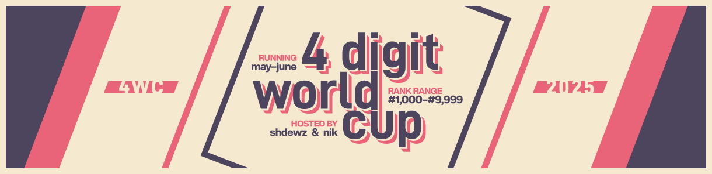

---
tags:
  - 4WC2025
  - 4WC
---

# 4 Digit World Cup 2025

The **4 Digit World Cup 2025** (***4WC2025***) is a 4v4, double-elimination, country-based osu! tournament hosted by ::{ flag=FI }:: [shdewz](https://osu.ppy.sh/users/10000899) and ::{ flag=NL }:: [nik](https://osu.ppy.sh/users/10077264). It is the seventh instalment of the 4 Digit World Cup.

## Tournament schedule

| Event | Timestamp |
| --: | :-- |
| Registration phase | 2025-03-30/2025-04-20 (23:59 UTC) |
| Team submission phase | 2025-04-21/2025-04-27 (23:59 UTC) |
| Qualifier showcase | 2025-05-04 |
| Qualifier stage | 2025-05-10/2025-05-11 |
| Round of 32 | 2025-05-17/2025-05-18 |
| Round of 16 | 2025-05-24/2025-05-25 |
| Quarterfinals | 2025-05-31/2025-06-01 |
| Semifinals | 2025-06-07/2025-06-08 |
| Finals | 2025-06-14/2025-06-15 |
| Grand Finals | 2025-06-21/2025-06-22 |

## Prizes

The 4 Digit World Cup 2025 awards winners with a [community-funded prize pool on Open Collective](https://opencollective.com/4wc/contribute/2025-prize-pool-86198).

| Placing | Prize(s) |
| :-: | :-- |
|  | 48% of the prize pool, profile badge (pending), animated profile banner |
|  | 32% of the prize pool, animated profile banner |
|  | 20% of the prize pool, animated profile banner |

## Organisation

The 4 Digit World Cup 2025 is run by various community members.

| Position | Member(s) |
| :-- | :-- |
| Organiser | ::{ flag=FI }:: [shdewz](https://osu.ppy.sh/users/10000899), ::{ flag=NL }:: [nik](https://osu.ppy.sh/users/10077264) |
| Designer and developer | ::{ flag=FI }:: [shdewz](https://osu.ppy.sh/users/10000899) |
| Mappool selector | ::{ flag=CA }:: [chiv](https://osu.ppy.sh/users/6701656), ::{ flag=NL }:: [nik](https://osu.ppy.sh/users/10077264), ::{ flag=US }:: [Pezz](https://osu.ppy.sh/users/10651106) |
| Mappool playtester | ::{ flag=US }:: [80 nuggets](https://osu.ppy.sh/users/7959945), ::{ flag=ES }:: [A L E P H](https://osu.ppy.sh/users/6735738), ::{ flag=DE }:: [Aaaaaaalex](https://osu.ppy.sh/users/10108853), ::{ flag=NL }:: [Aheo](https://osu.ppy.sh/users/14919428), ::{ flag=KR }:: [Amamya Kokoro](https://osu.ppy.sh/users/2511839), ::{ flag=US }:: [Belladonna](https://osu.ppy.sh/users/11758404), ::{ flag=US }:: [BoshyMan741](https://osu.ppy.sh/users/4830687), ::{ flag=PL }:: [cezgru](https://osu.ppy.sh/users/2629617), ::{ flag=US }:: [ChillierPear](https://osu.ppy.sh/users/9501251), ::{ flag=CA }:: [D I O](https://osu.ppy.sh/users/3958619), ::{ flag=CA }:: [deflateddolphin](https://osu.ppy.sh/users/10184558), ::{ flag=RU }:: [Endura](https://osu.ppy.sh/users/7774197), ::{ flag=US }:: [Flameztear](https://osu.ppy.sh/users/13207763), ::{ flag=GR }:: [JackPaX](https://osu.ppy.sh/users/11226645), ::{ flag=US }:: [Jakson](https://osu.ppy.sh/users/8788058), ::{ flag=CA }:: [jykca](https://osu.ppy.sh/users/18357479), ::{ flag=TH }:: [Lesperry](https://osu.ppy.sh/users/18092331), ::{ flag=GB }:: [lystia](https://osu.ppy.sh/users/11042418), ::{ flag=GB }:: [MALTESER](https://osu.ppy.sh/users/5218178), ::{ flag=CA }:: [marwin](https://osu.ppy.sh/users/2944449), ::{ flag=ES }:: [MeiFTW](https://osu.ppy.sh/users/15049805), ::{ flag=HK }:: [misha awa](https://osu.ppy.sh/users/14503423), ::{ flag=RO }:: [nanoya](https://osu.ppy.sh/users/12366071), ::{ flag=FI }:: [Nev-](https://osu.ppy.sh/users/11836334), ::{ flag=CA }:: [PikaPwn](https://osu.ppy.sh/users/2012453), ::{ flag=GB }:: [polski1](https://osu.ppy.sh/users/18131614), ::{ flag=CA }:: [pretty girl](https://osu.ppy.sh/users/11684952), ::{ flag=PT }:: [RafaMat](https://osu.ppy.sh/users/10743390), ::{ flag=UA }:: [RafGPio](https://osu.ppy.sh/users/13705417), ::{ flag=MX }:: [Riot](https://osu.ppy.sh/users/4256461), ::{ flag=GB }:: [rudj](https://osu.ppy.sh/users/11592896), ::{ flag=FI }:: [shdewz](https://osu.ppy.sh/users/10000899), ::{ flag=GB }:: [skiatzo](https://osu.ppy.sh/users/16774872), ::{ flag=CL }:: [suntanCTM](https://osu.ppy.sh/users/19998548), ::{ flag=US }:: [tekkito](https://osu.ppy.sh/users/7075211), ::{ flag=US }:: [ur cute](https://osu.ppy.sh/users/9993348), ::{ flag=RU }:: [Welter](https://osu.ppy.sh/users/11552867), ::{ flag=RU }:: [yumenoshima](https://osu.ppy.sh/users/8215374) |
| Mapper | *TBA* |
| Streamer | ::{ flag=CA }:: [D I O](https://osu.ppy.sh/users/3958619), ::{ flag=GB }:: [ilw8](https://osu.ppy.sh/users/14167692), ::{ flag=US }:: [ROB_](https://osu.ppy.sh/users/12455868), ::{ flag=FI }:: [shdewz](https://osu.ppy.sh/users/10000899), ::{ flag=VN }:: [SIay](https://osu.ppy.sh/users/9587896), ::{ flag=US }:: [this1neguy](https://osu.ppy.sh/users/1797189) |
| Commentator | ::{ flag=BR }:: [-felicia](https://osu.ppy.sh/users/10157694), ::{ flag=FI }:: [Amasetic](https://osu.ppy.sh/users/11375251), ::{ flag=US }:: [ampy](https://osu.ppy.sh/users/4458239), ::{ flag=ID }:: [BlankTap](https://osu.ppy.sh/users/10137131), ::{ flag=US }:: [ChillierPear](https://osu.ppy.sh/users/9501251), ::{ flag=CA }:: [chiv](https://osu.ppy.sh/users/6701656), ::{ flag=CA }:: [D I O](https://osu.ppy.sh/users/3958619), ::{ flag=GB }:: [Damarsh](https://osu.ppy.sh/users/7465147), ::{ flag=CA }:: [ExiaXD](https://osu.ppy.sh/users/17241883), ::{ flag=AT }:: [extrasensory](https://osu.ppy.sh/users/5841333), ::{ flag=AT }:: [Floflorian](https://osu.ppy.sh/users/23697895), ::{ flag=US }:: [freddiiieeee](https://osu.ppy.sh/users/7112839), ::{ flag=US }:: [hubbawubba](https://osu.ppy.sh/users/15910288), ::{ flag=CA }:: [I-Flame](https://osu.ppy.sh/users/11257542), ::{ flag=KZ }:: [Lightin](https://osu.ppy.sh/users/7595619), ::{ flag=US }:: [M I L E S](https://osu.ppy.sh/users/6036351), ::{ flag=AU }:: [Mavs](https://osu.ppy.sh/users/11076938), ::{ flag=FI }:: [Nev-](https://osu.ppy.sh/users/11836334), ::{ flag=FI }:: [shdewz](https://osu.ppy.sh/users/10000899), ::{ flag=GB }:: [skiatzo](https://osu.ppy.sh/users/16774872), ::{ flag=US }:: [Suicune3](https://osu.ppy.sh/users/6895187), ::{ flag=US }:: [this1neguy](https://osu.ppy.sh/users/1797189), ::{ flag=US }:: [Tycani](https://osu.ppy.sh/users/6693266), ::{ flag=AU }:: [Vordi](https://osu.ppy.sh/users/6659116) |
| Referee | ::{ flag=PH }:: [-PeKoRa-](https://osu.ppy.sh/users/17959882), ::{ flag=IN }:: [-Space](https://osu.ppy.sh/users/7720204), ::{ flag=KR }:: [Civil oath](https://osu.ppy.sh/users/3216107), ::{ flag=NZ }:: [cyndrean](https://osu.ppy.sh/users/12872893), ::{ flag=KR }:: [Discord](https://osu.ppy.sh/users/16194858), ::{ flag=US }:: [freddiiieeee](https://osu.ppy.sh/users/7112839), ::{ flag=CL }:: [Isita](https://osu.ppy.sh/users/13973026), ::{ flag=BR }:: [LeoFLT](https://osu.ppy.sh/users/3668779), ::{ flag=SK }:: [Mavosiik](https://osu.ppy.sh/users/18927594), ::{ flag=NL }:: [nik](https://osu.ppy.sh/users/10077264), ::{ flag=PL }:: [P a t r i c k](https://osu.ppy.sh/users/6814521), ::{ flag=RU }:: [Rainbowtaves](https://osu.ppy.sh/users/10079847), ::{ flag=US }:: [ROB_](https://osu.ppy.sh/users/12455868), ::{ flag=FI }:: [shdewz](https://osu.ppy.sh/users/10000899), ::{ flag=GB }:: [SSScotty](https://osu.ppy.sh/users/10319851), ::{ flag=US }:: [Suicune3](https://osu.ppy.sh/users/6895187), ::{ flag=US }:: [this1neguy](https://osu.ppy.sh/users/1797189), ::{ flag=US }:: [vleth](https://osu.ppy.sh/users/18556796), ::{ flag=GB }:: [Yazzehh](https://osu.ppy.sh/users/7068973) |

## Links

- **[Information spreadsheet](https://docs.google.com/spreadsheets/d/1_DWIlcFu985vNeNzSspWqjeJHva0X04fSNZA_2B0YPA)**
- [Discussion thread](https://osu.ppy.sh/community/forums/topics/2059343?n=1)
- [Livestream](https://twitch.tv/4wcb)
- [Challonge bracket](https://challonge.com/4WC2025)
- [Discord server](https://discord.com/invite/uQarcRtB3u)

## Ruleset

### General

- This is a **country-based**, **world-cup-style** tournament.
- This is a **4v4**, **osu!** tournament with **teams of 5–8 players**.
- The rank range is **#1,000–9,999** with **no BWS**.
- The tournament will be played in **ScoreV2**.
- Teams will be seeded by Qualifier results.
- Qualifiers will be done by playing through a 12-map pool once. Four players from a team will be in for each map.
- The Qualifiers mappool will consist of 5 No Mod, 2 Hidden, 2 Hard Rock, and 3 Double Time picks.
- The **top 32** teams from Qualifiers will advance to a **double-elimination bracket**.
- Grand Finals will feature a **bracket reset** if the team coming from the losers' bracket wins the first match.
- Players outside the rank range are allowed to register. However, if they are not strictly within the rank range by the time registrations close, their registration will be removed.
- After registrations close, players are allowed to leave the rank range.
- Match schedules and other events will be displayed in **UTC time**.
- Matches can be rescheduled if both teams agree to a time and communicate it to the tournament organisers **before Thursday 23:59 UTC** of the week the match is to take place on.
  - Reschedule discussions are recommended to be carried out within threads in the scheduling channel to allow for faster intervention by the tournament organisers in the case of any disputes.
- Staff members, with the exception of streamers and commentators, are not allowed to play in the tournament.
- The tournament organisers reserve the right to modify the rules at any moment as they see fit.
  - Any changes to the rules will be clearly communicated to the players.

### Conduct

- All spaces affiliated with 4WC are subject to the [osu! community rules](/wiki/Rules), as well as the rules of the respective platforms themselves.
- Players are expected to uphold a competitive and friendly environment, and to treat tournament staff and other players with respect.
  - This includes keeping matches running smoothly and avoiding deliberate delays.
- Any foul play, including but not limited to cheating, bracket manipulation, and failure to cooperate in match rescheduling, is strictly prohibited.
- Failing to abide by these rules will be punished accordingly and **may lead to the offending player or team being disqualified**.

### Registration

- All participants must register for the tournament by connecting their osu! and Discord accounts via the [**registration page**](https://osu.ppy.sh/oauth/authorize?client_id=21966&redirect_uri=https://script.google.com/macros/s/AKfycbyvyWQC-FzgG_ijZFCpDrdWqdtvwPC3OoccYTI4jZHPml5Gtc6QpH5ZJn9tnRbFnTDgDA/exec&response_type=code&scope=identify&state=%7B%22step%22%3A%22osu%22%7D).
- The captain for each country will be **selected by the tournament organisers** at the end of registrations.
- After registrations close, each captain will be sent the list of eligible players for their country. The player lists sent to captains are final and contain all eligible signups.
- If a country has more than 8 eligible players, they are **recommended to organise tryouts**. If a team has 8 or fewer signups their team will be locked as is. They are, however, free to change their captain or remove a player within the team submission phase.
  - Teams will be provided a pre-made mappool for tryouts that they may choose to use.
- All members of a team **must be registered for the tournament** and have **joined the [Discord server](https://discord.com/invite/uQarcRtB3u)**.
- Teams will range from **5 to 8 members**.
- The captain is allowed to not put themselves on the team if they think it is right to do so, but they are still responsible for submitting the roster to the tournament organisers as well as designating someone else on the roster as the new captain.
- Teams must be submitted **by the end of the team submission phase** (April 27, 23:59 UTC).

### Match format

| Stage | Format |
| :-- | :-- |
| Round of 32 | Best of 9, 1 ban |
| Round of 16 | Best of 9, 1 ban |
| Quarterfinals | Best of 11, 2 bans |
| Semifinals | Best of 11, 2 bans |
| Finals | Best of 13, 2 bans |
| Grand Finals | Best of 13, 2 bans |

### Match procedure

- The match lobby will be created by the designated referee, and the captains of both teams will be invited. The captains are then responsible for inviting the rest of their team. If the captain of a team is not online, the referee will invite any other player from the team, who is then responsible for substituting their captain.
- Teams have a **strict 10-minute grace period** to have **at least 4 players** available to play the match. If 10 minutes pass and a team cannot field enough players to play the match, the other team will receive a win by default unless a reschedule is agreed upon by both teams within a timely manner.
- At the start of the match, both captains will `!roll`. The **roll winner will choose either the pick or the ban order**, with the **loser choosing the remaining order**.
- There will be no warmups.
- The referee is not allowed to play in the match.
- The match will be played in **Team VS** mode and **ScoreV2**.
- Each team is allowed 1 ban per match during Round of 32 and Round of 16, and 2 bans from Quarterfinals onwards. Banned maps are effectively removed from the mappool for the duration of the match and are not allowed to be picked. A team is **allowed to ban 2 maps from the same mod pool**.
  - Bans will be done in the **ABBA order**.
- Teams are **allowed to pick 2 maps from the same mod pool** in a row.
- Teams will have **one 2-minute timeout available per match**. Timeouts can be activated at any time at the team's discretion.
- Teams have 2 minutes to pick or ban a map. If a team fails to select a map in time, the **referee will automatically apply their timeout**. If the team does not have a remaining timeout, the map choice will pass over to the other team.
- After a map is picked, teams have 2 minutes to lock in their 4-player roster and ready up. If a team fails to ready up in time, the referee will automatically apply their timeout. If the team does not have a remaining timeout, the referee will force an `!mp start 15` and the map will start with the players present in the lobby.
  - Should a team have too many players in the lobby, the scores from their 4 worst-performing players will be counted.
- For Free Mod picks, at least **3 players per team will have to choose a mod**. Mods allowed are Hidden (HD), Hard Rock (HR) and Easy (EZ).
  - Teams must have at least **one player with HR** and **one player with HD or EZ**. Mod combinations are accepted; however, HDHR counts as HR for this mod requirement.
  - Scores with EZ will have a different multiplier on every Free Mod pick. These multipliers will be specified on the mappool spreadsheet.
- Players are allowed to, but not required to, use mods on the tiebreaker.
- The winner of a map is determined by whichever team's four scores add up to a higher number.
- Using No Fail is enforced on every map.
- In the case of a disconnection, common sense will be applied: if proof exists of the disconnected player's score (or a rough estimate of their hypothetical score if they finished the map), it will be added to their team's total score; if it is at all ambiguous, the other team will get the point.
  - If a disconnection happens in the **first 30 seconds or 1/4 of the map's drain time** (whichever comes first) the team may ask to replay the map. This will be allowed once per match and suspected misuse may lead to disqualification.
  - Any replays of a map must be done with the same rosters as the initial playthrough.

### Qualifier procedure

- All of the rules above will be in effect during Qualifier lobbies.
- Qualifiers will be played in **Head-to-head** mode.
- There are no bans in Qualifiers.
- Captains are responsible for choosing a lobby time for their team by **Friday, May 9 at 23:59 UTC**. Teams that fail to select a time before the deadline **will be disqualified**.
- In the lobby, the team will play through the **entire** mappool **in the order** given on the mappool sheet.
- In the event of a disconnection, the disconnected player will be allowed to replay the map at the end of the lobby if the disconnection happened in the **first 45 seconds or 1/3 of the map's drain time** (whichever comes first).
  - Suspected misuse of this rule may lead to disqualification.
- Every map will be played with a **roster of 4 players**. Players can be freely swapped between maps.
- Qualifier scores will be kept private until all teams have played in order to prevent seed manipulation.
- The top 32 qualifying teams will advance to a double-elimination bracket.
  - Cumulative Z-score, scaled to 0–100, will be used to seed the teams.
