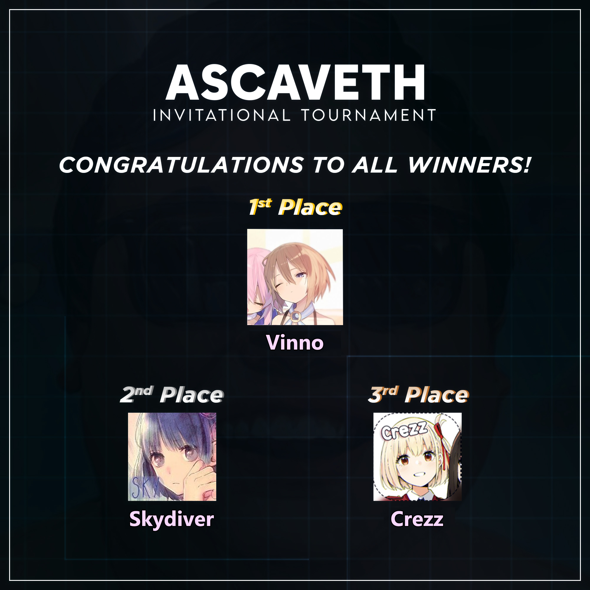

---
tags:
  - AIT
  - AIT 2022
---

# Ascaveth Invitational Tournament 2022

The **Ascaveth Invitational Tournament 2022** was a single-elimination 1v1 invitational osu! tournament hosted by ::{ flag=ID }:: [Ascaveth](https://osu.ppy.sh/users/3245206) and co-organised by ::{ flag=ID }:: [Niva](https://osu.ppy.sh/users/197805), ::{ flag=ID }:: [Millie](https://osu.ppy.sh/users/3484548), ::{ flag=ID }:: [Vvn](https://osu.ppy.sh/users/3204677), and ::{ flag=ID }:: [Raids](https://osu.ppy.sh/users/15640966). It was the second major LAN osu! tournament to ever be held in Indonesia, following the [osu! Rhythmical Adventure Competition](https://osu.ppy.sh/community/forums/topics/98417) event ten years before.

## Tournament schedule

| Event | Timestamp |
| --: | :-- |
| Technical meeting | 2022-08-29 |
| Opening | 2022-09-03 (10:00 UTC +7) |
| Quarterfinal 1 | 2022-09-03 (10:30 UTC +7) |
| Quarterfinal 2 | 2022-09-03 (11:30 UTC +7) |
| *Break* | 2022-09-03 (12:30 UTC +7) |
| Quarterfinal 3 | 2022-09-03 (13:00 UTC +7) |
| Quarterfinal 4 | 2022-09-03 (14:00 UTC +7) |
| *Break* | 2022-09-03 (15:00 UTC +7) |
| Semifinal 1 | 2022-09-03 (15:30 UTC +7) |
| Semifinal 2 | 2022-09-03 (16:30 UTC +7) |
| *Break* | 2022-09-03 (17:30 UTC +7) |
| 3rd Place Match | 2022-09-03 (18:30 UTC +7) |
| Grand Final | 2022-09-03 (19:30 UTC +7) |
| Awarding and Closing | 2022-09-03 (20:30 UTC +7) |

## Prizes

| Placing | Prize(s) |
| :-: | :-- |
|  | 500,000 IDR, physical trophy (courtesy of [Herculex Indonesia](https://www.tokopedia.com/herculex)), commemorative medal |
|  | 250,000 IDR, physical trophy (courtesy of [Herculex Indonesia](https://www.tokopedia.com/herculex)), commemorative medal |
|  | 150,000 IDR, physical trophy (courtesy of [Herculex Indonesia](https://www.tokopedia.com/herculex)), commemorative medal |
| *4th place* | 100,000 IDR |
| *5th-8th place* | 75,000 IDR |

## Organisation

The Ascaveth Invitational Tournament 2022 was run by various osu! community members predominantly hailing from Indonesia.

| Position | Member(s) |
| :-- | :-- |
| Host | ::{ flag=ID }:: [Ascaveth](https://osu.ppy.sh/users/3245206) |
| Organiser | ::{ flag=ID }:: [Niva](https://osu.ppy.sh/users/197805), ::{ flag=ID }:: [Millie](https://osu.ppy.sh/users/3484548), ::{ flag=ID }:: [Vvn](https://osu.ppy.sh/users/3204677), ::{ flag=ID }:: [Raids](https://osu.ppy.sh/users/15640966) |
| Mappool selector | ::{ flag=ID }:: [Ascaveth](https://osu.ppy.sh/users/3245206), ::{ flag=ID }:: [Niva](https://osu.ppy.sh/users/197805), ::{ flag=ID }:: [Millie](https://osu.ppy.sh/users/3484548) |
| Mappool helper | ::{ flag=ID }:: [fnayR](https://osu.ppy.sh/users/2800253), ::{ flag=ID }:: [Caviar-](https://osu.ppy.sh/users/10474988), ::{ flag=ID }:: [StayMusical](https://osu.ppy.sh/users/12688176), ::{ flag=ID }:: [Kuro Fuyusaki](https://osu.ppy.sh/users/2667496) |
| Streamer | ::{ flag=ID }:: [HORAS](https://osu.ppy.sh/users/11421465) |
| Commentator | ::{ flag=ID }:: [Ascaveth](https://osu.ppy.sh/users/3245206), ::{ flag=ID }:: [Niva](https://osu.ppy.sh/users/197805), ::{ flag=ID }:: [Millie](https://osu.ppy.sh/users/3484548), ::{ flag=ID }:: [Vvn](https://osu.ppy.sh/users/3204677), ::{ flag=ID }:: [Victim\_Crasher](https://osu.ppy.sh/users/2084869), ::{ flag=ID }:: [Venta](https://osu.ppy.sh/users/11320627) |
| Referee | ::{ flag=ID }:: [Millie](https://osu.ppy.sh/users/3484548), ::{ flag=ID }:: [Genjitsu](https://osu.ppy.sh/users/3531490) |
| Logistics and equipment | ::{ flag=ID }:: [Vvn](https://osu.ppy.sh/users/3204677), ::{ flag=ID }:: [HORAS](https://osu.ppy.sh/users/11421465) |
| Security and permissions | ::{ flag=ID }:: [Deorum](https://osu.ppy.sh/users/5933031) |
| Documentation | ::{ flag=ID }:: [Vvn](https://osu.ppy.sh/users/3204677), ::{ flag=ID }:: [liykun](https://osu.ppy.sh/users/9500057) |
| Catering | ::{ flag=ID }:: [Nareisk](https://osu.ppy.sh/users/18382879) |
| Graphic designer | ::{ flag=ID }:: [Niva](https://osu.ppy.sh/users/197805), ::{ flag=ID }:: [Vvn](https://osu.ppy.sh/users/3204677), ::{ flag=ID }:: [Zavier](https://osu.ppy.sh/users/11379592) |
| Wiki editor | ::{ flag=ID }:: [Niva](https://osu.ppy.sh/users/197805) |
| Additional helper | ::{ flag=ID }:: [Seox](https://osu.ppy.sh/users/3793938), ::{ flag=ID }:: [Arca 9](https://osu.ppy.sh/users/14042319), ::{ flag=ID }:: [xLipz](https://osu.ppy.sh/users/8358833), ::{ flag=ID }:: Hollowness, ::{ flag=ID }:: Vanties, ::{ flag=ID }:: Aniki, ::{ flag=ID }:: St. Dark\_Pha, ::{ flag=MY }:: [Laphii](https://osu.ppy.sh/users/9364594) |

## Links

- **[Master spreadsheet](https://docs.google.com/spreadsheets/d/13UTdhZDn14B8pgZ4KY7V5RQsHMt0qCrAeTXZHZ4eCoY/edit?usp=sharing)**
- [Twitter](https://www.twitter.com/AscavethInv)
- [Livestream](https://www.twitch.tv/osuIndonesia)
- [Challonge](https://challonge.com/AscavethInv)

## Participants

Listed below are the players who were invited into the tournament:

- ::{ flag=ID }:: [Lifeline](https://osu.ppy.sh/users/11367222)
- ::{ flag=ID }:: [Vinno](https://osu.ppy.sh/users/10717635)
- ::{ flag=ID }:: [Crezz](https://osu.ppy.sh/users/7108275)
- ::{ flag=ID }:: [Skydiver](https://osu.ppy.sh/users/4750008)
- ::{ flag=ID }:: [Fuma](https://osu.ppy.sh/users/1501956)
- ::{ flag=ID }:: [Thatnoobguy](https://osu.ppy.sh/users/11091594)
- ::{ flag=ID }:: [Daffy](https://osu.ppy.sh/users/5968633)
- ::{ flag=ID }:: [Walfrid](https://osu.ppy.sh/users/6600809)

In addition, ::{ flag=ID }:: [Suikami](https://osu.ppy.sh/users/1929336) was drafted as a back-up player, in case someone had to back out from the event on a short notice.

## Podium

## Mappools

### Grand Final and 3rd Place Match

**[Download the mappack here! (215 MB)](https://drive.google.com/file/d/1bBZSqndix86n6QB-2-3di7GHx_t3drXb/view?usp=sharing)**

- NoMod
  1. [ELFENSJoN - Shiroki Yume wa Madara ni (Volcarona) \[Twilight\]](https://osu.ppy.sh/beatmapsets/1411211#osu/3174011)
  2. [xi - Blue Zenith (Asphyxia) \[ktgster's Extreme\]](https://osu.ppy.sh/beatmapsets/292301#osu/657917)
  3. [BlackY feat. Risa Yuzuki - Shuumatsu Kinema (My Angel Jeremy) \[The weekend cinema in my mind\]](https://osu.ppy.sh/beatmapsets/1820113#osu/3734845)
  4. [ZxNX - Schadenfreude (Realazy) \[Down's Extra\]](https://osu.ppy.sh/beatmapsets/1816239#osu/3728042)
  5. [Igorrr - Unpleasant Sonata (Riene) \[Lyruke's Extreme\]](https://osu.ppy.sh/beatmapsets/1347338#osu/3681518)
  6. [II-L - LEVEL-DOWN (MrAlpacus) \[OD 9.4\]](https://osu.ppy.sh/beatmapsets/1670983#osu/3459288)
- Hidden
  1. [TERRA - EDEN (Mirash) \[Collab Extra\]](https://osu.ppy.sh/beatmapsets/1171713#osu/2444026)
  2. [Niko - Made of Fire (lesjuh) \[Oni\]](https://osu.ppy.sh/beatmapsets/10112#osu/40017)
  3. [kanone - The Sea of Memory (waefwerf) \[Amnesia\]](https://osu.ppy.sh/beatmapsets/1347768#osu/2791085)
- HardRock
  1. [Baru - ResoAlive (knowledgeking) \[Always Trust Me\]](https://osu.ppy.sh/beatmapsets/1703756#osu/3481299)
  2. [onoken - felys final remix (Miura) \[Another\]](https://osu.ppy.sh/beatmapsets/1304397#osu/2704777)
  3. [monet - Noborenai Sakamichi (xHirayuki) \[\:sunflower\:\]](https://osu.ppy.sh/beatmapsets/1555041#osu/3176982)
- DoubleTime
  1. [Yousei Teikoku - Torikago (Nagi Hisakawa) \[Immure\]](https://osu.ppy.sh/beatmapsets/1271945#osu/2643135)
  2. [-45 - System Sun (Lasse) \[Insane\]](https://osu.ppy.sh/beatmapsets/1616029#osu/3299371)
  3. [Sakamoto Maaya - Okaerinasai (tomatomerde Remix) (Azer) \[Collab\]](https://osu.ppy.sh/beatmapsets/179323#osu/431147)
  4. [Celldweller - Shapeshifter (feat. Styles of Beyond) (PandaHero) \[Collab Insane\]](https://osu.ppy.sh/beatmapsets/1124906#osu/2776049)
- Tiebreaker
  1. **[Laur feat. Risa Yuzuki - Megaera (Niva) \[Ascavethia\]](https://osu.ppy.sh/beatmapsets/1841569#osu/3782464)**

### Semifinals and Quarterfinals

**[Download the mappack here! (215 MB)](https://drive.google.com/file/d/1bBZSqndix86n6QB-2-3di7GHx_t3drXb/view?usp=sharing)**

- NoMod
  1. [Mrs. GREEN APPLE - Blue Ambience (feat. asmi) (Raids) \[I want to be loved!\]](https://osu.ppy.sh/beatmapsets/1801997#osu/3765020)
  2. [cosMo@BousouP - Oceanus (Broccoly) \[Divinity\]](https://osu.ppy.sh/beatmapsets/267767#osu/609843)
  3. [ZUTOMAYO - Kan Saete Kuyashiiwa (Nathan) \[geragera\]](https://osu.ppy.sh/beatmapsets/1001507#osu/2096523)
  4. [NOMA - LOUDER MACHINE (Skystar) \[byfar x Skystar's Collab Extra\]](https://osu.ppy.sh/beatmapsets/483606#osu/1085206)
  5. [t+pazolite - Hoshikuzu Struck (KKipalt) \[Stardust (Bamboo Ver.)\]](https://osu.ppy.sh/beatmapsets/1478718#osu/3033661)
- Hidden
  1. [Feryquitous feat. Aitsuki Nakuru - Kairikou (Ryuusei Aika) \[Skystar's Irregular\]](https://osu.ppy.sh/beatmapsets/740862#osu/1723257)
  2. [A.SAKA - Nanatsu Issenzakura (yf\_bmp) \[Gust's Insane\]](https://osu.ppy.sh/beatmapsets/513731#osu/1350672)
- HardRock
  1. [Mitsukiyo - Luminous Memory (CoLouRed GlazeE) \[Extra\]](https://osu.ppy.sh/beatmapsets/1796025#osu/3681594)
  2. [ginkiha - EOS (alacat) \[Lycoris\]](https://osu.ppy.sh/beatmapsets/151720#osu/373781)
- DoubleTime
  1. [Sakamoto Maaya - Mameshiba (Keqing) \[Seaside\]](https://osu.ppy.sh/beatmapsets/1650679#osu/3371420)
  2. [Annabel - pedalnote (Agatsu) \[Gibune's Insane\]](https://osu.ppy.sh/beatmapsets/1669381#osu/3409171)
  3. [zts - lastendconductor (EvilElvis) \[Insane\]](https://osu.ppy.sh/beatmapsets/333965#osu/738959)
- Tiebreaker
  1. **[Asriel - Sequentia (Deca) \[Damnation\]](https://osu.ppy.sh/beatmapsets/1550720#osu/3168834)**

## Match results

### Grand Final

| Match code | Player 1 |  |  | Player 2 | Match link | VOD link |
| :-: | --: | :-: | :-: | :-- | :-- | :-- |
| Grand Final | [Skydiver](https://osu.ppy.sh/users/4750008) ::{ flag=ID }:: | 5 | **6** | ::{ flag=ID }:: **[Vinno](https://osu.ppy.sh/users/10717635)** | [#1](https://osu.ppy.sh/community/matches/99571190) | [#1](https://www.youtube.com/watch?v=9S82GWnX08s) |

### 3rd Place Match

| Match code | Player 1 |  |  | Player 2 | Match link | VOD link |
| :-: | --: | :-: | :-: | :-- | :-- | :-- |
| 3rd Place Match | **[Crezz](https://osu.ppy.sh/users/7108275)** ::{ flag=ID }:: | **6** | 0 | ::{ flag=ID }:: [Lifeline](https://osu.ppy.sh/users/11367222) | [#1](https://osu.ppy.sh/community/matches/103532224) | [#1](https://www.youtube.com/watch?v=HKiF4Ahh5Uk) |

### Semifinals

| Match code | Player 1 |  |  | Player 2 | Match link | VOD link |
| :-: | --: | :-: | :-: | :-- | :-- | :-- |
| Semifinal 1 | [Lifeline](https://osu.ppy.sh/users/11367222) ::{ flag=ID }:: | 2 | **5** | ::{ flag=ID }:: **[Vinno](https://osu.ppy.sh/users/10717635)** | [#1](https://osu.ppy.sh/community/matches/103529223) | [#1](https://www.youtube.com/watch?v=hk5f4eTc39c) |
| Semifinal 2 | **[Skydiver](https://osu.ppy.sh/users/7108275)** ::{ flag=ID }:: | **5** | 1 | ::{ flag=ID }:: [Crezz](https://osu.ppy.sh/users/7108275) | [#1](https://osu.ppy.sh/community/matches/103528575) | [#1](https://www.youtube.com/watch?v=sn8pseCo9fU) |

### Quarterfinals

| Match code | Player 1 |  |  | Player 2 | Match link | VOD link |
| :-: | --: | :-: | :-: | :-- | :-- | :-- |
| Quarterfinal 1 | [Thatnoobguy](https://osu.ppy.sh/users/11091594) ::{ flag=ID }:: | 4 | **5** | ::{ flag=ID }:: **[Crezz](https://osu.ppy.sh/users/7108275)** | [#1](https://osu.ppy.sh/community/matches/103525528) | [#1](https://www.youtube.com/watch?v=_MhOuxc_XIw) |
| Quarterfinal 2 | **[Lifeline](https://osu.ppy.sh/users/11367222)** ::{ flag=ID }:: | **5** | 3 | ::{ flag=ID }:: [Fuma](https://osu.ppy.sh/users/1501956) | [#1](https://osu.ppy.sh/community/matches/103526744) | [#1](https://www.youtube.com/watch?v=uAiB2JpiD8s) |
| Quarterfinal 3 | [Daffy](https://osu.ppy.sh/users/5968633) ::{ flag=ID }:: | 3 | **5** | ::{ flag=ID }:: **[Vinno](https://osu.ppy.sh/users/10717635)** | [#1](https://osu.ppy.sh/community/matches/103527716) | [#1](https://www.youtube.com/watch?v=LMKNeV5SJdU) |
| Quarterfinal 4 | **[Skydiver](https://osu.ppy.sh/users/4750008)** ::{ flag=ID }:: | **5** | 0 | ::{ flag=ID }:: [Walfrid](https://osu.ppy.sh/users/6600809) | [#1](https://osu.ppy.sh/community/matches/103528575) | [#1](https://www.youtube.com/watch?v=Uk5ljWTDhOA) |

## Ruleset

### General rules

1. Beatmap scoring is based on **[ScoreV2](/wiki/Gameplay/Score#scorev2).**
2. All matches will be played over a single day in an undisclosed location following the Single Elimination system.
   - The bracket for the tournament will be randomly generated using [random.org](https://random.org) during the Technical Meeting.
3. All matches will be played using the setup provided by the Tournament Management on the spot.
   - Players are allowed to bring in certain equipments (e.g. keyboard and graphics tablet) and their own device settings should they wish to.
4. With the exception of the Grand Final tiebreaker, the maps and mappools for the tournament will be announced by the Tournament Management in advance before the event takes place.
5. Match schedules will be predetermined by the Tournament Management.
6. A referee will create a multiplayer room 10 minutes in advance and will start to send out invites.
7. **NoFail will be enforced in all beatmaps.** This is to ensure that the points are to be awarded more fairly towards players who perform better in general during the course of the beatmap regardless of their remaining health at the end.
8. If a player disconnects, the referee will note the score the player had achieved at the end of the beatmap directly from their PC and adjust the outcome of the pick accordingly.
9. Lag is not a valid reason to nullify a beatmap.
10. If any problems during the match occur, the Tournament Management will make a decision based on the referee's report.
11. It is expected that all players be polite and respectful to each other. Penalties will be given upon violation.
    - If a player is found to be engaging in an act that is deemed to be distasteful or provocative, the corresponding player may be disqualified right away from the tournament and/or blacklisted from future iterations of the tournament by the Tournament Management.
    - Usage of any tools or programs that are against the [osu! community rules](/wiki/Rules#community-rules) is strictly prohibited and will be straight up reported to the osu! team at will.

### Tournament registration

As the tournament was an invitational, there were no open registrations held for the event. However, as always, test players, referees, and mappool selectors may not participate as players in this tournament.

### Match instructions

1. Each player must use the `!roll` command once in the multiplayer lobby in order to determine the banning and picking order.
   - The winner of the `!roll` gets to determine who gets the first pick and the second ban.
   - The loser of the `!roll` gets the opposite by default.
   - This rule does not apply in the Qualifier lobbies.
2. Each player has to ban **one beatmap** (on the Quarterfinals and the Semifinals) or **two beatmaps** (on the 3rd Place Match and the Grand Final) from the corresponding mappool. These beatmaps will not be allowed to be picked by any player during the entire match.
   - Barring the tiebreaker, there are no restrictions as to which maps may and may not be banned in a match.
3. **There will be no warm-up beatmaps to be played in the multiplayer lobby.** Players who are looking up to warm themselves up before the match are expected to do so by their own during the grace period before the match commences.
4. **There will be no FreeMod pick in the mappool.** However, in the case of a tiebreaker, the tiebreaker map will be played with the FreeMod option enabled which allows players to play the tiebreaker map with EZ, HR, HD, or any possible combinations of the three mods should they wish to.
   - Playing the tiebreaker map with a mod is *not* mandatory.
5. Players who can compete in the next round are determined by:
   - In the Quarterfinals and the Semifinals, each player needs to win 5 points in order to win a match. (Best-of-9)
   - In the 3rd Place Match and the Grand Final, each player needs to win 6 points in order to win a match. (Best-of-11)
6. The results of each match and any other relevant information regarding the match will be noted by the referee after the match has been concluded.
