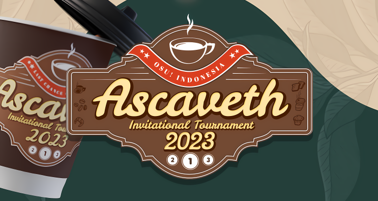
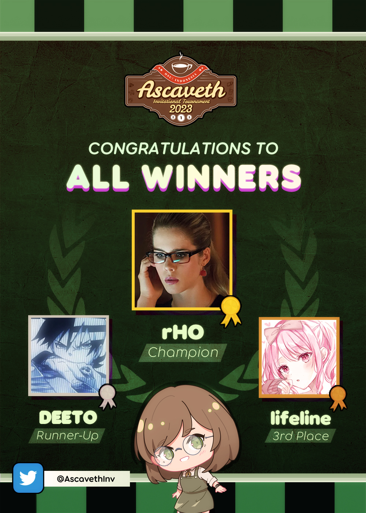

---
tags:
  - AIT
  - AIT 2023
---

# Ascaveth Invitational Tournament 2023

The **Ascaveth Invitational Tournament 2023** was a double-elimination 1v1 invitational osu! tournament hosted by ::{ flag=ID }:: [Ascaveth](https://osu.ppy.sh/users/3245206) and co-organised by ::{ flag=ID }:: [Raids](https://osu.ppy.sh/users/15640966), ::{ flag=ID }:: [Niva](https://osu.ppy.sh/users/197805), ::{ flag=ID }:: [Sunohara Shun](https://osu.ppy.sh/users/3484548), and ::{ flag=ID }:: [Vvn](https://osu.ppy.sh/users/3204677). The tournament was the third major LAN osu! tournament to ever be held in Indonesia, as well as the second one to be run under the [Ascaveth Invitational Tournament](/wiki/Tournaments/AIT) banner.

## Tournament schedule

| Event | Timestamp (UTC+07) |
| --: | :-- |
| Technical meeting | 2023-12-02 |
| Opening | 2023-12-09 (08:00) |
| Match 1 + match 2 | 2023-12-09 (09:00) |
| Match 3 + match 4 | 2023-12-09 (10:30) |
| *Break* | 2023-12-09 (11:30) |
| Match 5U + match 6U | 2023-12-09 (13:00) |
| Match 7L + match 8L | 2023-12-09 (14:15) |
| Match 9L + match 10L | 2023-12-09 (15:30) |
| Match 11L + match 12U | 2023-12-09 (16:45) |
| *Break* | 2023-12-09 (18:00) |
| Match 13L | 2023-12-09 (19:00) |
| Match 14 (Grand Final) | 2023-12-09 (20:30) |
| Awarding and closing | 2023-12-09 (22:00) |

For a visual representation of the structure of the matches, refer to [this chart](img/BracketStructure.png).

## Prizes

The Ascaveth Invitational Tournament 2023 offered a prize pool that was built upon community donations through [Saweria](https://saweria.co/osuIndonesia) and [Streamlabs](https://streamlabs.com/osuindonesia/tip) as well as [merchandise sales](https://www.youtube.com/watch?v=3J8BuScGRSY).

| Placing | Prize(s) |
| :-: | :-- |
|  | 35% of the accumulated prize pool, physical trophy (courtesy of [Wellen Print](https://wellenprint.com/)), commemorative medal, exclusive players-only merch set, unique profile badge |
|  | 20% of the accumulated prize pool, physical trophy (courtesy of [Wellen Print](https://wellenprint.com/)), commemorative medal, exclusive players-only merch set |
|  | 15% of the accumulated prize pool, physical trophy (courtesy of [Wellen Print](https://wellenprint.com/)), commemorative medal, exclusive players-only merch set |
| *4th place* | 10% of the accumulated prize pool, exclusive players-only merch set |
| *5th–8th place* | 5% of the accumulated prize pool, exclusive players-only merch set |

As with other osu! tournaments in general, the Ascaveth Invitational Tournament 2023 was not marked for profit. All earnings made from before and throughout the event were used to contribute towards the prize pool.

## Organisation

The Ascaveth Invitational Tournament 2023 was run by various osu! community members from Indonesia and beyond.

| Position | Member(s) |
| :-- | :-- |
| Host | ::{ flag=ID }:: [Ascaveth](https://osu.ppy.sh/users/3245206) |
| Organiser | ::{ flag=ID }:: [Raids](https://osu.ppy.sh/users/15640966), ::{ flag=ID }:: [Niva](https://osu.ppy.sh/users/197805), ::{ flag=ID }:: [Sunohara Shun](https://osu.ppy.sh/users/3484548), ::{ flag=ID }:: [Vvn](https://osu.ppy.sh/users/3204677) |
| Mappool selector | ::{ flag=ID }:: [Ascaveth](https://osu.ppy.sh/users/3245206), ::{ flag=ID }:: [Raids](https://osu.ppy.sh/users/15640966), ::{ flag=ID }:: [Niva](https://osu.ppy.sh/users/197805), ::{ flag=ID }:: [Sunohara Shun](https://osu.ppy.sh/users/3484548), ::{ flag=ID }:: [Caviar-](https://osu.ppy.sh/users/10474988), ::{ flag=ID }:: [fnayR](https://osu.ppy.sh/users/2800253) |
| Custom mapper | ::{ flag=ID }:: [jiwoas](https://osu.ppy.sh/users/10778215), ::{ flag=ID }:: [Riene](https://osu.ppy.sh/users/8549009), ::{ flag=ID }:: [Adinda](https://osu.ppy.sh/users/15959751) |
| Playtester | ::{ flag=ID }:: [i love uma](https://osu.ppy.sh/users/7108275), ::{ flag=MY }:: [DuoX](https://osu.ppy.sh/users/9560694), ::{ flag=MY }:: [Laphii](https://osu.ppy.sh/users/9364594) |
| Streamer | ::{ flag=ID }:: [Ascaveth](https://osu.ppy.sh/users/3245206), ::{ flag=ID }:: [lifeline](https://osu.ppy.sh/users/11367222) |
| Commentator | ::{ flag=ID }:: [Ascaveth](https://osu.ppy.sh/users/3245206), ::{ flag=ID }:: [Niva](https://osu.ppy.sh/users/197805), ::{ flag=ID }:: [Sunohara Shun](https://osu.ppy.sh/users/3484548), ::{ flag=ID }:: [Vvn](https://osu.ppy.sh/users/3204677), ::{ flag=ID }:: [i love uma](https://osu.ppy.sh/users/7108275), ::{ flag=ID }:: [Genjitsu](https://osu.ppy.sh/users/3531490), ::{ flag=ID }:: [Victim\_Crasher](https://osu.ppy.sh/users/2084869), ::{ flag=ID }:: [Deorum](https://osu.ppy.sh/users/5933031), ::{ flag=ID }:: [Suikami](https://osu.ppy.sh/users/1929336), ::{ flag=ID }:: [Fuma](https://osu.ppy.sh/users/1501956), ::{ flag=ID }:: [Hakui Koyori](https://osu.ppy.sh/users/10717635), ::{ flag=ID }:: [Skydiver](https://osu.ppy.sh/users/4750008), ::{ flag=ID }:: [ScubDomino](https://osu.ppy.sh/users/8972308), ::{ flag=ID }:: [BlankTap](https://osu.ppy.sh/users/10137131) |
| Referee | ::{ flag=ID }:: [Sunohara Shun](https://osu.ppy.sh/users/3484548), ::{ flag=ID }:: [Genjitsu](https://osu.ppy.sh/users/3531490), ::{ flag=ID }:: [Sunohara Kokona](https://osu.ppy.sh/users/11421465) |
| Logistics and equipment | ::{ flag=ID }:: [Vvn](https://osu.ppy.sh/users/3204677), ::{ flag=ID }:: [Genjitsu](https://osu.ppy.sh/users/3531490), ::{ flag=ID }:: [Sunohara Kokona](https://osu.ppy.sh/users/11421465), ::{ flag=ID }:: [Victim\_Crasher](https://osu.ppy.sh/users/2084869), ::{ flag=ID }:: [Daffy](https://osu.ppy.sh/users/5968633), ::{ flag=ID }:: [Pmy](https://osu.ppy.sh/users/9083094), ::{ flag=ID }:: [Walfrid](https://osu.ppy.sh/users/6600809), ::{ flag=ID }:: [phizh](https://osu.ppy.sh/users/4569302) |
| Merchandising | ::{ flag=ID }:: [Ascaveth](https://osu.ppy.sh/users/3245206), ::{ flag=ID }:: [Vvn](https://osu.ppy.sh/users/3204677), ::{ flag=ID }:: [Daffy](https://osu.ppy.sh/users/5968633), ::{ flag=ID }:: RayindaZERO [(↗)](https://www.deviantart.com/rayindazero) |
| Security and permissions | ::{ flag=ID }:: [Deorum](https://osu.ppy.sh/users/5933031) |
| Documentation | ::{ flag=ID }:: [Suikami](https://osu.ppy.sh/users/1929336), ::{ flag=ID }:: [Zavier](https://osu.ppy.sh/users/11379592), ::{ flag=ID }:: [liykun](https://osu.ppy.sh/users/9500057) |
| Catering | ::{ flag=ID }:: [Nareisk](https://osu.ppy.sh/users/18382879) |
| Graphic designer | ::{ flag=ID }:: [Niva](https://osu.ppy.sh/users/197805), ::{ flag=ID }:: [Vvn](https://osu.ppy.sh/users/3204677), ::{ flag=ID }:: [Zavier](https://osu.ppy.sh/users/11379592), ::{ flag=ID }:: [Nexa-](https://osu.ppy.sh/users/6155896), ::{ flag=ID }:: [Felter](https://osu.ppy.sh/users/5865319), ::{ flag=ID }:: [Zaald](https://osu.ppy.sh/users/12088808), ::{ flag=ID }:: [CubeixID200](https://osu.ppy.sh/users/10678919) |
| Wiki editor | ::{ flag=ID }:: [Niva](https://osu.ppy.sh/users/197805) |
| Merch artist | ::{ flag=ID }:: satomiz [(↗)](https://web.facebook.com/stmzu), ::{ flag=ID }:: aikovio [(↗)](https://twitter.com/aikovio), ::{ flag=MY }:: th_nore [(↗)](https://twitter.com/th_nore) |
| Special thanks | ::{ flag=ID }:: [Venta](https://osu.ppy.sh/users/11320627) |

## Links

- **[News post](https://osu.ppy.sh/home/news/2023-12-03-osu-indonesia-presents-ascaveth-invitational-tournament-2023)**
- [Forum thread](https://osu.ppy.sh/community/forums/topics/1843821)
- [Twitter account](https://www.twitter.com/AscavethInv)
- [Livestream (main channel)](https://www.twitch.tv/osuIndonesia)
- [Livestream (secondary channel)](https://www.twitch.tv/lifeline)
- [Challonge brackets](https://challonge.com/AIT2023)

## Participants

Listed below are the players who were invited into the tournament:

- ::{ flag=ID }:: [Hakui Koyori](https://osu.ppy.sh/users/10717635) *([Ascaveth Invitational Tournament 2022](/wiki/Tournaments/AIT/2022) winner)*
- ::{ flag=ID }:: [Skydiver](https://osu.ppy.sh/users/4750008) *([Ascaveth Invitational Tournament 2022](/wiki/Tournaments/AIT/2022) runner-up)*
- ::{ flag=ID }:: [lifeline](https://osu.ppy.sh/users/11367222) *([osu! Indonesia Tournament #13 (2023)](/wiki/Tournaments/OIT/2023) winner)*
- ::{ flag=ID }:: [rHO](https://osu.ppy.sh/users/1629553) *([osu! Indonesia Tournament #13 (2023)](/wiki/Tournaments/OIT/2023) runner-up)*
- ::{ flag=ID }:: [NazunaAmemiya](https://osu.ppy.sh/users/12159899) *([osu! Indonesia Tournament #13 (2023)](/wiki/Tournaments/OIT/2023) 3rd-place finisher)*
- ::{ flag=ID }:: [Fuma](https://osu.ppy.sh/users/1501956) *([osu! Indonesia Tournament #13 (2023)](/wiki/Tournaments/OIT/2023) best non-podium finisher)*
- ::{ flag=ID }:: [ThatNOOBGuy](https://osu.ppy.sh/users/11091594) *([Ascaveth Invitational Tournament 2023: Last Chance Qualifier](/wiki/Tournaments/AIT/2023_LCQ) winner)*
- ::{ flag=ID }:: [DEETO](https://osu.ppy.sh/users/10069909) *([Ascaveth Invitational Tournament 2023: Last Chance Qualifier](/wiki/Tournaments/AIT/2023_LCQ) runner-up)*

In addition, the tournament management also included ::{ flag=ID }:: [Suikami](https://osu.ppy.sh/users/1929336) as a reserve player in case someone had to withdraw on short notice due to unforeseen circumstances.

## Podium

## Mappools

**[Download all the maps from the tournament below in a single pack here! (548 MB)](https://drive.google.com/file/d/1ncQRP2LcWLUEV-rRN226pZYQNJE0MIpQ/view)**

### Grand Finals

- NoMod
  1. [Omoi - Snow Drive(01.23) (Kroytz) \[Arigatou\]](https://osu.ppy.sh/beatmapsets/478405#osu/1083052)
  2. [Xi - Rokujuu-nen Me no Shinsoku Saiban \~ Rapidity is a justice (Camo) \[Extra Stage\]](https://osu.ppy.sh/beatmapsets/1999204#osu/4156030)
  3. [Falcom Sound Team jdk - Belief (Deca) \[LMT's Extra\]](https://osu.ppy.sh/beatmapsets/1569794#osu/3205628)
  4. [kamome sano - init() (Celine) \[arif jual pempek\]](https://osu.ppy.sh/beatmapsets/1884134#osu/3879302)
  5. [AAAA vs. Frums - beepbit \* futures (toybot) \[rekytgons \* expert\]](https://osu.ppy.sh/beatmapsets/1633221#osu/4041465)
  6. [455-38B - G e n g a o z o - f o o n (ktgster) \[Extreme\]](https://osu.ppy.sh/beatmapsets/869649#osu/1817464)
- Hidden
  1. [isekaijoucho - Replica (LeeGod) \[Utae\]](https://osu.ppy.sh/beatmapsets/1879663#osu/3869617)
  2. [ES-TRUS - Despair Refrain (Lasse) \[Extra\]](https://osu.ppy.sh/beatmapsets/2076527#osu/4347684)
  3. [ZxNX vs HyuN - Nemesis (JeZag) \[Crux\]](https://osu.ppy.sh/beatmapsets/1872055#osu/3851851)
  4. [MAISONdes - Tokyo Shandy Rendez-vous feat. KAF, Tsumiki (Asahina Momoko) \[Take on me!!\]](https://osu.ppy.sh/beatmapsets/1942294#osu/4253482)
- HardRock
  1. [nonoc - Relive (SkyFlame) \[Testament\]](https://osu.ppy.sh/beatmapsets/1658910#osu/3386365)
  2. [\*wakadori - NightTheater (Cellina) \[regou's extra\]](https://osu.ppy.sh/beatmapsets/1668038#osu/3419879)
  3. [Xect. - Emptiness (Heilia) \[Extreme\]](https://osu.ppy.sh/beatmapsets/1210804#osu/2520609)
  4. [KARUT - Glitch Street (Shurelia) \[Arius\]](https://osu.ppy.sh/beatmapsets/1817644#osu/3806985)  
- DoubleTime
  1. [Hana - Sakura to Kotori (Giralda) \[Laurier's Insane\]](https://osu.ppy.sh/beatmapsets/427688#osu/923244)
  2. [Endorfin. - Cotton Candy Wonderland (Elcheer) \[Dream\]](https://osu.ppy.sh/beatmapsets/1838294#osu/3774968)
  3. [BUTAOTOME - Tanoshii Sensou no Uta (Kowari) \[Luscent's Extra\]](https://osu.ppy.sh/beatmapsets/1870597#osu/3848634)
  4. [lapix - Amazing Mirage (Extended) (Chaoslitz) \[Cubby's Insane\]](https://osu.ppy.sh/beatmapsets/608572#osu/3245457)
- Tiebreaker
  1. **[Noah - Resonance (jiwoas) \[Illusion\]](https://osu.ppy.sh/beatmapsets/2100842#osu/4407298)**

### Finals

- NoMod
  1. [Youth Never Dies - Going Under (ft. Forever Still and ONLAP) (Nightcore) (ReaL motion) \[banger\]](https://osu.ppy.sh/beatmapsets/2072226#osu/4336524)
  2. [Camellia feat. Aitsuki Nakuru - Oborozuki Oou Kumo wo mo Sakinu (knowledgeking) \[Tenebrae of Regina\]](https://osu.ppy.sh/beatmapsets/1443880#osu/2970030)
  3. [hitorie - Nichijou to Chikyuu no Gakubuchi (wowaka x Hatsune Miku Edit) (flake) \[take care.\]](https://osu.ppy.sh/beatmapsets/1985060#osu/4122999)
  4. [RAM - Mertvetsy (Mazzerin) \[Requiem\]](https://osu.ppy.sh/beatmapsets/1627456#osu/3322526)
  5. [cosMo\@bousouP feat. Hatsune Miku, GUMI - Monochrome Voice (rollpan) \[Anti the "OJT" HOLIC\]](https://osu.ppy.sh/beatmapsets/1395882#osu/2881155)
  6. [Towa Tei with Sheena Ringo - APPLE (fanzhen0019) \[PaRaDogi's Expert\]](https://osu.ppy.sh/beatmapsets/1851719#osu/3941000)
- Hidden
  1. [AZKi - Fake.Fake.Fake (Luscent) \[Flame Haze/s 3X\]](https://osu.ppy.sh/beatmapsets/1611987#osu/3560365)
  2. [DECO*27 - Two Breaths Walking (Reloaded) feat. Hatsune Miku (CallieCube) \[Special\]](https://osu.ppy.sh/beatmapsets/1608216#osu/3283965)
  3. [Camellia feat. Nanahira - POLKAMANIA (Mir) \[LASSE'S POLKANOTHER\]](https://osu.ppy.sh/beatmapsets/1409478#osu/2907086)
  4. [40mP feat. chano - Yuugure One Room (Pseudonymous) \[Uberzolik & Axaptice's Expert\]](https://osu.ppy.sh/beatmapsets/1790796#osu/3845952)
- HardRock
  1. [DJ C++ - Samayou (ponbot) \[The Fall of Leazas\]](https://osu.ppy.sh/beatmapsets/2017141#osu/4199616)
  2. [Mori Calliope - end of a life (871) \[dream of a past left behind\]](https://osu.ppy.sh/beatmapsets/1618840#osu/3305251)
  3. [Children Of Bodom - If You Want Peace... Prepare for War (CallieCube) \[Val's Expert\]](https://osu.ppy.sh/beatmapsets/1511463#osu/3343662)
  4. [Ocelot - TSUBAKI (Hollow Wings) \[fanzhen's Extreme\]](https://osu.ppy.sh/beatmapsets/364574#osu/848061)  
- DoubleTime
  1. [Tapimiru - Hakkensha wa Watashi (sbsonic) \[Dustinati's Insane\]](https://osu.ppy.sh/beatmapsets/1258918#osu/2667608)
  2. [senya - Kimiiro Subliminal (Satellite) \[Luscent's Lunatic\]](https://osu.ppy.sh/beatmapsets/1959309#osu/4086545)
  3. [Yumi Arai - Hikouki Gumo (el poco maro DnB EDIT) (Monstrata) \[Insane\]](https://osu.ppy.sh/beatmapsets/357161#osu/806019)
  4. [MYTH & ROID - STYX HELIX (mnyui) \[MEMORIES\]](https://osu.ppy.sh/beatmapsets/1809117#osu/3710570)
- Tiebreaker
  1. **[seatrus+Metalliz - Bu++erfly EffecT (penguinlol) \[Rhopalocera Aftermath\]](https://osu.ppy.sh/beatmapsets/1914292#osu/3949189)**

### Semifinals

- NoMod
  1. [DracoVirgo - FLY (Flame Haze) \[To Flourish is To Fall\]](https://osu.ppy.sh/beatmapsets/1838488#osu/3775437)
  2. [Iron Attack! - Final Revenge (alden) \[Vengeance\]](https://osu.ppy.sh/beatmapsets/1557525#osu/3181702)
  3. [RADWIMPS - Hyperventilation (seros) \[What are you gonna do to my b\*\*bs?\]](https://osu.ppy.sh/beatmapsets/1924212#osu/3972485)
  4. [seatrus - ILLEGAL LEGACY (IntegerTempest) \[colicen's EXPERT\]](https://osu.ppy.sh/beatmapsets/1932951#osu/4057648)
  5. [Umeboshi Chazuke - Bison Chargee (Nao Tomori) \[Flask's Extreme\]](https://osu.ppy.sh/beatmapsets/894701#osu/1900116)
- Hidden
  1. [sekai - Sensei no Koto Suki ni Nacchau (Petal) \[!\~!\]](https://osu.ppy.sh/beatmapsets/1865173#osu/3836427)
  2. [Brandy - Cross Time !! (Saika0k1) \[:pensive: :fist:\]](https://osu.ppy.sh/beatmapsets/1065928#osu/2232002)
  3. [Fuki - Zinger Ringer Gang Love (Frakturehawkens) \[Seven Colors\]](https://osu.ppy.sh/beatmapsets/1621919#osu/3311393)
- HardRock
  1. [la la larks - Massive Passive (Kalibe) \[Existence\]](https://osu.ppy.sh/beatmapsets/1092295#osu/2283327)
  2. [School Food Punishment - fiction nonfiction (Garden) \[Expert\]](https://osu.ppy.sh/beatmapsets/1829347#osu/3754547)
  3. [Freezer feat. Kiichigo - Himatoii no Yoi (KKipalt) \[Future\]](https://osu.ppy.sh/beatmapsets/1755231#osu/3591934)  
- DoubleTime
  1. [Sasaki Sayaka - Yume to Iro de Dekiteiru (eringiRa) \[Everlasting Memories\]](https://osu.ppy.sh/beatmapsets/2071480#osu/4334582)
  2. [KOTOKO - -> unfinished -> (Cellina) \[Sensation\]](https://osu.ppy.sh/beatmapsets/2081896#osu/4360066)
  3. [Polyphia - O.D. (Mir) \[Insane\]](https://osu.ppy.sh/beatmapsets/1378026#osu/2880808)
- Tiebreaker
  1. **[Oreore-Usagi - Drain ReD rain (AdveNt) \[Paradise of Pretense\]](https://osu.ppy.sh/beatmapsets/1622347#osu/3312446)**

### Quarterfinals

- NoMod
  1. [Falcom Sound Team jdk - NORSE WIND (Moete) \[COLLAB CONQUEROR\]](https://osu.ppy.sh/beatmapsets/1773734#osu/3756517)
  2. [Yu_Asahina ft. Ritsuka - HAELE III \~Angel Worlds\~ (Cellina) \[HAELEQUIN\]](https://osu.ppy.sh/beatmapsets/1829277#osu/3754398)
  3. [hitorie - NONSENSE (Kine) \[Gochisousama\]](https://osu.ppy.sh/beatmapsets/1963004#osu/4068544)
  4. [Eagle - Hypersonik (Ascended) \[Jason^2's Ultra\]](https://osu.ppy.sh/beatmapsets/1834293#osu/3832950)
  5. [Ado - Show (Nevertary) \[A Colorful Butterfly in the Middle of the Party\]](https://osu.ppy.sh/beatmapsets/2098188#osu/4401089)
- Hidden
  1. [tricot - E (tin frog) \[tin frog x ClumsyRwby x starfly x HFIG; Salvation\]](https://osu.ppy.sh/beatmapsets/1923239#osu/3970238)
  2. [MIMI - Kuu ni Naru (CoLouRed GlaZeE) \[Insane\]](https://osu.ppy.sh/beatmapsets/2009473#osu/4180530)
  3. [TAG - Astral Stranger (Niva) \[Expert\]](https://osu.ppy.sh/beatmapsets/2069040#osu/4329099)
- HardRock
  1. [FELT - Oblivion (MaridiuS) \[Far Away\]](https://osu.ppy.sh/beatmapsets/814101#osu/1707318)
  2. [Mitsukiyo - Future Bossa (Stompy\_) \[Welcome to Kivotos, Sensei!\]](https://osu.ppy.sh/beatmapsets/1981110#osu/4113742)
  3. [fallen shepherd feat. RabbiTon Strings - ENDYMION (Acylica) \[Realazy(Frenchcore)\]](https://osu.ppy.sh/beatmapsets/1291409#osu/2680522)  
- DoubleTime
  1. [Narae - SPiCa (timemon) \[Insane\]](https://osu.ppy.sh/beatmapsets/664636#osu/1406645)
  2. [Hatsune Miku - Netoge Haijin Sprechchor (Lalarun) \[Insane\]](https://osu.ppy.sh/beatmapsets/25802#osu/87369)
  3. [sakuzyo - Senkyou Ranbu (ktgster) \[Insane\]](https://osu.ppy.sh/beatmapsets/460516#osu/1042025)
- Tiebreaker
  1. **[Halozy - Sentimental Skyscraper (Hollow Wings) \[Myouren Hijiri\]](https://osu.ppy.sh/beatmapsets/100348#osu/412288)**  

## Match results

### Grand Finals

| Bracket/match code | Player 1 |  |  | Player 2 | Match link | VOD link |
| :-: | --: | :-: | :-: | :-- | :-- | :-- |
| Lower/match 13L | [lifeline](https://osu.ppy.sh/users/11367222) ::{ flag=ID }:: | 1 | **7** | ::{ flag=ID }:: **[DEETO](https://osu.ppy.sh/users/10069909)** | [#1](https://osu.ppy.sh/community/matches/111641719) | [#1](https://www.youtube.com/watch?v=Da2_AUdHeIU) |
| Grand Final/match 14 | **[rHO](https://osu.ppy.sh/users/1629553)** ::{ flag=ID }:: | **7** | 6 | ::{ flag=ID }:: [DEETO](https://osu.ppy.sh/users/10069909) | [#1](https://osu.ppy.sh/community/matches/111642879) | [#1](https://www.youtube.com/watch?v=4BDIj5AaFBI) |

### Finals

| Bracket/match code | Player 1 |  |  | Player 2 | Match link | VOD link |
| :-: | --: | :-: | :-: | :-- | :-- | :-- |
| Lower/match 9L | **[DEETO](https://osu.ppy.sh/users/10069909)** ::{ flag=ID }:: | **6** | 1 | ::{ flag=ID }:: [NazunaAmemiya](https://osu.ppy.sh/users/12159899) | [#1](https://osu.ppy.sh/community/matches/111639091) | [#1](https://www.youtube.com/watch?v=3MPDLiLOR5I) |
| Lower/match 10L | [Fuma](https://osu.ppy.sh/users/1501956) ::{ flag=ID }:: | 4 | **6** | ::{ flag=ID }:: **[Hakui Koyori](https://osu.ppy.sh/users/10717635)** | [#1](https://osu.ppy.sh/community/matches/111639131) | [#1](https://www.youtube.com/watch?v=ZykCdwrb0Cg) |
| Lower/match 11L | **[DEETO](https://osu.ppy.sh/users/10069909)** ::{ flag=ID }:: | **6** | 5 | ::{ flag=ID }:: [Hakui Koyori](https://osu.ppy.sh/users/10717635) | [#1](https://osu.ppy.sh/community/matches/111639900) | [#1](https://www.youtube.com/watch?v=P4fgx3jskvE) |
| Upper/match 12U | [lifeline](https://osu.ppy.sh/users/11367222) ::{ flag=ID }:: | 3 | **6** | ::{ flag=ID }:: **[rHO](https://osu.ppy.sh/users/1629553)** | [#1](https://osu.ppy.sh/community/matches/111639683) | [#1](https://www.youtube.com/watch?v=Lr6b_d-1WWg) |

### Semifinals

| Bracket/match code | Player 1 |  |  | Player 2 | Match link | VOD link |
| :-: | --: | :-: | :-: | :-- | :-- | :-- |
| Upper/match 5U | **[lifeline](https://osu.ppy.sh/users/11367222)** ::{ flag=ID }:: | **5** | 3 | ::{ flag=ID }:: [Fuma](https://osu.ppy.sh/users/1501956) | [#1](https://osu.ppy.sh/community/matches/111638406) | [#1](https://www.youtube.com/watch?v=1G7WRAcT4xY) |
| Upper/match 6U | [DEETO](https://osu.ppy.sh/users/10069909) ::{ flag=ID }:: | 4 | **5** | ::{ flag=ID }:: **[rHO](https://osu.ppy.sh/users/1629553)** | [#1](https://osu.ppy.sh/community/matches/111638367) | [#1](https://www.youtube.com/watch?v=mzEkON7Yz4A) |
| Lower/match 7L | [Skydiver](https://osu.ppy.sh/users/10069909) ::{ flag=ID }:: | 4 | **5** | ::{ flag=ID }:: **[NazunaAmemiya](https://osu.ppy.sh/users/1629553)** | [#1](https://osu.ppy.sh/community/matches/111637354) | [#1](https://www.youtube.com/watch?v=xsR2ONgbxws) |
| Lower/match 8L | [ThatNOOBGuy](https://osu.ppy.sh/users/11091594) ::{ flag=ID }:: | 2 | **5** | ::{ flag=ID }:: **[Hakui Koyori](https://osu.ppy.sh/users/10717635)** | [#1](https://osu.ppy.sh/community/matches/111637200) | [#1](https://www.youtube.com/watch?v=BFtQSPAt5wM) |

### Quarterfinals

| Bracket/match code | Player 1 |  |  | Player 2 | Match link | VOD link |
| :-: | --: | :-: | :-: | :-- | :-- | :-- |
| Upper/match 1 | **[lifeline](https://osu.ppy.sh/users/11367222)** ::{ flag=ID }:: | **5** | 2 | ::{ flag=ID }:: [Skydiver](https://osu.ppy.sh/users/4750008) | [#1](https://osu.ppy.sh/community/matches/111636056) | [#1](https://www.youtube.com/watch?v=R89qo_lUIZw) |
| Upper/match 2 | [NazunaAmemiya](https://osu.ppy.sh/users/12159899) ::{ flag=ID }:: | 1 | **5** | ::{ flag=ID }:: **[Fuma](https://osu.ppy.sh/users/1501956)** | [#1](https://osu.ppy.sh/community/matches/111636028) | [#1](https://www.youtube.com/watch?v=oUR_7aGTgHc) |
| Upper/match 3 | [ThatNOOBGuy](https://osu.ppy.sh/users/11091594) ::{ flag=ID }:: | 1 | **5** | ::{ flag=ID }:: **[DEETO](https://osu.ppy.sh/users/10069909)** | [#1](https://osu.ppy.sh/community/matches/111636056) | [#1](https://www.youtube.com/watch?v=o2ElMLDCMag) |
| Upper/match 4 | [Hakui Koyori](https://osu.ppy.sh/users/10717635) ::{ flag=ID }:: | 0 | **5** | ::{ flag=ID }:: **[rHO](https://osu.ppy.sh/users/1629553)** | [#1](https://osu.ppy.sh/community/matches/111636056) | [#1](https://www.youtube.com/watch?v=a4sRF_PiJxE) |

## Ruleset

### General rules

1. Beatmap scoring is based on **[ScoreV2](/wiki/Gameplay/Score#scorev2).**
2. All matches will be played over a single day in a location disclosed only to participants and staff, following the double-elimination system.
   - The bracket for the tournament will be randomly generated using [random.org](https://random.org) during the technical meeting.
3. All matches will be played using the setup provided by the tournament management on the spot.
   - Players are allowed to bring in certain equipments (e.g. keyboard and graphics tablet) and their own device settings should they wish to.
4. With the exception of the Grand Final tiebreaker, the maps and mappools for the tournament will be announced by the tournament management in advance before the event takes place.
5. Match schedules will be predetermined by the tournament management.
6. A referee will create a multiplayer room 10 minutes in advance and will start to send out invites.
7. **NoFail will be enforced in all beatmaps.** This is to ensure that the points are awarded more fairly towards players who perform better in general during the course of the beatmap regardless of their remaining health at the end.
8. If a player disconnects, the referee will note the score the player had achieved at the end of the beatmap directly from their PC and adjust the outcome of the pick accordingly.
9. Lag is not a valid reason to nullify a beatmap.
10. If any problems during the match occur, the tournament management will make a decision based on the referee's report.
11. It is expected that all players be polite and respectful to each other. Penalties will be given upon violation. 
    - If a player is found to be engaging in an act that is deemed to be distasteful or provocative, the corresponding player may be disqualified right away from the tournament and/or blacklisted from future iterations of the tournament by the tournament management.
    - Usage of any tools or programs that are against the [osu! community rules](/wiki/Rules#community-rules) is strictly prohibited and will be straight up reported to the osu! team at will.

### Tournament registration

As the tournament is an invitational, there are no open registrations held for the main event. However, as always, testplayers, referees, and mappool selectors may not participate as players in the tournament.

### Match instructions

1. Each player must use the `!roll` command once in the multiplayer lobby in order to determine the banning and picking order.
   - The winner of the `!roll` gets to determine who gets the first pick and the second ban.
   - The loser of the `!roll` gets the opposite by default.
   - This rule does not apply in the Qualifier lobbies.
2. Each player has to ban **one beatmap** (on the Quarterfinals and the Semifinals) or **two beatmaps** (from the Finals onwards) from the corresponding mappool. These beatmaps will not be allowed to be picked by any player during the entire match.
   - Barring the tiebreaker, there are no restrictions as to which maps may and may not be banned in a match.
3. **There will be no warm-up beatmaps to be played in the multiplayer lobby.** Players who are looking up to warm themselves up before the match are expected to do so by their own during the grace period before the match commences.
4. **There will be no FreeMod pick in the mappool.** However, in the case of a tiebreaker, the tiebreaker map will be played with the FreeMod option enabled which allows players to play the tiebreaker map with EZ, HR, HD, or any possible combinations of the three mods should they wish to.
   - Playing the tiebreaker map with a mod is *not* mandatory.
5. Players who can compete in the next round are determined by:
   - In the Quarterfinals and the Semifinals, each player needs to win 5 points in order to win a match. (Best of 9)
   - In the Finals, each player needs to win 6 points in order to win a match. (Best of 11)
   - In the Grand Finals weeks, each player needs to win 7 points in order to win a match. (Best of 13)
   - Whether there are players who are declared to win the match by default.
   - Whether there are players who are disqualified from the tournament.
6. The results of each match and any other relevant information regarding the match will be noted by the referee after the match has been concluded.
