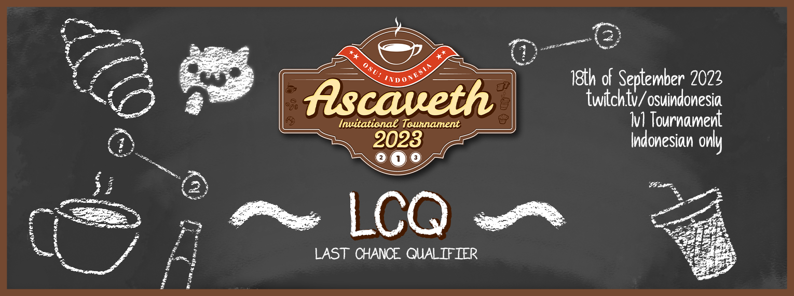
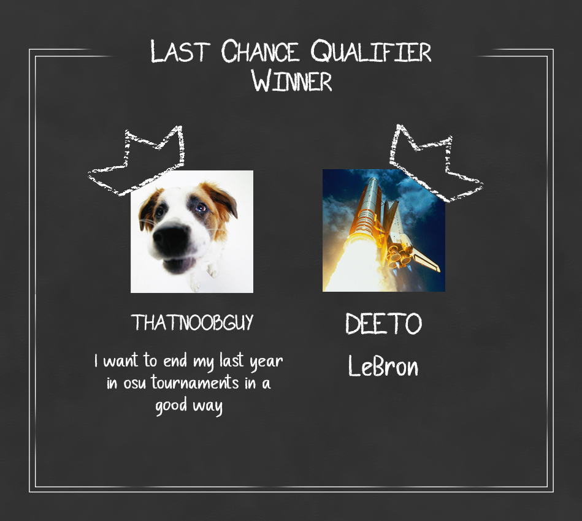
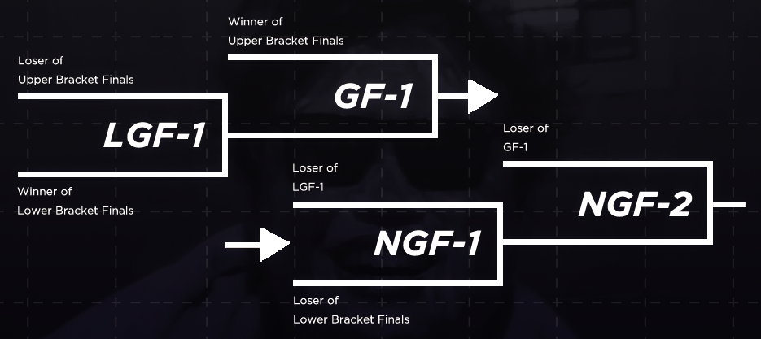

---
tags:
  - AIT2023
  - AIT 2023
  - AIT 2023 LCQ
---

# Ascaveth Invitational Tournament 2023: Last Chance Qualifier

The **Ascaveth Invitational Tournament 2023: Last Chance Qualifier** (***AIT 2023: LCQ***) was an Indonesian double-elimination 1v1 osu! tournament hosted by ::{ flag=ID }:: [Ascaveth](https://osu.ppy.sh/users/3245206). The tournament was open to all players from Indonesia as a way to qualify to the main [Ascaveth Invitational](/wiki/Tournaments/AIT) LAN tournament. It was the first Last Chance Qualifier event to be held in the history of the Ascaveth Invitational Tournament.

## Tournament schedule

| Event | Timestamp |
| --: | :-- |
| Registration phase | 2023-09-01/2023-09-08 |
| Screening phase | 2023-09-09/2023-09-15 |
| Qualifiers | 2023-09-16/2023-09-23 |
| Quarterfinals | 2023-09-24/2023-09-30 |
| Semifinals | 2023-10-01/2023-10-08 |
| Finals | 2023-10-09/2023-10-15 |
| Grand Finals (week 1) | 2023-10-17/2023-10-22 |
| Grand Finals (week 2) | 2023-10-23/2023-10-29 |

## Prizes

The Ascaveth Invitational Tournament 2023: Last Chance Qualifier offered two player spots in the upcoming Ascaveth Invitational Tournament 2023 main event for the winners.

## Organisation

The Ascaveth Invitational Tournament 2023 was run by various osu! community members from Indonesia and beyond.

| Position | Member(s) |
| :-- | :-- |
| Host | ::{ flag=ID }:: [Ascaveth](https://osu.ppy.sh/users/3245206) |
| Admin | ::{ flag=ID }:: [Sunohara Shun](https://osu.ppy.sh/users/3484548), ::{ flag=ID }:: [Crezz](https://osu.ppy.sh/users/7108275), ::{ flag=ID }:: [Niva](https://osu.ppy.sh/users/197805), ::{ flag=ID }:: [Vvn](https://osu.ppy.sh/users/3204677), ::{ flag=ID }:: [Deorum](https://osu.ppy.sh/users/5933031), ::{ flag=ID }:: [Rumberkren](https://osu.ppy.sh/users/3925053), ::{ flag=ID }:: [Genjitsu](https://osu.ppy.sh/users/3531490) |
| Mappool selector | ::{ flag=ID }:: [Sunohara Shun](https://osu.ppy.sh/users/3484548), ::{ flag=ID }:: [Crezz](https://osu.ppy.sh/users/7108275), ::{ flag=ID }:: [fnayR](https://osu.ppy.sh/users/2800253) |
| Mappool helper | ::{ flag=ID }:: [Ascaveth](https://osu.ppy.sh/users/3245206), ::{ flag=ID }:: [Niva](https://osu.ppy.sh/users/197805), ::{ flag=ID }:: [Raids](https://osu.ppy.sh/users/15640966) |
| Custom mapper | ::{ flag=ID }:: [Sunohara Shun](https://osu.ppy.sh/users/3484548), ::{ flag=ID }:: [Crezz](https://osu.ppy.sh/users/7108275), ::{ flag=ID }:: [Raids](https://osu.ppy.sh/users/15640966), ::{ flag=ID }:: [jiwoas](https://osu.ppy.sh/users/10778215) |
| Playtester | ::{ flag=MY }:: [Laphii](https://osu.ppy.sh/users/9364594) |
| Streamer | ::{ flag=ID }:: [Ascaveth](https://osu.ppy.sh/users/3245206), ::{ flag=ID }:: [Victim_Crasher](https://osu.ppy.sh/users/2084869), ::{ flag=MY }:: [Laphii](https://osu.ppy.sh/users/9364594) |
| Commentator | ::{ flag=ID }:: [Ascaveth](https://osu.ppy.sh/users/3245206), ::{ flag=ID }:: [Sunohara Shun](https://osu.ppy.sh/users/3484548), ::{ flag=ID }:: [Niva](https://osu.ppy.sh/users/197805), ::{ flag=ID }:: [Victim_Crasher](https://osu.ppy.sh/users/2084869), ::{ flag=ID }:: [BlankTap](https://osu.ppy.sh/users/10137131), ::{ flag=ID }:: [Seox](https://osu.ppy.sh/users/3793938) |
| Referee | ::{ flag=ID }:: [Intel21](https://osu.ppy.sh/users/1272422), ::{ flag=ID }:: [YaeMyMommy](https://osu.ppy.sh/users/17278897), ::{ flag=ID }:: [lucidators](https://osu.ppy.sh/users/10154981), ::{ flag=ID }:: [-\[ Shinraa \]-](https://osu.ppy.sh/users/26942053), ::{ flag=ID }:: [WoodenPickaxe](https://osu.ppy.sh/users/14463105), ::{ flag=ID }:: [Artaa27](https://osu.ppy.sh/users/12085864) |
| Graphic designer | ::{ flag=ID }:: [Zavier](https://osu.ppy.sh/users/11379592), ::{ flag=ID }:: [Nexa-](https://osu.ppy.sh/users/6155896) |
| Spreadsheet manager | ::{ flag=ID }:: [Sunohara Shun](https://osu.ppy.sh/users/3484548) |
| Wiki editor | ::{ flag=ID }:: [Niva](https://osu.ppy.sh/users/197805) |

## Links

- **[Master spreadsheet](https://docs.google.com/spreadsheets/d/1IUsFvFCPmrbCTLi9a1g3hYi1Y3I1xXuzq675yUcKrN8/edit#gid=0)**
- [Forum thread](https://osu.ppy.sh/community/forums/topics/1816139)
- [Discord server](https://discord.gg/qgD6y8zmq)
- [Livestream channel](https://www.twitch.tv/osuindonesia)
- [Challonge brackets](https://challonge.com/AIT2023LCQ)

## Participants

The full list of participating players can be found in the following [spreadsheet](https://docs.google.com/spreadsheets/d/1IUsFvFCPmrbCTLi9a1g3hYi1Y3I1xXuzq675yUcKrN8/edit#gid=1258671161).

## Podium

## Mappools

### Grand Finals (week 1 and 2)

**[Download the mappack here! (173 MB)](https://mappack.yewonkim.tk/download/UW5DYiyu)**

- NoMod
  1. [sana - Packet Hero (Fuccho) \[Ruthless\]](https://osu.ppy.sh/beatmapsets/404910#osu/880321)
  2. [LeaF - Paraclete (Kroytz) \[Serendipity\]](https://osu.ppy.sh/beatmapsets/455109#osu/975588)
  3. [Mio Yamazaki - Byoushin Zenkai Girl (Sparhten) \[Keep Going Forward\]](https://osu.ppy.sh/beatmapsets/1402550#osu/2893305)
  4. [Function Phantom - Index (feat. Thinktec) (PaRaDogi) \[Halgoh's Extra\]](https://osu.ppy.sh/beatmapsets/1493791#osu/3111046)
  5. [Official HIGE DANdism - Cry Baby (hehe) \[Revenge!\]](https://osu.ppy.sh/beatmapsets/1636657#osu/3340134)  
- Hidden
  1. [Hana to Onyx - Ariadne (Milan-) \[Extra\]](https://osu.ppy.sh/beatmapsets/665886#osu/2228961)
  2. [Kairiki bear feat. Hatsune Miku - BUG (sukii) \[Lost Extra\]](https://osu.ppy.sh/beatmapsets/1796464#osu/4058452)
  3. [ETIA. - Singularity (Realazy) \[pocket's Extra\]](https://osu.ppy.sh/beatmapsets/1271931#osu/3047810)  
- HardRock
  1. [senya - Iro wa Jou e to Izanau (Okoratu) \[Phantasm Stage\]](https://osu.ppy.sh/beatmapsets/1579161#osu/3224506)
  2. [ginkiha, TEA - Haruka (Short Ver.) (Hinsvar) \[Expert\]](https://osu.ppy.sh/beatmapsets/1110461#osu/2320392)
  3. [MYUKKE. - The 89's Momentum (KogumaX) \[slow mapping\]](https://osu.ppy.sh/beatmapsets/1271021#osu/2641328)
- DoubleTime
  1. [YOASOBI - Shukufuku (Kanui) \[Blessing\]](https://osu.ppy.sh/beatmapsets/1891195#osu/3896589)
  2. [fiend - FEVER DREAM (feat. yzzyx) (Niva) \[INSANE\]](https://osu.ppy.sh/beatmapsets/1405913#osu/2916771)
  3. [Electro.muster feat. Rita - Dream Walker (Amamya) \[Collab Insane\]](https://osu.ppy.sh/beatmapsets/1907777#osu/3983420)
  4. [Britney Spears - Toxic (schoolboy) \[Emilia's Expert\]](https://osu.ppy.sh/beatmapsets/1061947#osu/2251926)
- FreeMod
  1. [Irreversible Mechanism - The Agony (Gabdu09) \[Extreme\]](https://osu.ppy.sh/beatmapsets/958345#osu/2006819)
  2. [Hana - Sakura no Uta (PandaHero) \[Extra\]](https://osu.ppy.sh/beatmapsets/1889701#osu/3892194)
  3. [Annabel - lilac slumber -cosmic ver.- (PandaHero) \[fall\]](https://osu.ppy.sh/beatmapsets/1593278#osu/3254177)
  4. [Tokyo Incidents - Jusui Negai -The Suicide- (mnyui) \[Moonlight\]](https://osu.ppy.sh/beatmapsets/1754872#osu/3591270)
- Tiebreaker
  1. **[HISATOMI - lullaby (feat. KIRA) (uet Remix) (she luv lando) \[one more before i go...\]](https://osu.ppy.sh/beatmapsets/1513975#osu/3099626)**

### Finals

**[Download the mappack here! (157 MB)](https://cdn.discordapp.com/attachments/1133393884613980230/1161297170528489595/vance_minta_pack.zip?ex=6537c945&is=65255445&hm=b4d61a7710b14920648f9bd4f6aeb31109b8384a43c811e740d22f9986e3cee6&)**

- NoMod
  1. [paraoka feat. haru*nya - Tyranny (jiwoas) \[sad\]](https://osu.ppy.sh/beatmapsets/2071128#osu/4333632)
  2. [xi - Vanitas (Anxient) \[Vanity of Vanities\]](https://osu.ppy.sh/beatmapsets/1815879#osu/4063445)
  3. [THE BINARY mido - Ego mo Id mo Tanjun ni (kuyusu) \[Expert\]](https://osu.ppy.sh/beatmapsets/1268824#osu/2636826)
  4. [Nekomata Master+ - squall (atlas-) \[lugu's Prodigal Extreme\]](https://osu.ppy.sh/beatmapsets/1783378#osu/3654092)
  5. [Mitsukiyo - Future Bossa (Stompy\_) \[Shurelia Sensei's Special Lesson\]](https://osu.ppy.sh/beatmapsets/1981110#osu/4113746)  
- Hidden
  1. [Yorushika - Yuunagi, Bou, Hana Madoi (Deca) \[Collab Extra\]](https://osu.ppy.sh/beatmapsets/1029377#osu/2152484)
  2. [Misumi - Alter Ego feat. Hatsune Miku (Ryuusei Aika) \[Mono's Extra\]](https://osu.ppy.sh/beatmapsets/1680588#osu/3458266)
  3. [U-ske feat. Natsume Itsuki - Iza, Mairimasu (August) \[Full Bloom Expert\]](https://osu.ppy.sh/beatmapsets/1839317#osu/3777414)  
- HardRock
  1. [May'n - Belief (-Hitomi) \[Believer\]](https://osu.ppy.sh/beatmapsets/1604959#osu/3277371)
  2. [S3RL feat Harri Rush - Nostalgic (Nightcore Mix) (nold\_1702) \[Kloyd's Extra\]](https://osu.ppy.sh/beatmapsets/591442#osu/1308993)
  3. [Kuroneko Dungeon - Ryoushi no Umi no Lindwurm (Crystal) \[Yoru's Expert\]](https://osu.ppy.sh/beatmapsets/405167#osu/890915)
- DoubleTime
  1. [Momokurotei Ichimon - Nippon Egao Hyakkei (alden) \[smile)\]](https://osu.ppy.sh/beatmapsets/1614390#osu/3295947)
  2. [solfa - Battle 3: Shiryoku no Kagiri -The force of mortality- (Lasse) \[Garden's Insane\]](https://osu.ppy.sh/beatmapsets/2042113#osu/4261144)
  3. [Yousei Teikou - Deep Sea (ent) \[Another\]](https://osu.ppy.sh/beatmapsets/1758918#osu/3995918)
  4. [Yasutaka Nakata - Crazy Crazy (feat. Charli XCX & Kyary Pamyu Pamyu) (VINXIS) \[sammish's Another\]](https://osu.ppy.sh/beatmapsets/972538#osu/2043224)
- FreeMod
  1. [Nekrogoblikon - The Skin Thief (LMT) \[SILENCE PLAYER & Hectic's Extra\]](https://osu.ppy.sh/beatmapsets/1061535#osu/2279004)
  2. [Scott Brown - Go Berzerk (Luscent) \[Black Another\]](https://osu.ppy.sh/beatmapsets/1596950#osu/3261566)
  3. [TJ.hangneil - Kamui (Cellina) \[Nasmoeb's SHD\]](https://osu.ppy.sh/beatmapsets/2008761#osu/4181631)
  4. [xi - World Fragments II (PaRaDogi) \[Down's Extra\]](https://osu.ppy.sh/beatmapsets/1666263#osu/3403127)
- Tiebreaker
  1. **[Yousei Teikoku - Fata Morgana (jiwoas) \[Valhalla\]](https://osu.ppy.sh/beatmapsets/2072219#osu/4336505)**

### Semifinals

**[Download the mappack here! (163 MB)](https://mappack.yewonkim.tk/download/G9JGONqi)**

- NoMod
  1. [LiSA - Mitsu (Dailycare) \[Heartbroken\]](https://osu.ppy.sh/beatmapsets/1799512#osu/3862258)
  2. [Raimukun - Myths Orbis (knowledgeking) \[morphne & Winter's Extra\]](https://osu.ppy.sh/beatmapsets/1889095#osu/4212326)
  3. [ZUTOMAYO - Haze Haseru Hateru made (Petal) \[ELNXZTIBDVS\]](https://osu.ppy.sh/beatmapsets/1425901#osu/2936071)
  4. [Kamome Sano - init() (Raids) \[gelar binus tapi butuh waktu proses 6 bulan @pmy ngakak dlu g sih\]](https://osu.ppy.sh/beatmapsets/2068310#osu/4327518)
  5. [Kuriyama Yuri - Purple hype (Ryuusei Aika) \[Show on\]](https://osu.ppy.sh/beatmapsets/1598298#osu/3264168)  
- Hidden
  1. [sasakure.UK - Decadence feat. mami (Agatsu) \[Vanquish\]](https://osu.ppy.sh/beatmapsets/1719345#osu/3513644)
  2. [pazi - Shoujorei (Kawashiro) \[That summer, I was always with you.\]](https://osu.ppy.sh/beatmapsets/1769050#osu/3733503)
  3. [Power Of Nature - Shounen wa Sora o Tadoru (CallieCube) \[Gordon's Expert\]](https://osu.ppy.sh/beatmapsets/1373545#osu/3207766)  
- HardRock
  1. [majiko - Inochi ni Kirawarete Iru. (banter) \[Resentment\]](https://osu.ppy.sh/beatmapsets/1907609#osu/3933678)
  2. [Mitsukiyo - Hifumi Daisuki (Sunohara Shun) \[hifumi jatoh ft. Crezz\]](https://osu.ppy.sh/beatmapsets/2068451#osu/4327800)
  3. [A.SAKA - Nanatsu Momijiakari (xLolicore-) \[LCFC's Extra\]](https://osu.ppy.sh/beatmapsets/768281#osu/1615853)
- DoubleTime
  1. [WEAVER - Kuchizuke Diamond (-Mikan) \[Dailycare's Special\]](https://osu.ppy.sh/beatmapsets/1051509#osu/2251196)
  2. [HyuN - Infinity Heaven (Niva) \[Mirash's Insane\]](https://osu.ppy.sh/beatmapsets/891345#osu/1863248)
  3. [P4koo - Forbidden Light (Gibune) \[Insane\]](https://osu.ppy.sh/beatmapsets/1279878#osu/2666657)
  4. [Eiko Shimamiya - Super scription of data (itay) \[Happy Denouement\]](https://osu.ppy.sh/beatmapsets/1999609#osu/4156946)
- FreeMod
  1. [Minstrel - Yotogibanashi no Kamikakushi (Luscent) \[allein's Dromedary Extra\]](https://osu.ppy.sh/beatmapsets/1907639#osu/4017108)
  2. [Minamotoya feat. Kuroa* - Hana Kagerou (404 AimNotFound) \[Yokes' Expert\]](https://osu.ppy.sh/beatmapsets/929130#osu/1945907)
  3. [mafumafu - Kakushigoto (Vert) \[Pururut's Expert.\]](https://osu.ppy.sh/beatmapsets/770023#osu/1618985)
  4. [NIWASHI - The Fascinating Cat's Eye (Flask) \[Staccato\]](https://osu.ppy.sh/beatmapsets/1710885#osu/3495841)
- Tiebreaker
  1. **[Sally - Remind (Crezz) \[Petals\]](https://osu.ppy.sh/beatmapsets/1643693#osu/3355005)**

### Quarterfinals

**[Download the mappack here! (164 MB)](https://mappack.yewonkim.tk/download/3kFOKB89)**

- NoMod
  1. [millennium parade x Sheena Ringo - WORK (AirinCat) \[Paradise\]](https://osu.ppy.sh/beatmapsets/1967160#osu/4079711)
  2. [cosMo@BousouP - 25-ji 76-pun Hatsu \<\<Ryouiki Gai\>\> Iki Saishuu Ressha (Sagon) \[Divinity\]](https://osu.ppy.sh/beatmapsets/1807738#osu/3707400)
  3. [hitorie - Nichijou to Chikyuu no Gakubuchi (wowaka x Hatsune Miku Edit) (flake) \[phynta's extra\]](https://osu.ppy.sh/beatmapsets/1985060#osu/4222042)
  4. [Silentroom - Nhelv (iZolo) \[Shiraya Sayuki's Extra\]](https://osu.ppy.sh/beatmapsets/1869403#osu/3846203)
  5. [GRANRODEO - Can Do (TV Size) (Monstrata) \[Extra: Kuroko\]](https://osu.ppy.sh/beatmapsets/493273#osu/1050582)  
- Hidden
  1. [JIN - Additional Memory (Ilay) \[Len's Classic Extra\]](https://osu.ppy.sh/beatmapsets/1521890#osu/3173897)
  2. [yanaginagi - continue (yanaginagi1) \[Fantasy!\]](https://osu.ppy.sh/beatmapsets/1701725#osu/3815518)
  3. [seatrus - Night Thea+er Etude (Mir) \[Extra\]](https://osu.ppy.sh/beatmapsets/1667219#osu/3404214)  
- HardRock
  1. [MY FIRST STORY - Fukagyaku Replace (Nevo) \[Fudosu's Extra\]](https://osu.ppy.sh/beatmapsets/1198125#osu/2669351)
  2. [Ryu\* - Mind Mapping (kors k mix) (AJT) \[yf's Expert\]](https://osu.ppy.sh/beatmapsets/1774369#osu/3971015)
  3. [Function Phantom - Paradox (Cubby) \[Down's Extra\]](https://osu.ppy.sh/beatmapsets/1701204#osu/3478971)
- DoubleTime
  1. [TRUE - DREAM SOLISTER (Azunyan-) \[Insane\]](https://osu.ppy.sh/beatmapsets/967875#osu/2026140)
  2. [HHHxMMxST - Oboro (jordanlr7) \[Insane\]](https://osu.ppy.sh/beatmapsets/1536560#osu/3575906)
  3. [ALiCE'S EMOTiON - LUNA (Frostmourne) \[Insane\]](https://osu.ppy.sh/beatmapsets/47124#osu/152179)
  4. [Hiroyuki Sawano - BLOWIN' (ktgster) \[Insane\]](https://osu.ppy.sh/beatmapsets/560165#osu/1185385)
- FreeMod
  1. [xi - Glorious Crown (Monstrata) \[Atsuro's Extra\]](https://osu.ppy.sh/beatmapsets/558694#osu/1188172)
  2. [Hana - DearMyFriend (subahibi) \[Sakura no hanabira\]](https://osu.ppy.sh/beatmapsets/1758508#osu/3686513)
  3. [Kenji Ohtsuki to Zetsubou Shoujotachi - Ringo Mogire Beam! (TV Size) (app) \[sentrimaro koue x katayama nomadic collab\]](https://osu.ppy.sh/beatmapsets/1951966#osu/4042177)
  4. [NIWASHI - Y (Down) \[PaRaDogi's Extra\]](https://osu.ppy.sh/beatmapsets/1689372#osu/3455084)
- Tiebreaker
  1. **[RIN - Pluto -Tenderness (My Angel Azusa) \[Hades in the Heaven\]](https://osu.ppy.sh/beatmapsets/573313#osu/1241443)**

### Qualifiers

**[Download the mappack here! (91 MB)](https://mappack.yewonkim.tk/download/9gryzxy5)**

- NoMod
  1. [Rib - Tsukiakari (-Zel) \[Lux Lunae\]](https://osu.ppy.sh/beatmapsets/1688783#osu/3451160)
  2. [UNDEAD CORPORATION - Evil But Innocent (Inst. Ver.) (GYGY) \[Extreme\]](https://osu.ppy.sh/beatmapsets/1753958#osu/3589449)
  3. [BlackY - Sakura Ranman Cleopatra (Down) \[Extra\]](https://osu.ppy.sh/beatmapsets/1595193#osu/3258136)
  4. [onoken - felys final remix (xbopost) \[Expert\]](https://osu.ppy.sh/beatmapsets/1318293#osu/2731087)
- Hidden
  1. [Wakeshima Kanon - Tsukinami (Ayana) \[jasontime's Expert\]](https://osu.ppy.sh/beatmapsets/908939#osu/3167412)
  2. [Jakarta Funk Brothers - INSOMNIA (AJT) \[Extrane\]](https://osu.ppy.sh/beatmapsets/1689665#osu/3460058)
- HardRock
  1. [Sakamoto Maaya - Yakudou (Big Sis) \[Flame Haze's Extra\]](https://osu.ppy.sh/beatmapsets/1868330#osu/4084868)
  2. [TJ.hangneil - Apollo (kiddly) \[Necho's Extra\]](https://osu.ppy.sh/beatmapsets/1650673#osu/3534594)
- DoubleTime
  1. [Yasuda Mizuho - Yoake no Bell ga Naru (kowari) \[Insane\]](https://osu.ppy.sh/beatmapsets/1036799#osu/2171641)
  2. [3L - Spring of Dreams (Trust) \[Lunatic\]](https://osu.ppy.sh/beatmapsets/739119#osu/1559749)
  3. [yanaginagi - Tokohana (Atipir) \[Heilia & Atipir's Platonic Collab Insane\]](https://osu.ppy.sh/beatmapsets/1798429#osu/3689495)

## Match results

### Grand Finals (week 2)

Sunday, 29 October 2023:

| Match code | Player 1 |  |  | Player 2 | Match link |
| :-: | --: | :-: | :-: | :-- | :-- |
| NGF-1 | **[Rosemi Lovelock](https://osu.ppy.sh/users/1987591)** ::{ flag=ID }:: | **7** | 5 | ::{ flag=ID }:: [DeathHydra](https://osu.ppy.sh/users/7457788) | [#1](https://osu.ppy.sh/community/matches/111072284) |

Monday, 30 October 2023:

| Match code | Player 1 |  |  | Player 2 | Match link |
| :-: | --: | :-: | :-: | :-- | :-- |
| NGF-2 | **[DEETO](https://osu.ppy.sh/users/7457788)** ::{ flag=ID }:: | **7** | 0 | ::{ flag=ID }:: [Rosemi Lovelock](https://osu.ppy.sh/users/1987591) | [#1](https://osu.ppy.sh/community/matches/111099149) |

::{ flag=ID }:: ***[DEETO](https://osu.ppy.sh/users/7457788)** went on to qualify for the Ascaveth Invitational Tournament 2023 as the second winner of the Last Chance Qualifier.*

### Grand Finals (week 1)

Saturday, 21 October 2023:

| Match code | Player 1 |  |  | Player 2 | Match link |
| :-: | --: | :-: | :-: | :-- | :-- |
| LGF-1 | [DeathHydra](https://osu.ppy.sh/users/7457788) ::{ flag=ID }:: | 1 | **7** | ::{ flag=ID }:: **[DEETO](https://osu.ppy.sh/users/7457788)** | [#1](https://osu.ppy.sh/community/matches/110970349) |

Sunday, 22 October 2023:

| Match code | Player 1 |  |  | Player 2 | Match link |
| :-: | --: | :-: | :-: | :-- | :-- |
| GF-1 | **[ThatNOOBGuy](https://osu.ppy.sh/users/11091594)** ::{ flag=ID }:: | **7** | 5 | ::{ flag=ID }:: [DEETO](https://osu.ppy.sh/users/7457788) | [#1](https://osu.ppy.sh/community/matches/110986762) |

::{ flag=ID }:: ***[ThatNOOBGuy](https://osu.ppy.sh/users/11091594)** went on to qualify for the Ascaveth Invitational Tournament 2023 as the first winner of the Last Chance Qualifier.*

### Finals

Saturday, 14 October 2023:

| Bracket | Player 1 |  |  | Player 2 | Match link |
| :-: | --: | :-: | :-: | :-- | :-- |
| Upper | **[ThatNOOBGuy](https://osu.ppy.sh/users/11091594)** ::{ flag=ID }:: | **7** | 1 | ::{ flag=ID }:: [DeathHydra](https://osu.ppy.sh/users/7457788) | [#1](https://osu.ppy.sh/community/matches/110871694) |
| Lower | **[DEETO](https://osu.ppy.sh/users/7457788)** ::{ flag=ID }:: | **7** | 0 | ::{ flag=ID }:: [XenoitesBadPog](https://osu.ppy.sh/users/11461426) | [#1](https://osu.ppy.sh/community/matches/110876209) |
| Lower | **[Rosemi Lovelock](https://osu.ppy.sh/users/1987591)** ::{ flag=ID }:: | **7** | 0 | ::{ flag=ID }:: [BlankTap](https://osu.ppy.sh/users/10137131) | *win by default* |

Sunday, 15 October 2023:

| Bracket | Player 1 |  |  | Player 2 | Match link |
| :-: | --: | :-: | :-: | :-- | :-- |
| Lower | [Rosemi Lovelock](https://osu.ppy.sh/users/1987591) ::{ flag=ID }:: | 1 | **7** | ::{ flag=ID }:: **[DEETO](https://osu.ppy.sh/users/7457788)** | [#1](https://osu.ppy.sh/community/matches/110892709) |

### Semifinals

Saturday, 7 October 2023:

| Bracket | Player 1 |  |  | Player 2 | Match link |
| :-: | --: | :-: | :-: | :-- | :-- |
| Lower | [Ninomae Ina-nis](https://osu.ppy.sh/users/11983229) ::{ flag=ID }:: | 5 | **6** | ::{ flag=ID }:: **[BlankTap](https://osu.ppy.sh/users/10137131)** | [#1](https://osu.ppy.sh/community/matches/110774274) |
| Upper | **[ThatNOOBGuy](https://osu.ppy.sh/users/11091594)** ::{ flag=ID }:: | **6** | 0 | ::{ flag=ID }:: [DEETO](https://osu.ppy.sh/users/7457788) | *win by default* |

Sunday, 8 October 2023:

| Bracket | Player 1 |  |  | Player 2 | Match link |
| :-: | --: | :-: | :-: | :-- | :-- |
| Upper | [Rosemi Lovelock](https://osu.ppy.sh/users/1987591) ::{ flag=ID }:: | 4 | **6** | ::{ flag=ID }:: **[DeathHydra](https://osu.ppy.sh/users/7457788)** | [#1](https://osu.ppy.sh/community/matches/110795862) |
| Lower | [Suikami](https://osu.ppy.sh/users/1929336) ::{ flag=ID }:: | 5 | **6** | ::{ flag=ID }:: **[XenoitesBadPog](https://osu.ppy.sh/users/11461426)** | [#1](https://osu.ppy.sh/community/matches/110796867) |

### Quarterfinals

Saturday, 30 September 2023:

| Bracket | Player 1 |  |  | Player 2 | Match link |
| :-: | --: | :-: | :-: | :-- | :-- |
| Upper | **[DeathHydra](https://osu.ppy.sh/users/7457788)** ::{ flag=ID }:: | **6** | 2 | ::{ flag=ID }:: [XenoitesBadPog](https://osu.ppy.sh/users/11461426) | [#1](https://osu.ppy.sh/community/matches/110677568) |
| Upper | **[DEETO](https://osu.ppy.sh/users/7457788)** ::{ flag=ID }:: | **6** | 0 | ::{ flag=ID }:: [BlankTap](https://osu.ppy.sh/users/11461426) | [#1](https://osu.ppy.sh/community/matches/110677568) |
| Upper | **[ThatNOOBGuy](https://osu.ppy.sh/users/11091594)** ::{ flag=ID }:: | **6** | 0 | ::{ flag=ID }:: [Ninomae Ina-nis](https://osu.ppy.sh/users/11983229) | *win by default* |

Sunday, 1 October 2023:

| Bracket | Player 1 |  |  | Player 2 | Match link |
| :-: | --: | :-: | :-: | :-- | :-- |
| Upper | **[Rosemi Lovelock](https://osu.ppy.sh/users/1987591)** ::{ flag=ID }:: | **6** | 2 | ::{ flag=ID }:: [Suikami](https://osu.ppy.sh/users/1929336) | [#1](https://osu.ppy.sh/community/matches/110698374) |

### Qualifiers

The detailed standings for the Qualifier stage can be found in the following [spreadsheet](https://docs.google.com/spreadsheets/d/1QRFSqm6Ww_DTAId1VguAvN_VAW_tr1T83QNtTvJtyUI/edit#gid=736924332). 

| Seed No. | Player | Z-Sum |
| :-: | :-- | :-- |
| 1 | ::{ flag=ID }:: **[ThatNOOBGuy](https://osu.ppy.sh/users/11091594)** | 9.84 |
| 2 | ::{ flag=ID }:: **[Rosemi Lovelock](https://osu.ppy.sh/users/1987591)** | 8.70 |
| 3 | ::{ flag=ID }:: **[DeathHydra](https://osu.ppy.sh/users/7457788)** | 7.91 |
| 4 | ::{ flag=ID }:: **[DEETO](https://osu.ppy.sh/users/10069909)** | 7.49 |
| 5 | ::{ flag=ID }:: **[BlankTap](https://osu.ppy.sh/users/10137131)** | 7.24 |
| 6 | ::{ flag=ID }:: **[XenoitesBadPog](https://osu.ppy.sh/users/11461426)** | 7.09 |
| 7 | ::{ flag=ID }:: **[Suikami](https://osu.ppy.sh/users/1929336)** | 6.76 |
| 8 | ::{ flag=ID }:: **[Ninomae Ina-nis](https://osu.ppy.sh/users/11983229)** | 6.59 |
| 9 | ::{ flag=ID }:: [MejiroMcQueen](https://osu.ppy.sh/users/11320627) | 6.55 |
| 10 | ::{ flag=ID }:: [Anhydrous](https://osu.ppy.sh/users/11272510) | 5.92 |
| 11 | ::{ flag=ID }:: [Caruma](https://osu.ppy.sh/users/13187450) | 5.80 |
| 12 | ::{ flag=ID }:: [Kirinagi](https://osu.ppy.sh/users/5937545) | 5.25 |
| 13 | ::{ flag=ID }:: [timing](https://osu.ppy.sh/users/12763134) | 5.03 |
| 14 | ::{ flag=ID }:: [\[u\_u\]](https://osu.ppy.sh/users/8688737) | 4.97 |
| 15 | ::{ flag=ID }:: [Sirius Symboli](https://osu.ppy.sh/users/11025519) | 4.48 |
| 16 | ::{ flag=ID }:: [Seox](https://osu.ppy.sh/users/3793938) | 3.23 |
| 17 | ::{ flag=ID }:: [MaxNoLimit](https://osu.ppy.sh/users/13415030) | 2.65 |
| 18 | ::{ flag=ID }:: [GabenRipAim](https://osu.ppy.sh/users/19036792) | 1.22 |
| 19 | ::{ flag=ID }:: [NasiGaPakeNasi](https://osu.ppy.sh/users/17519250) | 1.14 |
| 20 | ::{ flag=ID }:: [Alvin\_Gaming](https://osu.ppy.sh/users/29999134) | 0.70 |

## Ruleset

### General rules

1. Beatmap scoring is based on **[ScoreV2](/wiki/Gameplay/Score#scorev2).**
2. The mappools for each round will be announced by the tournament management in advance before the actual matches take place.
3. Match schedules will be predetermined by the tournament management. If there are any players who are unable to attend the current schedule for any reason, all other affected players may apply and settle for a reschedule at the `#reschedule` channel in the tournament's Discord server.
4. A referee will create a multiplayer room 10 minutes in advance and will start to send out invites.
5. If a player does not show up within **10 minutes** of the start time, their opponent wins by default.
6. If no staff or referee is available, the match will be postponed.
7. **NoFail will be enforced in all beatmaps.** This is to ensure that the points are to be awarded more fairly towards players who perform better in general during the course of the beatmap regardless of their remaining health at the end.
8. If a player disconnects, it will be treated as if they had failed the beatmap.
   - A match can be rematched for disconnects that occur within a few seconds after the beatmap has been started by the referee.
9. Lag is not a valid reason to nullify a beatmap.
10. If any problems during the match occur, the tournament management will make a decision based on the referee's report.
11. It is expected that all players be polite and respectful to each other. Penalties will be given upon violation.
    - If a player is found to be engaging in an act that is deemed to be distasteful or provocative, the corresponding player may be disqualified right away from the tournament and/or blacklisted from future iterations of the tournament by the tournament management.
    - Usage of any tools or programs that are against the [osu! community rules](/wiki/Rules#community-rules) is strictly prohibited and will be straight up reported to the osu! team at will.

### Tournament registration

1. All interested players are required to register into the tournament individually through [this form](https://forms.gle/eqK3fzt1XcvCpAc88).
   - In order to be eligible to play in the tournament, a player must have the ::{ flag=ID }:: Indonesian flag displayed on their profile.
2. To ensure that all incoming registrations are serious and valid, every registered player will be checked in detail by the tournament management.
3. The list of players who are deemed to be eligible to compete in the tournament will be published by the tournament management after the registration phase has ended.
4. The following players are not eligible to participate in the Last Chance Qualifier as they have managed to qualify into Ascaveth Invitational Tournament 2023 through other means:
   - ::{ flag=ID }:: **[Hakui Koyori](https://osu.ppy.sh/users/10717635)** (*[Ascaveth Invitational Tournament 2022](/wiki/Tournaments/AIT/2022) winner*)
   - ::{ flag=ID }:: **[Skydiver](https://osu.ppy.sh/users/4750008)** (*[Ascaveth Invitational Tournament 2022](/wiki/Tournaments/AIT/2022) runner-up*)
   - ::{ flag=ID }:: **[lifeline](https://osu.ppy.sh/users/11367222)** (*[osu! Indonesia Tournament #13 (2023)](/wiki/Tournaments/OIT/2023) winner*)
   - ::{ flag=ID }:: **[rHO](https://osu.ppy.sh/users/1629553)** (*[osu! Indonesia Tournament #13 (2023)](/wiki/Tournaments/OIT/2023) runner-up*)
   - ::{ flag=ID }:: **[NazunaAmemiya](https://osu.ppy.sh/users/12159899)** (*[osu! Indonesia Tournament #13 (2023)](/wiki/Tournaments/OIT/2023) 3rd-place finisher*)
   - ::{ flag=ID }:: **[Fuma](https://osu.ppy.sh/users/1501956)** (*[osu! Indonesia Tournament #13 (2023)](/wiki/Tournaments/OIT/2023) best non-podium finisher*)
5. Testplayers, referees, custom mappers, and mappool selectors may also not participate as players in this tournament.
6. By registering, each player acknowledges that they are willing and able to participate in the upcoming Ascaveth Invitational Tournament 2023 in person should they qualify from the Last Chance Qualifier.

### Round-specific rules

#### Qualifier rules

1. Each player will have to sign up to one of the Qualifier lobbies that have been scheduled and prepared by the tournament management in advance.
2. In the lobby, all players will have to consecutively play all of the eleven Qualifier beatmaps in the order of NM1 -> NM2 -> NM3 -> NM4 -> HD1 -> HD2 -> HR1 -> HR2 -> DT1 -> DT2 -> DT3.
3. Players **are not allowed** to ban any beatmaps in the Qualifiers.
4. Players **are not allowed** to join (or register for) more than one Qualifier lobby.
5. Based on their performance in the Qualifier, players will be ranked based on their Z-Sum value (which is the total amount of Z-Score across all eleven Qualifier beatmaps). A brief explanation on the concept of Z-Sum and Z-Score can be found [here](http://www.statisticshowto.com/probability-and-statistics/z-score/).
6. 8 players with the **highest Z-Sum value** will advance to the knock-out stages. 
   - If there are two (or more) players who share the same Z-Sum value, the player that holds the higher total score combined from all ten Qualifier beatmaps will be placed in the higher seed.
7. Failure to attend in any of the predetermined Qualifier lobbies will result in an instant elimination from the tournament.

#### Knock-out stage rules

1. The 16 players who managed to get through from the Qualifiers will be matched to each other based on their Qualifier seeding.
2. Players will compete against each other using a **modified** double-elimination system.
3. The modified double-elimination system works as follows:
   - Players who lose in the upper bracket can still play again in the lower bracket.
   - Players who lose in the lower bracket will be eliminated from the tournament.
   - In the Grand Finals, instead of the usual bracket reset system, the remaining players will be competing in the following bracket:
   
   - The winner of the matches `GF-1` and `NGF-2` will qualify into Ascaveth Invitational Tournament 2023.   
4. Players who can compete in the next round are determined by:
   - In the Quarterfinals and the Semifinals, each player needs to win 6 points in order to win a match. (Best of 11)
   - In the Finals and both of the Grand Finals weeks, each player needs to win 7 points in order to win a match. (Best of 13)
   - Whether there are players who are declared to win the match by default.
   - Whether there are players who are disqualified from the tournament.

### Match regulations

1. Each player must use the `!roll` command once in the multiplayer lobby in order to determine the banning and picking order.
   - The winner of the `!roll` gets to determine who gets the first pick and the second ban.
   - The loser of the `!roll` gets the opposite by default.
   - This rule does not apply in the Qualifier lobbies.
2. Each player has to ban **two beatmaps** from the corresponding mappool. These beatmaps will not be allowed to be picked by any player during the entire match.
   - Barring the tiebreaker, there are no restrictions as to which maps may and may not be banned in a match.
   - Banning does not apply in the Qualifier lobbies.
3. **There will be no warm-up beatmaps to be played in the multiplayer lobby.** Players who are looking to warm up before the match are expected to do so by their own before the match commences.
4. In a FreeMod pick, each player has to apply at least one mod to play the beatmap with. Allowed mods are Easy, HardRock, Hidden, or any possible combinations of the three mods.
   - Playing a FreeMod pick without any mods applied is not allowed.
   - Players opting to play with Easy will have their scores multiplied by `x1.85` up to a maximum of 900,000 points.
5. In the case of a tiebreaker, the tiebreaker map will be played with the FreeMod option enabled which allows players to play the tiebreaker map with Easy, HardRock, Hidden, or any possible combinations of the three mods should they wish to.
   - Playing the tiebreaker map with a mod is *not* mandatory.
6. The results of each match and any other relevant information regarding the match will be noted by the referee after the match has been concluded.
